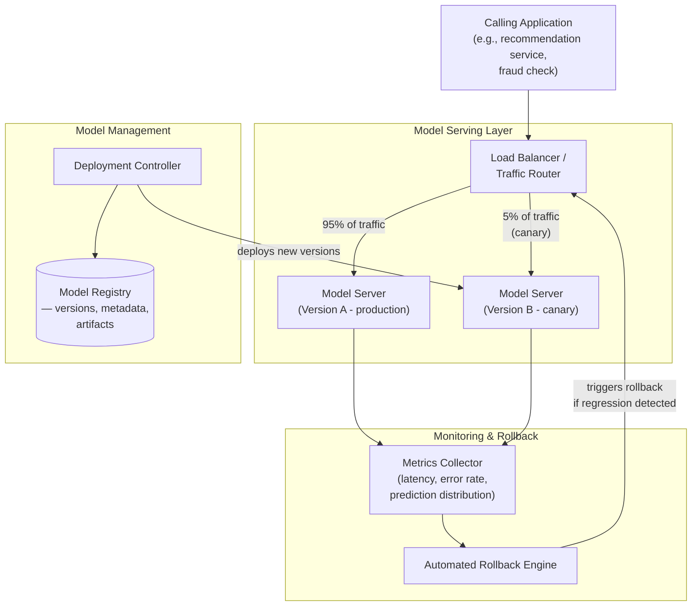
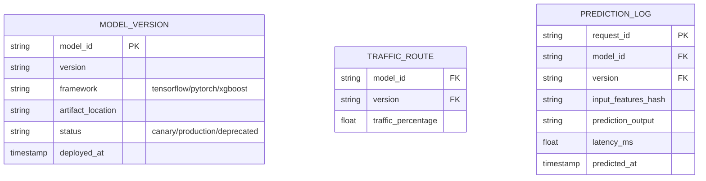
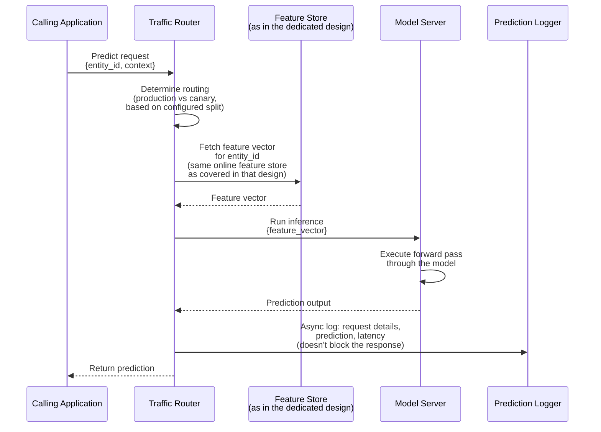
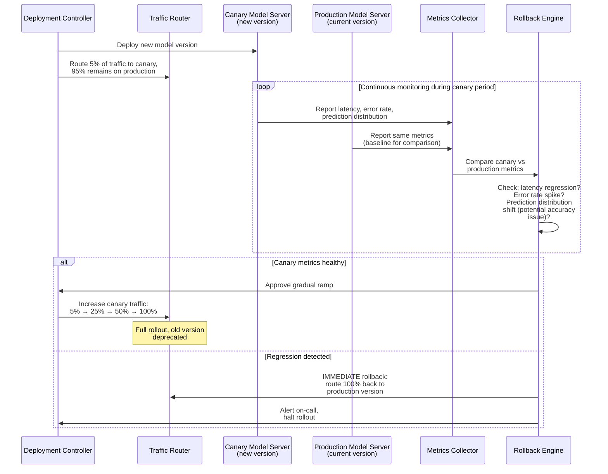
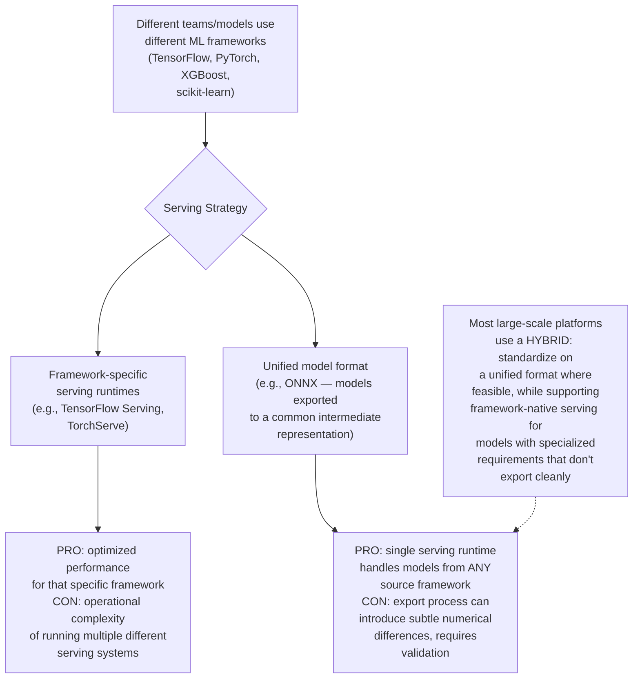
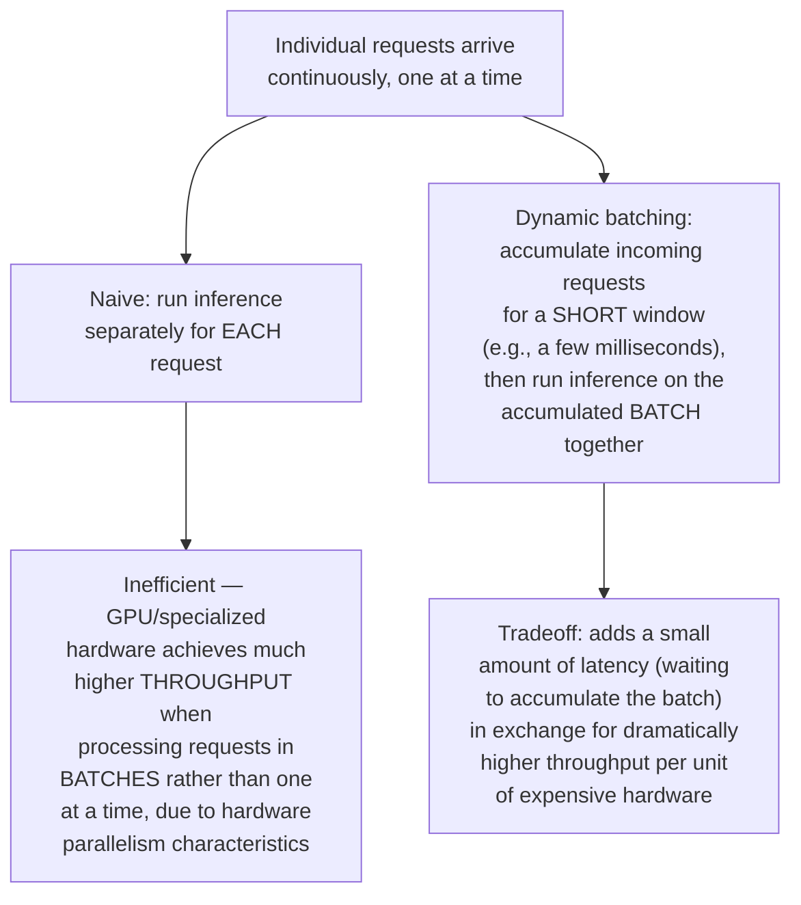
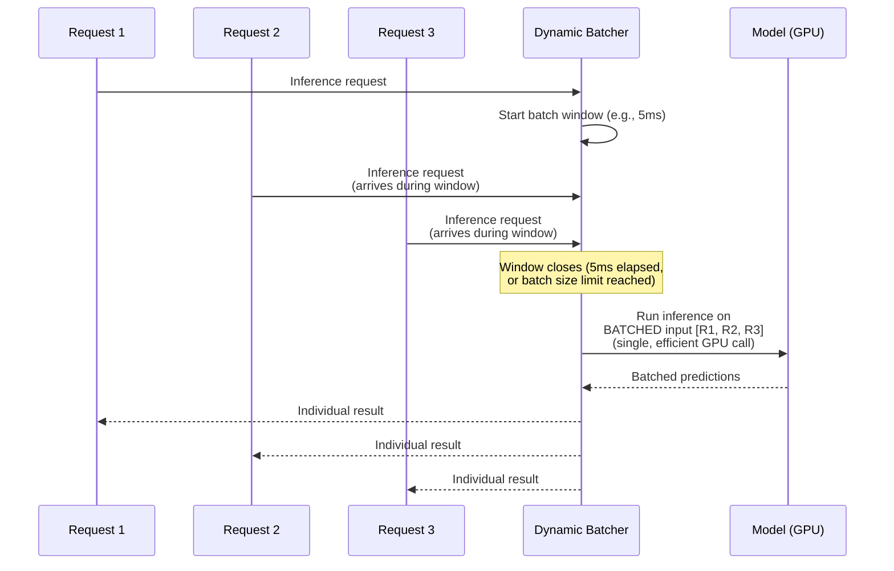
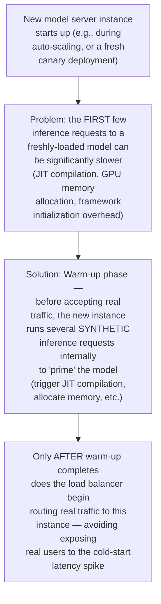
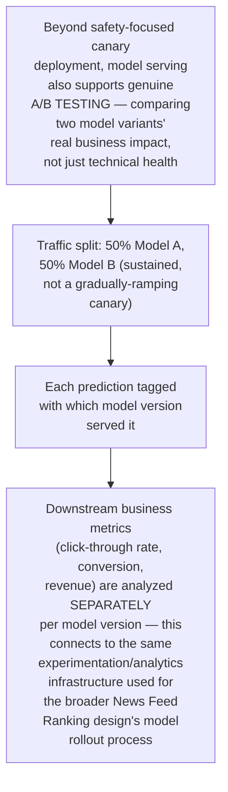
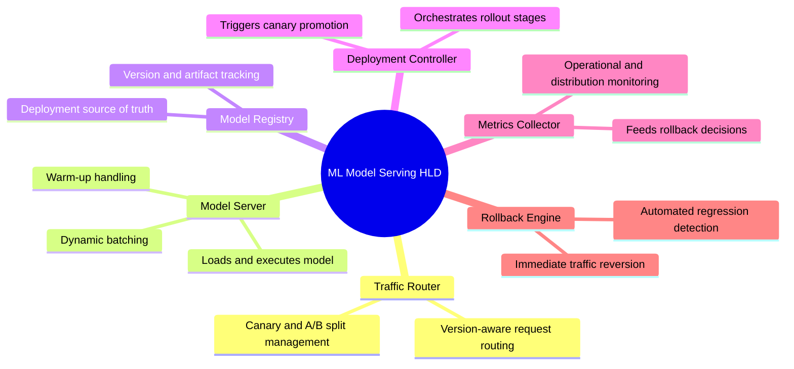

# Design a Real-Time ML Model Serving System — High-Level Design Document

## 1. Requirements

### Functional Requirements
- Serve real-time predictions from trained ML models via a low-latency API
- Support multiple model versions running simultaneously (for A/B testing and gradual rollout)
- Support canary/gradual rollout of new model versions with automated rollback on regression
- Support multiple model types/frameworks (not locked to a single ML framework)

### Non-Functional Requirements
- **Low inference latency:** Must fit within the caller's overall latency budget (often tens of milliseconds)
- **High availability:** Model serving is often on the critical path of user-facing features (recommendations, fraud checks, ranking) — cannot be a fragile single point of failure
- **Safe rollout:** A newly deployed model with a subtle bug (degraded accuracy, or an outright bug) must be caught and rolled back BEFORE it causes wide business impact
- **Resource efficiency:** GPU/specialized inference hardware is expensive — must be utilized efficiently, not provisioned wastefully

### Back-of-Envelope Estimation
| Metric | Value |
|---|---|
| Inference requests/sec (platform-wide) | Tens of thousands to millions, depending on use case |
| Latency budget per inference | 10-50ms typical for synchronous use cases |
| Model versions active simultaneously | Multiple (production + canary + A/B variants) |
| Model size | KBs (simple models) to GBs (large deep learning models) |

---

## 2. High-Level Architecture

**Key idea:** Multiple model versions run SIMULTANEOUSLY behind a traffic-splitting router — this is what enables canary deployment (a small traffic percentage validates a new model in production before full rollout) and A/B testing (comparing model variants' real business impact), rather than the risky all-or-nothing approach of deploying a new model directly to 100% of traffic.

---

## 3. Data Model

---

## 4. Real-Time Inference Flow — Detailed Sequence

---

## 5. Canary Deployment & Automated Rollback — Detailed Sequence

**Why prediction distribution shift matters as a monitoring signal, not just latency/errors:** A buggy model can be perfectly fast and never throw errors, while still producing SYSTEMATICALLY WRONG predictions (e.g., a fraud model that suddenly scores everything as low-risk due to a feature pipeline bug) — monitoring the STATISTICAL DISTRIBUTION of predictions (not just operational health metrics) is essential for catching this class of silent correctness regression that pure infrastructure monitoring would completely miss.

---

## 6. Multi-Framework Model Serving

---

## 7. Handling High-Throughput via Batching

**Why this specific tradeoff (small added latency for large throughput gain) is usually worth it:** For GPU-backed inference specifically, the overhead of launching a single-item computation is often comparable to launching a much larger batch — meaning batching can improve throughput by 10-50x+ for only a few milliseconds of added latency, a highly favorable tradeoff when the per-request latency budget has room to spare.

---

## 8. Model Warm-Up (Avoiding Cold-Start Latency)

---

## 9. A/B Testing Integration

---

## 10. Component Responsibilities Summary

---

## 11. Key Design Decisions & Tradeoffs

| Decision | Choice | Why |
|---|---|---|
| Deployment strategy | Canary with gradual ramp, automated rollback | Catches regressions on a small fraction of traffic before they cause wide business impact, without requiring risky all-or-nothing deployment |
| Monitoring scope | Both operational metrics AND prediction distribution | Operational health alone misses silent correctness regressions (fast, error-free, but systematically wrong predictions) |
| Throughput optimization | Dynamic batching | Achieves dramatically higher inference throughput on specialized hardware for a small, usually-acceptable latency cost |
| Framework support | Hybrid — unified format where feasible, framework-native where needed | Balances operational simplicity against supporting the full range of model types teams actually need to deploy |
| Cold-start handling | Explicit warm-up phase before accepting traffic | Prevents new instances (from scaling or deployment) from exposing real users to elevated first-request latency |
| Rollout vs experimentation | Same infrastructure serves both canary safety checks and genuine A/B testing | Traffic-splitting and per-version tracking are the shared underlying mechanism for both distinct use cases |

---

## 12. Bottlenecks & Scaling Considerations

- **GPU/specialized hardware cost and utilization** — inference hardware is expensive; dynamic batching, careful instance sizing, and potentially multi-model serving on shared hardware (for models too small to justify dedicated GPU allocation) are all important levers for cost efficiency at scale.
- **Feature fetching latency as a hidden bottleneck** — as shown in the inference flow, the feature store lookup often takes as long as or longer than the model inference itself; overall serving latency optimization must consider the ENTIRE request path, not just the model execution step in isolation.
- **Rollback decision latency vs statistical confidence** — detecting a genuine regression (vs normal statistical noise) requires enough canary traffic volume to be confident; for low-traffic models, this can mean either accepting slower rollback decisions or extending canary duration, a real tradeoff between deployment velocity and statistical rigor.
- **Model size and loading time** — very large models (multi-GB deep learning models) can take significant time to load into memory/GPU during deployment or auto-scaling events; needs to be factored into both deployment planning and auto-scaling responsiveness expectations.
- **Multi-model resource contention** — running many different models simultaneously on shared infrastructure (common for cost efficiency) risks one model's traffic spike degrading performance for co-located models; requires careful resource isolation/quotas, similar in spirit to the noisy-neighbor concerns in the Multi-Tenant SaaS Database design.
- **Prediction logging volume** — logging every single prediction (for monitoring, debugging, and potential future retraining data) at high request volume generates substantial data; needs the same tiered storage and sampling considerations as other high-volume logging systems covered elsewhere (e.g., the Log Aggregation design).
- **Version proliferation over time** — without active lifecycle management, the number of "still technically deployed" model versions can grow indefinitely as new versions are continuously shipped; requires clear deprecation policies and cleanup processes to avoid unbounded operational complexity and resource waste from long-abandoned versions still consuming serving capacity.
