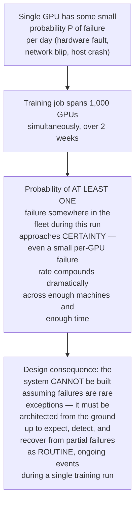
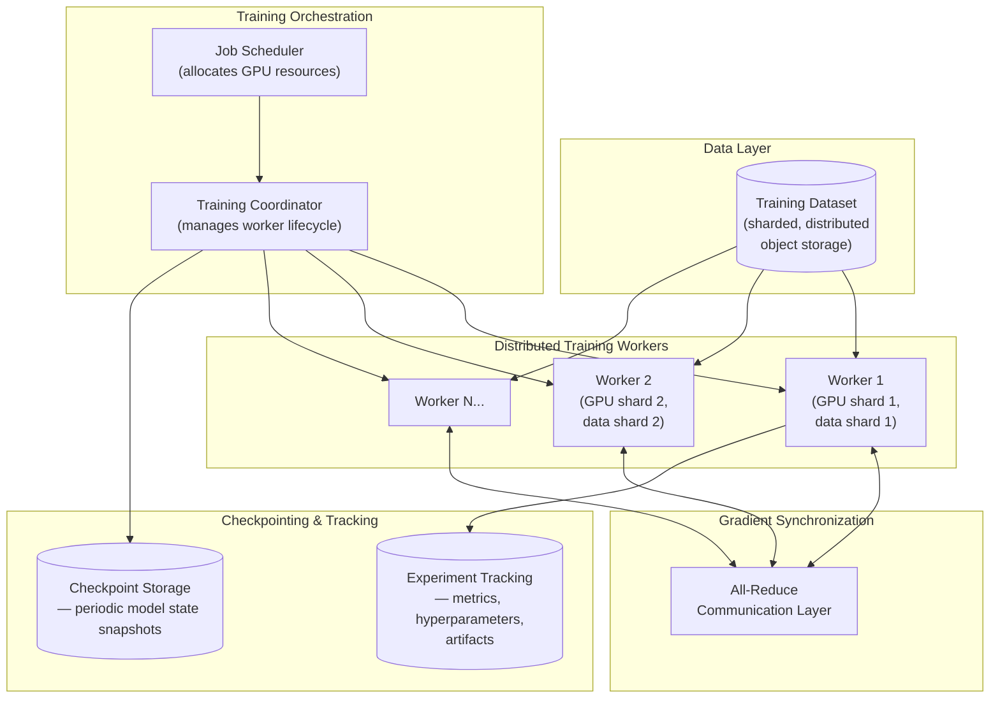
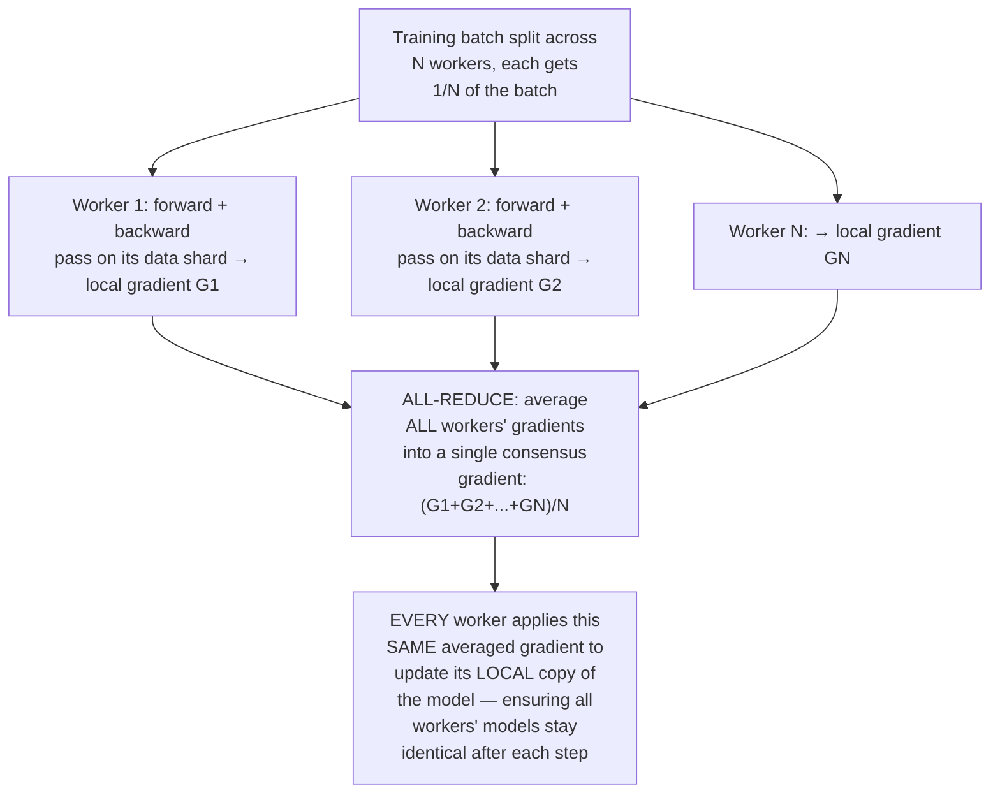
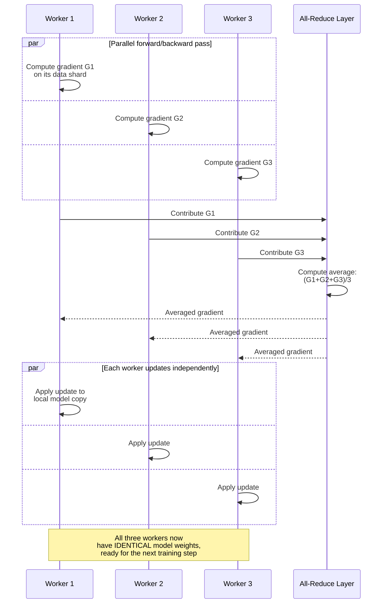
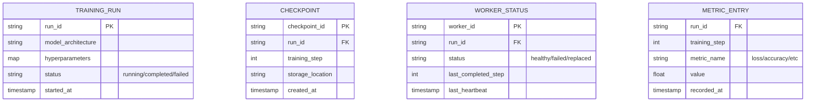
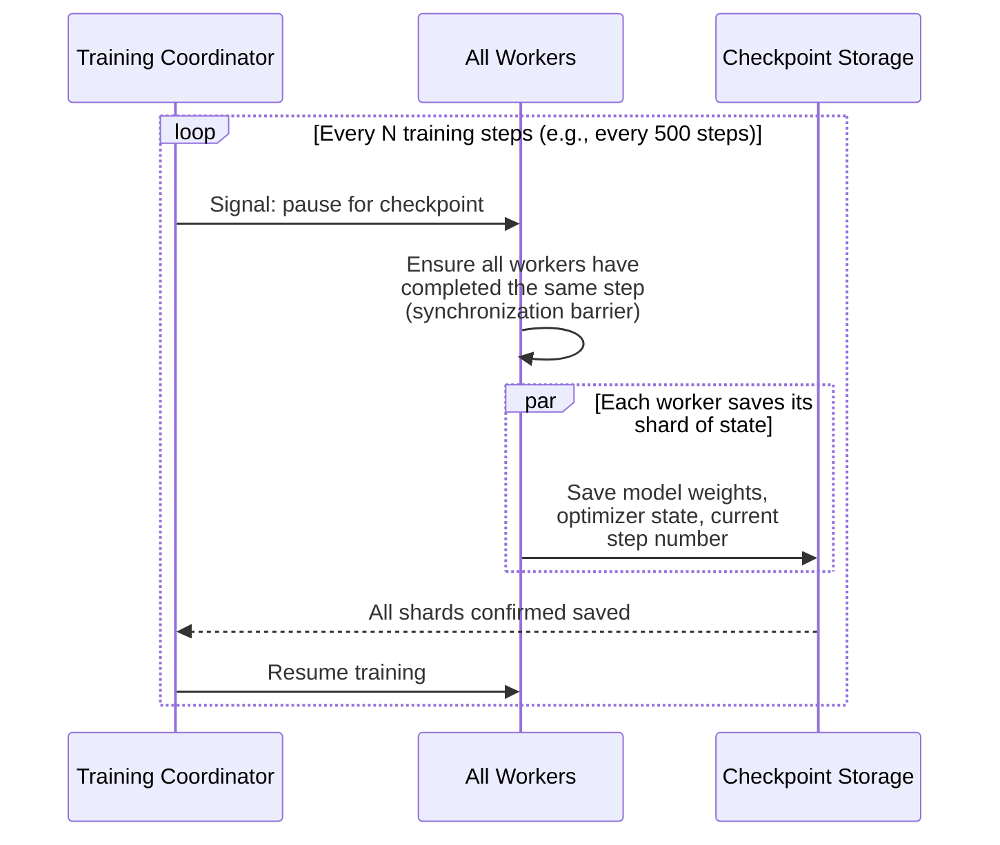
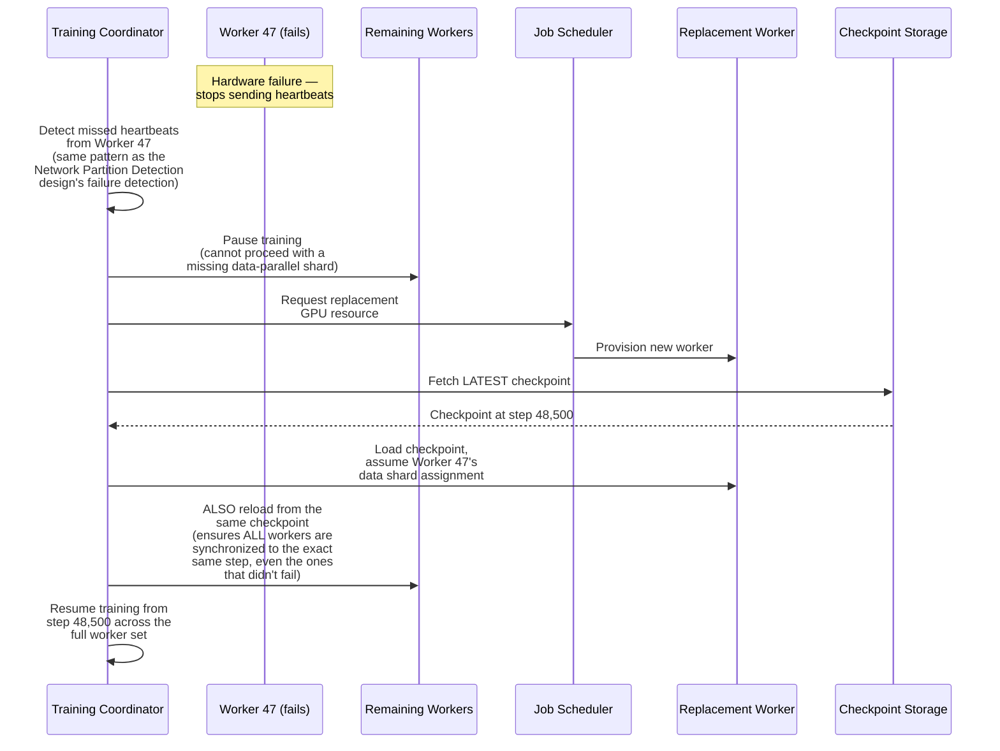
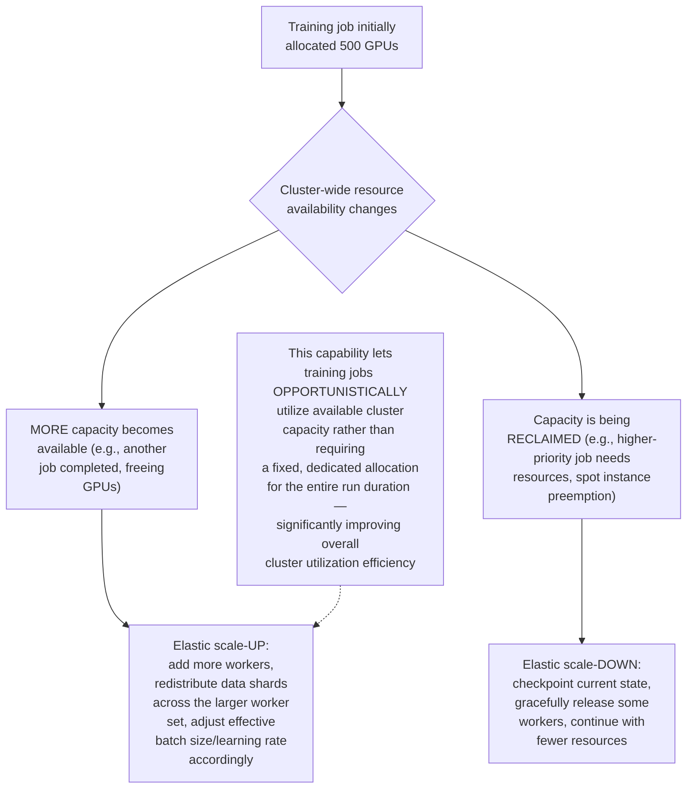
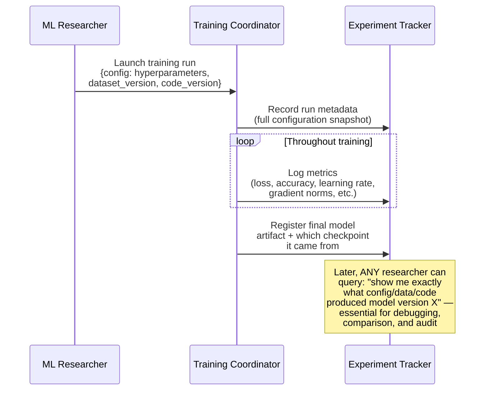
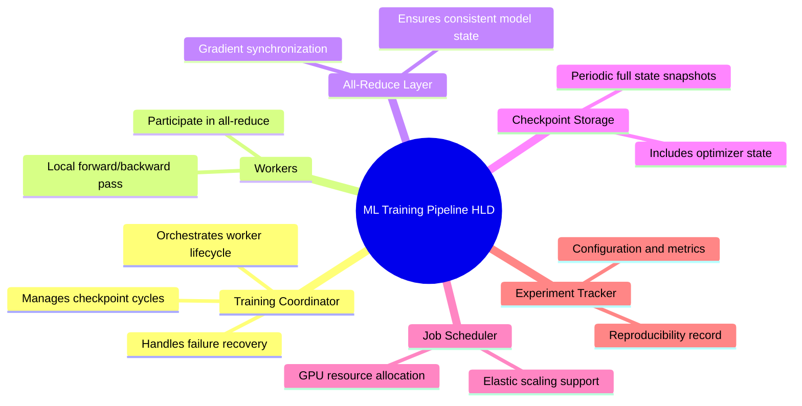

# Design a Large-Scale ML Training Pipeline — High-Level Design Document

## 1. Requirements

### Functional Requirements
- Train large models (potentially billions of parameters) across many machines/GPUs in parallel
- Support checkpointing so long-running training jobs can resume after failure without starting over
- Support both data parallelism (same model, different data shards) and, for very large models, model parallelism (model itself split across devices)
- Track experiment metadata (hyperparameters, metrics, resulting model artifacts) for reproducibility

### Non-Functional Requirements
- **Fault tolerance:** Training runs spanning days/weeks across hundreds of machines WILL experience individual hardware failures — this must be an expected, handled case, not an exceptional one
- **Efficient resource utilization:** GPU time is extremely expensive — idle/wasted compute directly translates to real cost
- **Scalability:** Must scale from a single-GPU experiment to a training run spanning thousands of GPUs, ideally with minimal code changes
- **Reproducibility:** Given the same code, data, and configuration, training should be able to produce consistent, auditable results

### Back-of-Envelope Estimation
| Metric | Value |
|---|---|
| Training run duration | Days to weeks for large models |
| GPUs involved | Tens to thousands, depending on model/data scale |
| Checkpoint frequency | Every N minutes or N training steps |
| Expected hardware failure rate | Non-trivial at thousand-GPU scale — failures are a statistical CERTAINTY over a multi-week run |

---

## 2. The Core Problem — Why Failures Are Inevitable at This Scale

---

## 3. High-Level Architecture

**Key idea:** Each worker independently processes its own shard of the training data, computes gradients locally, and then all workers synchronize via an "all-reduce" operation — averaging gradients across every worker before each one applies the update to its local copy of the model. This is the essence of data-parallel distributed training: the SAME model exists on every worker, but each sees DIFFERENT data, and they periodically synchronize to stay consistent.

---

## 4. Data Parallelism — How Gradient Synchronization Works

---

## 5. Data Model

---

## 6. Checkpointing Flow — Detailed Sequence

**Why checkpointing must include optimizer state, not just model weights:** Modern optimizers (like Adam) maintain their own internal running statistics (momentum, variance estimates) that are essential for training to continue smoothly from where it left off — restoring only the model weights without this optimizer state would effectively restart the optimizer's "memory," often causing a training quality regression at the resume point even though the model weights themselves were preserved correctly.

---

## 7. Fault Recovery Flow — Detailed Sequence

**Why even the HEALTHY workers must also reload from the checkpoint:** Since data-parallel training requires every worker to be at the EXACT SAME training step for the all-reduce synchronization to be meaningful, a single worker's failure and replacement means the entire fleet must realign to a common, consistent state — you can't have some workers at step 48,700 and a freshly-restored replacement at step 48,500; the whole ensemble rewinds together.

---

## 8. Elastic Scaling During Training (Advanced)

---

## 9. Experiment Tracking & Reproducibility

---

## 10. Component Responsibilities Summary

---

## 11. Key Design Decisions & Tradeoffs

| Decision | Choice | Why |
|---|---|---|
| Parallelism strategy | Data parallelism (with model parallelism for very large models) | Matches most training workloads' actual bottleneck; simpler to implement and reason about than full model parallelism when the model fits on a single device |
| Failure handling philosophy | Expected, routine, always-recoverable | At thousand-GPU, multi-week scale, failures are a statistical certainty, not an edge case — the entire system must be architected around this reality |
| Checkpoint content | Full state: model weights + optimizer state + step number | Partial checkpointing (weights only) causes subtle training quality regressions on resume, even though it appears to "work" |
| Recovery scope | Entire worker fleet reloads on any single failure | Data-parallel synchronization requires all workers at the same step; partial-fleet recovery would break this invariant |
| Resource allocation | Elastic scaling support | Improves cluster-wide utilization by allowing training jobs to opportunistically use available capacity, rather than requiring a fixed dedicated allocation |
| Experiment tracking | Mandatory metadata capture for every run | Reproducibility is a hard requirement for ML research/production — without this, "why does this model behave differently" becomes unanswerable |

---

## 12. Bottlenecks & Scaling Considerations

- **All-reduce communication overhead grows with worker count** — as more workers participate, the gradient synchronization step itself becomes an increasingly significant fraction of total training time; efficient all-reduce implementations (e.g., ring-based algorithms) and high-bandwidth interconnects (InfiniBand, NVLink) are essential investments at large scale, not optional infrastructure.
- **Checkpoint size and frequency tradeoff** — checkpointing very large models (many GB of weights + optimizer state) takes real time and I/O bandwidth; too frequent checkpointing wastes valuable training time, too infrequent risks losing more progress on failure — this mirrors the same tradeoff explored in the WAL & Recovery System design, applied to model training instead of database durability.
- **Straggler workers** — even without outright failure, some workers may run measurably slower than others (hardware variance, network congestion) — since all-reduce synchronization means the WHOLE fleet waits for the slowest worker each step, a single consistent straggler can bottleneck the entire training run's throughput.
- **Data loading pipeline bottleneck** — if data loading/preprocessing can't keep pace with GPU compute speed, expensive GPUs sit idle waiting for data — the data pipeline itself often needs its own dedicated scaling and optimization effort, separate from the model computation.
- **Model parallelism complexity for extremely large models** — when a single model no longer fits in one device's memory (common for today's largest models), the model itself must be split across devices, introducing significantly more complex communication patterns than data parallelism's relatively simple gradient averaging — this is a substantially harder engineering problem, often requiring specialized frameworks.
- **Cost management at scale** — given the enormous expense of large GPU fleets running for days/weeks, proactive monitoring of training efficiency (GPU utilization, time lost to failures/stragglers) directly translates to real cost savings — this operational visibility is as important as the training correctness itself for organizations running training at this scale.
