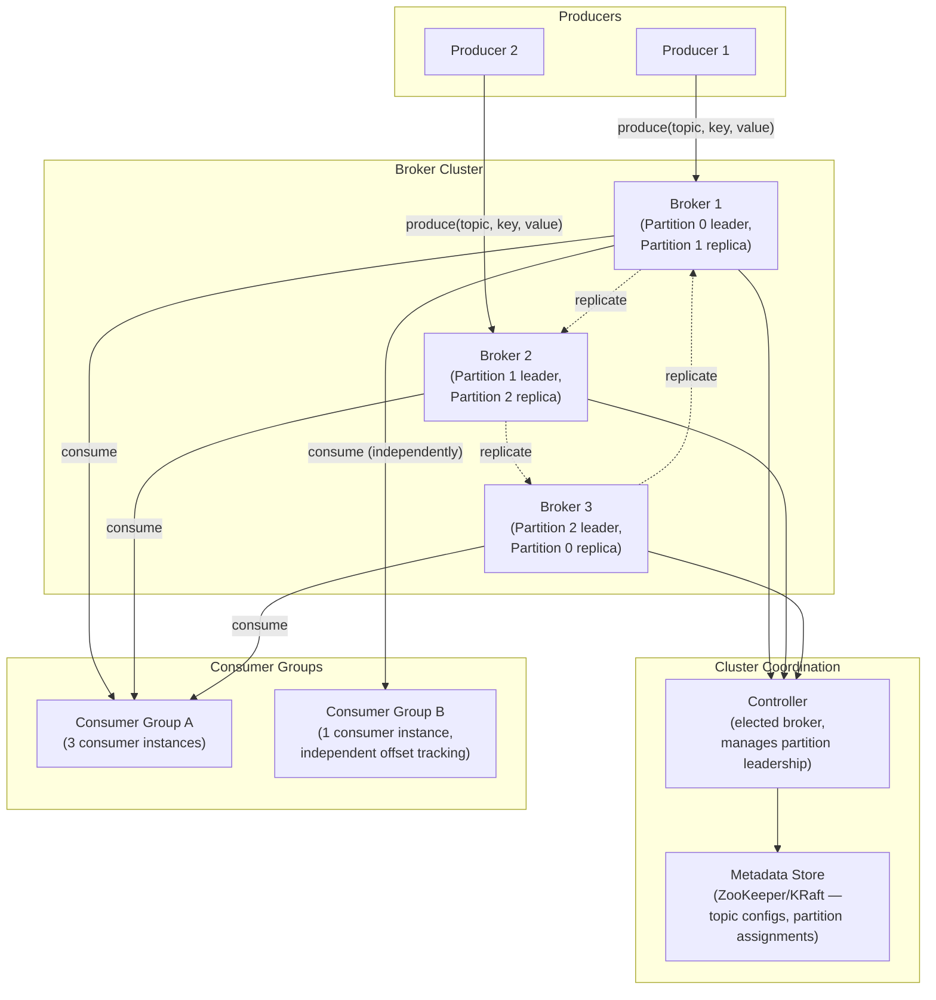
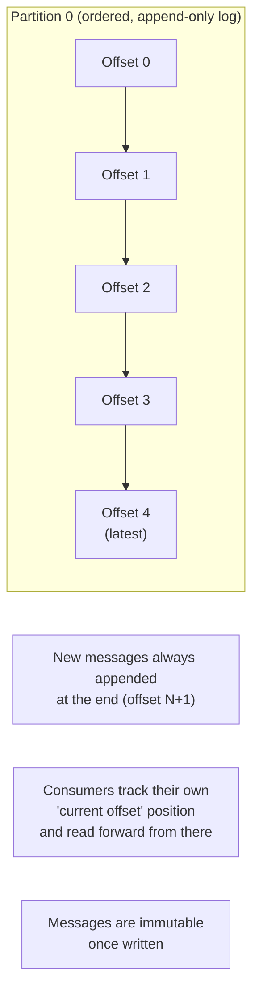
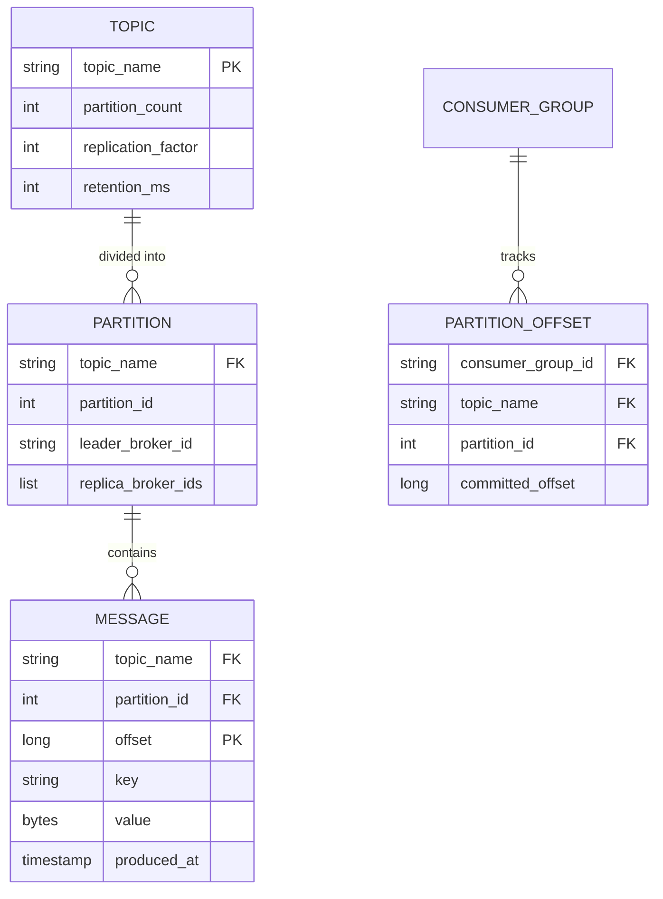
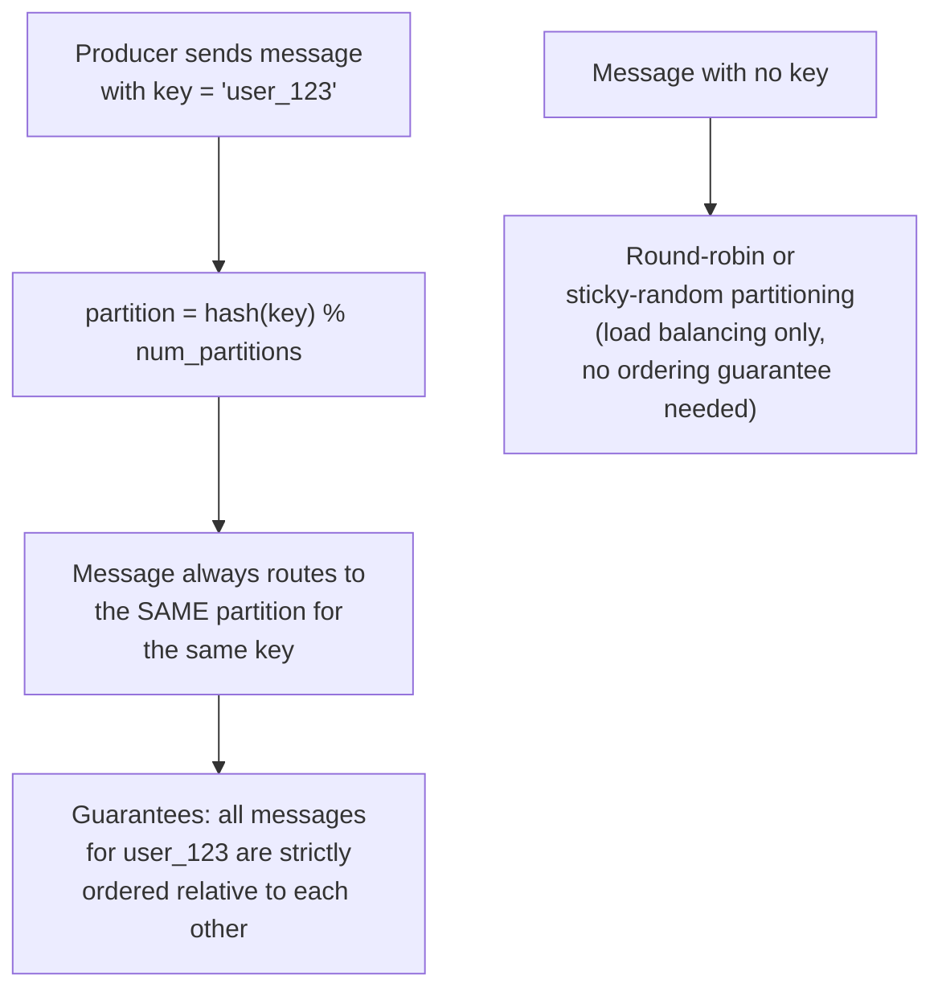
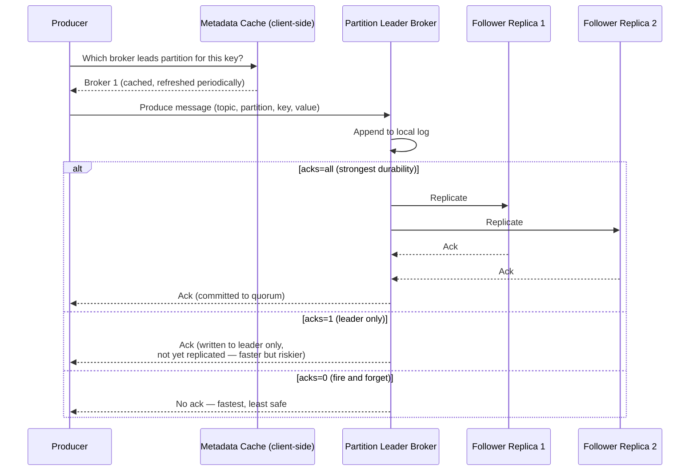
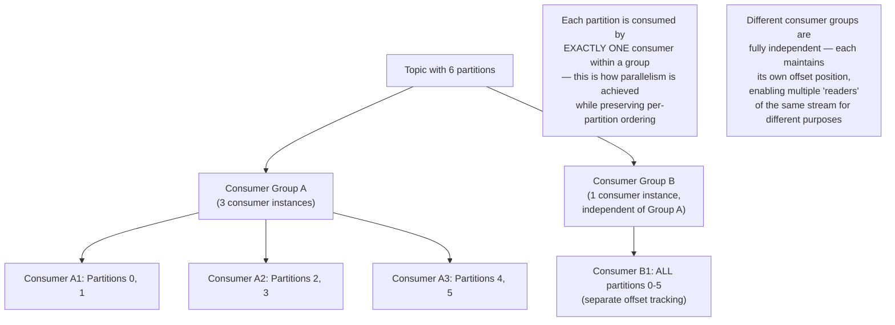
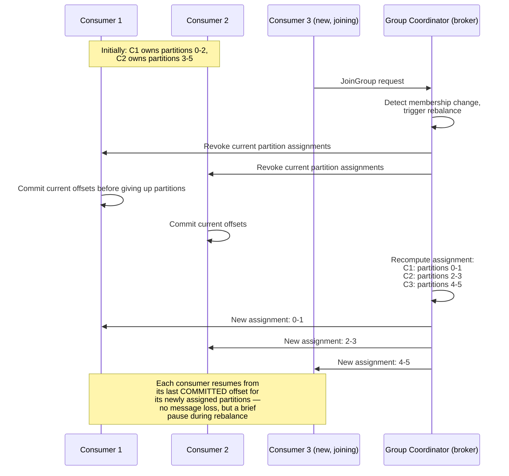
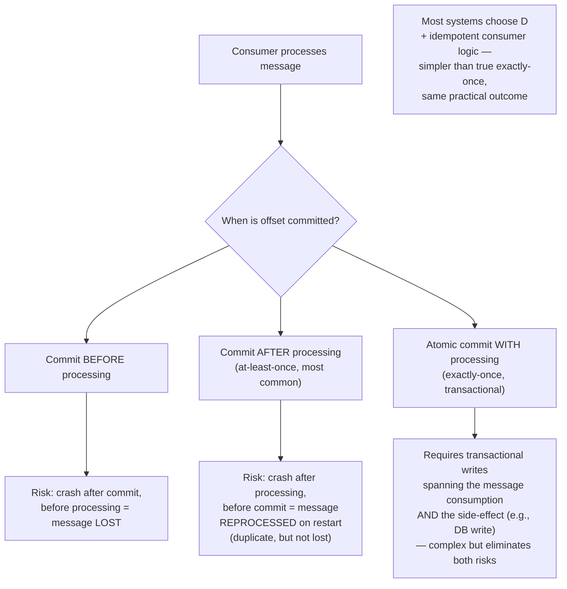
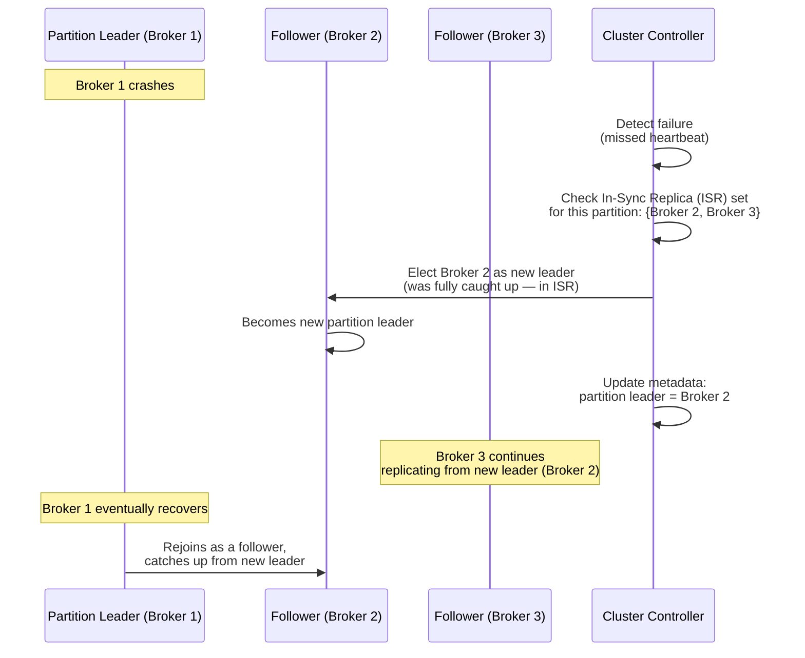
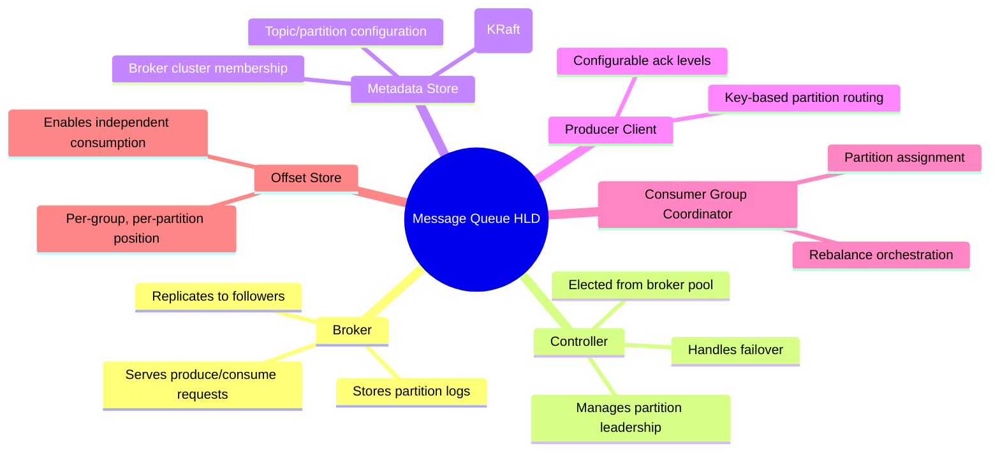

# Design a Message Queue (Kafka-like) — High-Level Design Document

## 1. Requirements

### Functional Requirements
- Producers publish messages to named topics
- Consumers subscribe to topics and process messages
- Support multiple independent consumer groups reading the same topic
- Preserve message ordering within a partition
- Support both at-least-once and (optionally) exactly-once processing semantics
- Durable storage — messages survive broker restarts

### Non-Functional Requirements
- **High throughput:** Millions of messages/sec across the cluster
- **Low latency:** Sub-10ms produce/consume latency for real-time use cases
- **Durability:** Committed messages must survive broker failure (replication)
- **Horizontal scalability:** Both storage and throughput scale by adding brokers/partitions
- **Ordering guarantee:** Strict ordering only required within a partition, not globally across a topic

### Back-of-Envelope Estimation
| Metric | Value |
|---|---|
| Messages/sec (platform-wide) | ~1M-10M |
| Avg message size | ~1KB |
| Retention period | 7 days (configurable) |
| Topics | Thousands |
| Partitions per topic | 10s-100s, based on throughput needs |
| Replication factor | 3 (typical) |

---

## 2. High-Level Architecture

**Key idea:** A topic is split into **partitions**, each of which is an ordered, append-only log. Each partition has one "leader" broker (handling all reads/writes for it) and several follower replicas. This partitioning is what enables horizontal scaling of both throughput (parallel writes across partitions) and consumption (parallel reads across partitions) — at the cost of only guaranteeing ordering *within* a partition, not across the whole topic.

---

## 3. Core Data Model — The Log Abstraction

---

## 4. Partitioning Strategy (Key-Based Routing)

**Why key-based partitioning matters:** If you need "all events for user X processed in order," you achieve this not through complex global coordination but simply by routing all of user X's messages to the same partition — ordering is a natural consequence of a single append-only log, not something that needs to be separately engineered.

---

## 5. Producer Publish Flow — Detailed Sequence

*The `acks` setting is a direct latency/durability tradeoff knob exposed to the producer — critical financial events might use `acks=all`, while high-volume low-stakes telemetry might use `acks=1` for throughput.*

---

## 6. Consumer Group Semantics

**Why consumer groups matter:** This is what lets the same event stream serve multiple independent purposes simultaneously — e.g., one consumer group updates a search index from order events, another triggers email notifications, and a third feeds an analytics pipeline — all reading the same partitions at their own pace without interfering with each other.

---

## 7. Consumer Rebalancing (Group Membership Changes)

---

## 8. Delivery Semantics — At-Least-Once vs Exactly-Once

---

## 9. Replication & Leader Election (Broker Failure Handling)

**Why the In-Sync Replica (ISR) set matters:** Only replicas that are fully caught up with the leader (in the ISR) are eligible for leader election on failure. This prevents data loss — electing a replica that had fallen behind would silently drop the most recent committed messages.

---

## 10. Component Responsibilities Summary

---

## 11. Key Design Decisions & Tradeoffs

| Decision | Choice | Why |
|---|---|---|
| Ordering guarantee | Per-partition only, not global | Global ordering would require serializing all writes through one point, destroying horizontal scalability |
| Partitioning key | Hash of message key | Ensures related messages (same entity) land in the same partition, achieving ordering where it matters without extra coordination |
| Durability | Configurable acks (0/1/all) + replication factor | Exposes an explicit latency/durability tradeoff knob per use case, rather than a one-size-fits-all guarantee |
| Consumer scaling | Consumer groups with partition-exclusive assignment | Enables parallel consumption while preserving per-partition order; multiple independent groups allow multiple use cases on one stream |
| Failover | ISR-based leader election | Only promotes replicas guaranteed to have all committed data — prevents silent data loss on failover |
| Delivery semantics | At-least-once + idempotent consumers (default) | True exactly-once is complex/costly; at-least-once with dedup achieves the same practical safety far more simply |

---

## 12. Bottlenecks & Scaling Considerations

- **Partition count as the scaling lever** — throughput scales with partition count (more parallelism), but too many partitions per broker increases overhead (open file handles, replication traffic, longer leader election); needs to be sized deliberately, not maximized blindly.
- **Hot partitions from skewed keys** — if one key (e.g., a viral user_id) dominates traffic, its partition becomes a bottleneck regardless of overall cluster capacity; may require key salting or dedicated handling for known hot entities.
- **Consumer lag under processing slowdowns** — if consumers can't keep up with producers, lag grows; needs monitoring and either consumer scale-out (more instances up to partition count) or backpressure on producers.
- **Rebalance storms** — frequent consumer join/leave (e.g., flaky deployments) triggers repeated rebalances, each pausing consumption briefly; incremental/cooperative rebalancing protocols reduce this pause compared to full stop-the-world rebalances.
- **Replication bandwidth** — a replication factor of 3 triples the network/disk write load per message; this is the direct cost of durability and must be budgeted into cluster capacity planning.
- **Retention vs storage cost** — long retention windows (weeks/months) on high-volume topics require substantial disk capacity; tiered storage (moving older segments to cheaper object storage) is a common mitigation in modern systems.
- **Cross-datacenter replication** — for disaster recovery or multi-region access, replicating entire topics across regions adds significant complexity around consistency and conflict handling, usually solved with a separate mirroring/replication tool rather than the core broker protocol itself.
