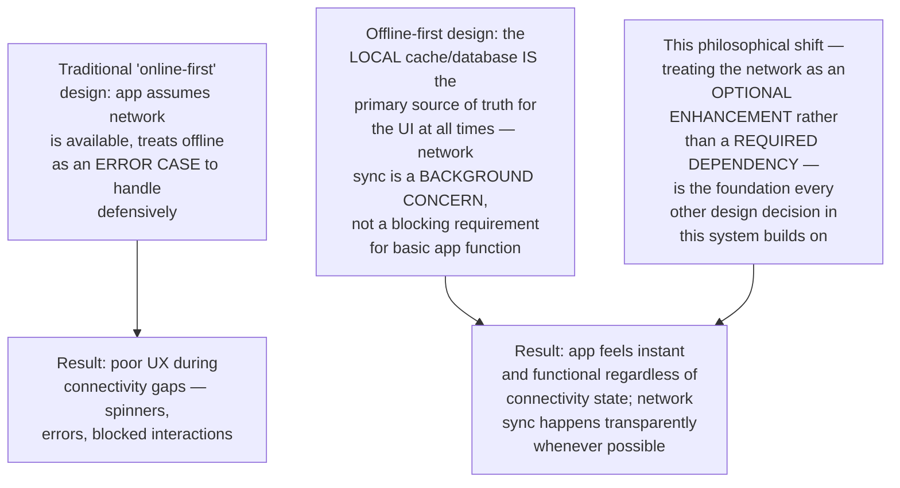
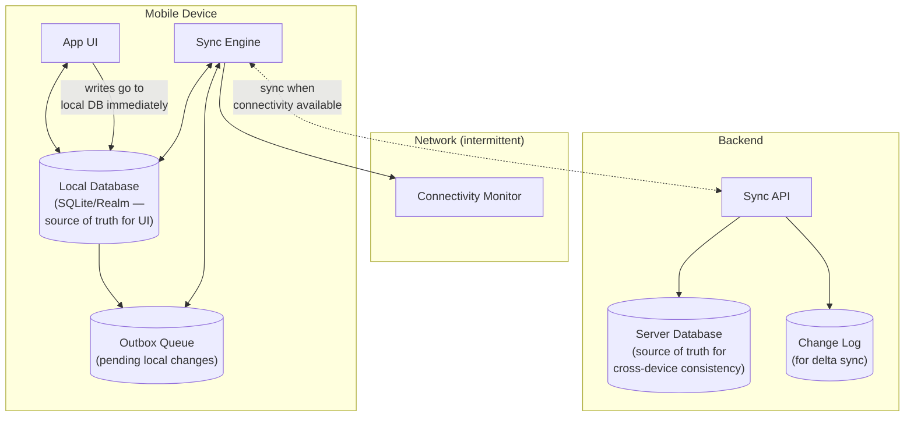
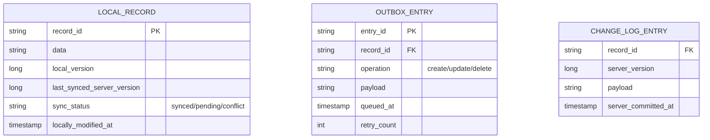
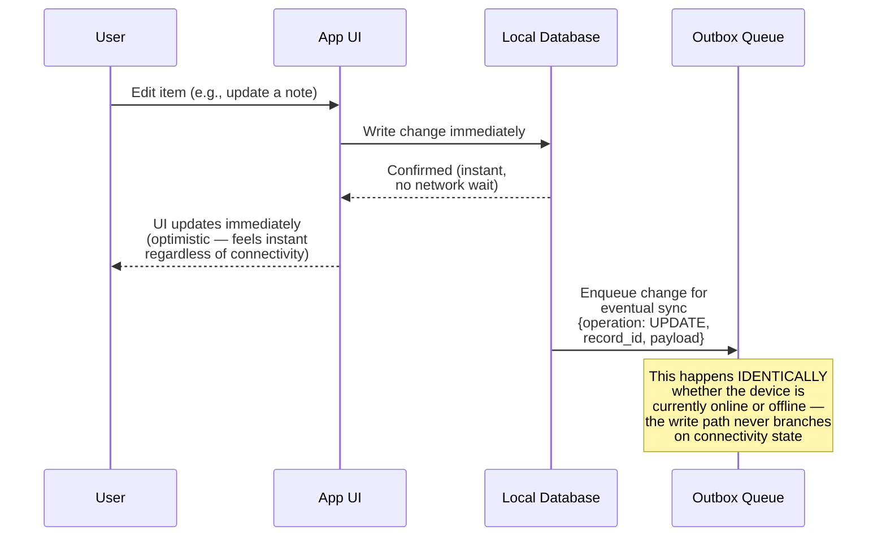
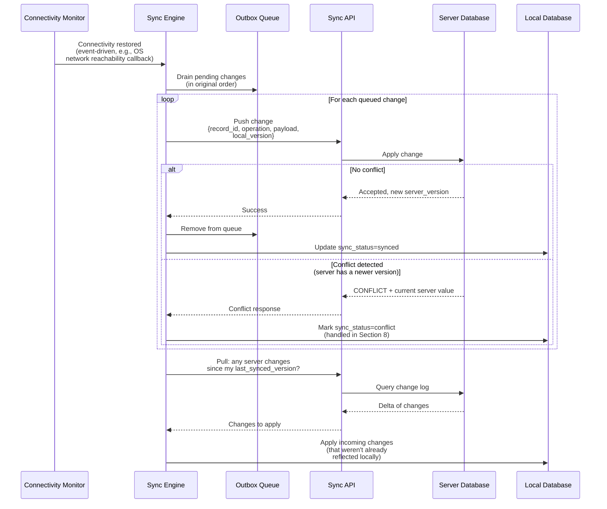
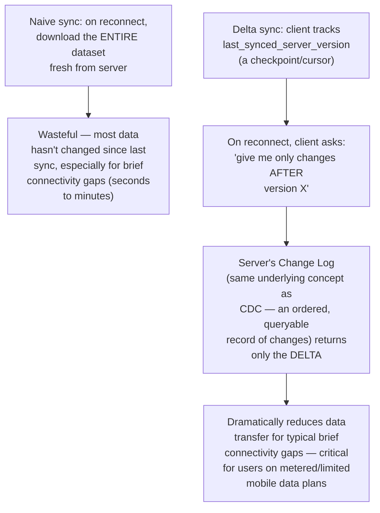
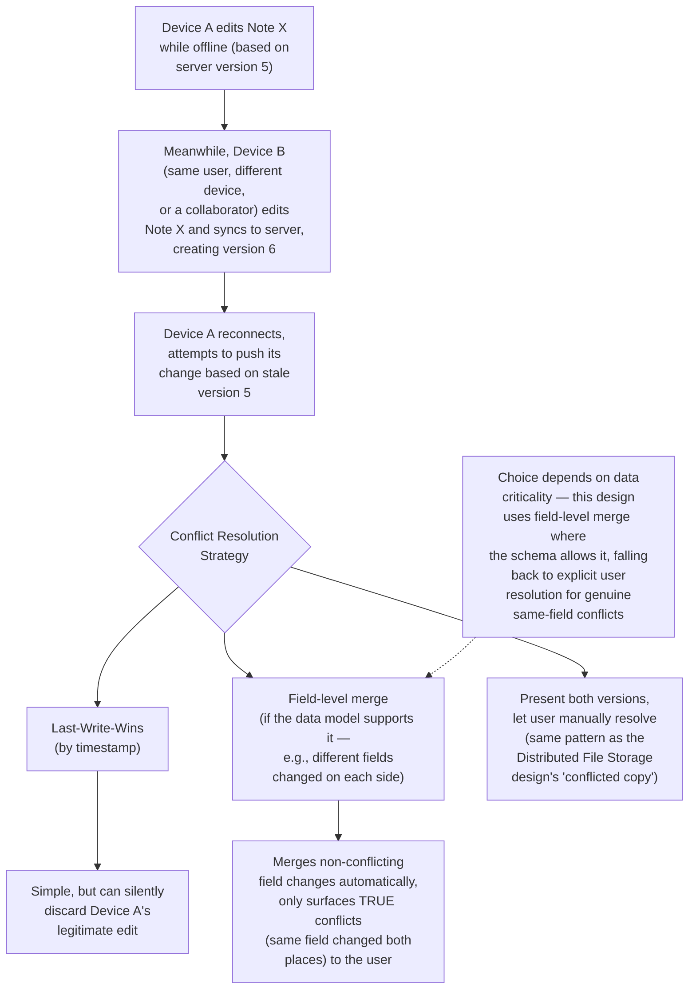
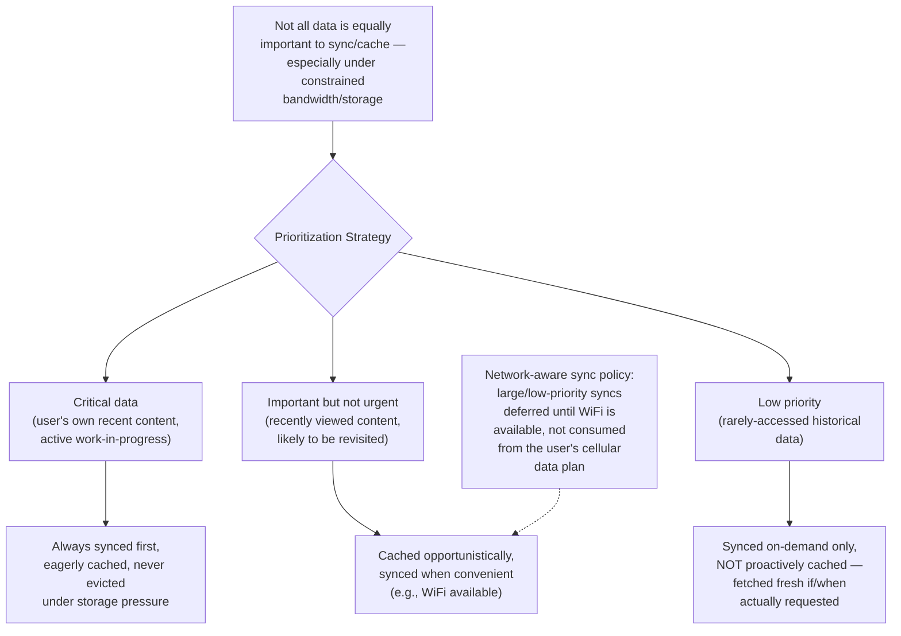
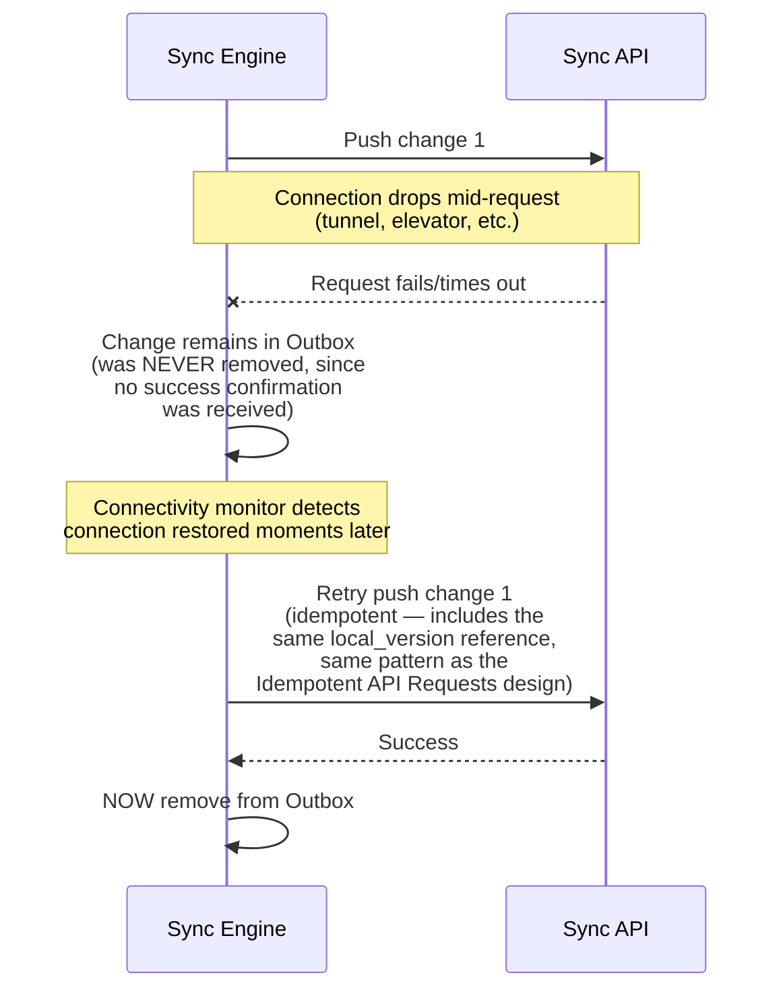
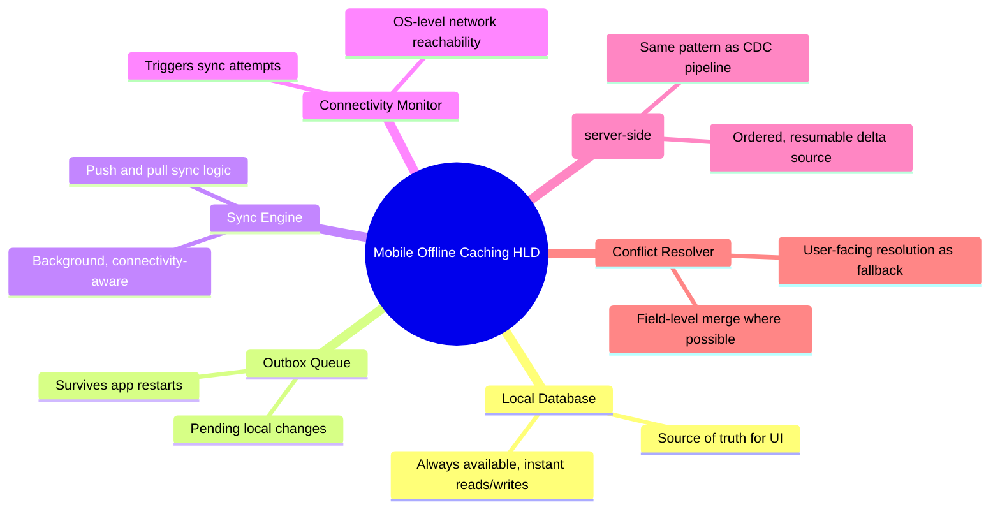

# Design a Client + Server Caching Strategy for a Mobile App with Intermittent Connectivity — High-Level Design Document

## 1. Requirements

### Functional Requirements
- App must remain functional (at least in a read/browse capacity) when the device has no network connectivity
- Locally-made changes while offline must sync to the server once connectivity returns
- Handle conflicts when the same data was modified both locally (offline) and on the server (by another device/session)
- Minimize unnecessary data transfer over unreliable/metered mobile networks

### Non-Functional Requirements
- **Offline-first responsiveness:** UI should never block waiting for network — always render from local cache immediately, update when fresh data arrives
- **Battery/bandwidth efficiency:** Sync strategy must be mindful of mobile battery and data plan constraints, not just "sync everything constantly"
- **Data freshness vs staleness tolerance:** Different data types have different acceptable staleness windows
- **Graceful degradation:** Intermittent connectivity (not just fully offline) must be handled smoothly — brief drops shouldn't cause errors or lost work

### Back-of-Envelope Estimation
| Metric | Value |
|---|---|
| Typical mobile connectivity | Intermittent — WiFi/cellular handoffs, tunnels, elevators, airplane mode |
| Local storage budget | Tens to low hundreds of MB typical for app data cache |
| Sync payload size (delta) | KBs typical, vs potentially MBs for full re-sync |
| Acceptable sync latency (reconnect) | Seconds for small changes, longer tolerated for bulk sync |

---

## 2. The Core Philosophy — Offline-First, Not Offline-Tolerant

---

## 3. High-Level Architecture

**Key idea:** All reads and writes from the UI go through the Local Database — the UI never talks to the network directly. The Sync Engine runs as an independent background process, opportunistically pushing outbound changes and pulling inbound updates whenever connectivity allows, completely decoupled from the UI's rendering path.

---

## 4. Data Model

---

## 5. Local Write Flow (While Offline or Online) — Detailed Sequence

**Why the write path is identical regardless of connectivity:** This uniformity is what makes offline-first architecture reliable — there's no special "offline mode" code path that could have different bugs than the "online mode" path. Every write always goes local-first and queues for sync; connectivity only affects WHEN the outbox drains, never HOW a write is initially handled.

---

## 6. Connectivity Recovery & Sync Flow — Detailed Sequence

---

## 7. Delta Sync (Bandwidth Efficiency)

*This delta-sync mechanism mirrors the CDC Pipeline design's core principle — maintaining an ordered change log that consumers (in this case, mobile clients rather than downstream services) can resume from at their own last-known checkpoint, rather than requiring a full re-fetch.*

---

## 8. Conflict Resolution (Concurrent Offline + Server Changes)

---

## 9. Data Prioritization & Selective Sync

---

## 10. Handling Intermittent (Not Fully Offline) Connectivity

**Why idempotency matters critically here:** Intermittent connectivity means requests can fail at any point — including AFTER the server successfully processed them but BEFORE the client received confirmation. Without idempotent retry handling, this ambiguous "did it actually work?" scenario could cause either lost changes (if the client gives up) or duplicate changes (if the client blindly retries without deduplication) — the same idempotency key pattern from the dedicated Idempotent API Requests design applies directly here.

---

## 11. Component Responsibilities Summary

---

## 12. Key Design Decisions & Tradeoffs

| Decision | Choice | Why |
|---|---|---|
| Architecture philosophy | Offline-first (local DB as source of truth for UI) | Makes the app feel instant and functional regardless of connectivity, rather than treating offline as a degraded error state |
| Write path | Always local-first, queued for async sync | Uniform behavior regardless of connectivity state eliminates an entire class of "offline mode" bugs |
| Sync mechanism | Delta sync via server-side change log | Dramatically reduces bandwidth usage on typical brief connectivity gaps, critical for metered mobile data |
| Conflict resolution | Field-level merge with user-facing fallback | Automatically resolves the common case (non-overlapping edits) while never silently discarding genuinely conflicting user work |
| Retry safety | Idempotent operations via version/key tracking | Handles the ambiguous "request failed but may have succeeded" scenario inherent to intermittent connectivity |
| Data prioritization | Tiered sync urgency + network-aware scheduling | Respects mobile battery/bandwidth constraints rather than naively syncing everything as fast as possible |

---

## 13. Bottlenecks & Scaling Considerations

- **Local storage limits** — mobile devices have finite storage; the local cache needs an eviction policy (similar principles to the Distributed Cache design's LRU eviction) for lower-priority cached data, while never evicting unsynced outbox entries.
- **Outbox queue growth during extended offline periods** — a user offline for days accumulates many pending changes; the sync engine must handle draining a potentially large backlog efficiently on reconnect, likely batching rather than one-request-per-change.
- **Battery impact of background sync** — aggressive background syncing drains battery; must respect OS-level background execution limits and ideally batch sync attempts rather than maintaining constant connection attempts.
- **Change log retention on the server** — similar to the CDC Pipeline design's transaction log retention concern, if a device is offline long enough that the server's change log has rotated past its last-synced checkpoint, a full re-sync (not just delta) becomes necessary — this boundary needs clear, tested handling.
- **Multi-device conflict complexity growth** — the more devices/sessions a single user has active simultaneously, the more frequently genuine conflicts arise; this is a natural consequence of the offline-first model and needs to be a well-tested, well-designed user-facing experience, not an edge case.
- **Testing intermittent connectivity scenarios** — this system's core value proposition is specifically about handling FLAKY (not just fully-on or fully-off) connectivity; testing must include simulated mid-request drops, slow/degraded connections, and rapid connect/disconnect cycling, not just simple airplane-mode-toggle testing.
