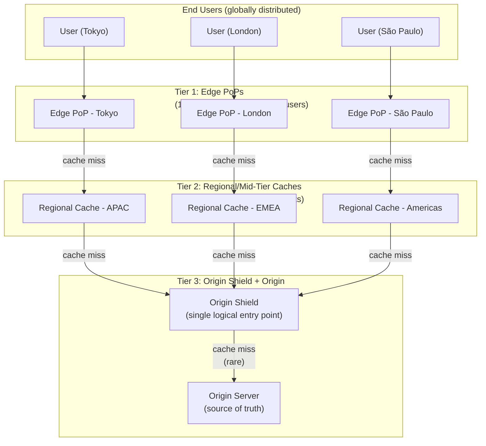
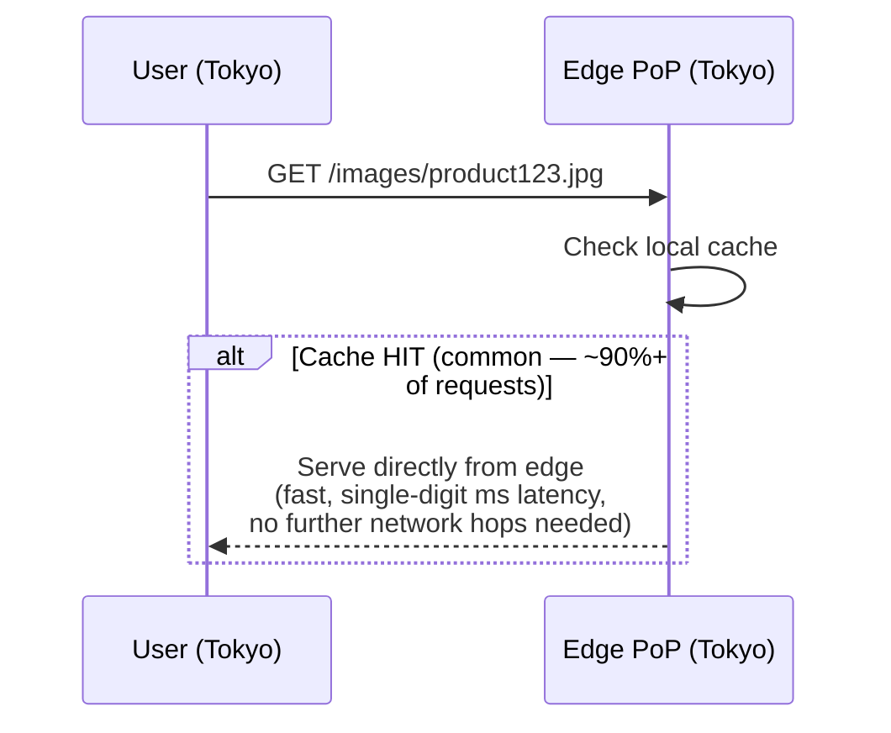
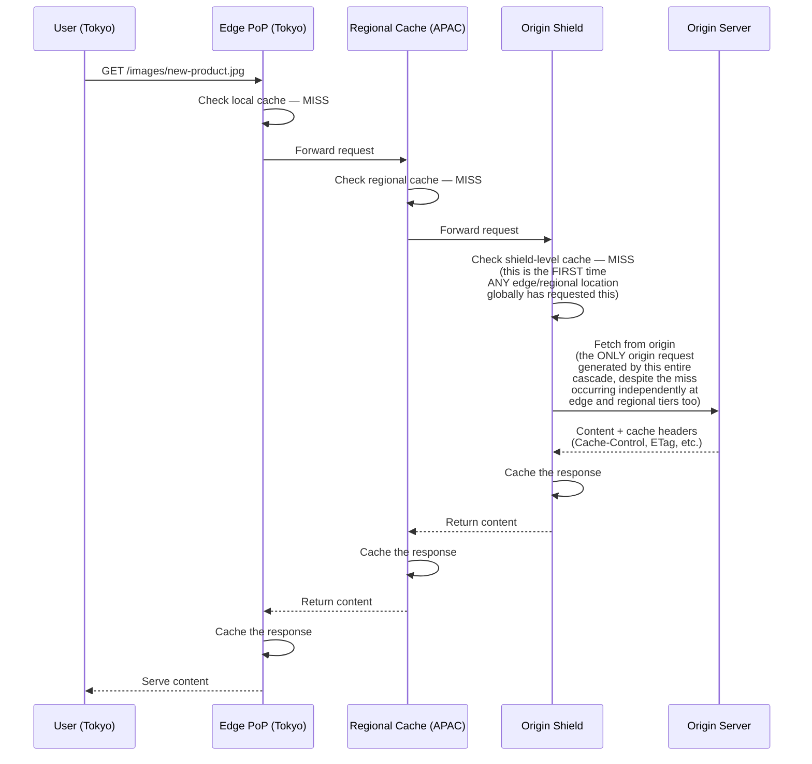
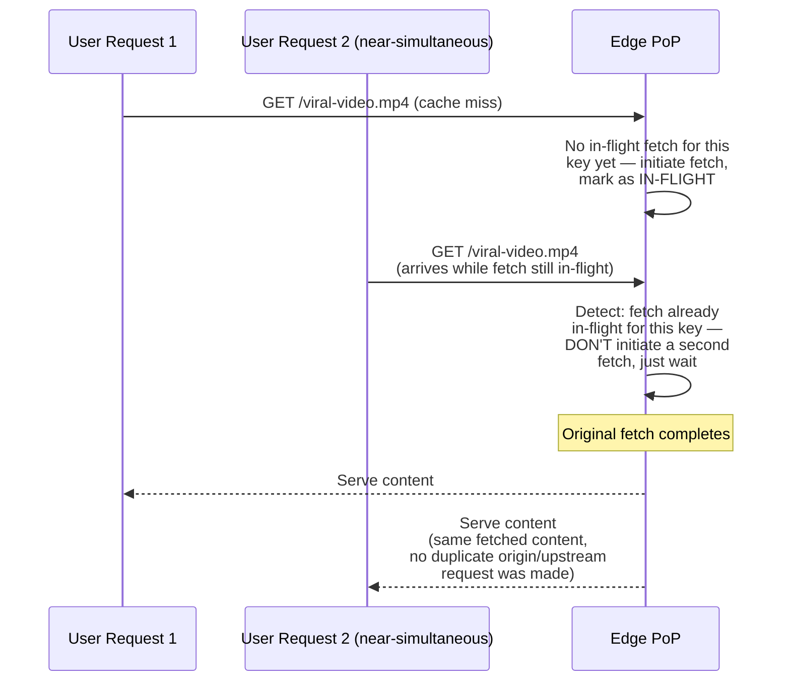
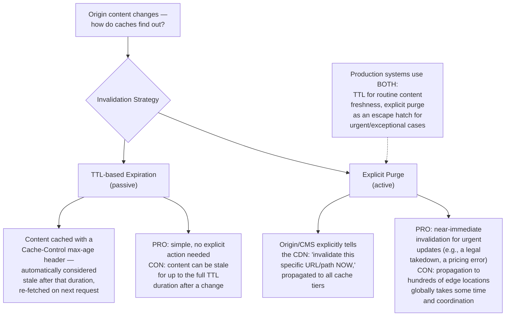
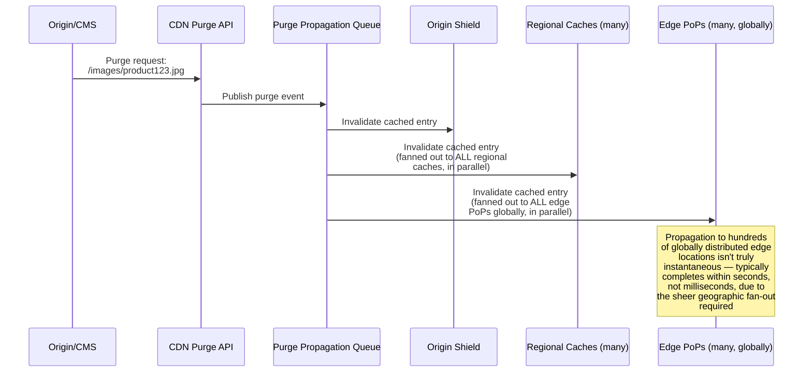
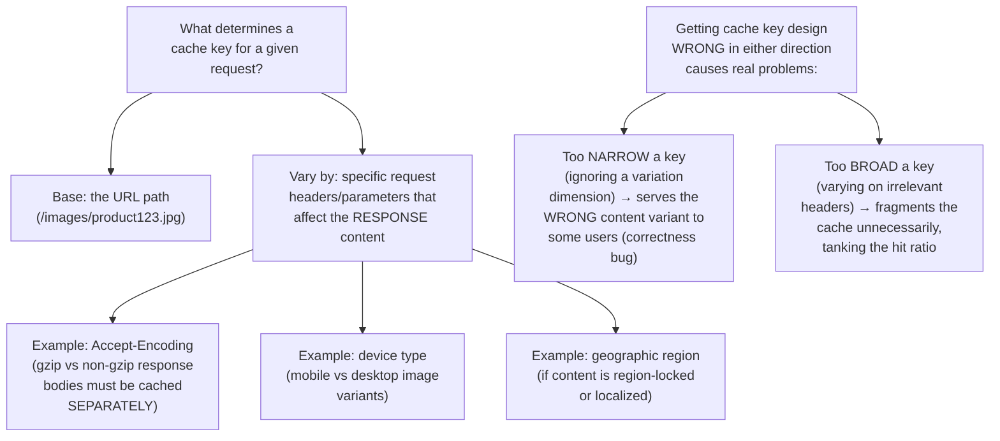
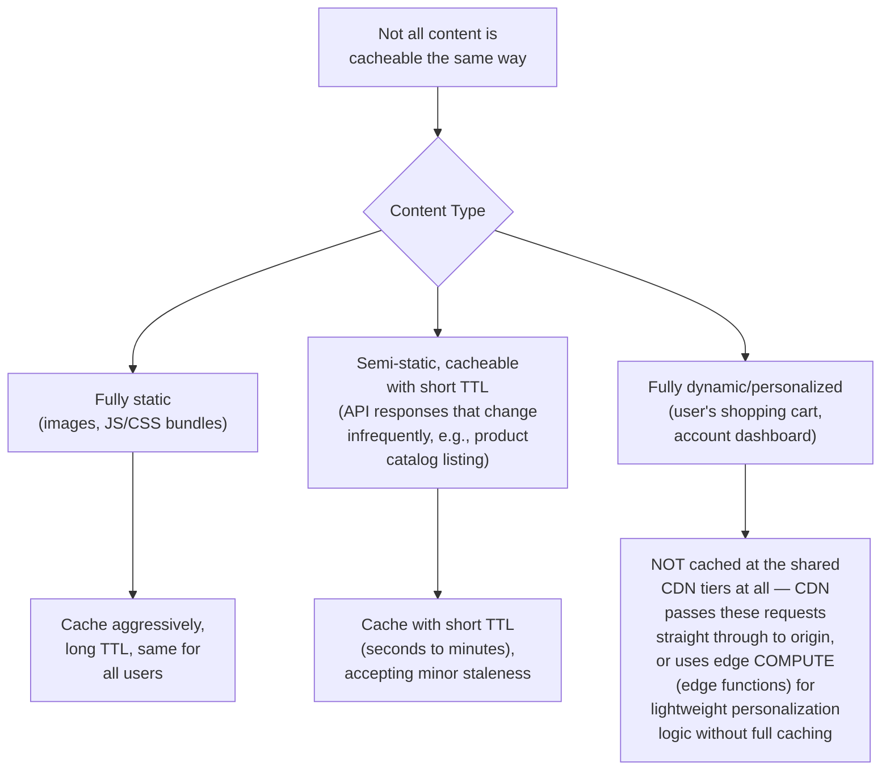
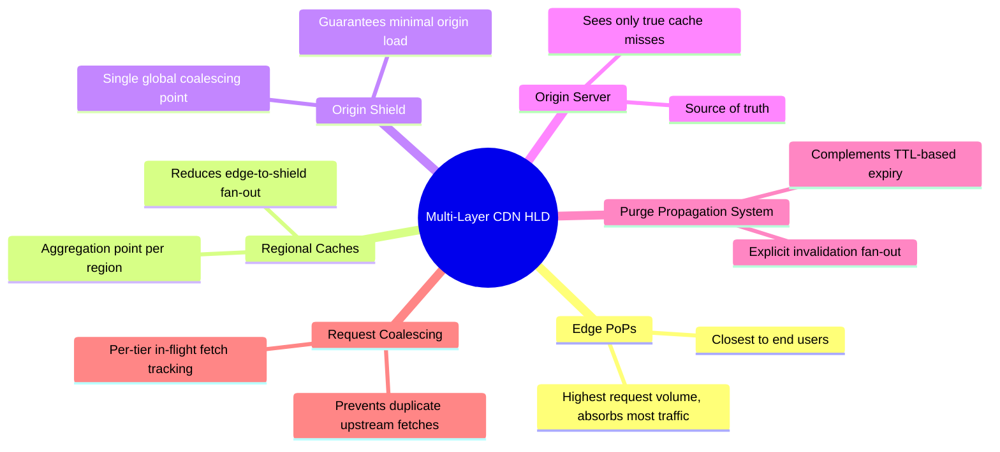

# Design a Multi-Layer Caching Architecture for a Global CDN — High-Level Design Document

## 1. Requirements

### Functional Requirements
- Serve static and semi-static content (images, video, JS/CSS, API responses) with minimal latency worldwide
- Support cache invalidation when origin content changes
- Handle both cacheable (static assets) and dynamic (personalized/API) content appropriately
- Support cache purging on-demand for urgent content updates

### Non-Functional Requirements
- **Global low latency:** Content should be served from a location physically close to each user, worldwide
- **Origin protection:** The origin server must be shielded from the full weight of global traffic — cache layers should absorb the overwhelming majority of requests
- **Cache coherence:** Different cache layers/nodes shouldn't serve wildly inconsistent versions of content for extended periods
- **High cache hit ratio:** The economic and performance value of a CDN depends on minimizing origin round-trips

### Back-of-Envelope Estimation
| Metric | Value |
|---|---|
| Global edge locations | 100-300+ points of presence (PoPs) |
| Total requests/sec (platform-wide) | Millions |
| Target cache hit ratio | 90-99%+ for static content |
| Origin traffic (after caching) | Should be a small fraction of total (ideally <5%) |

---

## 2. High-Level Architecture — The Three-Tier Model

**Key idea:** Each tier exists to absorb misses from the tier below it, progressively funneling traffic down toward the origin — by the time a request reaches the origin, it represents the tiny fraction of truly novel/uncached content across the ENTIRE global user base, not just one region. This tiered funneling is what makes CDNs viable at global scale — without it, popular content would generate redundant origin fetches from every single edge location independently.

---

## 3. Request Flow — Cache Hit at Edge (Common Case)

---

## 4. Request Flow — Cache Miss Cascading Through Tiers

**Why the Origin Shield is critical:** Without it, EVERY regional cache experiencing a simultaneous miss for the same popular new content would independently hit the origin — potentially hundreds of redundant origin requests for the exact same content. The shield acts as a single, global coalescing point that guarantees the origin sees at most one request for a given piece of content during any cache-miss window, regardless of how many edge/regional locations are simultaneously requesting it.

---

## 5. Request Coalescing at Each Tier (Avoiding Duplicate Fetches)

*This is the same request-coalescing pattern used to prevent thundering herd/cache stampede in the Distributed Cache design — applied here at every tier of the CDN hierarchy, since a popular piece of content going viral can generate a massive burst of near-simultaneous requests at any single edge location.*

---

## 6. Cache Invalidation Strategies

---

## 7. Explicit Purge Propagation — Detailed Sequence

---

## 8. Cache Key Design & Content Variation

---

## 9. Dynamic/Personalized Content Handling

---

## 10. Component Responsibilities Summary

---

## 11. Key Design Decisions & Tradeoffs

| Decision | Choice | Why |
|---|---|---|
| Architecture | Three-tier (edge, regional, origin shield) | Progressively funnels traffic, ensuring the origin only ever sees a tiny fraction of true global request volume |
| Origin protection | Dedicated origin shield layer | Guarantees at most one origin request per uncached item globally, regardless of how many edge/regional misses occur simultaneously |
| Request handling on miss | Coalescing (in-flight fetch deduplication) at every tier | Prevents thundering herd effects at each layer independently, not just at the origin |
| Invalidation | TTL (default) + explicit purge (escape hatch) | Balances operational simplicity for routine freshness against the need for near-immediate updates in urgent cases |
| Cache key design | Vary only on dimensions that genuinely affect response content | Avoids both correctness bugs (too narrow) and cache fragmentation (too broad) |
| Dynamic content | Bypass shared caching tiers, or use edge compute | Fully personalized content isn't a good fit for shared caching regardless of tier — forcing it through the cache hierarchy would provide no benefit and risk serving wrong content to the wrong user |

---

## 12. Bottlenecks & Scaling Considerations

- **Origin shield as a potential bottleneck** — while it dramatically reduces origin load, the shield itself must handle the aggregate miss traffic from ALL regional caches globally; needs to be horizontally scalable and highly available, since its failure would remove the origin's primary protection layer.
- **Purge propagation latency for very large fan-outs** — invalidating content across hundreds of globally distributed edge locations takes real time (seconds); for extremely time-sensitive invalidation needs (e.g., legal takedown requirements), this propagation delay must be accounted for in SLA commitments.
- **Cache hit ratio degradation from poor cache key design** — an overly granular cache key (accidentally varying on something like a session ID or timestamp) can silently tank hit ratio, effectively defeating the entire CDN's purpose for that content — this requires ongoing monitoring of hit ratios per content type/path pattern to catch regressions.
- **Regional tier sizing** — too few regional caches concentrates miss traffic (and thus load) onto fewer aggregation points; too many diminishes the traffic-consolidation benefit this tier is meant to provide — sizing depends on the specific geographic distribution of the platform's actual user base.
- **Cold cache scenarios (new region/PoP launch)** — a newly deployed edge location starts with an empty cache and will generate a temporary burst of cache misses cascading through the tiers; may warrant pre-warming for known-popular content ahead of a new PoP going live (same principle as the dedicated Cache Warming design).
- **Multi-CDN/failover strategies** — many large platforms use multiple CDN providers simultaneously for redundancy and negotiating leverage; this adds complexity around consistent cache key/invalidation behavior across genuinely different underlying CDN implementations, which is a substantial additional design consideration beyond a single-CDN architecture.
