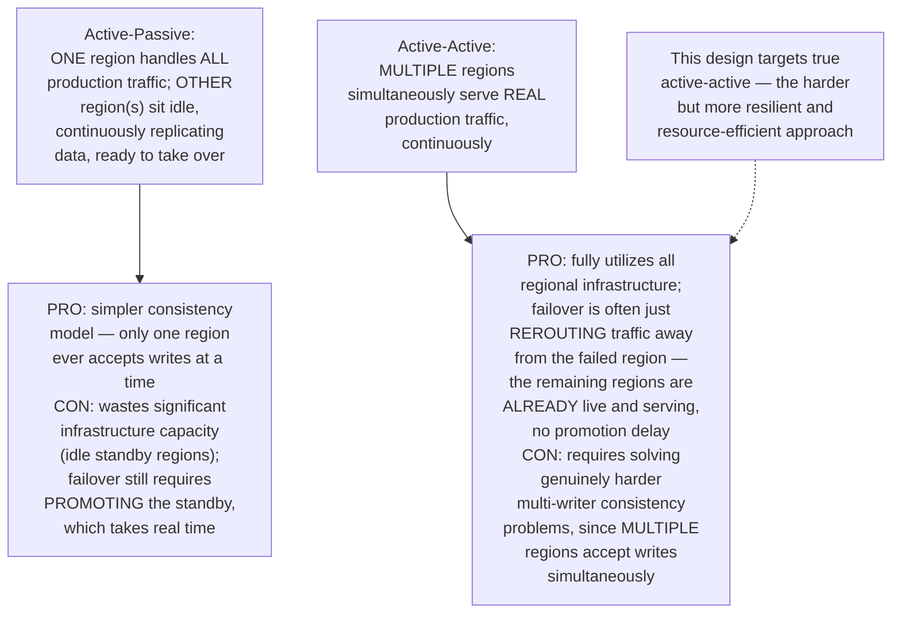
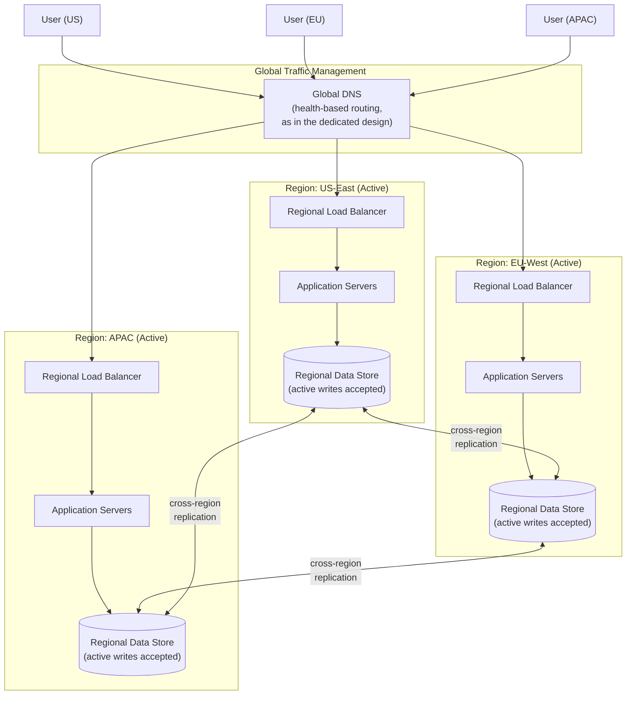
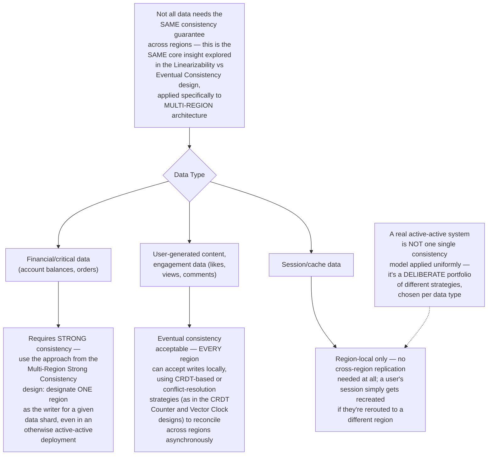
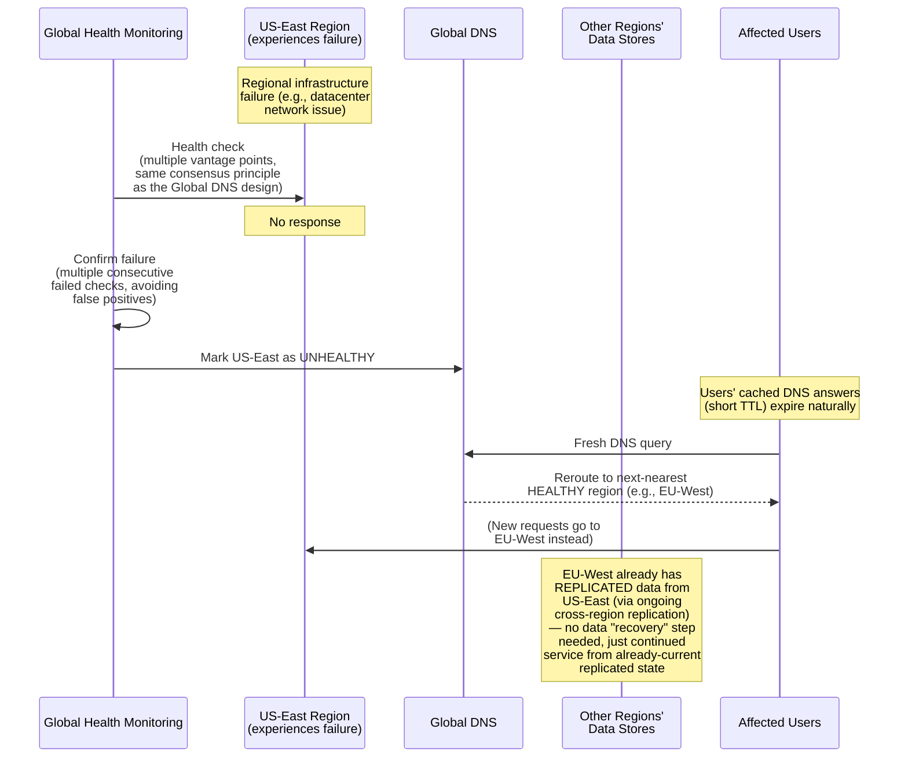
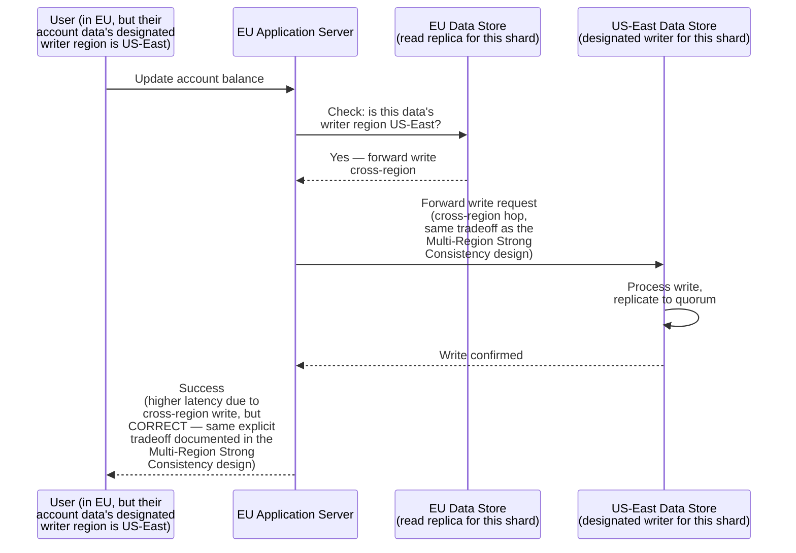
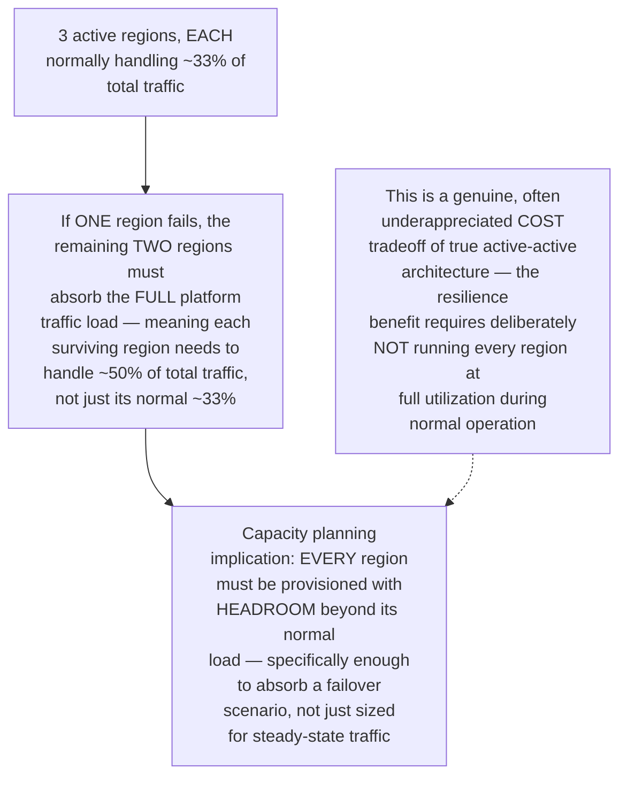
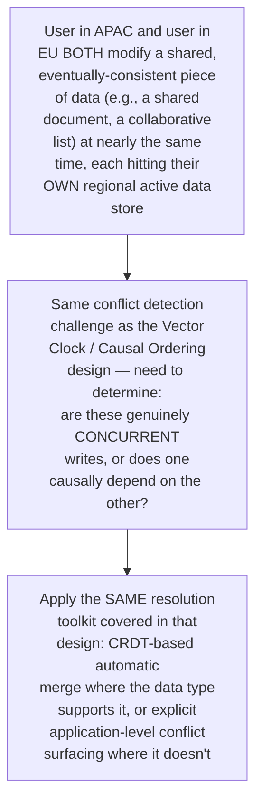
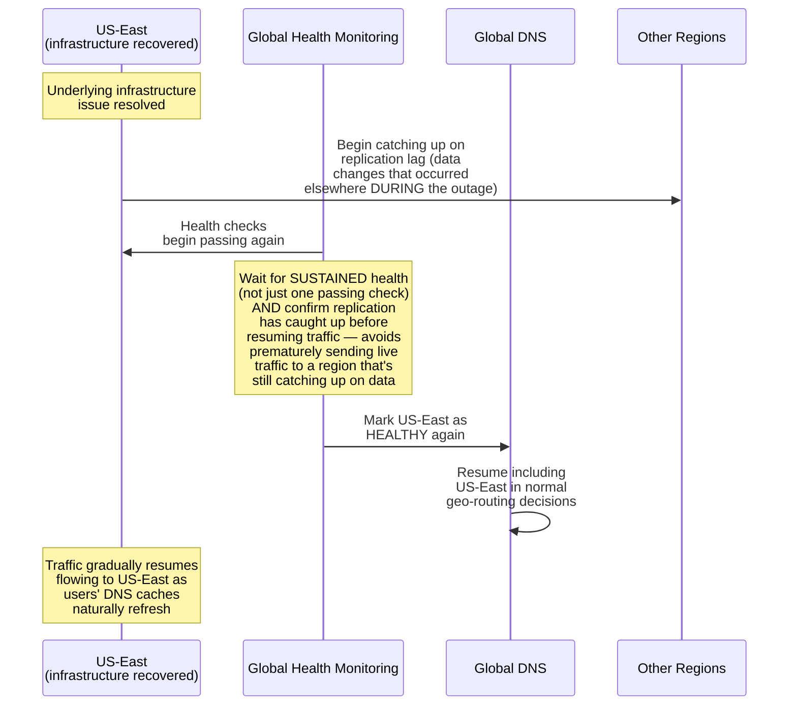
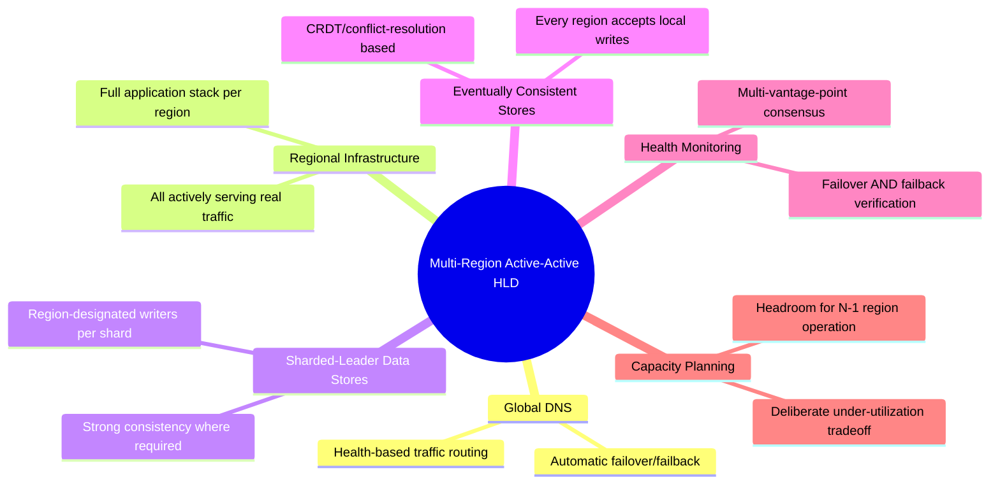

# Design a Multi-Region Active-Active Deployment with Automated Failover — High-Level Design Document

## 1. Requirements

### Functional Requirements
- Run the platform simultaneously "live" (active) across multiple geographic regions, not just one primary with passive standbys
- Serve user traffic from the nearest/best-performing region under normal conditions
- Automatically detect a regional failure and reroute affected traffic to healthy regions
- Support data consistency across regions appropriate to each data type's actual requirements

### Non-Functional Requirements
- **RTO (Recovery Time Objective):** How quickly must the system recover full functionality after a regional failure? Target: seconds to low minutes, not hours
- **RPO (Recovery Point Objective):** How much data loss is acceptable in the worst case? Target: near-zero for critical data, small bounded window for less-critical data
- **True active-active, not active-passive:** ALL regions handle real production traffic continuously, not sitting idle as pure backups — this maximizes infrastructure utilization but requires solving harder consistency problems
- **Graceful degradation:** A regional failure should degrade capacity/performance, not cause a complete platform outage

### Back-of-Envelope Estimation
| Metric | Value |
|---|---|
| Active regions | 3+ (allows continued majority/quorum operation even if one fails) |
| RTO target | < 60 seconds for automated failover |
| RPO target | Near-zero for financial/critical data, seconds for less-critical data |
| Cross-region replication latency | 50-150ms depending on geographic distance |

---

## 2. Active-Active vs Active-Passive — The Fundamental Choice

---

## 3. High-Level Architecture

**Key idea:** Global DNS (the earlier dedicated design) directs each user to their geographically nearest healthy region under normal conditions — but critically, EVERY region is simultaneously capable of handling ANY user's traffic, with data continuously replicated across all regions. This is what makes failover fast: rerouting traffic doesn't require "waking up" a dormant region, since all regions are already actively serving traffic and holding replicated data.

---

## 4. Data Consistency Strategy — Matching Model to Data Type

---

## 5. Regional Failure Detection & Failover — Detailed Sequence

**Why this failover is fast compared to active-passive:** Because EU-West was ALREADY actively serving its own regional traffic and ALREADY had continuously-replicated data, there's no "promote standby to primary" step required — rerouting is purely a traffic-direction change (handled by the Global DNS design's health-based routing), not an infrastructure activation process.

---

## 6. Handling Writes for Strongly-Consistent Data During Normal Operation

*This directly reuses the sharded-leader approach from the Multi-Region Strong Consistency design — even within an overall "active-active" deployment philosophy, individual pieces of STRONGLY CONSISTENT data still need a single designated writer region at any given time, accepting the cross-region latency cost for users outside that data's home region.*

---

## 7. Regional Capacity Planning for Failover

---

## 8. Data Replication Conflict Resolution

---

## 9. Automated Failback (Region Recovery)

**Why replication catch-up verification matters before resuming traffic:** A region that JUST recovered infrastructure-wise may still be behind on replicating changes that occurred in OTHER regions during its downtime — sending live traffic to it before this catch-up completes risks serving genuinely stale data to users, which is why health checks for failback should verify data currency, not just basic service availability.

---

## 10. Component Responsibilities Summary

---

## 11. Key Design Decisions & Tradeoffs

| Decision | Choice | Why |
|---|---|---|
| Deployment model | True active-active (not active-passive) | Maximizes infrastructure utilization and enables fast failover (rerouting, not promotion), at the cost of solving harder multi-writer consistency problems |
| Consistency strategy | Per-data-type, not uniform | Different data has genuinely different consistency needs — financial data needs strong consistency (single-writer sharding); engagement data can be eventually consistent |
| Failover mechanism | Global DNS health-based rerouting | Directly reuses the dedicated Global DNS design's health-routing capability — traffic redirection, not infrastructure activation |
| Capacity provisioning | Headroom beyond steady-state for N-1 region operation | A genuine, deliberate cost tradeoff — true resilience requires NOT running every region at full utilization normally |
| Failback | Verified replication catch-up before resuming traffic | Prevents serving stale data from a region that's infrastructure-healthy but not yet data-current |

---

## 12. Bottlenecks & Scaling Considerations

- **Cross-region write latency for strongly-consistent data** — this remains the same fundamental, unavoidable cost explored in the Multi-Region Strong Consistency design; active-active doesn't eliminate this physics-bound tradeoff for data genuinely requiring strong consistency, it only optimizes the deployment/failover MODEL around it.
- **Capacity headroom cost** — provisioning every region to absorb a failover scenario (not just steady-state load) is a real, ongoing infrastructure cost — this must be weighed against the business cost of reduced resilience if headroom is trimmed to save money, a genuine business/engineering tradeoff decision.
- **Conflict resolution complexity growth** — as MORE regions actively accept writes simultaneously (versus a simpler 2-region setup), the space of possible concurrent-write conflict scenarios grows, requiring more thorough testing and potentially more sophisticated CRDT/merge strategies.
- **Testing failover reliability** — the entire value proposition of this architecture depends on failover actually working correctly when a REAL regional failure occurs — this requires regular, deliberate failover drills/chaos engineering exercises (simulating actual regional outages) rather than only trusting the mechanism theoretically, since failover logic that's never genuinely exercised risks having accumulated subtle bugs by the time it's actually needed.
- **Partial regional degradation (not full outage)** — real-world failures aren't always clean "region fully down" events; a region might be PARTIALLY degraded (e.g., elevated latency, a subset of services failing) — health checking and failover logic designed only for binary healthy/unhealthy states may not handle these partial-degradation scenarios gracefully, requiring more nuanced health signals than simple pass/fail.
- **Coordination and monitoring complexity** — operating genuinely active-active infrastructure across multiple regions, each independently serving real production traffic, requires unified cross-region monitoring/alerting/deployment tooling — the operational complexity of managing N fully-active regions is substantially higher than managing one active region with passive standbys, a real organizational and tooling investment beyond the architecture itself.
