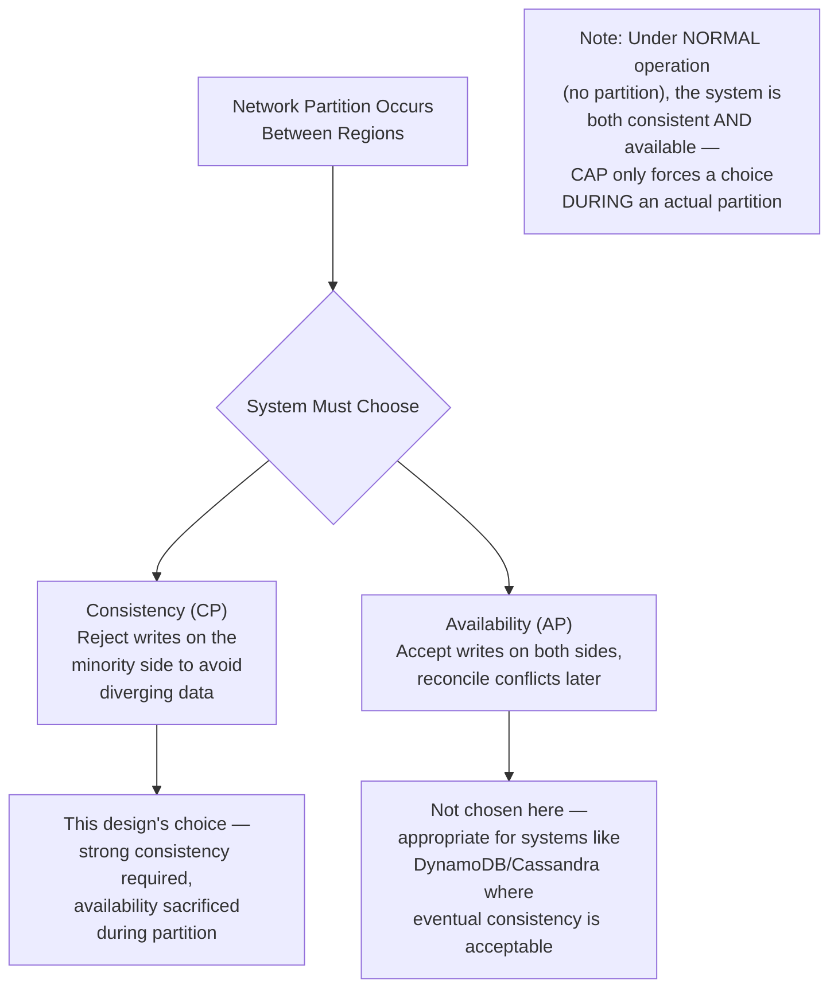
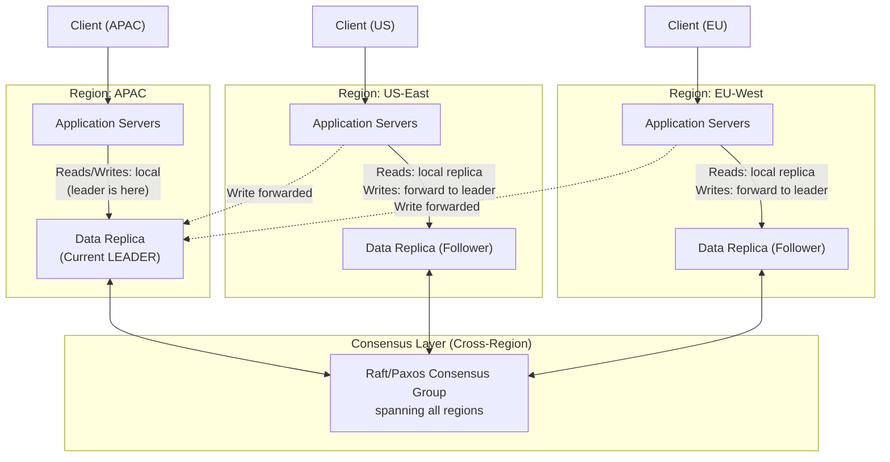
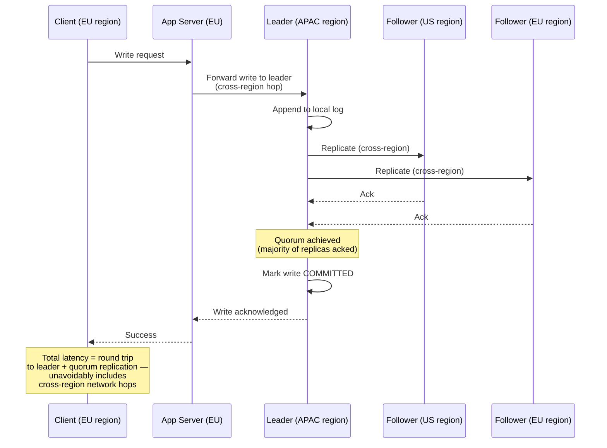
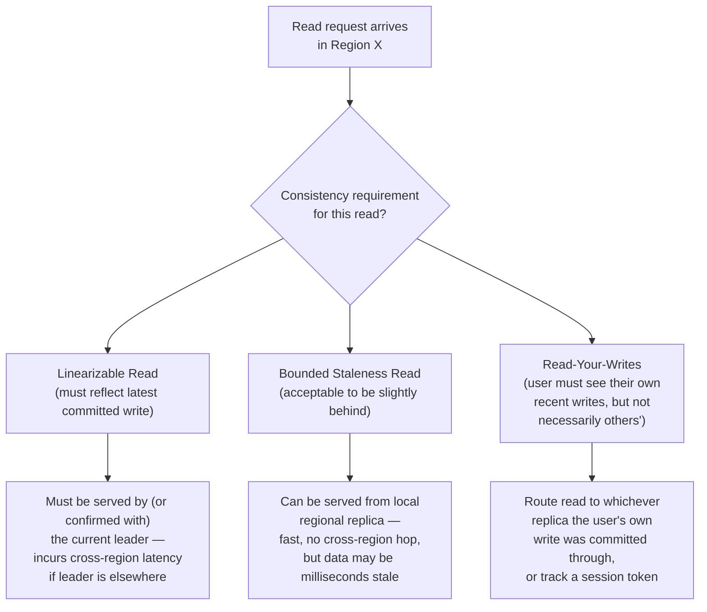
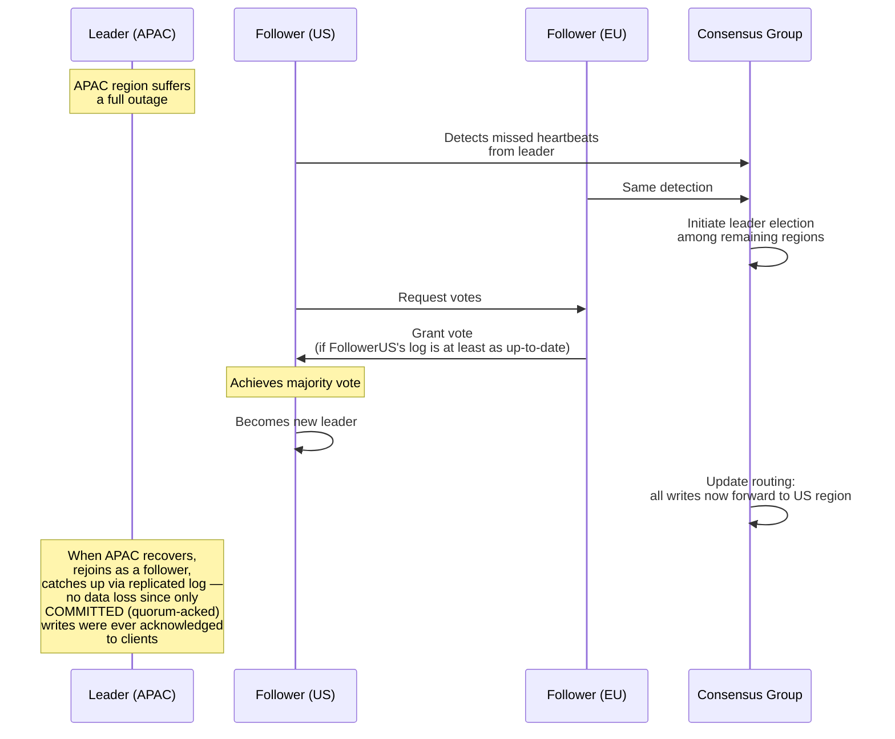
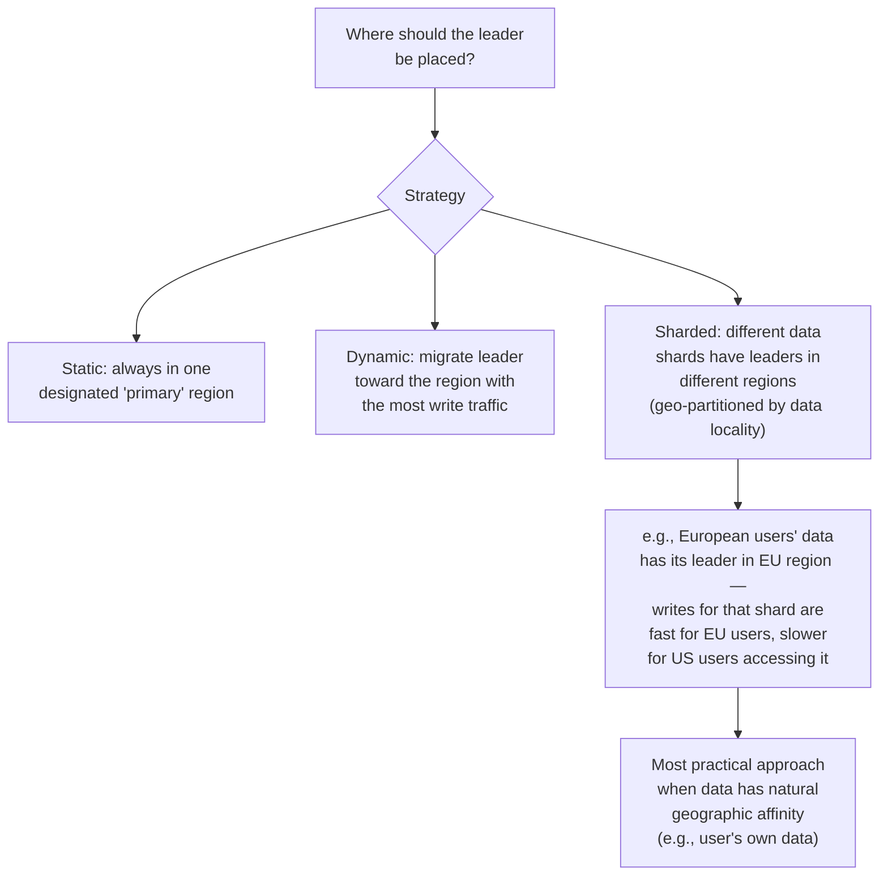
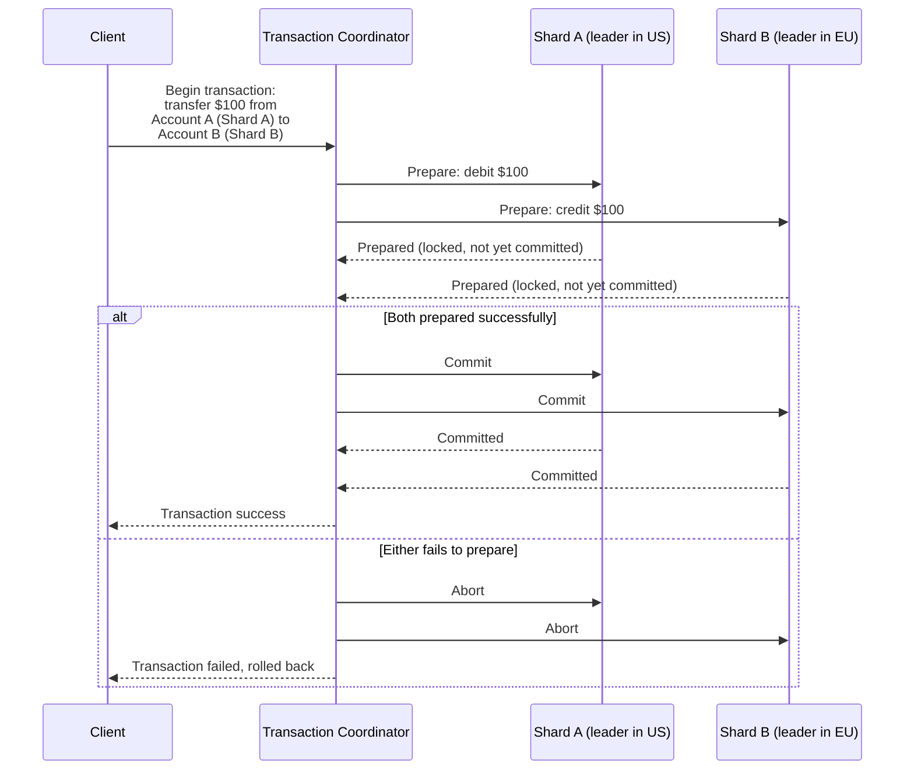
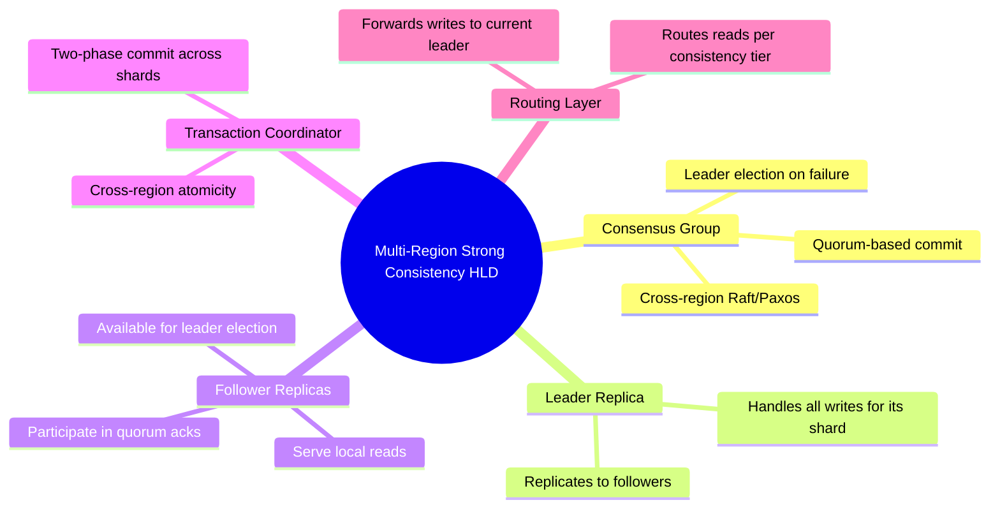

# Design a Multi-Region System with Strong Consistency — High-Level Design Document

## 1. Requirements

### Functional Requirements
- Data must be replicated across multiple geographic regions for disaster recovery and read locality
- Writes must be linearizable/strongly consistent — a read after a committed write must never see stale data, regardless of which region serves it
- System must remain available for reads even if one region fails
- Support cross-region transactions where needed (e.g., financial transfers)

### Non-Functional Requirements
- **Consistency:** Strong/linearizable consistency is a hard requirement (this is the defining constraint of the whole design)
- **Availability:** Must tolerate a full region outage without data loss, though CAP theorem means write availability may be sacrificed during partitions
- **Latency:** Cross-region consensus inherently adds latency (speed of light is a real constraint) — must be minimized, not eliminated
- **Durability:** No committed write can ever be lost, even in a regional disaster

### Back-of-Envelope Estimation
| Metric | Value |
|---|---|
| Regions | 3-5 (e.g., US-East, US-West, EU, APAC) |
| Inter-region latency | 50-150ms depending on geographic distance |
| Writes/sec (global) | ~100,000 |
| Consensus round-trip overhead | Directly bounded by cross-region network latency |
| Read latency target (local region) | < 10ms if served locally |

---

## 2. The Core Tension — CAP Theorem in Practice

---

## 3. High-Level Architecture

**Key idea:** A single logical dataset has one leader at a time (residing in one region), with synchronously-replicated followers in other regions via a consensus protocol. Writes from any region must reach the leader and achieve quorum acknowledgment before being considered committed — this is what enforces strong consistency at the cost of write latency for regions far from the leader.

---

## 4. Strongly Consistent Write Flow — Detailed Sequence

**Why this is inherently slower than a single-region system:** Strong consistency requires waiting for a quorum of geographically distributed replicas to acknowledge before confirming a write — there's no way around the physical network latency this requires. This is a deliberate, unavoidable tradeoff, not an implementation inefficiency.

---

## 5. Read Path — Consistency Options

*Most real-world systems don't uniformly require full linearizability for every read — offering tiered read consistency options (with clear tradeoffs) lets different use cases within the same system choose the right latency/consistency point for their needs.*

---

## 6. Leader Placement & Failover

**Why no data loss on failover:** Because writes are only acknowledged to clients after achieving quorum (majority) replication, any write the client believes succeeded is guaranteed to exist on a majority of replicas — including at least one that participates in electing the new leader. A minority-replicated, unacknowledged write might be lost, but the client was never told it succeeded in the first place.

---

## 7. Leader Placement Strategy (Minimizing Latency Impact)

---

## 8. Cross-Region Transactions (Multi-Shard Atomicity)

*This is a classic two-phase commit (2PC) pattern layered on top of the per-shard consensus groups — necessary when a single logical transaction must atomically span data with leaders in different regions/shards, at the cost of additional latency and coordinator complexity.*

---

## 9. Component Responsibilities Summary

---

## 10. Key Design Decisions & Tradeoffs

| Decision | Choice | Why |
|---|---|---|
| Consistency model | CP (favor consistency over availability during partition) | Explicit requirement — strong consistency is non-negotiable for this system's use case |
| Replication protocol | Consensus-based (Raft/Paxos) with quorum commit | Only mechanism that guarantees no data loss and no split-brain across regions |
| Leader placement | Sharded/geo-partitioned by data locality where possible | Minimizes cross-region latency for the common case where data has a natural "home" region |
| Read consistency | Tiered options (linearizable / bounded-staleness / read-your-writes) | Not every read needs full linearizability; offering options avoids paying maximum latency cost universally |
| Cross-shard transactions | Two-phase commit coordinator | Necessary for atomicity when a transaction spans shards with different regional leaders |
| Failover | Automatic leader re-election via consensus | Ensures continued availability (for writes) after a regional outage, without manual intervention |

---

## 11. Bottlenecks & Scaling Considerations

- **Cross-region write latency is fundamental, not fixable** — no architecture eliminates the speed-of-light cost of achieving quorum across geographically distant regions; the only lever is *minimizing which writes need to cross regions* (via smart sharding/leader placement).
- **Leader region becomes a hotspot** — all writes for a given shard funnel through one region; if that region's traffic grows disproportionately, may need finer-grained sharding to distribute leadership more evenly.
- **Quorum size vs fault tolerance tradeoff** — a 5-region deployment requiring 3-of-5 quorum tolerates 2 simultaneous region failures; fewer regions or a stricter quorum requirement reduces this tolerance — this is a deliberate capacity planning decision.
- **Two-phase commit blocking** — if the transaction coordinator crashes mid-transaction (after "prepare" but before "commit/abort"), participating shards can be left holding locks indefinitely; production systems need coordinator failure recovery (e.g., a backup coordinator that can resume from a durable transaction log).
- **Read replica staleness monitoring** — for bounded-staleness reads, the system must actively track and expose replication lag so applications can make informed decisions about which consistency tier to request.
- **Network partition duration** — a prolonged partition means the leader's region (if it's on the minority side) becomes fully unavailable for writes; this is the direct, accepted cost of choosing CP over AP, and must be clearly communicated to downstream consumers/SLAs.
- **Testing and chaos engineering** — a system this reliant on correct consensus behavior under failure needs extensive fault-injection testing (simulated partitions, leader crashes) since these failure paths are rare in normal operation but catastrophic if subtly broken.
