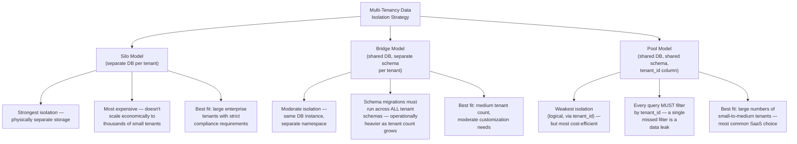
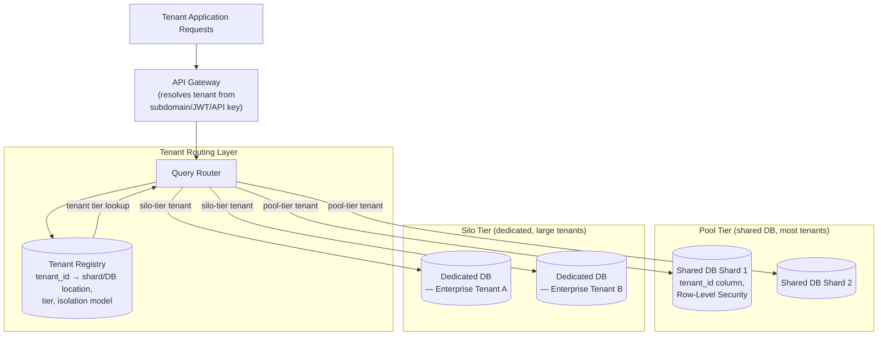
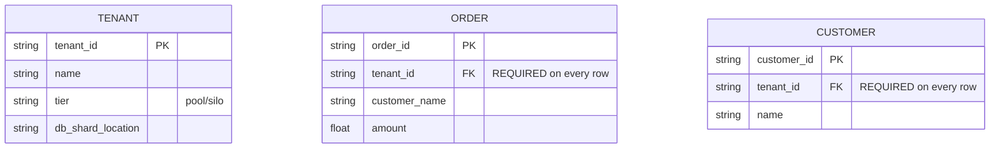
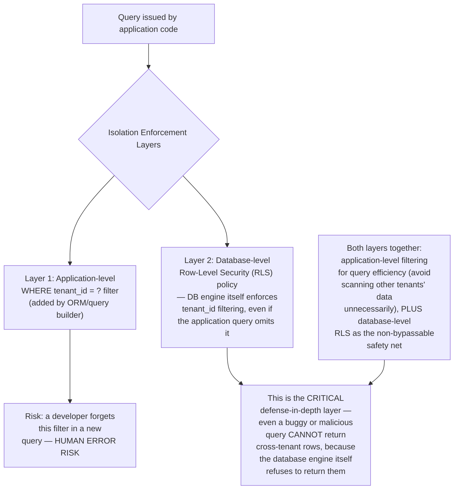
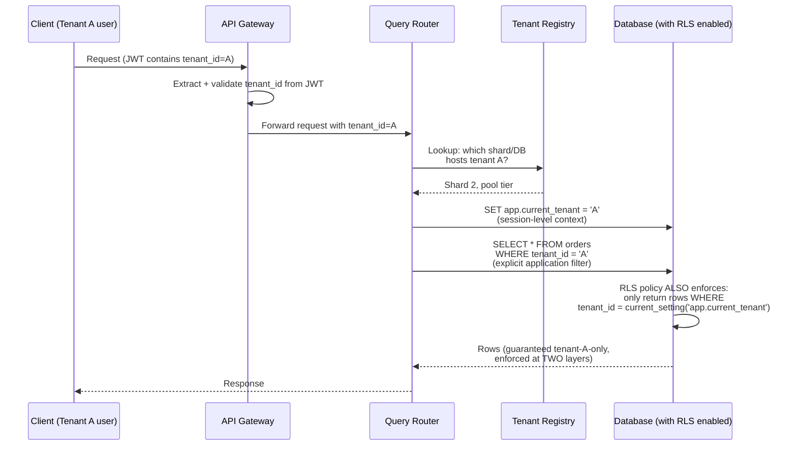
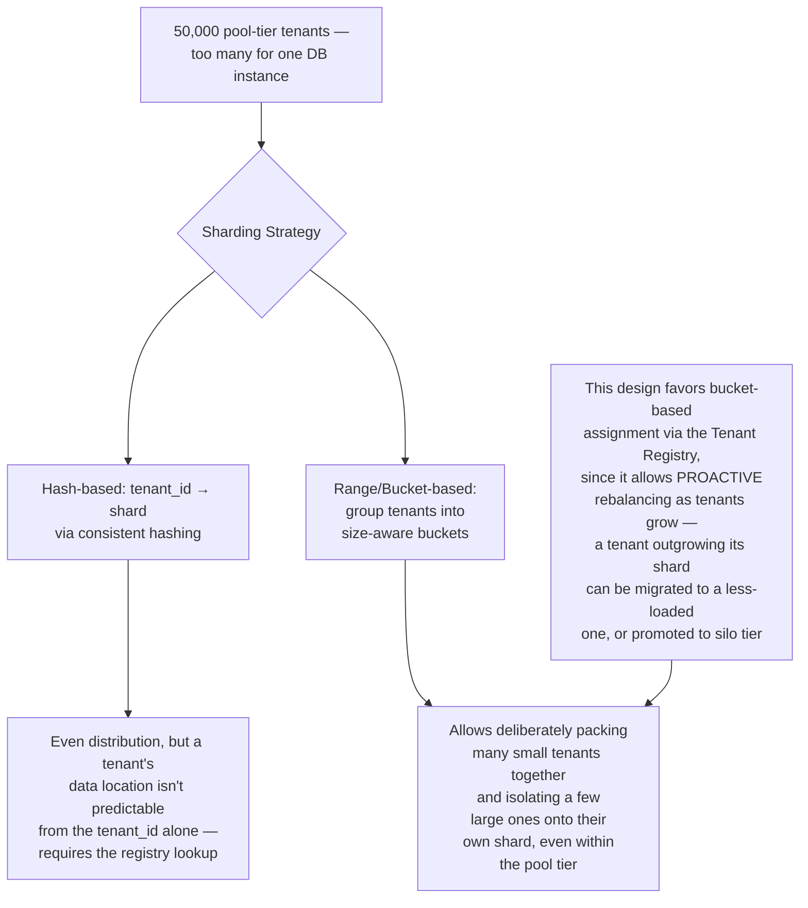
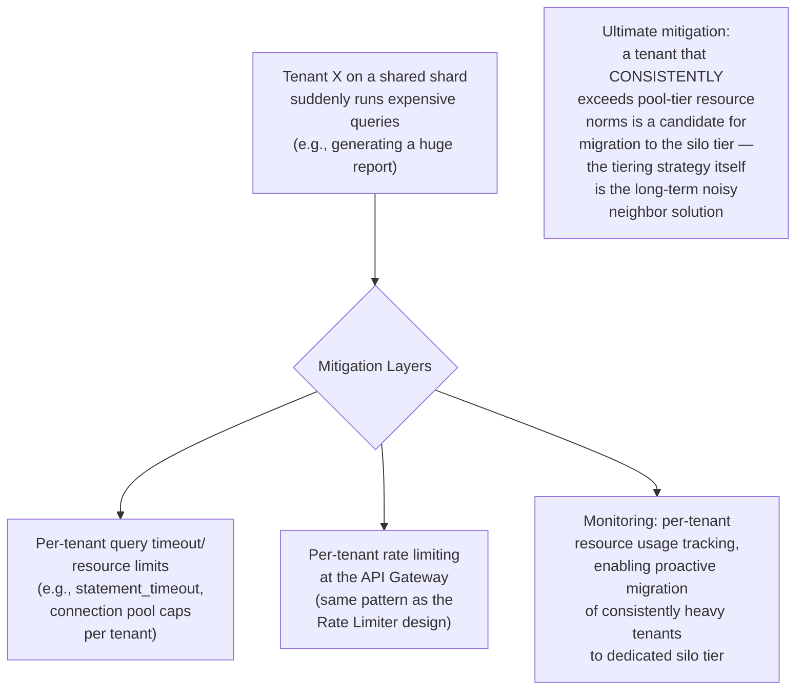
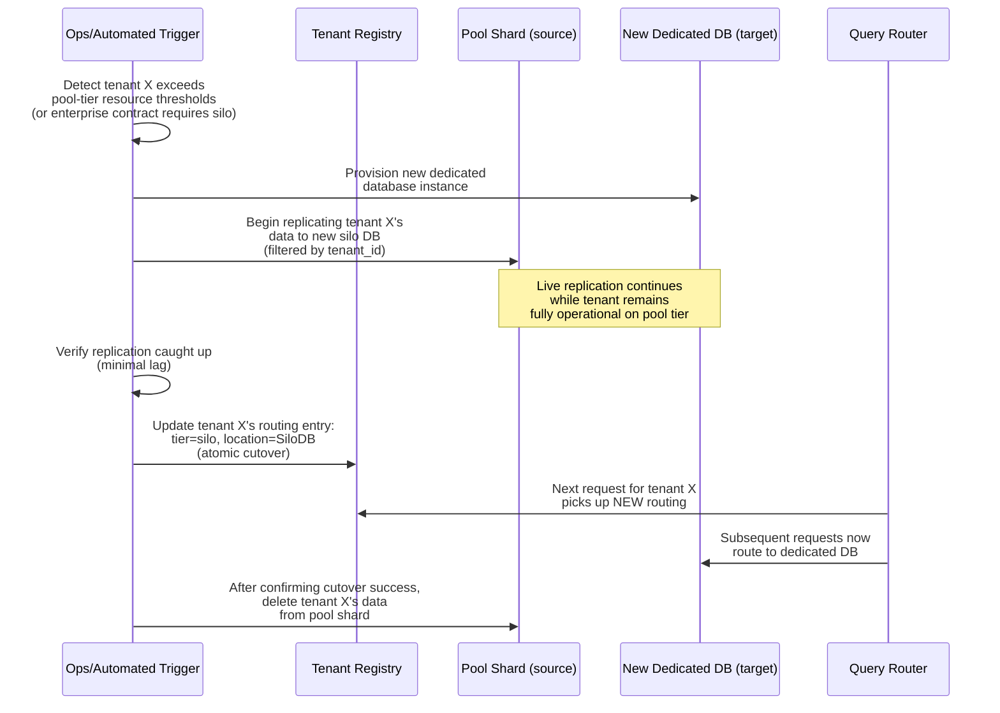
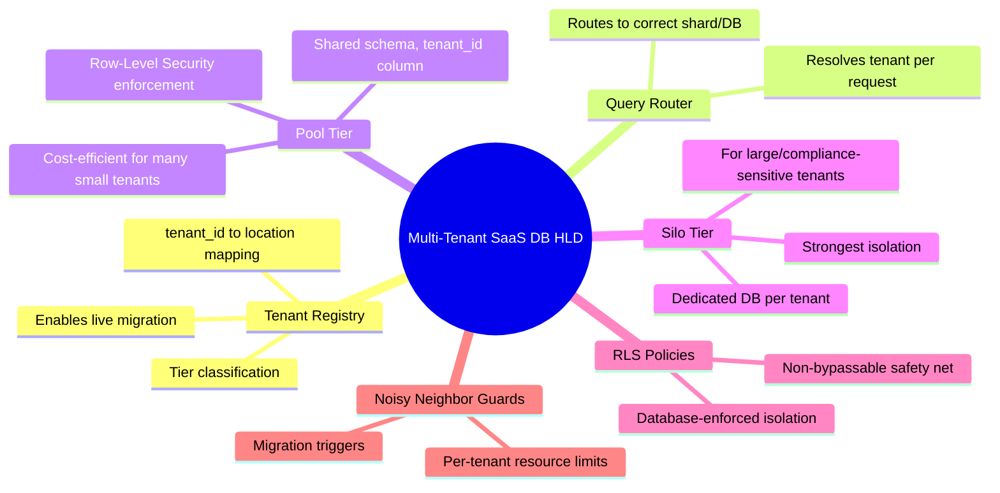

# Design a Multi-Tenant SaaS Database Architecture — High-Level Design Document

## 1. Requirements

### Functional Requirements
- Support many independent customer organizations (tenants) sharing the same application
- Strict data isolation — one tenant must never see another tenant's data, even accidentally
- Support tenant-specific customization (custom fields, varying feature sets) without schema chaos
- Onboard new tenants quickly, and support offboarding/data export cleanly

### Non-Functional Requirements
- **Isolation (the paramount property):** A bug or query error must never leak cross-tenant data — this is both a security and contractual (SLA) requirement
- **Cost efficiency:** Running a fully separate database per tenant doesn't scale economically for a large number of small tenants
- **Noisy neighbor protection:** One tenant's heavy usage shouldn't degrade performance for others
- **Scalability:** Must accommodate both many small tenants and a few very large enterprise tenants within the same overall architecture

### Back-of-Envelope Estimation
| Metric | Value |
|---|---|
| Total tenants | ~50,000 (mix of small/medium/large) |
| Largest tenant data size | Could be 1000x+ larger than smallest |
| Total data volume | Multi-terabyte to petabyte scale |
| Queries/sec (platform-wide) | ~100,000+ |
| Tenant onboarding target | Minutes, not hours |

---

## 2. The Three Fundamental Isolation Models

**This design uses a hybrid approach:** pool model (shared schema, `tenant_id` column) as the default for most tenants, with an escape hatch to the silo model (dedicated database) for large enterprise tenants who need it for compliance or performance isolation reasons — a pattern used by most successful large-scale SaaS platforms.

---

## 3. High-Level Architecture (Hybrid Model)

**Key idea:** The Query Router is the critical component that decides, per request, where a given tenant's data actually lives. This indirection is what allows tenants to be **migrated** between tiers (e.g., a growing pool-tier tenant graduating to a dedicated silo) without any application code changes — only the registry entry needs updating.

---

## 4. Data Model (Pool Model — Shared Schema)

**Key modeling rule:** In the pool model, `tenant_id` is a **mandatory, indexed column on every single table** — not an optional field. This isn't just a modeling convention; it's the foundational mechanism that makes logical isolation possible at all in a shared-schema architecture.

---

## 5. Enforcing Isolation — Row-Level Security (Defense in Depth)

---

## 6. Tenant-Scoped Query Flow — Detailed Sequence

---

## 7. Tenant Sharding Strategy (Distributing Pool-Tier Tenants)

---

## 8. Noisy Neighbor Mitigation

---

## 9. Tenant Migration Between Tiers (Pool → Silo)

**Why this migration capability matters architecturally:** Designing the routing indirection (Tenant Registry) from day one — even before any tenant actually needs to migrate — is what makes this kind of live, zero-downtime tier migration possible later. Retrofitting this indirection after tenants are hard-wired to specific databases is significantly harder.

---

## 10. Component Responsibilities Summary

---

## 11. Key Design Decisions & Tradeoffs

| Decision | Choice | Why |
|---|---|---|
| Isolation model | Hybrid (pool tier default, silo tier for large/enterprise tenants) | Balances cost-efficiency for the long tail of small tenants against strong isolation needs for large/compliance-sensitive ones |
| Isolation enforcement | Application filter + database Row-Level Security | Defense in depth — RLS provides a non-bypassable safety net even if application-level filtering has a bug |
| Tenant location tracking | Central Tenant Registry with indirection | Enables live tier migration and shard rebalancing without hardcoding tenant-to-database mappings in application code |
| Sharding for pool tier | Bucket-based (not pure hash) assignment | Allows deliberate packing/isolation decisions (e.g., keeping consistently heavy tenants separated) rather than purely random distribution |
| Noisy neighbor handling | Per-tenant resource limits + proactive tier migration | Technical limits provide immediate protection; migration provides the long-term structural solution for consistently heavy tenants |

---

## 12. Bottlenecks & Scaling Considerations

- **Schema migrations across shared-schema pool tier** — a schema change must be applied consistently across all pool-tier shards; needs careful migration tooling (e.g., online schema change tools) to avoid downtime affecting many tenants simultaneously.
- **RLS performance overhead** — row-level security policies add a filtering condition to every query at the database engine level; while essential for safety, this must be accounted for in query performance tuning and indexing strategy (tenant_id should always be part of relevant indexes).
- **Hot pool-tier shards** — even with bucket-based assignment, uneven tenant growth can create imbalanced shards over time; requires ongoing monitoring and periodic rebalancing (which itself needs the same live-migration capability described for pool-to-silo moves).
- **Cross-tenant analytics/reporting** — platform-wide analytics (e.g., "total revenue across all tenants") become more complex in a sharded, multi-tier architecture; typically requires a separate data warehouse/ETL pipeline aggregating across all shards and silos, rather than querying operational databases directly.
- **Backup/restore complexity** — silo-tier tenants need independent backup schedules; pool-tier backups must support tenant-level granular restore (e.g., "restore only tenant X's data from this backup") which is harder than a simple full-database restore.
- **Tenant offboarding (GDPR-style deletion)** — cleanly and completely removing one tenant's data from a shared-schema pool database (without affecting others) requires careful, tenant_id-scoped deletion logic and verification — this is directly related to the "right to be forgotten" challenge covered in the GDPR compliance system design.
- **Testing isolation guarantees** — given that isolation is the single most safety-critical property of this entire system, automated tests that deliberately attempt cross-tenant data access (and verify it's blocked) should be a standing, continuously-run part of the test suite, not a one-time verification.
