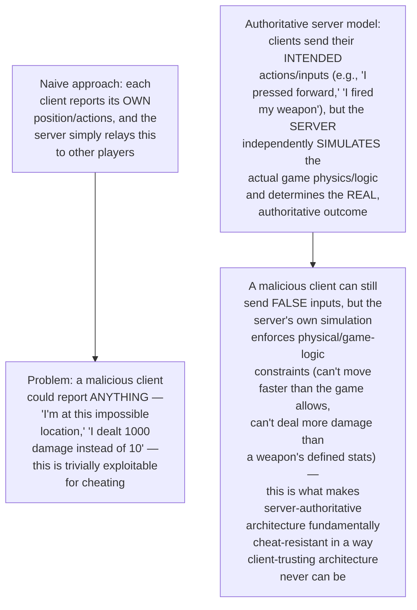
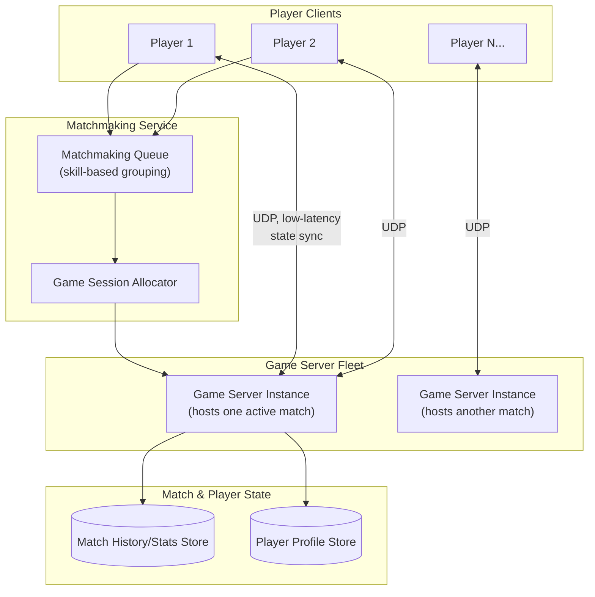
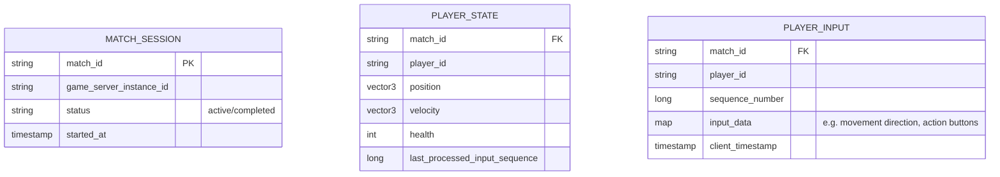
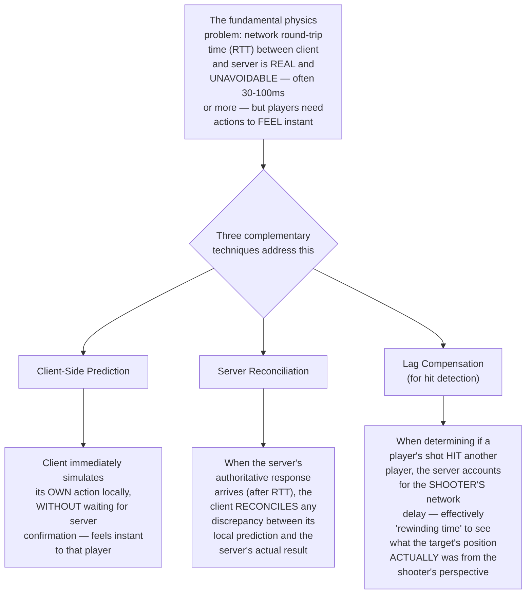
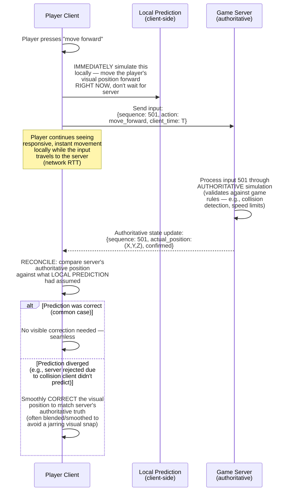
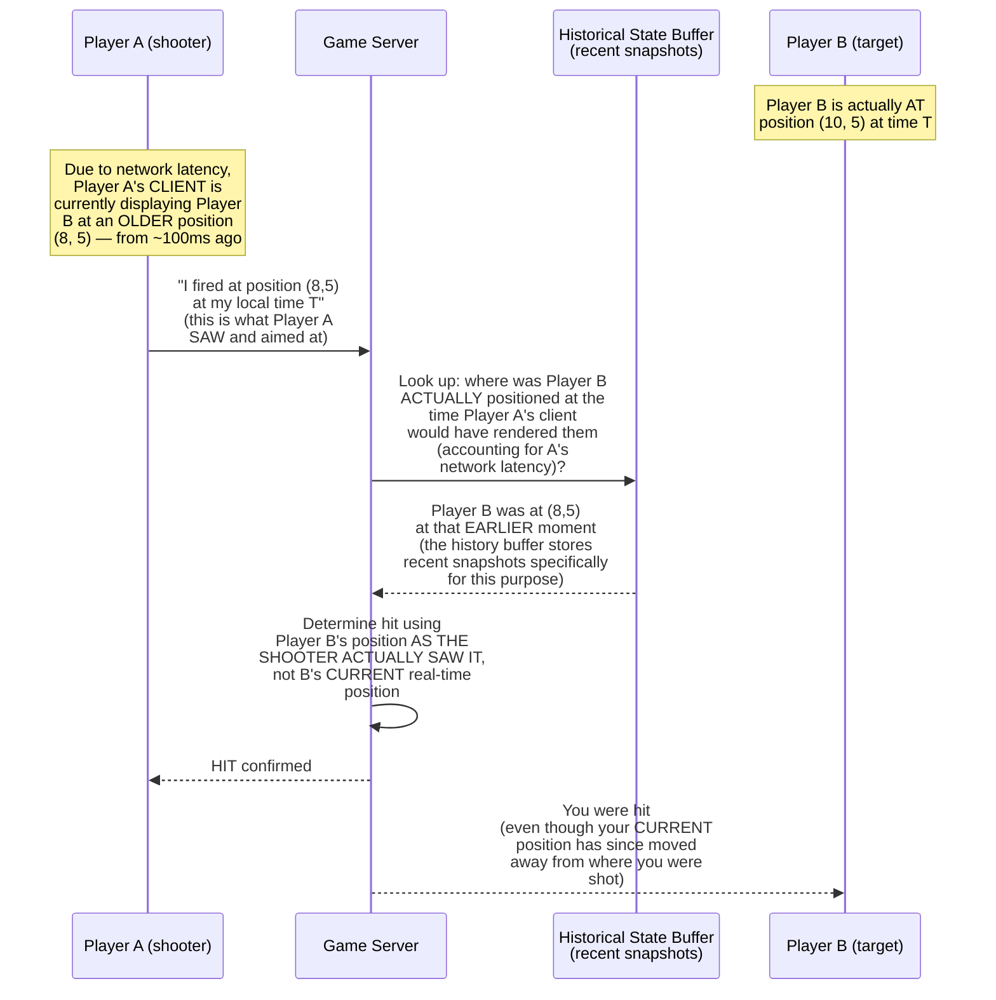
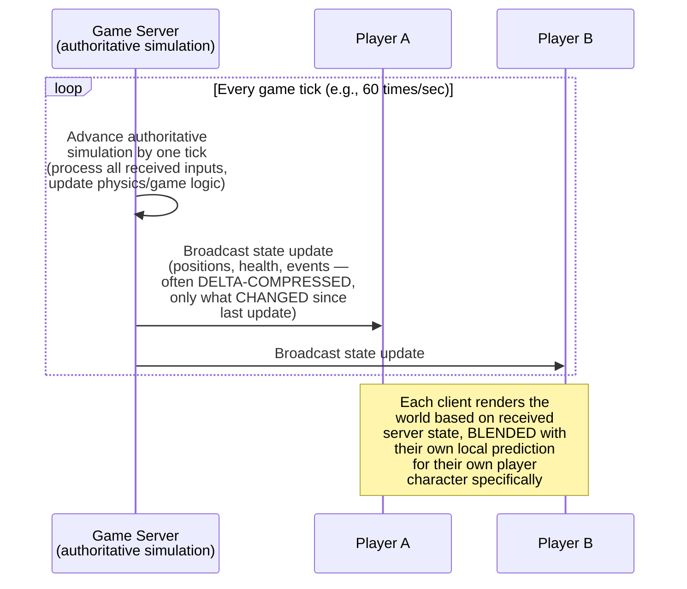
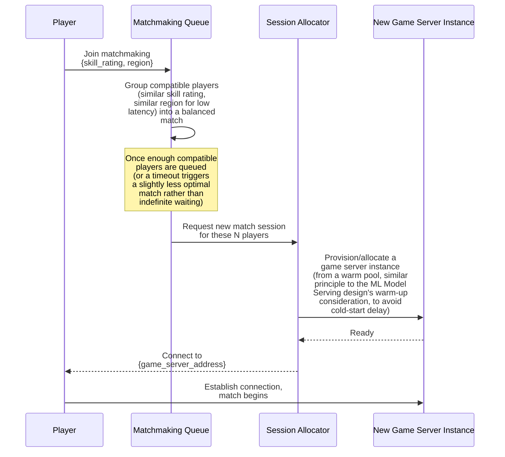
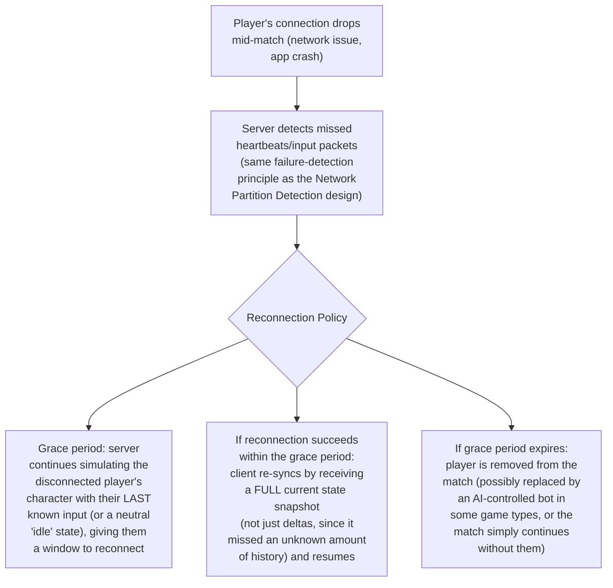
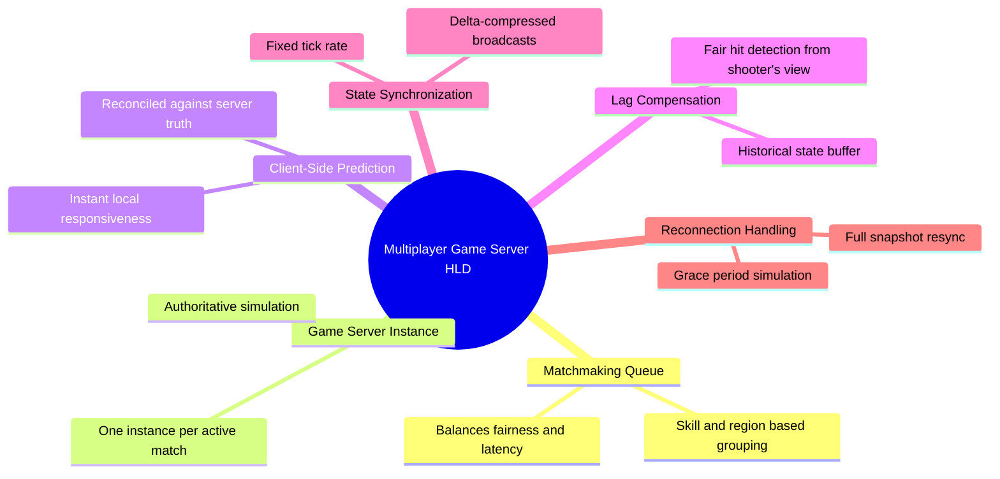

# Design a Multiplayer Game Server Architecture — High-Level Design Document

## 1. Requirements

### Functional Requirements
- Synchronize real-time game state (player positions, actions, world events) across all players in a match
- Handle player actions with responsive, low-latency feel despite real network delay between client and server
- Support matchmaking to group players into balanced sessions
- Maintain authoritative game state that clients cannot manipulate to cheat

### Non-Functional Requirements
- **Extremely low perceived latency:** Players need actions to feel instant, despite real network round-trip time (RTT) working against this
- **Cheat resistance:** The server, not any client, must be the ultimate authority on what actually happened in the game
- **Consistent state across all players:** Every player must see a coherent, fair version of the game world, despite each having different network conditions
- **Scalability:** Must support many concurrent game sessions/matches simultaneously, each potentially with many players

### Back-of-Envelope Estimation
| Metric | Value |
|---|---|
| Concurrent matches | Thousands to tens of thousands |
| Players per match | 2-100, depending on game genre |
| State updates/sec (per match) | 20-60 (tick rate) |
| Acceptable RTT for "responsive" feel | Under ~100-150ms, ideally much lower |

---

## 2. The Core Principle — Authoritative Server, Not Trusting Any Client

---

## 3. High-Level Architecture

**Key idea:** Each active match is hosted by ONE dedicated game server instance, which acts as the single authoritative simulation for that match's entire game world — all connected clients communicate exclusively with this server instance (not directly with each other), and the server's simulation is the single source of truth for what actually happened.

---

## 4. Data Model

---

## 5. The Core Latency-Hiding Techniques

---

## 6. Client-Side Prediction & Server Reconciliation — Detailed Sequence

**Why this combination gives BOTH responsiveness AND correctness:** The player experiences instant, responsive movement (client-side prediction), while the server's independent, authoritative simulation remains the actual source of truth (preventing cheating) — reconciliation is what bridges these two, silently correcting the rare cases where prediction and authoritative reality diverge, ideally so smoothly the player never notices.

---

## 7. Lag Compensation for Hit Detection — Detailed Sequence

**Why this "rewinding time" approach is considered fair, not a compromise:** Without lag compensation, a player with network latency would experience the deeply frustrating "I clearly hit them, but the game says I missed" problem, because by the time their shot reaches the server, the target has already moved past where the shooter genuinely saw them — lag compensation restores fairness FROM THE SHOOTER'S PERSPECTIVE, which is the perspective that actually matters for a satisfying, fair gameplay experience.

---

## 8. Game State Synchronization (Server to All Clients)

**Why delta compression matters for state updates:** Sending the FULL game state (every player's position, every object) on every single tick, dozens of times per second, to every connected client, would consume substantial bandwidth; sending only what's CHANGED since the last update dramatically reduces data volume, similar in principle to the delta sync approach in the Mobile Offline Caching and Distributed File Storage designs, applied here at a much higher update frequency.

---

## 9. Matchmaking Flow — Detailed Sequence

**Why regional grouping matters alongside skill matching:** Even a perfectly skill-balanced match will feel unfair or unresponsive if players are matched across continents, since fundamental network RTT scales with geographic distance — matchmaking must balance BOTH competitive fairness (skill) and technical fairness (latency), sometimes accepting a slightly less skill-optimal match in exchange for meaningfully better latency for all participants.

---

## 10. Handling Player Disconnection Mid-Match

---

## 11. Component Responsibilities Summary

---

## 12. Key Design Decisions & Tradeoffs

| Decision | Choice | Why |
|---|---|---|
| Authority model | Server-authoritative, client-predictive | The only architecture that's both cheat-resistant (server enforces real rules) and responsive-feeling (client doesn't wait for round-trip confirmation) |
| Hit detection | Lag-compensated, shooter's-perspective rewind | Restores fairness from the perspective that determines whether the shot genuinely felt like a hit to the player who fired it |
| State updates | Fixed tick rate, delta-compressed | Bounds bandwidth and server processing cost while keeping all clients reasonably synchronized |
| Session hosting | One dedicated server instance per match | Keeps each match's authoritative simulation isolated and simple, scaling horizontally across many concurrent matches rather than one shared mega-simulation |
| Matchmaking | Joint skill + regional balancing | Optimizing purely for skill balance while ignoring latency would undermine the responsiveness the rest of the architecture works hard to achieve |
| Disconnection handling | Grace period + full snapshot resync | Tolerates brief, common connectivity blips without immediately ejecting players, while ensuring a genuinely lost sync state is fully repaired on reconnect, not just patched with deltas |

---

## 13. Bottlenecks & Scaling Considerations

- **Server tick processing time vs tick rate** — the server must complete all simulation work for a tick WITHIN that tick's time budget (e.g., under ~16ms for 60Hz) or updates start lagging; this bounds how much game logic complexity or how many players a single match can support before requiring architecture changes (e.g., splitting simulation across multiple threads/processes for very large player counts, a much harder problem than the embarrassingly-parallel per-security isolation in the Trading Matching Engine design).
- **Network protocol choice (UDP vs TCP)** — most real-time games use UDP specifically because TCP's guaranteed-delivery, in-order semantics can cause a single lost packet to STALL delivery of all subsequent packets (head-of-line blocking) — for real-time state updates, a slightly stale but promptly-delivered update is often preferable to waiting for guaranteed, in-order delivery; this requires the application layer to handle its own reliability/ordering logic where genuinely needed (e.g., critical events) rather than relying on the transport layer.
- **Historical state buffer size for lag compensation** — storing recent snapshots for rewind-based hit detection requires bounded memory per match; the buffer only needs to cover the maximum reasonable player latency (e.g., a few hundred milliseconds of history), not unlimited history.
- **Server fleet capacity planning for matchmaking spikes** — popular games experience highly variable concurrent player counts (peak evening hours, weekend spikes); the game server fleet needs auto-scaling capability with fast provisioning (warm pools) to avoid matchmaking queue delays during demand surges.
- **Cheat detection beyond basic authority** — while server-authoritative architecture prevents the most blatant cheats (teleporting, infinite health), more subtle cheats (aim-assist bots reacting inhumanly fast to legitimate server data) require ADDITIONAL detection layers analyzing player behavior patterns, connecting to similar statistical anomaly-detection principles as the Bot Detection and Fraud Detection designs.
- **Cross-region latency for global matchmaking** — for games with a smaller player population in certain regions, strict regional matchmaking can create excessively long queue times; systems often need a graduated fallback (expand acceptable latency range gradually the longer a player waits) rather than a single rigid regional boundary.
- **Testing under realistic network conditions** — client-side prediction, reconciliation, and lag compensation are all specifically designed to handle network imperfection — but this makes them notoriously hard to test correctly under IDEAL (low-latency, no packet loss) development/testing conditions; realistic testing requires deliberately simulating latency, jitter, and packet loss to verify these systems behave correctly under the actual conditions they're designed for.
