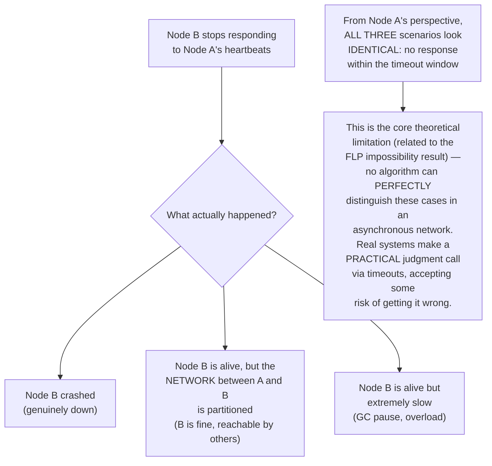
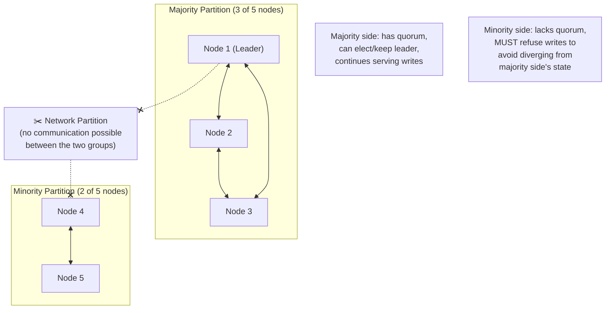
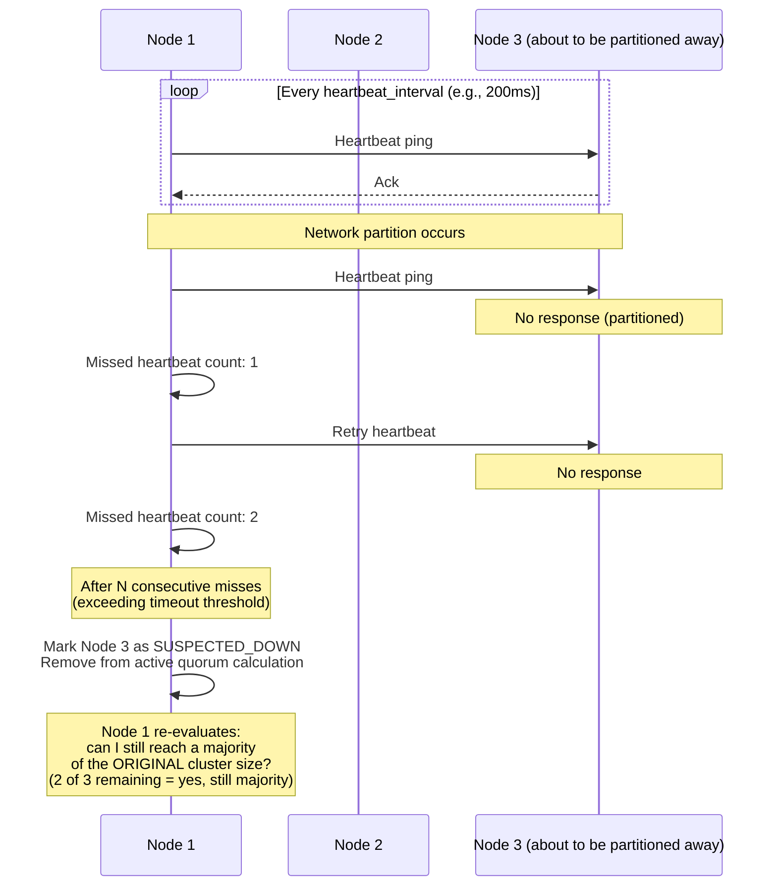
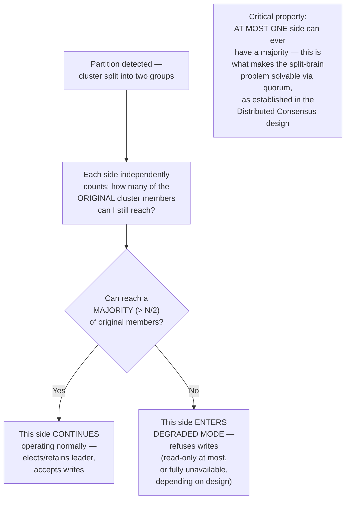
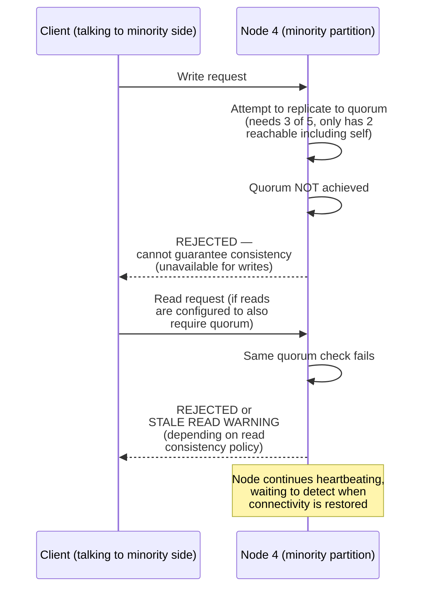
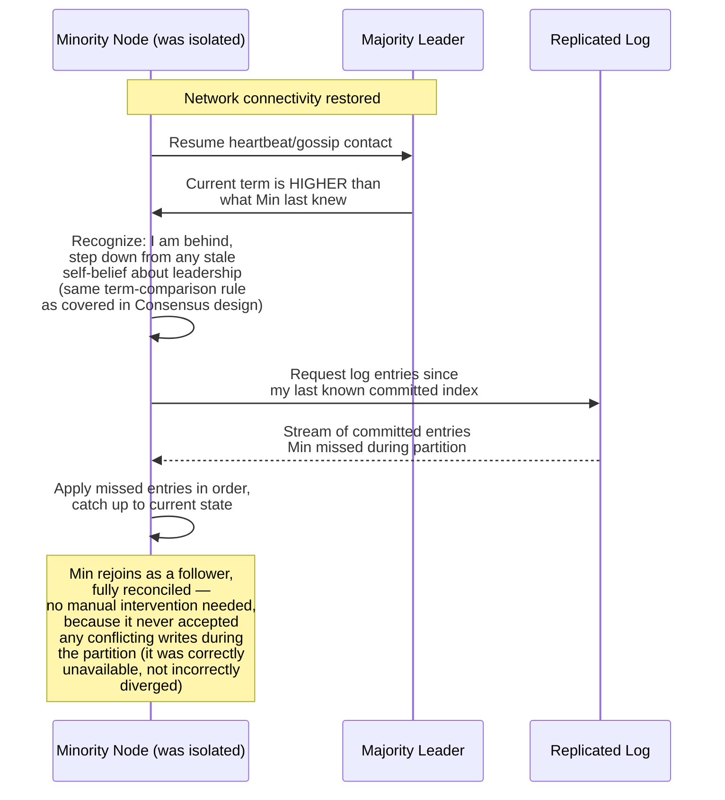
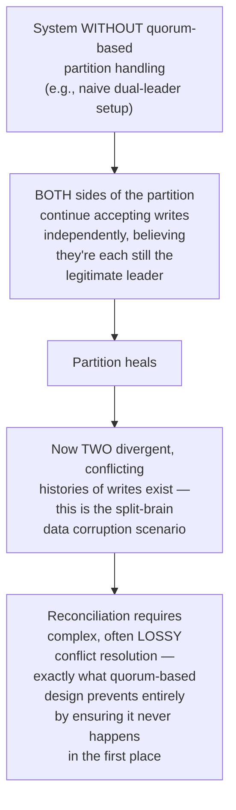
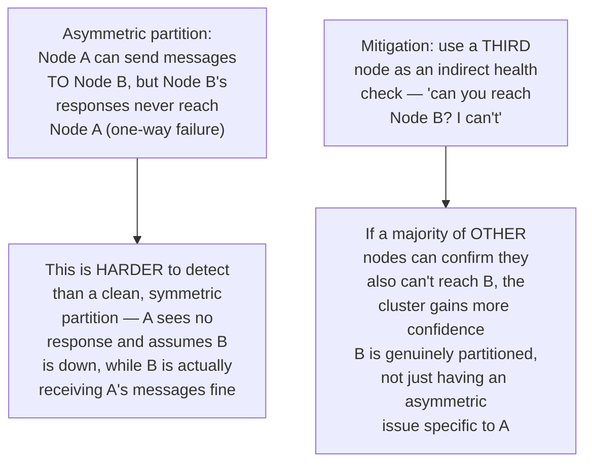
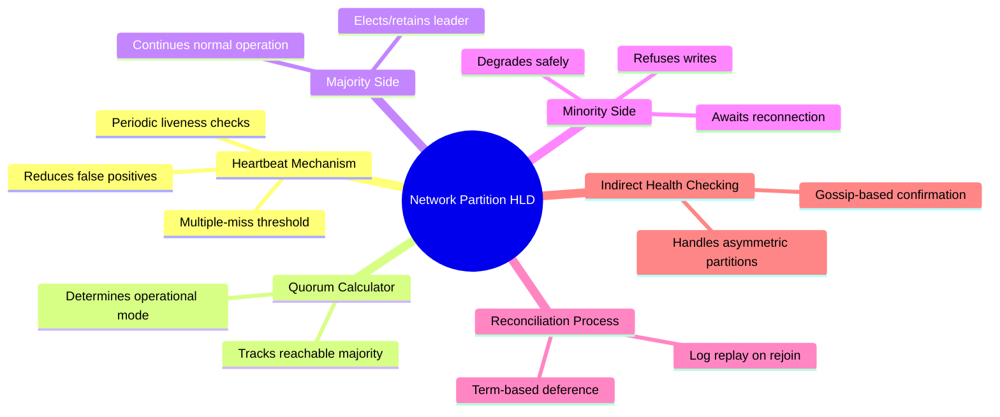

# Design Network Partition Detection & Resolution — High-Level Design Document

## 1. Requirements

### Functional Requirements
- Detect when a network partition has split the cluster into disconnected groups
- Distinguish between "node crashed" and "node is unreachable but alive" (a genuinely hard problem)
- Ensure the system behaves safely during a partition (no split-brain data corruption)
- Automatically reconcile/heal state once the partition resolves

### Non-Functional Requirements
- **Safety over liveness during partition:** When forced to choose, prevent incorrect behavior even if it means reduced availability
- **Fast detection:** Minimize the window where the system operates under a stale view of cluster membership
- **Graceful degradation:** The system should degrade predictably (e.g., minority side becomes read-only) rather than fail unpredictably
- **Automatic healing:** Once connectivity is restored, the cluster should reconcile without requiring manual intervention

### Back-of-Envelope Estimation
| Metric | Value |
|---|---|
| Heartbeat interval | 100ms - 1s, depending on desired detection speed |
| Failure detection timeout | 3-10x heartbeat interval (avoid false positives from single missed beat) |
| Typical partition duration (real world) | Seconds to minutes; rarely hours |
| Reconciliation complexity | Proportional to divergence accumulated during partition |

---

## 2. The Fundamental Problem — You Cannot Distinguish "Dead" from "Unreachable"

---

## 3. High-Level Architecture — Partition-Aware Cluster

**Key idea:** This builds directly on the consensus/quorum mechanisms covered in the Distributed Consensus design — partition detection and resolution isn't a separate bolt-on system, it's the natural consequence of a well-designed quorum-based protocol. The "detection" is really just each side recognizing whether or not it can still achieve a majority.

---

## 4. Failure Detection Mechanism — Detailed Sequence

**Why multiple consecutive missed heartbeats (not just one):** A single missed heartbeat could easily be a transient network blip rather than a genuine partition/failure — requiring several consecutive misses before declaring a node "suspected down" trades a small amount of detection latency for significantly fewer false-positive partition declarations.

---

## 5. Quorum-Based Split Behavior

---

## 6. Minority Side Behavior — Detailed Sequence

*This is the direct, correct consequence of choosing consistency over availability during a partition (the CP choice in CAP theorem terms) — the minority side deliberately sacrifices its own availability specifically to prevent it from silently diverging from the majority side's state.*

---

## 7. Partition Healing / Reconciliation — Detailed Sequence

**Why healing is straightforward here:** Because the minority side was correctly prevented from accepting writes during the partition (rather than accepting them and creating conflicting state), reconciliation is just "catch up on missed history" — a simple log replay — rather than a complex conflict-resolution problem. This is the payoff for accepting reduced availability during the partition.

---

## 8. Contrast: What Happens WITHOUT Proper Quorum Enforcement

---

## 9. Detecting Partial/Asymmetric Partitions (Harder Case)

*Real-world network partitions aren't always the clean "two isolated groups" textbook scenario — asymmetric and partial partitions are common in practice (e.g., a router misconfiguration affecting only certain paths), which is why production systems often incorporate indirect/gossip-based health checking rather than relying solely on direct pairwise heartbeats.*

---

## 10. Component Responsibilities Summary

---

## 11. Key Design Decisions & Tradeoffs

| Decision | Choice | Why |
|---|---|---|
| Failure detection | Timeout-based with multiple-miss threshold | No algorithm can perfectly distinguish "dead" from "unreachable" in an asynchronous network; timeouts are the practical, universally-used compromise |
| Split behavior | Quorum-based (majority continues, minority refuses writes) | Directly prevents split-brain — mathematically guarantees at most one side can make progress |
| Minority side policy | Reject writes (and optionally reads) | Prioritizes correctness over availability during the partition, per the CP choice in CAP theorem |
| Healing mechanism | Log replay from last known committed index | Works cleanly specifically because the minority side never accepted conflicting writes to begin with |
| Partial partition handling | Indirect/gossip-based health confirmation | Direct pairwise heartbeats alone can't reliably detect asymmetric network failures |

---

## 12. Bottlenecks & Scaling Considerations

- **Heartbeat timeout tuning is a genuine tradeoff, not a solved problem** — too aggressive causes false-positive partition declarations during normal transient network jitter (unnecessarily reducing availability); too lenient delays legitimate failure detection — this must be tuned empirically per deployment environment's actual network reliability characteristics.
- **Minority side complete unavailability may be too strict for some use cases** — some systems allow the minority side to continue serving stale reads (with clear staleness warnings) rather than fully refusing, trading a bit of consistency guarantee for partial availability — this is a deliberate design choice depending on the application's tolerance.
- **Partition detection latency directly impacts recovery time objective (RTO)** — the entire failover/degradation sequence can't begin until the partition is detected; systems with strict RTO requirements need aggressive (but carefully tuned) heartbeat intervals.
- **Cascading detection during broader outages** — a large-scale network event affecting many nodes simultaneously can trigger a flood of near-simultaneous partition detections and leader re-elections across many independent clusters/shards, potentially overwhelming the coordination infrastructure — worth considering rate-limiting or staggering re-election attempts during mass-failure scenarios.
- **Testing partition scenarios is notoriously difficult** — genuine network partitions are hard to reliably simulate in testing environments; chaos engineering tools (deliberately injecting network partitions, packet loss, asymmetric failures) are essential for validating this logic actually behaves correctly, since the failure modes are rare in normal operation but catastrophic if subtly wrong.
- **Client-side behavior during partition** — clients connected to the minority side need clear, well-defined error handling (retry with backoff, fail over to a different node) rather than hanging indefinitely waiting for a response that will never come until the partition heals.
