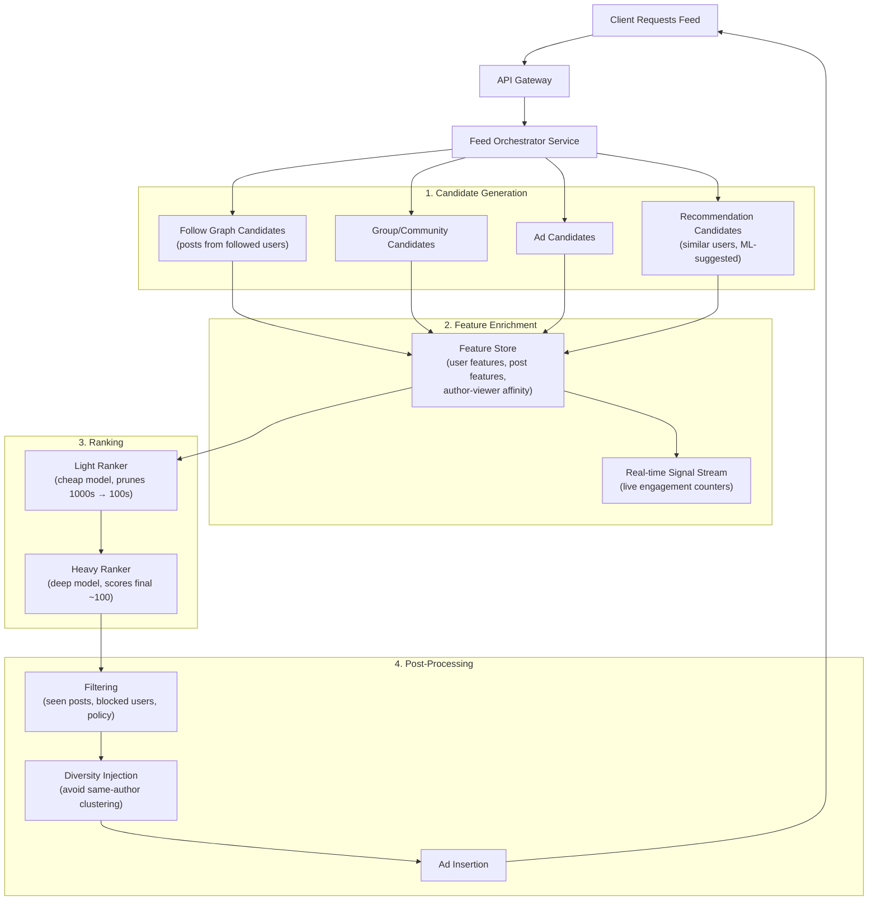
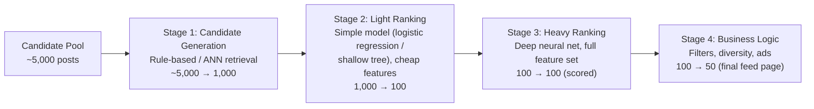
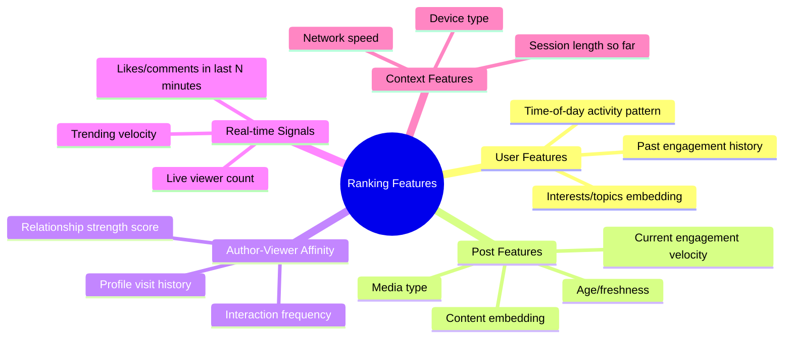
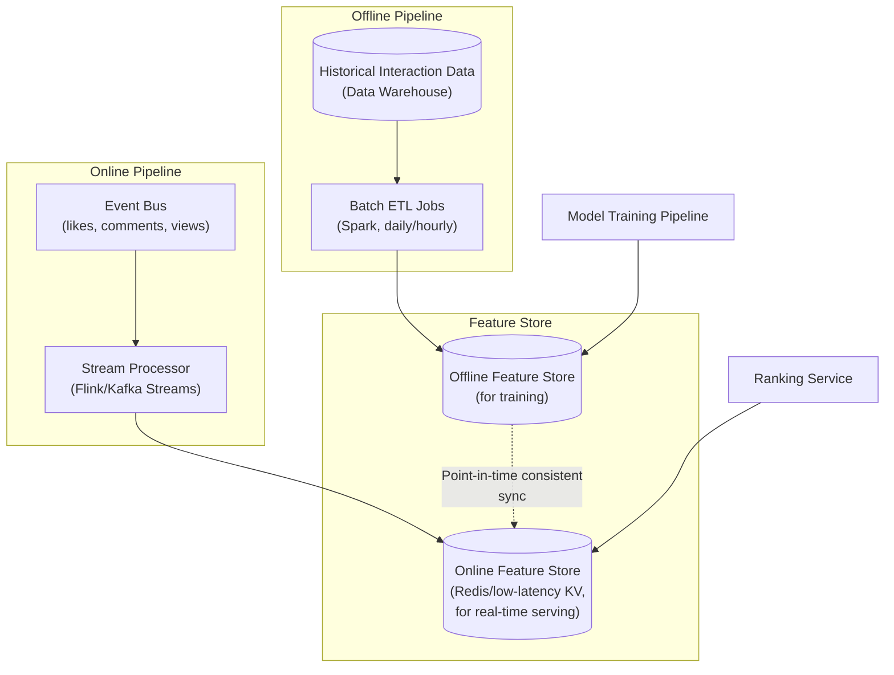
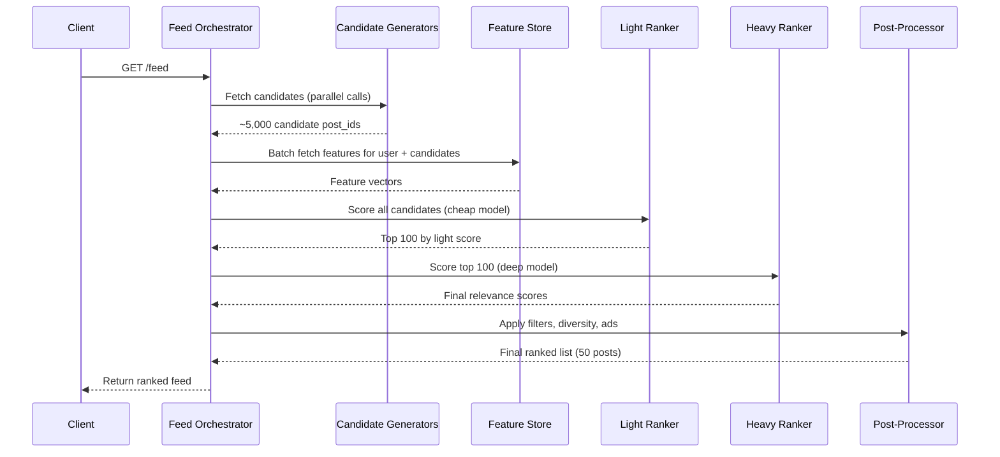
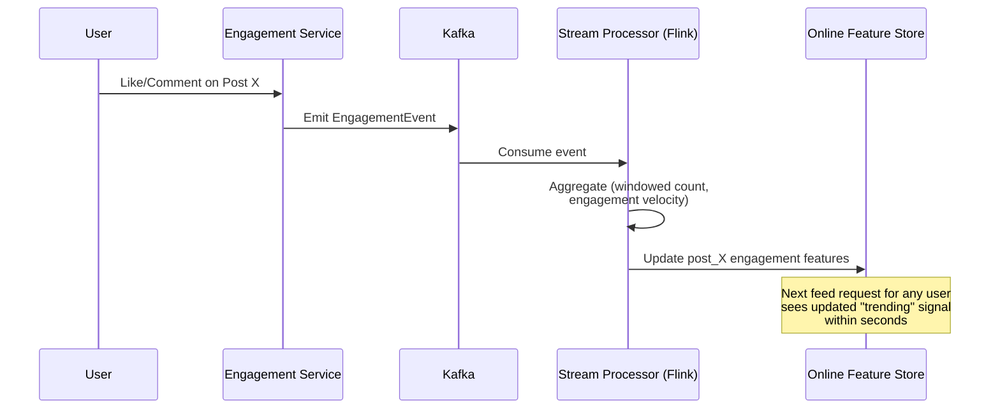
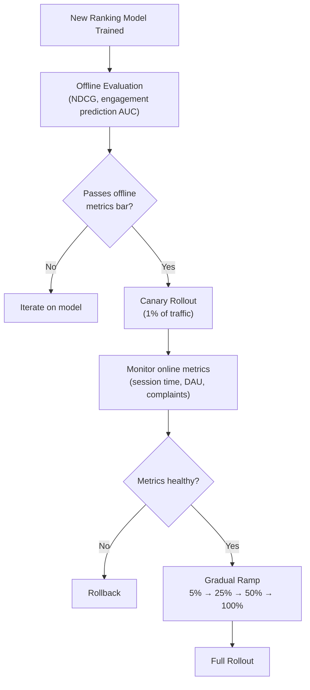

# Design a News Feed Ranking System — High-Level Design Document

## 1. Requirements

### Functional Requirements
- Given a candidate set of posts (from follow graph, groups, ads), rank them for a specific user
- Balance freshness (recent posts) vs relevance (predicted engagement)
- Support real-time signals (a post going viral should surface faster)
- Support explainability/debugging of why a post ranked where it did
- A/B testable — ranking model changes must be measurable

### Non-Functional Requirements
- **Latency:** Full ranking pipeline < 150ms p99 (feed must feel instant)
- **Scale:** ~500M DAU requesting feeds, each with 100s–1000s of candidates to score
- **Freshness:** New signals (likes, comments) should influence ranking within seconds
- **Consistency:** Not critical — feed ranking is inherently probabilistic/personalized

### Back-of-Envelope Estimation
| Metric | Value |
|---|---|
| Feed requests/sec (peak) | ~500,000 |
| Avg candidates scored per request | ~500 |
| Total scoring ops/sec | ~250M/sec |
| Feature store lookups/sec | Very high — needs aggressive caching |
| Model inference latency budget | < 50ms of the 150ms total |

---

## 2. High-Level Architecture

**Key idea:** Ranking happens in funnel stages — thousands of raw candidates are cheaply pruned down before an expensive deep model scores only the survivors. This keeps latency bounded even as the candidate pool grows.

---

## 3. Ranking Funnel (Multi-Stage Scoring)

*Each stage trades scoring accuracy for speed — early stages are cheap and approximate to survive high volume; late stages are expensive but only run on a small surviving set.*

---

## 4. Feature Categories

---

## 5. Feature Store Architecture

**Key challenge — training/serving skew:** The offline store (used for model training) and online store (used at serving time) must return the *same* feature values for the same point in time, or the model will underperform in production relative to training. This is the **point-in-time correctness** problem.

---

## 6. Ranking Request — Detailed Sequence

---

## 7. Real-Time Signal Propagation

---

## 8. A/B Testing & Model Rollout

---

## 9. Component Responsibilities Summary

| Component | Responsibility |
|---|---|
| **Feed Orchestrator** | Coordinates the entire ranking pipeline per request |
| **Candidate Generators** | Pull raw candidate posts from multiple sources (graph, groups, ads, ML recs) |
| **Feature Store (online)** | Low-latency serving of precomputed + real-time features |
| **Feature Store (offline)** | Historical features for model training, point-in-time correct |
| **Light Ranker** | Cheap model to prune large candidate pools fast |
| **Heavy Ranker** | Expensive deep model for final precision scoring on survivors |
| **Post-Processor** | Business rules: filtering seen content, diversity, ad injection |
| **Stream Processor** | Real-time aggregation of engagement signals feeding back into ranking |

---

## 10. Key Design Decisions & Tradeoffs

| Decision | Choice | Why |
|---|---|---|
| Ranking architecture | Multi-stage funnel (light → heavy) | Bounds latency; expensive models only run on a pruned candidate set |
| Feature storage | Separate online/offline stores | Online needs low-latency KV access; offline needs large-scale batch analytics |
| Real-time signals | Stream processing (Flink/Kafka Streams) | Engagement-driven ranking needs sub-minute freshness, not batch-hour freshness |
| Model rollout | Canary + gradual ramp | Ranking changes directly affect engagement/revenue; must de-risk before full rollout |
| Diversity injection | Post-processing step, not in model | Keeps the ranking model focused on relevance; diversity is a business rule layered on top |
| Ads | Injected after organic ranking | Cleanly separates relevance optimization from monetization logic |

---

## 11. Bottlenecks & Scaling Considerations

- **Feature store read amplification** — every feed request needs features for hundreds of candidates × millions of requests/sec. Mitigate with aggressive caching and batching lookups.
- **Heavy ranker latency** — deep models are expensive; cap candidates entering this stage strictly (e.g., top 100 only) and consider model distillation for speed.
- **Training/serving skew** — feature drift between offline training data and online serving data silently degrades model quality; needs continuous monitoring (feature distribution parity checks).
- **Cold-start users/posts** — new users/posts lack engagement history; fall back to content-based or popularity-based features until enough signal accumulates.
- **Real-time signal storms** (viral post) — engagement events can spike Kafka throughput; ensure stream processor auto-scales and uses windowed aggregation rather than per-event recompute.
- **Feedback loops** — ranking model trained on past engagement can reinforce existing biases (popular posts get shown more → get more engagement → rank higher); needs exploration/exploitation balance (e.g., small % randomized exposure).
