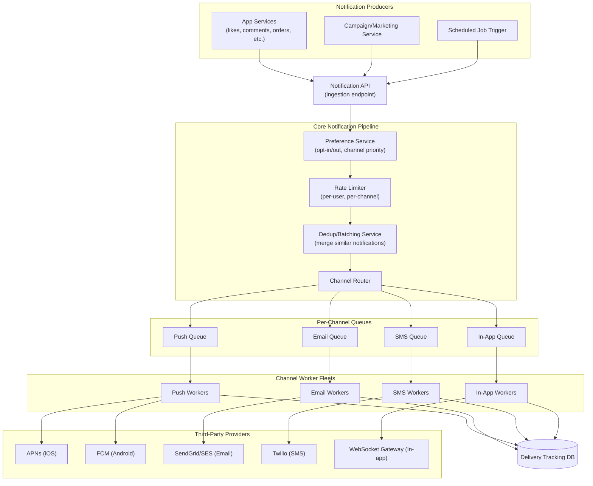
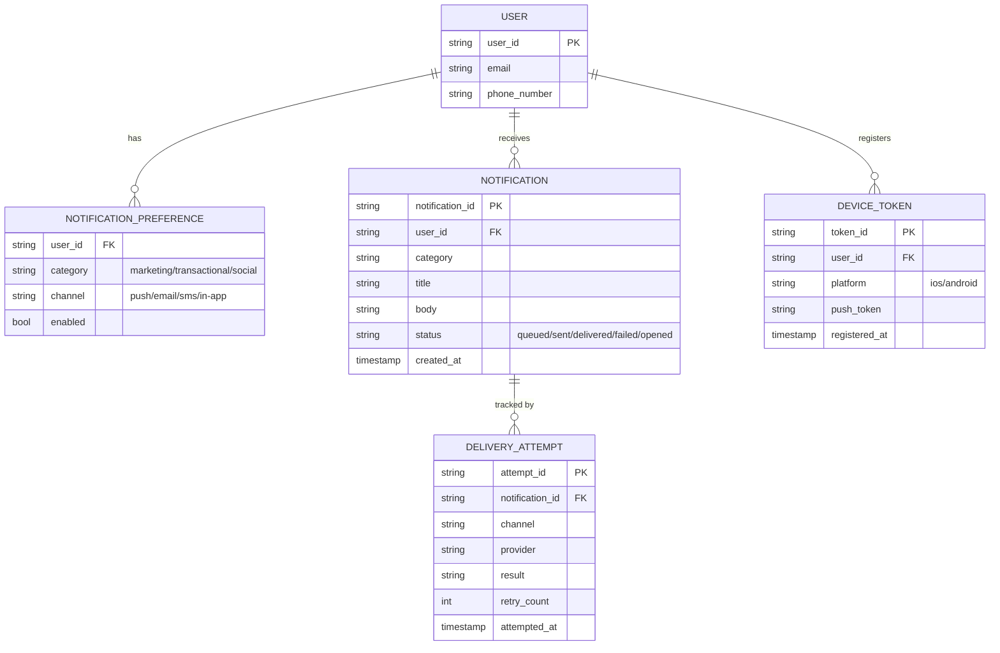
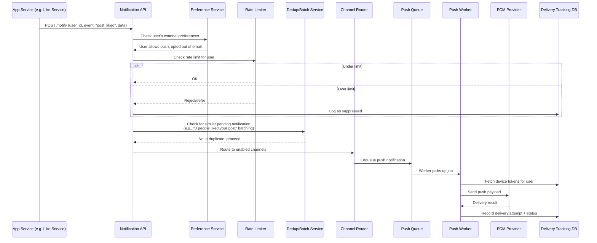
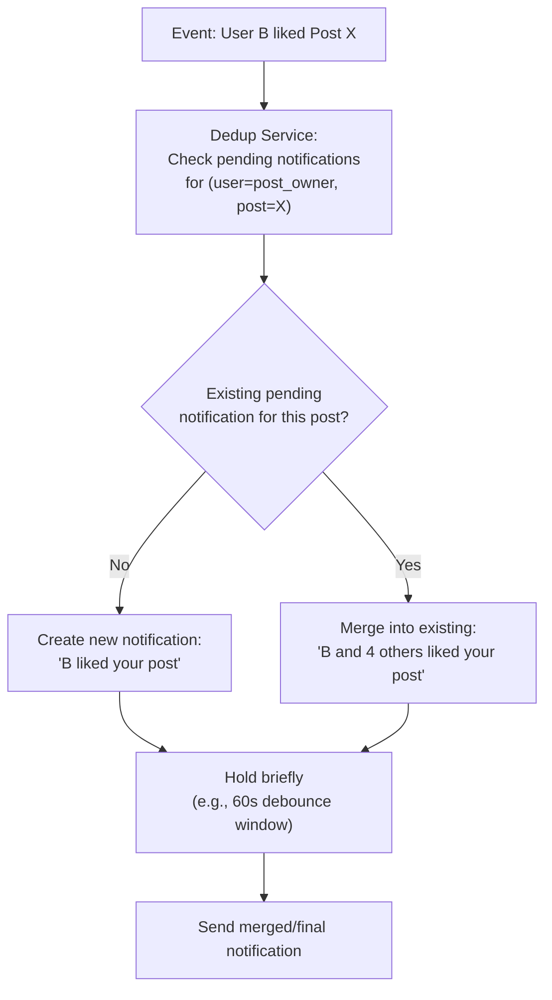
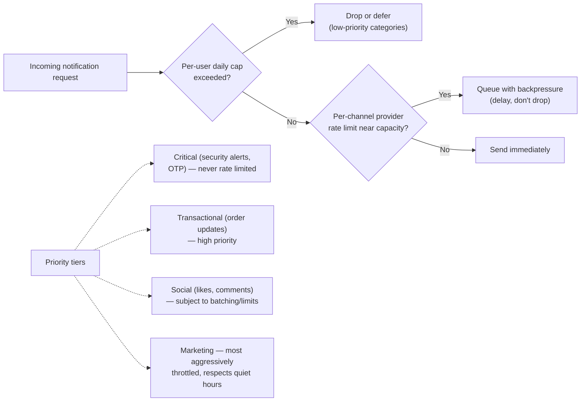
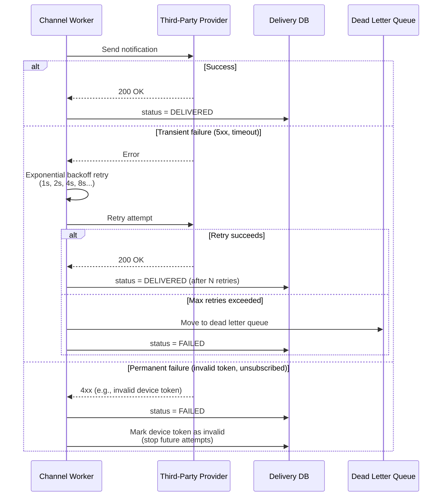
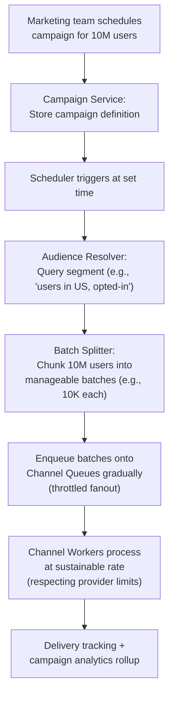
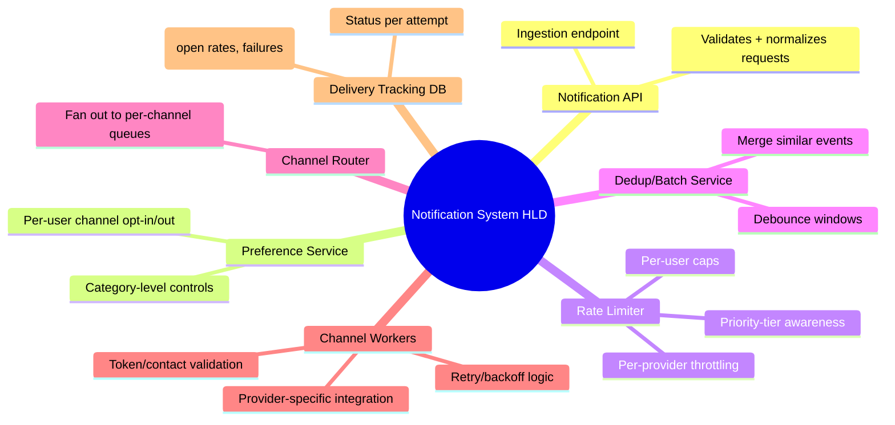

# Design a Notification System — High-Level Design Document

## 1. Requirements

### Functional Requirements
- Send notifications across multiple channels: push (iOS/Android), email, SMS, in-app
- Support triggered notifications (event-driven, e.g., "someone liked your post") and scheduled/campaign notifications (e.g., marketing blasts)
- Per-user preferences (opt-out of channels/categories)
- Rate limiting (don't spam a user with 50 notifications in a minute)
- Retry on failure with backoff
- Delivery tracking (sent, delivered, opened)

### Non-Functional Requirements
- **Scale:** ~500M users, billions of notifications/day
- **Latency:** Triggered notifications should arrive within seconds
- **Reliability:** At-least-once delivery; no critical notification silently dropped
- **Throughput bursts:** A viral event or campaign can trigger millions of notifications in minutes
- **Provider abstraction:** Must work across many third-party providers (APNs, FCM, SendGrid, Twilio) with different rate limits/APIs

### Back-of-Envelope Estimation
| Metric | Value |
|---|---|
| Notifications/day | ~5B |
| Avg notifications/sec | ~60,000 |
| Peak notifications/sec (campaign blast) | ~500,000+ |
| Channels | Push, Email, SMS, In-app |
| Third-party provider rate limits | Vary widely (SMS often most constrained) |

---

## 2. High-Level Architecture

**Key idea:** All notification requests flow through a common pipeline (preferences → rate limiting → dedup) before fanning out into **per-channel queues**. Each channel has its own worker fleet and its own retry/backoff logic, because each third-party provider has wildly different rate limits, latency, and failure modes — SMS providers throttle hard, push providers are more forgiving.

---

## 3. Data Model

---

## 4. Triggered Notification Flow — Detailed Sequence

---

## 5. Notification Batching / Deduplication

*A short debounce window prevents notification spam when multiple events happen in quick succession (e.g., a post getting 10 likes in 30 seconds shouldn't trigger 10 separate push notifications).*

---

## 6. Rate Limiting Strategy

---

## 7. Retry & Failure Handling

---

## 8. Scheduled / Campaign Notification Flow (Bulk Fanout)

*Bulk campaigns are deliberately **throttled and staggered** rather than fired all at once — sending 10M notifications instantly would overwhelm both internal queues and third-party provider rate limits (especially SMS/email providers, which often cap sends/sec per account).*

---

## 9. Component Responsibilities Summary

---

## 10. Key Design Decisions & Tradeoffs

| Decision | Choice | Why |
|---|---|---|
| Per-channel queues | Separate queue + worker fleet per channel | Each provider has distinct rate limits/latency; isolates failures (SMS outage shouldn't block push) |
| Delivery guarantee | At-least-once with idempotency keys | Losing a notification is worse than an occasional duplicate; client dedupes by notification_id |
| Batching/debounce | Short delay window before sending social notifications | Prevents notification spam from rapid-fire events (many likes in seconds) |
| Bulk campaign fanout | Throttled, staggered batch processing | Prevents overwhelming both internal infra and third-party provider rate limits |
| Priority tiers | Critical > Transactional > Social > Marketing | Ensures security-critical notifications (OTP, fraud alerts) are never delayed by rate limits |
| Failure handling | Distinguish transient vs permanent failures | Retries only make sense for transient errors; permanent failures (invalid token) should stop retrying immediately |

---

## 11. Bottlenecks & Scaling Considerations

- **Third-party provider rate limits** — the single biggest external constraint; workers must respect provider-specific quotas (e.g., Twilio SMS often limited to low hundreds/sec per number) via token-bucket throttling before calling out.
- **Campaign fanout spikes** — a 10M-user campaign firing at once would overwhelm queues; always stagger bulk sends and monitor provider quota consumption in real time.
- **Device token churn** — tokens expire/change frequently (app reinstalls, OS updates); need continuous cleanup of invalid tokens to avoid wasted send attempts and provider penalty flags.
- **Dedup window latency tradeoff** — longer debounce windows reduce notification spam but delay time-sensitive alerts; category-aware windows (short for DMs, longer for social likes) balance this.
- **Delivery tracking DB write volume** — billions of delivery attempts/day need a high-throughput, appendable store (wide-column DB) rather than a traditional relational DB.
- **Cross-channel consistency** — a user might get a push AND an email for the same event if preference logic has bugs; needs careful preference-service testing and possibly a "notification already delivered via X" suppression check across channels.
- **Retry storms** — if a provider goes down entirely, naive retries across millions of queued notifications can create a thundering herd on recovery; use circuit breakers to pause sending to a failing provider rather than retrying indefinitely.
