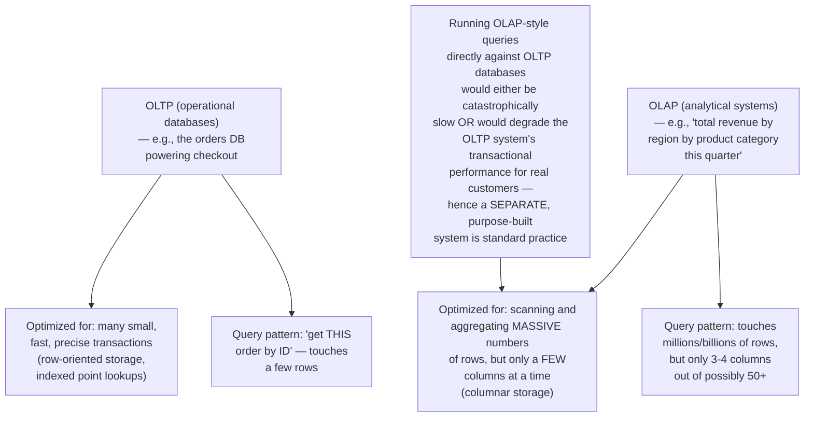
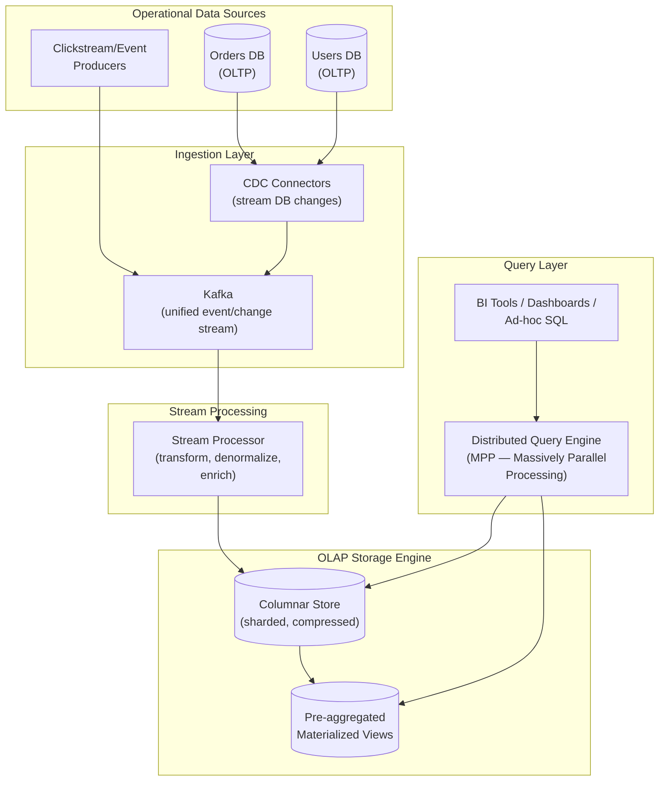
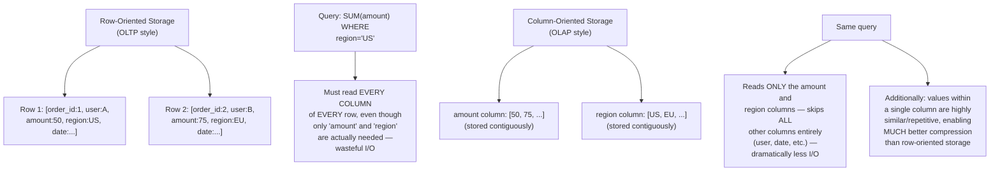
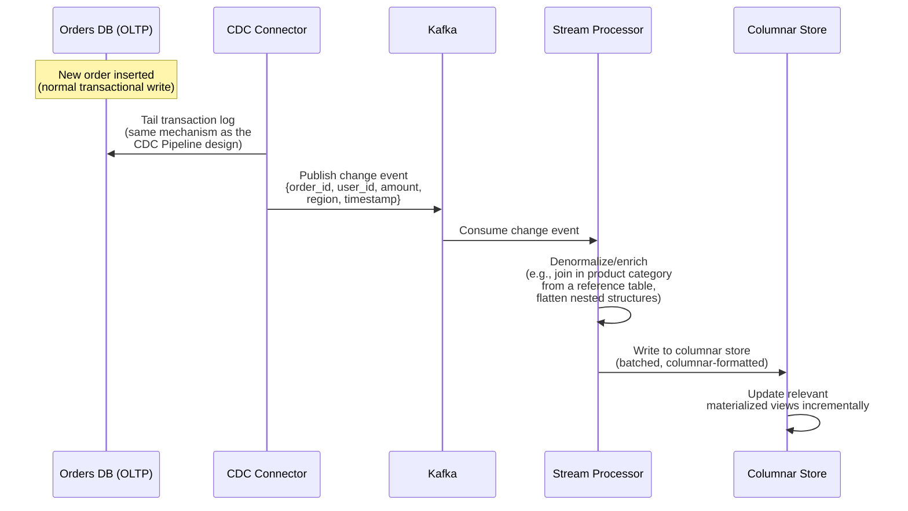
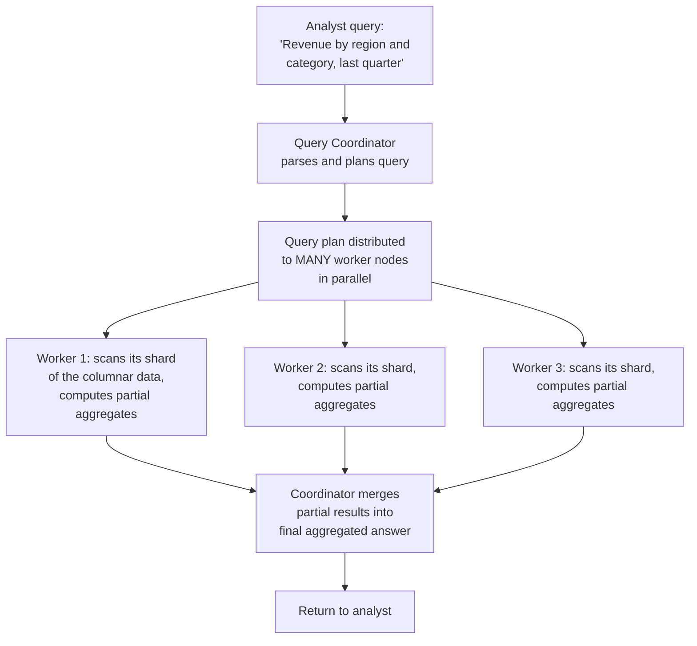
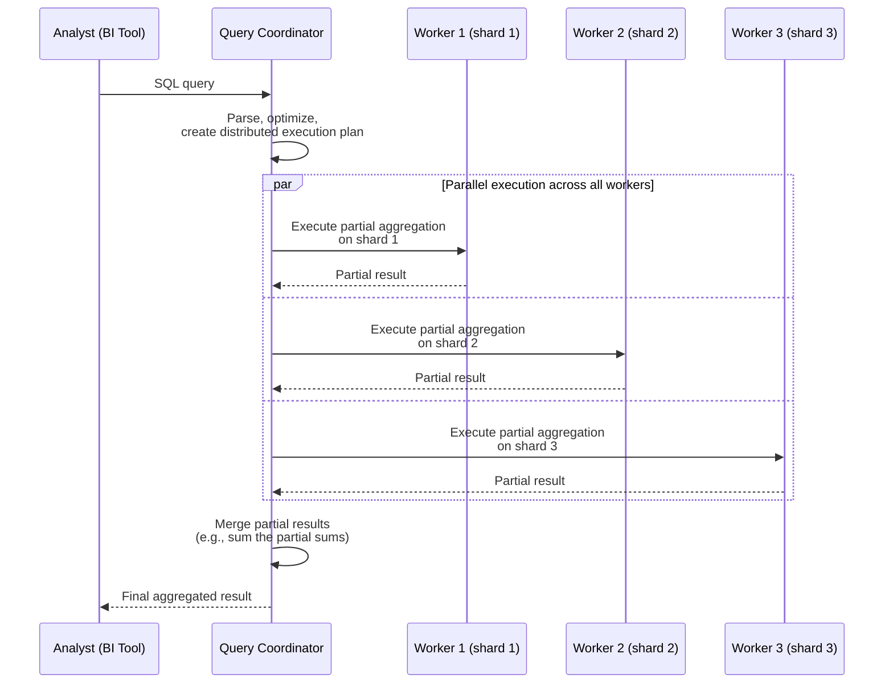
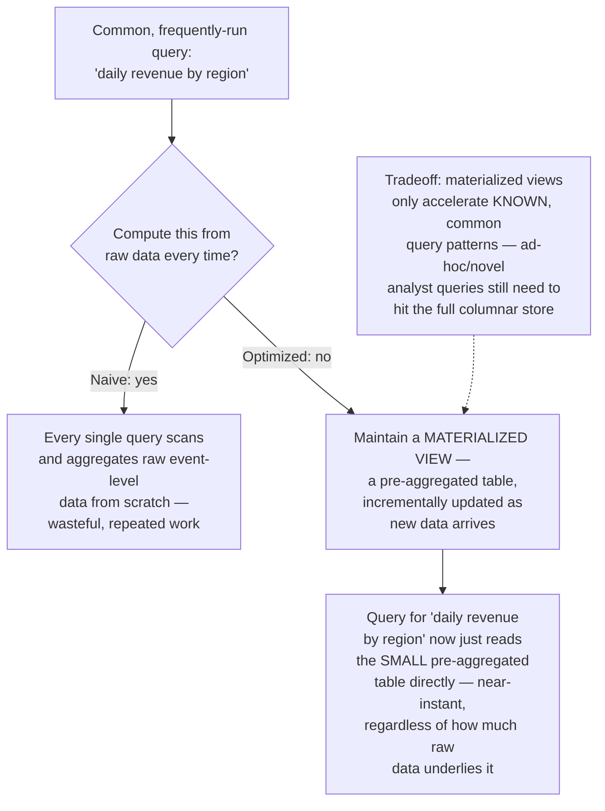
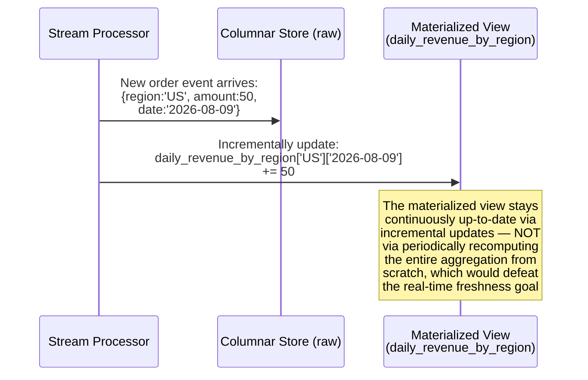
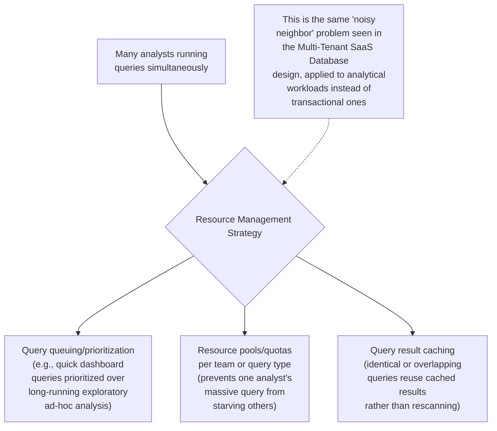
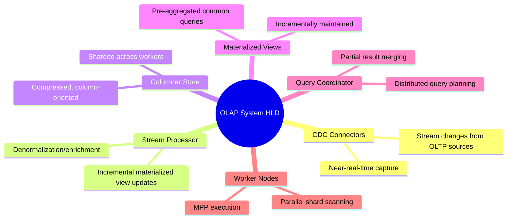

# Design an OLAP System for Real-Time Business Intelligence — High-Level Design Document

## 1. Requirements

### Functional Requirements
- Support complex analytical queries: multi-dimensional aggregations, GROUP BY across many dimensions, drill-down/roll-up
- Ingest data continuously from operational systems (orders, users, events) with near-real-time freshness
- Support ad-hoc, exploratory queries from business analysts (not just predefined dashboards)
- Handle both real-time ("what happened in the last hour") and historical ("compare this quarter to last year") queries

### Non-Functional Requirements
- **Query latency:** Complex aggregation queries over billions of rows should return in seconds, not minutes
- **Freshness:** Data should be queryable within minutes of being generated in operational systems (this is what makes it "real-time" BI, distinct from traditional overnight-batch data warehouses)
- **Scale:** Petabyte-scale historical data, with continuous high-volume ingestion
- **Concurrent analyst usage:** Many analysts running complex, resource-intensive queries simultaneously without starving each other

### Back-of-Envelope Estimation
| Metric | Value |
|---|---|
| Events/transactions ingested/sec | ~100,000 |
| Total historical data | Petabyte scale |
| Typical query scan volume | Millions to billions of rows per query |
| Concurrent analyst queries | Hundreds |
| Freshness target | < 5 minutes from event to queryable |

---

## 2. OLTP vs OLAP — Why a Separate System Is Necessary

---

## 3. High-Level Architecture

**Key idea:** Data flows continuously from operational systems into the OLAP store via CDC and streaming (not nightly batch dumps, which is the traditional data warehouse approach) — this is precisely what makes the system "real-time" rather than "next-day." Once ingested, data is stored in a fundamentally different physical layout (columnar) optimized for the very different query pattern OLAP demands.

---

## 4. Columnar Storage — The Core Technical Foundation

**Why this is the single most important architectural choice for OLAP:** Analytical queries characteristically touch a small fraction of columns but a huge fraction of rows — the exact inverse of typical OLTP access patterns. Columnar storage is purpose-built for this, delivering both massive I/O reduction (skip irrelevant columns entirely) and much better compression (similar values stored together compress far better than mixed row data).

---

## 5. Data Ingestion Flow — Detailed Sequence

---

## 6. Query Execution — Massively Parallel Processing (MPP)

**Why MPP is essential at this scale:** A query scanning billions of rows would take far too long on a single machine, regardless of how well-optimized the storage format is. Distributing the scan and partial aggregation across many worker nodes in parallel — then cheaply merging the much-smaller partial results — is what makes multi-second response times achievable even at petabyte scale.

---

## 7. Materialized Views (Pre-Aggregation for Common Queries)

*This is conceptually identical to the downsampling/rollup pattern used in the Analytics/Metrics Dashboard and Time-Series Database designs — precomputing common aggregations trades storage and update complexity for dramatically faster reads on predictable query patterns.*

---

## 8. Incremental Materialized View Update — Detailed Sequence

---

## 9. Query Resource Isolation (Multi-Analyst Concurrency)

---

## 10. Component Responsibilities Summary

---

## 11. Key Design Decisions & Tradeoffs

| Decision | Choice | Why |
|---|---|---|
| Storage layout | Columnar, not row-oriented | Matches the OLAP access pattern (few columns, many rows) far better than row storage, enabling both I/O reduction and superior compression |
| Data freshness mechanism | CDC + streaming ingestion, not nightly batch | Achieves near-real-time freshness (minutes, not hours/overnight), distinguishing this from traditional data warehousing |
| Query execution model | Massively Parallel Processing (MPP) | Distributes scan/aggregation work across many nodes, making multi-second responses achievable even at petabyte scale |
| Pre-aggregation | Materialized views for common patterns | Trades storage/update complexity for dramatically faster reads on predictable, frequently-run queries |
| Separation from OLTP | Entirely separate system, fed via CDC | Prevents analytical query load from degrading transactional system performance, and allows independent optimization of each for its actual workload |
| Concurrency management | Query queuing/resource pools/caching | Prevents any single analyst's heavy query from starving others sharing the same infrastructure |

---

## 12. Bottlenecks & Scaling Considerations

- **Ingestion lag under high source volume** — if CDC/streaming ingestion can't keep pace with operational write volume, the "real-time" freshness promise degrades; needs monitoring and independently scalable ingestion capacity, decoupled from query-serving capacity.
- **Materialized view explosion** — maintaining too many materialized views for every conceivable query pattern becomes an operational burden (each needs incremental update logic and storage); requires disciplined prioritization based on actual query frequency, not speculative coverage.
- **Ad-hoc query unpredictability** — unlike materialized-view-backed dashboards, genuinely novel analyst queries can scan enormous data volumes unpredictably; needs query cost estimation and potentially query complexity limits to prevent a single runaway query from consuming disproportionate cluster resources.
- **Shard skew for columnar data** — if data isn't evenly distributed across worker shards (e.g., heavily skewed by date or region), MPP query performance suffers since overall query latency is bounded by the slowest worker — careful partition key selection for the columnar store matters as much as shard key selection does for OLTP sharding.
- **Compression vs update flexibility tradeoff** — highly compressed columnar formats are excellent for read-heavy analytical workloads but are typically less efficient for frequent small updates; this is part of why data usually flows in as append-only events/batches rather than supporting arbitrary in-place updates like an OLTP system would.
- **Schema evolution** — as operational systems evolve their schemas, the OLAP ingestion pipeline (CDC, stream transformation, columnar store schema) must handle these changes gracefully without breaking existing materialized views or historical query compatibility.
- **Cost management at petabyte scale** — storage and compute costs for both the raw columnar store and its materialized views grow substantial at this scale; tiered storage (hot/warm/cold, similar to the pattern in Log Aggregation and Analytics Dashboard designs) and careful retention policies become important cost-control levers, not just performance optimizations.
