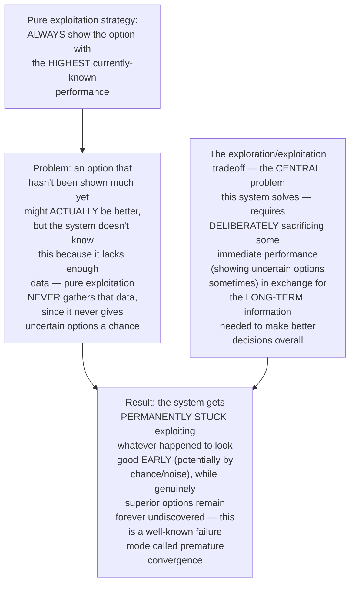
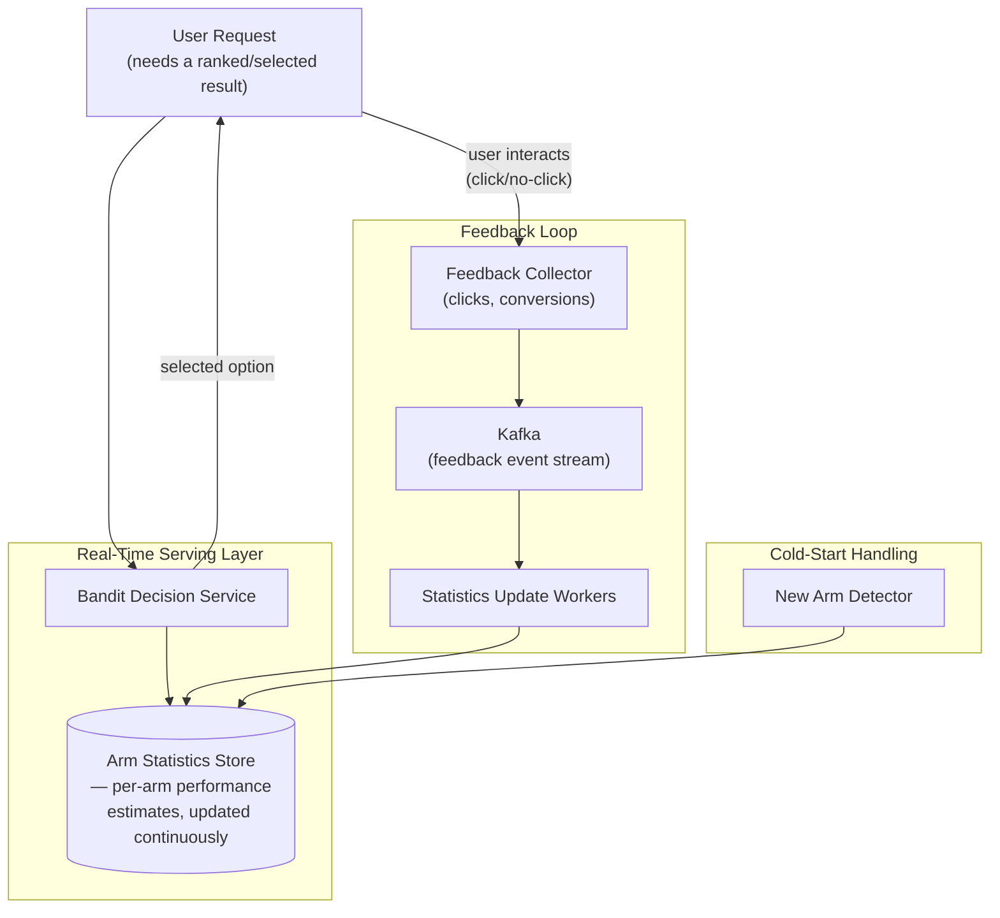
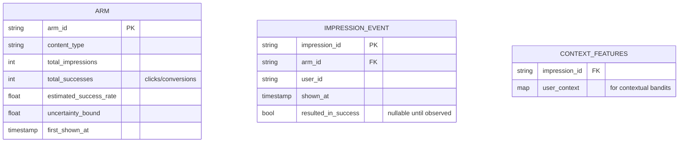
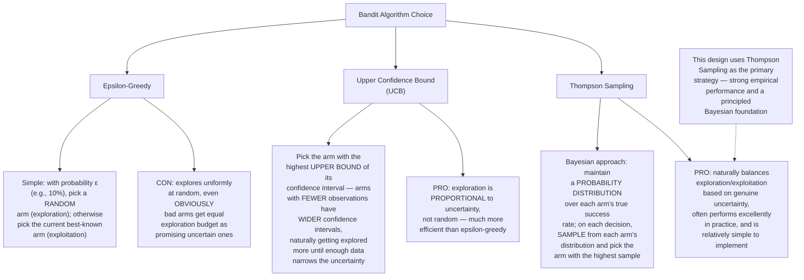
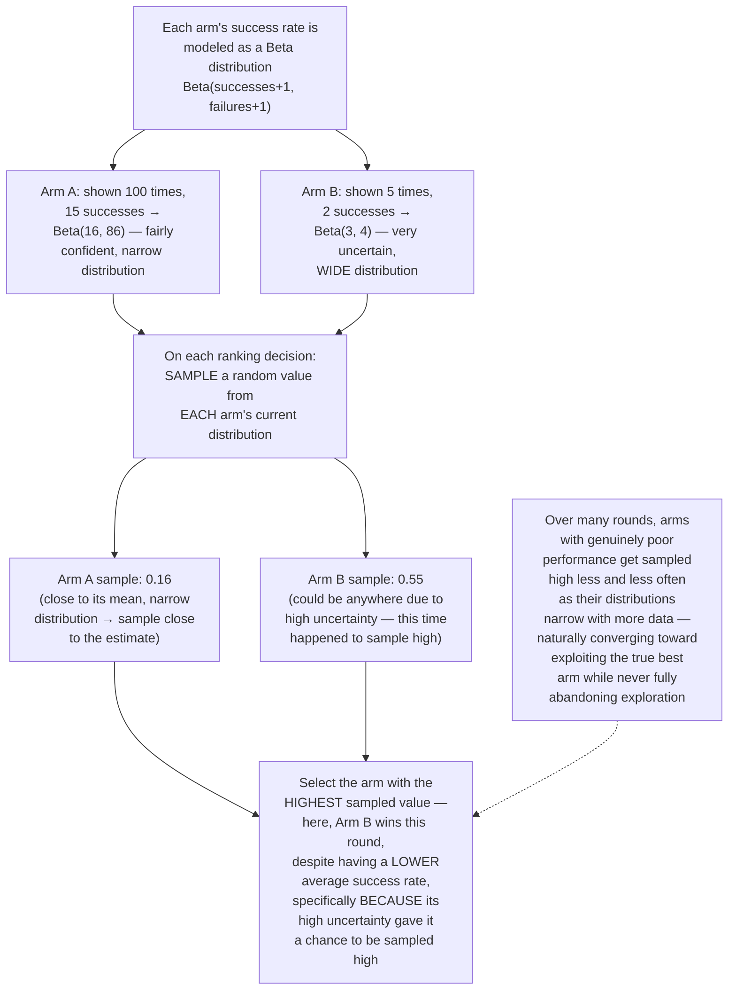
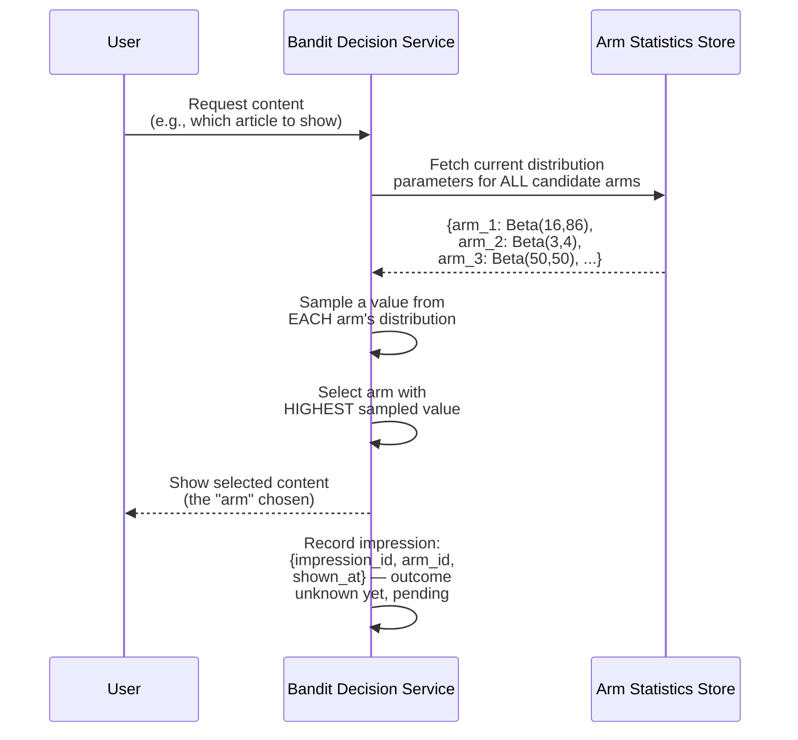
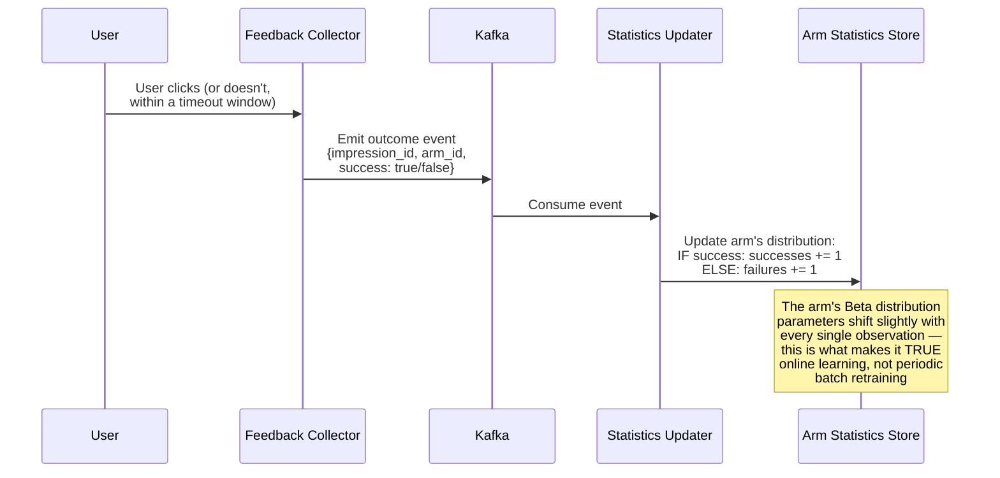
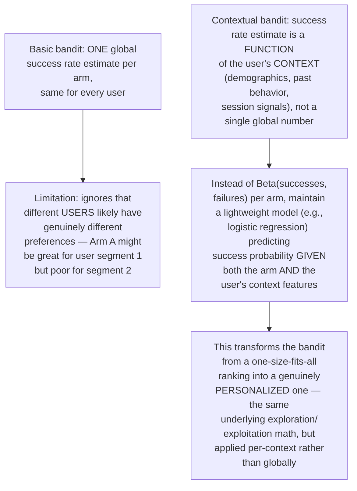
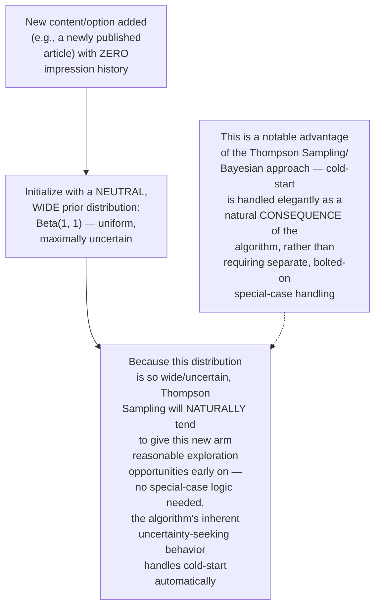
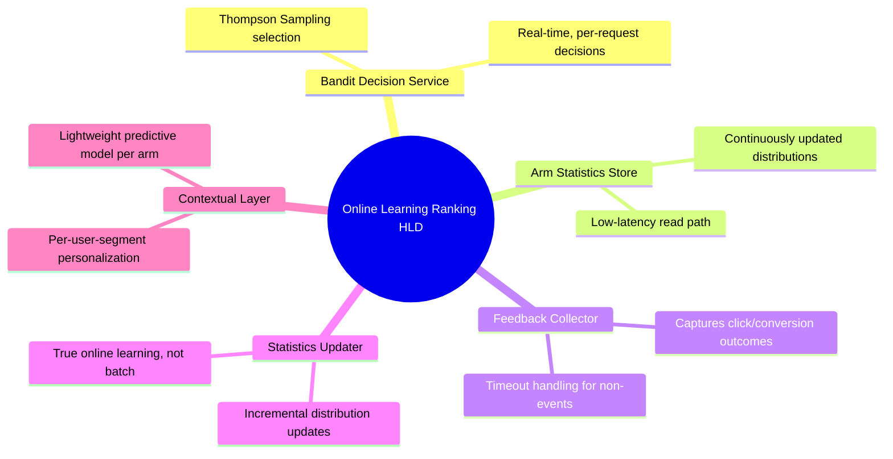

# Design a Personalization/Ranking System With Online Learning — High-Level Design Document

## 1. Requirements

### Functional Requirements
- Rank/select content or actions personalized to each user, learning and adapting from real-time feedback (clicks, engagement)
- Balance EXPLOITATION (showing content known to perform well) against EXPLORATION (trying less-certain options to gather new information)
- Update the ranking policy CONTINUOUSLY from live feedback, not just via periodic full retraining
- Support multiple simultaneous "arms"/options being evaluated (e.g., many possible articles, ads, or recommendations)

### Non-Functional Requirements
- **Real-time adaptation:** Unlike the batch-trained ranking models in the earlier News Feed Ranking design, this system must update its policy from feedback WITHIN the same session/minutes, not the next day's training run
- **Regret minimization:** The system should mathematically minimize cumulative "regret" — the gap between what it showed and what the BEST possible choice would have been, over time
- **Cold-start handling:** New content/options with no feedback history yet must still get a fair chance to be shown and evaluated
- **Scale:** Must make this exploration/exploitation decision for millions of ranking decisions per second

### Back-of-Envelope Estimation
| Metric | Value |
|---|---|
| Ranking decisions/sec | Millions (one per user impression/request) |
| Distinct "arms" (content options) | Thousands to millions, depending on domain |
| Feedback latency | Seconds (click) to longer (conversion) |
| Policy update frequency | Continuous/near-real-time, not batch-only |

---

## 2. The Core Problem — Why Pure Exploitation Fails

---

## 3. High-Level Architecture

**Key idea:** Unlike the batch-trained ranking model in the general News Feed Ranking design, this system's core statistics are updated CONTINUOUSLY from a live feedback stream — the loop from "show an option" to "observe the outcome" to "update future decisions" happens in near-real-time, which is precisely what "online learning" means as distinct from periodic offline retraining.

---

## 4. Data Model

---

## 5. Multi-Armed Bandit Algorithms — Core Strategies

---

## 6. Thompson Sampling — Detailed Mechanics

---

## 7. Real-Time Decision Flow — Detailed Sequence

---

## 8. Feedback Incorporation Flow — Detailed Sequence

**Why this is fundamentally different from the batch-retrained ranking model in the News Feed Ranking design:** There, model weights update through periodic (e.g., daily) training runs on accumulated historical data. Here, EVERY SINGLE feedback event immediately and incrementally updates the relevant arm's statistics — the system's "knowledge" evolves continuously throughout the day, incorporating information from minutes ago into the very next ranking decision.

---

## 9. Contextual Bandits (Personalization Layer)

---

## 10. Cold-Start Handling for New Arms

---

## 11. Component Responsibilities Summary

---

## 12. Key Design Decisions & Tradeoffs

| Decision | Choice | Why |
|---|---|---|
| Core algorithm | Thompson Sampling | Naturally balances exploration/exploitation based on genuine statistical uncertainty, strong empirical performance, elegant cold-start handling |
| Learning cadence | Continuous, per-feedback-event updates | This IS the defining property of online learning — distinct from the periodic batch retraining used in the broader News Feed Ranking design |
| Personalization | Contextual bandits (context-conditioned success estimates) | A single global estimate per arm ignores genuine differences in user preference across segments |
| Cold-start | Wide, neutral prior distributions | Handled naturally by the algorithm's inherent uncertainty-seeking behavior, without requiring special-case bootstrapping logic |
| Uncertainty representation | Full probability distributions, not point estimates | Point estimates alone can't distinguish "confidently mediocre" from "uncertain and possibly great" — the distribution's WIDTH is itself essential information |

---

## 13. Bottlenecks & Scaling Considerations

- **Arm statistics store as a critical low-latency dependency** — every single ranking decision requires reading current distribution parameters; must be extremely low-latency and highly available, similar criticality to the online feature store in the Feature Store design.
- **Update contention for extremely popular arms** — a highly-trafficked arm receiving thousands of simultaneous feedback events creates write contention on its statistics; may require the same approximate/batched-update techniques discussed in the Distributed Cache and CRDT Counter designs, rather than perfectly synchronous updates for every single event.
- **Delayed feedback handling** — some outcomes (e.g., a purchase conversion, as opposed to an immediate click) may only be observable minutes or hours after the impression; the system needs clear policy for how long to wait before considering an impression a "failure" by default, and how to retroactively correct statistics if a delayed success arrives after that window.
- **Contextual model complexity vs latency** — richer contextual models (more features, more sophisticated per-context prediction) improve personalization quality but increase per-decision computation cost; this is the same multi-stage funnel tradeoff explored in the general Recommendation System and News Feed Ranking designs.
- **Non-stationarity (arms' true performance changing over time)** — a piece of content's genuine appeal can drift (news becomes stale, trends change); pure cumulative statistics eventually become slow to adapt to such drift, often requiring a "decay" or "sliding window" adjustment so older observations count less than recent ones.
- **Arm explosion at scale** — with potentially millions of distinct arms (e.g., every individual piece of content on a large platform), maintaining and querying per-arm statistics at this scale requires the same sharding/partitioning considerations as any large-scale key-value system, plus the specific challenge that popular arms need low-latency access while millions of rarely-shown arms need efficient, cheap storage.
- **Evaluation and safety** — deploying a live-learning system means mistakes correct themselves over time, but a poorly-tuned exploration rate or a bug in the reward signal computation can cause real, immediate business harm before self-correction kicks in; this argues for careful monitoring dashboards and possibly bounded exploration budgets (a maximum "risk" any single arm can be shown) as a safety net, similar in spirit to the automated rollback mechanisms in the ML Model Serving design.
