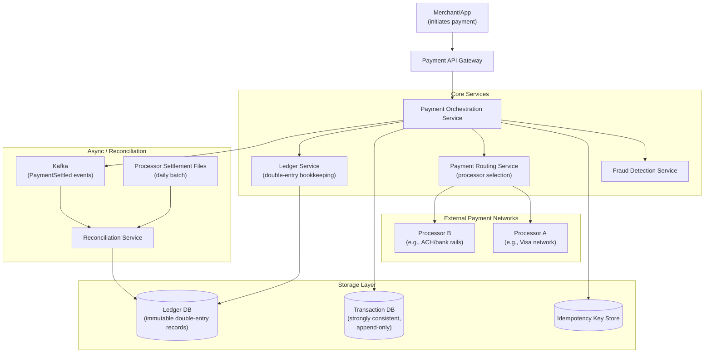
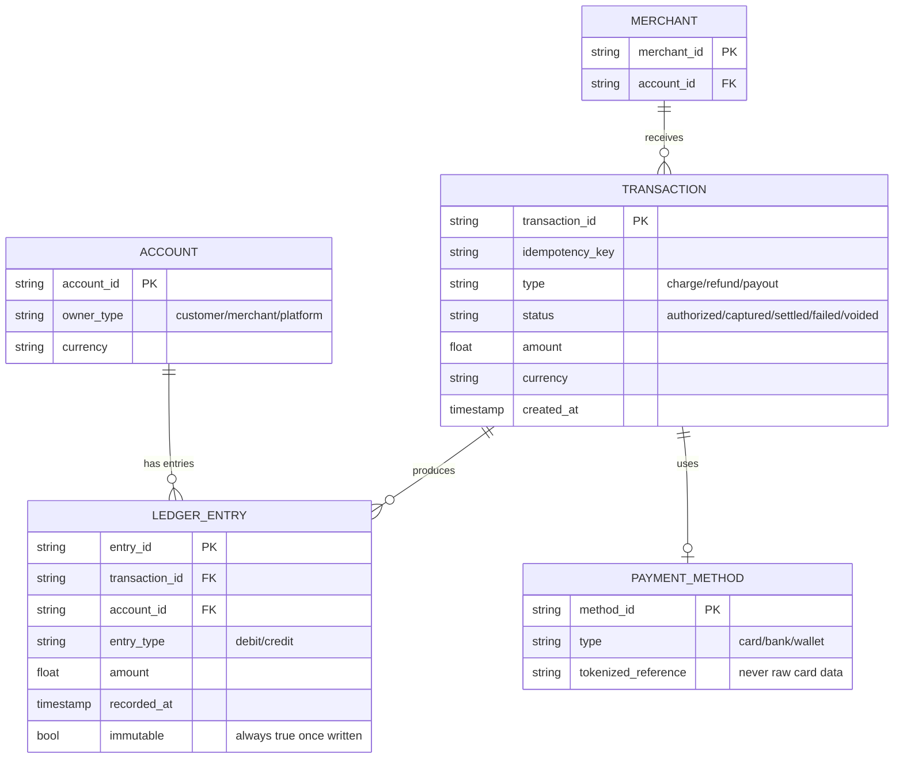
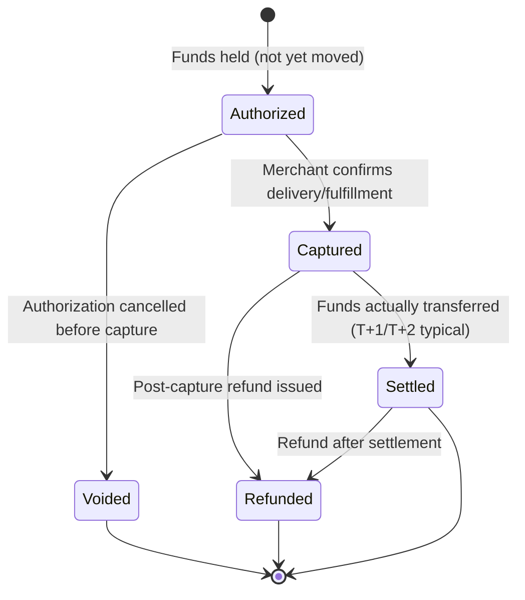
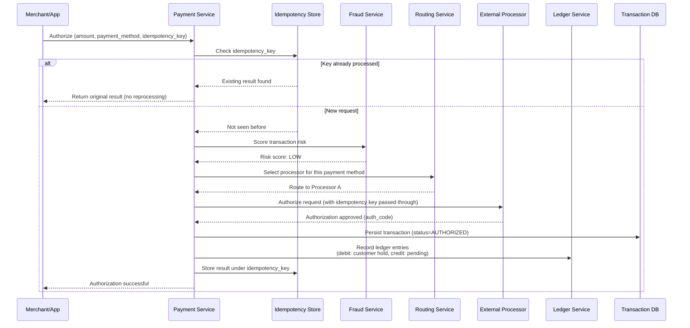
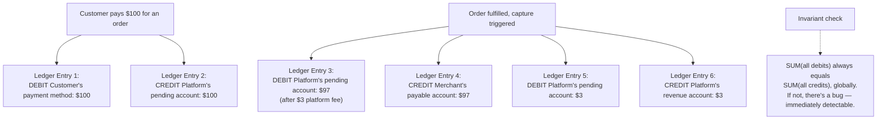
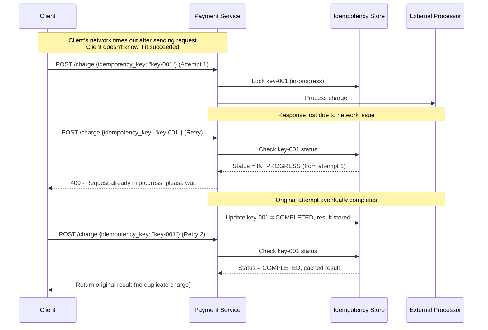
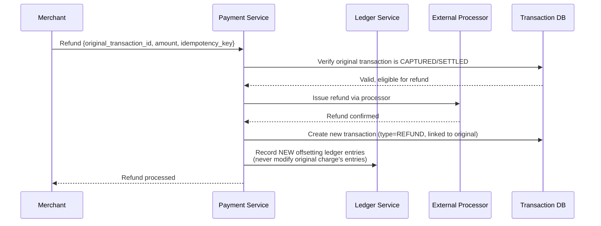
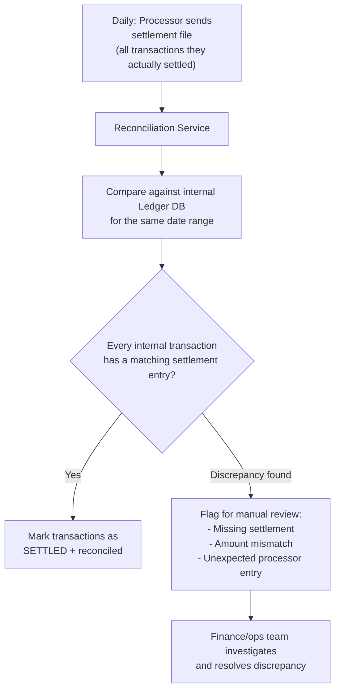
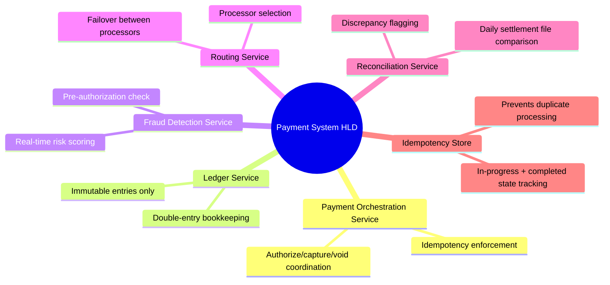

# Design a Payment Processing System — High-Level Design Document

## 1. Requirements

### Functional Requirements
- Process payments across multiple methods (card, bank transfer, wallet)
- Support authorize → capture → settle flow (and refunds/voids)
- Maintain an accurate, auditable ledger of all money movement
- Integrate with external payment networks/processors (Visa/Mastercard rails, ACH, etc.)
- Reconciliation against processor statements
- Fraud detection integrated into the flow

### Non-Functional Requirements
- **Correctness is paramount:** Money must never be created or destroyed — every cent accounted for
- **Idempotency:** Retries must never result in duplicate charges
- **Auditability:** Every transaction must be traceable and immutable once recorded
- **Consistency:** Strong consistency for balance/ledger operations — no eventual consistency for money
- **Availability:** High, but never at the cost of correctness (better to reject than to double-process)

### Back-of-Envelope Estimation
| Metric | Value |
|---|---|
| Transactions/sec (large platform) | ~5,000-10,000 |
| Peak (Black Friday-style events) | ~50,000+/sec |
| Ledger entries per transaction | 2+ (double-entry: debit + credit) |
| External processor latency | 200ms - 2s |
| Reconciliation frequency | Daily batch against processor settlement files |

---

## 2. High-Level Architecture

**Key idea:** Every payment operation produces an **immutable ledger entry** using double-entry bookkeeping — money is never simply "updated," it's always recorded as a debit from one account and a matching credit to another. This makes the system inherently auditable and makes bugs detectable (the books must always balance).

---

## 3. Data Model — Double-Entry Ledger

**Key modeling principle:** `LEDGER_ENTRY` rows are **never updated or deleted** — corrections are made by inserting new offsetting entries (e.g., a refund creates new debit/credit entries, it doesn't modify the original charge's entries). This immutability is what makes the ledger auditable.

---

## 4. Authorize → Capture → Settle Flow

*This mirrors real card-network mechanics: **authorization** just confirms funds/credit are available and places a hold; **capture** is the merchant's confirmation to actually proceed with the charge; **settlement** is the actual bank-to-bank money movement, which often happens on a T+1 or T+2 delay through batch processing on the card networks.*

---

## 5. Payment Authorization Flow — Detailed Sequence

---

## 6. Double-Entry Ledger — Why It Matters

*This is the fundamental correctness mechanism of any real payment system: because every single money movement is recorded as a balanced debit/credit pair, you can always run an integrity check that the books balance. A single "just update the balance" approach has no equivalent self-checking property.*

---

## 7. Idempotency — Preventing Duplicate Charges

**Key design point:** The idempotency store must handle the *in-progress* state explicitly, not just completed results — a naive implementation that only checks "was this already completed" is vulnerable to a second concurrent retry racing in while the first attempt is still processing.

---

## 8. Refund Flow

---

## 9. Reconciliation Against Processor Settlement Files

*Reconciliation exists because the internal system's view of "this payment succeeded" and the processor's actual settled state can drift — due to processor-side failures, chargebacks, or timing differences. This daily batch check is the safety net that catches money-accounting bugs before they compound.*

---

## 10. Component Responsibilities Summary

---

## 11. Key Design Decisions & Tradeoffs

| Decision | Choice | Why |
|---|---|---|
| Money accounting model | Double-entry ledger, immutable entries | Self-checking correctness (debits always equal credits); auditability; corrections via new entries, never mutation |
| Payment flow | Authorize → Capture → Settle (not instant single-step charge) | Mirrors real card network mechanics; allows cancellation before funds actually move |
| Idempotency | Explicit in-progress + completed states in idempotency store | Naive "check if completed" alone is vulnerable to concurrent retry races |
| Consistency model | Strong consistency for ledger/balance operations | Money can never tolerate eventual consistency — a "temporarily wrong balance" is unacceptable |
| Reconciliation | Daily batch comparison against processor settlement files | Catches drift between internal state and actual settled reality; essential safety net |
| Processor integration | Routing layer with failover | Avoids single point of failure on one payment processor; enables smart routing by cost/success rate |

---

## 12. Bottlenecks & Scaling Considerations

- **Ledger write throughput** — every transaction produces multiple immutable ledger entries; the ledger DB must support high append-only write throughput while maintaining strong consistency, often via sharding by account_id.
- **External processor latency in the critical path** — authorization calls to Visa/Mastercard/ACH rails add 200ms-2s; must have circuit breakers and processor failover to avoid cascading slowness during a processor outage.
- **Idempotency store as a single point of contention** — every single payment request touches it first; must be extremely available and low-latency (in-memory KV with durable backing) since it gates all downstream processing.
- **Fraud detection latency vs accuracy tradeoff** — thorough fraud scoring takes time, but authorization needs to feel instant; typically balanced with fast rule-based pre-checks synchronously and deeper ML scoring asynchronously (with ability to reverse a transaction post-hoc if flagged).
- **Peak event scaling (Black Friday)** — transaction volume can spike 5-10x normal; ledger sharding strategy and processor rate limits must be stress-tested well ahead of predictable peak events.
- **Multi-currency complexity** — cross-currency transactions require careful handling of exchange rates at the exact transaction time, recorded immutably alongside the ledger entries for audit purposes.
- **Chargebacks and disputes** — represent a delayed, out-of-band reversal that must be modeled as new ledger entries long after original settlement, requiring the system to handle "correcting the past" without ever editing historical records.
