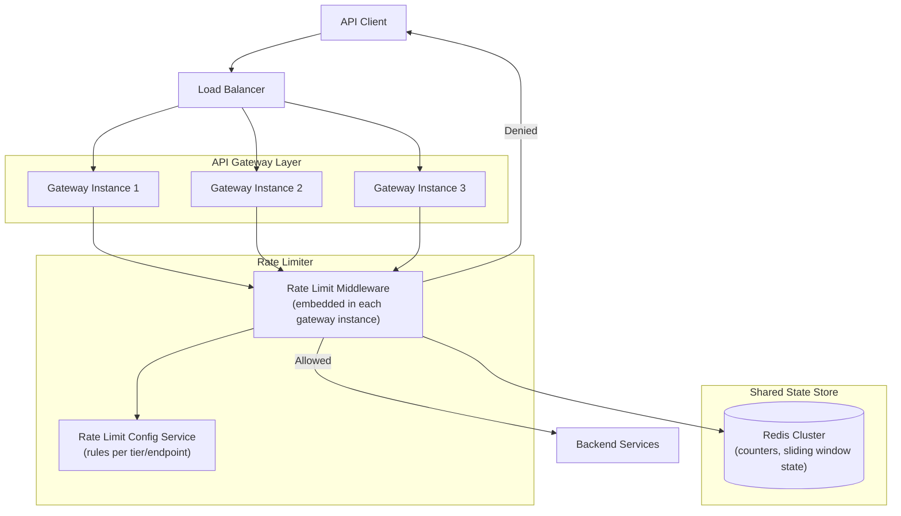
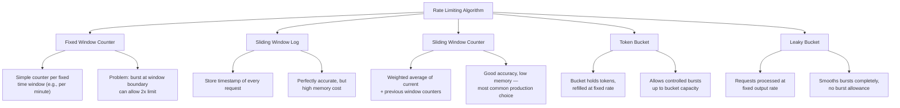
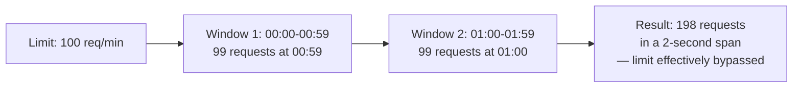
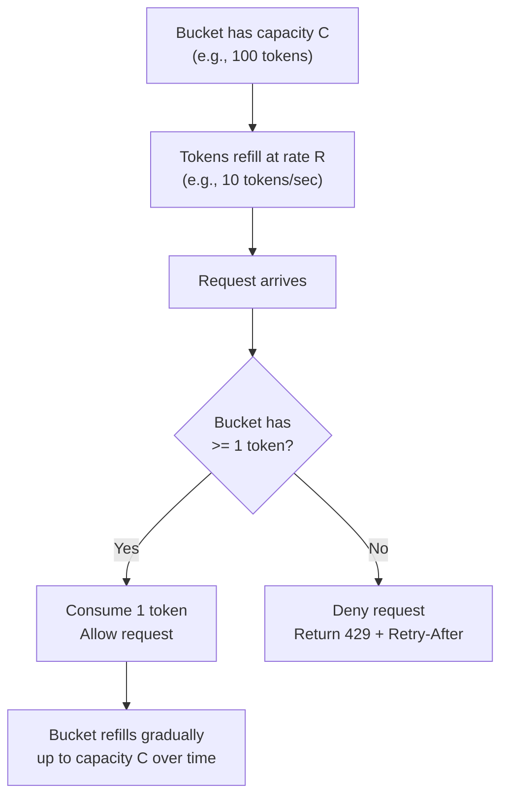
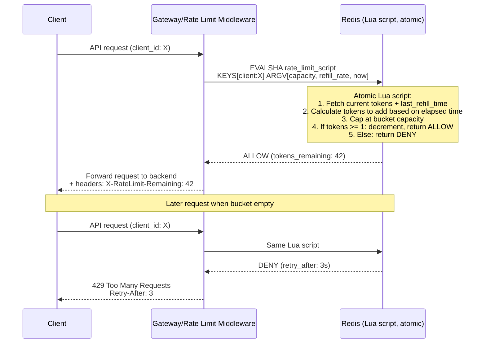
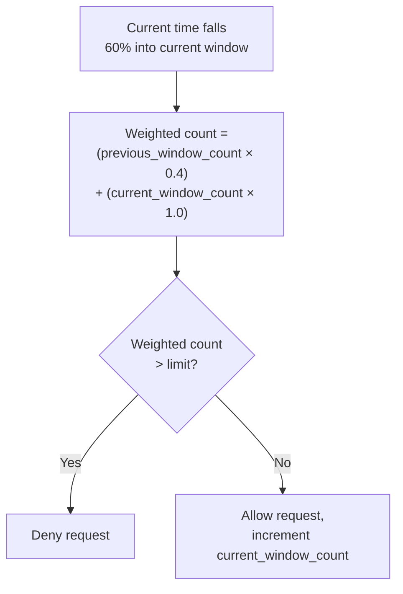
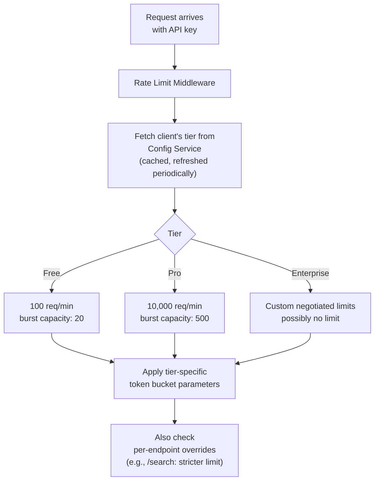
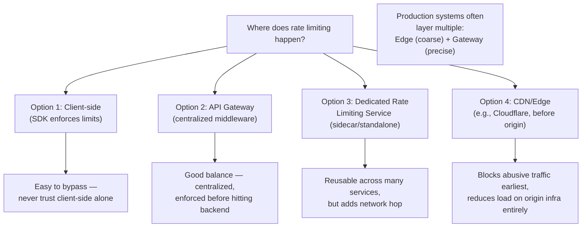
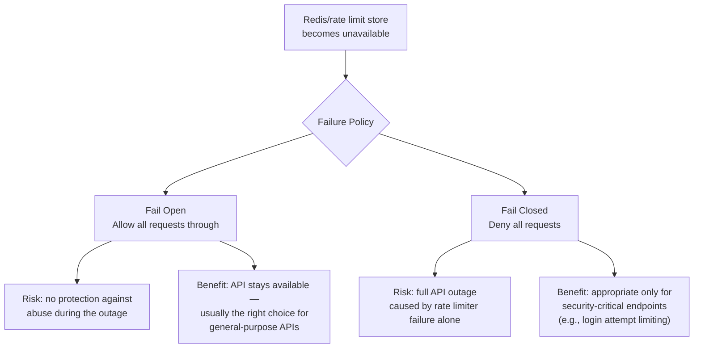
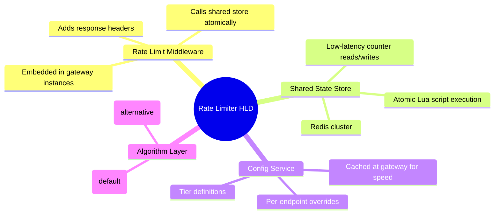

# Design a Rate Limiter — High-Level Design Document

## 1. Requirements

### Functional Requirements
- Limit the number of requests a client (user/IP/API key) can make within a time window
- Support multiple limit tiers (e.g., free tier: 100 req/min, paid tier: 10,000 req/min)
- Reject requests exceeding the limit with a clear error (HTTP 429) and retry-after hint
- Support different rate-limiting rules per API endpoint

### Non-Functional Requirements
- **Low latency:** Rate limit check must add negligible overhead (< 1-2ms) to every request
- **Accuracy vs performance tradeoff:** Perfectly precise limiting isn't required; approximate correctness at high throughput is acceptable
- **Distributed correctness:** Must work correctly across many API server instances, not just per-instance
- **High availability:** Rate limiter failure should not take down the whole API (fail open or fail closed, chosen deliberately)
- **Scale:** Must handle the same request volume as the API itself — potentially millions of checks/sec

### Back-of-Envelope Estimation
| Metric | Value |
|---|---|
| API requests/sec (platform-wide) | ~1M |
| Rate limit checks/sec | ~1M (one per request) |
| Unique clients tracked | ~10M+ active API keys/users |
| Latency budget per check | < 1-2ms |
| Storage per client (counter state) | ~50-100 bytes |

---

## 2. High-Level Architecture

**Key idea:** Because API requests hit many different gateway instances (behind a load balancer), rate limit *state* (counters) must live in a **shared store** (Redis) rather than in-process memory — otherwise each instance would enforce the limit independently, letting a client effectively get N× the intended limit by spreading requests across N gateway instances.

---

## 3. Rate Limiting Algorithms

### Fixed Window Boundary Problem (Why Naive Approach Fails)

*This is why production systems almost always use **sliding window counter** or **token bucket** instead of naive fixed windows.*

---

## 4. Token Bucket Algorithm — Detailed Mechanics

**Why token bucket is the most common choice:** It naturally allows short bursts (a client that's been idle can suddenly send up to `capacity` requests at once) while still enforcing a strict long-term average rate — closely matching how real client traffic behaves (bursty, not perfectly uniform).

---

## 5. Distributed Token Bucket — Redis Implementation

**Why a Lua script (not separate GET+SET calls):** Rate limit checks must be atomic — if a gateway reads the counter, then writes an update, a concurrent request from another gateway instance could race in between and both requests could be allowed when only one should be. A single atomic Redis Lua script (or `MULTI`/`EXEC` transaction) eliminates this race condition entirely.

---

## 6. Sliding Window Counter (Alternative Approach)

*This smooths out the boundary-burst problem of fixed windows with much less memory than storing every individual request timestamp (sliding window log).*

---

## 7. Multi-Tier Rate Limiting Rules

---

## 8. Rate Limiter Placement Options

---

## 9. Handling Rate Limiter Failure (Fail Open vs Fail Closed)

---

## 10. Component Responsibilities Summary

---

## 11. Key Design Decisions & Tradeoffs

| Decision | Choice | Why |
|---|---|---|
| Algorithm | Token bucket | Naturally allows short bursts while enforcing long-term average rate; matches real traffic patterns |
| State storage | Shared Redis, not per-instance memory | Multiple gateway instances must share a consistent view of each client's usage |
| Atomicity | Lua script / MULTI-EXEC in Redis | Prevents race conditions between concurrent requests from different gateway instances |
| Placement | Gateway-level (with optional edge layer) | Centralizes enforcement before backend load, while edge layer can pre-filter obvious abuse even earlier |
| Failure policy | Fail open (context-dependent) | Prioritizes API availability for general endpoints; security-critical endpoints may choose fail-closed instead |
| Precision | Approximate (sliding window/token bucket), not perfectly exact | Perfect accuracy isn't worth the memory/latency cost at this scale; slight over/under-allowance is acceptable |

---

## 12. Bottlenecks & Scaling Considerations

- **Redis as a single shared dependency** — every single API request now depends on Redis latency/availability; must be a dedicated, highly-available Redis cluster (not shared with unrelated workloads) with sub-millisecond response times.
- **Hot client keys** — a single very high-traffic API key can create a hot key in Redis; consider local pre-approval caching (e.g., gateway locally allows the first few requests optimistically, reconciling with Redis periodically) for extreme-scale single-client traffic.
- **Config propagation lag** — tier/limit changes (e.g., a customer upgrades their plan) need to propagate to all gateway instances; typically handled via short-TTL caching or a pub/sub invalidation signal rather than a fully synchronous lookup per request.
- **Clock skew across distributed nodes** — sliding window and token bucket calculations depend on timestamps; using Redis server time (not client/gateway local clocks) for all calculations avoids skew-related inconsistencies.
- **Global vs regional rate limiting** — for globally distributed APIs, a client's requests may hit gateways in different regions; requires either a globally-replicated counter store (added latency) or accepting slightly relaxed per-region limits as a practical tradeoff.
- **Distinguishing abuse from legitimate bursts** — overly strict limiting frustrates legitimate bursty clients (e.g., a mobile app syncing after being offline); tuning burst capacity separately from sustained rate is key to good UX.
