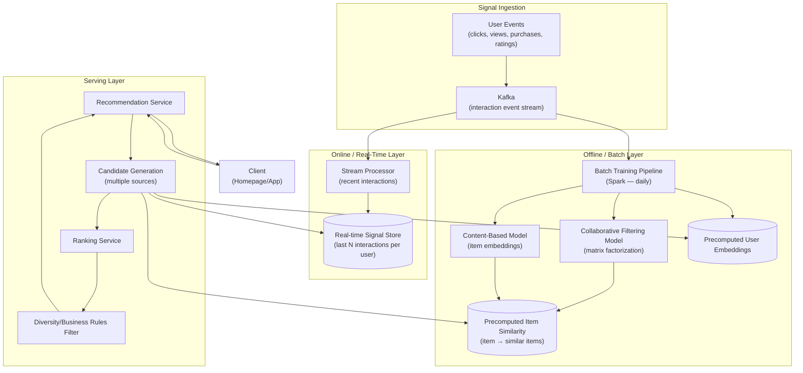
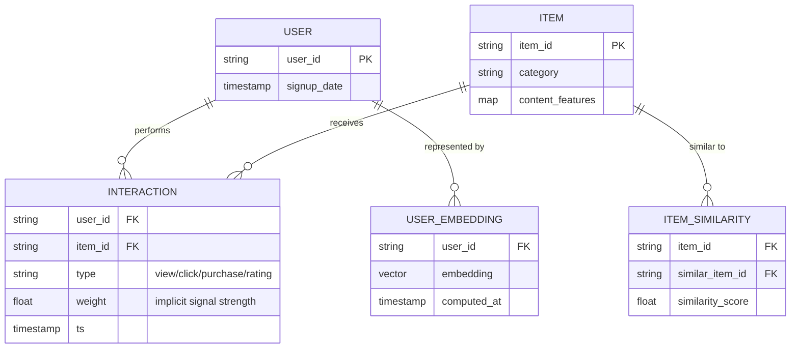
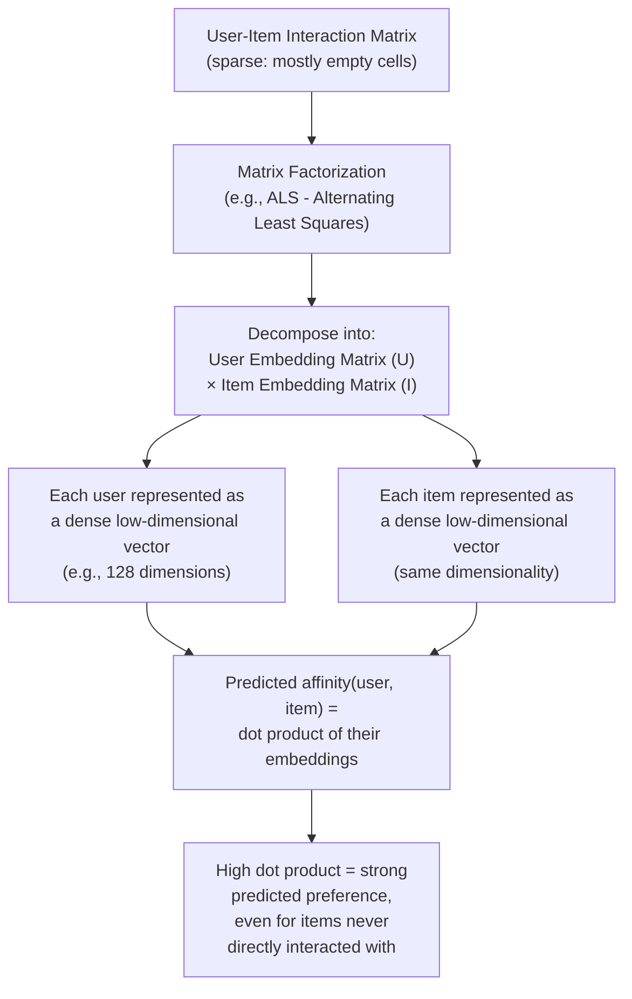
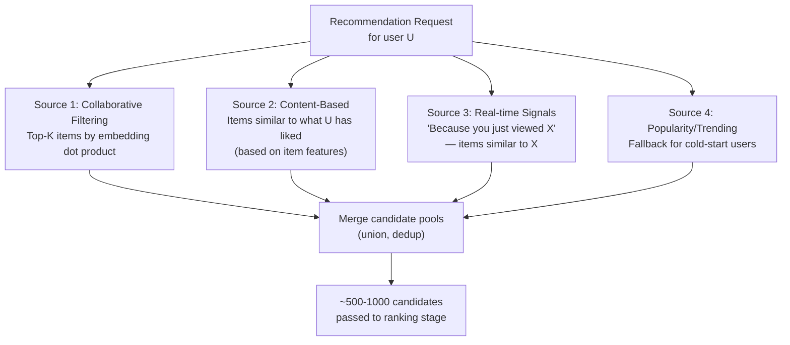
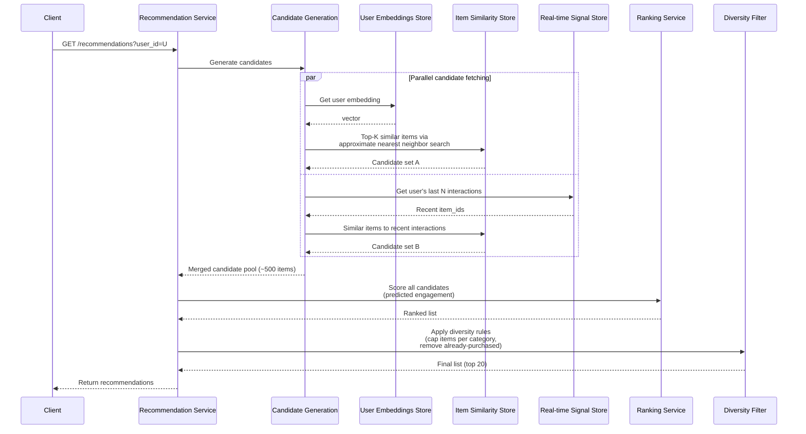
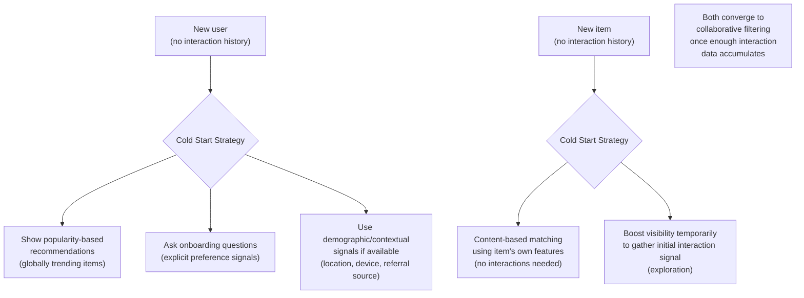
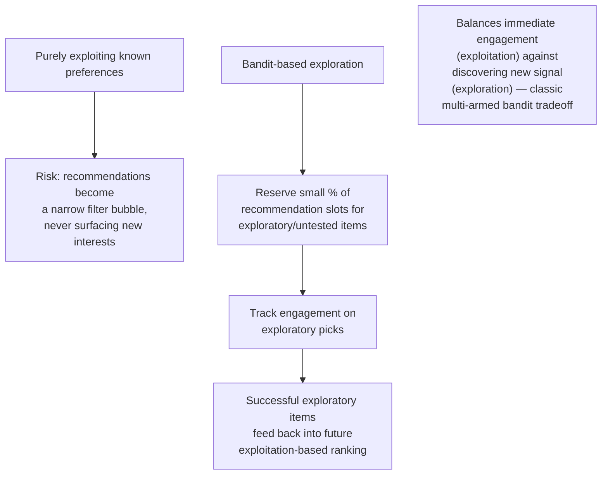
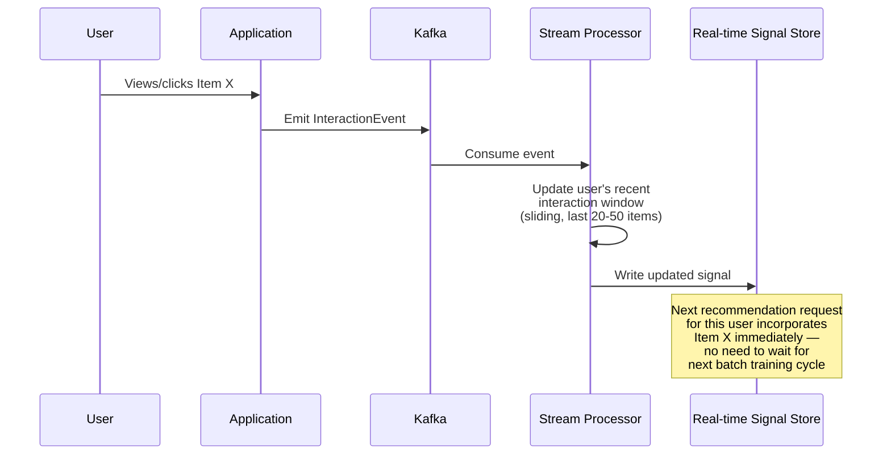
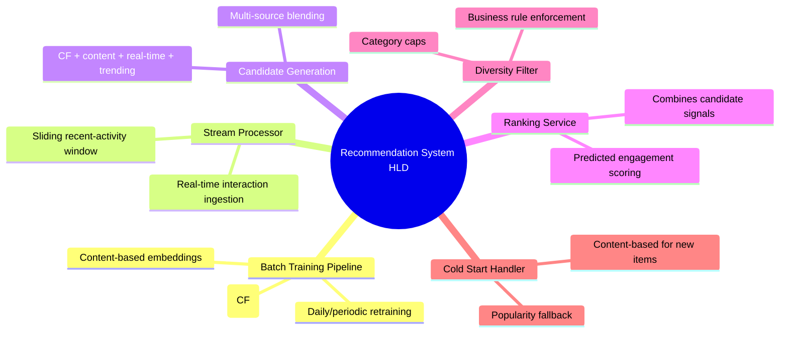

# Design a Recommendation System — High-Level Design Document

## 1. Requirements

### Functional Requirements
- Recommend items (products, videos, articles) personalized to each user
- Support multiple contexts: homepage recommendations, "similar items," "because you watched X"
- Incorporate both explicit signals (ratings, likes) and implicit signals (views, clicks, dwell time)
- Handle cold start for new users and new items gracefully
- Update recommendations as user behavior evolves (not static/stale)

### Non-Functional Requirements
- **Latency:** Recommendations must render in < 100-200ms as part of page load
- **Scale:** Millions of users, millions of items, billions of interaction events
- **Freshness:** Recent interactions should influence recommendations within minutes, not days
- **Diversity:** Avoid narrow, repetitive recommendations (filter bubble problem)
- **Explainability (nice-to-have):** Ability to justify "why was this recommended"

### Back-of-Envelope Estimation
| Metric | Value |
|---|---|
| Users | ~100M |
| Items | ~10M |
| Interaction events/day | ~1B |
| User-item interaction matrix | Extremely sparse (~99.9%+ empty) |
| Recommendation requests/sec | ~50,000 |
| Model retraining cadence | Daily (batch) + real-time signal blending |

---

## 2. High-Level Architecture

**Key idea:** Recommendations blend two time horizons — an **offline layer** that periodically (e.g., daily) computes expensive collaborative filtering and embeddings across the entire interaction history, and an **online layer** that incorporates a user's most recent actions in real time. Serving a request means combining precomputed candidates with fresh signals, then ranking — never computing everything from scratch per-request.

---

## 3. Data Model

---

## 4. Collaborative Filtering — Matrix Factorization

**Why this works:** Matrix factorization discovers latent patterns — e.g., it might learn a "prefers sci-fi" dimension without ever being told genres exist, purely from the pattern of which users interacted with which items. This is what lets it recommend items a user has never seen but is likely to enjoy, based on similarity to users with overlapping taste.

---

## 5. Candidate Generation (Multiple Sources Blended)

*Blending multiple candidate sources — not relying on just one model — improves both coverage (different sources catch different valid recommendations) and resilience (if one signal source is sparse for a given user, others compensate).*

---

## 6. Recommendation Serving Flow — Detailed Sequence

---

## 7. Cold Start Handling

---

## 8. Exploration vs Exploitation (Multi-Armed Bandit Approach)

---

## 9. Real-Time Signal Incorporation

---

## 10. Component Responsibilities Summary

---

## 11. Key Design Decisions & Tradeoffs

| Decision | Choice | Why |
|---|---|---|
| Model architecture | Offline batch training + online real-time signal blending | Expensive collaborative filtering can't run per-request; real-time signals fill the freshness gap between training runs |
| Candidate generation | Multiple blended sources, not single model | Improves coverage and resilience — different sources compensate for each other's weaknesses per user |
| Cold start | Popularity + content-based fallback | Collaborative filtering fundamentally requires interaction history that doesn't exist yet for new users/items |
| Exploration | Reserved bandit-based exploratory slots | Pure exploitation creates filter bubbles and never discovers new valid recommendations |
| Similarity search | Approximate nearest neighbor (ANN) | Exact nearest-neighbor search across millions of item embeddings is too slow for real-time serving; ANN trades small accuracy loss for speed |
| Retraining cadence | Daily batch + continuous real-time overlay | Full model retraining is expensive; daily cadence balances model freshness against compute cost |

---

## 12. Bottlenecks & Scaling Considerations

- **Approximate nearest neighbor search at scale** — finding "top-K similar items" across millions of embeddings must use ANN structures (e.g., HNSW, FAISS-style indexes) rather than brute-force distance computation, which wouldn't meet latency requirements.
- **Training pipeline compute cost** — matrix factorization over billions of interactions is a significant batch compute job; needs efficient distributed processing (Spark) and careful scheduling to complete within the retraining window.
- **Real-time signal store latency** — must support very fast reads (single-digit ms) since it's on the critical serving path for every recommendation request.
- **Sparse interaction data for niche items/users** — the long tail of items with very few interactions produces unreliable collaborative filtering signal; content-based approaches and popularity fallback compensate but never fully solve this.
- **Feedback loop bias** — recommendations influence what users see, which influences what they interact with, which trains future recommendations — this self-reinforcing loop can amplify existing biases if not actively counteracted with exploration.
- **Candidate pool size vs ranking cost** — larger candidate pools improve recommendation quality but increase ranking compute cost per request; this is the same multi-stage funnel tradeoff seen in general feed ranking systems.
- **A/B testing complexity** — recommendation quality is inherently hard to measure with simple metrics; requires careful experiment design (e.g., long-term engagement, not just immediate click-through) to avoid optimizing for short-term metrics that harm long-term satisfaction.
