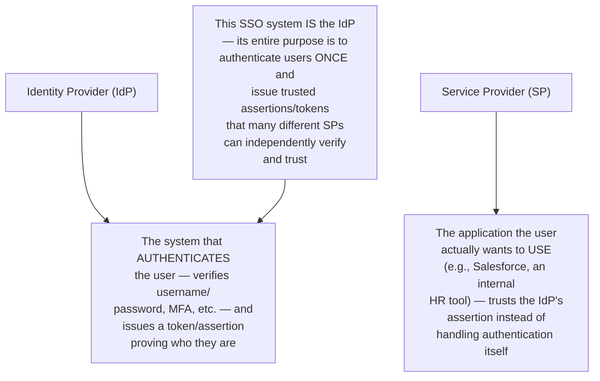
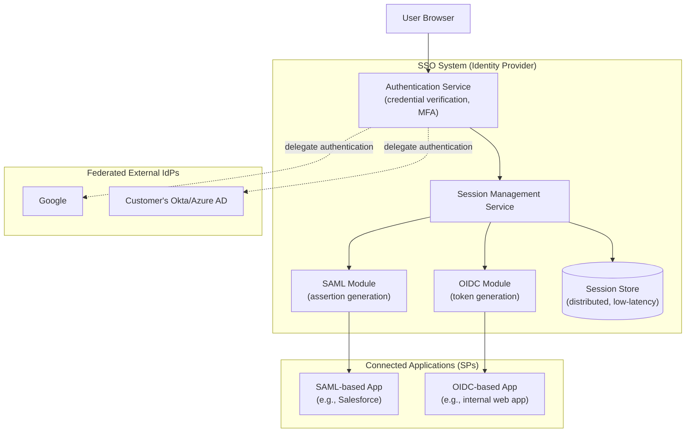
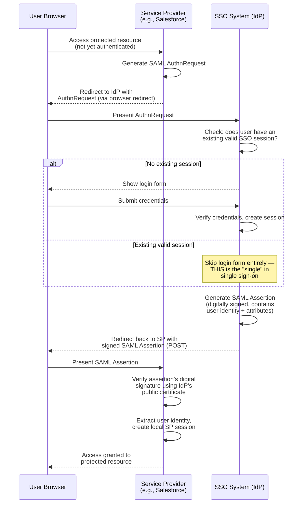
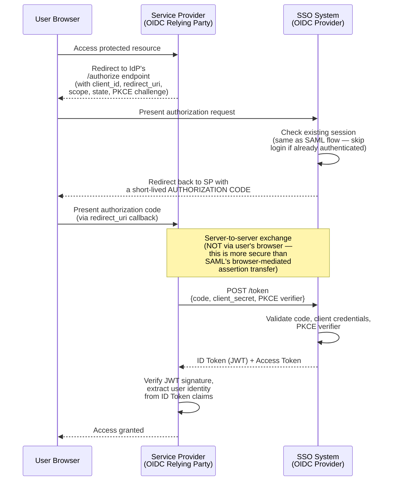
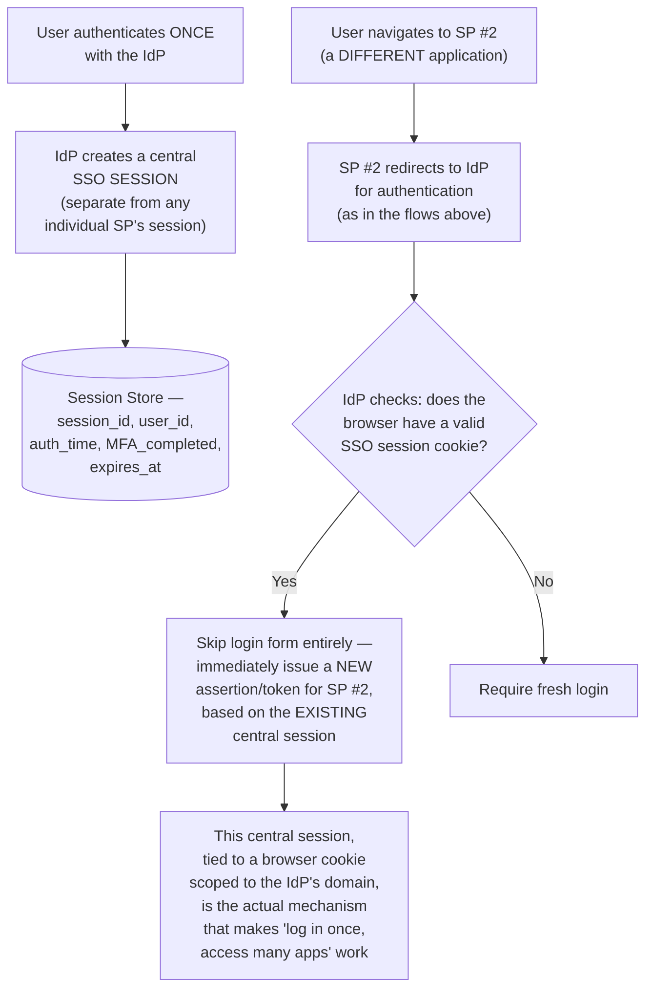
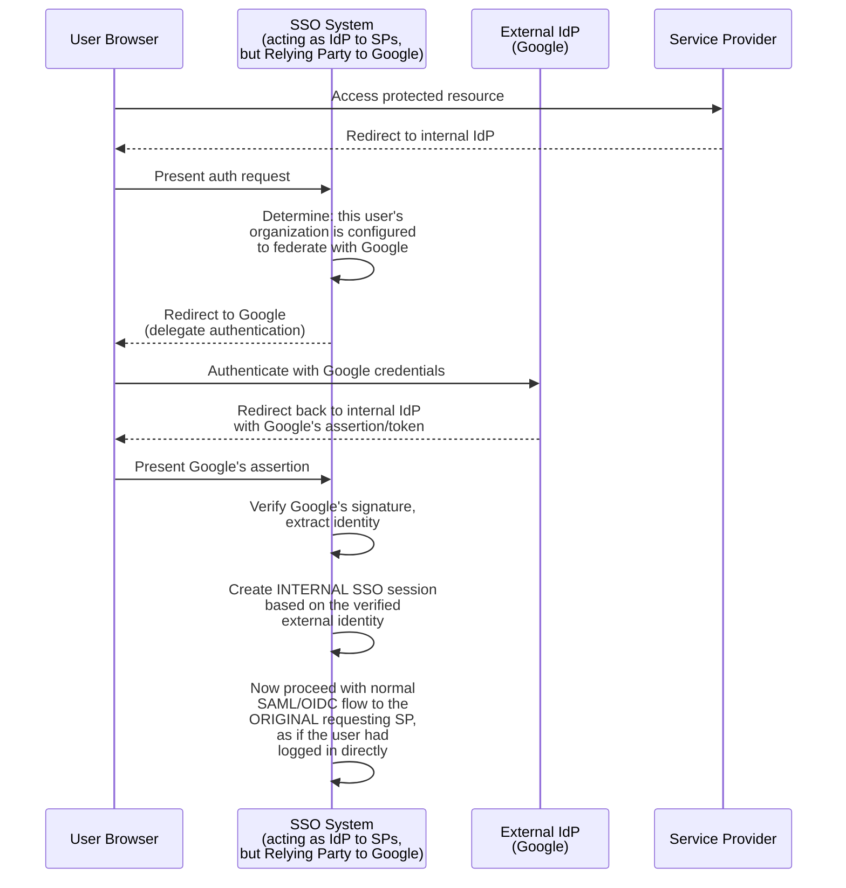
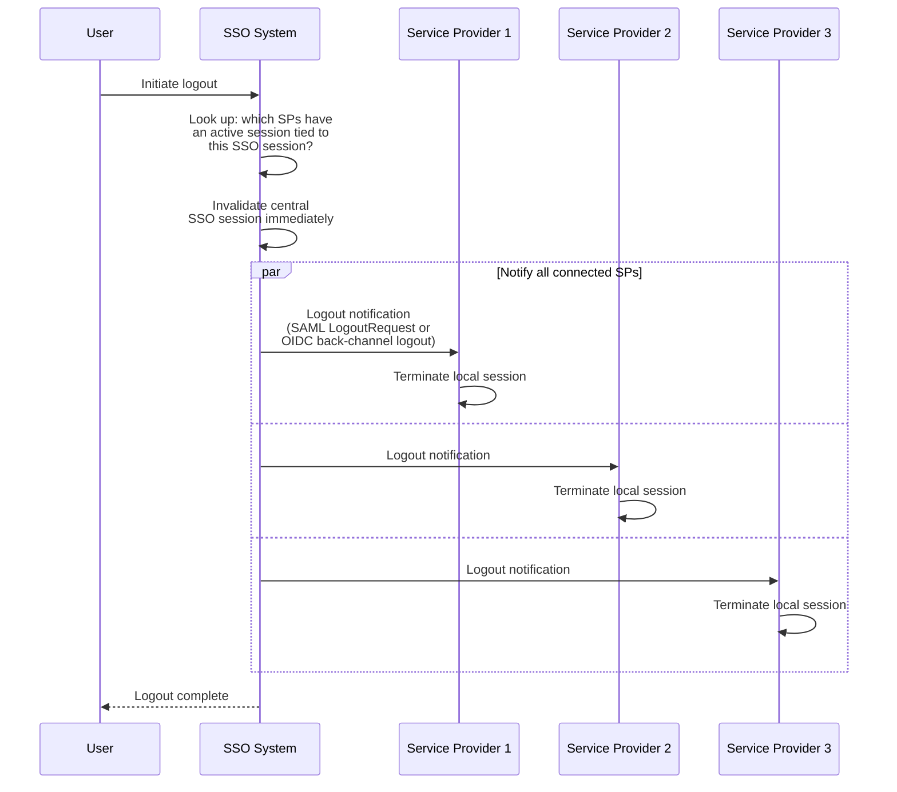
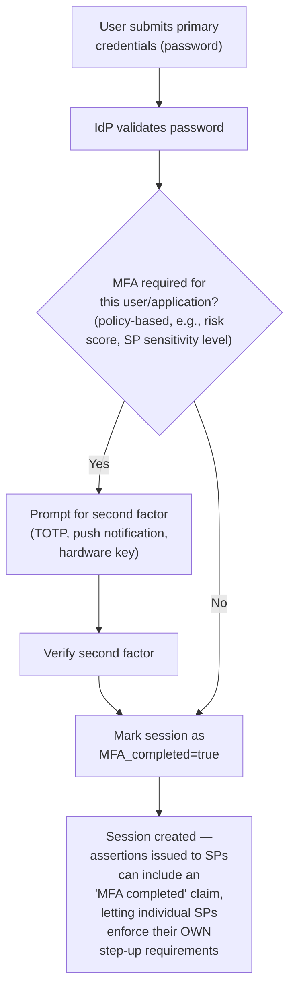
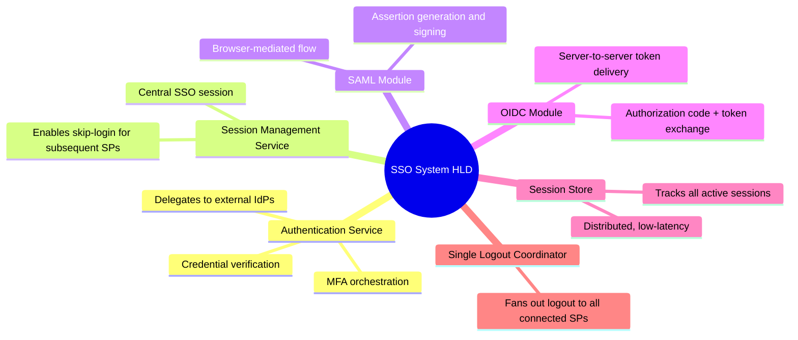

# Design a Single Sign-On (SSO) System Supporting SAML and OAuth2/OIDC — High-Level Design Document

## 1. Requirements

### Functional Requirements
- Allow users to authenticate once and gain access to multiple independent applications ("service providers") without re-entering credentials
- Support multiple identity provider (IdP) protocols: SAML 2.0 (common in enterprise) and OAuth2/OIDC (common in modern web/mobile)
- Support federation with EXTERNAL identity providers (e.g., "Login with Google," a customer's own Okta/Azure AD)
- Support logout that terminates the session across all connected applications (single logout)

### Non-Functional Requirements
- **Security (paramount):** This system is the literal front door to every connected application — a vulnerability here compromises everything downstream
- **Protocol correctness:** SAML and OAuth2/OIDC have precise, standardized flows; deviations break interoperability with third-party IdPs/SPs
- **Session management at scale:** Must track active sessions across potentially millions of users and many connected applications
- **Availability:** SSO going down effectively locks users out of every connected application simultaneously — extremely high availability bar

### Back-of-Envelope Estimation
| Metric | Value |
|---|---|
| Logins/sec (peak, e.g., Monday morning) | ~10,000 |
| Active sessions | Tens of millions |
| Connected applications (service providers) | Dozens to hundreds per enterprise deployment |
| Token/assertion validation calls/sec | Very high — happens on nearly every authenticated request |

---

## 2. Core Concepts — Identity Provider vs Service Provider

---

## 3. High-Level Architecture

**Key idea:** The SSO system centralizes authentication logic and session state, but exposes it through TWO distinct protocol modules (SAML and OIDC) — because these are genuinely different standards with different message formats and flows, not just two configuration options of the same underlying mechanism. Additionally, the SSO system itself can delegate to further UPSTREAM identity providers (federation), acting as both an IdP to its SPs and a "relying party" to external IdPs simultaneously.

---

## 4. SAML 2.0 Flow (Enterprise-Style) — Detailed Sequence

**Why the assertion is digitally signed:** Since the assertion travels through the user's browser (not a direct server-to-server channel) as it passes from IdP to SP, the SP must be able to verify it hasn't been tampered with en route — the IdP's cryptographic signature, verifiable using its published public certificate, provides this guarantee without requiring a direct trusted network path between IdP and SP.

---

## 5. OAuth2/OIDC Flow (Modern Web/Mobile) — Detailed Sequence

**Why OIDC's code exchange is considered more secure than SAML's browser-mediated flow:** The actual token exchange happens over a direct, authenticated server-to-server channel (SP backend to IdP backend) rather than passing the sensitive credential material through the user's browser as an intermediary — this reduces the attack surface for token interception/replay significantly, which is part of why OIDC is generally preferred for new implementations over SAML.

---

## 6. Session Management — The Foundation of "Single" Sign-On

---

## 7. Federation With External Identity Providers

**Why this layered federation matters architecturally:** The SSO system acts simultaneously as an Identity Provider (to its connected SPs) and a Relying Party/Service Provider (to upstream identity providers like Google or a customer's Azure AD) — this dual role is what allows a single SSO deployment to support "bring your own identity provider" for enterprise customers while still presenting a unified, consistent authentication experience to all downstream connected applications.

---

## 8. Single Logout (Terminating All Sessions)

*Single logout is notably harder to implement reliably than single sign-on itself — it requires proactively notifying multiple independent applications (each potentially using different mechanisms) rather than the more naturally single-point action of creating one central session at login.*

---

## 9. Multi-Factor Authentication Integration

---

## 10. Component Responsibilities Summary

---

## 11. Key Design Decisions & Tradeoffs

| Decision | Choice | Why |
|---|---|---|
| Protocol support | Both SAML and OIDC, as distinct modules | Genuinely different standards serving different ecosystems (enterprise legacy vs modern web/mobile) — not interchangeable |
| Session architecture | Central SSO session, separate from per-SP sessions | This central session is the actual mechanism enabling "log in once, access many" — without it, each SP redirect would require fresh authentication |
| Federation model | SSO system as both IdP and Relying Party simultaneously | Enables "bring your own identity provider" for enterprise customers while presenting a unified experience to connected applications |
| Token transport (OIDC) | Server-to-server code exchange, not browser-only | Reduces attack surface compared to passing sensitive tokens through the browser as an intermediary |
| MFA architecture | Policy-based, with claims passed to SPs | Allows individual SPs to make their own step-up authentication decisions based on the SSO system's verified MFA status |
| Logout | Active fan-out notification to all connected SPs | Single logout requires proactive multi-party coordination, unlike the naturally singular action of session creation |

---

## 12. Bottlenecks & Scaling Considerations

- **Session store as an absolutely critical dependency** — since EVERY authentication flow (to any connected SP) depends on session lookups, this store's availability and latency directly bound the entire SSO system's — and therefore every connected application's — availability; needs to be highly available, distributed, and low-latency, similar criticality to the idempotency store in the Idempotent API Requests design.
- **Assertion/token signing key management** — the cryptographic keys used to sign SAML assertions and OIDC tokens are extraordinarily sensitive; compromise would allow forging valid authentication for ANY user to ANY connected application — this connects directly to the Secrets Management System design for how these keys themselves must be protected, rotated, and audited.
- **Clock skew sensitivity** — both SAML assertions and OIDC tokens include time-bound validity windows (not-before, expiry); significant clock skew between the IdP and SP servers can cause valid tokens to be incorrectly rejected — NTP synchronization across all parties is an operational prerequisite, not just a nice-to-have.
- **Federation dependency risk** — when federating to an external IdP (Google, a customer's Azure AD), an outage of that EXTERNAL system directly blocks authentication for affected users, even though the SSO system itself may be perfectly healthy — this external dependency risk should be clearly understood and communicated in SLA commitments.
- **Single logout reliability** — because it requires successfully notifying multiple independent SPs (each potentially over unreliable network calls), true guaranteed single logout across ALL connected applications is genuinely difficult to achieve with 100% reliability; most production systems document this as "best effort" logout propagation rather than an absolute guarantee.
- **Replay attack prevention** — both protocols need careful handling of nonces/unique identifiers (SAML's assertion ID, OIDC's state/nonce parameters) to prevent a captured, valid assertion or authorization code from being replayed by an attacker — this is security-critical, protocol-specified behavior that must be implemented exactly per specification, not approximated.
- **High-availability requirement amplification** — because SSO failure doesn't just affect one application but potentially ALL connected applications simultaneously, the availability bar for this system is effectively the HIGHEST availability requirement across its entire portfolio of dependent applications — this often justifies significantly more redundancy investment than any single downstream application would independently require.
