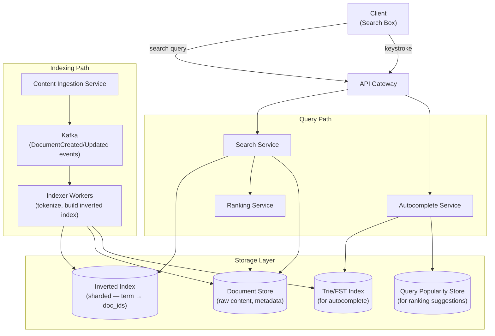
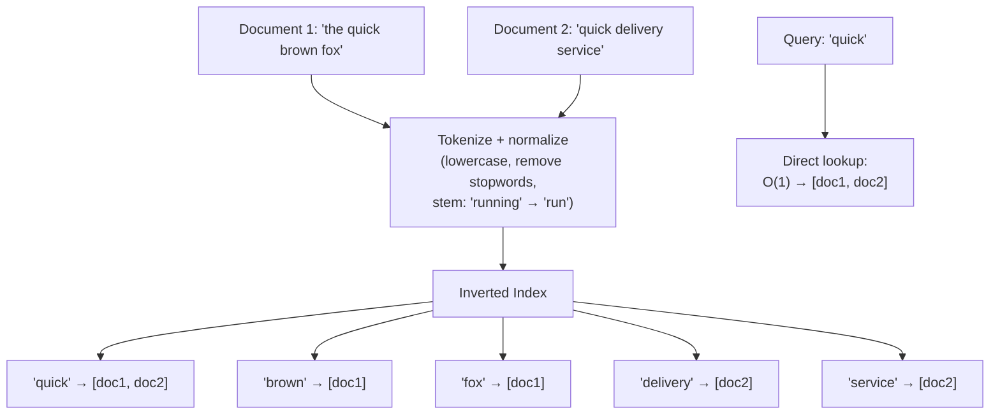
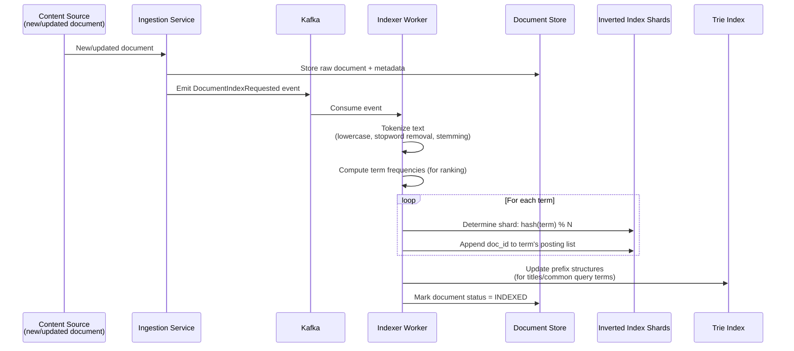
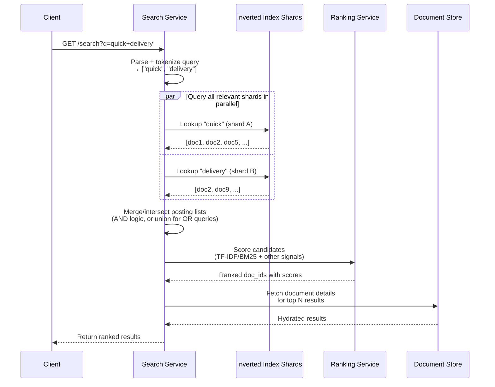
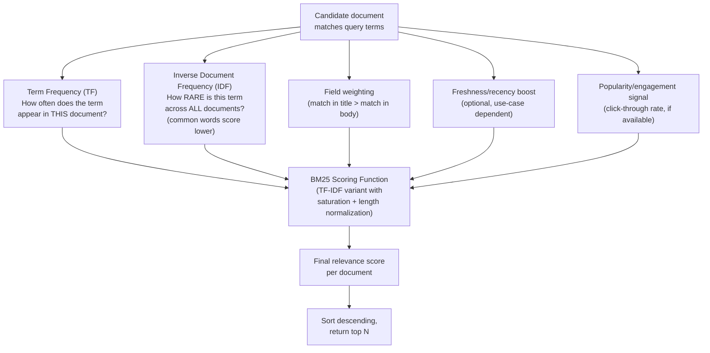
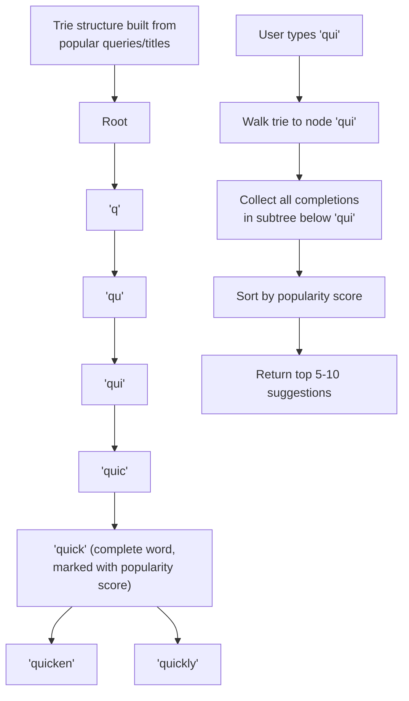
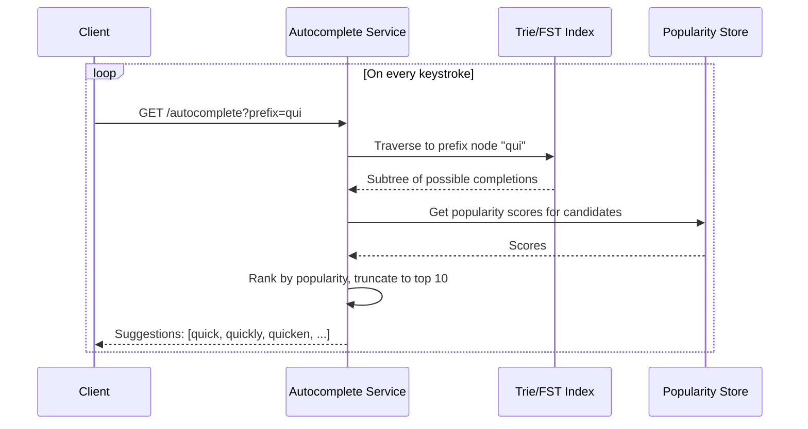
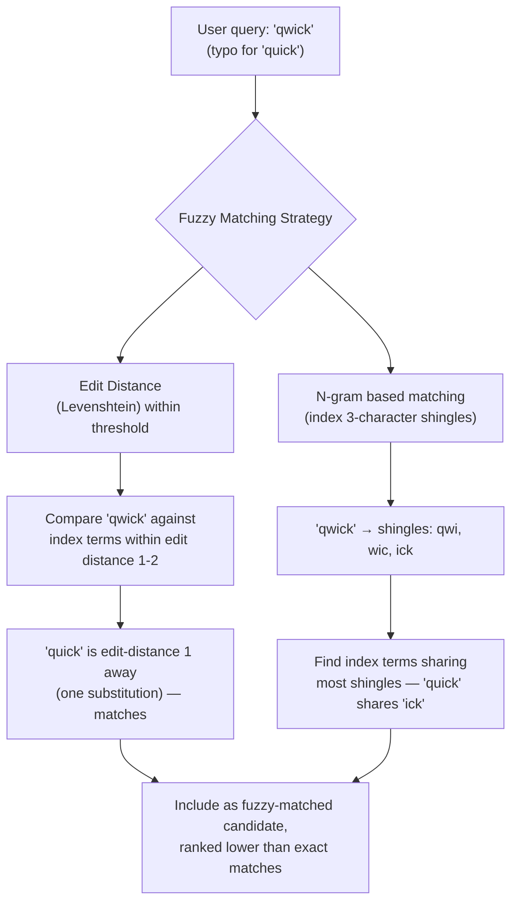
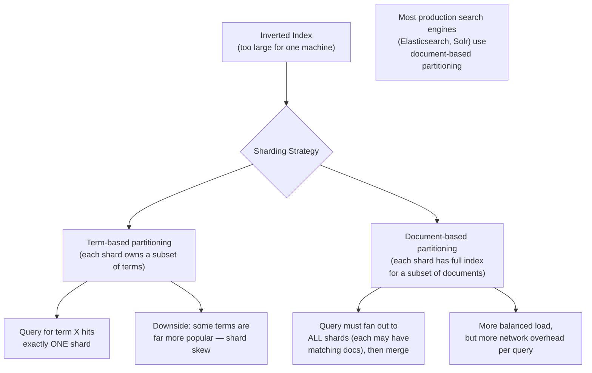
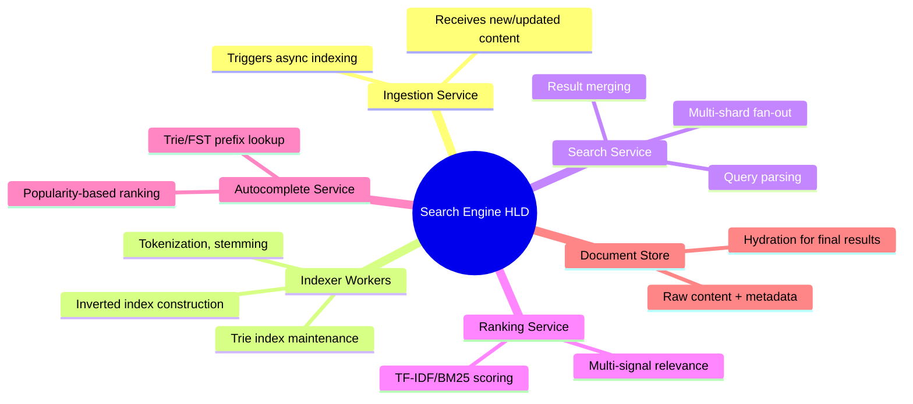

# Design a Search Engine / Autocomplete System — High-Level Design Document

## 1. Requirements

### Functional Requirements
- Full-text search across a large document/content corpus
- Relevance-ranked results, not just keyword matching
- Autocomplete/typeahead suggestions as the user types
- Typo tolerance (fuzzy matching)
- Faceted filtering (e.g., filter by category, date, price range)

### Non-Functional Requirements
- **Low latency:** Search results < 100-200ms; autocomplete suggestions < 50ms (feels instant while typing)
- **Freshness:** New/updated content should become searchable within seconds to minutes, not hours
- **Scale:** Billions of documents indexed, tens of thousands of queries/sec
- **Relevance quality:** Results must be ranked by genuine relevance, not just presence of keywords
- **High availability:** Search must degrade gracefully (e.g., slightly stale index) rather than hard-fail

### Back-of-Envelope Estimation
| Metric | Value |
|---|---|
| Documents indexed | ~10B |
| Search queries/sec | ~50,000 |
| Autocomplete requests/sec | ~500,000+ (fired per keystroke) |
| Index size | Terabytes, sharded across many nodes |
| Avg document size | ~2KB (text content) |

---

## 2. High-Level Architecture

**Key idea:** Search and autocomplete are architecturally distinct subsystems sharing the same content pipeline. Search relies on an **inverted index** (term → matching documents) for full-text relevance matching, while autocomplete relies on a completely different structure — a **trie/FST (finite state transducer)** — optimized for prefix matching at extremely low latency.

---

## 3. The Inverted Index — Core Data Structure

*The inverted index is what makes full-text search fast — instead of scanning every document for a query term (O(N) documents), you do a direct lookup of the term to get its matching document list (O(1) lookup, then merge/rank).*

---

## 4. Document Indexing Pipeline

---

## 5. Search Query Flow — Detailed Sequence

---

## 6. Relevance Ranking (TF-IDF / BM25)

*BM25 improves on naive TF-IDF by preventing a document from scoring disproportionately high just by repeating a term many times (diminishing returns via saturation) and normalizing for document length so long documents don't unfairly dominate.*

---

## 7. Autocomplete — Trie-Based Prefix Matching

**Why a trie/FST instead of the inverted index for autocomplete:** Autocomplete needs prefix matching at extremely low latency on every keystroke — a trie gives O(prefix_length) lookup regardless of dataset size, far faster than any inverted-index-based text search for this specific access pattern. An FST (finite state transducer) is often used in production as a more memory-compact variant of the same idea.

---

## 8. Typo Tolerance (Fuzzy Matching)

---

## 9. Index Sharding Strategy

---

## 10. Component Responsibilities Summary

---

## 11. Key Design Decisions & Tradeoffs

| Decision | Choice | Why |
|---|---|---|
| Core search structure | Inverted index | Transforms full-text search from O(N documents) scanning into O(1) term lookup + merge |
| Autocomplete structure | Separate trie/FST index | Prefix matching has fundamentally different performance characteristics than full-text search; needs its own optimized structure |
| Ranking algorithm | BM25 (TF-IDF variant) | Handles term saturation and document length normalization better than naive term-frequency counting |
| Index sharding | Document-based partitioning | More balanced load distribution than term-based, despite requiring fan-out to all shards per query |
| Typo tolerance | Edit distance + n-gram matching | Combines precision (edit distance) with query speed (n-gram pre-filtering) rather than relying on one technique alone |
| Indexing latency | Async pipeline via Kafka | Decouples content ingestion from the (relatively) expensive tokenization/indexing work, allowing independent scaling |

---

## 12. Bottlenecks & Scaling Considerations

- **Query fan-out latency** — document-based sharding means every query hits every shard; the overall query latency is bounded by the slowest shard's response time, requiring careful timeout/tail-latency management (e.g., "good enough" partial results if one shard is slow).
- **Index update latency vs read load** — frequent re-indexing (for freshness) competes for resources with serving search queries; production systems often separate indexing and query-serving nodes, with periodic index snapshot handoff.
- **Autocomplete cache-ability** — since many users type overlapping prefixes ("a", "ap", "app"...), aggressive caching of common prefix results dramatically reduces trie traversal load — worth layering a cache in front of the trie for the most common prefixes.
- **Popularity score staleness** — autocomplete ranking based on historical query popularity can lag behind rapidly emerging trends (breaking news); needs a real-time signal blended with the historical baseline for trending terms.
- **Hot shard from popular terms** — even with document-based sharding, extremely common query terms can create uneven load across shards during query time; monitor and consider dedicated caching for top queries.
- **Relevance tuning is never "done"** — unlike most infra problems, ranking quality requires continuous evaluation (A/B testing, click-through analysis) rather than a fixed correct architecture — the system needs to be designed for iterative relevance tuning, not just raw performance.
- **Large-scale reindexing** — full corpus re-indexing (e.g., after a ranking algorithm change) at billions of documents is a massive batch operation; needs to run without disrupting live query serving, typically via a blue-green index swap.
