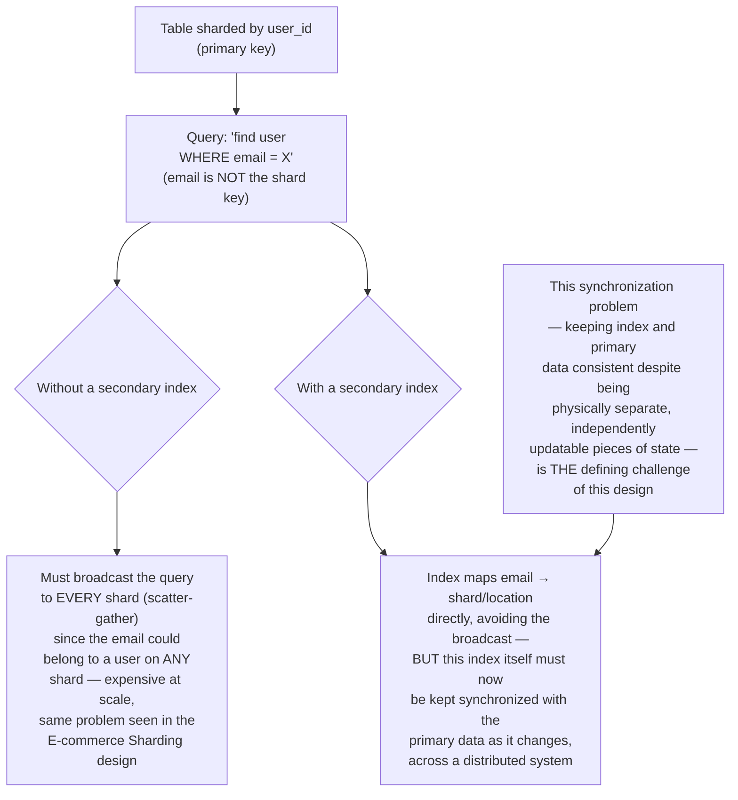
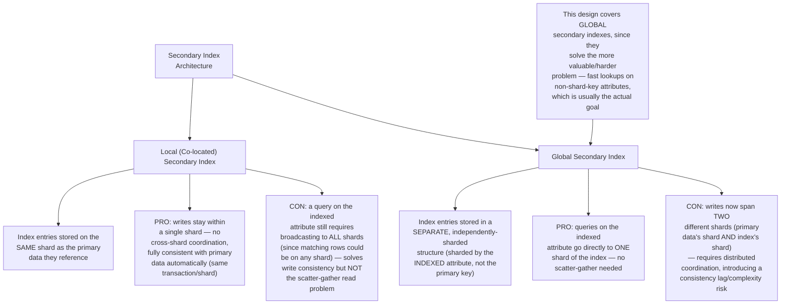
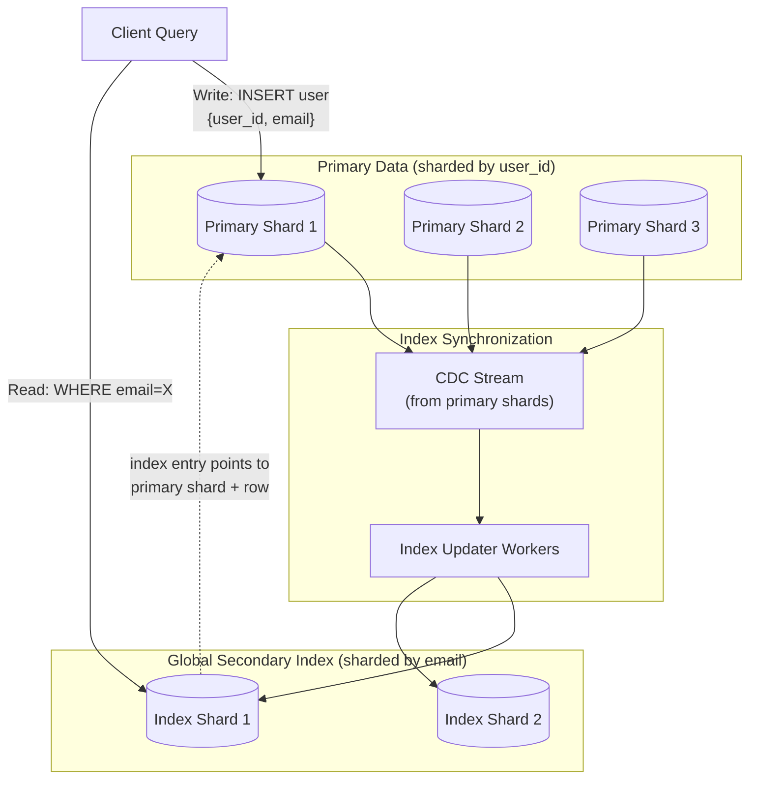
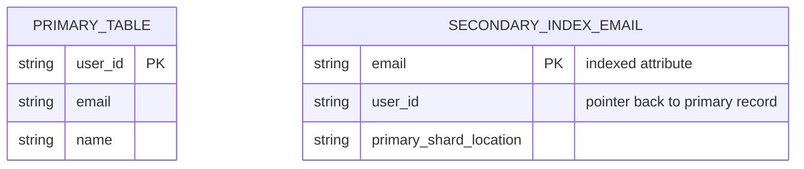
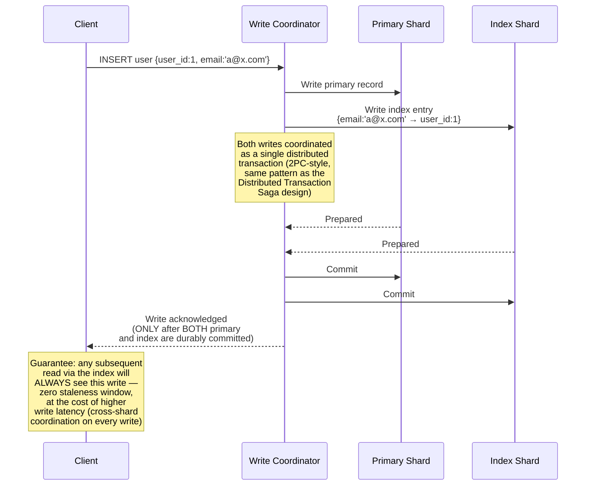
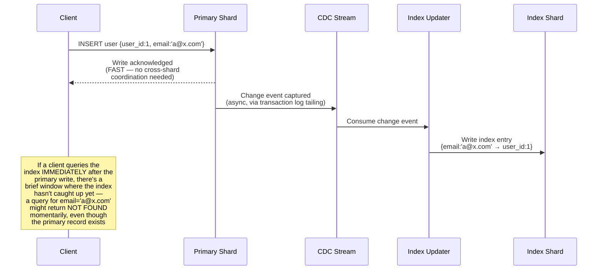
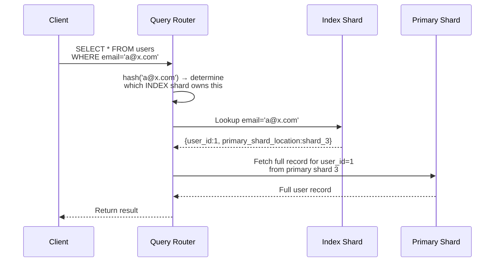
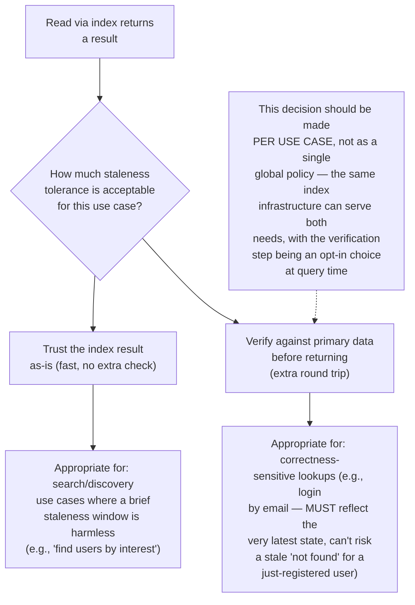
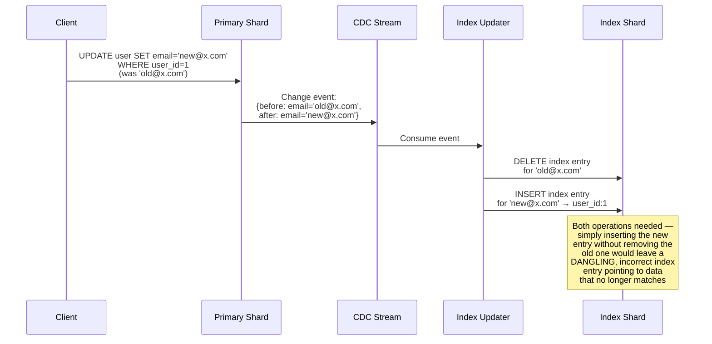
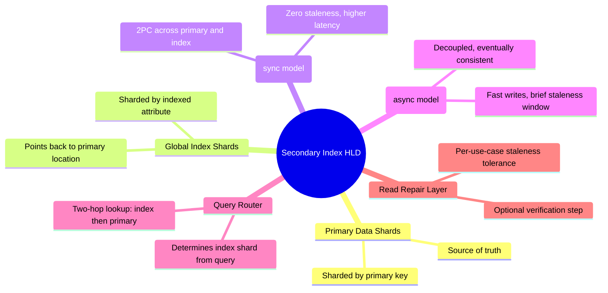

# Design a Secondary Index System for a Distributed Database — High-Level Design Document

## 1. Requirements

### Functional Requirements
- Support efficient lookups on non-primary-key attributes (e.g., "find user by email" when the table is sharded by user_id)
- Keep the secondary index consistent with the underlying primary data as it changes (inserts, updates, deletes)
- Support both exact-match and range queries on indexed attributes
- Support multiple secondary indexes per table without excessive write amplification

### Non-Functional Requirements
- **Consistency between primary data and index:** This is the central challenge — an index that returns stale or missing results undermines its entire purpose
- **Write performance:** Adding secondary indexes shouldn't catastrophically slow down primary writes
- **Query performance:** Secondary index lookups should approach the speed of primary key lookups, not require a full table scan
- **Scalability:** Must work across a sharded/partitioned primary dataset, not just a single-node database

### Back-of-Envelope Estimation
| Metric | Value |
|---|---|
| Primary table size | Billions of rows, sharded by primary key |
| Secondary indexes per table | 2-5 typical |
| Write amplification per indexed write | 1 primary write + 1 index write per index |
| Index consistency lag tolerance | Depends on model chosen — from zero to seconds |

---

## 2. The Core Problem — Why Secondary Indexes Are Hard in Distributed Databases

---

## 3. Two Fundamental Index Architectures

---

## 4. High-Level Architecture (Global Secondary Index)

**Key idea:** Writes to primary data and updates to the secondary index are decoupled via CDC (the exact mechanism covered in the CDC Pipeline design) — a write completes fast against the primary shard, and the index catches up asynchronously. This is a deliberate consistency/performance tradeoff, not an oversight, and is explored fully below.

---

## 5. Data Model

---

## 6. Synchronous (Strongly Consistent) Index Update — Detailed Sequence

---

## 7. Asynchronous (Eventually Consistent) Index Update — Detailed Sequence

**The core tradeoff this design must make explicit:** Synchronous updates guarantee the index is never stale, at the cost of significantly higher write latency (every write now requires cross-shard distributed transaction coordination). Asynchronous updates keep writes fast but introduce a brief window where the index can return stale/incomplete results — this is the same linearizability-vs-eventual-consistency tradeoff explored in that dedicated design, applied specifically to the primary/index consistency problem.

---

## 8. Read Flow via Secondary Index — Detailed Sequence

**Why this is a two-hop lookup:** The index only stores enough information to LOCATE the primary record (the pointer), not necessarily the full record itself — this avoids duplicating the entire row's data in every index (which would multiply storage cost and, more importantly, multiply the consistency-maintenance burden across every field, not just the indexed one).

---

## 9. Handling Index Staleness — Read Repair / Verification (For Async Model)

---

## 10. Handling Deletes and Updates (Index Cleanup)

**Why the before-image matters here:** This directly parallels why the WAL & Recovery System design stores before-images — without knowing what the OLD indexed value was, the index updater wouldn't know which stale entry to remove, and the index would silently accumulate incorrect entries over time.

---

## 11. Component Responsibilities Summary

---

## 12. Key Design Decisions & Tradeoffs

| Decision | Choice | Why |
|---|---|---|
| Index architecture | Global secondary index (separately sharded) | Solves the actual goal — fast, single-shard lookups on non-primary-key attributes — unlike local indexes which still require scatter-gather reads |
| Consistency model | Configurable: synchronous (2PC) or asynchronous (CDC-based) | Different use cases genuinely need different points on the consistency/latency tradeoff spectrum; a single global choice would over- or under-serve some use cases |
| Index entry content | Pointer to primary record, not full duplicate | Avoids multiplying storage and consistency-maintenance burden across every field, not just the indexed one |
| Delete/update handling | Explicit removal of stale entries via before-image tracking | Prevents dangling, incorrect index entries from silently accumulating |
| Read verification | Optional, per-use-case | Balances read latency against staleness tolerance based on actual application requirements, not a one-size-fits-all policy |

---

## 13. Bottlenecks & Scaling Considerations

- **Write amplification** — every additional secondary index roughly doubles (or more) the write cost for indexed writes; systems typically limit the number of secondary indexes per table and encourage careful selection of which attributes genuinely need indexing.
- **CDC lag under high write volume** — in the async model, if the CDC/index-updater pipeline falls behind the primary write rate, the staleness window grows beyond its normal brief duration; needs the same lag monitoring discussed in the CDC Pipeline design.
- **Index shard hot spots** — if the indexed attribute has a skewed value distribution (e.g., many users share very few distinct values), the index shards can become as unevenly loaded as primary shards can with a poor shard key — the same shard key selection principles from the E-commerce Sharding design apply here to the index's own sharding scheme.
- **Cross-shard transaction cost for synchronous model** — every single indexed write pays the latency and complexity cost of distributed transaction coordination; this compounds if a table has multiple synchronous secondary indexes, since each requires its own coordination.
- **Index rebuild for schema/index changes** — adding a NEW secondary index to an existing large table requires a full backfill (scanning all existing primary data to populate the new index) — this needs to be done as a careful, throttled background process (similar to the CDC pipeline's initial snapshot phase) without disrupting live traffic.
- **Orphaned index entries from partial failures** — in the asynchronous model, if the index-updater crashes between processing a delete's "remove old entry" and "insert new entry" steps, the index can be left in a transiently inconsistent state; needs idempotent, resumable processing (tracked via committed offsets, same pattern as the CDC Pipeline design) to guarantee eventual correctness even after failures mid-update.
