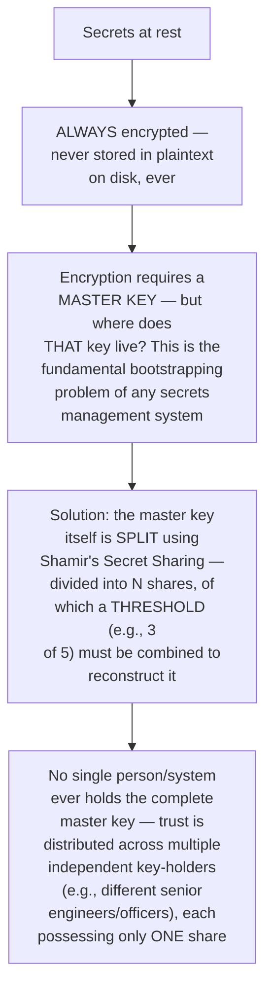
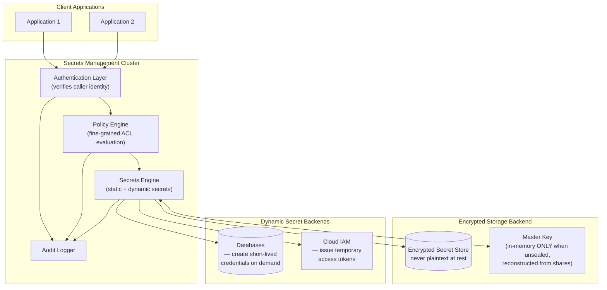
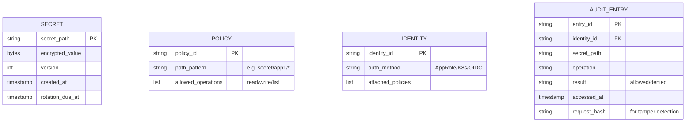
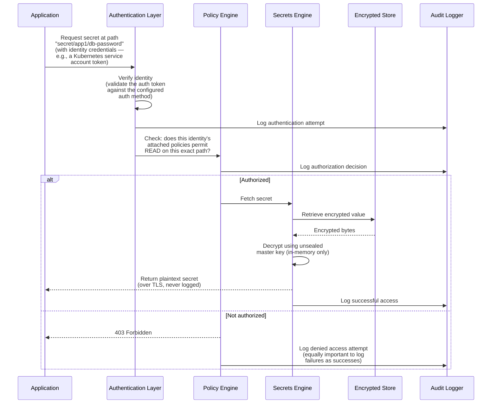
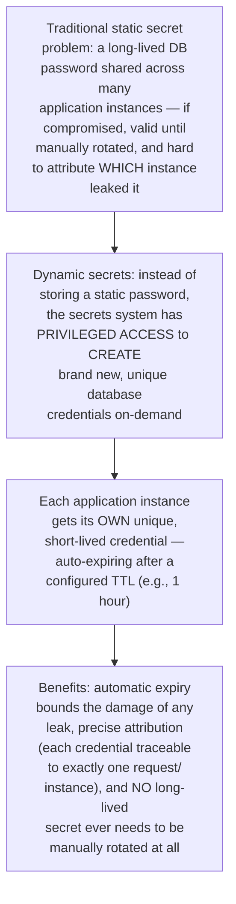
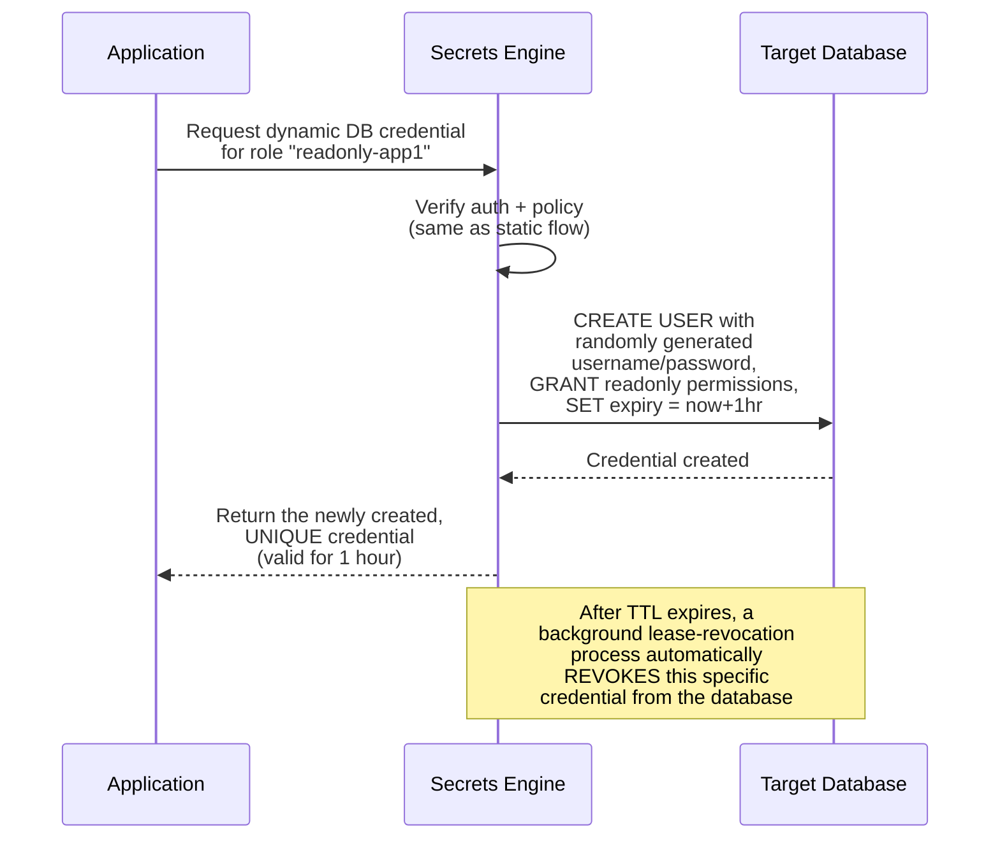
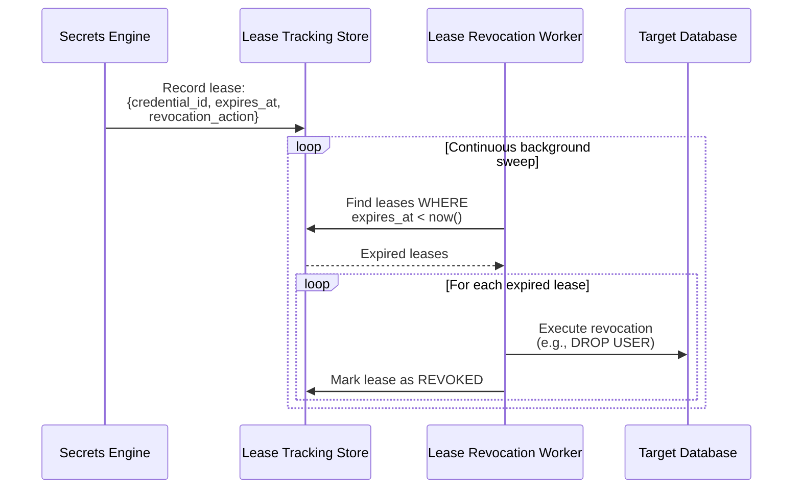
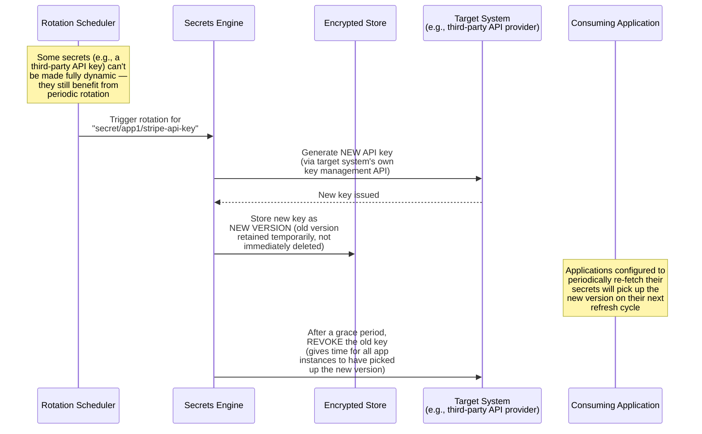
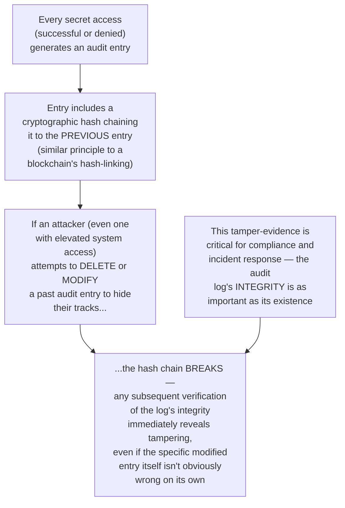
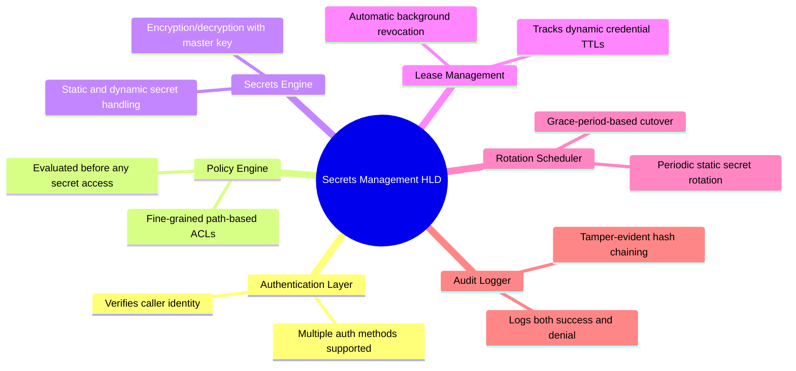

# Design a Secrets Management System (Vault-style) — High-Level Design Document

## 1. Requirements

### Functional Requirements
- Securely store secrets (API keys, database credentials, certificates, encryption keys)
- Provide fine-grained access control — which applications/users can access which specific secrets
- Support automatic secret rotation without requiring application downtime
- Maintain a complete, tamper-evident audit log of every secret access
- Support dynamic/short-lived credentials (generated on-demand, auto-expiring) in addition to static secrets

### Non-Functional Requirements
- **Confidentiality (paramount):** Secrets must never be exposed in plaintext anywhere they shouldn't be — not in logs, not in transit unencrypted, not to unauthorized callers
- **Availability:** Since applications depend on this system to even START UP (fetching their DB credentials, etc.), an outage here can cascade into a broad platform outage
- **Least privilege:** Every access grant should be as narrowly scoped as possible, both in what secrets and for how long
- **Auditability:** Every single access must be attributable and logged — this is often a compliance/regulatory requirement, not just a nice-to-have

### Back-of-Envelope Estimation
| Metric | Value |
|---|---|
| Total secrets stored | Tens of thousands to millions (across many applications/environments) |
| Secret access requests/sec | Thousands (mostly at application startup, some steady-state) |
| Rotation frequency | Varies — hours (dynamic DB creds) to months (long-lived API keys) |
| Audit log retention | Often years, for compliance |

---

## 2. The Core Security Model — Encryption, Sealing, and the Root of Trust

**Why this "unsealing" mechanism is foundational:** Every secrets management system faces the same bootstrapping paradox — you need a key to decrypt your secrets, but that key is itself the most sensitive secret of all. Shamir's Secret Sharing solves this by ensuring no single compromised person or system component can unilaterally decrypt the vault — a meaningful threshold of independent trust holders must cooperate, which is a deliberate, significant operational friction chosen specifically for its security value.

---

## 3. High-Level Architecture

**Key idea:** Every single request — successful or denied — passes through authentication, then policy evaluation, before ever touching the secrets engine, with the audit logger capturing the full trail at each stage. This layered gate structure ensures that "who is asking" and "are they allowed" are always resolved BEFORE any secret material is ever retrieved or generated.

---

## 4. Data Model

---

## 5. Static Secret Retrieval Flow — Detailed Sequence

---

## 6. Dynamic Secrets — Short-Lived, On-Demand Credentials

---

## 7. Lease Management & Automatic Revocation

**Why automatic lease revocation is essential, not optional:** Dynamic secrets are only as valuable as their expiry enforcement — a credential that's supposed to expire but doesn't (due to a missed revocation) provides false confidence while remaining an active liability. This mirrors the same reservation-expiry pattern from the E-commerce Checkout design, applied to security-critical credentials rather than inventory holds — the consequence of a missed expiry here is considerably higher stakes.

---

## 8. Secret Rotation (For Static Secrets That Must Remain Static)

**Why the grace period before revoking the old version matters:** Rotating a static secret isn't instantaneous across a distributed fleet of application instances — some may still be using the previous version briefly after rotation. Immediately revoking the old key the moment a new one is issued risks breaking still-transitioning application instances; a grace period accepts a brief window of both keys being simultaneously valid in exchange for zero-downtime rotation.

---

## 9. Tamper-Evident Audit Logging

---

## 10. Component Responsibilities Summary

---

## 11. Key Design Decisions & Tradeoffs

| Decision | Choice | Why |
|---|---|---|
| Master key protection | Shamir's Secret Sharing (threshold unsealing) | Ensures no single compromised person/component can unilaterally decrypt the entire vault — distributes trust deliberately |
| Secret types supported | Both static (encrypted storage) and dynamic (on-demand generation) | Dynamic secrets eliminate long-lived credential risk entirely where possible; static secrets remain necessary for systems that can't support on-demand credential creation |
| Dynamic secret lifecycle | Auto-expiring leases with background revocation | Bounds the damage of any credential leak automatically, without requiring manual intervention |
| Static secret rotation | Grace-period-based, dual-valid-version cutover | Enables zero-downtime rotation across a distributed application fleet that can't be updated instantaneously and simultaneously |
| Audit logging | Tamper-evident hash-chained entries | Makes unauthorized log modification detectable, which is essential for meeting compliance and incident-response requirements |
| Access control | Fine-grained, path-based policies evaluated before every access | Enforces least-privilege as a structural property of every request, not an assumed convention |

---

## 12. Bottlenecks & Scaling Considerations

- **Availability is existentially critical** — because applications often depend on this system just to START (fetching their initial DB credentials, API keys), an outage here can cascade into failures across the ENTIRE platform simultaneously; this justifies significant investment in high availability (multi-node clustering, cross-region replication) beyond what a typical internal tool would warrant.
- **The unsealing process itself is a deliberate availability tradeoff** — after any full restart, the vault requires a threshold of key-holders to manually provide their shares before it can serve ANY requests; this is intentional friction for security, but means a full cluster restart isn't as simple as a typical stateless service restart, and needs clear operational runbooks.
- **Dynamic secret backend load** — if dynamic secrets are used extensively (e.g., a new short-lived DB credential per request, not per instance), the load placed on the TARGET system (creating/dropping users constantly) can itself become a bottleneck — needs careful TTL tuning to balance security benefit against target-system overhead.
- **Policy evaluation performance at scale** — with potentially complex, many-layered policies across thousands of identities and secret paths, policy evaluation must remain fast since it sits on the critical path of every single secret access — this often requires efficient policy indexing/caching strategies, not naive linear policy scanning.
- **Audit log storage growth** — given typically multi-year compliance retention requirements and high access-request volume, audit log storage grows substantially over time; needs the same tiered storage/retention strategy discussed in the Log Aggregation design, while preserving the tamper-evident chain's integrity across any archival process.
- **Client-side caching risk** — applications that cache retrieved secrets locally (to avoid re-fetching on every use) reintroduce some of the long-lived-credential risk that dynamic secrets are meant to solve; client libraries need clear guidance and enforced TTL-respecting behavior, not indefinite local caching.
- **Break-glass emergency access** — production incidents sometimes require emergency access that bypasses normal policy flows (e.g., a critical secret needed during an active outage, but the usual approver is unreachable); this requires a carefully designed, heavily audited "break-glass" procedure that's rare, logged extensively, and reviewed after every use — a deliberate exception path, not a backdoor.
