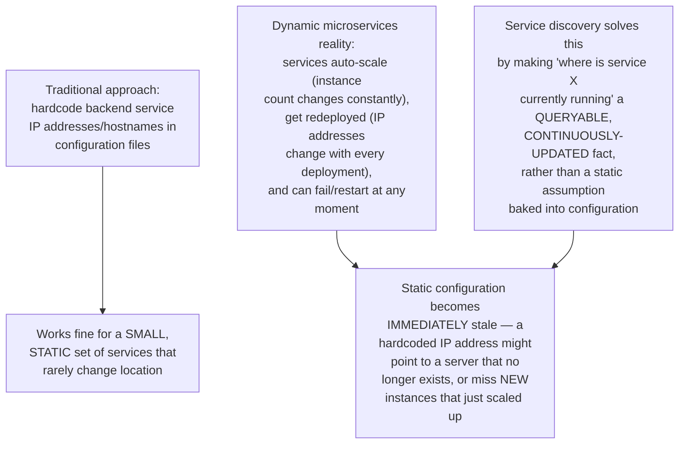
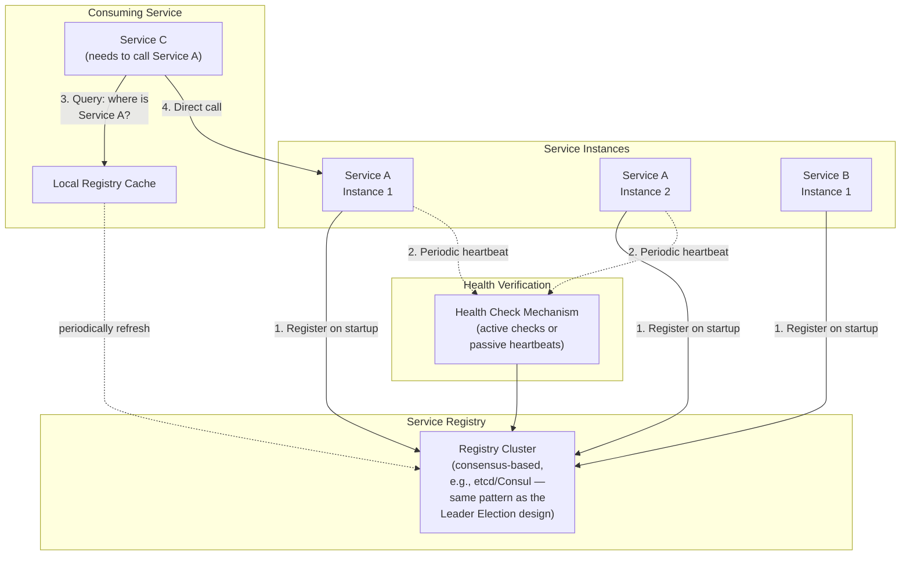
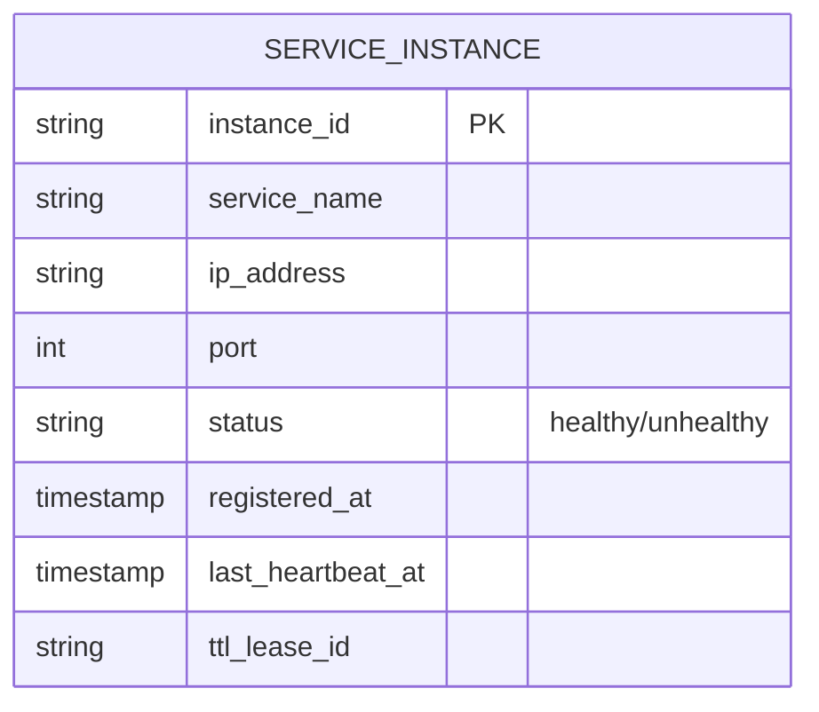
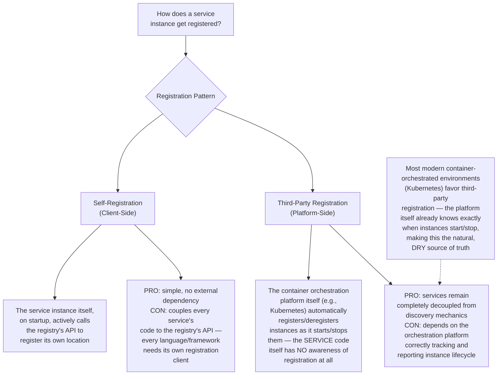
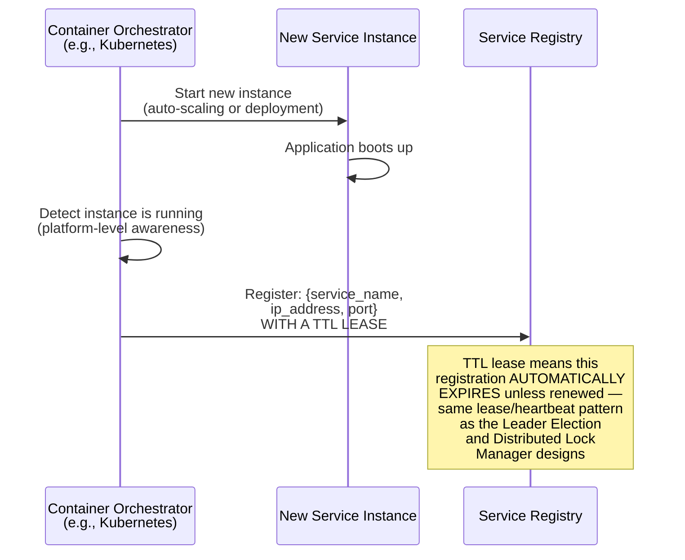
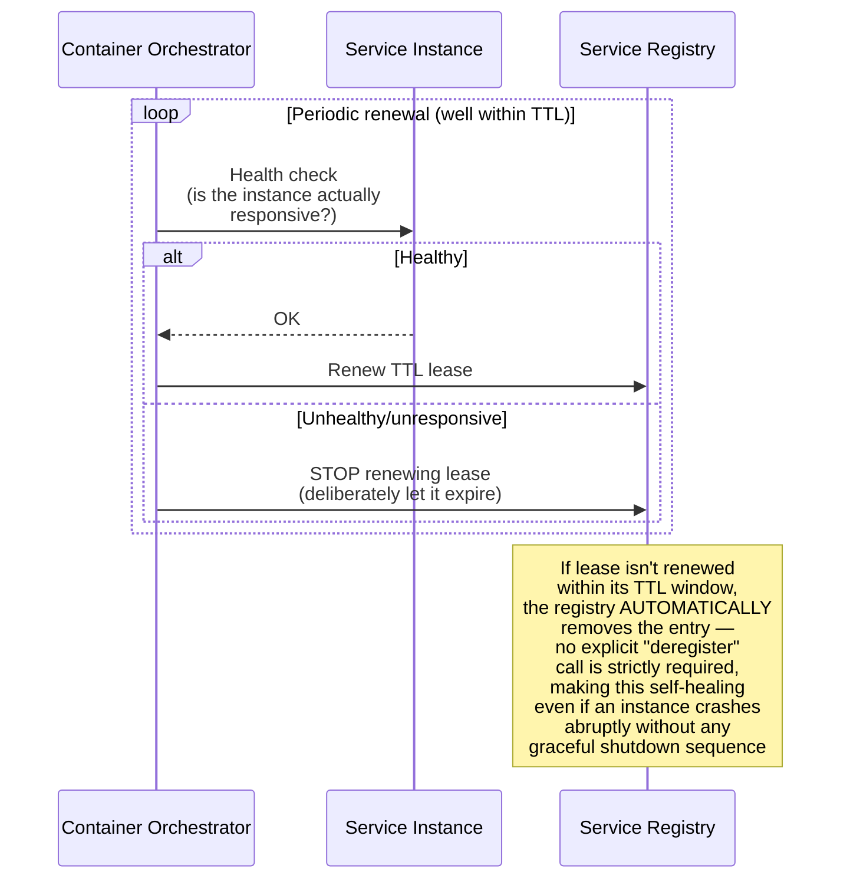
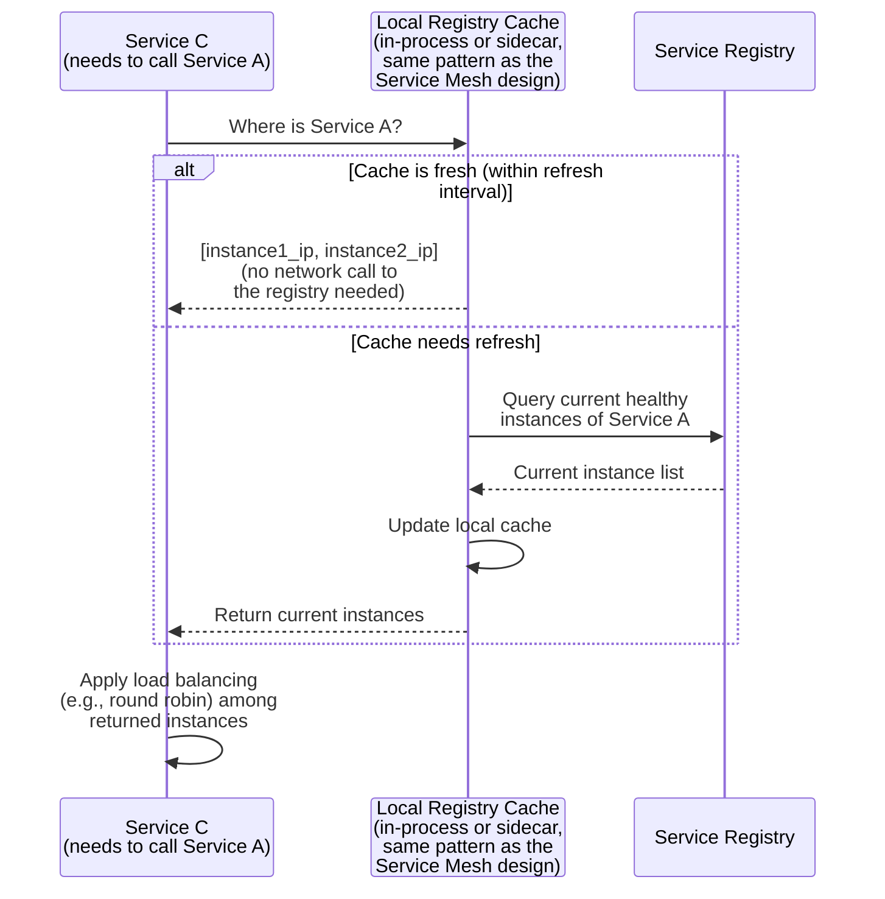
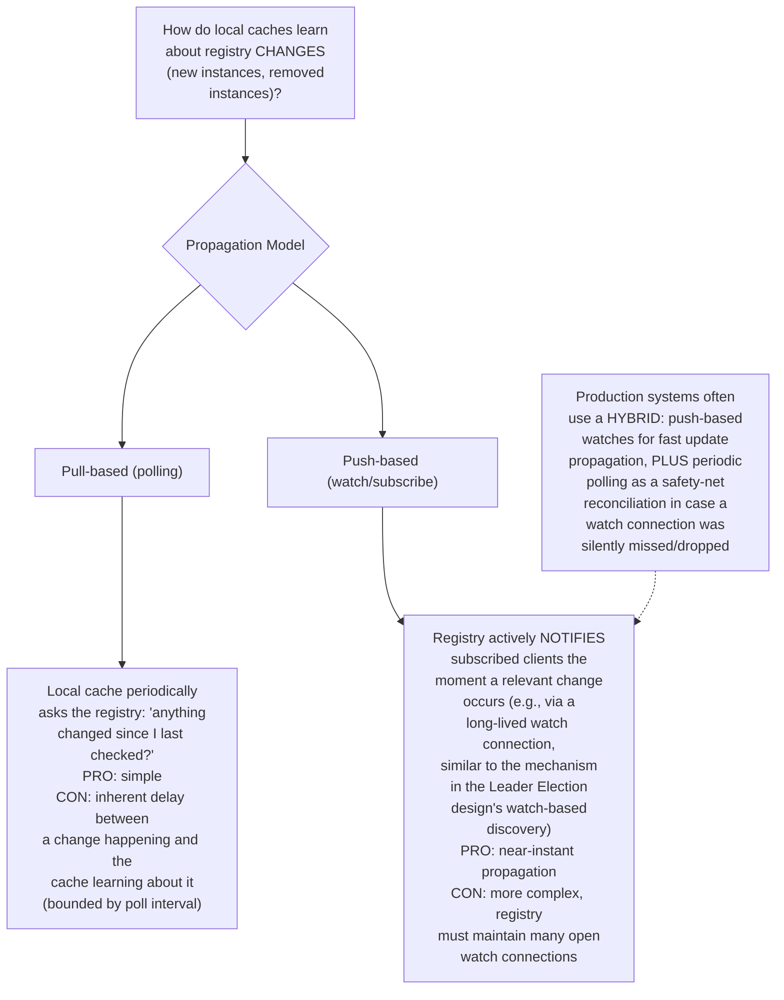
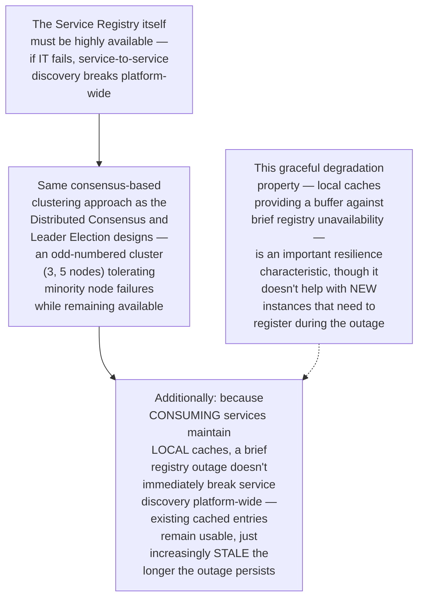
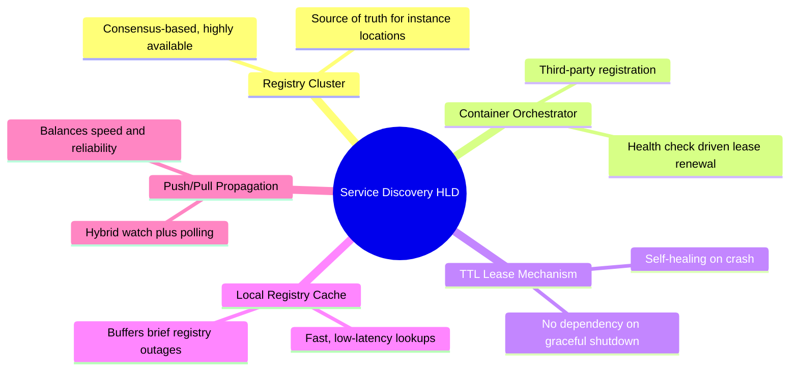

# Design a Service Discovery System for a Dynamic Microservices Environment — High-Level Design Document

## 1. Requirements

### Functional Requirements
- Allow services to register themselves (and their network location) when they start up
- Allow services to discover the current, healthy network locations of other services they need to call
- Automatically remove services from discoverability when they become unhealthy or shut down
- Support multiple instances of the same service (for load distribution)

### Non-Functional Requirements
- **Handle constant churn:** In a dynamic environment (auto-scaling, frequent deployments, container orchestration), service instances start and stop CONSTANTLY — this must be the normal case, not an edge case
- **Low-latency lookups:** Service discovery sits on the critical path before almost every inter-service call
- **Consistency vs availability tradeoff:** Must decide how quickly registry changes need to propagate vs how available the registry itself needs to be
- **Self-healing:** Stale entries (services that crashed without deregistering) must not persist indefinitely

### Back-of-Envelope Estimation
| Metric | Value |
|---|---|
| Service instances (platform-wide) | Thousands, constantly changing |
| Registration/deregistration events/sec | Hundreds during normal operation, spikes during mass deployments/scaling events |
| Discovery lookups/sec | Very high — essentially proportional to inter-service call volume |
| Registry update propagation target | Seconds |

---

## 2. The Core Problem — Why Static Configuration Doesn't Work Here

---

## 3. High-Level Architecture

**Key idea:** This shares substantial architectural DNA with the Service Mesh design's Service Registry component (indeed, in many real deployments, this IS the same underlying system) — the registry is a small, highly-consistent cluster tracking service locations, while consuming services maintain a locally-cached view for fast, low-latency lookups rather than querying the registry on every single call.

---

## 4. Data Model

---

## 5. Registration Flow (Two Approaches) — Detailed Sequence

---

## 6. Health Verification & Automatic Deregistration — Detailed Sequence

**Why TTL-based expiry (not explicit deregistration alone) is essential for correctness:** A gracefully shutting-down service can explicitly deregister itself, but a service that CRASHES (power loss, OOM kill, network partition) has no opportunity to send a clean "I'm going away" message — TTL-based lease expiry ensures the registry self-heals in EITHER case, treating "stopped renewing" as the reliable signal rather than depending on a graceful goodbye that might never come.

---

## 7. Service Discovery Lookup Flow — Detailed Sequence

**Why local caching matters despite the registry being the source of truth:** Querying the central registry on EVERY single inter-service call would make the registry an extreme high-traffic bottleneck and add unnecessary latency to every call; local caching (refreshed periodically or via push notifications from the registry) lets the vast majority of lookups resolve instantly from memory, with the registry only consulted when the cache genuinely needs updating.

---

## 8. Push-Based vs Pull-Based Update Propagation

---

## 9. Handling Registry Cluster Failure (Registry's Own Availability)

---

## 10. Component Responsibilities Summary

---

## 11. Key Design Decisions & Tradeoffs

| Decision | Choice | Why |
|---|---|---|
| Registration pattern | Third-party (platform-driven), not self-registration | Decouples service code entirely from discovery mechanics; leverages the orchestrator's already-authoritative knowledge of instance lifecycle |
| Deregistration mechanism | TTL lease expiry, not explicit-only | Self-heals correctly even when instances crash abruptly without a graceful shutdown opportunity |
| Lookup architecture | Local caching with periodic/push refresh | Prevents the registry from becoming an extreme bottleneck under high inter-service call volume |
| Update propagation | Hybrid push (watch) + pull (polling safety net) | Combines near-instant propagation with resilience against silently dropped watch connections |
| Registry availability | Consensus-based clustering (same as Leader Election design) | Only mechanism providing both correctness and fault tolerance for this critical shared dependency |

---

## 12. Bottlenecks & Scaling Considerations

- **Registration/deregistration churn during mass events** — a large-scale deployment or auto-scaling event can generate a burst of near-simultaneous registration changes; the registry cluster must handle this write burst without degrading lookup performance for unrelated, concurrent discovery queries.
- **Cache staleness during rapid scaling** — if instances scale up rapidly (e.g., responding to a traffic spike) but consuming services' local caches haven't yet refreshed, newly-added capacity isn't immediately utilized — the propagation delay directly impacts how quickly a scale-up event translates into actual traffic distribution improvement.
- **TTL tuning tradeoff** — shorter TTLs mean FASTER detection of crashed instances but require MORE frequent heartbeat/renewal traffic; longer TTLs reduce this overhead but mean a crashed instance remains "discoverable" (and potentially receiving misdirected traffic) for longer — same fundamental tuning tradeoff as the Distributed Lock Manager design's lease TTL.
- **Split registry views during network partition** — if the registry cluster itself experiences an internal partition, the same split-brain risks and quorum-based mitigation covered in the Network Partition Detection design apply directly here — a minority-partition registry node must not serve authoritative (potentially stale/incorrect) discovery answers.
- **Cross-region/cross-cluster service discovery** — for platforms spanning multiple regions or Kubernetes clusters, extending discovery across these boundaries requires either a federated registry architecture or careful cross-cluster synchronization, adding meaningful complexity beyond a single-cluster registry design.
- **Discovery for external/third-party dependencies** — this design covers INTERNAL service-to-service discovery; calls to external third-party APIs typically use traditional DNS rather than this dynamic registry mechanism, meaning a complete platform architecture needs both discovery patterns coexisting for different categories of dependencies.
- **Bootstrapping problem** — a brand-new service instance needs to know HOW to reach the registry itself before it can discover anything else; this initial "how do I find the registry" bootstrapping typically relies on more traditional, relatively static configuration (e.g., a well-known registry endpoint), representing the one piece of the system that intentionally ISN'T dynamically discovered.
