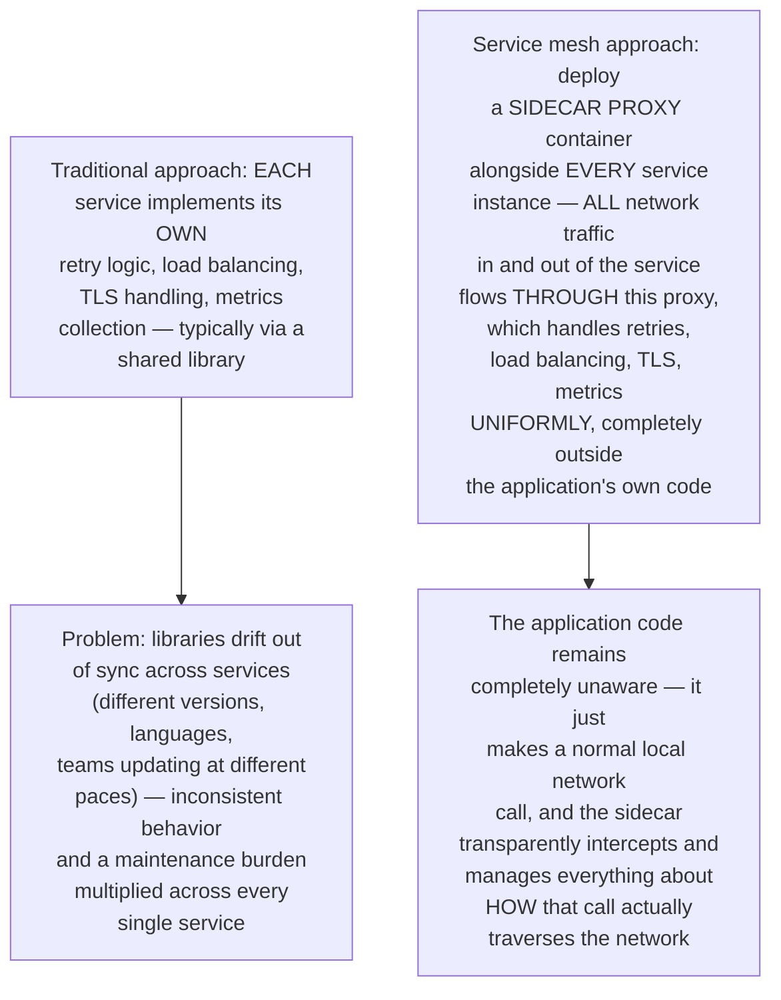
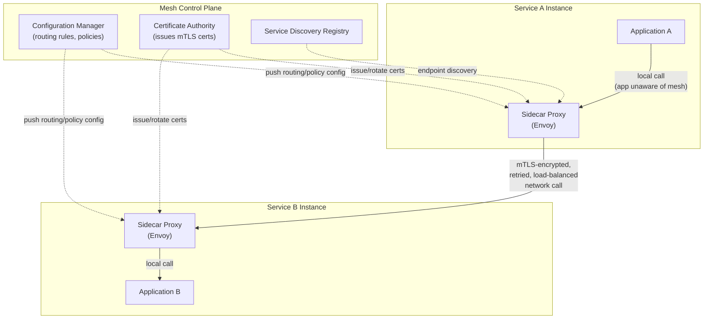
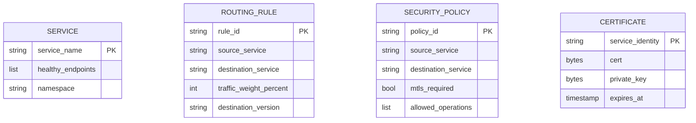
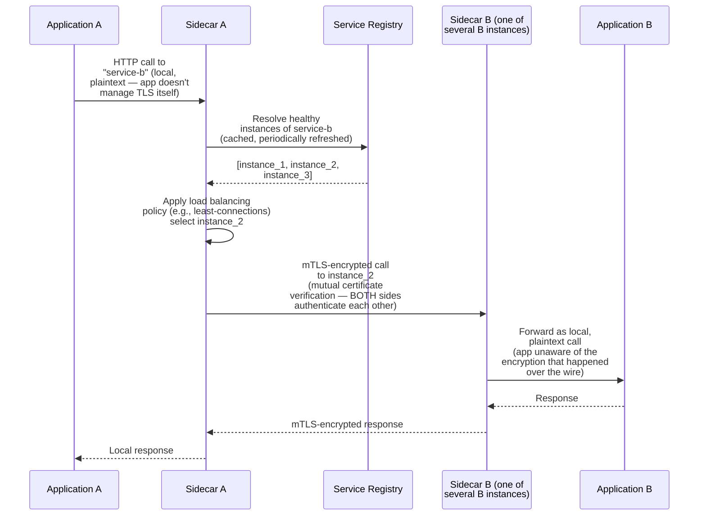
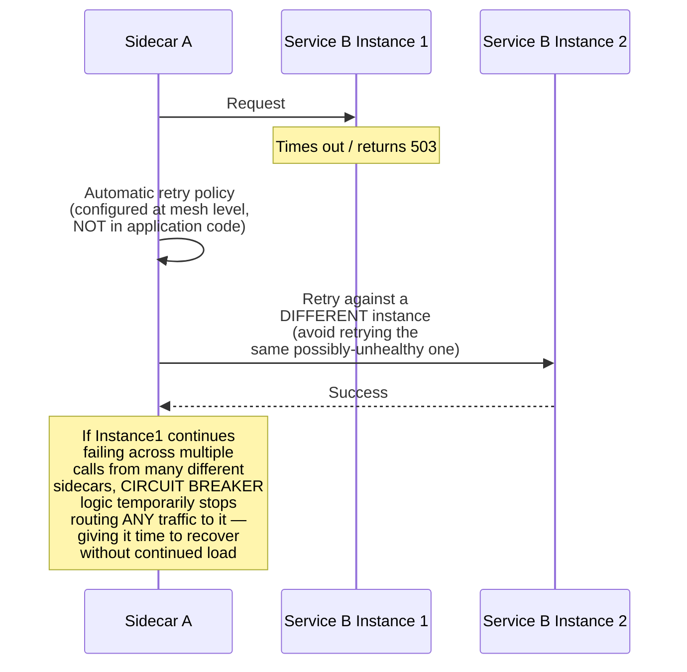
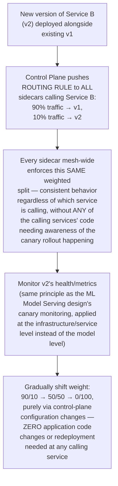
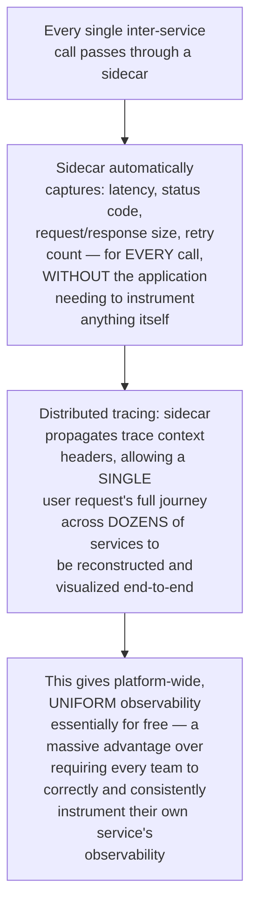
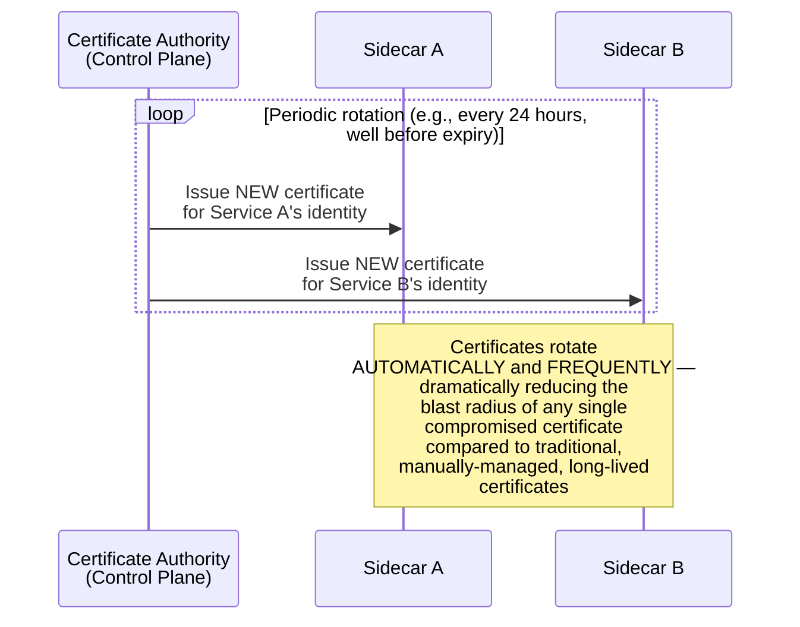
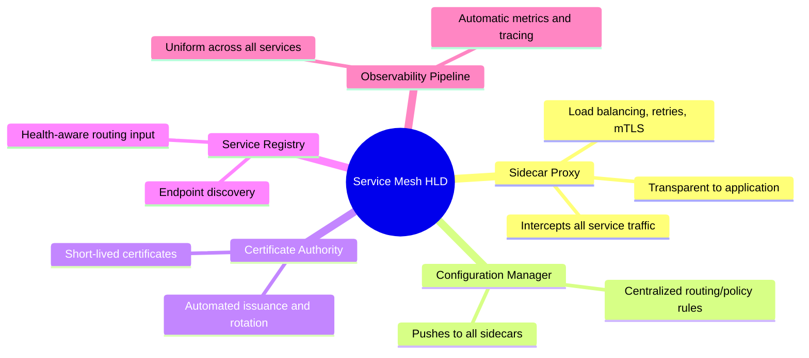

# Design a Service Mesh — High-Level Design Document

## 1. Requirements

### Functional Requirements
- Provide service-to-service communication capabilities (routing, load balancing, retries) WITHOUT requiring each application to implement this logic itself
- Enforce mutual TLS (mTLS) encryption between all services automatically
- Support traffic shaping: canary releases, traffic mirroring, fault injection for testing
- Provide observability: automatic metrics, distributed tracing, and logging for all inter-service calls

### Non-Functional Requirements
- **Transparency to application code:** Services shouldn't need to know the mesh exists — no application-level SDK integration required for baseline functionality
- **Low latency overhead:** Every single service-to-service call now passes through the mesh — this overhead must be minimal
- **Consistent policy enforcement:** Security and traffic policies must be uniformly applied across potentially hundreds of independently-developed services
- **Operational manageability:** Must be centrally configurable without requiring per-service redeployment for policy changes

### Back-of-Envelope Estimation
| Metric | Value |
|---|---|
| Services in mesh | Hundreds to low thousands |
| Inter-service calls/sec (platform-wide) | Millions |
| Added latency per hop (sidecar overhead) | Target: low single-digit milliseconds |
| mTLS handshake overhead | Amortized via connection reuse/pooling |

---

## 2. The Core Architectural Pattern — The Sidecar Proxy

---

## 3. High-Level Architecture

**Key idea:** The sidecar proxies collectively form the "data plane" (where actual traffic flows), while a separate, centralized "control plane" manages configuration, security policy, and certificates — pushing this configuration DOWN to every sidecar. Applications only ever talk to their own local sidecar; the sidecar handles everything about how that call actually reaches its destination.

---

## 4. Data Model (Control Plane Configuration)

---

## 5. Service-to-Service Call Flow — Detailed Sequence

**Why mTLS at the sidecar level, not the application level:** Requiring every application team to correctly implement mutual TLS themselves is both a significant burden and a consistency risk (implementations WILL vary in correctness/rigor). By handling this entirely within the sidecar — using automatically-issued, automatically-rotated certificates from the control plane — encryption between services becomes a MESH-WIDE GUARANTEE rather than a per-team best-effort implementation detail.

---

## 6. Automatic Retries & Circuit Breaking

**Why this belongs in the mesh, not application code:** Every single service in the mesh benefits from consistent, well-tuned retry and circuit-breaking behavior without each team needing to correctly implement this resilience pattern themselves — a notoriously easy thing to get subtly wrong (e.g., retrying non-idempotent operations, or retry storms without backoff) if left to inconsistent per-team implementation.

---

## 7. Traffic Shaping — Canary Release via the Mesh

---

## 8. Automatic Observability (Metrics, Tracing, Logging)

---

## 9. Certificate Rotation (Automated Security Maintenance)

**Why automated short-lived certificates are a major security improvement:** Traditional manually-managed TLS certificates are often long-lived (months to years) simply because manual rotation is operationally painful — meaning a compromised certificate remains dangerous for a long time. Automating rotation via the mesh's control plane makes SHORT-lived certificates (hours to days) operationally trivial, dramatically shrinking the window of risk from any single certificate compromise.

---

## 10. Component Responsibilities Summary

---

## 11. Key Design Decisions & Tradeoffs

| Decision | Choice | Why |
|---|---|---|
| Core pattern | Sidecar proxy per service instance | Provides consistent, uniform networking/security/observability behavior across all services without requiring per-team library integration and maintenance |
| Encryption | Automatic mTLS handled entirely by sidecars | Makes encryption a mesh-wide GUARANTEE rather than a per-team implementation detail subject to inconsistency |
| Configuration | Centralized control plane, pushed to distributed data plane | Enables platform-wide policy changes (canary rollouts, retry tuning) without requiring any application redeployment |
| Resilience patterns | Retries and circuit breaking at the mesh level | Notoriously easy to implement subtly incorrectly at the application level; centralizing ensures consistent, well-tuned behavior everywhere |
| Certificate management | Automated, short-lived, frequently rotated | Dramatically reduces the security blast radius compared to traditional manually-managed long-lived certificates |
| Observability | Automatic, sidecar-level instrumentation | Provides uniform platform-wide visibility without depending on every team correctly instrumenting their own service |

---

## 12. Bottlenecks & Scaling Considerations

- **Sidecar latency overhead compounds across call chains** — a single user request that fans out across many internal service hops (common in microservices architectures) accumulates the sidecar's per-hop latency overhead multiple times; while individually small, this can become meaningful for deeply-chained call graphs, requiring careful architecture-level awareness of call depth, not just per-hop optimization.
- **Control plane as a critical, mesh-wide dependency** — while the DATA plane (sidecars actually routing traffic) can continue operating on cached configuration even if the control plane is briefly unavailable, the control plane's health directly determines how quickly policy changes, certificate rotations, and service discovery updates propagate mesh-wide; needs high availability commensurate with its central role.
- **Resource overhead per service instance** — running a sidecar proxy alongside EVERY service instance means every single pod/container now has additional CPU/memory overhead purely for the mesh infrastructure — at very large scale (thousands of instances), this aggregate resource cost is a genuine, non-trivial consideration in capacity planning.
- **Operational complexity and learning curve** — a service mesh introduces a significant new operational layer that teams must understand to debug effectively (e.g., "is this latency from my application code, or from the sidecar's retry logic?") — this requires investment in team education and mesh-aware debugging tooling, not just the infrastructure itself.
- **Multi-cluster/multi-region mesh federation** — extending mesh capabilities (unified service discovery, cross-cluster mTLS) across MULTIPLE Kubernetes clusters or regions adds substantial additional complexity beyond a single-cluster mesh deployment, often requiring dedicated cross-cluster gateway components not covered in this simplified single-cluster design.
- **Gradual adoption path** — for organizations with many existing services, migrating everything to run with sidecars simultaneously is often impractical; the mesh design needs to gracefully support a MIXED environment (some services meshed, some not) during a gradual migration period, rather than requiring an all-or-nothing cutover.
