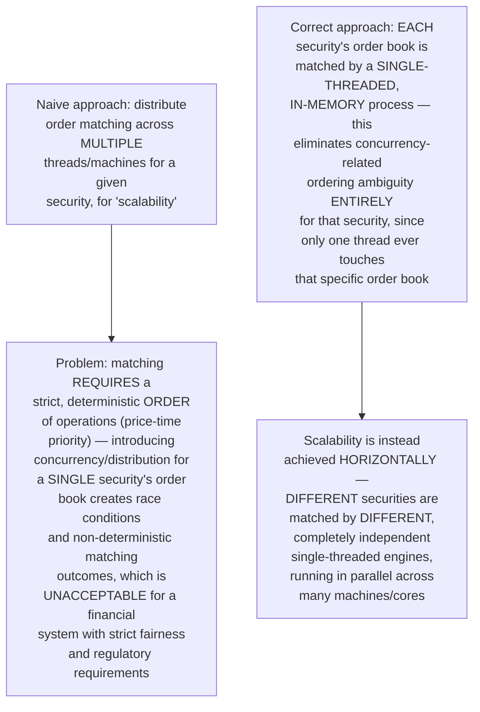
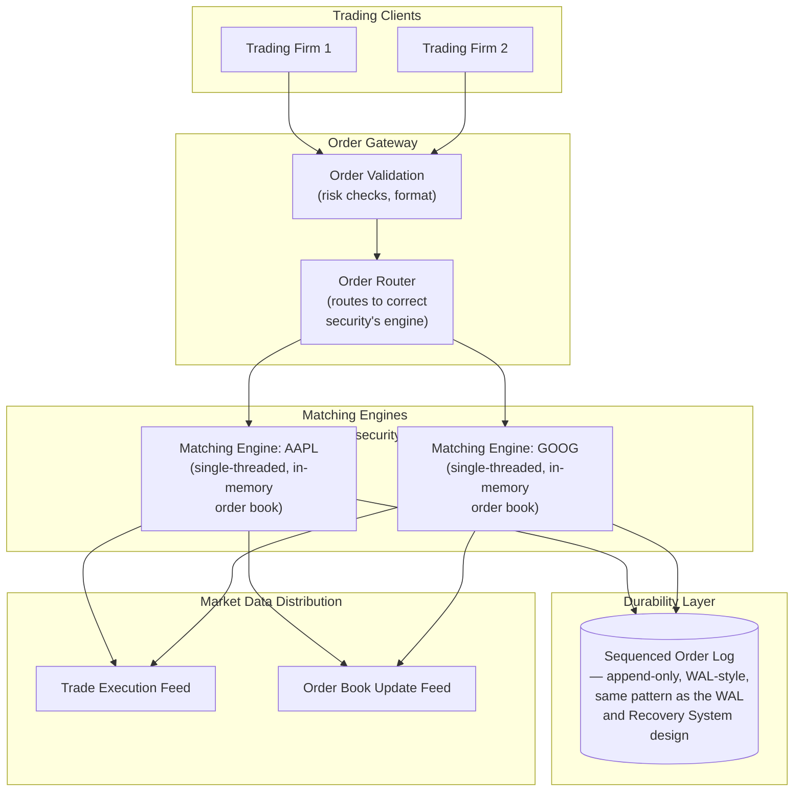
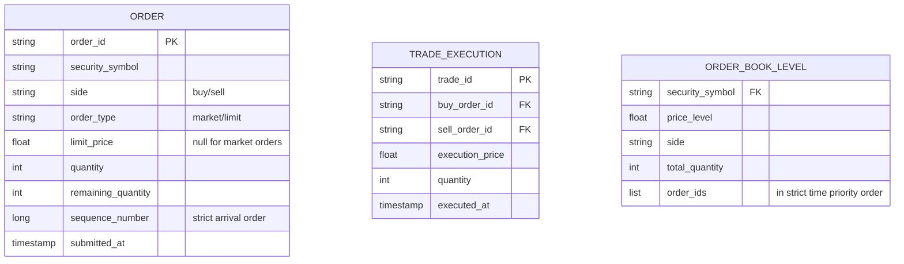
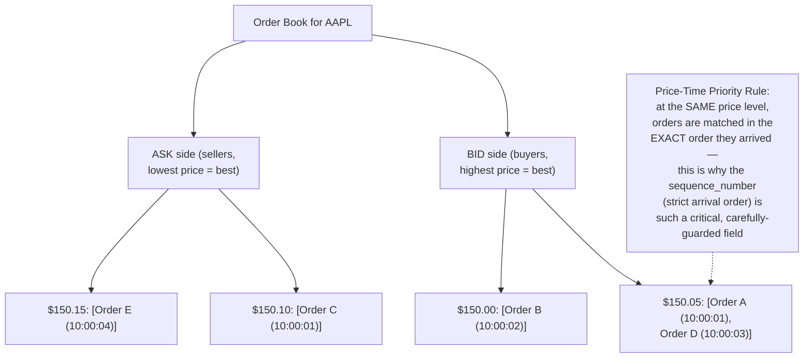
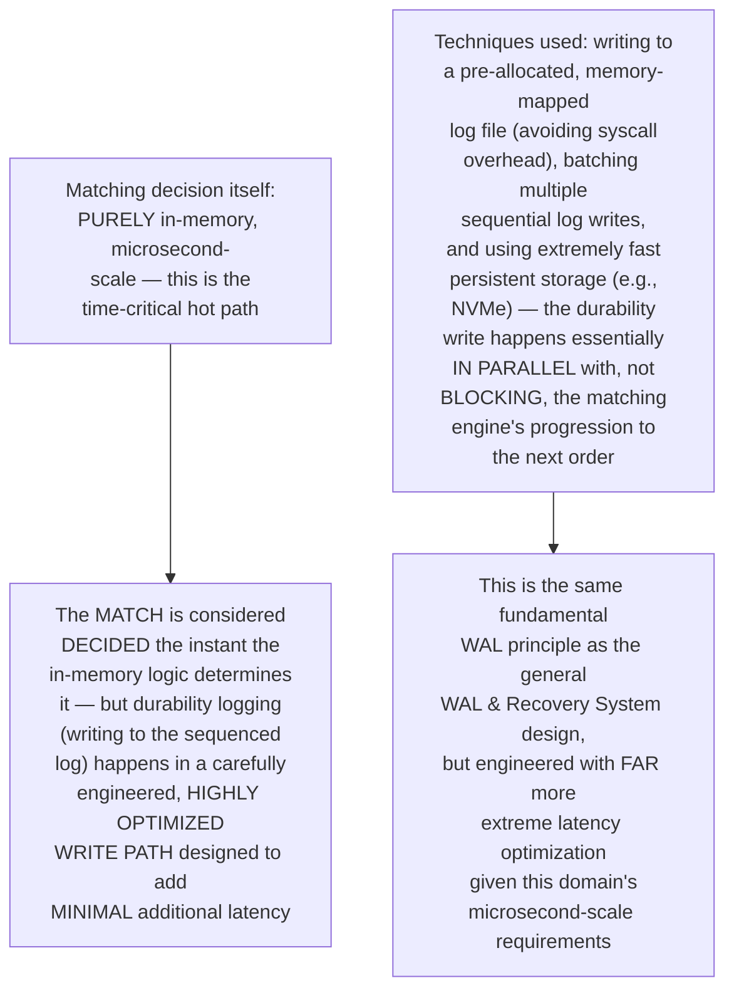
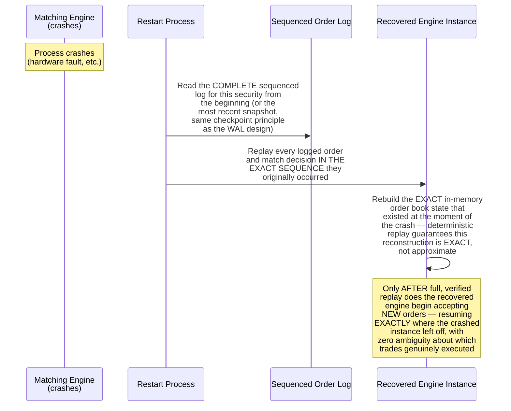
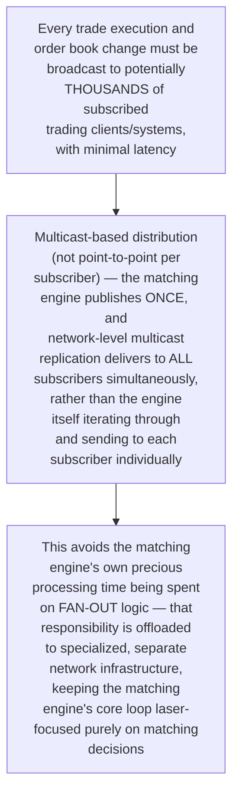

# Design a Stock Trading Matching Engine — High-Level Design Document

## 1. Requirements

### Functional Requirements
- Accept buy/sell orders for a given security and match compatible orders together to execute trades
- Maintain an order book (all currently outstanding, unmatched orders) per security
- Support multiple order types: market orders (execute immediately at best price), limit orders (execute only at a specified price or better)
- Enforce price-time priority: at the same price, earlier orders execute before later ones

### Non-Functional Requirements
- **Ultra-low latency (the defining requirement):** Matching decisions often need to happen in microseconds, not milliseconds — this shapes literally every architectural decision
- **Strict ordering/fairness:** The exact sequence in which orders are matched has direct financial consequences and regulatory scrutiny — determinism is non-negotiable
- **Extreme throughput during volatility:** Order volume can spike enormously during market volatility, precisely when correctness matters most
- **Zero tolerance for lost or duplicated trades:** A financial matching error has direct, immediate monetary and legal consequences

### Back-of-Envelope Estimation
| Metric | Value |
|---|---|
| Orders/sec (per security, peak) | Tens of thousands during high volatility |
| Matching latency target | Single-digit to low double-digit MICROSECONDS |
| Order book depth | Thousands of outstanding orders per active security |
| Securities traded | Thousands, each needing independent, isolated matching |

---

## 2. The Core Architectural Principle — Single-Threaded, In-Memory Matching Per Security



**Why this single-threaded-per-security design is the industry-standard approach:** This is precisely how real production exchanges achieve both ultra-low latency AND strict correctness simultaneously — rather than trying to parallelize matching WITHIN one security's order book (which would require complex, latency-adding locking/coordination), the system parallelizes ACROSS securities, where each security's matching is embarrassingly independent of every other security's.

---

## 3. High-Level Architecture



**Key idea:** Every order, before reaching a matching engine, passes through validation and routing — but once inside a specific security's matching engine, it's processed by a SINGLE thread operating purely on IN-MEMORY data structures, with durability achieved via writing to a sequenced, append-only log (the same WAL principle from the dedicated WAL & Recovery System design) rather than synchronous database writes that would introduce unacceptable latency.

---

## 4. Data Model



---

## 5. Order Book Structure — Price-Time Priority



**Why this data structure is typically implemented as a price-indexed sorted structure (not a simple list):** The matching engine needs to instantly find "the best available price" on each side — a structure like a sorted tree or price-level array indexed by price, with a time-ordered list AT each price level, gives O(log n) or better access to the best price while still preserving strict time-priority within that price level.

---

## 6. Order Matching Flow — Detailed Sequence

```mermaid
sequenceDiagram
    participant Router as Order Router
    participant Engine as Matching Engine (AAPL)
    participant OrderBook as In-Memory Order Book
    participant Log as Sequenced Log

    Router->>Engine: New order: BUY 100 shares<br/>AAPL @ $150.10 (limit)

    Engine->>Engine: Assign strict sequence<br/>number (monotonic, this<br/>engine's own counter)

    Engine->>OrderBook: Check ASK side for<br/>matching sell orders<br/>at price <= $150.10

    OrderBook-->>Engine: Best ask: $150.10,<br/>Order C, 50 shares available<br/>(earliest at this price)

    Engine->>Engine: MATCH: 50 shares @ $150.10<br/>between incoming buy order<br/>and Order C

    Engine->>Log: Append TRADE_EXECUTION event<br/>(durability BEFORE<br/>considering the match final —<br/>same WAL principle)

    Engine->>OrderBook: Update: Order C fully<br/>filled, remove from book;<br/>incoming order has<br/>50 shares remaining

    Engine->>OrderBook: Continue matching remaining<br/>50 shares against NEXT<br/>best ask level, or if<br/>none available at<br/>acceptable price, REST<br/>the remainder in the<br/>book as a new resting<br/>limit order

    Engine-->>Router: Trade confirmations
```

---

## 7. Why Durability Logging Must Not Add Latency to the Matching Decision



---

## 8. Handling Matching Engine Failure & Recovery



**Why deterministic replay is essential here specifically (beyond general WAL recovery):** Because matching decisions have direct financial and regulatory consequences, recovery cannot produce even a SLIGHTLY different outcome than what would have naturally occurred — the sequenced log combined with fully deterministic matching logic (same inputs in the same order ALWAYS produce the same matches) is what guarantees recovery reconstructs the EXACT correct state, not just a reasonable approximation.

---

## 9. Market Data Distribution (Low-Latency Fan-Out)



---

## 10. Component Responsibilities Summary

```mermaid
mindmap
  root((Trading Matching Engine HLD))
    Order Gateway
      Validation and risk checks
      Routes to correct security engine
    Matching Engine
      Single-threaded per security
      Pure in-memory order book
      Price-time priority enforcement
    Sequenced Log
      WAL-style durability
      Deterministic replay source
    Order Book Structure
      Price-indexed, time-ordered
      O(log n) best-price access
    Market Data Distribution
      Multicast fan-out
      Offloaded from matching hot path
```

---

## 11. Key Design Decisions & Tradeoffs

| Decision | Choice | Why |
|---|---|---|
| Concurrency model | Single-threaded per security, parallel across securities | Eliminates race conditions and non-deterministic matching WITHIN a security entirely, while still achieving overall system scalability horizontally |
| Processing location | Purely in-memory | Database-speed persistence is far too slow for microsecond-scale matching decisions — durability is achieved via optimized logging, not synchronous DB writes |
| Durability mechanism | Highly optimized sequenced append-only log | Same WAL principle as general database recovery, engineered specifically for extreme low-latency requirements unique to this domain |
| Recovery approach | Deterministic full replay from sequenced log | Guarantees EXACT, not approximate, state reconstruction — essential given the direct financial/regulatory consequences of matching decisions |
| Market data distribution | Multicast, offloaded from the matching hot path | Keeps the matching engine's core loop focused purely on matching, not burdened with fan-out responsibilities |

---

## 12. Bottlenecks & Scaling Considerations

- **Single-security throughput ceiling** — because a security's matching is deliberately single-threaded, its maximum throughput is bounded by that ONE thread's processing speed; for extremely high-volume securities during extreme volatility, this ceiling is a genuine, accepted architectural constraint (not a bug), requiring careful engine implementation optimization rather than adding concurrency, which would compromise correctness.
- **Hardware and network optimization as a first-class concern** — at microsecond-scale latency requirements, factors invisible to typical system design (CPU cache locality, network interface card configuration, even physical proximity of servers to reduce cable-length propagation delay) become genuine, significant engineering considerations — this domain pushes optimization down to a level most other systems in this document series never need to consider.
- **Order gateway validation latency** — while the matching engine itself is optimized to the extreme, the PRE-matching validation/risk-check step (Order Gateway) must also be carefully latency-optimized, since it sits directly in the critical path before an order even reaches the matching engine.
- **Handling extreme volatility spikes** — order volume can spike dramatically during major market events, precisely when matching correctness and speed matter most; the system must be provisioned with substantial headroom above typical average load specifically for these predictable-in-nature-if-not-in-timing volatility events.
- **Regulatory audit requirements** — beyond basic durability, financial matching engines typically face STRICT regulatory requirements for complete, immutable audit trails of every order and match decision — this connects directly to the same tamper-evident logging principles covered in the Tamper-Evident Audit Log design, applied to trading activity specifically.
- **Cross-security dependencies (rare but real)** — while this design assumes securities are matched independently, some real-world scenarios (e.g., circuit breakers halting trading across an entire market during extreme volatility) require SOME cross-security coordination — this is typically handled as a separate, higher-level control layer rather than compromising the core per-security matching engine's independence.
- **Testing determinism rigorously** — given the zero-tolerance requirement for matching correctness, testing must verify BOTH that the matching logic is genuinely deterministic (same input sequence always produces the same output) AND that recovery-via-replay genuinely reconstructs identical state — this requires the same rigorous fault-injection and property-based testing discipline emphasized throughout the more correctness-critical designs in this series (WAL Recovery, Exactly-Once Stream Processing).
