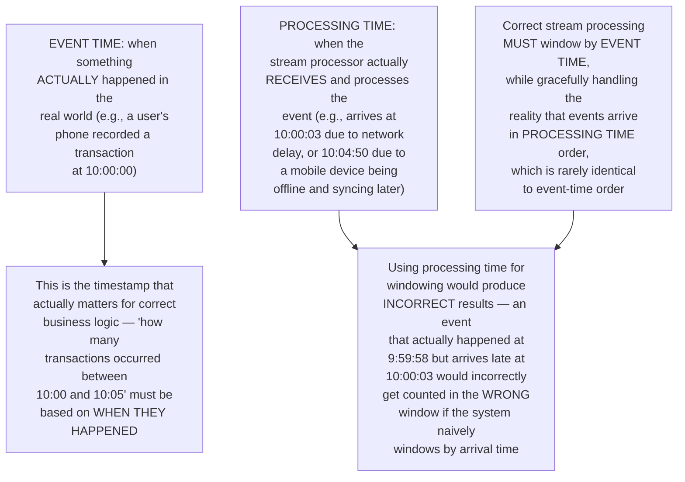
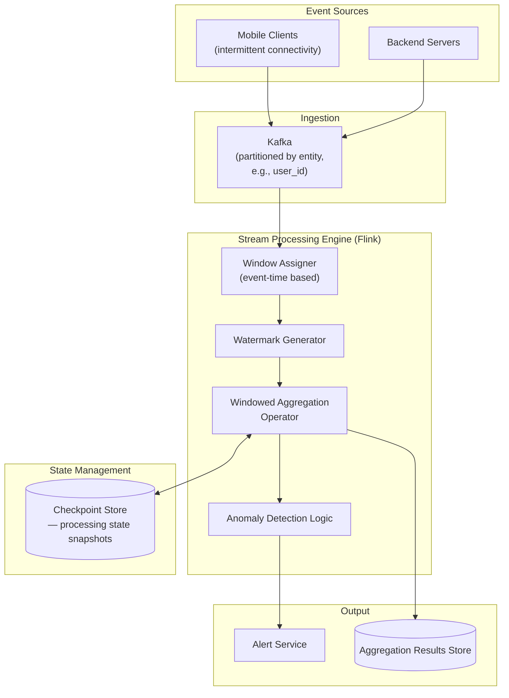
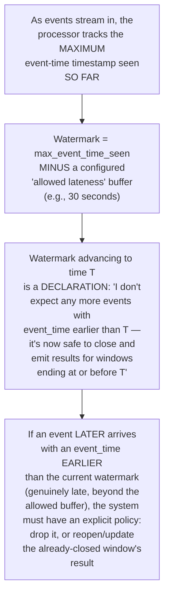
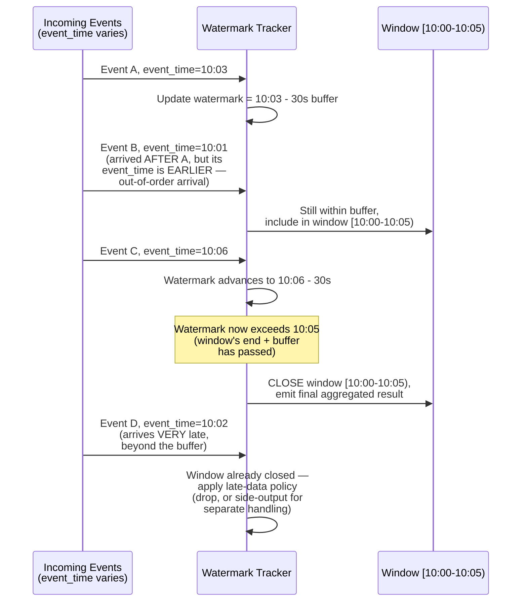
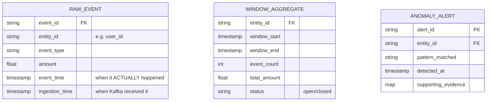
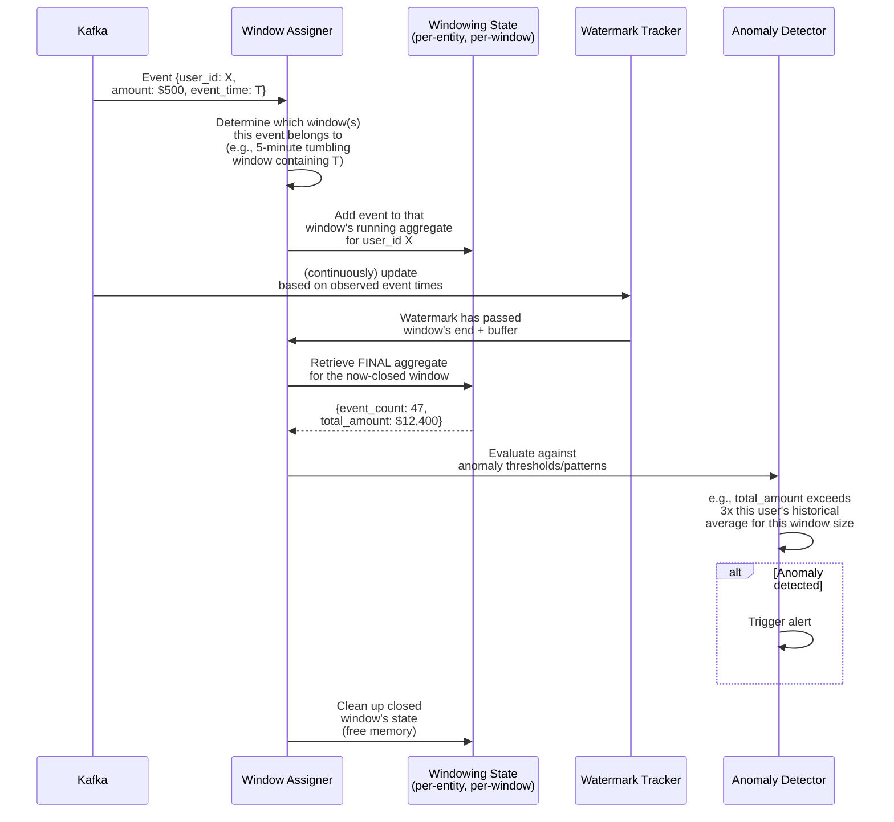
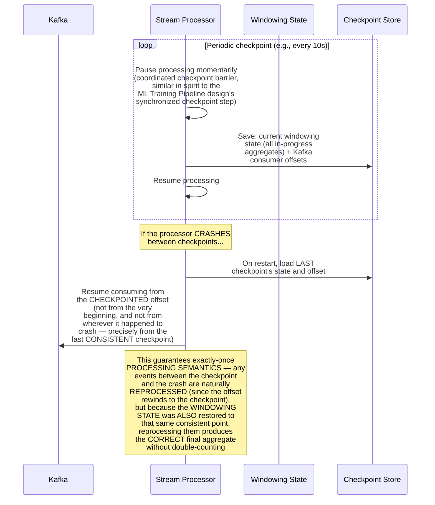
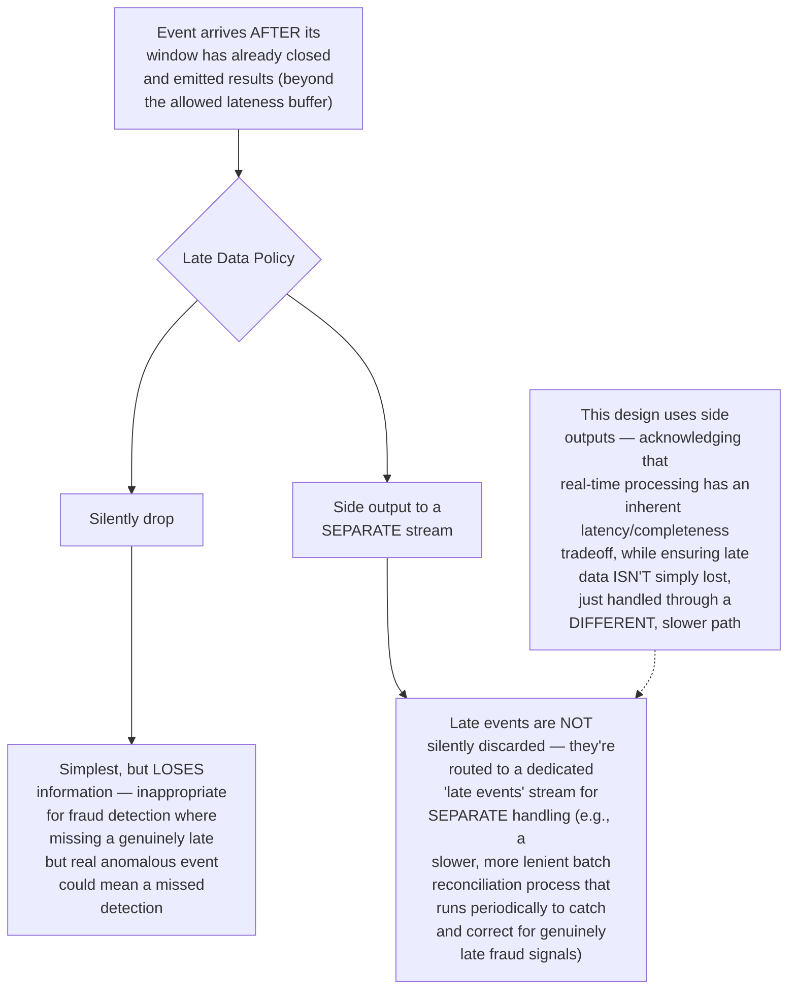
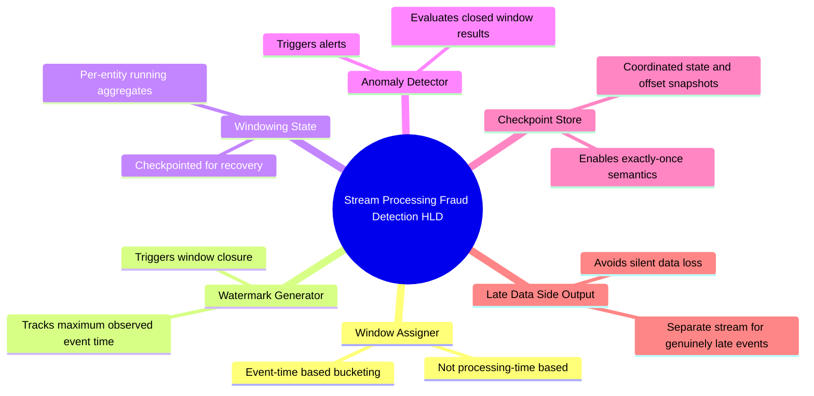

# Design a Real-Time Fraud/Anomaly Detection Pipeline Using Stream Processing — High-Level Design Document

## 1. Requirements

### Functional Requirements
- Continuously analyze a high-volume event stream (transactions, logins, activity) to detect anomalous patterns
- Support windowed aggregations (e.g., "transaction count in the last 5 minutes," "spending velocity over a rolling hour")
- Correctly handle events that arrive LATE or OUT OF ORDER relative to when they actually occurred
- Trigger alerts/actions when anomaly patterns are detected, with bounded, predictable latency

### Non-Functional Requirements
- **Correctness under time skew:** Real-world distributed event sources don't deliver events in perfect order — the system must produce correct results despite this
- **Bounded processing latency:** Windows must eventually "close" and produce results, even if some expected late data never arrives — waiting forever isn't acceptable
- **Exactly-once processing semantics (ideally):** Duplicate processing of the same event shouldn't double-count toward anomaly thresholds
- **High throughput:** Must sustain the platform's full event volume continuously, not in periodic batches

### Back-of-Envelope Estimation
| Metric | Value |
|---|---|
| Events/sec (platform-wide) | Hundreds of thousands |
| Typical event lateness | Milliseconds to a few seconds; occasionally minutes (mobile/network issues) |
| Window sizes | Seconds to hours, depending on the specific anomaly pattern being detected |
| Alert latency target | Seconds from pattern occurrence to alert |

---

## 2. The Core Problem — Event Time vs Processing Time

---

## 3. High-Level Architecture

**Key idea:** The Watermark Generator is the component that makes correct event-time processing possible — it continuously estimates "how far behind could any still-arriving event's timestamp be," giving the Window Assigner a principled basis for deciding when a window has waited "long enough" for late data and can safely close and emit results.

---

## 4. Watermarks — The Core Mechanism for Handling Late Data

**Why the "allowed lateness" buffer is a deliberate, tunable business tradeoff, not a fixed technical constant:** A larger buffer means the system waits longer before finalizing results (higher latency for alerts), but catches more genuinely late-arriving events correctly; a smaller buffer produces faster results but risks incorrectly excluding legitimately late data from its rightful window. This tradeoff must be tuned based on the actual real-world latency characteristics of the specific event sources (e.g., mobile clients need a more generous buffer than server-to-server events).

---

## 5. Data Model

---

## 6. Windowed Aggregation Flow — Detailed Sequence

---

## 7. Exactly-Once Processing via Checkpointing

**Why coordinated checkpointing of BOTH state and offsets together is essential:** If only the Kafka offset were checkpointed (without the windowing state), a crash-and-restart would resume consuming from the right position but with EMPTY aggregation state — silently losing all in-progress window contributions. Checkpointing both together atomically is what makes the "rewind and reprocess" recovery strategy produce exactly-once-correct results rather than either data loss or double-counting.

---

## 8. Side Outputs for Late/Dropped Data

---

## 9. Component Responsibilities Summary

---

## 10. Key Design Decisions & Tradeoffs

| Decision | Choice | Why |
|---|---|---|
| Time semantics | Event-time windowing, not processing-time | Produces business-logic-correct results regardless of network delays or out-of-order arrival, which processing-time windowing cannot guarantee |
| Late data handling | Watermarks with configurable allowed lateness | Provides a principled, tunable mechanism for balancing result latency against completeness, rather than an arbitrary fixed cutoff |
| Genuinely late events | Side output to a separate stream, not silent drop | Fraud detection specifically cannot afford to silently lose signal; late events get a slower but still-processed path |
| Fault tolerance | Coordinated checkpointing of state and offsets together | The only way to achieve exactly-once processing semantics — checkpointing either alone would produce either data loss or double-counting on recovery |
| Alerting trigger point | Only after window closure (watermark-confirmed) | Ensures anomaly detection operates on complete, correct aggregates rather than partial, still-accumulating data |

---

## 11. Bottlenecks & Scaling Considerations

- **Watermark straggler problem** — if even a SINGLE event source has unusually high latency (e.g., one particular mobile carrier with poor connectivity), the GLOBAL watermark (which must account for the slowest-arriving legitimate data) gets held back, delaying window closure for ALL entities, not just the slow source — may require per-key or per-source watermarking strategies for genuinely heterogeneous latency environments.
- **Windowing state memory growth** — maintaining in-progress aggregates for potentially millions of concurrent entities (e.g., every active user) across multiple simultaneous open windows requires substantial memory; state backend choice (in-memory vs disk-spillable) directly impacts both performance and the maximum sustainable entity cardinality.
- **Checkpoint overhead vs recovery time tradeoff** — same fundamental tuning tension as the WAL & Recovery System and ML Training Pipeline designs: frequent checkpoints add processing overhead but bound recovery replay cost; infrequent checkpoints reduce overhead but widen the reprocessing window on failure.
- **Allowed lateness buffer tuning per use case** — different anomaly patterns may need genuinely different lateness tolerances (a "5 rapid transactions" pattern needs fast detection with a tight buffer; a "unusual monthly spending pattern" can tolerate a much more generous buffer) — a single global lateness policy may not fit all detection patterns running on the same platform.
- **Backpressure during traffic spikes** — if downstream anomaly detection logic or alert delivery can't keep pace with a sudden event volume spike, the stream processor needs proper backpressure handling to avoid unbounded memory growth, rather than naively buffering indefinitely.
- **False positive tuning at scale** — as explored in the dedicated Fraud Detection System and Bot Detection designs, real-time anomaly thresholds require continuous calibration against both false-positive and false-negative costs; the windowed aggregation infrastructure described here is the DATA PIPELINE foundation, but the actual anomaly THRESHOLDS and patterns require the same ongoing, adversarially-aware tuning discipline covered in those dedicated designs.
- **Testing time-based logic correctness** — event-time processing with watermarks is notoriously difficult to test correctly, since bugs often only manifest under specific out-of-order arrival patterns; thorough testing requires deliberately constructing test event streams with controlled, adversarial timing/ordering scenarios rather than only testing with naturally-ordered data.
