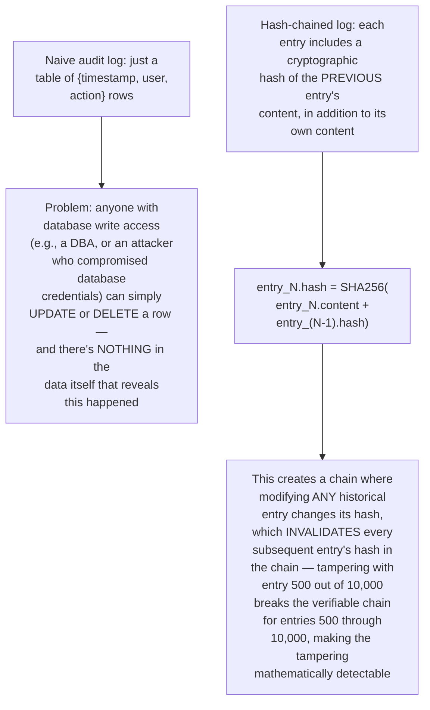
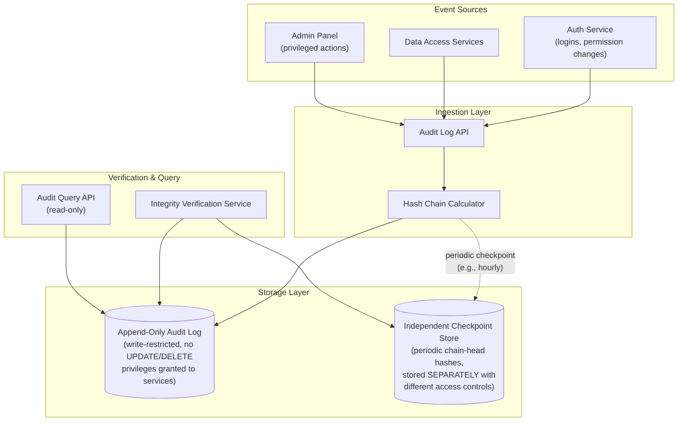
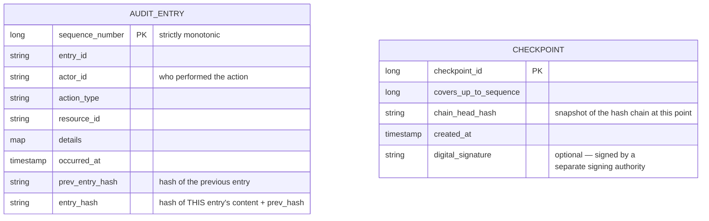
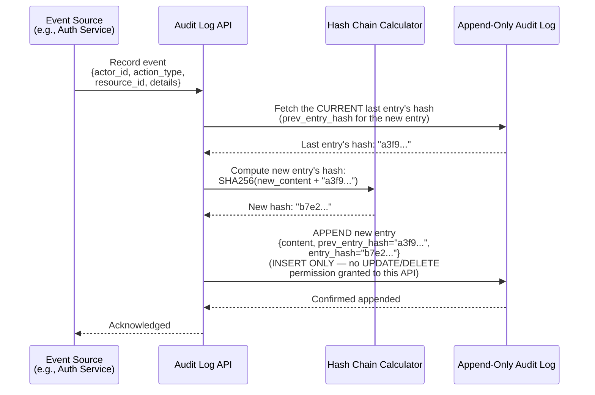
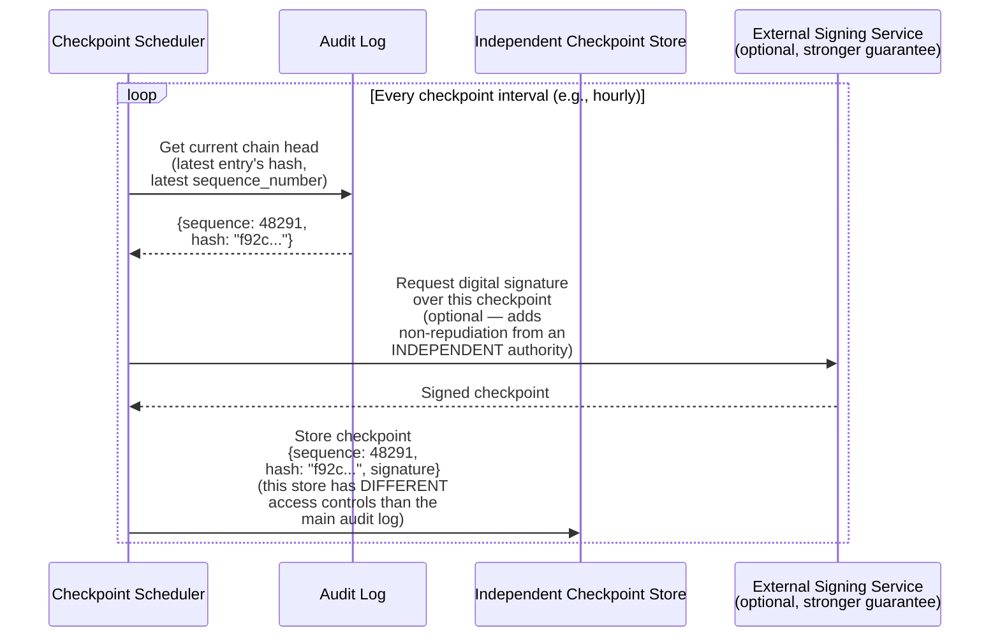
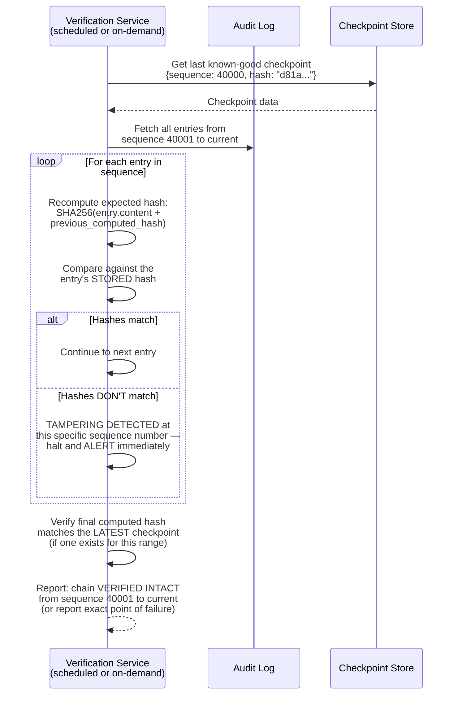
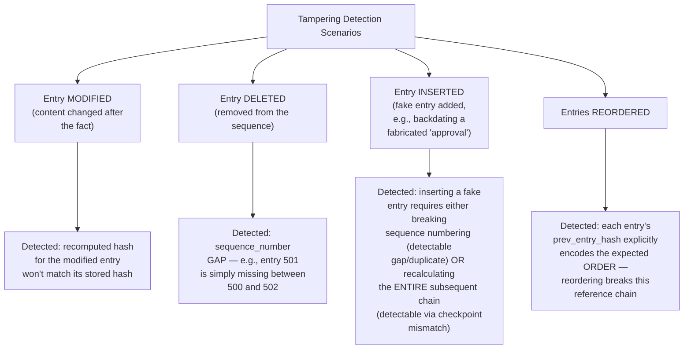
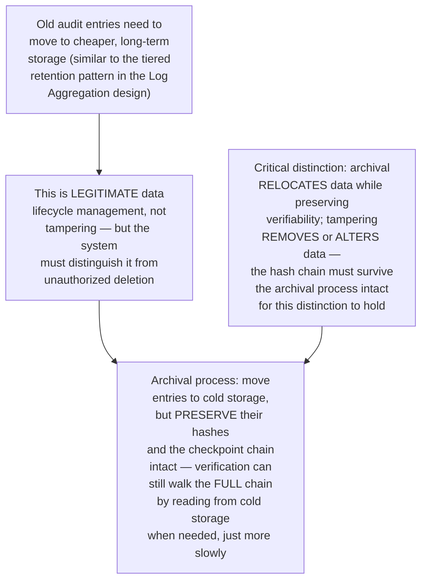
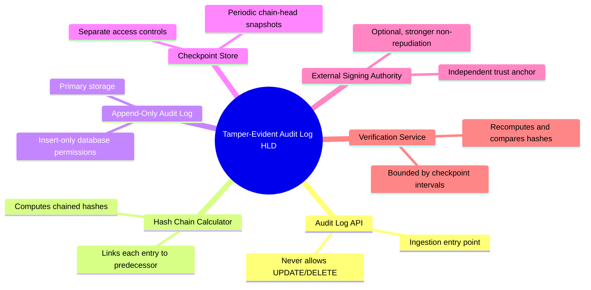

# Design a Tamper-Evident Audit Logging System — High-Level Design Document

## 1. Requirements

### Functional Requirements
- Record every security/compliance-relevant action (logins, permission changes, data access, admin actions) as an immutable audit entry
- Allow authorized parties to verify the log's integrity — detect if ANY entry has been modified, deleted, or reordered after the fact
- Support efficient querying (by user, by time range, by action type) despite the append-only, tamper-evidence constraints
- Support long-term retention for compliance (often years)

### Non-Functional Requirements
- **Tamper-evidence (the defining property):** Even someone with elevated database access (e.g., a compromised admin account, or a malicious insider) must NOT be able to silently alter history without detection
- **Non-repudiation:** An action recorded in the log should be attributable and provably genuine — not deniable by the actor who performed it
- **Availability:** Audit logging shouldn't become a bottleneck or single point of failure for the systems generating the events
- **Durability:** Audit logs are often legally required evidence — loss is unacceptable

### Back-of-Envelope Estimation
| Metric | Value |
|---|---|
| Audit events/sec (platform-wide) | Thousands to tens of thousands |
| Retention period | Often 1-7 years, depending on regulatory context |
| Verification frequency | Periodic (e.g., daily automated integrity checks) + on-demand (incident investigation) |
| Query patterns | By user, by time range, by resource, by action type |

---

## 2. The Core Mechanism — Hash Chaining

**Why this works even against someone with database access:** The key insight is that tampering with historical data requires NOT JUST modifying the target entry, but also recalculating and updating every single subsequent entry's hash to maintain a valid-looking chain — and even then, this recalculated chain can be checked against independently-stored checkpoint hashes (covered below) that the tamperer doesn't have write access to modify.

---

## 3. High-Level Architecture

**Key idea:** The Checkpoint Store, holding periodic snapshots of the chain's current hash, is deliberately kept SEPARATE from the main audit log with DIFFERENT access controls (ideally write-once, or held by a different administrative domain entirely) — this is what prevents an attacker with full access to the main log from ALSO rewriting checkpoints to hide their tracks, since compromising both systems simultaneously is a meaningfully higher bar than compromising just one.

---

## 4. Data Model

---

## 5. Writing a New Audit Entry — Detailed Sequence

**Why "insert-only" database permissions matter as a complementary control:** The hash chain provides DETECTION of tampering, but restricting the audit log table's database permissions to INSERT-only (revoking UPDATE and DELETE entirely, even for the application's own service account) adds a PREVENTION layer — making unauthorized modification structurally harder to even attempt, not just detectable after the fact.

---

## 6. Periodic Checkpointing — Detailed Sequence

**Why external signing adds a meaningfully stronger guarantee:** Even if an attacker somehow compromises BOTH the audit log's database AND the checkpoint store, a checkpoint independently signed by a genuinely separate system (potentially even an external, third-party timestamping/notary service) cannot be forged without ALSO compromising that separate signing authority — this is the same "distribute trust across independent parties" principle as the Secrets Management design's Shamir's Secret Sharing, applied to log integrity instead of key protection.

---

## 7. Integrity Verification Flow — Detailed Sequence

**Why verification starts from a checkpoint, not from the very beginning:** Just as the WAL & Recovery System design uses checkpoints to bound RECOVERY replay cost, this design uses checkpoints to bound VERIFICATION cost — re-verifying the ENTIRE historical chain from day one on every check would become increasingly expensive as the log grows; verification only needs to re-walk the chain since the last TRUSTED checkpoint.

---

## 8. Detecting Different Types of Tampering

---

## 9. Handling Legitimate Log Archival (Not Tampering)

---

## 10. Component Responsibilities Summary

---

## 11. Key Design Decisions & Tradeoffs

| Decision | Choice | Why |
|---|---|---|
| Core integrity mechanism | Hash chaining (each entry references previous entry's hash) | Makes any historical modification mathematically detectable — altering one entry invalidates the chain for everything after it |
| Database permissions | Insert-only, no UPDATE/DELETE granted | Adds a prevention layer alongside detection — makes unauthorized modification structurally harder to attempt, not just detectable |
| Checkpoint storage | Separate system, different access controls | Prevents a single compromised system/credential from being able to both tamper with the log AND cover its tracks by also rewriting checkpoints |
| External signing (optional) | Independent signing authority for checkpoints | Provides the strongest possible non-repudiation guarantee, requiring compromise of a genuinely separate system to forge |
| Verification scope | Incremental, from last trusted checkpoint | Bounds verification cost as the log grows, same principle as checkpoint-bounded recovery in the WAL design |
| Archival handling | Preserve hash chain integrity through cold storage migration | Distinguishes legitimate data lifecycle management from actual tampering — both must remain verifiable, unlike destructive deletion |

---

## 12. Bottlenecks & Scaling Considerations

- **Sequential write dependency** — because each entry's hash depends on the PREVIOUS entry's hash, writes are inherently sequential/serialized at the hash-chaining step, which can become a throughput bottleneck at very high audit event volume; may require sharding into multiple independent chains (e.g., per-service or per-region chains) with periodic cross-chain checkpointing, accepting that verification then needs to account for multiple parallel chains.
- **Verification cost growth** — even with checkpoint-bounded incremental verification, extremely high-volume systems accumulate a large number of entries between checkpoints; more frequent checkpointing reduces per-verification cost but increases checkpoint storage/signing overhead — a tunable tradeoff based on actual event volume.
- **Query performance vs append-only constraint** — supporting efficient queries (by user, time range, action type) on an append-only log typically requires secondary indexes (same considerations as the Secondary Index System design) that must ALSO be carefully designed not to become an alternate, unprotected avenue for inferring or reconstructing tampered data.
- **Long-term cryptographic hash algorithm obsolescence** — hash algorithms considered secure today (e.g., SHA-256) may eventually be weakened by future cryptographic advances; systems with very long retention requirements (years) should have a plan for potentially re-hashing or adding stronger algorithm layers over time, without breaking historical verifiability.
- **Insider threat with checkpoint-store access** — if a single administrator has legitimate access to BOTH the main audit log AND the checkpoint store (e.g., a small organization without strict separation of duties), the "independent access control" protection is weakened; this is as much an organizational/process control question as a technical one.
- **Balancing detection speed against verification cost** — running full integrity verification continuously (after every single write) would be prohibitively expensive; scheduled periodic verification (e.g., daily) means tampering could theoretically go undetected for up to that interval — this detection latency is a deliberate, documented tradeoff, not an oversight.
