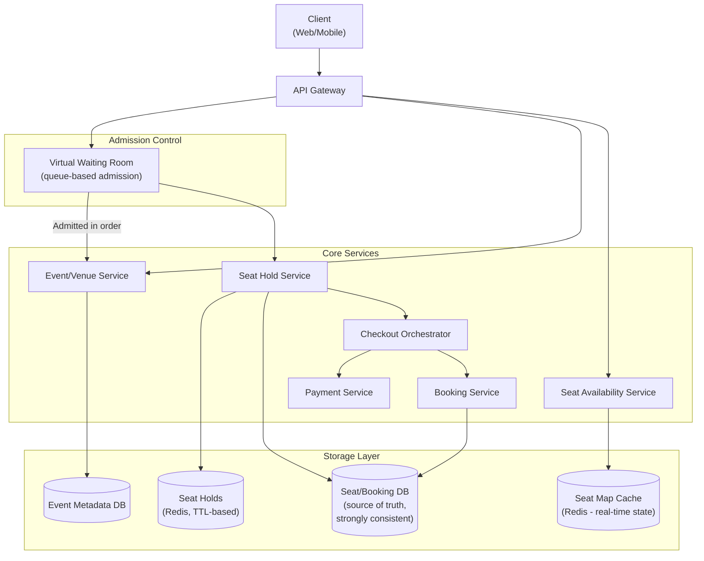
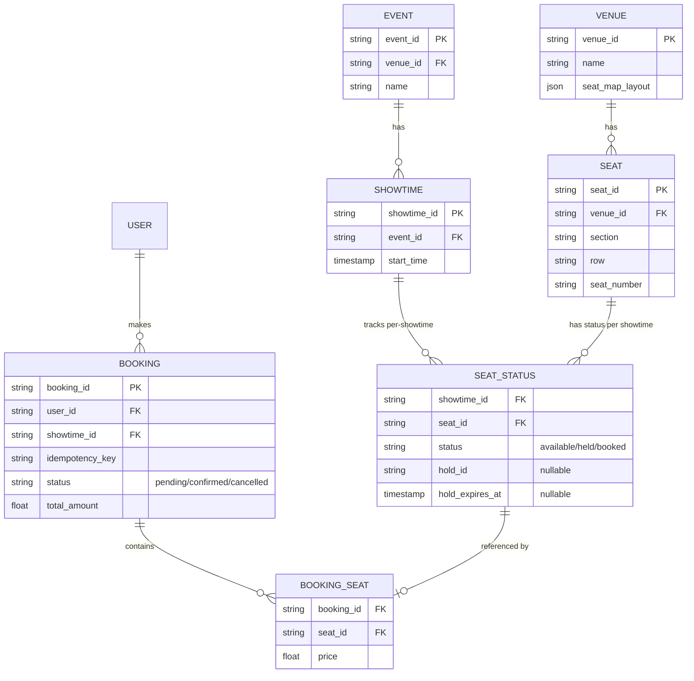
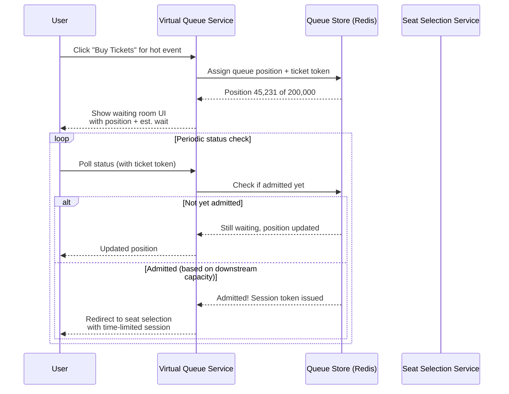
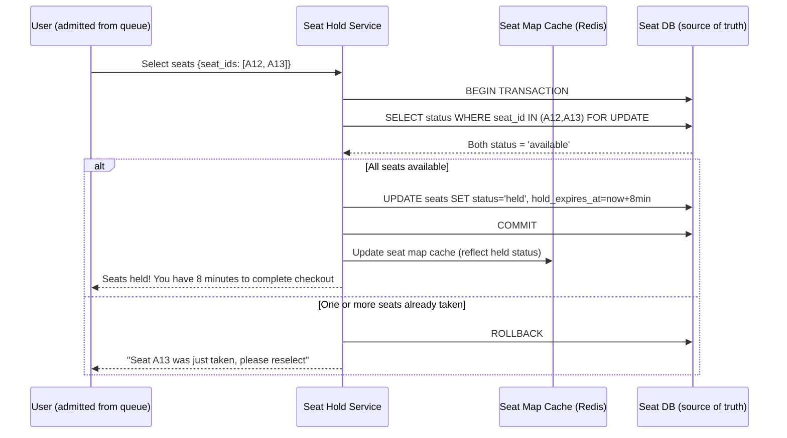
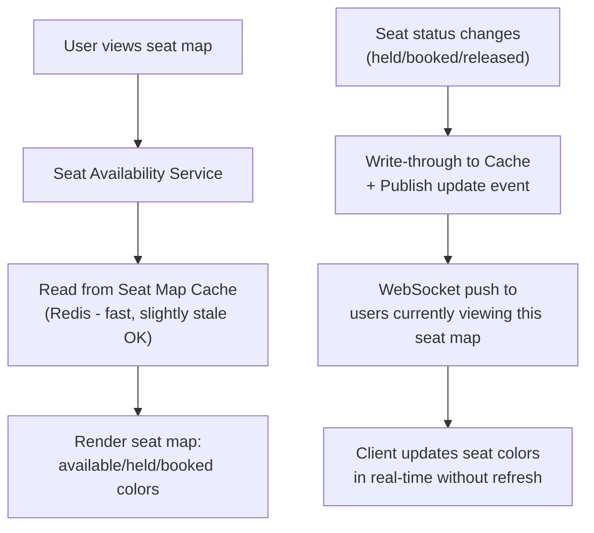
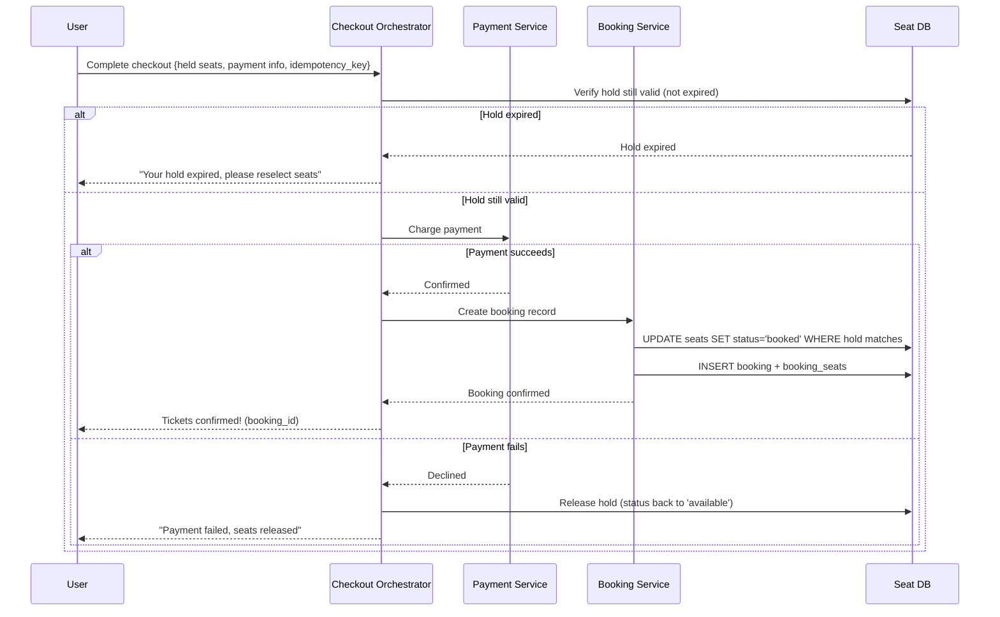
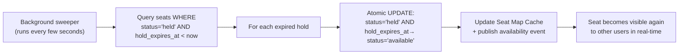
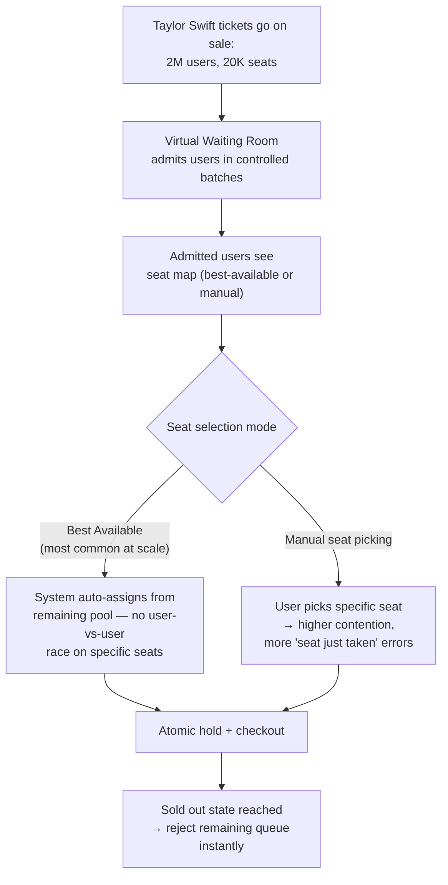
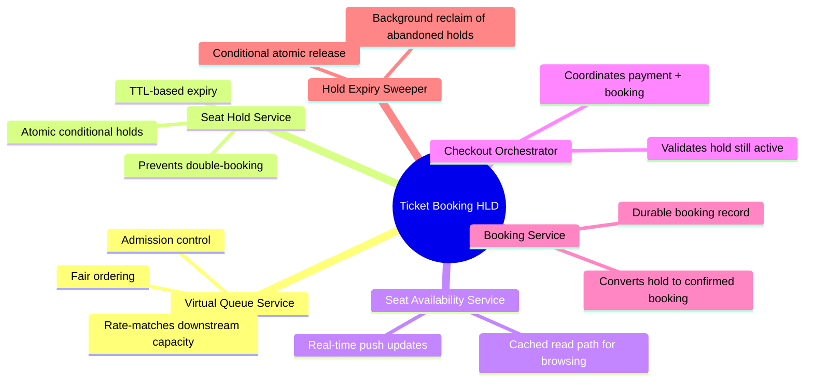

# Design a Ticket Booking System (Ticketmaster-style) — High-Level Design Document

## 1. Requirements

### Functional Requirements
- Browse events, view seat maps and availability
- Select specific seats and hold them temporarily during checkout
- Complete purchase (payment) to convert hold into confirmed booking
- Handle massive concurrent demand for popular events (on-sale moment)
- Support general admission (no seat selection) and reserved seating
- Cancellations/refunds release seats back to inventory

### Non-Functional Requirements
- **Correctness:** Never double-sell the same seat — this is the core invariant
- **Extreme burst scale:** A popular concert on-sale can see 1M+ users hit "buy" within seconds
- **Fairness:** Users who click first should generally get priority (or queue-based fairness)
- **Low seat-map latency:** Real-time seat availability must render quickly and accurately
- **Hold expiry:** Seats held during checkout but not purchased must release automatically

### Back-of-Envelope Estimation
| Metric | Value |
|---|---|
| Concurrent users at on-sale moment | ~1M+ for a major event |
| Seats per venue | ~20,000 (large stadium) |
| Seat hold requests/sec (peak burst) | ~100,000+/sec |
| Hold duration | 5-10 minutes typical |
| Read:Write ratio (browsing vs buying) | Very read-heavy outside on-sale spikes |

---

## 2. High-Level Architecture

**Key idea:** The single hardest constraint is "never sell the same seat twice" under extreme concurrent load. This drives a **two-phase model**: (1) a short-lived, TTL-based *hold* on a seat while the user completes checkout, and (2) a *commit* that converts the hold into a permanent, strongly-consistent booking — combined with a **virtual waiting room** that controls how many users even reach the seat-selection step at once.

---

## 3. Data Model

---

## 4. Virtual Waiting Room Flow

**Key idea:** The waiting room is a deliberate **admission control valve** — it caps how many users can concurrently hit the seat-selection and hold services, throttled to match what the downstream system can actually handle without lock contention collapse. Being 45,000th in line is far better UX than getting through immediately and hitting constant "seat unavailable" errors from a stampede.

---

## 5. Seat Hold Flow — Preventing Double-Booking

**Key design point:** Just like the inventory reservation problem, this uses `SELECT ... FOR UPDATE` (or an equivalent atomic conditional update) to prevent the race where two users simultaneously see seat A13 as "available" and both attempt to hold it. The database transaction, not the application logic, is the source of truth for the hold decision.

---

## 6. Seat Map Real-Time Updates (Read Path)

*The seat map for browsing is read from a cache that's "close enough to real-time" (updated via write-through + pub/sub push) — but the actual **hold/commit decision** always goes through the strongly consistent database transaction. This separates the read-heavy browsing experience from the write-critical booking decision.*

---

## 7. Checkout & Booking Confirmation — Detailed Sequence

---

## 8. Hold Expiry Sweep (Background Process)

*Using a conditional `WHERE status='held' AND hold_expires_at < now` in the release update (rather than a blind update) guards against a race where a user completes checkout in the exact instant the sweeper runs — the sweeper only releases holds that are actually still expired at update time.*

---

## 9. Handling Extreme On-Sale Contention (Hot Event)

*Many large-scale platforms default hot on-sales to "best available" seat assignment rather than open seat-map picking specifically because it eliminates the worst contention pattern — thousands of users simultaneously fighting over the same visually "good" seats.*

---

## 10. Component Responsibilities Summary

---

## 11. Key Design Decisions & Tradeoffs

| Decision | Choice | Why |
|---|---|---|
| Admission control | Virtual waiting room before seat selection | Caps concurrent load on the hold service to what it can safely handle without lock contention collapse |
| Double-booking prevention | Atomic conditional DB transaction (`SELECT FOR UPDATE`) | Application-level check-then-act is unsafe under concurrency; DB-level atomicity is the only reliable guarantee |
| Hold model | Short TTL hold, separate from final booking commit | Gives users time to complete payment without permanently locking seats from other buyers |
| Seat map browsing | Cached, near-real-time, eventually consistent | Browsing doesn't need strict consistency; only the hold/commit decision does |
| Hot event seat assignment | Default to "best available" over manual picking | Eliminates the worst-case contention pattern of many users racing for the same visible seats |
| Hold release | Conditional sweep (`WHERE status AND expires_at`) | Prevents a race between expiry sweep and last-second checkout completion |

---

## 12. Bottlenecks & Scaling Considerations

- **Lock contention on popular sections** — even with best-available assignment, extremely popular sections (front row) can still create hot rows; consider randomized/sharded assignment within a price tier to spread contention.
- **Virtual queue fairness at massive scale** — must ensure queue admission is genuinely FIFO-ish and resistant to bots/scalpers cutting the line (CAPTCHA, rate limiting per account/IP at queue entry).
- **Seat map cache staleness during high churn** — during an on-sale spike, seat status changes extremely fast; push-based cache invalidation (not polling) is essential to avoid showing wildly stale "available" seats.
- **Payment gateway latency inside a time-boxed hold** — if payment processing is slow, users can lose their hold mid-checkout; consider extending hold TTL once payment is actually in-flight rather than using a single fixed window.
- **Database write throughput during peak hold-creation** — thousands of concurrent hold transactions per second on a single event's seat rows; may require sharding seats by section/row to distribute write load across partitions.
- **Refund/cancellation seat release** — must re-enter the same atomic status-transition logic as original booking to avoid conflicts with concurrent new bookings for the just-released seat.
- **Multi-event scaling** — architecture must isolate hot events from each other; a massive on-sale for one concert shouldn't degrade booking performance for unrelated events sharing the same infrastructure.
