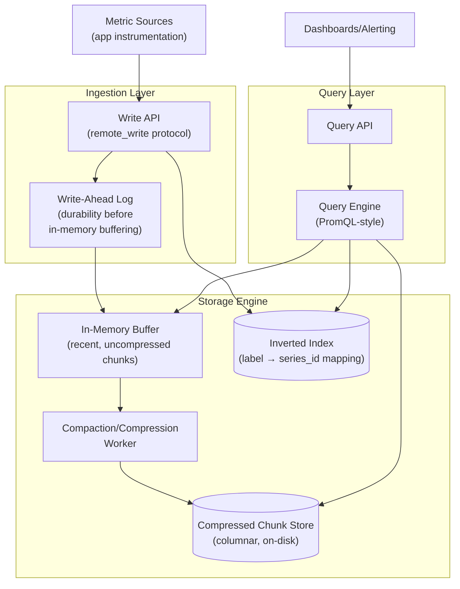
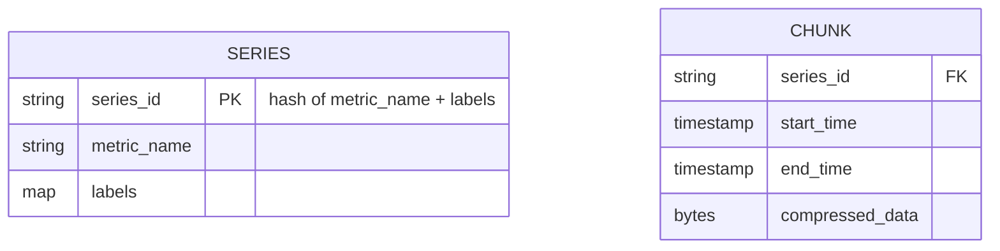
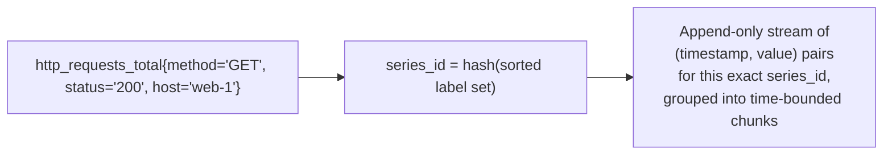
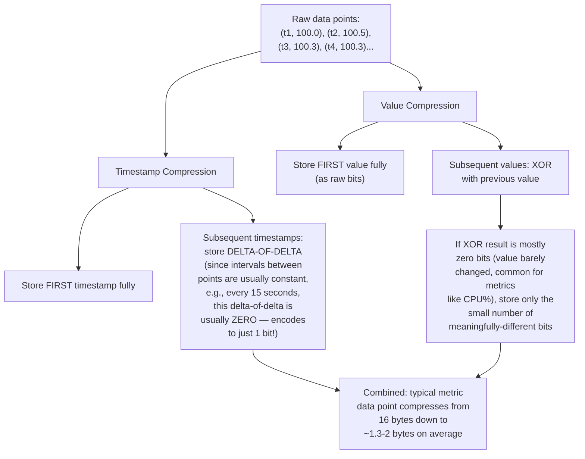
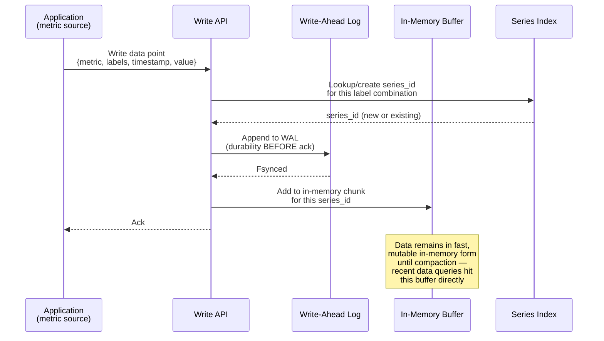
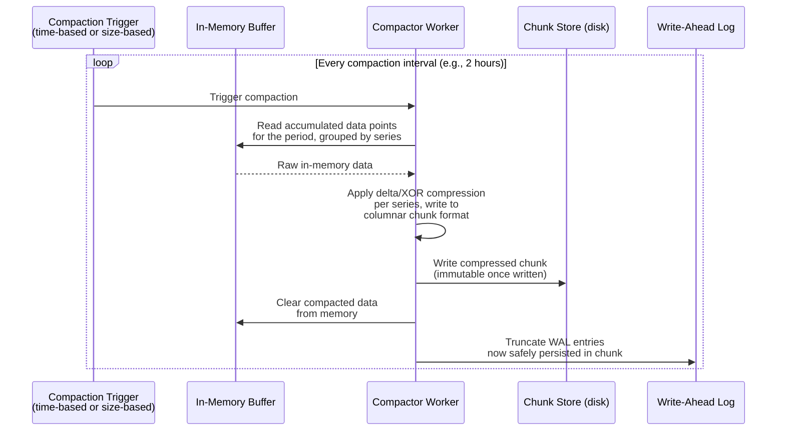
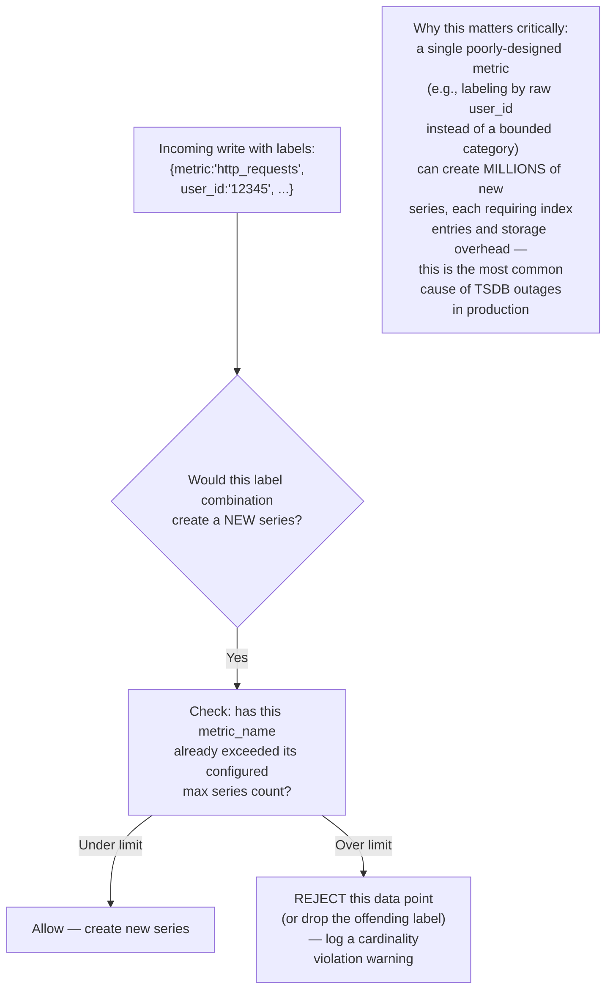
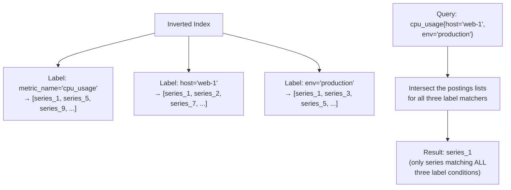
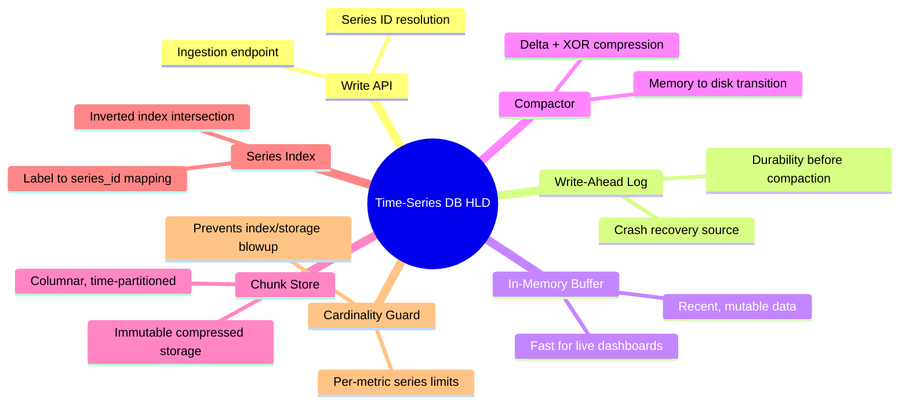

# Design a Time-Series Database (Prometheus/InfluxDB-style) — High-Level Design Document

## 1. Requirements

### Functional Requirements
- Efficiently store and query data points indexed by timestamp
- Support high-cardinality labeled metrics (metric_name + key-value tags)
- Range queries over arbitrary time windows, with aggregation functions
- Automatic data retention/expiration policies
- Support both high-frequency writes (ingestion) and ad-hoc analytical queries

### Non-Functional Requirements
- **Write throughput:** Millions of data points/sec sustained ingestion
- **Storage efficiency:** Time-series data compresses extremely well if encoded correctly — must exploit this
- **Query latency:** Sub-second for typical dashboard queries over recent data
- **Compression:** Raw storage would be prohibitively expensive at this write volume without aggressive compression
- **Cardinality management:** Must handle (or protect against) high-cardinality label combinations gracefully

### Back-of-Envelope Estimation
| Metric | Value |
|---|---|
| Data points ingested/sec | ~5M |
| Bytes per raw data point (naive) | ~16 bytes (8-byte timestamp + 8-byte value) |
| Bytes per data point (compressed) | ~1-2 bytes (via delta + XOR encoding) |
| Daily raw volume (uncompressed) | ~7TB/day |
| Daily volume (compressed) | ~500GB-1TB/day |
| Unique time series (cardinality) | ~10M+ |

---

## 2. High-Level Architecture



**Key idea:** Time-series databases exploit a structural property most general-purpose databases don't: **within a single series, consecutive values tend to be similar, and timestamps are evenly spaced and monotonically increasing.** The entire storage engine is built around specialized compression that takes advantage of exactly this pattern, achieving compression ratios (10-20x+) that general-purpose row-oriented storage can't match.

---

## 3. Data Model





---

## 4. Compression — The Core Technical Innovation (Gorilla-style)



**Why this works so well for metrics specifically:** Most real-world metrics (CPU usage, request counts, latencies) change gradually and are sampled at regular intervals — exactly the pattern this delta-of-delta timestamp encoding and XOR-based value encoding is designed to exploit. This is fundamentally different from general-purpose compression (like gzip) because it's tailored to the specific statistical properties of time-series data.

---

## 5. Write Path — Detailed Sequence



---

## 6. Compaction Flow (Memory → Compressed Disk Storage)



**Why the WAL matters:** If the process crashes before compaction runs, in-memory (uncompressed) data would be lost — the WAL provides durability for that window by recording every write to disk immediately (in a simple, fast append-only format) before it's later reorganized into the efficient compressed chunk format. On restart, the WAL is replayed to reconstruct the in-memory state.

---

## 7. Query Flow — Detailed Sequence

```mermaid
sequenceDiagram
    participant C as Client (Dashboard)
    participant QAPI as Query API
    participant Idx as Series Index
    participant Mem as In-Memory Buffer
    participant Chunk as Chunk Store

    C->>QAPI: Query: avg(cpu_usage) by host,<br/>range=[now-6h, now]
    QAPI->>Idx: Resolve label matchers<br/>to matching series_ids

    Idx-->>QAPI: List of matching series_ids

    par Fetch from both storage tiers
        QAPI->>Mem: Get recent data<br/>(last few hours, still in-memory)
        Mem-->>QAPI: Uncompressed recent points
    and
        QAPI->>Chunk: Get older data from<br/>compressed chunks
        Chunk->>Chunk: Decompress relevant chunks
        Chunk-->>QAPI: Decompressed historical points
    end

    QAPI->>QAPI: Merge both sources,<br/>apply aggregation (avg by host)
    QAPI-->>C: Return time-series result
    set
```

---

## 8. Cardinality Explosion Protection



---

## 9. Index Structure (Label → Series Lookup)



*This is conceptually the same inverted-index intersection technique used in the Search Engine design — label-based series lookup in a TSDB is essentially a specialized full-text search problem over structured tag data.*

---

## 10. Component Responsibilities Summary



---

## 11. Key Design Decisions & Tradeoffs

| Decision | Choice | Why |
|---|---|---|
| Compression strategy | Delta-of-delta timestamps + XOR value encoding | Exploits the specific statistical regularity of time-series data (regular intervals, gradual value changes) far better than general-purpose compression |
| Write path | WAL + in-memory buffer, compacted periodically | Balances write durability (WAL) against write speed (memory) and long-term storage efficiency (compacted chunks) |
| Storage layout | Columnar, time-partitioned chunks | Query patterns are almost always time-range-bounded; partitioning by time makes range queries efficient and retention/deletion trivial |
| Cardinality control | Hard limits enforced at ingestion | The most common real-world cause of TSDB failure is uncontrolled label cardinality; proactive limits prevent this rather than reacting after degradation |
| Index structure | Inverted index over labels | Enables efficient multi-label query resolution via postings-list intersection, same principle as full-text search |
| Query merge | Combine in-memory (recent) + compressed (historical) sources | Recent data needs to be queryable before compaction completes; querying both tiers transparently gives a complete, current view |

---

## 12. Bottlenecks & Scaling Considerations

- **Cardinality is the dominant scaling risk** — far more than raw data point volume, the number of DISTINCT series is what stresses index size and memory; this is why cardinality guards are a first-class architectural concern, not an afterthought.
- **Compaction lag under sustained high write load** — if compaction can't keep pace with ingestion, the in-memory buffer grows unboundedly, risking memory exhaustion; needs monitoring and the ability to scale compaction workers independently of ingestion capacity.
- **Query cost for very wide aggregations** — a query aggregating across millions of series (e.g., "sum across ALL hosts") requires touching and decompressing many chunks; needs efficient parallel chunk processing and possibly pre-aggregated rollups for extremely common wide queries (similar to the downsampling approach in the general Analytics Dashboard design).
- **Out-of-order/late-arriving writes** — the compression scheme assumes roughly monotonic, evenly-spaced timestamps; handling significantly out-of-order writes (common with mobile/edge metric sources) requires either buffering longer before compaction or accepting reduced compression efficiency for affected series.
- **Long-term retention storage costs** — even with excellent compression, retaining raw-resolution data indefinitely at high ingestion volume is expensive; downsampling older data to coarser resolution (same pattern as general metrics systems) is typically layered on top of this core storage engine.
- **Sharding for horizontal scale** — a single node's ingestion/query capacity is inherently bounded; production TSDBs at this scale shard series across many storage nodes (often by hash of series_id), requiring a distributed query layer to fan out and merge results across shards.
