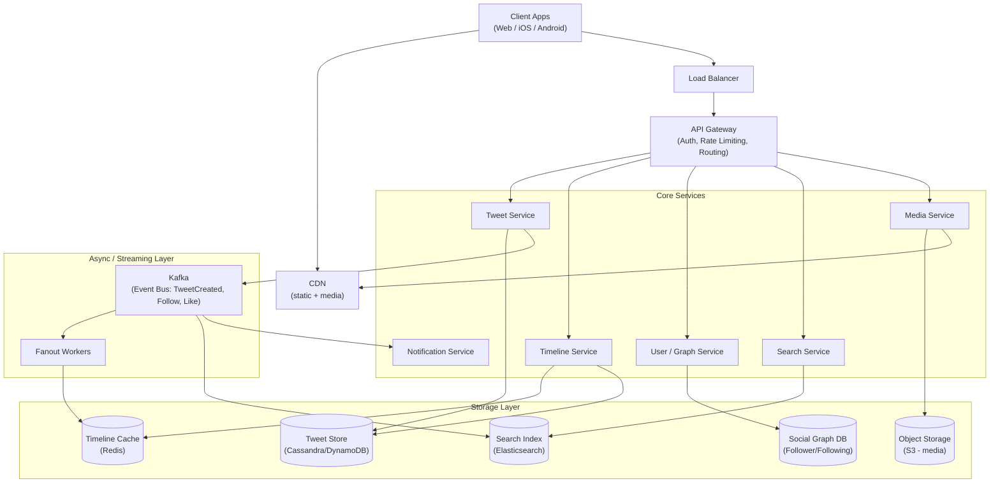
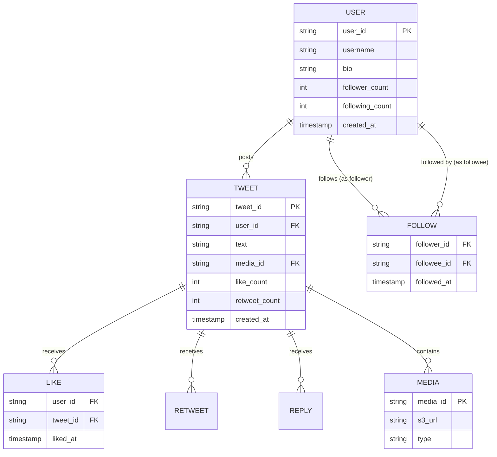
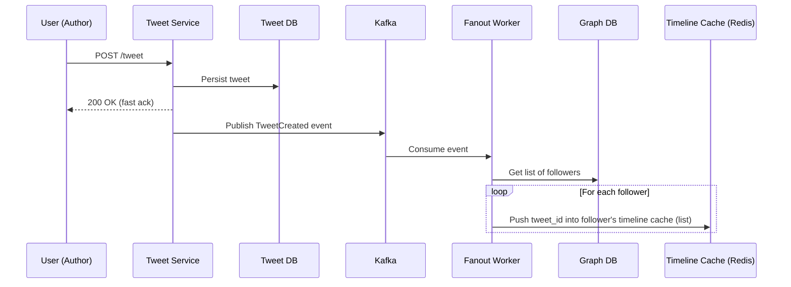
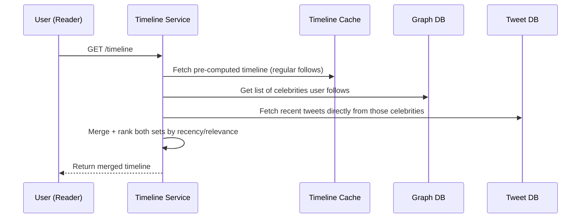
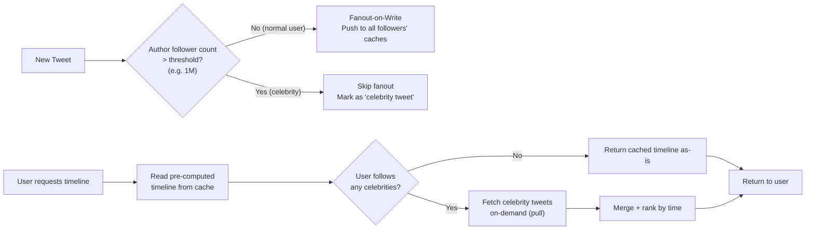
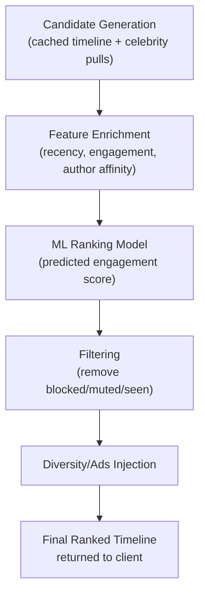
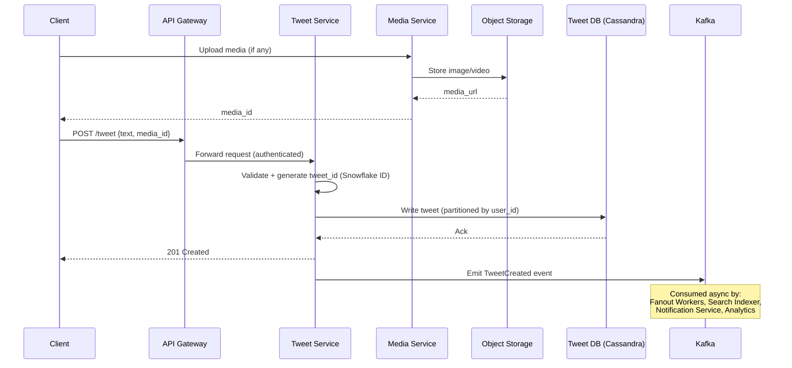
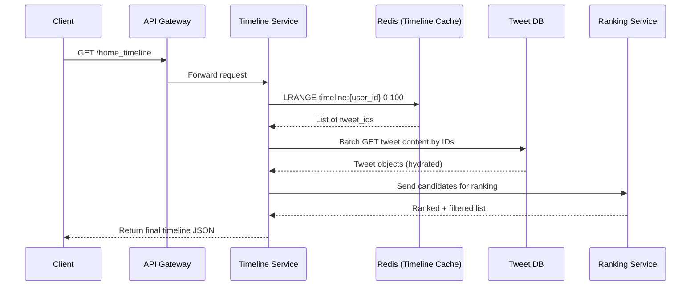
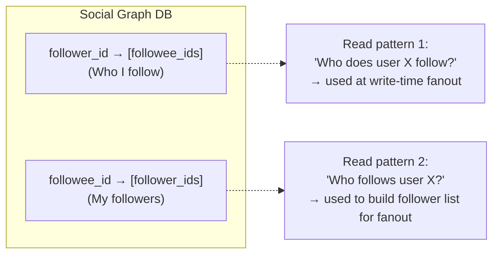
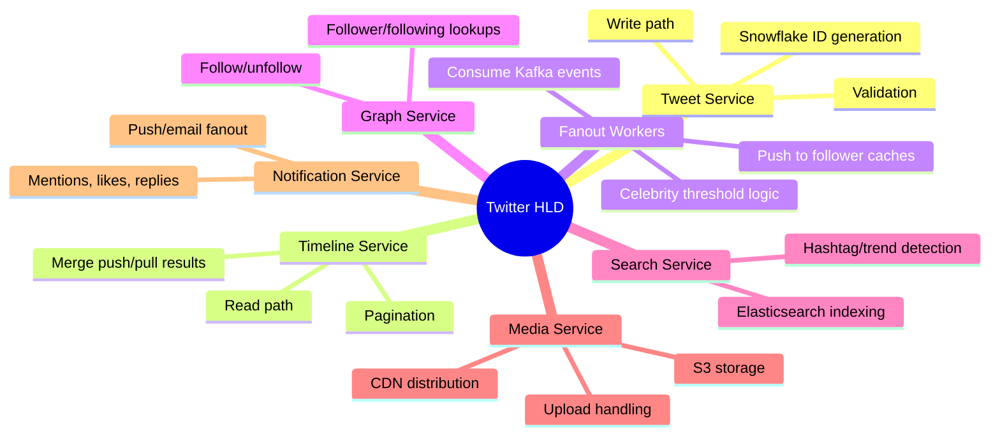

# Design Twitter/X — High-Level Design Document

## 1. Requirements

### Functional Requirements
- Users can post tweets (text, images, video, up to 280 chars for text)
- Users can follow/unfollow other users
- Users see a home timeline of tweets from people they follow
- Users can like, retweet, reply
- Users can search tweets
- Trending topics / hashtags

### Non-Functional Requirements
- **Scale:** ~500M DAU, ~5,000 tweets/sec average, ~50,000/sec peak
- **Read-heavy:** Read:Write ratio ~1000:1 (timeline reads dominate)
- **Low latency:** Timeline load < 200ms p99
- **Availability > Consistency** for timeline (eventual consistency acceptable)
- **Durability:** Tweets must never be lost once acknowledged

### Back-of-Envelope Estimation
| Metric | Value |
|---|---|
| DAU | 500M |
| Avg tweets/user/day | 2 |
| Tweets/day | ~1B |
| Writes/sec (avg) | ~5,000 |
| Timeline reads/sec | ~500,000+ |
| Avg followers/user | 200 (with celebrity outliers at 100M+) |
| Storage/tweet (with metadata) | ~300 bytes |
| Daily storage growth | ~300 GB/day (text only, media separate) |

---

## 2. High-Level Architecture

**Key idea:** Writes (tweet creation) go through a fast synchronous path to durable storage, then fan out asynchronously via Kafka to pre-compute timelines — decoupling the slow "push to all followers" work from the user-facing write latency.

---

## 3. Data Model (ER Diagram)

---

## 4. Feed Generation: Fanout-on-Write vs Fanout-on-Read

This is the **core hard problem** of Twitter's design. Two strategies, blended in practice.

### 4.1 Fanout-on-Write (Push Model) — used for normal users

**Why:** Precomputing means a follower's `GET /timeline` is just a cheap Redis `LRANGE` — O(1) fast read. Since reads vastly outnumber writes, we pay the fanout cost once at write time instead of on every read.

**Problem:** Celebrities with 100M followers — a single tweet would trigger 100M cache writes. This is the **"hot key" / "celebrity problem."**

### 4.2 Fanout-on-Read (Pull Model) — used for celebrities

### 4.3 Hybrid Model (What Twitter Actually Does)

---

## 5. Timeline Ranking Pipeline

---

## 6. Write Path (Tweet Creation) — Detailed Sequence

---

## 7. Read Path (Home Timeline) — Detailed Sequence

---

## 8. Social Graph Storage

*Stored as a dedicated graph/wide-column store (e.g., FlockDB-style or Cassandra wide rows) since it needs to support both directions efficiently at massive fan-out scale.*

---

## 9. Component Responsibilities Summary

---

## 10. Key Design Decisions & Tradeoffs

| Decision | Choice | Why |
|---|---|---|
| Timeline generation | Hybrid push/pull | Avoids celebrity fanout explosion while keeping normal-user reads O(1) |
| Tweet ID generation | Snowflake (time-sortable, distributed) | No central counter bottleneck, IDs sortable by time |
| Tweet storage | Wide-column store (Cassandra/DynamoDB) | High write throughput, partition by user_id |
| Timeline cache | Redis sorted sets/lists | Fast O(1) reads, TTL-based eviction for inactive users |
| Consistency model | Eventual consistency for timelines | Users tolerate a tweet appearing a few seconds late; availability matters more |
| Event backbone | Kafka | Decouples write path from fanout, search indexing, notifications |
| Media delivery | CDN + Object Storage | Offload heavy bandwidth from core services |

---

## 11. Bottlenecks & Scaling Considerations

- **Celebrity fanout** → solved via hybrid pull model + threshold-based routing.
- **Hot partitions in Tweet DB** → shard by `user_id` with consistent hashing; watch for celebrity accounts creating hot shards.
- **Timeline cache memory pressure** → TTL-evict timelines for inactive users; only keep top N (e.g., 800) tweet_ids per user, not full history.
- **Kafka consumer lag during fanout spikes** (e.g., breaking news) → auto-scale fanout worker pool, apply backpressure.
- **Search indexing lag** → acceptable to be near-real-time (few seconds) rather than synchronous.
- **Cross-region replication** → async replication with conflict resolution for global availability; accept eventual consistency across regions.
