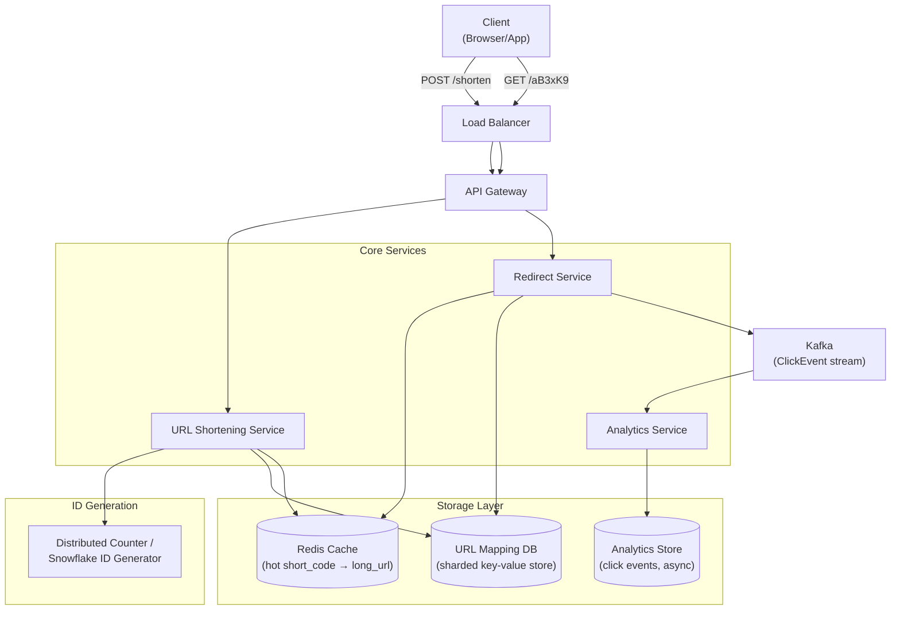
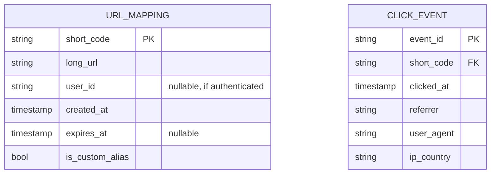
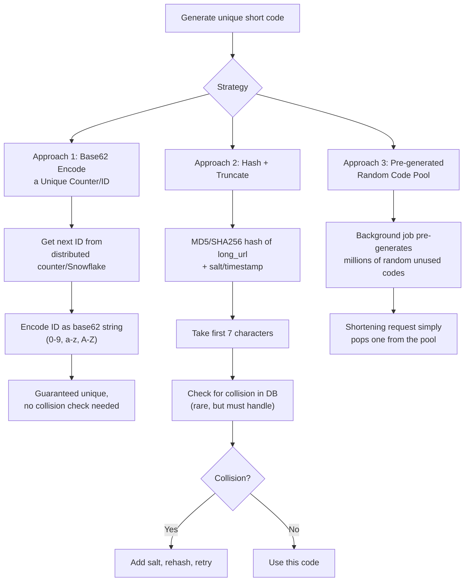
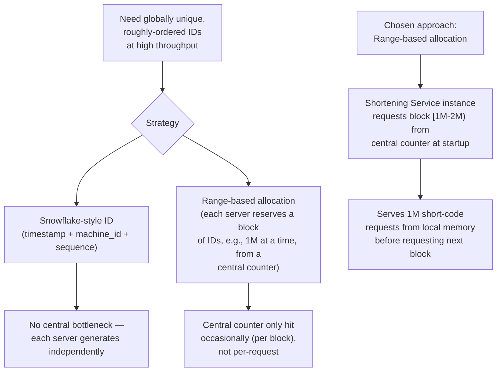
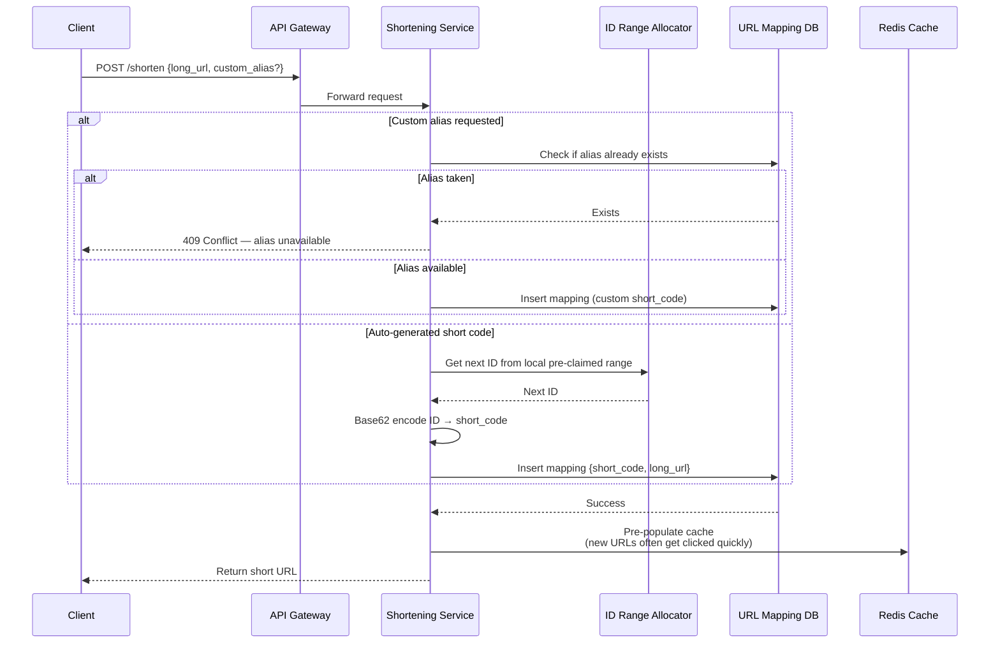
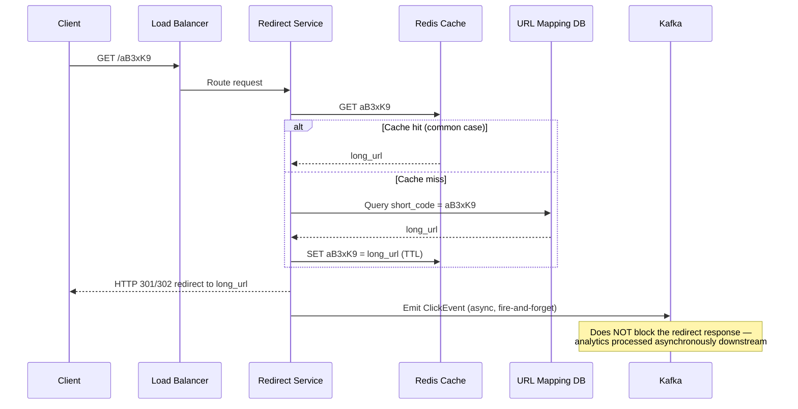
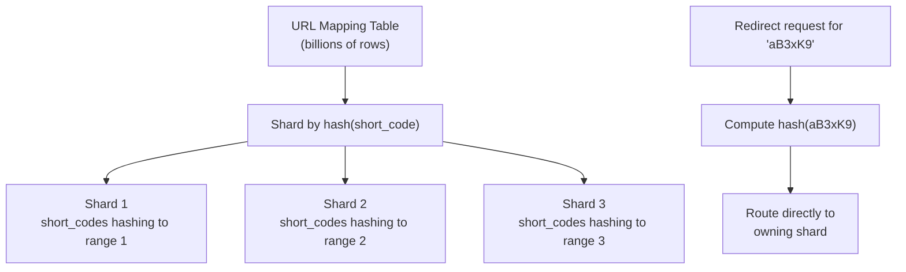
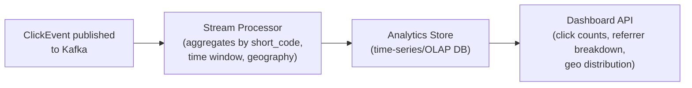
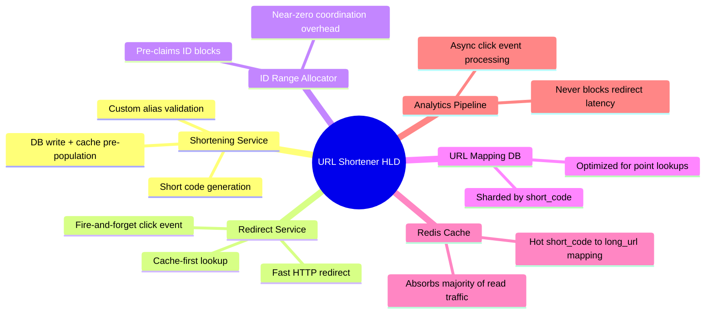

# Design a URL Shortener — High-Level Design Document

## 1. Requirements

### Functional Requirements
- Given a long URL, generate a short, unique alias (e.g., `short.ly/aB3xK9`)
- Redirect from short URL to original long URL
- Optional: custom aliases, expiration dates, click analytics
- Prevent collisions — every short code must map to exactly one long URL

### Non-Functional Requirements
- **Read-heavy:** Redirects vastly outnumber URL creations (~100:1 or higher)
- **Low latency redirects:** Should feel instant (< 50ms) — this is on the critical path of every click
- **High availability:** A broken shortener breaks every link that's ever been shared
- **Uniqueness:** No two long URLs should ever collide on the same short code (unless intentionally reused)
- **Scale:** Billions of URLs stored, tens of thousands of redirects/sec at peak

### Back-of-Envelope Estimation
| Metric | Value |
|---|---|
| New URLs created/day | ~10M |
| Redirects/day | ~1B (100:1 read/write ratio) |
| Redirects/sec (peak) | ~20,000 |
| Short code length | 7 chars, base62 → 62^7 ≈ 3.5 trillion combinations |
| Storage per record | ~500 bytes (short code + long URL + metadata) |
| Total storage (5 years) | ~10M/day × 365 × 5 × 500 bytes ≈ 9TB |

---

## 2. High-Level Architecture

**Key idea:** Because redirects are on the hot path and vastly outnumber creations, the redirect flow is optimized to almost always resolve from cache — and click-tracking analytics are pushed off the critical path entirely via an async event stream, so a slow analytics pipeline never adds latency to the redirect itself.

---

## 3. Data Model

---

## 4. Short Code Generation Strategies

*This design uses **Approach 1 (counter + base62)** as primary — it's deterministic, collision-free by construction, and avoids the hash-collision-retry loop entirely.*

---

## 5. Distributed Unique ID Generation

**Why range allocation over Snowflake here:** Since we only need uniqueness (not strict time-ordering) and want the shortest possible codes, pre-claiming ID ranges lets each service instance generate short codes locally at zero coordination cost per request, only touching the central counter once per million IDs.

---

## 6. URL Shortening Flow — Detailed Sequence

---

## 7. Redirect Flow — Detailed Sequence (Hot Path)

**301 vs 302 tradeoff:** A 301 (permanent redirect) lets browsers cache the redirect locally, reducing load on the service for repeat clicks — but it also means click analytics for subsequent visits from that browser are lost, since the browser skips the server entirely. A 302 (temporary redirect) ensures every click is tracked, at the cost of higher server load. Most production shorteners use **302** specifically to preserve analytics.

---

## 8. Database Sharding Strategy

*Sharding by the short code itself (not the long URL or user) ensures redirect lookups — the hot path — always know exactly which shard to query without a lookup step.*

---

## 9. Analytics Pipeline (Async, Off Critical Path)

---

## 10. Component Responsibilities Summary

---

## 11. Key Design Decisions & Tradeoffs

| Decision | Choice | Why |
|---|---|---|
| Short code generation | Counter + base62 encoding | Collision-free by construction; avoids hash-and-retry complexity |
| ID generation | Range-based pre-allocation per service instance | Minimizes coordination overhead; central counter touched once per million IDs, not per request |
| Redirect status code | 302 (temporary) | Preserves click analytics on every visit, at the cost of slightly higher server load vs 301 |
| Caching strategy | Cache-aside, pre-populate on creation | Redirects are the overwhelming majority of traffic; cache-first keeps the hot path fast |
| Sharding key | `short_code` (not long_url or user_id) | Redirect lookups — the hot path — need direct shard routing without an extra lookup |
| Analytics | Fully async via Kafka | Click tracking must never add latency to the user-facing redirect |

---

## 12. Bottlenecks & Scaling Considerations

- **Redirect service is the dominant load** — with a 100:1+ read/write ratio, nearly all scaling effort goes into the redirect path; cache hit ratio is the single most important performance metric to monitor.
- **Cache capacity vs long-tail URLs** — most traffic concentrates on recently-created/popular links, but billions of rarely-clicked long-tail URLs exist; cache only needs to hold the "hot" working set, not the entire dataset (LRU eviction handles this naturally).
- **Custom alias collisions** — unlike auto-generated codes, custom aliases need an existence check before insert, which is a point of contention if many users race for the same popular word; handle via unique constraint at the DB level as the final arbiter, not just an app-level check.
- **ID range exhaustion coordination** — if a service instance crashes mid-block, some pre-claimed IDs are wasted (never used) — acceptable given the astronomically large ID space (62^7), but worth noting as a deliberate tradeoff.
- **Malicious/spam URL creation** — rate limiting on the shortening endpoint (not the redirect endpoint) is essential to prevent abuse (e.g., mass-generating phishing links).
- **Expired URL cleanup** — URLs with `expires_at` need a background sweep (or lazy deletion on redirect-time check) to avoid serving stale/expired links indefinitely.
- **Global distribution** — redirects benefit from being served close to the user; consider geo-distributed read replicas or edge-cached redirect logic (e.g., at the CDN/edge-worker layer) for the lowest possible latency.
