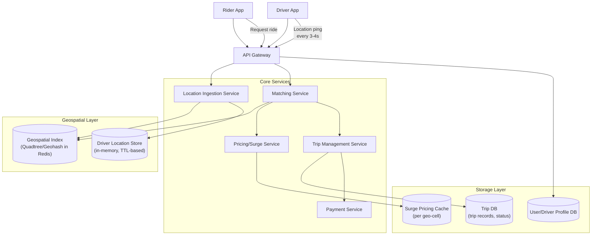
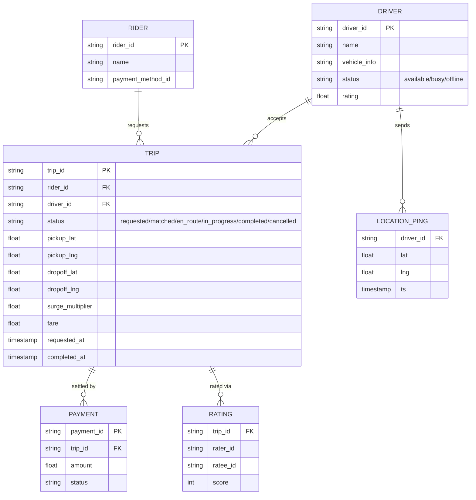
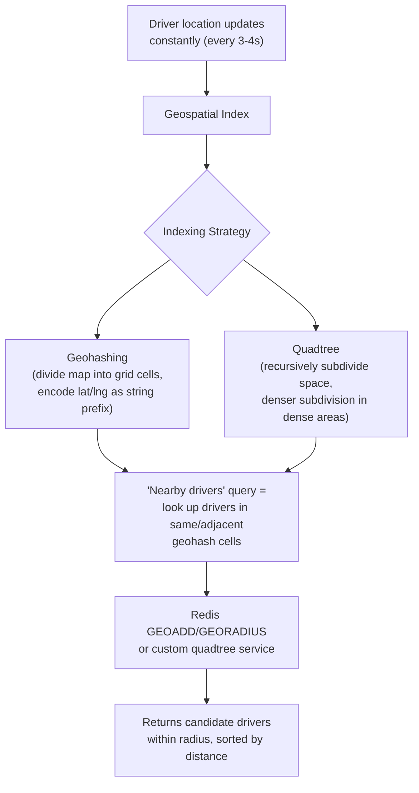
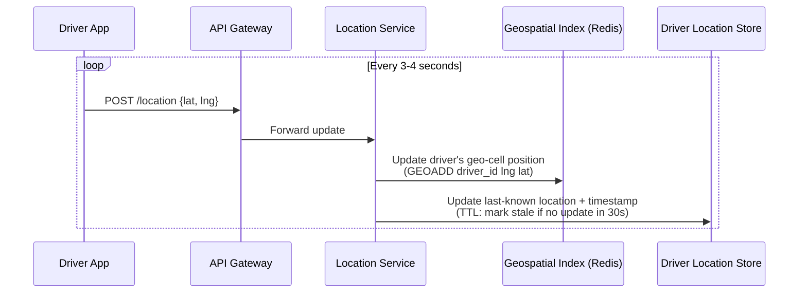
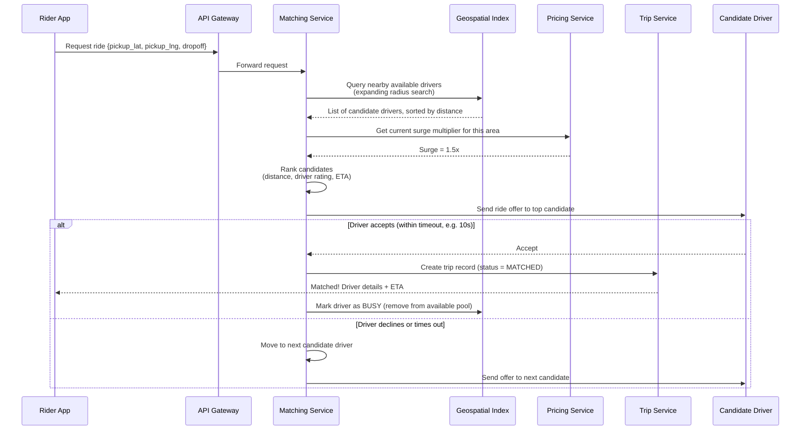
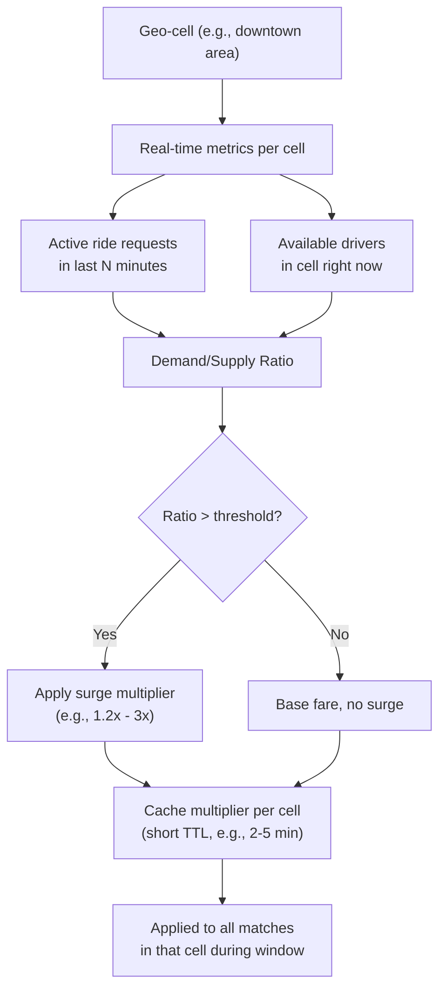
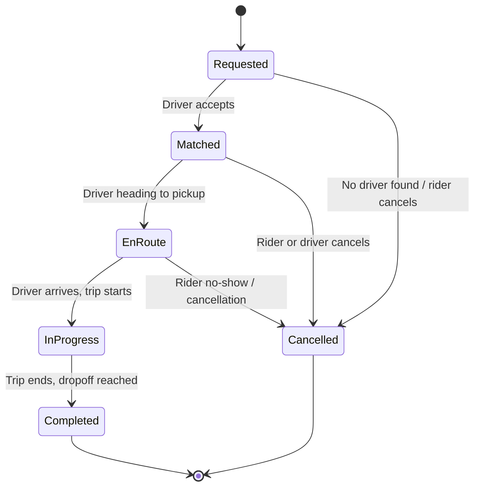
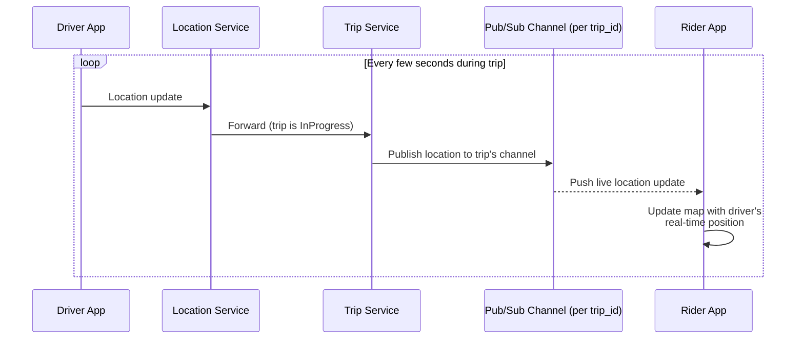
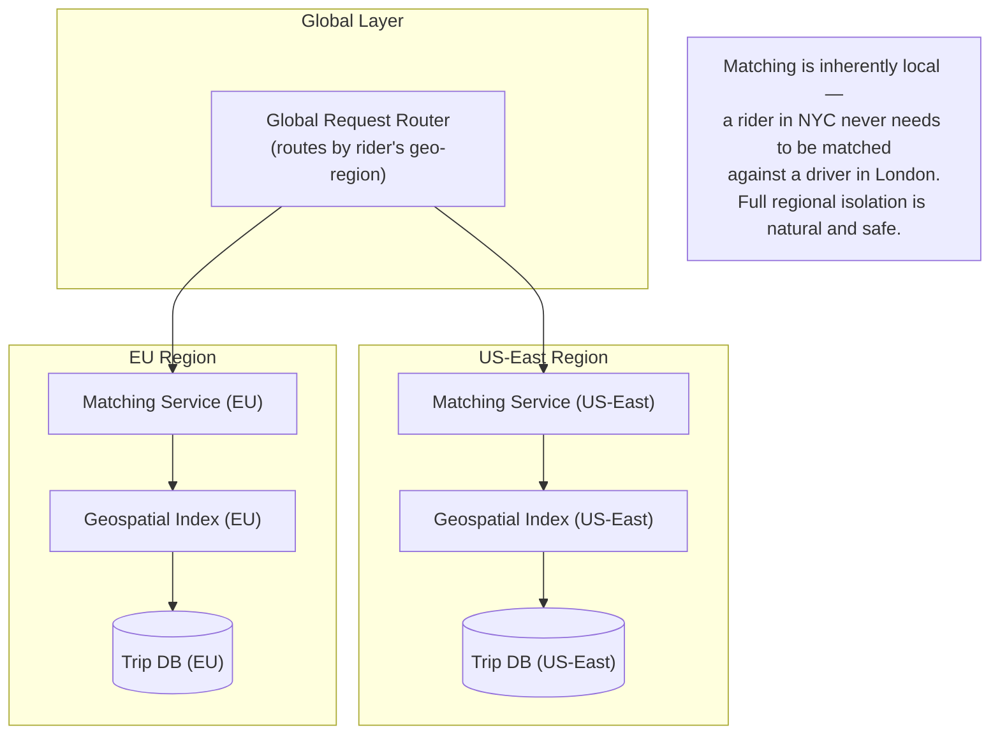
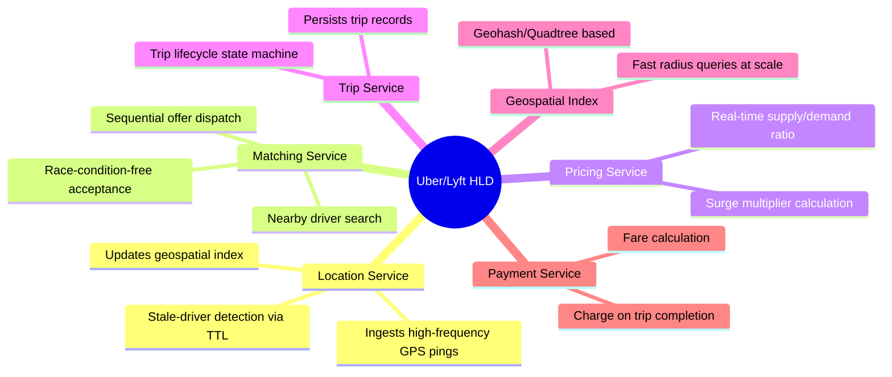

# Design Uber/Lyft — High-Level Design Document

## 1. Requirements

### Functional Requirements
- Riders can request a ride; system matches them with a nearby available driver
- Real-time location tracking of driver en route and during trip
- Dynamic/surge pricing based on supply-demand imbalance
- Trip lifecycle management: requested → matched → en route → in progress → completed
- Payment processing on trip completion
- Rating system for drivers and riders

### Non-Functional Requirements
- **Scale:** ~5M drivers, ~100M riders, millions of concurrent active trips globally
- **Low latency matching:** Rider should get matched with a driver within seconds
- **Location update frequency:** Driver apps ping location every 3-4 seconds
- **Geographic partitioning:** Matching only matters locally — no need for global coordination per request
- **High availability:** A regional outage shouldn't take down the whole platform (city-level isolation)

### Back-of-Envelope Estimation
| Metric | Value |
|---|---|
| Active drivers (peak, global) | ~1M concurrently online |
| Location updates/sec | ~1M drivers × (1 update / 4 sec) ≈ 250,000/sec |
| Ride requests/sec (peak) | ~10,000/sec |
| Matching latency target | < 3-5 seconds |
| Geospatial index size | Millions of active driver locations, constantly updating |

---

## 2. High-Level Architecture

**Key idea:** The entire matching problem is fundamentally **geospatial** — the system needs to answer "which drivers are within N km of this rider, right now?" extremely fast, at massive update frequency. This drives almost every architectural decision: an in-memory geospatial index refreshed continuously by a firehose of location pings.

---

## 3. Data Model

---

## 4. Geospatial Indexing (The Core Hard Problem)

**Why geohashing/quadtrees:** Naive "scan all drivers, compute distance" doesn't scale to millions of drivers per query. Geohashing converts 2D lat/lng into a 1D sortable string where nearby locations share string prefixes — so "find nearby drivers" becomes a fast prefix/range lookup instead of a full scan. Quadtrees adaptively subdivide dense areas (city centers) more finely than sparse ones (rural areas), balancing index granularity with data density.

---

## 5. Driver Location Update Flow

*Stale detection matters: if a driver's app crashes or loses connectivity, their last-known position must eventually be excluded from matching (via TTL expiry) so riders aren't matched with a driver who's actually offline.*

---

## 6. Ride Matching Flow — Detailed Sequence

**Key design point:** Matching uses an **expanding radius search with sequential offers**, not simultaneous broadcast to all nearby drivers — this avoids the "multiple drivers accept the same ride" race condition and keeps the process deterministic and fair.

---

## 7. Surge Pricing Calculation

*Surge pricing serves a dual purpose: it dynamically balances marketplace supply/demand (higher prices bring more drivers online in high-demand areas) while managing rider expectations transparently at request time.*

---

## 8. Trip Lifecycle State Machine

---

## 9. Real-Time Trip Tracking (During Ride)

*Once a trip is active, location updates are routed through a per-trip pub/sub channel rather than the general geospatial index — the rider only cares about their specific driver's position, not the broader matching pool.*

---

## 10. Regional/City-Level Partitioning

*Since ride matching never needs cross-region coordination, this is one of the cleanest cases for full geographic sharding — each region operates almost as an independent deployment, which also contains blast radius during regional outages.*

---

## 11. Component Responsibilities Summary

---

## 12. Key Design Decisions & Tradeoffs

| Decision | Choice | Why |
|---|---|---|
| Geospatial indexing | Geohashing/Quadtree in-memory index (Redis) | Naive distance-scan doesn't scale; prefix-based lookups make radius queries fast at millions of drivers |
| Matching dispatch | Sequential offers to ranked candidates | Prevents race conditions from broadcasting to multiple drivers simultaneously |
| Location update frequency | Every 3-4 seconds, TTL-based staleness | Balances real-time accuracy against bandwidth/server load; stale entries auto-expire |
| Regional partitioning | Full geographic sharding, no cross-region matching | Ride matching is inherently local; enables blast-radius containment and independent scaling per city/region |
| Surge pricing | Per-geo-cell real-time ratio, short-TTL cache | Localizes pricing signal to where imbalance actually exists, not a global average |
| Trip tracking | Dedicated per-trip pub/sub channel | Decouples active-trip tracking from the general matching geospatial index |

---

## 13. Bottlenecks & Scaling Considerations

- **Location ping volume** — ~250K updates/sec at global peak is the dominant write load; in-memory geospatial stores (Redis with GEO commands, or custom quadtree services) are essential since disk-backed DBs can't sustain this write rate.
- **Hot geo-cells** — dense urban cores (Manhattan, downtown SF) can have disproportionately high driver density in a small area; adaptive subdivision (quadtree) handles this better than fixed-size geohash cells.
- **Matching race conditions** — must guarantee a driver can't be double-booked; sequential offers with a reservation lock (mark driver BUSY immediately on offer, not just on accept) prevent this, with a timeout-based release if the driver doesn't respond.
- **Surge calculation freshness vs stability** — recalculating surge too frequently causes rider-visible price flicker; too infrequently makes it unresponsive to real demand spikes — typically smoothed with short time windows (1-2 min).
- **Driver app connectivity gaps** (tunnels, poor signal) — location staleness must be handled gracefully; a driver missing a few pings shouldn't be instantly dropped from the matching pool, but should be excluded well before staleness reaches minutes.
- **Cross-region edge cases** — riders near a regional boundary (e.g., near a country border) need careful routing logic to avoid being matched against an out-of-region driver pool or missing valid nearby drivers just across the boundary.
- **Payment processing reliability** — payment must be decoupled from the trip-completion critical path (don't block "trip completed" UX on payment gateway latency); process asynchronously with retry and reconciliation.
