# Design a Vector Clock / Causal Ordering System for a Distributed Database — High-Level Design Document

## 1. Requirements

### Functional Requirements
- Track causal relationships between events/writes across multiple distributed replicas
- Determine whether one event happened-before another, happened-after, or is concurrent with it
- Detect genuine write conflicts (concurrent, unordered writes to the same key from different replicas)
- Support conflict resolution when concurrent writes are detected (application-level or automatic)

### Non-Functional Requirements
- **Correctness:** Must never incorrectly report two causally-related events as concurrent, or vice versa
- **Low overhead:** Vector clock metadata shouldn't dominate the actual data size for typical writes
- **Scalability:** Must remain practical as the number of replicas/nodes grows (this is vector clocks' known weak point)
- **No reliance on synchronized physical clocks:** Must work correctly even with arbitrary clock skew across nodes

### Back-of-Envelope Estimation
| Metric | Value |
|---|---|
| Typical replica count | 3-10 (vector clock size grows linearly with this) |
| Vector clock overhead per write | ~8 bytes × number of replicas |
| Writes/sec (platform-wide) | Varies — this is metadata overhead on top of normal write volume |
| Conflict rate | Usually low (<1% of writes) in well-partitioned key spaces |

---

## 2. The Core Problem — Why Physical Timestamps Aren't Enough

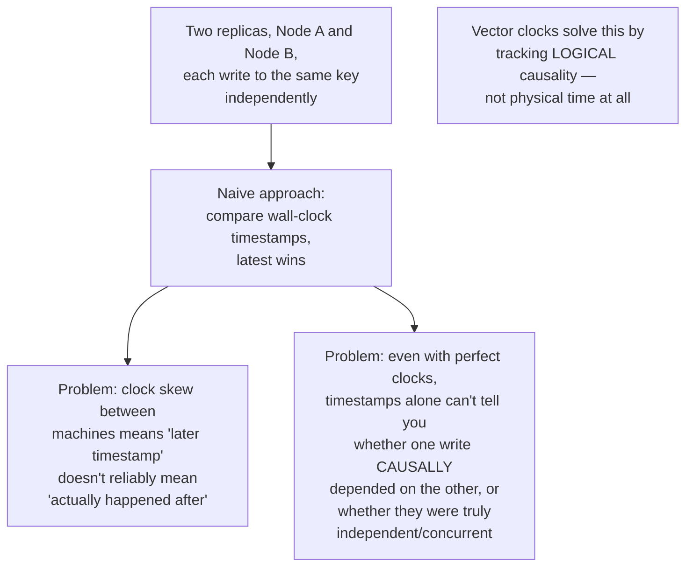

---

## 3. Vector Clock Structure & Rules

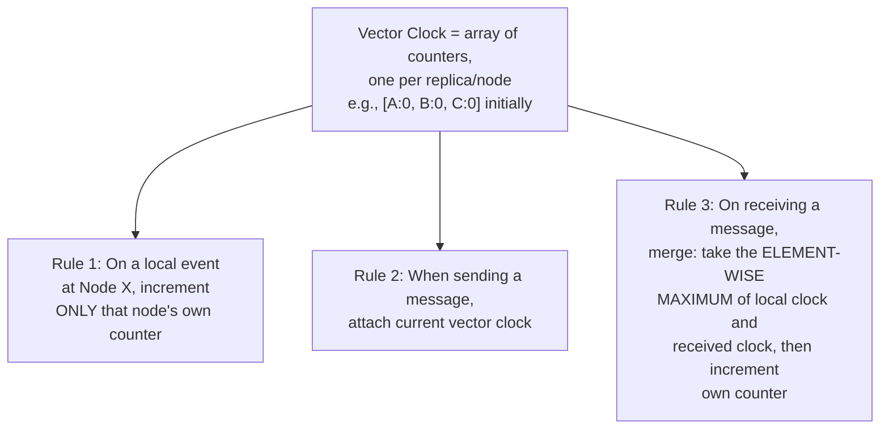

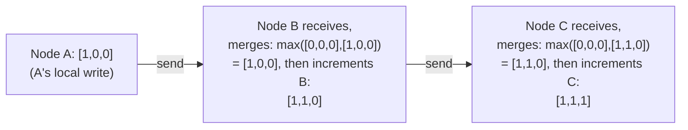

---

## 4. Comparing Vector Clocks — Determining Causality

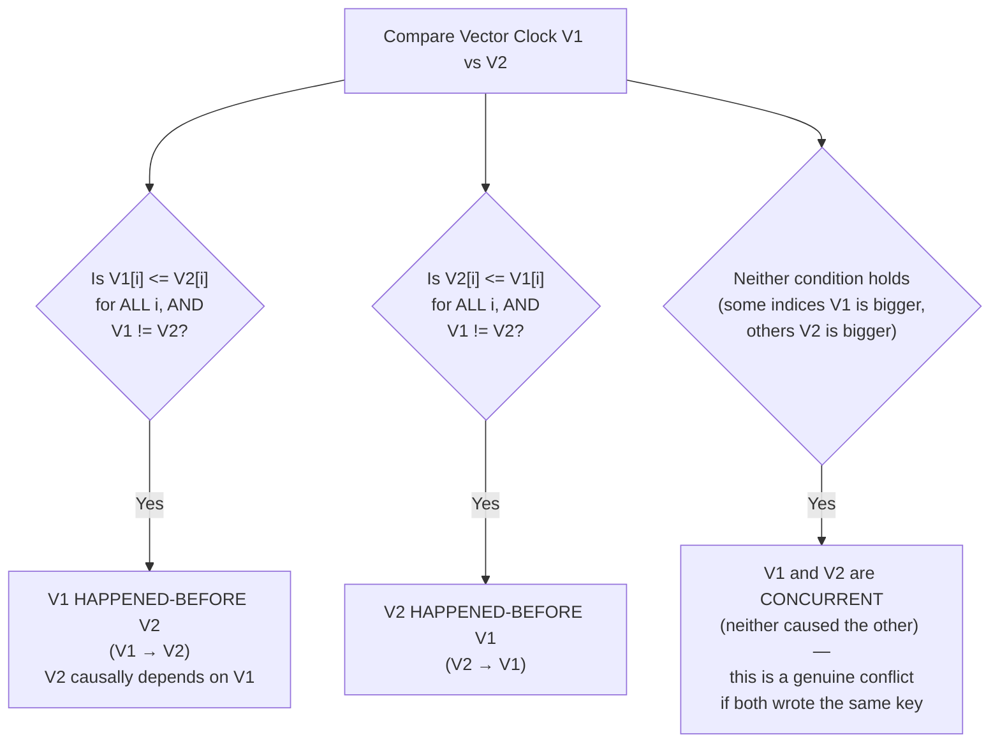

### Worked Example

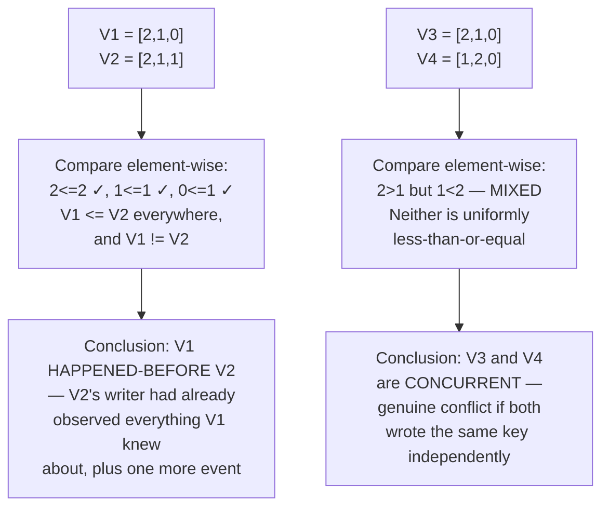

---

## 5. High-Level Architecture

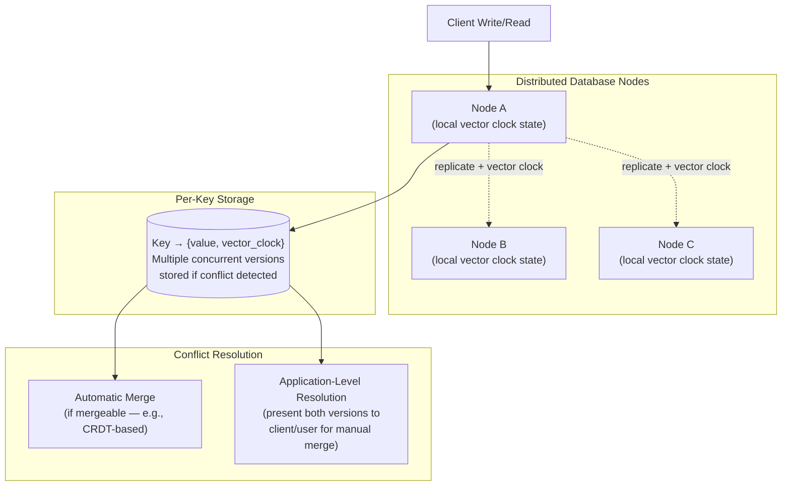

**Key idea:** Each stored value carries its vector clock alongside it. When a replica receives a write for a key, it compares the incoming vector clock against what it currently has stored. If the incoming write's clock strictly dominates (happened-after) the stored version, it's a clean update. If they're concurrent, **both versions must be preserved** — this is the core design implication of vector clocks: the system can detect conflicts precisely, but resolving them is a separate, deliberate step.

---

## 6. Write Flow with Conflict Detection — Detailed Sequence

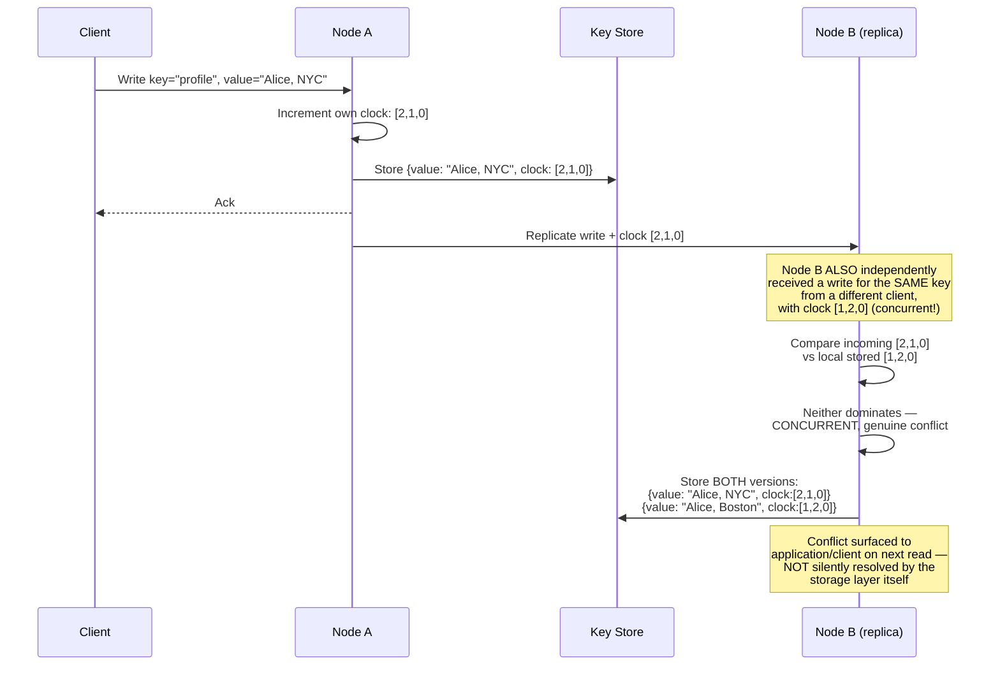

---

## 7. Conflict Resolution Strategies

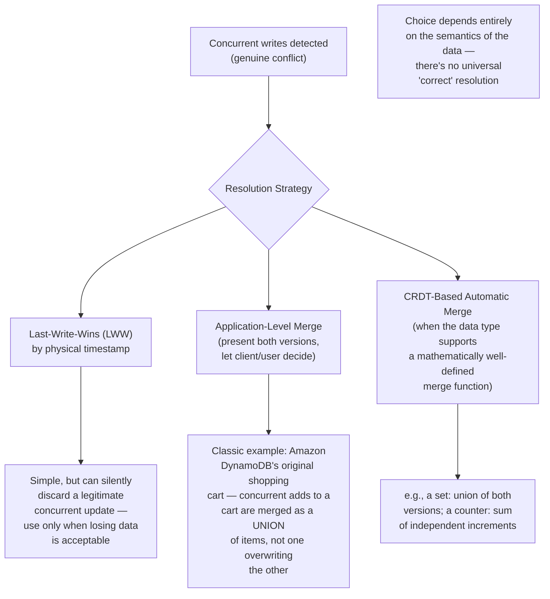

---

## 8. Read Repair (Reconciling Divergent Replicas)

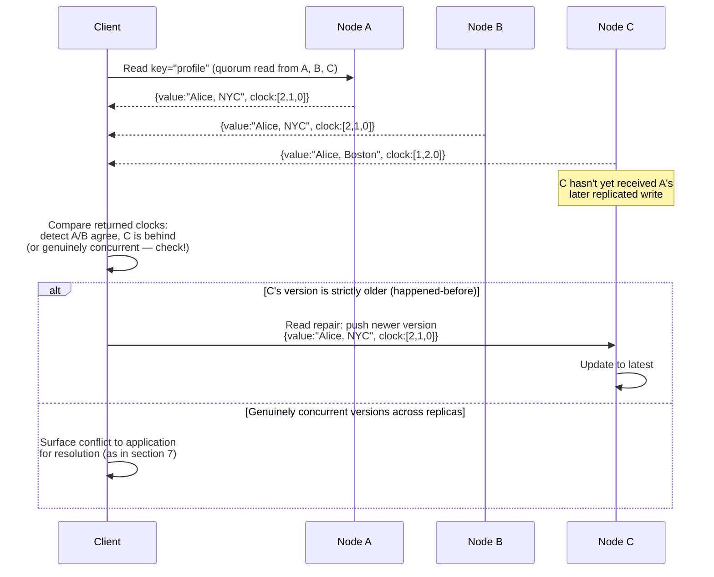

*"Read repair" is a common pattern in eventually-consistent systems (like Dynamo-style databases) where the act of reading from multiple replicas also opportunistically fixes replicas that have fallen behind — spreading the cost of consistency maintenance across normal read traffic rather than requiring a dedicated background process alone.*

---

## 9. The Scalability Problem With Vector Clocks

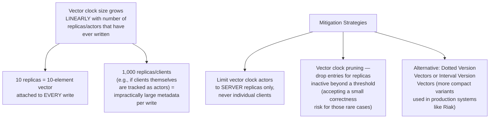

---

## 10. Component Responsibilities Summary

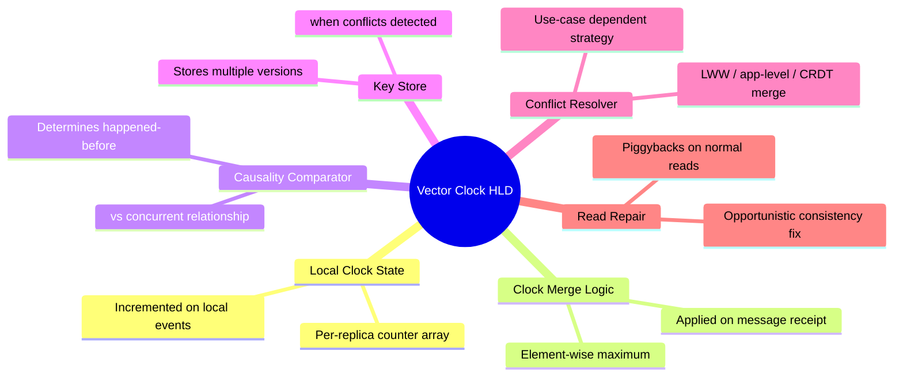

---

## 11. Key Design Decisions & Tradeoffs

| Decision | Choice | Why |
|---|---|---|
| Causality tracking | Vector clocks over physical timestamps | Physical clocks can't reliably distinguish "happened after" from "just has a later clock reading due to skew" |
| Conflict handling | Preserve both concurrent versions, don't silently pick one | Silently discarding one concurrent write loses data the application might genuinely need to reconcile |
| Resolution strategy | Pluggable (LWW / app-level / CRDT) based on data semantics | No single strategy is correct for all data types — a shopping cart needs union-merge, a "last status update" might be fine with LWW |
| Actor scope | Server replicas only, not individual clients | Keeps vector clock size bounded and practical; unbounded actor growth defeats the mechanism's efficiency |
| Consistency check on read | Read repair using quorum reads | Spreads consistency-maintenance cost across normal traffic rather than requiring a dedicated always-on background process |

---

## 12. Bottlenecks & Scaling Considerations

- **Metadata overhead grows with replica count** — this is vector clocks' fundamental scalability limitation; must be bounded by keeping the "actor" set to a small, stable number of server replicas rather than allowing it to grow with client count or over time.
- **Conflict resolution burden shifts to the application** — vector clocks excel at *detecting* conflicts precisely, but resolution logic must still be designed thoughtfully per data type; this is often underestimated complexity when adopting vector-clock-based systems.
- **Multiple stored versions increase storage cost** — keys with frequent concurrent writes accumulate multiple unresolved versions until reconciled; needs monitoring for keys with pathologically high conflict rates (often a sign of a data modeling issue — that key is being written to independently from too many places).
- **Clock pruning correctness tradeoff** — dropping inactive replica entries from vector clocks (to bound size) introduces a small risk of misclassifying causality involving very old writes; this tradeoff must be deliberate and bounded (e.g., prune only after a replica has been gone far longer than any realistic reconciliation window).
- **Testing causality logic is non-intuitive** — off-by-one errors in the increment/merge rules can silently corrupt causality tracking; this logic benefits enormously from extensive property-based testing (generating random concurrent event sequences and verifying causality relationships hold) rather than just example-based unit tests.
- **Interaction with sharding** — vector clocks track causality per-key (or per-shard) typically, not globally across an entire distributed database — designers must be explicit about the scope of causal guarantees (e.g., "causality is tracked within a key, not across different keys/shards") to avoid overpromising consistency the mechanism doesn't actually provide.
