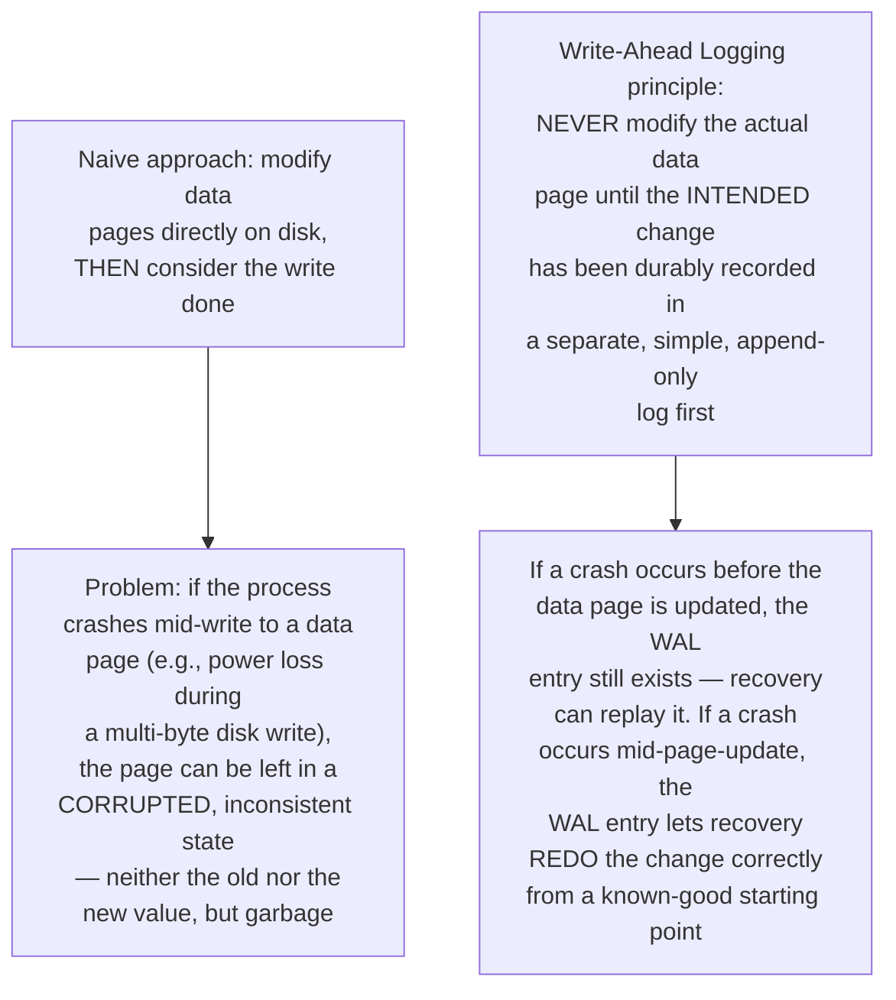
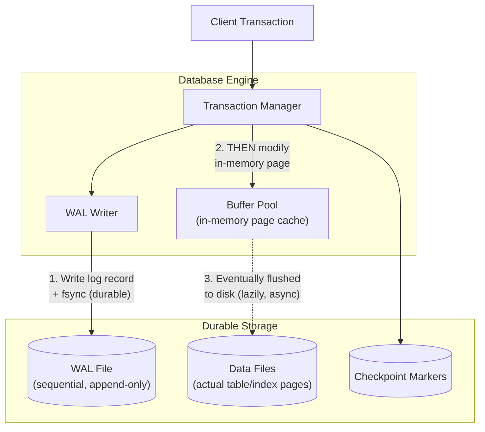
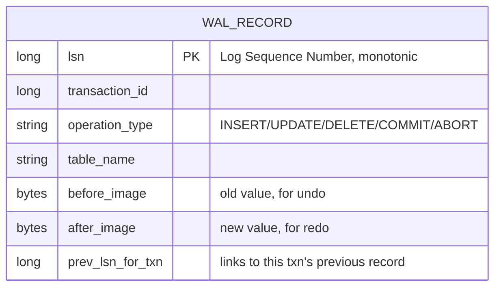
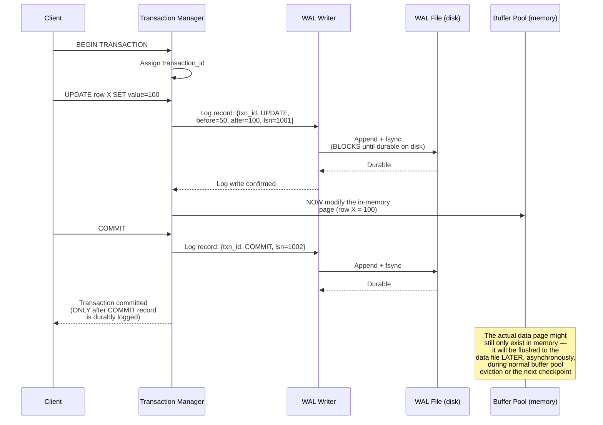
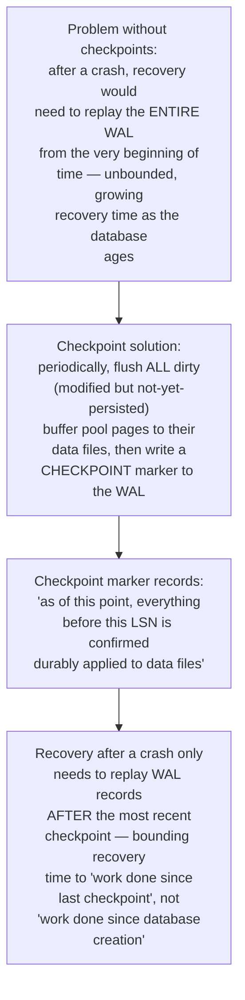
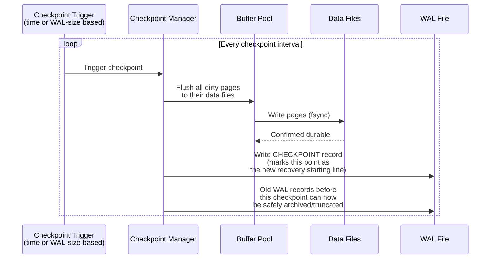
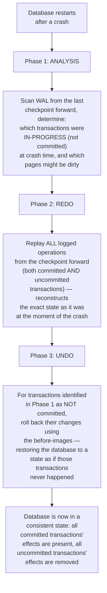
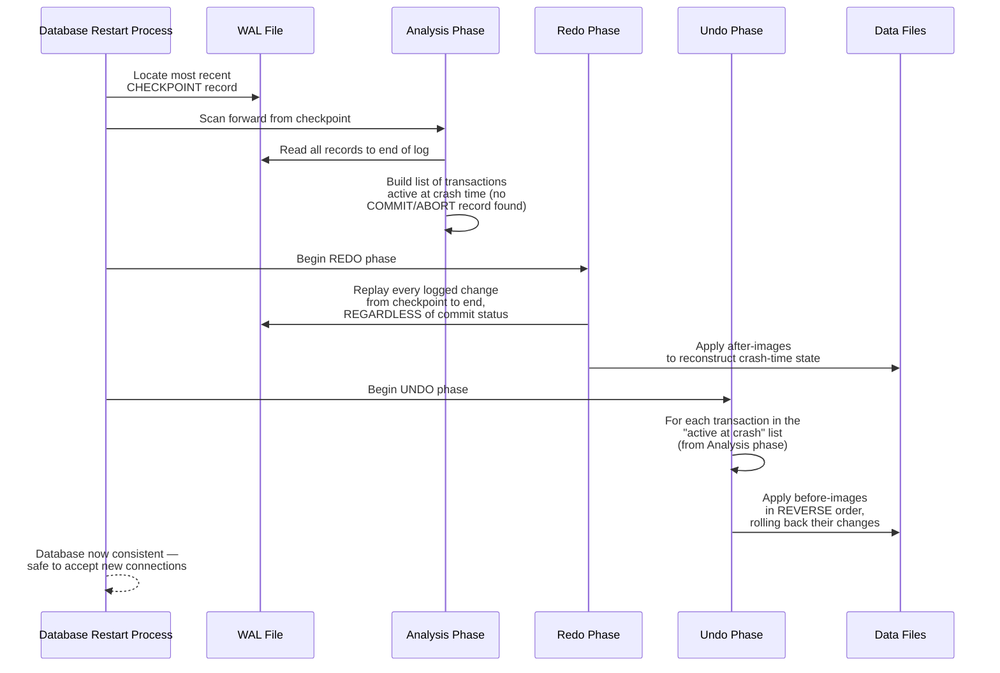
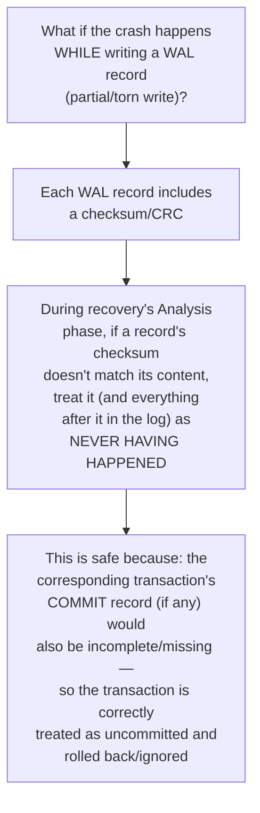

# Design a Write-Ahead Log (WAL) & Recovery System for a Custom Database Engine — High-Level Design Document

## 1. Requirements

### Functional Requirements
- Every data-modifying operation must be durably logged before being applied to the main data store
- On crash/restart, the database must be able to recover to a consistent state, replaying any committed-but-not-yet-flushed changes
- Support atomic multi-operation transactions (all-or-nothing)
- Enable point-in-time recovery (restore to any prior committed state, for backup/restore scenarios)

### Non-Functional Requirements
- **Durability (the paramount property):** Once a write is acknowledged to the client, it must survive any subsequent crash — no exceptions
- **Performance:** WAL writes are on the critical path of every transaction; must be optimized for sequential I/O
- **Recovery speed:** Time to recover after a crash should be bounded and predictable, not proportional to the entire database history
- **Correctness under partial writes:** Must handle the case where a crash occurs mid-write to the log itself

### Back-of-Envelope Estimation
| Metric | Value |
|---|---|
| Transactions/sec | ~50,000 |
| Avg WAL record size | ~200 bytes |
| WAL write throughput | ~10MB/sec sustained |
| Checkpoint interval | Every few minutes or N MB of WAL growth |
| Target recovery time | Seconds to low minutes, even after a hard crash |

---

## 2. The Core Principle — Why "Write-Ahead"

**The fundamental guarantee this provides:** By ensuring the log record hits durable storage *before* the corresponding data page modification, the system guarantees it can always reconstruct the correct final state after a crash — the log becomes the authoritative record of "what should have happened," independent of whether the actual data pages were fully updated when the crash occurred.

---

## 3. High-Level Architecture

**Key idea:** Note the strict ordering — the WAL write (step 1, synchronous, durable) always happens **before** the in-memory buffer pool modification (step 2), and the actual data file update (step 3) can happen much later, asynchronously. This ordering is what the entire durability guarantee rests on.

---

## 4. WAL Record Structure

**Why both before-image and after-image are stored:** The after-image supports **redo** (reapplying a committed change that didn't make it to the data file before a crash), while the before-image supports **undo** (rolling back a change from a transaction that was in-progress but never committed when the crash occurred). Having both is what enables the full ARIES-style recovery algorithm (covered below).

---

## 5. Transaction Write Flow — Detailed Sequence

**Why the client only gets "committed" after the COMMIT log record is durable:** This is the precise moment the durability guarantee kicks in — even if the process crashes one instruction later, the WAL contains everything needed to reconstruct this transaction's effects on restart. The actual data page update can safely lag behind in memory.

---

## 6. Checkpointing (Bounding Recovery Time)

---

## 7. Crash Recovery — The ARIES-Style Three-Phase Algorithm

**Why REDO-then-UNDO (not just skip uncommitted transactions during redo):** It might seem simpler to just redo only committed transactions — but determining "was this committed" often requires first reconstructing the full state (since a transaction's commit record itself is part of what needs replaying). The REDO-everything-then-UNDO-the-losers approach is what makes recovery a clean, mechanical, provably-correct process rather than requiring complex conditional logic during replay.

---

## 8. Recovery Flow — Detailed Sequence

---

## 9. Handling a Crash DURING WAL Writing Itself

---

## 10. Component Responsibilities Summary

```mermaid
mindmap
  root((WAL and Recovery HLD))
    WAL Writer
      Sequential append-only log
      Synchronous fsync before ack
      Checksummed records
    Transaction Manager
      Coordinates log-then-modify order
      Tracks transaction state
    Buffer Pool
      In-memory page cache
      Lazy/async flush to disk
    Checkpoint Manager
      Periodic dirty page flush
      Bounds recovery replay window
    Recovery Process
      Analysis: find in-progress txns
      Redo: replay all changes
      Undo: rollback uncommitted
```

---

## 11. Key Design Decisions & Tradeoffs

| Decision | Choice | Why |
|---|---|---|
| Write ordering | Log record durable BEFORE data page modification | This ordering is the entire foundation of the durability guarantee — reversing it would allow corrupted, unrecoverable states |
| Commit acknowledgment | Only after COMMIT log record is fsynced | Ensures the client's understanding of "committed" precisely matches what recovery can actually guarantee to reconstruct |
| Recovery algorithm | ARIES-style REDO-then-UNDO | Provides a clean, mechanical, provably-correct recovery process rather than complex conditional replay logic |
| Checkpointing | Periodic dirty-page flush + WAL truncation point | Bounds recovery time to "since last checkpoint" rather than the entire database history |
| Corruption handling | Per-record checksums | Safely and correctly handles the edge case of a crash occurring mid-write to the log itself |
| Data page flush timing | Lazy/asynchronous, decoupled from transaction commit | Allows the hot commit path to only pay the cost of a sequential WAL write, not a full random-access data page write |

---

## 12. Bottlenecks & Scaling Considerations

- **WAL fsync is the critical-path bottleneck** — since every commit must wait for a durable disk write, WAL throughput directly bounds transaction throughput; this is why WAL design prioritizes sequential-only writes (fast on both spinning disks and SSDs) and why many systems offer a "group commit" optimization (batching multiple transactions' log writes into one fsync call) to amortize this cost.
- **Checkpoint frequency tradeoff** — too frequent checkpointing adds I/O overhead and can cause latency spikes (flushing many dirty pages at once); too infrequent lengthens recovery time after a crash — this is tuned based on acceptable recovery time objectives (RTO) versus steady-state performance impact.
- **WAL storage growth and archival** — even with truncation after checkpoints, the WAL requires ongoing storage management; many systems archive old WAL segments to cheaper storage (supporting point-in-time recovery further back than the live truncation point) rather than deleting them outright.
- **Buffer pool size vs checkpoint cost** — a larger buffer pool holds more dirty pages between checkpoints, meaning each checkpoint has more to flush; this interacts with available memory and overall I/O capacity in ways that need holistic tuning, not independent optimization.
- **Group commit contention** — batching multiple transactions' commits into one fsync improves throughput but adds latency to the fastest individual transaction (it must wait for the batch); this is a direct throughput/latency tradeoff exposed as a tunable parameter in most production database engines.
- **Replication built on top of WAL** — many database replication mechanisms (streaming replication to standby replicas) work by shipping WAL records to followers, who replay them — meaning WAL design decisions here directly constrain and enable replication architecture, an important connection to the broader system beyond just crash recovery.
- **Testing recovery correctness is uniquely hard** — since the entire point of this system is correct behavior after ARBITRARY crash points, testing requires deliberately injecting crashes at many different points during transaction processing (including mid-WAL-write) and verifying recovery always produces a correct, consistent result — this needs dedicated fault-injection test infrastructure, not just normal-path testing.
