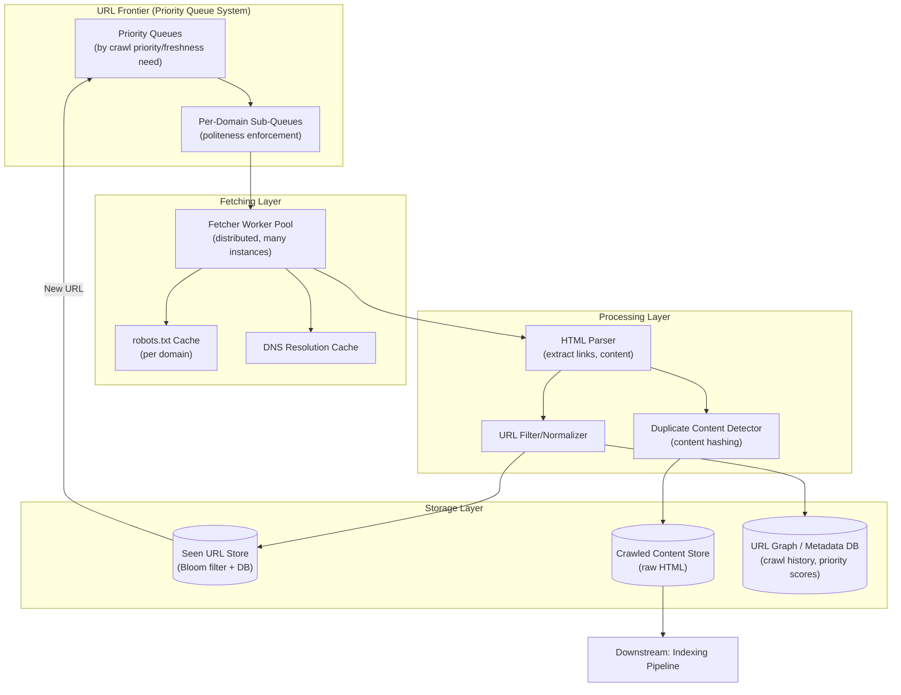
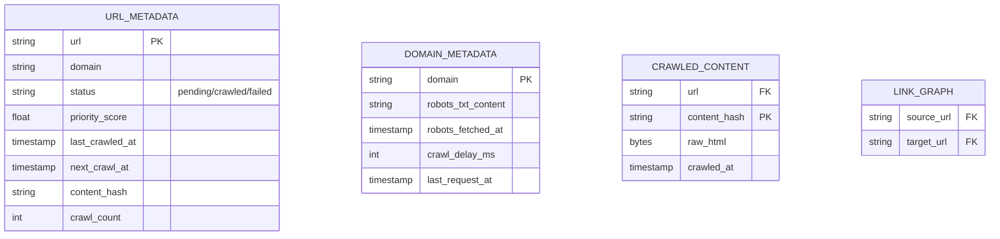
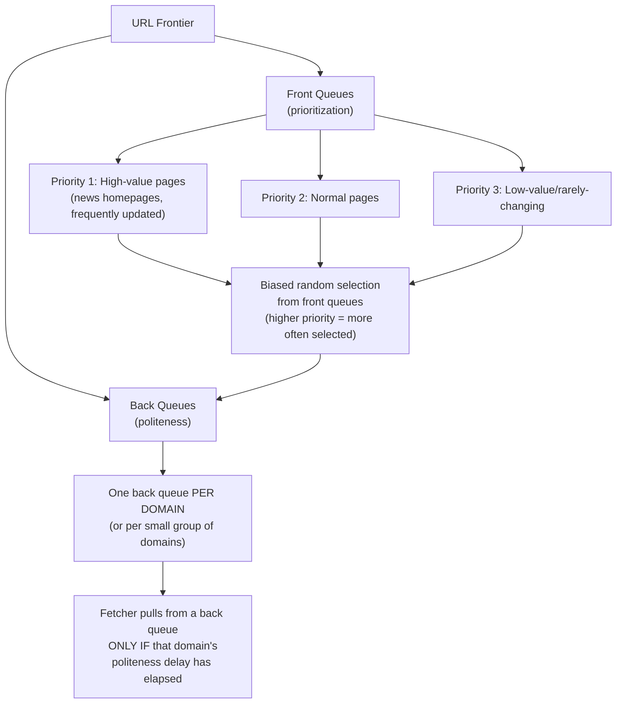
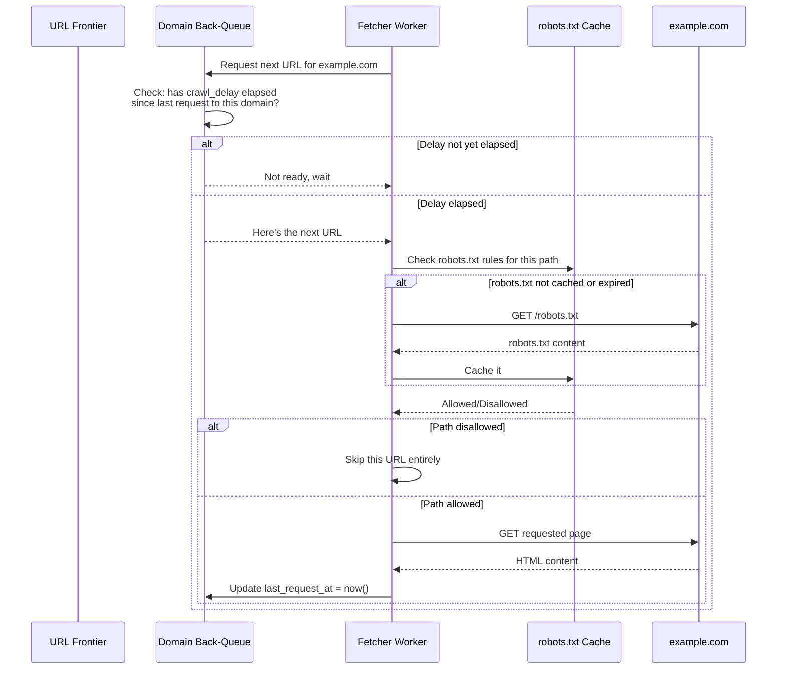
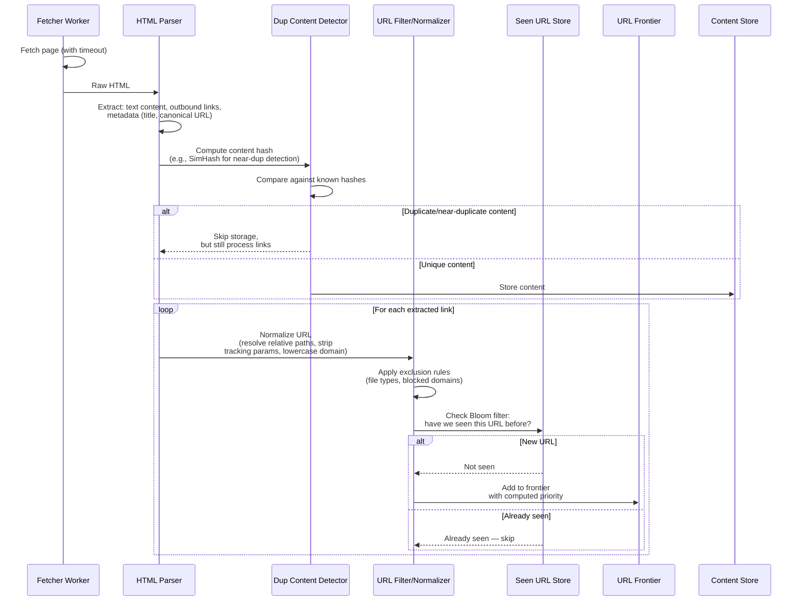
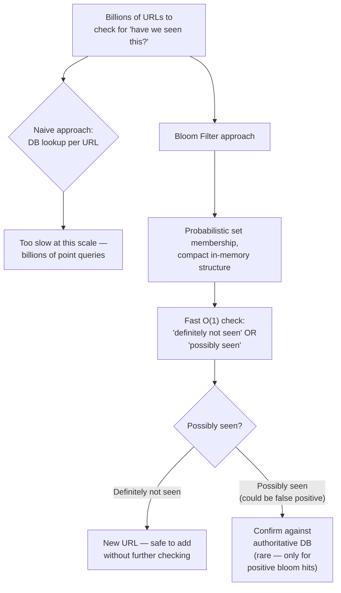
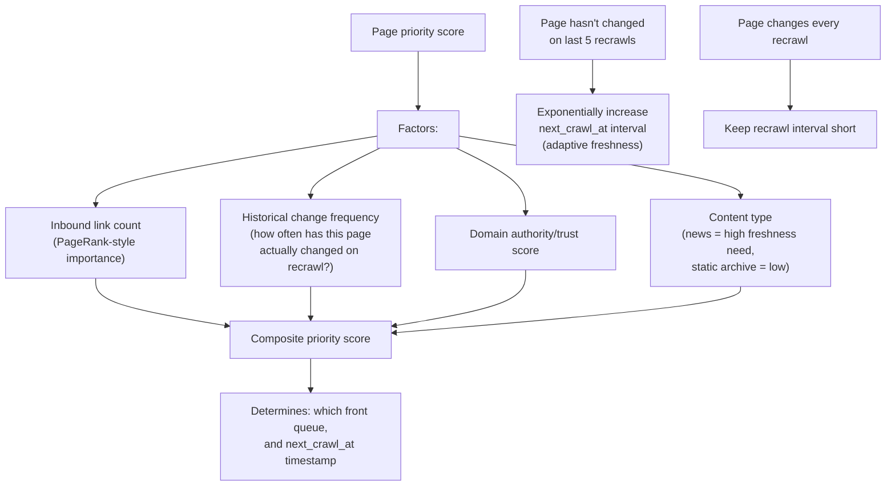
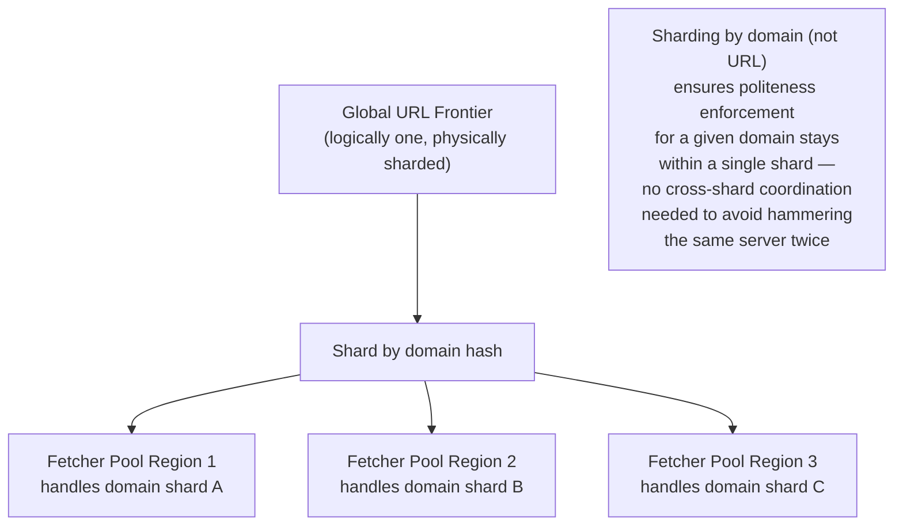
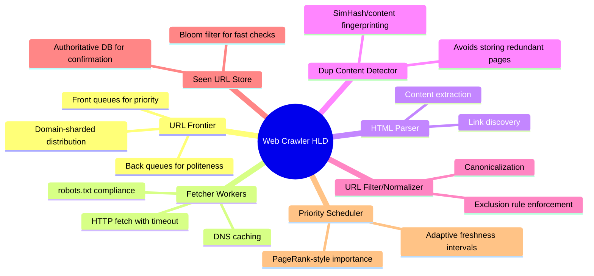

# Design a Web Crawler — High-Level Design Document

## 1. Requirements

### Functional Requirements
- Given seed URLs, discover and crawl linked pages recursively
- Extract and store page content for downstream indexing
- Respect `robots.txt` and crawl-delay directives (politeness)
- Avoid re-crawling the same URL redundantly within a short window
- Detect and handle duplicate content (different URLs, same content)
- Prioritize re-crawling frequently-changing pages more often than static ones

### Non-Functional Requirements
- **Scale:** Crawl billions of pages across the web
- **Politeness:** Never overwhelm any single web server with concurrent requests
- **Freshness:** Important/frequently-changing pages should be re-crawled more often
- **Efficiency:** Avoid wasted work — don't recrawl unchanged content, don't crawl duplicate/low-value pages
- **Fault tolerance:** Individual page failures (timeouts, 404s, malformed HTML) must not halt the overall crawl

### Back-of-Envelope Estimation
| Metric | Value |
|---|---|
| Total pages to crawl | ~10B+ |
| Pages crawled/sec (platform-wide) | ~10,000-50,000 |
| Avg page size | ~100KB (HTML) |
| URL frontier size | Billions of URLs queued at any time |
| Distinct domains | ~100M+ |
| Politeness delay per domain | Configurable, often 1+ seconds between requests |

---

## 2. High-Level Architecture

**Key idea:** The entire system revolves around the **URL Frontier** — a distributed priority queue system that must balance three competing concerns simultaneously: crawl priority (important pages first), politeness (don't hammer any one domain), and freshness (recrawl changing content more often). Everything downstream (fetching, parsing, storage) exists to feed URLs back into this frontier.

---

## 3. Data Model

---

## 4. URL Frontier Design (The Hard Problem)

*This two-tier front/back queue design (from the classic Mercator crawler architecture) elegantly decouples prioritization from politeness — the front queues decide *what's important*, while the back queues (one per domain) enforce *how fast we're allowed to hit any single server*, regardless of how urgently we want to crawl its content.*

---

## 5. Politeness Enforcement — Detailed Sequence

---

## 6. Page Fetch & Processing Pipeline

---

## 7. Seen-URL Detection at Scale (Bloom Filter)

**Why a Bloom filter:** At billions of URLs, storing and querying a traditional index for "have I seen this exact URL" is prohibitively expensive at the required throughput. A Bloom filter trades a small, tunable false-positive rate for massive space and speed savings — the rare false positives just mean an occasional unnecessary DB double-check, never a missed duplicate.

---

## 8. Crawl Priority & Freshness Scheduling

*This adaptive scheduling (inspired by how real search engine crawlers operate) avoids wasting crawl budget on static pages that never change, while ensuring frequently-updated pages (news sites, forums) are recrawled often enough to stay fresh in the index.*

---

## 9. Distributed Crawling Coordination

---

## 10. Component Responsibilities Summary

---

## 11. Key Design Decisions & Tradeoffs

| Decision | Choice | Why |
|---|---|---|
| Frontier architecture | Front/back queue split (Mercator-style) | Cleanly separates "what's important to crawl" from "how fast are we allowed to crawl it" |
| Politeness enforcement | Per-domain queue with delay tracking | Prevents overwhelming any single server, regardless of that domain's crawl priority |
| Duplicate URL detection | Bloom filter + authoritative DB fallback | Achieves near-constant-time checks at billions-of-URLs scale, at the cost of a tunable, rare false-positive rate |
| Duplicate content detection | Content hashing (SimHash for near-duplicates) | Prevents wasted storage/indexing on mirrored or near-identical pages across different URLs |
| Recrawl scheduling | Adaptive interval based on observed change frequency | Concentrates crawl budget on genuinely changing content instead of uniformly recrawling everything |
| Distribution strategy | Shard by domain, not by URL | Keeps politeness enforcement for a given domain within one shard, avoiding cross-shard coordination overhead |

---

## 12. Bottlenecks & Scaling Considerations

- **Politeness vs throughput tension** — the fundamental crawler tradeoff: going faster means crawling more content sooner, but politeness constraints per domain cap how fast any single domain can be crawled — overall throughput scales by increasing the *number of distinct domains* crawled in parallel, not by crawling any one domain faster.
- **URL frontier as a potential bottleneck** — with billions of URLs, the frontier itself must be a distributed system (sharded, likely backed by a distributed queue/DB), not a single in-memory structure.
- **Malicious/infinite crawl traps** — some sites generate infinite URLs dynamically (e.g., calendar pages with "next month" links forever); needs safeguards like max-depth limits, per-domain URL count caps, and pattern detection for URL-generating traps.
- **Fetch timeouts and slow servers** — a single unresponsive server shouldn't tie up fetcher resources indefinitely; aggressive timeouts and circuit-breaking per domain prevent slow sites from degrading overall crawl throughput.
- **DNS resolution overhead** — resolving domains repeatedly at this scale is expensive; a dedicated DNS cache layer significantly reduces redundant resolution work across the fetcher fleet.
- **Storage growth** — raw HTML for 10B+ pages is enormous; typically compressed heavily and/or only diffs stored for recrawled-but-unchanged pages, with old snapshots eventually archived to cold storage.
- **Freshness/coverage tradeoff** — crawl budget is always finite; prioritizing freshness (recrawling known pages) trades off against coverage (discovering new pages) — this balance is a continuous tuning decision, not a fixed architectural answer.
