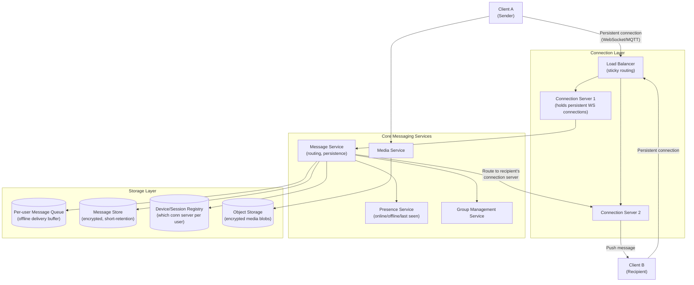
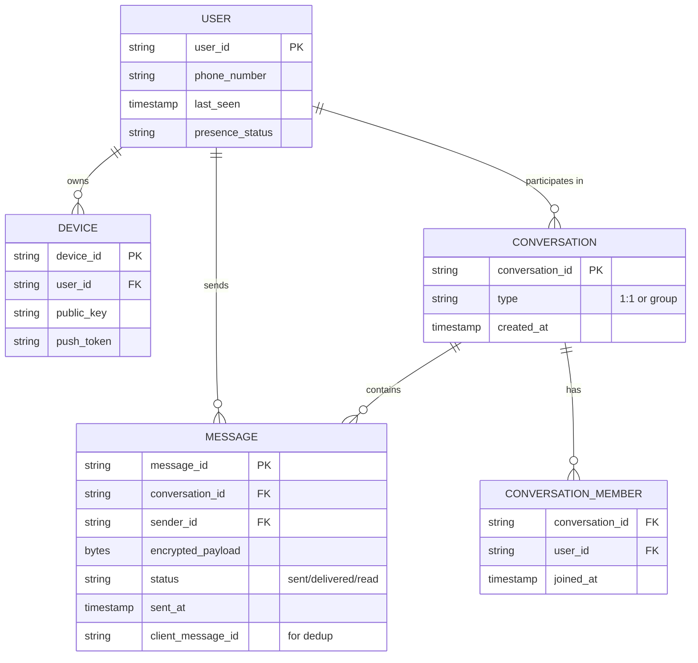
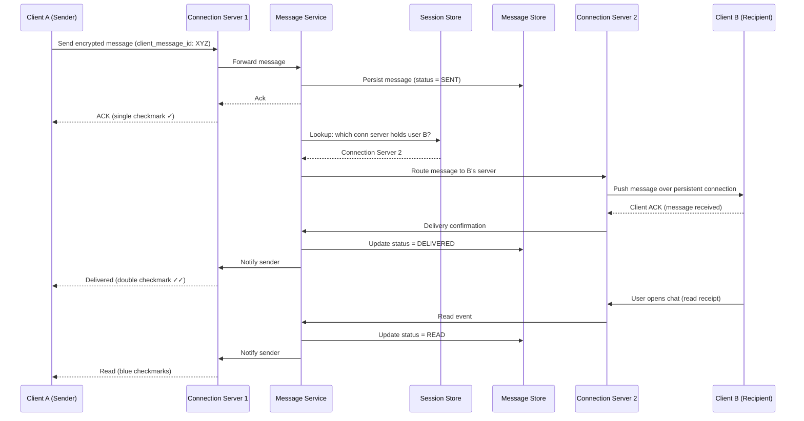
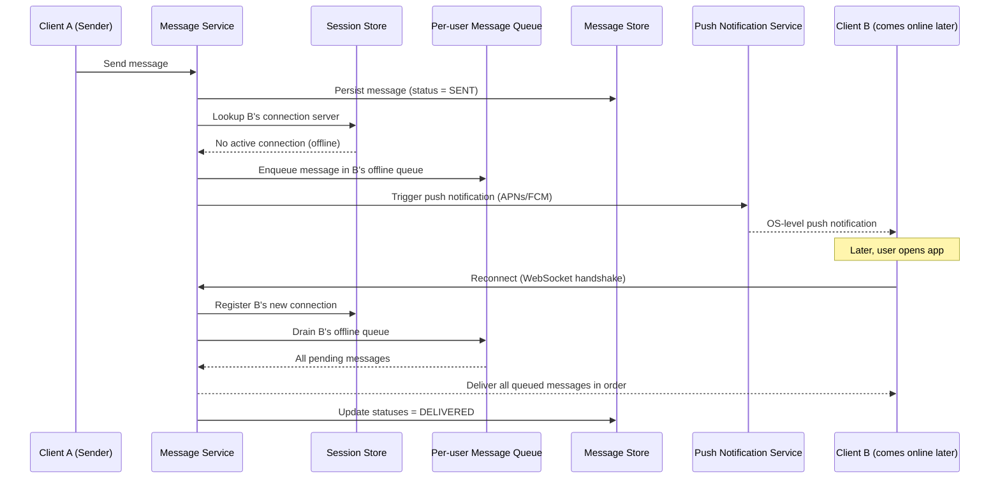
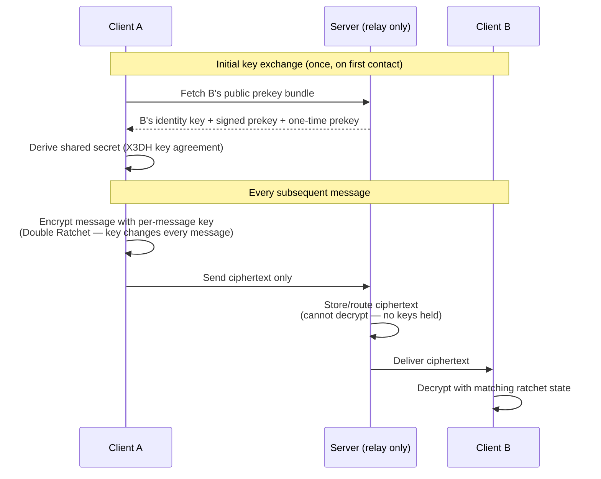
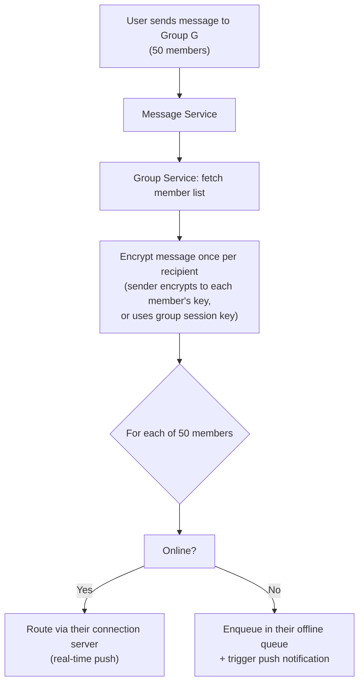
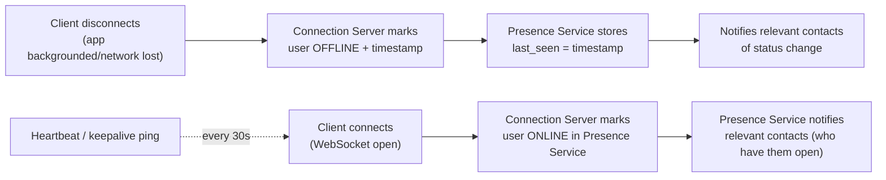
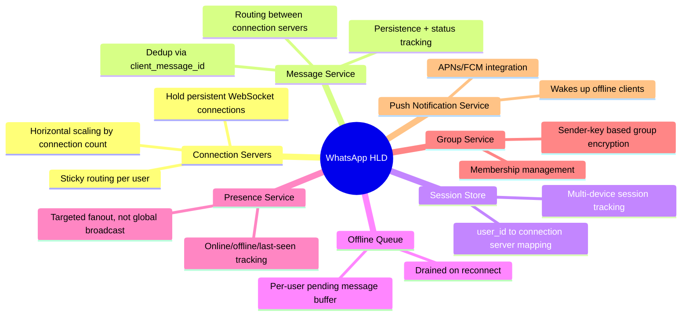

# Design WhatsApp/Messenger — High-Level Design Document

## 1. Requirements

### Functional Requirements
- 1:1 and group messaging (text, media, voice notes)
- Message delivery guarantees: sent, delivered, read receipts
- Online/offline presence, "last seen"
- End-to-end encryption
- Message sync across multiple devices
- Offline message queuing (deliver when user comes back online)

### Non-Functional Requirements
- **Scale:** ~2B users, ~100B messages/day
- **Low latency:** Message delivery < 100ms for online recipients
- **Durability:** Messages must never be lost, even if recipient is offline for days
- **At-least-once delivery**, deduplicated at the client
- **High availability:** Chat must work through network flakiness on mobile

### Back-of-Envelope Estimation
| Metric | Value |
|---|---|
| DAU | ~2B |
| Messages/day | ~100B |
| Messages/sec (avg) | ~1.2M |
| Messages/sec (peak, e.g. New Year) | ~5M+ |
| Avg message size | ~100 bytes (text) |
| Concurrent WebSocket/persistent connections | ~500M+ at peak |
| Connection servers needed | Thousands, each holding ~50K-100K connections |

---

## 2. High-Level Architecture

**Key idea:** Every client holds a long-lived persistent connection to a connection server. A `SessionStore` maps `user_id → which connection server they're attached to`, so the Message Service can route a message to the exact server holding the recipient's live socket — without broadcasting to the whole fleet.

---

## 3. Data Model

---

## 4. Message Send Flow (Online Recipient) — Detailed Sequence

---

## 5. Message Send Flow (Offline Recipient) — Detailed Sequence

**Key design point:** The offline queue guarantees at-least-once delivery — nothing is dropped if the recipient is offline, and the client deduplicates using `client_message_id` in case of retries or reconnect races.

---

## 6. End-to-End Encryption (Simplified — Signal Protocol Style)

**Key idea:** The server is a **blind relay** — it only ever stores/forwards encrypted ciphertext. It never has access to plaintext or the encryption keys, so even a full server compromise doesn't expose message content. This is why "message storage" on the server is short-retention: once delivered, plaintext-decryptable copies exist only on client devices.

---

## 7. Group Messaging Fanout

*Group encryption in practice uses **sender keys** (a shared symmetric key per group, rotated on membership change) rather than encrypting individually to each member's key — this avoids O(N) encryption cost per message for large groups.*

---

## 8. Presence System ("Online" / "Last Seen")

*Presence is deliberately **not** broadcast globally — it's only pushed to users who currently have that contact's chat open or in their contact list view, to avoid massive unnecessary fanout for a low-value signal.*

---

## 9. Component Responsibilities Summary

---

## 10. Key Design Decisions & Tradeoffs

| Decision | Choice | Why |
|---|---|---|
| Connection model | Persistent WebSocket/MQTT per client | Enables real-time push without polling; critical for instant delivery UX |
| Routing | Session store maps user → connection server | Avoids broadcasting messages to the entire server fleet |
| Delivery guarantee | At-least-once + client-side dedup | Simpler server logic; exactly-once is enforced cheaply at the edge via message IDs |
| Offline handling | Per-user durable queue + push notification | Ensures no message loss regardless of recipient connectivity |
| Encryption | End-to-end (Signal Protocol / Double Ratchet) | Server never sees plaintext — strongest privacy guarantee, survives server compromise |
| Group encryption | Sender-key model | Avoids O(N) per-message encryption cost for large groups |
| Message retention on server | Short-lived, deleted after delivery confirmation | Server storage isn't the source of truth long-term; devices hold decrypted history |
| Presence fanout | Targeted, not global | Presence updates for 2B users would be enormous if broadcast indiscriminately |

---

## 11. Bottlenecks & Scaling Considerations

- **Connection server capacity** — each server can hold a bounded number of concurrent sockets (memory/FD limits); scale horizontally, use efficient protocols (MQTT/custom binary over WebSocket) to minimize per-connection overhead.
- **Session store as a critical hot path** — every message send requires a session lookup; must be extremely low-latency (in-memory KV, e.g., Redis) and highly available, since it's on the critical path for every single message.
- **Reconnect storms** — mobile networks cause frequent disconnects (switching wifi/cellular); connection servers must handle high churn without overwhelming the session store with re-registration traffic.
- **Multi-device sync** — a user with phone + web + desktop needs messages delivered to all active sessions consistently; requires per-device delivery tracking, not just per-user.
- **Offline queue growth for inactive users** — a user offline for weeks accumulates a large queue; needs bounded retention (e.g., messages older than 30 days expire) and efficient bulk-drain on reconnect.
- **Group fanout at scale** — very large groups (thousands of members, e.g., broadcast lists/communities) stress the per-member fanout path; may need dedicated batch-fanout workers separate from the 1:1 hot path.
- **Push notification reliability** — APNs/FCM aren't instant or guaranteed; can't be the sole mechanism for "did the user get notified" — server-side offline queue remains the source of truth.
