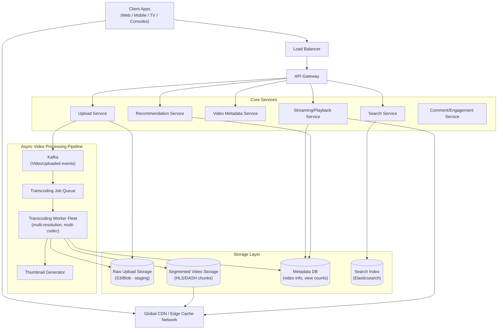
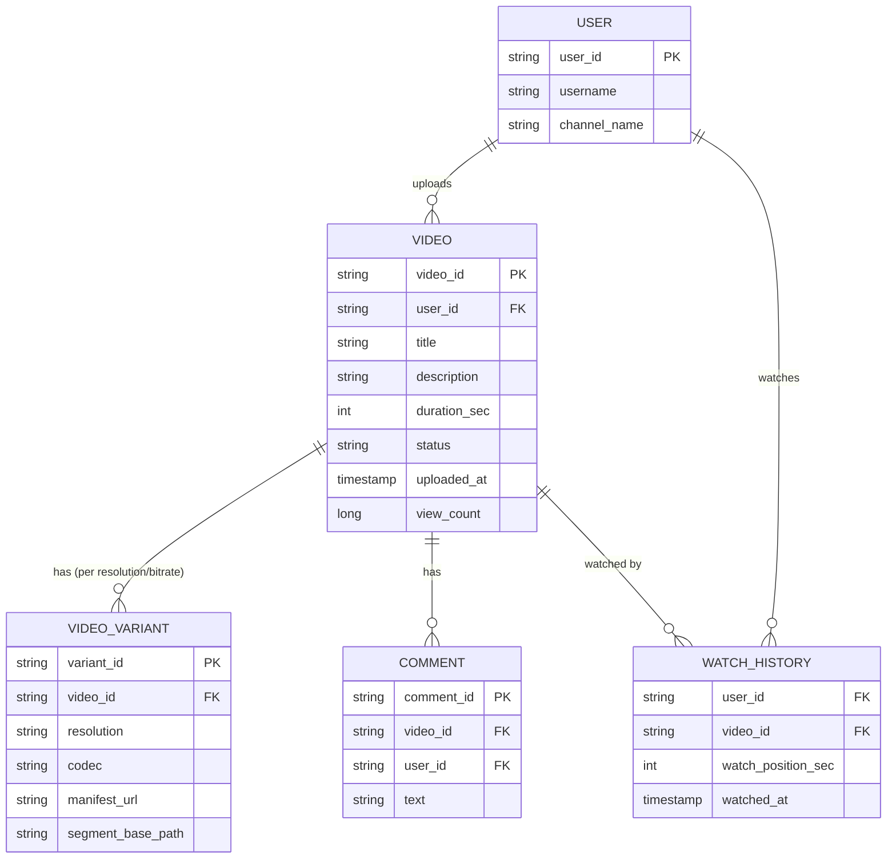
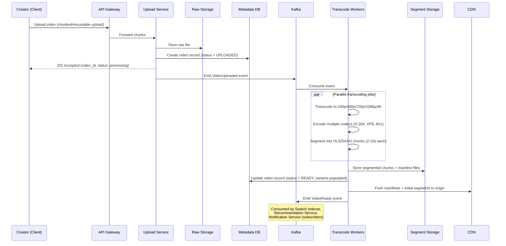
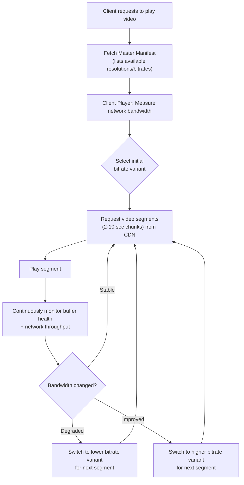
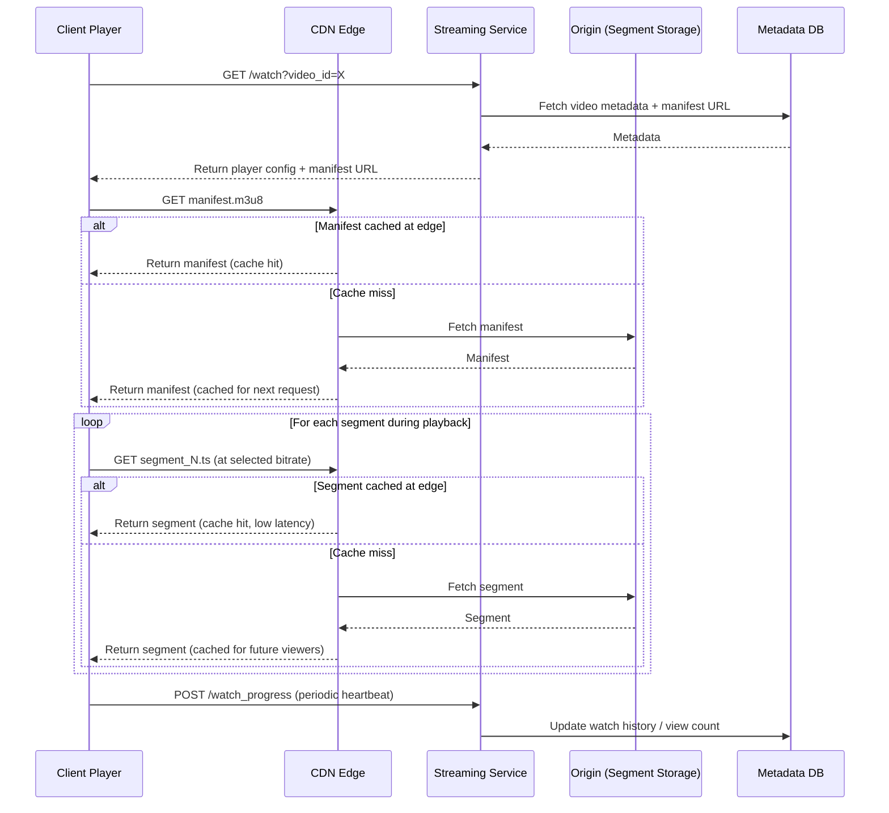
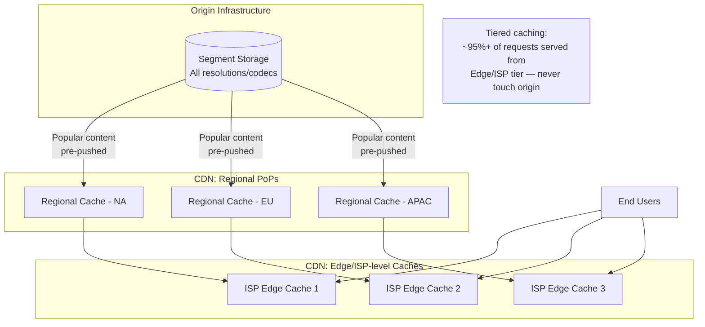
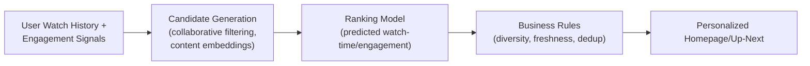
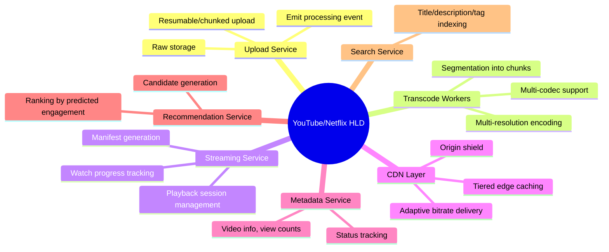

# Design YouTube/Netflix — High-Level Design Document

## 1. Requirements

### Functional Requirements
- Users can upload videos
- Videos are processed into multiple resolutions/bitrates for adaptive streaming
- Users can stream/watch videos with minimal buffering
- Support seeking, resuming playback
- Recommendations, search, comments, likes
- Support for live streaming (stretch goal)

### Non-Functional Requirements
- **Scale:** ~2B users, ~500 hours of video uploaded/minute (YouTube-scale)
- **Streaming latency:** Video should start playing < 1-2 seconds after click
- **Adaptive bitrate:** Playback quality should adjust to network conditions in real time
- **High availability:** Streaming must gracefully degrade, never hard-fail
- **Durability:** Uploaded video must never be lost once processing confirms success

### Back-of-Envelope Estimation
| Metric | Value |
|---|---|
| Hours uploaded/minute | ~500 hours |
| Avg video size (raw) | ~1GB for 10 min HD |
| Daily storage growth (raw + all transcoded variants) | Petabytes/day |
| Concurrent streams (peak) | ~50M+ |
| CDN egress bandwidth | Dominant cost driver — Tbps scale |
| Transcoding compute | Massive parallel compute farm, GPU-accelerated |

---

## 2. High-Level Architecture

**Key idea:** Upload and playback are entirely decoupled by an async transcoding pipeline. A video isn't watchable until workers have produced multiple resolution/bitrate variants, chunked into small segments for adaptive streaming, and pushed to CDN-friendly storage.

---

## 3. Data Model (ER Diagram)

---

## 4. Upload & Transcoding Pipeline

---

## 5. Adaptive Bitrate Streaming (Playback)

*This is the core of HLS/DASH adaptive streaming: video is pre-cut into small independently-decodable segments at multiple quality levels. The player switches quality **between segments**, not mid-segment, based on real-time network conditions.*

---

## 6. Streaming Playback — Detailed Sequence

---

## 7. CDN & Content Delivery Strategy

*This is exactly how Netflix's "Open Connect" and YouTube's edge network operate — placing caching appliances as close to end-users (often inside ISP networks) as possible, since video bandwidth dominates infrastructure cost.*

---

## 8. Recommendation Pipeline (Simplified)

---

## 9. Component Responsibilities Summary

---

## 10. Key Design Decisions & Tradeoffs

| Decision | Choice | Why |
|---|---|---|
| Upload/playback decoupling | Async transcoding pipeline | Video isn't watchable until processed; keeps upload path fast and simple |
| Streaming protocol | HLS/DASH (segmented adaptive streaming) | Enables per-segment quality switching without interrupting playback |
| Multi-resolution encoding | Transcode into several fixed resolutions/bitrates upfront | Avoids expensive real-time transcoding per viewer; pay compute cost once |
| CDN architecture | Tiered caching, ISP-embedded edge nodes | Video bandwidth is the dominant cost; minimizing origin egress is critical |
| Segment size | Small chunks (2-10s) | Enables fast quality switches and quick playback start (only need first segment) |
| Metadata vs segment storage | Separated | Metadata DB is small/hot (frequent reads); segment storage is massive/cold-ish (served mostly via CDN) |

---

## 11. Bottlenecks & Scaling Considerations

- **Transcoding compute cost** — the single largest infra cost after CDN egress; use spot/preemptible compute fleets, GPU acceleration, and prioritize popular-format transcodes first (e.g., transcode 1080p before 4K if a video is likely low-traffic).
- **CDN cache misses for long-tail content** — unpopular videos won't be pre-warmed at edge; accept higher origin fetch latency for cold content, optimize only for the popularity curve's head.
- **Thundering herd on new viral content** — many simultaneous requests for the same just-uploaded segment; use CDN request coalescing (single origin fetch serves many waiting edge requests).
- **Live streaming** (if supported) — fundamentally different pipeline: can't pre-transcode; needs real-time encoding ladders and much smaller segment/latency budgets (sub-second to few-second glass-to-glass latency).
- **Storage cost for all variants** — storing every resolution/codec combination for every video is expensive; can lazily transcode rarely-requested combinations (e.g., AV1 for a video with 10 lifetime views) rather than upfront.
- **Global consistency of view counts** — exact real-time counts aren't critical; use approximate/eventually-consistent counters aggregated asynchronously rather than synchronous increments per view.
