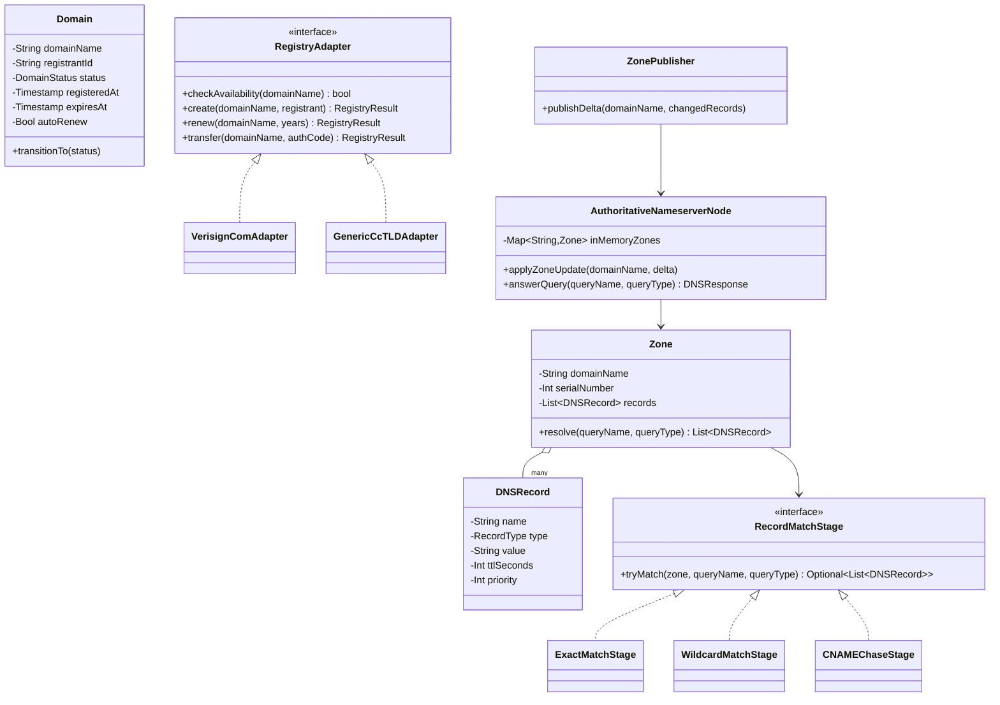
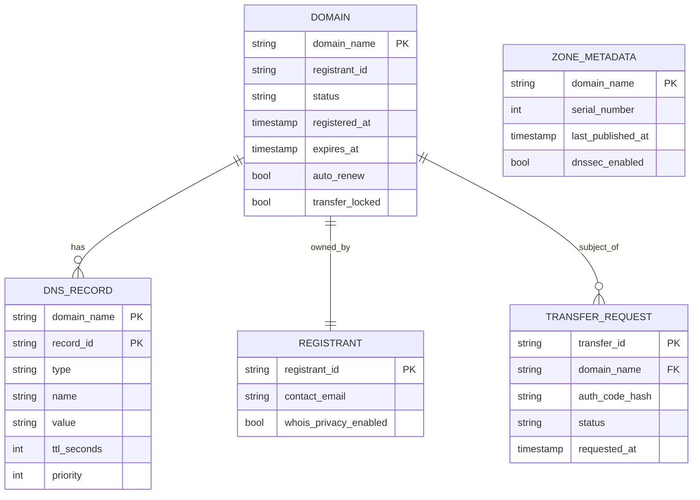
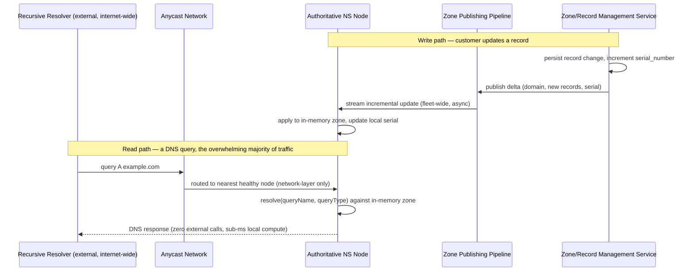

# Domain Registrar & DNS Hosting System (GoDaddy-style) — HLD & LLD

**Assumed metrics** (call out if different): ~80M domains under management · aggregate DNS query volume ~50-100B/day, peak ~1-2M QPS · registration/renewal/transfer operations ~tens of thousands/day (orders of magnitude below query volume) · DNS query response p95 < 50ms globally · domain-ownership operations require strong consistency; DNS record serving is AP, bounded by TTL · multi-region, globally anycast-distributed DNS-serving fleet.

**Scope, explicitly enumerated**: domain search and registration (talking to the actual TLD registry, e.g., Verisign for `.com`, on the registrant's behalf) · renewal (including auto-renewal billing) and transfer between registrars · WHOIS/RDAP lookup (with privacy-proxy option) · DNS zone/record management (A, AAAA, CNAME, MX, TXT, NS, SOA, SRV, and DNSSEC signing) · authoritative DNS query serving at internet scale · domain lifecycle (active → expired → grace period → redemption → released) · DDoS resilience for the DNS-serving fleet, which is one of the most commonly attacked pieces of internet infrastructure in existence.

**The two halves of this system have almost nothing in common operationally**, which is why they're architected as genuinely separate systems sharing only a domain-ownership relationship, not a shared runtime: the **Registrar/Registry side** is low-volume, transactional, and talks a formal external protocol (EPP) to a small number of authoritative registries; the **DNS-serving side** is enormous-volume, read-dominated, latency-critical, and is one of the most attacked pieces of infrastructure on the internet (DNS amplification/reflection attacks specifically target authoritative nameservers). Conflating them into one architecture would force the wrong trade-offs on both.

---

# Phase 2: High-Level Design (HLD)

## 1. Scope & System Estimation

**Functional Requirements**
- Search domain availability and register a new domain, which requires actually communicating with the TLD's registry (the authoritative source of "who owns this domain," which the registrar does not itself own — a registrar is an intermediary)
- Renew domains (manually or via auto-renew billing) before expiration; handle the post-expiration grace/redemption lifecycle correctly
- Transfer a domain in or out to/from another registrar (auth-code-based, registry-mediated)
- Manage DNS zone records per domain (create/update/delete A/AAAA/CNAME/MX/TXT/NS/SRV records, configure DNSSEC)
- Serve authoritative DNS answers for every hosted domain's records, globally, at very low latency, to any recursive resolver on the internet that asks
- Provide WHOIS/RDAP lookup, respecting privacy-proxy settings where the registrant has opted for it
- Withstand DDoS attacks against the DNS-serving fleet, including reflection/amplification attempts that abuse DNS's own query/response asymmetry

**Non-Functional Requirements**
- **Domain ownership consistency: strongly consistent (CP), unambiguously** — two people racing to register the same available domain must not both succeed, and a domain must never end up in an ambiguous ownership state; this is a direct structural cousin of the banking design's "a balance must never be wrong" requirement, applied here to "a domain must never have two simultaneous legitimate owners."
- **DNS record serving: AP, deliberately, at internet scale** — a DNS answer that's stale by up to its TTL is not just acceptable but is literally the protocol's own designed-in staleness contract (that's what TTL means); this is the most purely protocol-mandated AP requirement anywhere in this conversation, since RFC-level DNS semantics *define* how stale an answer is allowed to be.
- Latency: DNS resolution must be extremely fast and globally uniform — a slow DNS answer delays every subsequent step of loading anything on that domain, making this arguably the tightest, most universally-felt latency requirement of any system in this conversation.
- Availability: the DNS-serving fleet's availability requirement is about as close to "must never go down" as any system gets — if it's unreachable, every service under every hosted domain becomes unreachable too, transitively; this is a stronger transitive-blast-radius argument for extreme availability than almost anything else designed in this thread.
- Security: DDoS resilience is a first-class, not secondary, requirement — DNS infrastructure is one of the most frequently weaponized targets on the internet precisely because small queries can produce disproportionately large responses (amplification).
- Compliance: registrar operations must conform to ICANN policy (e.g., mandatory transfer-lock/auth-code mechanics, WHOIS/RDAP data requirements, redemption-grace-period rules) — this system doesn't get to invent its own domain-lifecycle rules, it implements an externally-specified one.

**Back-of-the-Envelope Estimation**
- 1-2M QPS peak DNS query load, globally distributed and extremely read-heavy (a query never mutates anything) — this single fact is what justifies an architecture where the serving fleet holds **entirely in-memory, read-only zone data**, with zero database round-trips on the query-answering hot path; a single authoritative-NS node design that hit a database per query would never come close to this latency/throughput bar.
- Registration/renewal/transfer operations at tens of thousands/day is **roughly 5-6 orders of magnitude below** DNS query volume — this gap is exactly why registrar operations and DNS serving must be architecturally separate systems; sizing the DNS-serving fleet for query load and sizing the registrar control plane for transactional-registry-protocol load are completely different engineering problems.
- Zone data footprint: 80M domains × a modest average record count (say, 5-10 records/domain for A/MX/TXT/etc.) ≈ **400M-800M total DNS records** — while this is a meaningful amount of data, it's small enough in aggregate (likely tens of GB, not petabytes) to be fully replicated in-memory across every authoritative-NS node worldwide, which is precisely the property that makes zero-database-hop query answering feasible at all.
- Propagation requirement: when a zone record changes, it must reach every globally-distributed authoritative-NS node within a bounded window — DNS's own TTL mechanism gives some slack here (a resolver won't re-query before the TTL expires anyway), but the *authoritative* answer itself should update within seconds to a low number of minutes of a customer's change, which is the propagation-latency target the Zone Publishing Pipeline (§2) is built around.
- DDoS headroom: amplification attacks can generate query volumes many multiples of legitimate peak traffic in a short burst — the serving fleet's capacity planning and rate-limiting posture (§4) has to assume attack traffic can dwarf the 1-2M legitimate-QPS baseline, not just plan for organic growth.

## 2. System Architecture & Components

**Architecture Style**: Two cleanly separated systems joined by a shared "who owns this domain and what should its zone say" data relationship. The **Registrar/Registry side** is a conventional transactional microservices architecture (not unlike the banking design's Orchestration + Ledger split, applied to domain ownership instead of money) talking to external registries over a formal protocol. The **DNS-serving side** reuses the **control-plane/data-plane split and anycast/GSLB routing model established in the Load Balancer design**, but pushed to its logical extreme: the data plane here is not just stateless-per-request, it's **entirely in-memory, read-only, and globally anycast-replicated**, because DNS query latency and availability requirements are stricter than almost anything else in this conversation.

**Component Breakdown**

*Registrar / Registry side:*
- **Domain Search & Registration Service**: checks availability, orchestrates new registrations, computes pricing/promotions
- **EPP Gateway**: the protocol adapter to TLD registries — speaks the Extensible Provisioning Protocol (EPP, the actual standard registrar-registry protocol, XML-over-TLS) for domain `check`/`create`/`renew`/`transfer`/`delete` commands, respecting each registry's own rate limits and idiosyncrasies
- **Domain Lifecycle Service**: owns the domain's state machine (`ACTIVE → EXPIRED → AUTO_RENEW_GRACE_PERIOD → REDEMPTION_PERIOD → PENDING_DELETE → AVAILABLE`), enforced per ICANN policy timelines
- **Billing/Subscription Service**: recurring renewal billing, auto-renew enrollment — a transactional financial concern with real overlap in rigor with the banking design's ledger discipline, though narrower in scope (subscription billing, not a general ledger)
- **WHOIS/RDAP Service**: public registration-info lookup, respecting privacy-proxy settings (serves the proxy's contact info instead of the registrant's, when enabled)
- **Domain Transfer Service**: handles inbound/outbound transfers via auth codes, coordinating with the losing/gaining registrar and the registry per ICANN's transfer policy

*DNS Management side (control plane):*
- **Zone/Record Management Service**: CRUD for DNS records per domain — the authoritative source of truth for "what should this domain's zone say," strongly consistent for the same reason banking's ledger is (a wrong/conflicting record set is a real correctness bug, not a staleness nicety)
- **DNSSEC Signing Service**: signs zone data cryptographically so resolvers can verify authenticity, re-signing on a rotation schedule and on zone changes
- **Zone Publishing Pipeline**: pushes zone-data updates from the Record Management Service out to every authoritative-NS node globally — this is a direct structural reuse of the Load Balancer design's xDS-style incremental streaming push (control plane → data-plane nodes), here pushing DNS zone data instead of routing/target-health data

*DNS Serving side (data plane):*
- **Authoritative Nameserver Fleet**: globally distributed nodes, each holding the *entire* zone dataset in-memory (per the §1 estimation, this is feasible at this data volume), answering DNS protocol queries (UDP primarily, TCP for large responses) directly from memory with zero external calls on the hot path
- **Anycast Network**: the same architectural role as the Load Balancer design's GSLB/anycast layer — every authoritative-NS node advertises the same anycast IP(s), and network-layer routing sends each query to the topologically nearest healthy node, with zero DNS-level (or even application-level) involvement in that routing decision
- **DDoS Mitigation Layer**: response-rate limiting, query-pattern anomaly detection, and traffic-scrubbing capacity specifically sized for amplification-attack scenarios, sitting in front of (or integrated into) the Authoritative Nameserver Fleet

**Data Flow Walkthrough**

*Write path (registering a new domain):*
1. User searches a domain name → Domain Search Service checks local cache/recent-registry-response cache for a fast preliminary answer, but the **authoritative availability check and the actual registration must go to the registry itself** via the EPP Gateway — a domain's true availability can only be confirmed by its registry, not by any cached data the registrar holds.
2. On "register," the EPP Gateway sends an EPP `create` command to the registry. This is the moment analogous to the banking ledger's atomic, idempotent commit: the registry itself is the final arbiter and uses its own atomicity to prevent two simultaneous registrations of the same name from both succeeding — the registrar's job is to submit the request correctly and handle the registry's authoritative accept/reject response, not to invent its own conflict-resolution logic for a resource it doesn't own.
3. On success, Domain Lifecycle Service creates the local domain record (status `ACTIVE`, expiration date, auto-renew setting) and Billing Service establishes the recurring renewal subscription.
4. Zone/Record Management Service initializes a default zone (or the customer's chosen initial records) for the new domain, which flows into the Zone Publishing Pipeline exactly like any other record change (§4).

*Write path (a DNS record change):*
1. Customer updates a record (e.g., points their A record at a new IP) via the Zone/Record Management Service, which durably persists the change and assigns it a new zone version/serial number.
2. Zone Publishing Pipeline pushes the incremental change to every Authoritative Nameserver node worldwide via a streaming update channel — the same incremental-delta propagation model as the Load Balancer's routing-table updates, just carrying DNS records instead of target health.
3. Each Authoritative Nameserver node applies the update to its in-memory zone data; because propagation is asynchronous and globally distributed, there's a brief window where different nodes might answer with the old vs. new record — this is explicitly acceptable given DNS's own TTL-based staleness contract from §1.

*Read path (a DNS query, the overwhelming majority of all traffic):*
1. A recursive resolver somewhere on the internet (outside this system entirely — this design serves *authoritative* answers, it doesn't operate the world's recursive resolvers) sends a query for, say, `A example.com` to the domain's advertised nameserver IPs.
2. Anycast network routing delivers the query to the nearest healthy Authoritative Nameserver node, purely at the network-routing layer, no application-level decision involved.
3. The node looks up the answer directly from its in-memory zone data (detailed matching/wildcard/CNAME-chasing logic in the LLD) and returns the response, typically within single-digit milliseconds of local processing time — the *end-to-end* latency budget from §1 is dominated by network round-trip distance to the nearest anycast node, not by lookup compute time, which is exactly why anycast geographic distribution matters more here than almost any optimization on the node itself.

## 3. Storage & Data Strategy

**Database Selection**
- **Domain ownership/registration records**: a strongly consistent relational or distributed-SQL store — same rationale as the banking ledger's database choice: ownership is a correctness-critical invariant (a domain has exactly one current registrant of record), not a performance-optimizable cache value.
- **Zone/DNS record data (control-plane source of truth)**: also strongly consistent for the same reason — the *authoritative content* of what a zone should say must not be ambiguous, even though its *propagated copies* on the serving fleet are allowed to be briefly stale (this is the same "CP source of truth, AP propagated view" split used by the Load Balancer's target registry vs. its data-plane routing tables).
- **Authoritative Nameserver in-memory zone cache**: not a database at all in the traditional sense — an in-memory data structure (detailed in the LLD) rebuilt from the Zone Publishing Pipeline's stream, optimized purely for microsecond-scale lookup, with the durable control-plane store as its ultimate source of truth for full-rebuild/recovery.
- **WHOIS/RDAP data**: read-optimized replica of registration data, since WHOIS lookups are public, high-volume-relative-to-registration-changes, but far lower volume than DNS queries — doesn't need the extreme in-memory-fleet treatment DNS serving does, a well-indexed read replica is sufficient.
- **Billing/subscription data**: a transactional store with the same ACID rigor as any subscription-billing system, structurally similar in spirit (though narrower in scope) to the banking design's ledger discipline for recurring charges and renewal state.

**Data Lifecycle**
- **Domain lifecycle state transitions**: driven by ICANN-mandated timelines, not internal cost optimization — `EXPIRED → AUTO_RENEW_GRACE_PERIOD → REDEMPTION_PERIOD → PENDING_DELETE → AVAILABLE`, each with externally-specified durations; this is a domain where the system's data-retention/transition rules are dictated by an external policy body, similar in spirit to how the banking design's retention was dictated by regulation rather than a cost-tuning instinct.
- **Zone version/serial numbers**: every zone change increments a serial number (standard DNS `SOA` semantics), which is what lets the propagation pipeline express updates as ordered deltas and lets any node detect "am I behind" by comparing serials — this is the DNS-native equivalent of the sequence-number/version patterns used for ordering in the chat and document-editing designs earlier in this conversation.
- **DNSSEC key rotation**: signing keys are rotated on a schedule with defined overlap windows (old and new keys both valid during rotation) so in-flight cached/propagating data never becomes unverifiable mid-transition — a lifecycle concern specific to cryptographic material, layered on top of the regular zone-propagation mechanism.
- **Anycast node fleet elasticity**: nodes can be added/removed from the anycast advertisement without any change to zone data itself — capacity scaling and zone-content management are fully decoupled, the same separation-of-concerns the Load Balancer design achieved between "which nodes exist" and "what should they route."

## 4. Cross-Cutting Concerns & Trade-offs

**CAP Theorem & Trade-offs**
- **Domain ownership: CP**, full stop — this is architecturally identical reasoning to the banking ledger and mirrors why the doc-editor's document content needs strong eventual consistency: some things (who owns this domain, what does the bank balance say) simply cannot tolerate an ambiguous or conflicting answer, ever, regardless of the availability cost.
- **DNS record serving: AP, and uniquely, this is *protocol-mandated* AP, not an architectural choice this design is making for itself** — DNS's own TTL mechanism is the internet's original "eventual consistency with a bounded staleness contract," predating most of the AP-leaning architectural patterns used elsewhere in this conversation by decades; this design isn't choosing AP for DNS serving so much as correctly implementing what DNS already is.
- **The zone-propagation window (control-plane commit to fleet-wide-visible)** is the one place a customer-visible trade-off exists: a customer who updates a record and expects it live everywhere instantly is technically asking for something DNS was never designed to guarantee (TTL-bound staleness is baked into the protocol) — the honest answer here is to be transparent about propagation timing rather than to over-promise instant global consistency.

**Resiliency & Security**
- **DDoS/amplification resilience is a first-order design constraint, not an add-on** — DNS is disproportionately attractive as an amplification vector because a small query can produce a much larger response; mitigations include response-rate limiting (capping identical-response-rate to a single source to blunt reflection abuse), anycast's inherent traffic-diffusion property (an attack against one anycast IP is naturally spread across every node advertising it, rather than concentrating on one target the way a single-IP service would), and dedicated scrubbing capacity sized well above legitimate peak load specifically because attack traffic is expected to spike far above the 1-2M-QPS organic baseline.
- **EPP Gateway resilience to registry rate limits/outages**: registries impose their own rate limits and occasionally have their own availability issues; the EPP Gateway queues and retries registrant-facing operations (with clear customer-visible status, e.g., "registration pending") rather than either blocking the user indefinitely or silently failing — same fail-visible, never-fail-silent philosophy as the banking design's fraud-hold and the file-upload service's quarantine-by-default posture, applied here to "don't let a registry hiccup silently lose someone's registration attempt."
- **Zone-publishing failure isolation**: if the propagation pipeline degrades and some anycast nodes fall behind, those nodes keep serving their last-known-good zone data rather than failing queries outright — identical AP-leaning resiliency posture to the Load Balancer's "stale routing table beats no routing table" principle, applied to DNS records instead of backend health.
- **Registrar-lock and transfer-auth-code security**: domains can be locked against unauthorized transfer, and legitimate transfers require an auth code only the current registrant (or their registrar, on their behalf) can obtain — this is the domain-industry-specific analog of the banking design's MFA-gated, consequence-scaled authentication posture (transfer, a high-consequence action, gets a stronger authorization mechanism than, say, viewing WHOIS data).
- **WHOIS privacy proxying**: when enabled, public WHOIS/RDAP responses serve proxy contact details instead of the registrant's real information, with the mapping held privately and disclosable only through a defined legal-request process — a privacy-by-design feature analogous in spirit to the loyalty platform's PII-tokenization approach, applied here to public registration data instead of internal event data.

---

# Phase 3: Low-Level Design (LLD)

## 1. Class & Object-Oriented Design

**Design Patterns**
- **Strategy**: pluggable `RegistryAdapter` per TLD (`.com` via Verisign's EPP profile, a ccTLD with its own registry quirks, etc.) — different registries have subtly different EPP extensions and policies, isolated behind a common interface so the rest of the Registrar side doesn't need to know which registry it's talking to.
- **State pattern**: `Domain` lifecycle (`ACTIVE → EXPIRED → AUTO_RENEW_GRACE_PERIOD → REDEMPTION_PERIOD → PENDING_DELETE → AVAILABLE`) enforced as a strict state machine, mirroring every other lifecycle state machine used in this conversation (uploads, holds, disputes).
- **Composite/Chain**: DNS record lookup involves matching a query name against the zone's record set with wildcard and CNAME-chasing logic that can recurse — modeled as a chain of match-attempt stages (exact match → wildcard match → CNAME-follow), detailed in the code below.
- **Builder**: `ZoneSnapshot` is assembled incrementally from a stream of record-level deltas (the propagation pipeline's actual payload) rather than being reconstructed from scratch on every update.



## 2. Database Schema Design



**Table Definitions**

`DOMAIN`

| Field | Type | Constraints | Description |
|---|---|---|---|
| domain_name | String | PK | — |
| registrant_id | String | FK → REGISTRANT | — |
| status | String | Not Null | ACTIVE / EXPIRED / AUTO_RENEW_GRACE_PERIOD / REDEMPTION_PERIOD / PENDING_DELETE / AVAILABLE |
| registered_at | Timestamp | Not Null | — |
| expires_at | Timestamp | Not Null | Drives lifecycle transitions |
| auto_renew | Bool | Not Null | — |
| transfer_locked | Bool | Not Null, default True | Registrar-lock against unauthorized transfer |

`DNS_RECORD` (partitioned by `domain_name`)

| Field | Type | Constraints | Description |
|---|---|---|---|
| domain_name | String | Partition key | — |
| record_id | String | Clustering key | — |
| type | String | Not Null | A / AAAA / CNAME / MX / TXT / NS / SRV |
| name | String | Not Null | Subdomain/host portion |
| value | String | Not Null | — |
| ttl_seconds | Int | Not Null | Governs resolver-side caching, per §4's protocol-native AP contract |
| priority | Int | Nullable | For MX/SRV |

`ZONE_METADATA`

| Field | Type | Constraints | Description |
|---|---|---|---|
| domain_name | String | PK | — |
| serial_number | Int | Not Null, monotonic | Standard DNS SOA serial — the propagation pipeline's ordering key |
| last_published_at | Timestamp | Not Null | — |
| dnssec_enabled | Bool | Not Null | — |

`TRANSFER_REQUEST`

| Field | Type | Constraints | Description |
|---|---|---|---|
| transfer_id | String | PK | — |
| domain_name | String | FK → DOMAIN | — |
| auth_code_hash | String | Not Null | Never store the raw auth code |
| status | String | Not Null | PENDING / APPROVED / REJECTED / COMPLETED |
| requested_at | Timestamp | Not Null | — |

## 3. API & Interface Specifications

```yaml
openapi: 3.0.0
info:
  title: Domain Registrar & DNS Management API
  version: "1.0"
paths:
  /domains/search:
    get:
      summary: Check domain availability (authoritative check against the registry, not a cache)
      parameters:
        - name: name
          in: query
          schema: { type: string }
      responses:
        "200":
          content:
            application/json:
              schema:
                type: object
                properties:
                  available: { type: boolean }
                  premiumPricing: { type: boolean }

  /domains:
    post:
      summary: Register a new domain
      requestBody:
        content:
          application/json:
            schema:
              type: object
              required: [domainName, registrantId, years]
              properties:
                domainName: { type: string }
                registrantId: { type: string }
                years: { type: integer, default: 1 }
                autoRenew: { type: boolean, default: true }
      responses:
        "201": { description: Registered }
        "409": { description: Domain no longer available (registry-level race lost) }
        "202": { description: Registry pending — EPP command queued, poll for status }

  /domains/{domainName}/records:
    post:
      summary: Add or update a DNS record
      requestBody:
        content:
          application/json:
            schema:
              type: object
              required: [type, name, value]
              properties:
                type: { type: string, enum: [A, AAAA, CNAME, MX, TXT, NS, SRV] }
                name: { type: string }
                value: { type: string }
                ttlSeconds: { type: integer, default: 3600 }
                priority: { type: integer }
      responses:
        "200": { description: "Record updated; propagation to the serving fleet begins asynchronously" }

  /domains/{domainName}/transfer-out:
    post:
      summary: Request an auth code to transfer this domain to another registrar
      responses:
        "200":
          content:
            application/json:
              schema:
                type: object
                properties:
                  authCode: { type: string }

  /whois/{domainName}:
    get:
      summary: Public WHOIS/RDAP lookup (returns proxy contact if privacy is enabled)
      responses:
        "200":
          content:
            application/json:
              schema:
                type: object
                properties:
                  registrant: { type: string }
                  registeredAt: { type: string, format: date-time }
                  expiresAt: { type: string, format: date-time }
                  nameservers: { type: array, items: { type: string } }
```

**Idempotency**
- Domain registration is inherently non-idempotent at the registry level (you cannot register the same domain twice), but the *request* is protected by a client-generated idempotency key so a retried registration call after a network blip doesn't attempt a duplicate EPP `create` — the EPP Gateway checks its own pending/completed-operation log before resubmitting to the registry, same discipline as every other write path in this conversation, applied here where the "ledger" is effectively the registry's own authoritative state.
- DNS record updates are idempotent by nature of being upserts keyed by `(domain_name, record_id)` — reapplying the same record change is a no-op.
- Zone propagation deltas carry the `serial_number` they're relative to; an authoritative-NS node that's already at or past a given serial simply ignores a redundant/out-of-order delta rather than reapplying it.

## 4. Concrete Code Snippets & Sequence Flows



**Core Logic: Authoritative Zone Resolution (Exact Match → Wildcard → CNAME Chase)** (the actual algorithm an authoritative nameserver runs on every single one of the ~1-2M queries/sec this system serves — correctness and speed here matter more than almost anywhere else in this conversation, since it runs on the hot path of essentially every internet request touching a hosted domain)

```python
# zone_resolver.py
from dataclasses import dataclass
from enum import Enum
from typing import Optional
import logging

logger = logging.getLogger("dns.resolver")

MAX_CNAME_CHAIN_DEPTH = 8  # prevents pathological/malicious CNAME loops from hanging a query


class RecordType(Enum):
    A = "A"
    AAAA = "AAAA"
    CNAME = "CNAME"
    MX = "MX"
    TXT = "TXT"
    NS = "NS"
    SRV = "SRV"


@dataclass(frozen=True)
class DNSRecord:
    name: str  # fully-qualified, e.g. "www.example.com"
    record_type: RecordType
    value: str
    ttl_seconds: int
    priority: Optional[int] = None


class TooManyCNAMEHopsError(Exception):
    pass


class Zone:
    """
    Holds one domain's complete record set in memory (per the HLD's
    "entire zone dataset resident in RAM" design decision). Indexed by
    (name, type) for O(1) exact-match lookups, with wildcard records
    tracked separately since they match by pattern, not by exact key.
    """

    def __init__(self, domain_name: str, records: list[DNSRecord], serial_number: int):
        self.domain_name = domain_name
        self.serial_number = serial_number
        self._exact_index: dict[tuple[str, RecordType], list[DNSRecord]] = {}
        self._wildcard_records: list[DNSRecord] = []

        for record in records:
            if record.name.startswith("*."):
                self._wildcard_records.append(record)
            else:
                key = (record.name, record.record_type)
                self._exact_index.setdefault(key, []).append(record)

    def lookup_exact(self, name: str, record_type: RecordType) -> list[DNSRecord]:
        return self._exact_index.get((name, record_type), [])

    def lookup_wildcard(self, name: str, record_type: RecordType) -> list[DNSRecord]:
        # A wildcard "*.example.com" matches "anything.example.com" but
        # NOT "example.com" itself or "a.b.example.com" (per DNS wildcard
        # semantics — only one label may be substituted).
        matches = []
        for record in self._wildcard_records:
            if record.record_type != record_type:
                continue
            suffix = record.name[1:]  # "*.example.com" -> ".example.com"
            if name.endswith(suffix) and name.count(".") == record.name.count("."):
                matches.append(DNSRecord(name, record.record_type, record.value, record.ttl_seconds))
        return matches


class ZoneResolver:
    """
    Implements the standard authoritative-lookup algorithm: try an exact
    match first; if none, check for a wildcard match; if the matched (or
    directly queried) record is a CNAME rather than the requested type,
    chase it (bounded, to avoid infinite/malicious loops) and resolve the
    target name instead.
    """

    def __init__(self, zone: Zone):
        self._zone = zone

    def resolve(self, query_name: str, query_type: RecordType) -> list[DNSRecord]:
        return self._resolve_with_depth(query_name, query_type, depth=0)

    def _resolve_with_depth(
        self, query_name: str, query_type: RecordType, depth: int
    ) -> list[DNSRecord]:
        if depth > MAX_CNAME_CHAIN_DEPTH:
            logger.warning(
                "cname_chain_too_deep",
                extra={"domain": self._zone.domain_name, "query_name": query_name},
            )
            raise TooManyCNAMEHopsError(
                f"CNAME chain exceeded {MAX_CNAME_CHAIN_DEPTH} hops for {query_name}"
            )

        # 1. Exact match for the requested type
        direct_matches = self._zone.lookup_exact(query_name, query_type)
        if direct_matches:
            return direct_matches

        # 2. A CNAME at this exact name takes precedence over a wildcard,
        #    per standard DNS resolution rules — the name is aliased
        #    regardless of what type was originally requested.
        cname_matches = self._zone.lookup_exact(query_name, RecordType.CNAME)
        if cname_matches:
            target = cname_matches[0].value
            logger.info(
                "cname_chase",
                extra={"from": query_name, "to": target, "depth": depth},
            )
            return self._resolve_with_depth(target, query_type, depth + 1)

        # 3. No exact match of any kind — try a wildcard match
        wildcard_matches = self._zone.lookup_wildcard(query_name, query_type)
        if wildcard_matches:
            return wildcard_matches

        # 4. Genuinely no answer — NXDOMAIN/NODATA territory, handled by
        #    the caller (protocol-level response construction, omitted
        #    here as it's DNS-message-format detail rather than
        #    resolution-algorithm logic).
        return []


class AuthoritativeNameserverNode:
    """
    One node in the globally-anycast-distributed fleet. Holds every
    hosted zone in memory; applies incremental updates from the
    ZonePublisher stream rather than ever reloading the full dataset per
    change, which is what keeps propagation cheap at 80M-domain scale.
    """

    def __init__(self):
        self._zones: dict[str, Zone] = {}

    def apply_zone_snapshot(self, zone: Zone) -> None:
        """Used for initial load / full resync (e.g., node startup or
        recovering from a detected serial-number gap it can't incrementally
        catch up from)."""
        existing = self._zones.get(zone.domain_name)
        if existing and zone.serial_number <= existing.serial_number:
            return  # stale/redundant snapshot, ignore — never regress
        self._zones[zone.domain_name] = zone

    def answer_query(self, query_name: str, query_type: RecordType) -> list[DNSRecord]:
        # Zone lookup here is by the domain portion of the query name;
        # extracting the owning domain from a subdomain query is a small
        # additional step omitted here for brevity (walk up labels until
        # a hosted zone is found).
        domain_name = self._extract_domain(query_name)
        zone = self._zones.get(domain_name)
        if zone is None:
            return []  # not a domain this node/fleet is authoritative for
        return ZoneResolver(zone).resolve(query_name, query_type)

    def _extract_domain(self, query_name: str) -> str:
        # Simplified: real implementation walks the label hierarchy
        # against the set of hosted zones (handles arbitrary subdomain
        # depth); shown simplified here since the resolution algorithm
        # above is the core logic under test.
        parts = query_name.split(".")
        return ".".join(parts[-2:]) if len(parts) >= 2 else query_name


# --- unit test placeholders ---
def test_exact_match_returns_directly():
    # arrange: zone with an A record for "www.example.com"
    # act: resolve("www.example.com", RecordType.A)
    # assert: returns that record, no CNAME chase or wildcard logic invoked
    pass


def test_cname_is_chased_to_its_target():
    # arrange: "blog.example.com" CNAME -> "hosting.example.com";
    #          "hosting.example.com" A -> "1.2.3.4"
    # act: resolve("blog.example.com", RecordType.A)
    # assert: returns the A record for the CNAME target, not empty
    pass


def test_cname_chain_exceeding_max_depth_raises():
    # arrange: a zone with a CNAME chain longer than MAX_CNAME_CHAIN_DEPTH
    #          (or a deliberate loop, A -> B -> A)
    # act/assert: raises TooManyCNAMEHopsError rather than infinite-looping
    pass


def test_wildcard_matches_one_label_only():
    # arrange: "*.example.com" A record
    # act: resolve("foo.example.com", A) and resolve("foo.bar.example.com", A)
    # assert: first matches the wildcard; second does NOT (wildcard covers
    #         exactly one substituted label, per DNS semantics)
    pass


def test_exact_cname_takes_precedence_over_wildcard():
    # arrange: zone has BOTH "*.example.com" A record AND an exact CNAME
    #          at "foo.example.com"
    # act: resolve("foo.example.com", A)
    # assert: the CNAME is chased, the wildcard is never considered —
    #         exact match (of any relevant type) always wins over wildcard
    pass


def test_apply_zone_snapshot_ignores_stale_or_redundant_serial():
    # arrange: node holding a zone at serial_number=10
    # act: apply_zone_snapshot with serial_number=9 (stale) and then =10 (redundant)
    # assert: neither call changes the node's stored zone
    pass
```

---

### Key design decisions worth flagging back to you
1. **This system's two halves are architecturally almost unrelated**, and that's the correct design, not an accident — registrar/registry operations are low-volume and transactional (CP, like banking), while DNS serving is enormous-volume, read-only, and protocol-mandated-AP; forcing them into a shared architecture would be a mistake, not an efficiency.
2. **The entire zone dataset lives in memory on every serving node** — at ~400-800M records total, this is small enough to make "zero database calls on the DNS query hot path" not just possible but the obviously correct choice, and it's what makes the sub-50ms global latency target achievable at all.
3. **DNS's TTL mechanism is the original "eventual consistency with a bounded staleness contract"** — this design's AP posture for record serving isn't a modern architectural trade-off being applied to DNS, it's this design correctly implementing a consistency model DNS itself specified decades ago.

Let me know if you want to go deeper on any piece — e.g., the DNSSEC signing/key-rotation mechanics in more detail, the EPP protocol's actual command/response shape for registry communication, or how the DDoS response-rate-limiting algorithm specifically defends against amplification attacks.
