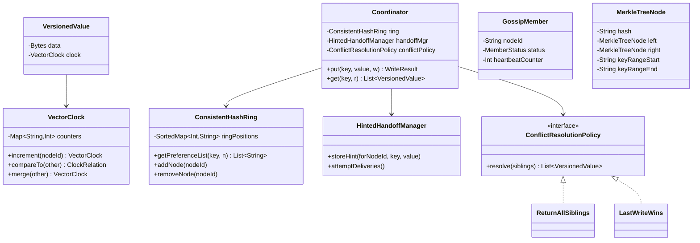
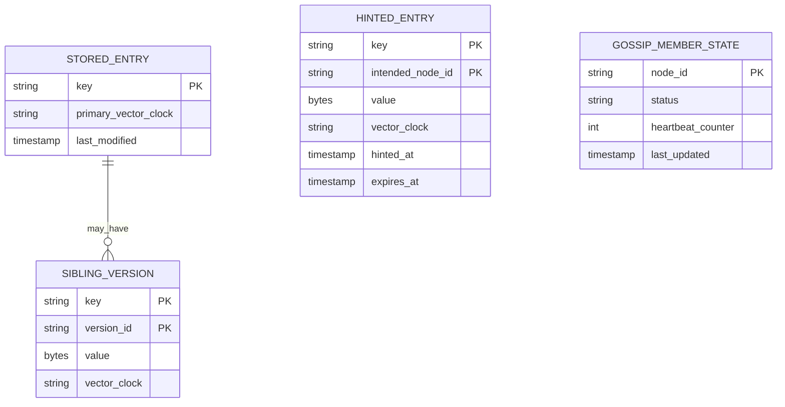
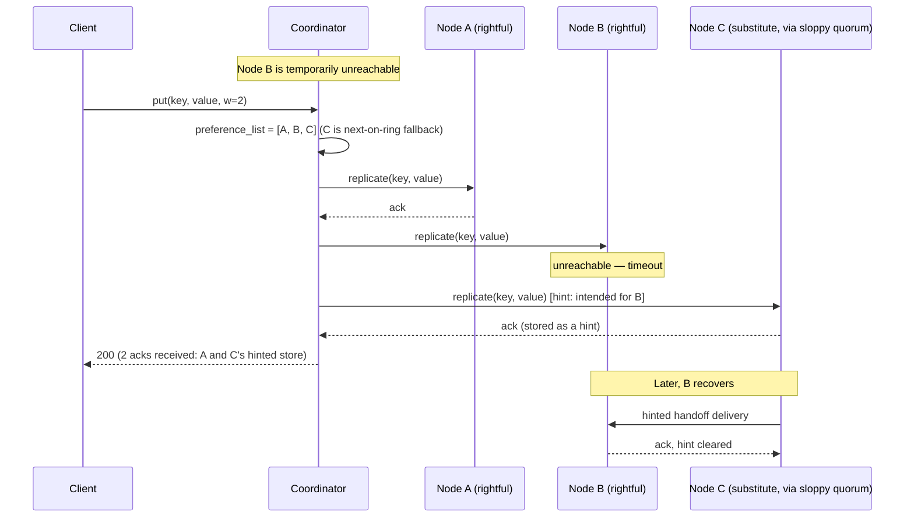

# Distributed Key-Value Store (DynamoDB-style) — HLD & LLD

**Assumed metrics** (call out if different): a large, multi-tenant KV store · billions of keys, aggregate millions of ops/sec across the cluster · single-digit-millisecond p99 latency for simple get/put · **the system must remain writable even during network partitions or node failures** — this "always-writable" requirement is the single defining constraint of this whole design, and it's stated as a hard requirement, not a nice-to-have · tunable per-request consistency (the caller can trade latency/availability for read/write strictness) · multi-region capable, though the core design below is presented at the single-region/cluster level, which is where the interesting mechanics live.

**Scope, explicitly enumerated**: simple key-value operations (`put`, `get`, `delete` — no joins, no complex queries, no cross-key transactions, deliberately) · configurable replication factor · tunable read/write consistency (quorum-based) · automatic handling of node failure and network partitions without rejecting writes · conflict resolution when concurrent writes genuinely can't be ordered · decentralized cluster membership and failure detection (no single control node) · background replica-repair (anti-entropy).

**The architectural inversion worth naming up front, again**: the RDBMS design earlier in this conversation was a single coordinated monolith because ACID transactions require one shared source of truth. Every other distributed design in this thread (LB, API Gateway, chat, DNS) used a control-plane/data-plane split — some component decides "what's true" and pushes it to workers. **This design uses neither pattern.** It's **fully decentralized and leaderless**: every node in the cluster is a peer, running identical code, and there is no special node whose failure is more consequential than any other's. This is a deliberate, foundational choice, not an oversight — it's what makes "always writable, even during a partition" achievable at all, since any control-plane-style single source of truth would itself become exactly the kind of single point of failure this system is designed to have none of.

---

# Phase 2: High-Level Design (HLD)

## 1. Scope & System Estimation

**Functional Requirements**
- `put(key, value)` and `get(key)` (and `delete`), with no cross-key operations — the interface is deliberately minimal, which is precisely what makes the strong availability and partitioning guarantees below achievable
- Data is automatically partitioned across many nodes (no single node holds the whole dataset) and automatically replicated (no single node's failure loses data)
- The system must accept writes even when some nodes are unreachable — a write should essentially never be rejected outright due to a node or network failure, only in genuinely extreme circumstances
- Reads and writes offer **tunable consistency**: a caller can request a fast, possibly-slightly-stale read, or a stronger, quorum-confirmed one, per operation
- When network partitions or concurrent writes cause genuinely conflicting versions of a value to exist, the system must not silently pick a "winner" that loses data — conflicts are surfaced (or resolved by policy) rather than swept away
- Cluster membership (nodes joining, leaving, failing) is detected and propagated without any single node coordinating that process
- Data that drifts out of sync between replicas (due to a node being temporarily unreachable) is automatically detected and repaired in the background

**Non-Functional Requirements**
- **Availability, for writes specifically, is the north star of this entire design** — this is a deliberate and explicit inversion of the RDBMS and banking designs' priorities, where correctness/consistency was the non-negotiable top priority even at availability's expense. Here, the guiding principle is closer to: "a write should always succeed somewhere, and we'll deal with reconciling divergent versions after the fact, rather than block a write to guarantee that divergence can never happen."
- Consistency: **AP by design, with the specific trade-off exposed and tunable to the caller**, not hidden — a caller who genuinely needs strong consistency for a particular operation can ask for it (at the cost of latency/availability for that specific call), but the system's *default* posture, and the thing it optimizes hardest for, is availability.
- Partition tolerance: the system must continue serving both reads and writes on both sides of a network partition (accepting the resulting risk of temporary divergence, to be reconciled later) rather than picking one side to serve and blocking the other.
- Scalability: adding or removing nodes should redistribute only a fraction of the data/load, not trigger a global reshuffle — this requirement is what makes consistent hashing (reused directly from the Load Balancer design) the correct mechanism here too, just applied to data ownership instead of backend routing.
- Latency: single-digit-millisecond reads/writes for the common case — achievable specifically because there's no central coordinator to round-trip through; any node can serve as the coordinator for any request.

**Back-of-the-Envelope Estimation**
- Consistent-hashing ring with virtual nodes (direct reuse of the Load Balancer design's mechanism, detailed there and not re-derived here): with, say, a few hundred virtual nodes per physical node, adding or removing one physical node remaps only roughly `1/N` of the keyspace, keeping cluster resizing cheap regardless of total data volume — the same property that made the LB's target-set churn manageable applies here to data ownership churn.
- Replication factor N (commonly 3): each key is stored on N distinct physical nodes (the coordinator plus its N-1 successors on the ring) — at millions of ops/sec aggregate, this means actual disk/network write volume across the cluster is N times the logical write rate, a direct, budgeted cost of the durability-through-replication approach rather than a surprise.
- Quorum tuning (`R` + `W` relative to `N`): if a caller wants strong-ish consistency, choosing `R + W > N` guarantees any read quorum and any write quorum share at least one common replica, so a read is guaranteed to see the most recent acknowledged write — this is a tunable, per-request dial, not a fixed cluster-wide setting, and it's the mechanism by which "tunable consistency" from the functional requirements is actually implemented, detailed in the LLD.
- Conflict rate: under normal operation (no partitions, low latency between replicas) concurrent conflicting writes to the *same* key are rare; they become common specifically during partitions or node failures, when sloppy quorum (§4) allows writes to proceed against a non-ideal set of replicas — this is why conflict resolution (vector clocks, detailed in the LLD) is a core mechanism, not an edge-case afterthought: it's the direct, expected consequence of prioritizing availability during exactly the failure conditions this system is designed to survive.

## 2. System Architecture & Components

**Architecture Style**: **Fully decentralized, leaderless, peer-to-peer** — every node runs the identical stack (partitioning/routing logic, local storage, replication coordination, failure detection, anti-entropy) and any node can act as the **coordinator** for any given request, determined purely by consistent-hash position, not by any elected or designated role. Justification: a control-plane/data-plane split (as used everywhere else in this conversation) or a single-leader design (as used in the RDBMS) both introduce a component whose unavailability degrades the whole system — directly contrary to the "always writable, even during a partition" requirement that defines this system. Removing that component entirely, by making every node symmetric and letting membership/coordination emerge from peer-to-peer protocols, is what makes the availability guarantee actually achievable rather than aspirational.

**Component Breakdown**
- **Consistent Hash Ring (Partitioning Layer)**: maps every key to a position on a ring and determines its **preference list** — the ordered list of nodes (the natural coordinator plus its N-1 successors) responsible for storing that key's replicas — this is a direct structural reuse of the Load Balancer design's consistent-hashing-with-virtual-nodes mechanism, just repurposed from "which backend serves this request" to "which nodes own this data."
- **Coordinator Logic** (runs identically on every node): whichever node a client's request lands on (via a stateless request router or client-side ring awareness) acts as the coordinator for that specific request — it looks up the key's preference list and fans out the actual read/write to the relevant replica nodes, then applies the quorum and conflict-resolution logic (detailed in the LLD) before responding to the client.
- **Local Storage Engine**: each node's own durable storage for the keys it's currently responsible for — typically an LSM-tree-style structure (optimized for high write throughput via sequential writes and background compaction, a different trade-off than the RDBMS design's B+Tree, which optimized for balanced read/write and range-scan performance; this system's access pattern — point lookups by key, very high write volume, no range scans across unrelated keys — favors the LSM-tree's write-friendly profile instead).
- **Vector Clock / Versioning Layer**: attaches causal-history metadata to every stored value, enabling the system to distinguish "this write supersedes that one" from "these two writes happened concurrently and neither supersedes the other" — the mechanism that makes conflict *detection* (as opposed to silent overwrite) possible, detailed fully in the LLD.
- **Sloppy Quorum & Hinted Handoff Manager**: when a key's "natural" preference-list nodes aren't all reachable, this component allows the write to proceed against the next-available healthy nodes further down the ring instead, temporarily holding a "hint" so the data can be handed off to the rightful node once it recovers — the specific mechanism that makes "never reject a write due to a node failure" achievable, detailed in the LLD.
- **Gossip-Based Membership & Failure Detection**: nodes periodically exchange membership/health state with a few random peers (not with a central registry) — membership information (who's in the cluster, who's currently considered failed) propagates and eventually converges across the whole cluster purely through this peer-to-peer exchange, with no single node ever being the authoritative "source of truth" for cluster membership the way the control-plane components in every other design in this conversation were for their respective domains.
- **Anti-Entropy / Merkle Tree Sync**: a background process that compares the data held by replica nodes for overlapping key ranges using Merkle trees (hash trees that let two nodes efficiently identify exactly which sub-ranges of data differ without transferring or comparing every individual key) — the mechanism that repairs replicas that drifted out of sync while a node was unreachable, without requiring a full data re-transfer.
- **Read Repair**: a lighter-weight, request-time-triggered version of the same idea — when a coordinator's quorum read notices that some replicas returned stale data relative to others, it opportunistically pushes the newer version to the stale replicas as a side effect of serving that read, rather than waiting for the next background anti-entropy pass.

**Data Flow Walkthrough**

*Write path (`put(key, value)`):*
1. Client (or a stateless request router) computes the key's position on the consistent-hash ring and identifies the coordinating node.
2. Coordinator determines the key's preference list (the N nodes that should hold this key) and attempts to write to all of them, waiting for `W` acknowledgments (the caller-tunable write-quorum size) before considering the write successful.
3. If one or more of the preference-list nodes are unreachable, **sloppy quorum** kicks in: the coordinator writes to the next healthy node(s) further down the ring instead, and those substitute nodes hold the data as a **hint** — "this belongs to node X, please deliver it once X is reachable again" — rather than the write simply failing.
4. Once `W` acknowledgments (from rightful or substitute nodes) are received, the coordinator returns success to the client — the write is durable and available, even though it may not yet be on all N of its "correct" homes.
5. In the background, once a hinted node detects the rightful owner is healthy again, it hands off the held data to it (hinted handoff) — and separately, the anti-entropy process continuously reconciles any residual divergence via Merkle tree comparison.

*Read path (`get(key)`):*
1. Coordinator (again, whichever node the request lands on) identifies the preference list and requests the value from `R` of them (the caller-tunable read-quorum size).
2. Each replica returns its currently-stored version(s) along with vector-clock metadata.
3. Coordinator compares the returned vector clocks: if one version's vector clock strictly dominates the others (it's causally derived from them), that's the answer — no conflict. If two or more versions are **concurrent** (neither's vector clock dominates the other's — they were written without either writer knowing about the other, the direct, expected consequence of the availability-first write path above), the coordinator returns **all conflicting versions** to the client (or applies a configured resolution policy, like last-writer-wins by timestamp, if the application has opted into that simpler-but-lossier default) rather than silently discarding one.
4. If the coordinator notices during this process that some replicas are behind, it performs read repair, pushing the reconciled/latest version to the stale replicas as a side effect.

## 3. Storage & Data Strategy

**Database Selection**
- **Per-node local storage**: an LSM-tree-based engine (SSTables + an in-memory memtable + background compaction) — chosen specifically because this system's write pattern (constant, high-volume, mostly-random-key writes with no range-scan requirement across unrelated keys) favors the LSM-tree's append-heavy, sequential-write-then-compact profile over the RDBMS design's B+Tree, which earned its place there specifically because that system needed efficient ordered range scans, a requirement this system deliberately doesn't have.
- **Preference-list-based replication**: rather than a separate "replication config" data structure, replica placement is *derived* directly from the consistent-hash ring position (the N nodes clockwise from a key's hash) — there's no separate metadata store recording "who replicates what," because the ring topology itself *is* that information, computable by any node without a lookup.
- **Vector clocks**: stored alongside each value, not in a separate system — a value is never just "the bytes," it's always "the bytes plus their causal-history metadata," which is what makes conflict detection possible on every read without a separate out-of-band versioning service.
- **Hinted-handoff data**: held temporarily on the substitute node's own local storage, tagged with its rightful destination — deliberately ephemeral (handed off and deleted once delivered, or eventually reconciled by anti-entropy if handoff itself fails) rather than a permanent second copy.
- **Merkle trees**: computed per key-range (not per individual key, which would be prohibitively expensive to compare at this scale) — a hash tree where each leaf hashes a small range of keys and each internal node hashes its children, letting two nodes compare just the root hash first, and only recurse into subtrees whose hashes differ, to find the actual points of divergence efficiently.

**Data Lifecycle**
- **Ring membership changes (node join/leave)**: because replica ownership is derived from ring position, adding a node only requires the ring's immediate neighbors to transfer the fraction of keyspace now owned by the new node — not a global rebalance — directly reusing the bounded-remap property of the LB design's consistent hashing.
- **Compaction**: the LSM-tree's background compaction merges and reclaims space from overwritten/deleted keys — a storage-lifecycle process specific to this storage engine choice, analogous in spirit to the RDBMS design's vacuum/garbage-collection process for old MVCC versions, but operating on LSM levels instead of MVCC version chains.
- **Hinted handoff expiry**: if a rightful node stays unreachable long enough, a held hint eventually times out (rather than accumulating indefinitely on the substitute node) and falls back entirely to anti-entropy-based reconciliation once the node does return — bounding how much "extra" data any one node might be temporarily holding on another's behalf.
- **Anti-entropy scheduling**: runs continuously in the background at a low priority relative to live request traffic, since its job is long-run convergence, not immediate correctness — the same "eventually, not immediately" posture underlying this entire system's consistency model.

## 4. Cross-Cutting Concerns & Trade-offs

**CAP Theorem & Trade-offs**
- **This design chooses AP, explicitly and as its defining characteristic — this is the sharpest, most deliberate AP stance of any design in this conversation.** Every other AP-leaning component elsewhere in this thread (presence, routing tables, rank computation) was AP because strict consistency there simply wasn't valuable enough to pay for; here, AP is chosen even though strict consistency *would* be valuable in many cases, because the explicit design goal is "never sacrifice write availability," and CAP says you cannot have that guarantee alongside strict consistency during a genuine partition — so this design picks a side and is honest about it, rather than assuming the trade-off away.
- **Sloppy quorum is the concrete mechanism that turns the CAP theorem's abstract trade-off into a specific engineering decision**: a "strict" quorum system would refuse a write if it couldn't reach enough of the key's *correct* replicas — that's the CP choice. Sloppy quorum instead accepts the write against *any* sufficiently-many reachable nodes, accepting a real, boundable risk of temporary inconsistency (which anti-entropy and read-time conflict resolution then clean up) in exchange for the write never failing outright — this is the single mechanism most responsible for this system's AP character.
- **Vector clocks are the direct consequence of choosing "accept concurrent writes, reconcile later" over "prevent concurrent writes"** — this is the philosophical opposite of the banking ledger's approach (which prevents conflicting concurrent writes via strict locking/versioning, because for money, a conflict *must never be allowed to happen* in the first place) and also opposite to the RDBMS's MVCC (which uses versions to let readers avoid blocking on writers, but still enforces strict serialization for conflicting writers via locking or abort-and-retry). Here, conflicting writes are allowed to both succeed, and the cost of that permissiveness is pushed to read time (return all versions, let the caller or a policy reconcile) rather than write time (block or abort one of them).
- **Tunable per-request consistency (R/W quorum sizes) lets a caller locally opt into a CP-like guarantee for a specific operation** (`R + W > N`) without changing the cluster's overall AP-by-default posture — this is a meaningfully different knob than anything in the RDBMS design's isolation levels, since it's tuning availability-vs-consistency directly and explicitly per call, rather than tuning transaction-visibility semantics within an already-CP system.

**Resiliency & Security**
- **No single point of failure, by construction, not by redundancy alone**: because there's no leader, no control-plane node, and no central membership registry, there's no component whose failure has an outsized blast radius — a stark contrast to the LB, API Gateway, and chat designs' control planes (which, while made highly available through their own redundancy, are still conceptually a distinguished component) and to the RDBMS's inherently single-node core.
- **Gossip protocol resilience**: because membership propagates via random peer exchange rather than a broadcast from one source, the protocol degrades gracefully under partial network partition — nodes on each side of a partition continue to gossip amongst themselves and maintain a locally-consistent (if temporarily incomplete) view of the cluster, converging back to a full shared view once the partition heals, rather than the whole cluster's membership view depending on one source being reachable.
- **Read-time conflict surfacing as a security-adjacent correctness property**: silently picking a "winner" among concurrent writes (e.g., naive last-write-wins by wall-clock time) can silently drop a legitimate write under clock skew or concurrent-edit scenarios — surfacing conflicts explicitly (or making last-write-wins an opt-in policy rather than the only option) is what prevents this system from quietly losing data in a way that would only be discovered much later, if ever.
- **Bounded hinted-handoff accumulation**: a substitute node holding hints on behalf of a persistently-unreachable rightful owner has its holding period capped, preventing one long-lived failure from causing unbounded storage growth on unrelated nodes.

---

# Phase 3: Low-Level Design (LLD)

## 1. Class & Object-Oriented Design

**Design Patterns**
- **Reused directly**: the `ConsistentHashRing` class here is structurally the same as the Load Balancer design's ring — same virtual-node mechanism, same bounded-remap property — just queried for "which N nodes own this key" instead of "which one node should handle this request."
- **Strategy**: pluggable `ConflictResolutionPolicy` (`ReturnAllSiblings`, `LastWriteWins`) — the system's default is to surface conflicts, but applications that accept the risk can opt into automatic resolution.
- **Value Object**: `VectorClock` and `VersionedValue` are immutable — comparing or merging clocks never mutates an existing one, avoiding an entire class of "which node saw which version when" bugs that would arise from shared mutable version state.
- **Chain/Fallback**: preference-list traversal for both replication and sloppy-quorum substitution is a simple ordered fallback chain — try the natural owner, then the next node on the ring, and so on, structurally similar to the API Gateway's circuit-breaker fallback chain, applied here to replica selection instead of backend failover.



## 2. Internal Data Model

*(No traditional "database schema" applies — this system IS the database. What follows is the internal on-disk/in-memory data model each node maintains about its own stored keys and cluster state.)*



**Table/Structure Definitions**

`STORED_ENTRY` / `SIBLING_VERSION`

| Field | Type | Constraints | Description |
|---|---|---|---|
| key | String | PK | — |
| version_id | String | PK (composite, on siblings) | Distinguishes concurrent, unreconciled versions of the same key |
| value | Bytes | Not Null | — |
| vector_clock | String (serialized) | Not Null | Causal-history metadata — the mechanism that makes conflict detection possible |

`HINTED_ENTRY`

| Field | Type | Constraints | Description |
|---|---|---|---|
| key | String | PK (composite) | — |
| intended_node_id | String | PK (composite) | The rightful owner this data is waiting to be handed off to |
| value | Bytes | Not Null | — |
| expires_at | Timestamp | Not Null | Bounds accumulation per §4's resiliency discussion |

`GOSSIP_MEMBER_STATE`

| Field | Type | Constraints | Description |
|---|---|---|---|
| node_id | String | PK | — |
| status | String | Not Null | ALIVE / SUSPECTED / DEAD |
| heartbeat_counter | Int | Not Null | Incremented by the node itself; propagated via gossip, used to detect staleness/failure |

## 3. API & Interface Specifications

```yaml
openapi: 3.0.0
info:
  title: Key-Value Store Client API
  version: "1.0"
paths:
  /kv/{key}:
    put:
      summary: Write a value (tunable write-quorum size)
      parameters:
        - name: w
          in: query
          schema: { type: integer, description: "Required ack count; defaults to a cluster-configured quorum size" }
        - name: context
          in: query
          schema: { type: string, description: "Opaque vector-clock context from a prior read, so this write is recorded as causally descending from it" }
      requestBody:
        content:
          application/octet-stream: {}
      responses:
        "200": { description: Write acknowledged by at least `w` replicas }
        "503": { description: "Could not reach enough nodes even for sloppy quorum — the rare true failure case" }

    get:
      summary: Read a value (tunable read-quorum size)
      parameters:
        - name: r
          in: query
          schema: { type: integer }
      responses:
        "200":
          content:
            application/json:
              schema:
                type: object
                properties:
                  versions:
                    type: array
                    items:
                      type: object
                      properties:
                        value: { type: string, format: byte }
                        context: { type: string, description: "Vector-clock context to supply on a subsequent write, resolving this read's version(s)" }
                  hasConflict: { type: boolean, description: "True if multiple concurrent (unreconciled) versions were returned" }

    delete:
      summary: Delete a key (implemented as a tombstone write, following the same versioned/replicated path as a put)
      responses:
        "200": { description: Tombstone written and replicated per the configured write quorum }
```

**Idempotency**
- Writes are **not** deduplicated by a client-generated idempotency key the way every application-level design in this conversation handled writes — a KV store's `put` is expected to be a plain overwrite/version-append operation; if idempotency matters to an application (e.g., "don't apply this exact update twice"), that's expressed by the application supplying the correct causal `context` from its last read, so a retried write with the same context and value simply produces an equivalent resulting version rather than a spurious new conflict — this is a deliberately different idempotency story than the transactional/ledger-style systems earlier in this conversation, because a general-purpose KV store has no domain knowledge of what "duplicate" means for an arbitrary blob of bytes.
- Reads are pure and inherently safe to retry.
- Hinted-handoff delivery is idempotent by construction: delivering the same hinted value to its rightful node twice just results in that node storing (or already having) an equivalent version, verified against its vector clock.

## 4. Concrete Code Snippets & Sequence Flows



**Core Logic: Vector Clock Comparison and Coordinator Quorum Read/Write with Sloppy Quorum** (the defining algorithm suite of this entire system — this is what makes "always writable, conflicts resolved rather than prevented" an actual, correct mechanism rather than just a design aspiration)

```python
# dynamo_core.py
from dataclasses import dataclass, field
from enum import Enum
from typing import Optional
import logging

logger = logging.getLogger("kvstore.core")


class ClockRelation(Enum):
    EQUAL = "EQUAL"
    DOMINATES = "DOMINATES"        # self happened-after other; other is superseded
    DOMINATED_BY = "DOMINATED_BY"  # self happened-before other
    CONCURRENT = "CONCURRENT"      # neither knows about the other — a true conflict


@dataclass(frozen=True)
class VectorClock:
    """Maps node_id -> counter. A clock A "dominates" clock B if every
    entry in A is >= the corresponding entry in B, and at least one is
    strictly greater — meaning A's writer had full causal knowledge of
    everything B represents, plus more. If neither dominates the other,
    the two writes happened without either knowing about the other:
    a genuine concurrent conflict, not a bug to be fixed."""

    counters: dict[str, int] = field(default_factory=dict)

    def increment(self, node_id: str) -> "VectorClock":
        new_counters = dict(self.counters)
        new_counters[node_id] = new_counters.get(node_id, 0) + 1
        return VectorClock(new_counters)

    def compare(self, other: "VectorClock") -> ClockRelation:
        self_dominates_somewhere = False
        other_dominates_somewhere = False

        all_nodes = set(self.counters) | set(other.counters)
        for node in all_nodes:
            self_count = self.counters.get(node, 0)
            other_count = other.counters.get(node, 0)
            if self_count > other_count:
                self_dominates_somewhere = True
            elif other_count > self_count:
                other_dominates_somewhere = True

        if self_dominates_somewhere and other_dominates_somewhere:
            return ClockRelation.CONCURRENT
        if self_dominates_somewhere:
            return ClockRelation.DOMINATES
        if other_dominates_somewhere:
            return ClockRelation.DOMINATED_BY
        return ClockRelation.EQUAL

    def merge(self, other: "VectorClock") -> "VectorClock":
        """Used when a client's write context descends from multiple
        prior sibling versions (it read a conflict and is now writing a
        resolution) — the merged clock causally dominates all inputs."""
        merged = dict(self.counters)
        for node, count in other.counters.items():
            merged[node] = max(merged.get(node, 0), count)
        return VectorClock(merged)


@dataclass(frozen=True)
class VersionedValue:
    data: bytes
    clock: VectorClock


def reconcile_versions(versions: list[VersionedValue]) -> list[VersionedValue]:
    """
    Given the versions returned by a read quorum, discards any version
    that's dominated by another (superseded), leaving only the
    causally-maximal, mutually-concurrent set. If exactly one remains,
    there's no conflict. If more than one remains, these are genuine
    concurrent siblings that must be surfaced to the caller (or resolved
    by an explicit policy) — never silently collapsed.
    """
    survivors: list[VersionedValue] = []
    for candidate in versions:
        dominated = False
        for other in versions:
            if other is candidate:
                continue
            if other.clock.compare(candidate.clock) == ClockRelation.DOMINATES:
                dominated = True
                break
        if not dominated:
            survivors.append(candidate)

    # Deduplicate exact-equal clocks (multiple replicas returning the
    # identical version, the common non-conflict case).
    deduped: list[VersionedValue] = []
    seen_clocks: list[VectorClock] = []
    for v in survivors:
        if not any(v.clock.compare(seen) == ClockRelation.EQUAL for seen in seen_clocks):
            deduped.append(v)
            seen_clocks.append(v.clock)
    return deduped


class ReplicaHandle:
    """Represents this coordinator's connection to one physical replica
    node — abstracted here since the actual RPC mechanics aren't this
    snippet's focus."""

    def __init__(self, node_id: str, reachable: bool = True):
        self.node_id = node_id
        self.reachable = reachable

    def store(self, key: str, value: VersionedValue) -> bool:
        if not self.reachable:
            return False
        # In a real system: network call to the replica's storage engine.
        return True

    def fetch(self, key: str) -> list[VersionedValue]:
        if not self.reachable:
            raise ConnectionError(f"{self.node_id} unreachable")
        return []  # populated by the real storage engine


class InsufficientQuorumError(Exception):
    """Raised only in the genuinely rare case where not even sloppy
    quorum could find enough reachable nodes — the true failure case."""


class Coordinator:
    """
    Runs on every node identically — whichever node a request lands on
    acts as coordinator for that request. Implements sloppy quorum: if a
    key's rightful preference-list nodes aren't all reachable, falls
    back to the next nodes on the ring, storing the data as a hint for
    eventual handoff rather than failing the write.
    """

    def __init__(self, all_ring_nodes_in_order: list[ReplicaHandle], replication_factor: int):
        self._ring_nodes = all_ring_nodes_in_order
        self._n = replication_factor

    def _preference_list_with_fallback(self, key: str) -> list[ReplicaHandle]:
        """Returns N nodes, substituting the next reachable node on the
        ring for any unreachable rightful owner — the sloppy-quorum
        candidate set. In a real system this starts from the key's
        actual ring position; simplified here to focus on the
        substitution logic itself."""
        candidates: list[ReplicaHandle] = []
        for node in self._ring_nodes:
            if len(candidates) >= self._n:
                break
            candidates.append(node)  # includes unreachable ones; store() will fail for those
        return candidates

    def put(self, key: str, value: bytes, causal_context: VectorClock, w: int) -> None:
        preference_list = self._preference_list_with_fallback(key)
        node_id_for_increment = preference_list[0].node_id  # coordinator's own contribution
        new_clock = causal_context.increment(node_id_for_increment)
        versioned = VersionedValue(value, new_clock)

        acks = 0
        for node in preference_list:
            hinted_for = None if node.reachable else self._next_reachable_after(node)
            target = node if node.reachable else hinted_for
            if target is None:
                continue
            success = target.store(key, versioned)
            if success:
                acks += 1
                if target is not node:
                    logger.info(
                        "sloppy_quorum_hint_stored",
                        extra={"key": key, "intended_for": node.node_id, "stored_on": target.node_id},
                    )
            if acks >= w:
                logger.info("write_quorum_satisfied", extra={"key": key, "acks": acks, "required": w})
                return

        raise InsufficientQuorumError(
            f"Only achieved {acks} acks for key {key}, needed {w} even with sloppy quorum"
        )

    def _next_reachable_after(self, unreachable_node: ReplicaHandle) -> Optional[ReplicaHandle]:
        idx = self._ring_nodes.index(unreachable_node)
        for candidate in self._ring_nodes[idx + 1:] + self._ring_nodes[:idx]:
            if candidate.reachable:
                return candidate
        return None

    def get(self, key: str, r: int) -> list[VersionedValue]:
        preference_list = self._preference_list_with_fallback(key)
        collected: list[VersionedValue] = []
        successful_reads = 0

        for node in preference_list:
            try:
                versions = node.fetch(key)
                collected.extend(versions)
                successful_reads += 1
            except ConnectionError:
                continue
            if successful_reads >= r:
                break

        if successful_reads < r:
            raise InsufficientQuorumError(
                f"Only reached {successful_reads} replicas for key {key}, needed {r}"
            )

        return reconcile_versions(collected)


# --- unit test placeholders ---
def test_vector_clock_dominates_when_strictly_ahead_on_all_entries():
    # arrange: A = {"n1": 2, "n2": 1}, B = {"n1": 1, "n2": 1}
    # act/assert: A.compare(B) == DOMINATES
    pass


def test_vector_clock_concurrent_when_each_ahead_on_different_node():
    # arrange: A = {"n1": 2, "n2": 0}, B = {"n1": 0, "n2": 2}
    # act/assert: A.compare(B) == CONCURRENT — neither has full knowledge of the other
    pass


def test_reconcile_versions_drops_dominated_versions():
    # arrange: version1 (older, dominated) and version2 (dominates version1)
    # act: reconcile_versions([version1, version2])
    # assert: only version2 remains
    pass


def test_reconcile_versions_keeps_true_concurrent_siblings():
    # arrange: two versions with concurrent (neither-dominates) clocks
    # act: reconcile_versions([v1, v2])
    # assert: both remain — this is the "surface the conflict, don't
    #         silently resolve it" behavior the whole design depends on
    pass


def test_put_falls_back_to_sloppy_quorum_on_unreachable_node():
    # arrange: preference list where the 2nd node is unreachable, a 4th
    #          (fallback) node is reachable, w=2
    # act: put(key, value, causal_context, w=2)
    # assert: write succeeds using [rightful_node_1, fallback_node], not
    #         raising InsufficientQuorumError despite one rightful node
    #         being down
    pass


def test_put_raises_when_not_even_sloppy_quorum_reachable():
    # arrange: enough nodes unreachable that fewer than w total can be
    #          reached even with fallback substitution
    # act/assert: raises InsufficientQuorumError — the genuine, rare
    #             failure case this design is honest about rather than
    #             pretending never happens
    pass
```

---

### Key design decisions worth flagging back to you
1. **This is the most deliberately, structurally AP design in the entire conversation** — not AP because strong consistency wasn't worth the cost (the usual reasoning elsewhere in this thread), but AP because the explicit goal is "a write must always succeed," and CAP says that's incompatible with strict consistency during a genuine partition, so this design picks availability and builds real machinery (sloppy quorum, vector clocks, anti-entropy) to make the resulting inconsistency safe and recoverable rather than catastrophic.
2. **Fully decentralized/leaderless is the third distinct architectural pattern this conversation has now covered** — monolithic-and-coordinated (RDBMS), control-plane/data-plane microservices (everything else), and now peer-to-peer-with-no-distinguished-node — each the textbook-correct answer for a genuinely different underlying requirement, not a matter of taste.
3. **Vector clocks push conflict-handling to read time instead of preventing conflicts at write time** — the exact philosophical opposite of the banking ledger's strict-locking, conflict-*prevention* approach, and a different trade-off again from the RDBMS's MVCC (which lets readers avoid blocking on writers, but still resolves writer/writer conflicts through abort-and-retry, not by allowing both to succeed). Three different systems in this conversation, three genuinely different correct answers to "what happens when two writes collide," each following from that system's own priorities.

Let me know if you want to go deeper on any piece — e.g., the gossip protocol's actual convergence/failure-detection algorithm (phi-accrual-style suspicion levels), the Merkle-tree anti-entropy comparison algorithm in more detail, or how this design would extend to multi-region (Dynamo-global-tables-style) replication.
