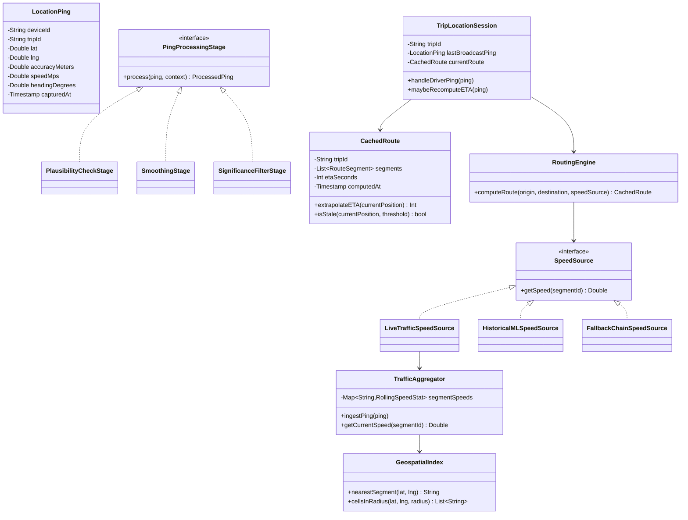
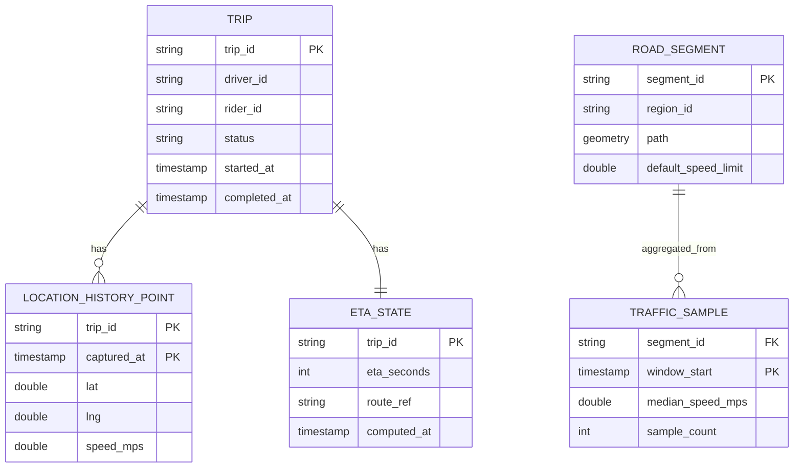
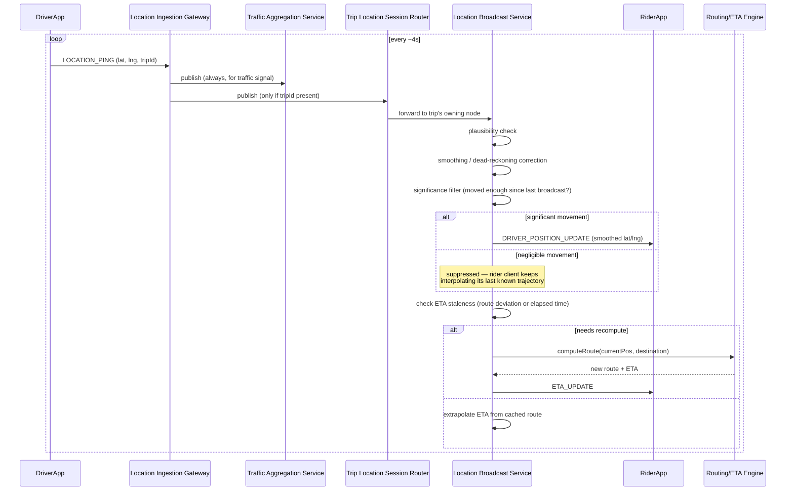

# ETA Service & Driver-Rider Location Sharing — HLD & LLD

**Assumed metrics** (call out if different): ~20M drivers/riders with active location sharing at peak · ~1M concurrent active trips · GPS pings every ~4s per active device → ~5M pings/sec fleet-wide ingest · location update visible to the other party p95 < 1s · on-demand ETA query < 200ms (it's often blocking a user-facing screen); background ETA refresh during a trip is less latency-sensitive · multi-region, road-network data partitioned regionally by nature.

**Scope, explicitly enumerated**: continuous GPS location ingestion from driver (and optionally rider) devices · real-time, bandwidth-efficient location sharing between the two matched parties for the duration of a trip · ETA computation combining road-network routing with live and historical traffic · ETA re-computation as the trip progresses (not just once at match time) · smooth, non-jittery position rendering on the receiving client despite noisy/gapped GPS · efficient proximity/geospatial indexing to support the above at scale.

This design reuses two patterns already established in this conversation: **presence's AP-leaning, ephemeral, TTL-style consistency model** (from the chat app) applied to location instead of online/offline status, and **per-session ownership routing via a fast lookup layer** (from the chat app's Session Registry and the doc editor's Document Session Router) applied here to "which node is currently streaming this trip's location channel." The genuinely new problem this design has to solve — routing/ETA computation over a live road-traffic graph, and turning a noisy raw GPS stream into a smooth, efficient broadcast — has no direct analog earlier in this conversation and gets the most attention below.

---

# Phase 2: High-Level Design (HLD)

## 1. Scope & System Estimation

**Functional Requirements**
- Ingest a continuous stream of GPS pings from driver devices (and riders, where relevant for precise pickup)
- Share a matched driver's live position with their rider (and vice versa near pickup) in near-real-time, smoothly, without excessive battery/bandwidth cost
- Compute an ETA at trip request/match time, and continuously refresh it as the trip progresses, reacting to actual road conditions, not just straight-line distance
- Use real-time, crowd-sourced traffic (derived from all drivers' live GPS pings, not just the current trip's) to make ETAs accurate to current conditions
- Fall back sensibly to historical/typical traffic patterns for road segments with sparse live data
- Smooth and interpolate position on the receiving client so a marker moves fluidly rather than jumping between raw GPS samples (which are noisy and arrive at irregular intervals)
- Support proximity queries (e.g., "which drivers are near this pickup point") as a byproduct of the same geospatial indexing used for traffic aggregation

**Non-Functional Requirements**
- Availability: 99.9%+ for the live location-sharing path during an active trip — a rider trusting a driver's live position is core to trust in the product
- **Consistency: AP by nature, not by relaxed choice** — a location update is a physical-world measurement that's already stale by the time it's received; there is no "correct current answer" to converge on the way a bank balance or a document's text has one, so this system is architected around staleness tolerance from the ground up rather than treating it as a trade-off against some ideal
- Latency: on-demand ETA queries sit on a user-facing critical path (trip matching, "how long until my driver arrives" screens) and need sub-200ms response; the *live location stream* has a softer, "smooth and current-feeling" latency target rather than a hard SLA on any single update
- Efficiency: this is a genuinely bandwidth- and battery-constrained system on the device side — every design choice about ping frequency and update payload size has a direct cost on the driver's phone battery and data plan, which is a constraint the earlier designs in this conversation didn't have

**Back-of-the-Envelope Estimation**
- ~5M raw GPS pings/sec fleet-wide ingest (from §0's estimate). This raw stream feeds two very different consumers with very different needs: (1) traffic aggregation, which wants *all* of it, fleet-wide, to build an accurate live speed map, and (2) live location broadcast to a matched rider, which only needs *one driver's* stream, *throttled down* — this split is why ingestion and broadcast are architected as separate concerns from the first ping (see §2), not bolted together later.
- Broadcast throttling: if a raw stream arrives every 4s but the client only needs a smooth-feeling update every 1-2s combined with client-side interpolation between updates (standard technique — the client animates the marker between the last two known points rather than needing a new server push per frame), the *effective* server-to-client push rate for 1M concurrent trips is on the order of **~500K-1M pushes/sec**, meaningfully smaller than the raw ingest rate, and this ratio is the main lever on both server egress cost and client battery.
- Traffic aggregation granularity: partitioning the road network into segments (e.g., ~100-200m road-segment cells) across a metro area yields on the order of tens of thousands of segments per major city; aggregating live driver speeds per segment at, say, a 30-second rolling window turns the 5M pings/sec firehose into a **vastly smaller, bounded-cardinality "current speed per segment" table** that the routing engine actually reads from — this compression from "raw ping firehose" to "current condition per road segment" is the crux of making live-traffic-aware routing computationally tractable at all.
- ETA computation cost: a naive full shortest-path recomputation on every trip's every ping would be enormous at 1M concurrent trips; in practice ETA recompute is triggered by **meaningful events** (route deviation beyond a threshold, elapsed time since last computation, or a significant traffic-condition change on the remaining route), not by every raw ping — bounding recompute frequency, not the raw ping rate, is what keeps the Routing/ETA layer's load manageable.

## 2. System Architecture & Components

**Architecture Style**: Microservices, split cleanly along the same fault line the estimation section surfaced: a **high-volume, fire-and-forget ingestion path** (every ping, from everyone, feeds traffic awareness) versus a **low-volume, session-scoped broadcast path** (one driver's throttled stream to their one matched rider) versus a **compute-heavy, cached routing/ETA layer** that both paths ultimately feed into or read from. Justification: these three have wildly different throughput, latency, and statefulness profiles — conflating them (e.g., recomputing a full route on every raw ping, or feeding the traffic aggregator only from active-trip drivers) would either waste enormous compute or starve the traffic model of the very data (idle/en-route drivers, not just on-trip ones) that makes it accurate.

**Component Breakdown**
- **Location Ingestion Gateway**: lightweight, high-throughput endpoint (WebSocket or efficient unary streaming, e.g., gRPC bidi-stream) that every driver (and optionally rider) device pushes GPS pings to; does minimal validation (plausibility checks — no teleportation between consecutive pings) and immediately publishes to a durable, partitioned event stream — this component's entire job is "accept 5M pings/sec cheaply and get out of the way," it does no routing or broadcast logic itself
- **Trip Location Session Router**: maps `tripId → ownerNodeId`, the same ownership-routing pattern as the chat app's Session Registry and the doc editor's Document Session Router, but here identifying which node is responsible for streaming a given active trip's location updates to its matched rider (and vice versa)
- **Location Broadcast Service**: the node-local component (co-located with or adjacent to the WebSocket connection nodes) that receives a driver's raw ping stream (filtered to just their active trip via the Session Router), applies throttling/smoothing (detailed in the LLD), and pushes a clean, low-frequency, interpolatable stream to the matched rider's live connection — structurally analogous to the chat app's Connection Gateway + Message Router, but pushing continuous position deltas instead of discrete messages
- **Traffic Aggregation Service**: a streaming job (Flink/Kinesis Analytics-style, same architectural role as the loyalty platform's real-time feature computation) consuming the *entire* raw ping firehose (not just on-trip drivers — idle and en-route-to-pickup drivers are valuable traffic signal too) and maintaining a live, rolling "current speed per road segment" map
- **Routing/ETA Engine**: a fleet of stateless compute nodes running a road-network shortest-path algorithm (contraction hierarchies or a similar precomputed-graph technique for sub-second queries on a continent-scale road graph), reading current segment speeds from the Traffic Aggregation Service's output and historical/predicted speeds from the ML layer below, to produce both a route and an ETA
- **Historical Traffic / ML Prediction Service**: batch-trained model (time-of-day, day-of-week, seasonal patterns per segment) used to fill in for road segments where live data is sparse (e.g., 3am on a residential street with few active drivers) — same Lambda-architecture batch layer shape as the loyalty platform's churn/segmentation pipeline, applied to traffic prediction instead of customer behavior
- **Road Network Graph Store**: the underlying map data (nodes/edges representing intersections/road segments), partitioned regionally since road networks are inherently geographic and rarely need cross-region queries in a single request
- **Geospatial Index**: an H3/S2-cell-based (or geohash-based) index mapping "which drivers/segments are in this geographic area," shared infrastructure underlying both the Traffic Aggregation Service's segment bucketing and any proximity-query needs (e.g., driver matching, which sits just outside this design's stated scope but consumes the same index)
- **Location History Store**: append-only per-trip position log, retained for a bounded period post-trip for receipts, support disputes, and safety review — explicitly *not* the same store as the live-broadcast path, which never needs history, only "the current point"

**Data Flow Walkthrough**

*Write path (a driver's GPS ping):*
1. Driver device sends a raw GPS ping (lat/lng, timestamp, accuracy radius, speed/heading if available) to the Location Ingestion Gateway.
2. Gateway does a cheap plausibility check (implausible jump since the last ping is flagged, not necessarily discarded — could be a genuine GPS glitch to smooth over, see LLD) and publishes the ping to the durable event stream, partitioned by a geospatial key (e.g., H3 cell) for the traffic path and additionally tagged with `tripId` if the driver is currently on a trip.
3. **Traffic path** (always, regardless of trip status): Traffic Aggregation Service consumes the stream, updates the rolling speed estimate for the road segment nearest this ping's location.
4. **Trip-broadcast path** (only if `tripId` present): the ping is routed via the Trip Location Session Router to whichever node owns that trip's live session; the Location Broadcast Service there applies throttling/smoothing and, if the update clears the "meaningfully different from last broadcast" threshold, pushes a position update to the rider's connected client.
5. **ETA-recompute trigger check**: the same trip-scoped handler checks whether this ping represents a meaningful deviation from the previously-computed route or a significant enough elapsed time — if so, it calls the Routing/ETA Engine for a fresh computation; otherwise it just interpolates the existing ETA forward (e.g., "ETA was 8 minutes 30 seconds ago, driver has been moving at the expected pace, so it's now roughly 8 minutes") without a full recompute.

*Read path (an ETA query / trip start):*
1. At trip match time, the client requests an ETA — Routing/ETA Engine computes a route using the current road graph, live segment speeds from the Traffic Aggregation Service, and historical fallback for sparse segments, returns both the route (for map display) and the ETA.
2. Rider's client subscribes to the trip's live location channel (same subscribe-on-open pattern as the chat app and doc editor's session join) and receives a stream of smoothed position updates plus periodic ETA refreshes as the trip progresses.

## 3. Storage & Data Strategy

**Database Selection**
- **Trip Location Session Router**: fast KV store (Redis/DynamoDB), identical role and access pattern to the chat app's Session Registry.
- **Current location "latest point"**: an ephemeral, TTL-based KV store (Redis) keyed by `driverId`/`tripId` — only the most recent position matters for live display, so this is deliberately *not* a durable append-only log; it's overwritten on every update, exactly like the chat app's presence keys.
- **Traffic segment speed map**: an in-memory, frequently-refreshed store (Redis, or the stream processor's own local state store) keyed by `segmentId`, holding a rolling-window aggregate (e.g., median speed over the last 30-60s of pings on that segment) — read at high volume by the Routing/ETA Engine, written at high volume by the Traffic Aggregation Service, and explicitly bounded in cardinality (tens of thousands of segments per metro, not millions of raw pings) which is what keeps it fast despite the enormous input volume.
- **Road Network Graph**: a specialized graph store or precomputed-index structure (contraction-hierarchy preprocessed data), partitioned regionally, loaded into memory on the Routing Engine nodes for sub-second query performance — this is read-heavy, slowly-changing (road networks change on the order of days/weeks via map-data updates, not live), so it's architected completely differently from the fast-changing traffic-speed layer even though both feed the same routing computation.
- **Location History**: an append-only, `tripId`-partitioned store (similar shape to the chat app's message store) — but with a much shorter useful retention window than chat messages, since its purpose is trip receipts/dispute-resolution, not indefinite conversation history.
- **Historical traffic / ML training data**: a data lake (S3, bronze/silver/gold layering) fed by archiving the traffic aggregation stream, used offline by the ML Prediction Service — same Lambda-architecture batch layer as the loyalty platform.

**Data Lifecycle**
- **Location data is inherently ephemeral by design, not by TTL policy applied after the fact**: the "current position" store literally only ever holds the latest point — there's no accumulation to prune, which sidesteps the hot/warm/cold tiering problem every other design in this conversation has had to solve for its high-volume data.
- **Traffic segment aggregates use a rolling window, not accumulation**: old pings age out of the aggregation window automatically as part of the streaming computation itself (e.g., a 60-second sliding window), not via a separate cleanup job.
- **Location History retention**: bounded (e.g., 90 days, tuned to support-dispute and safety-review windows) then archived/deleted — unlike the banking or chat designs, there's no regulatory pull toward multi-year retention for raw GPS trails specifically, though trip *records* (fare, route summary, timestamps) may have separate, longer retention requirements outside this design's scope.
- **Road graph updates**: rolled out as a versioned, region-partitioned dataset push to Routing Engine nodes (new map data doesn't invalidate in-flight ETA computations, it just becomes the basis for the next one) — decoupled entirely from the live traffic layer's much faster update cadence.

## 4. Cross-Cutting Concerns & Trade-offs

**CAP Theorem & Trade-offs**
- **Location sharing: unambiguously AP**, more purely than any other AP-leaning component in this conversation, because there is no "true current value" to eventually converge on in the first place — a driver's actual position a half-second ago is already history by the time anyone reads it. The system optimizes entirely for "reasonably fresh and smooth," never for "provably correct as of time T."
- **ETA: not a CAP question at all, but an accuracy-vs-cost trade-off** — an ETA is a prediction, not a fact with a canonical value; the trade-off that matters here is "recompute frequency vs. compute cost," addressed in §1's estimation (recompute on meaningful deviation, interpolate otherwise) rather than any consistency model.
- **Traffic segment speed map**: AP, same reasoning as location — a segment's aggregated current speed is itself already an approximation of an approximation; there's no scenario where blocking a read to guarantee strict consistency here would ever be worth the latency cost, unlike, say, the banking ledger where that trade absolutely is worth it.

**Resiliency & Security**
- **GPS noise and gaps handled client- and server-side, not treated as errors**: raw GPS pings are noisy (urban canyon effects, brief signal loss) and arrive at irregular intervals; the Location Broadcast Service applies smoothing (detailed in the LLD) so the rider's screen shows fluid, plausible movement rather than jittery or teleporting markers, and the receiving client further interpolates between server pushes for visual smoothness between updates — this is a deliberate design layer, not a bug-fix afterthought.
- **Adaptive ping frequency**: devices can reduce ping frequency when stationary or between trips (battery/data conservation) and increase it during active trips or near pickup/dropoff where precision matters most — this is a client-side policy the server signals via configuration, not a fixed global rate.
- **Privacy**: location sharing between a driver and rider is explicitly scoped to the duration of their matched trip — the Trip Location Session Router's mapping is torn down at trip completion exactly like the chat app's session teardown on document/conversation close, and neither party retains live visibility into the other's location once the trip ends.
- **Plausibility filtering as a light security/quality boundary**: the Ingestion Gateway's implausible-jump check catches both genuine GPS glitches and, incidentally, spoofed/malformed location data from a compromised client — not a full anti-spoofing system, but a first line of defense that also happens to improve data quality for the traffic model.
- **Graceful degradation on routing-engine load**: if live traffic data for a route's segments is temporarily unavailable (aggregation service degraded), the Routing/ETA Engine falls back to the historical/ML-predicted speeds rather than failing the ETA request outright — an approximate ETA beats no ETA, mirroring the file-upload service's fail-open-to-a-safe-default pattern for non-critical-path degradation (contrasted with the banking design's deliberate fail-*closed* posture where the stakes are money, not a slightly-less-accurate time estimate).

---

# Phase 3: Low-Level Design (LLD)

## 1. Class & Object-Oriented Design

**Design Patterns**
- **Strategy**: pluggable `RoutingStrategy` (fastest route, shortest distance, avoid-tolls) and pluggable `SpeedSource` (live traffic segment map vs. historical/ML fallback) — the Routing/ETA Engine composes these rather than hard-coding one path-finding behavior.
- **Observer**: the rider's client subscribes to a trip's location channel; the Location Broadcast Service publishes filtered/smoothed updates to subscribers — same mediator-free-clients, server-mediated pattern as the chat app's presence and the doc editor's operation broadcast.
- **Filter/Decorator chain**: an incoming raw ping passes through a chain of independent transforms (plausibility check → smoothing/dead-reckoning correction → significance-threshold filter) before being eligible for broadcast — each stage is independently testable and reusable, same shape as the API Gateway's middleware pipeline, applied here to a location-processing pipeline instead of an HTTP request pipeline.
- **Memento-like caching**: `CachedRoute` holds the last-computed route/ETA for a trip so most pings can cheaply extrapolate ("still on the same route, just further along it") instead of paying for a full graph search on every check.



## 2. Database Schema Design

*(Location and traffic data are mostly ephemeral/in-memory by design, as established in §3 of the HLD — the schema below covers what's genuinely durable: trip-scoped history and the road graph's segment reference data.)*



**Table Definitions**

`LOCATION_HISTORY_POINT` (partitioned by `trip_id`, retained per §3's bounded window)

| Field | Type | Constraints | Description |
|---|---|---|---|
| trip_id | String | Partition key | — |
| captured_at | Timestamp | Clustering key | Preserves order for post-trip route reconstruction |
| lat / lng | Double | Not Null | — |
| speed_mps | Double | Nullable | From device sensor if available |

`ETA_STATE`

| Field | Type | Constraints | Description |
|---|---|---|---|
| trip_id | String | PK | One current ETA per trip, overwritten (not appended) — mirrors location's "latest point only" ephemerality |
| eta_seconds | Int | Not Null | — |
| route_ref | String | Not Null | Pointer to the cached route/segment list |
| computed_at | Timestamp | Not Null | Used by `isStale()` to decide whether to recompute or extrapolate |

`TRAFFIC_SAMPLE` (rolling window, aged out automatically — not a growing history table)

| Field | Type | Constraints | Description |
|---|---|---|---|
| segment_id | String | FK → ROAD_SEGMENT | — |
| window_start | Timestamp | PK (composite) | Rolling window bucket, e.g., 30s buckets |
| median_speed_mps | Double | Not Null | The aggregated signal the Routing Engine reads |
| sample_count | Int | Not Null | Confidence indicator — low count means lean more on historical/ML fallback |

## 3. API & Interface Specifications

**WebSocket/streaming protocol** (device-to-server ping ingestion, and server-to-client broadcast):

```yaml
# Driver device -> Ingestion Gateway
LOCATION_PING:
  deviceId: string
  tripId: string?          # present only if currently on a trip
  lat: double
  lng: double
  accuracyMeters: double
  speedMps: double?
  headingDegrees: double?
  capturedAt: timestamp    # device-local capture time, not receipt time

# Server -> Rider client (subscribed to a trip's location channel)
DRIVER_POSITION_UPDATE:
  tripId: string
  lat: double
  lng: double
  headingDegrees: double?
  # Deliberately omits raw accuracy/noise details the client doesn't need;
  # this payload has already passed through smoothing/significance filtering.

ETA_UPDATE:
  tripId: string
  etaSeconds: int
  distanceRemainingMeters: int
  # Pushed on meaningful recompute, not on every ping — see extrapolation logic.
```

**REST APIs** (on-demand, non-streaming operations):

```yaml
openapi: 3.0.0
info:
  title: ETA & Location Service REST API
  version: "1.0"
paths:
  /eta:
    post:
      summary: On-demand ETA query (e.g., pre-trip estimate at request/match time)
      requestBody:
        content:
          application/json:
            schema:
              type: object
              required: [originLat, originLng, destinationLat, destinationLng]
              properties:
                originLat: { type: number }
                originLng: { type: number }
                destinationLat: { type: number }
                destinationLng: { type: number }
                routingStrategy: { type: string, enum: [FASTEST, SHORTEST, AVOID_TOLLS], default: FASTEST }
      responses:
        "200":
          content:
            application/json:
              schema:
                type: object
                properties:
                  etaSeconds: { type: integer }
                  distanceMeters: { type: integer }
                  routeRef: { type: string }
                  confidence: { type: string, enum: [HIGH_LIVE_DATA, MEDIUM_MIXED, LOW_HISTORICAL_ONLY] }

  /trips/{tripId}/location-history:
    get:
      summary: Retrieve the recorded route for a completed trip (receipts, disputes)
      responses:
        "200":
          content:
            application/json:
              schema:
                type: object
                properties:
                  points:
                    type: array
                    items:
                      type: object
                      properties:
                        lat: { type: number }
                        lng: { type: number }
                        capturedAt: { type: string, format: date-time }

  /trips/{tripId}/location-session:
    post:
      summary: Open a location-sharing session for a matched trip (creates the Session Router entry)
      responses:
        "201": { description: Session opened, both parties may now subscribe }
    delete:
      summary: Close the location-sharing session (trip completed/cancelled)
      responses:
        "202": { description: Session torn down, no further sharing between these parties }
```

**Idempotency**
- Location pings are not idempotency-keyed in the traditional sense (there's no "duplicate ping" concept worth rejecting — a resent ping is just a slightly-late data point, harmless if applied twice since the location store overwrites rather than accumulates) — this is a deliberate contrast with every prior design's strict idempotency requirement, because location updates are commutative-by-overwrite rather than balance-affecting or append-only-critical.
- `POST /trips/{tripId}/location-session` is idempotent — opening an already-open session for the same trip is a no-op returning the existing session, not an error.
- ETA queries are pure reads with no side effects and are naturally safe to retry.

## 4. Concrete Code Snippets & Sequence Flows



**Core Logic: Adaptive Location Broadcast Filtering with Dead-Reckoning Smoothing** (the piece that turns a noisy, irregular 5M-pings/sec firehose into a smooth, bandwidth-efficient, trustworthy-looking position stream — arguably the most product-visible piece of this whole system, since a jittery or teleporting driver icon is the single most noticeable failure mode users would actually see)

```python
# location_broadcast.py
import math
from dataclasses import dataclass
from typing import Optional
import logging

logger = logging.getLogger("eta.broadcast")


@dataclass(frozen=True)
class RawPing:
    lat: float
    lng: float
    accuracy_meters: float
    speed_mps: Optional[float]
    heading_degrees: Optional[float]
    captured_at: float  # epoch seconds


@dataclass(frozen=True)
class SmoothedPosition:
    lat: float
    lng: float
    heading_degrees: Optional[float]
    captured_at: float


def _haversine_meters(lat1: float, lng1: float, lat2: float, lng2: float) -> float:
    R = 6371000.0
    phi1, phi2 = math.radians(lat1), math.radians(lat2)
    d_phi = math.radians(lat2 - lat1)
    d_lambda = math.radians(lng2 - lng1)
    a = (
        math.sin(d_phi / 2) ** 2
        + math.cos(phi1) * math.cos(phi2) * math.sin(d_lambda / 2) ** 2
    )
    return 2 * R * math.asin(math.sqrt(a))


class PlausibilityChecker:
    """Rejects/flags pings implying physically impossible movement, which
    usually indicates GPS glitch or spoofing rather than genuine motion."""

    MAX_PLAUSIBLE_SPEED_MPS = 55.0  # ~200 km/h, generous ceiling for road travel

    def is_plausible(self, previous: Optional[RawPing], current: RawPing) -> bool:
        if previous is None:
            return True
        elapsed = current.captured_at - previous.captured_at
        if elapsed <= 0:
            return False  # out-of-order or duplicate-timestamp ping
        distance = _haversine_meters(
            previous.lat, previous.lng, current.lat, current.lng
        )
        implied_speed = distance / elapsed
        return implied_speed <= self.MAX_PLAUSIBLE_SPEED_MPS


class DeadReckoningSmoother:
    """
    Maintains a lightweight motion estimate (position + velocity) per trip
    and produces a corrected position that blends the raw ping with where
    the vehicle was predicted to be, rather than snapping directly to
    every noisy raw sample. This is a simplified alpha-beta filter
    (a lighter-weight cousin of a full Kalman filter), chosen because full
    Kalman filtering is more machinery than this level of GPS noise
    typically warrants, while still avoiding the visibly jarring jitter of
    displaying raw pings unfiltered.
    """

    def __init__(self, alpha: float = 0.6):
        self._alpha = alpha  # weight given to the new raw measurement vs. prediction
        self._last_smoothed: Optional[SmoothedPosition] = None

    def smooth(self, raw: RawPing) -> SmoothedPosition:
        if self._last_smoothed is None:
            result = SmoothedPosition(
                raw.lat, raw.lng, raw.heading_degrees, raw.captured_at
            )
            self._last_smoothed = result
            return result

        elapsed = raw.captured_at - self._last_smoothed.captured_at
        if elapsed <= 0:
            return self._last_smoothed  # stale/out-of-order, don't regress

        # Predict where the vehicle "should" be based on last known heading/speed,
        # then blend that prediction with the new raw measurement.
        predicted_lat, predicted_lng = self._project_forward(
            self._last_smoothed, raw.speed_mps, elapsed
        )

        blended_lat = (
            self._alpha * raw.lat + (1 - self._alpha) * predicted_lat
        )
        blended_lng = (
            self._alpha * raw.lng + (1 - self._alpha) * predicted_lng
        )

        result = SmoothedPosition(
            blended_lat, blended_lng, raw.heading_degrees, raw.captured_at
        )
        self._last_smoothed = result
        return result

    def _project_forward(
        self, last: SmoothedPosition, speed_mps: Optional[float], elapsed: float
    ) -> tuple[float, float]:
        if speed_mps is None or last.heading_degrees is None:
            return last.lat, last.lng  # no motion model available, hold position
        distance = speed_mps * elapsed
        heading_rad = math.radians(last.heading_degrees)
        # Small-distance planar approximation is acceptable at this scale
        # (a few meters over a few seconds); not valid for long-range projection.
        delta_lat = (distance * math.cos(heading_rad)) / 111320.0
        delta_lng = (distance * math.sin(heading_rad)) / (
            111320.0 * math.cos(math.radians(last.lat))
        )
        return last.lat + delta_lat, last.lng + delta_lng


class SignificanceFilter:
    """Decides whether a smoothed position differs enough from the last
    *broadcast* position to be worth sending — this is what caps the
    effective push rate below the raw ping rate, per the estimation in
    HLD §1, without the client ever seeing a stale-looking marker."""

    def __init__(self, min_distance_meters: float = 5.0, max_silence_seconds: float = 8.0):
        self._min_distance = min_distance_meters
        self._max_silence = max_silence_seconds
        self._last_broadcast: Optional[SmoothedPosition] = None

    def should_broadcast(self, candidate: SmoothedPosition) -> bool:
        if self._last_broadcast is None:
            return True

        distance = _haversine_meters(
            self._last_broadcast.lat,
            self._last_broadcast.lng,
            candidate.lat,
            candidate.lng,
        )
        elapsed = candidate.captured_at - self._last_broadcast.captured_at

        # Broadcast if the vehicle moved meaningfully, OR if it's been quiet
        # too long (a stationary driver still needs an occasional heartbeat
        # update so the rider's client doesn't think the stream died).
        return distance >= self._min_distance or elapsed >= self._max_silence

    def record_broadcast(self, position: SmoothedPosition) -> None:
        self._last_broadcast = position


class LocationBroadcastPipeline:
    """Composes the three stages above into the per-trip processing chain
    described in the HLD's data flow — each stage is independently
    testable, matching the Filter/Decorator chain pattern in the LLD's
    class design."""

    def __init__(self):
        self._plausibility = PlausibilityChecker()
        self._smoother = DeadReckoningSmoother()
        self._significance = SignificanceFilter()
        self._last_raw: Optional[RawPing] = None

    def process(self, raw: RawPing) -> Optional[SmoothedPosition]:
        if not self._plausibility.is_plausible(self._last_raw, raw):
            logger.warning(
                "implausible_ping_dropped",
                extra={"lat": raw.lat, "lng": raw.lng},
            )
            return None  # dropped, not broadcast — previous smoothed position holds

        self._last_raw = raw
        smoothed = self._smoother.smooth(raw)

        if self._significance.should_broadcast(smoothed):
            self._significance.record_broadcast(smoothed)
            return smoothed
        return None  # suppressed; client continues interpolating locally


# --- unit test placeholders ---
def test_plausibility_checker_rejects_impossible_teleport():
    # arrange: previous ping and a current ping 10km away 1 second later
    # act/assert: is_plausible returns False
    pass


def test_plausibility_checker_accepts_reasonable_road_speed():
    # arrange: 100m movement over 4 seconds (~25 m/s, ~90 km/h)
    # act/assert: is_plausible returns True
    pass


def test_smoother_blends_prediction_and_raw_measurement():
    # arrange: a smoother with one prior ping establishing heading/speed
    # act: smooth() a new raw ping that's slightly off the predicted path
    # assert: result lies between the raw measurement and the pure
    #         dead-reckoning projection, not exactly equal to either
    pass


def test_significance_filter_suppresses_small_movements():
    # arrange: last broadcast position; candidate 1 meter away, well within window
    # act/assert: should_broadcast returns False
    pass


def test_significance_filter_forces_heartbeat_after_max_silence():
    # arrange: last broadcast position; candidate at the SAME location but
    #          max_silence_seconds have elapsed
    # act/assert: should_broadcast returns True (stationary heartbeat)
    pass


def test_pipeline_drops_implausible_ping_without_advancing_smoother_state():
    # arrange: a plausible ping followed by an implausible one
    # act: process() both
    # assert: second call returns None; smoother's internal state is
    #         unaffected by the rejected ping (verified via a subsequent
    #         plausible ping smoothing against the pre-glitch state)
    pass
```

---

### Key design decisions worth flagging back to you
1. **Ingestion and broadcast are split from the very first ping, not merged and later separated** — the same raw GPS ping feeds a fleet-wide traffic model (needs *everyone's* data) and a single trip's rider display (needs *one driver's*, throttled) — conflating these would either starve the traffic model or overload the broadcast path.
2. **This is the most purely AP system in the whole conversation** — unlike chat's presence (which is AP but still has an underlying "true" online/offline fact) or the doc editor's content (which has a mathematically correct converged value), a driver's position and an ETA are *inherently* approximations with no canonical "correct" value to eventually reach — the whole architecture leans into that rather than fighting it.
3. **Dead-reckoning smoothing (full code included) is the single highest product-visibility piece here** — a jittery or teleporting driver icon is the one failure mode a rider would actually notice and lose trust over, which is why it gets real engineering attention rather than being treated as a minor client-side polish detail.

Let me know if you want to go deeper on any piece — e.g., the contraction-hierarchy routing algorithm itself for sub-second continent-scale shortest-path queries, the driver-matching/proximity-search use of the same geospatial index, or how this design would extend to multi-stop trips and shared rides.
