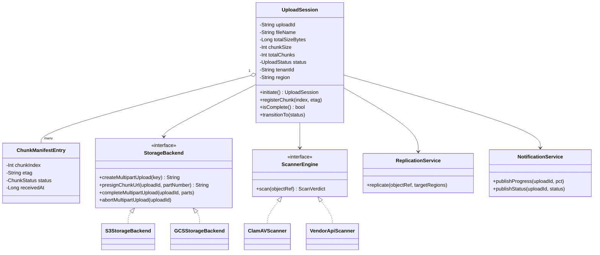
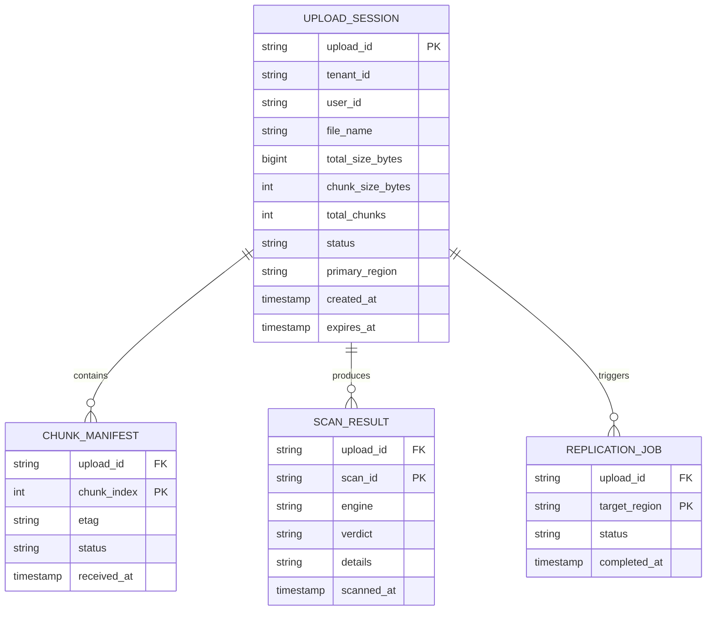
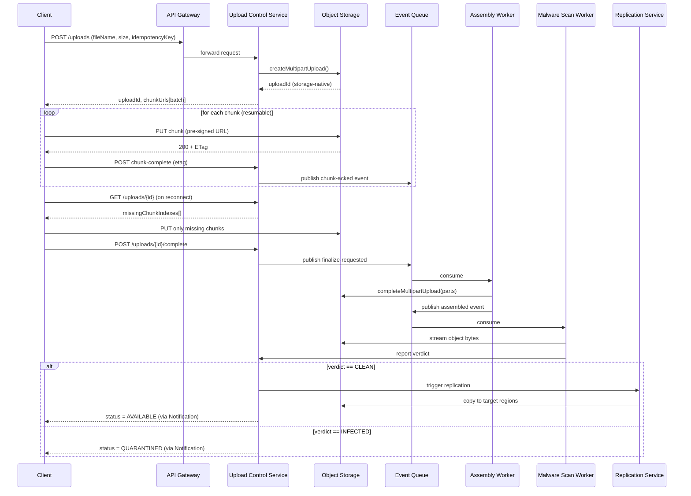

# File Upload Service — HLD & LLD

**Assumed metrics** (call out if different): 500K DAU · peak write QPS ~200 (session inits) · peak read QPS ~2,000 (status/progress polls) · 3-year retention horizon, ~5 PB/year ingest · p95 < 200ms for control-plane calls · AWS-primary, multi-region active-active storage.

---

# Phase 2: High-Level Design (HLD)

## 1. Scope & System Estimation

**Functional Requirements**
- Upload files up to 100 GB via chunked/multipart transfer
- Resume an interrupted upload from the last successfully received chunk
- Real-time progress reporting (bytes received / total, per-chunk status)
- Malware/virus scanning before a file is marked available for download
- Replicate stored objects across multiple regions for durability and locality

**Non-Functional Requirements**
- Availability: 99.95% for control plane, 99.99% for durability of stored objects (11 nines typical of object storage)
- Consistency: strong consistency for upload-session state (must not lose track of which chunks landed); eventual consistency acceptable for cross-region replication and search/listing
- Compliance: encryption at rest and in transit; regional data residency options (e.g., EU files stay in EU) for GDPR-type constraints
- Security: no file is servable until it passes malware scan (quarantine-by-default)

**Back-of-the-Envelope Estimation**

- Chunk size: 8–16 MB (sweet spot for retry cost vs. metadata overhead). Use 16 MB.
- A 100 GB file → 100 GB / 16 MB ≈ **6,400 chunks**.
- Peak concurrent uploads: 200 sessions/sec × avg session duration (assume 5 min for large files) ≈ **60,000 concurrent sessions**.
- Chunk-completion events per second: 60,000 sessions × (6,400 chunks / 300s avg upload) ≈ **~1.3M chunk-ack events/sec at extreme peak** — in practice most uploads are far smaller than 100GB, so realistic median chunk-event rate is a few thousand/sec; the 100GB case is the tail we design for, not the average.
- Storage growth: 5 PB/year → with 3x effective replication (2 extra region copies) → ~15 PB/year raw. At $0.023/GB/mo (S3 Standard) blended across regions, roughly **$400K–$600K/year** storage cost — a real budget lever (see Storage Tiering below).
- Metadata store sizing: 1 row per chunk × 6,400 chunks × (say) 50M files/year ≈ 320B rows/year if we kept per-chunk rows forever — this is why chunk-tracking state must be **ephemeral/TTL'd**, not permanent (see LLD §2).

## 2. System Architecture & Components

**Architecture Style**: Microservices, event-driven for the post-upload pipeline (scanning, replication), serverless-friendly for bursty control-plane pieces (session init, status). A monolith can't cleanly isolate the wildly different scaling profiles of "handle 60K concurrent byte streams" vs. "run a virus scanner" vs. "answer a progress-poll." Justification: independent scaling, independent failure domains (a scanner outage shouldn't block chunk ingestion), and the ability to swap the storage backend or scanner engine without touching the upload path.

**Component Breakdown**
- **API Gateway / Edge**: CloudFront + regional API Gateway, TLS termination, WAF, request routing to nearest region
- **Load Balancer**: ALB in front of the Upload Control Service
- **Upload Control Service** (stateless): creates upload sessions, issues signed chunk-upload URLs, tracks chunk manifest, exposes status endpoint
- **Chunk Ingestion**: clients PUT chunks **directly to object storage** via pre-signed URLs (not proxied through app servers) — critical for 100GB files, avoids app-tier becoming a bandwidth bottleneck
- **Message Queue** (Kafka/SQS): chunk-completed and file-completed events
- **Assembly/Finalize Worker**: on "all chunks received," triggers storage-native multipart-complete (e.g., S3 CompleteMultipartUpload)
- **Malware Scan Worker Pool**: pulls finalize events, streams object through scanner (ClamAV/ Cloud-native scanner), writes verdict
- **Replication Service**: cross-region async replication (S3 CRR or custom), driven off scan-passed event
- **Metadata/State Store**: session + chunk manifest + file status
- **Notification/Progress Service**: WebSocket or long-poll fan-out for live progress UI

**Data Flow Walkthrough**

*Write path (upload):*
1. Client calls `POST /uploads` → Upload Control Service creates session, decides chunk plan (size/count), writes session record, returns `uploadId` + pre-signed URLs for the first N chunks (URLs are minted lazily/batched, not all 6,400 at once).
2. Client PUTs each chunk directly to object storage using its pre-signed URL. Object storage returns an ETag per chunk.
3. Client (or a lightweight callback via S3 event) notifies Upload Control Service of chunk completion + ETag → recorded in chunk manifest, published to the queue.
4. Client polls (or subscribes) for progress; Progress Service reads manifest completion ratio.
5. When manifest shows all chunks acked, client calls `POST /uploads/{id}/complete` → Assembly Worker calls storage's native "complete multipart upload," producing one object.
6. Finalize event → Malware Scan Worker streams/scans the assembled object.
7. Pass → status flips to `AVAILABLE`, Replication Service copies to other regions, Notification Service pushes final status. Fail → status flips to `QUARANTINED`, object retained for audit but never served, user notified.

*Read path (progress / resume):*
1. Client reconnects after interruption, calls `GET /uploads/{id}` → server returns list of already-acked chunk indices.
2. Client computes the diff (which chunks it still needs to send) and resumes only those — this is the core of resumability.

## 3. Storage & Data Strategy

**Database Selection**
- **Object storage** (S3 / GCS / Azure Blob): the actual file bytes and chunks. Native multipart upload support is why we build on top of it rather than reinventing chunk assembly.
- **Session/manifest metadata**: a strongly-consistent, low-latency KV/document store (DynamoDB or Cassandra) keyed by `uploadId`, with a nested/sparse map of chunk-index → {etag, status, timestamp}. DynamoDB is a strong fit: single-digit-ms reads, native TTL for session cleanup, and can absorb the read-heavy progress-poll traffic without hitting the primary storage system.
- **Cache (Redis)**: hot progress counters (`chunksReceived/chunksTotal`) so progress polls don't hit DynamoDB on every request; write-through from the chunk-ack path.
- **Search/listing** (optional): if users need to browse "my files," a secondary index or OpenSearch cluster fed asynchronously off the file-completed event — kept out of the write-critical path.

**Trade-offs**: SQL (e.g., Postgres) could hold session state too, but at 60K+ concurrent sessions with bursty chunk-ack writes, a partition-friendly KV store scales horizontally more predictably than a single-writer relational primary.

**Data Lifecycle**
- **Sharding key**: `uploadId` (UUID) for metadata store — even distribution, no hot partitions from a single popular file.
- **Object key naming**: `{region}/{tenant}/{uploadId}/{chunkIndex}` pre-assembly, collapsing to `{region}/{tenant}/{fileId}` post-assembly — avoids S3 prefix hot-spotting by including high-cardinality prefixes early.
- **Indexing**: GSI on metadata store for `userId → uploadId` (list-my-uploads), GSI on `status` for ops dashboards (e.g., count of QUARANTINED files).
- **Replication topology**: active-active for storage (each region durable independently), single active region + standby for the control-plane database (promoted on regional failover) — file bytes are the expensive/critical thing to keep multi-region; control-plane state is cheaper to fail over.
- **Archival**: objects untouched for 90+ days move to Infrequent Access / Glacier-class storage via lifecycle policy; incomplete multipart uploads older than 24h are auto-aborted (both S3-native lifecycle rules) — this directly controls the storage cost estimated in §1.
- **Chunk manifest TTL**: once a file reaches `AVAILABLE` or `QUARANTINED` and is fully replicated, the granular chunk-level records are compacted into one summary record and the rest TTL out of DynamoDB — this is what keeps metadata storage from growing unboundedly (see the 320B-row estimate in §1).

## 4. Cross-Cutting Concerns & Trade-offs

**CAP Theorem & Trade-offs**
- Chunk manifest / session state: choose **CP** — a resumable upload must have a single source of truth for "which chunks landed"; a stale/partitioned answer here causes either data loss (thinking a chunk landed when it didn't) or wasted re-upload (safer failure mode). DynamoDB with strongly-consistent reads on this table.
- Cross-region file replication: choose **AP** — during a network partition, we'd rather accept uploads in the local region and replicate later than block writes waiting for a remote region to ack. Replication lag is monitored and surfaced, not hidden.
- Progress-poll reads: eventual consistency is fine (a progress bar 1 second stale is not a correctness bug) — allows Redis caching for read scaling.

**Resiliency & Security**
- **Circuit breakers**: around the malware-scanner call and cross-region replication call — if the scanner pool is degraded, incoming uploads still complete and queue for scanning rather than failing the whole upload.
- **Fallback**: if the primary scan engine is down, route to a secondary scanner vendor/instance pool rather than marking files available unscanned (fail-closed, never fail-open on security).
- **Rate limiting**: per-user and per-IP token bucket at the API Gateway on session-creation and status-poll endpoints (the actual byte transfer is rate-limited only by client bandwidth, not by us, since it bypasses app servers).
- **Encryption**: TLS 1.2+ in transit for all API and chunk-upload traffic; SSE-KMS (or equivalent) at rest, one CMK per tenant/region for key isolation.
- **AuthN/Z**: OAuth2/OIDC for user identity; the Upload Control Service mints short-lived, chunk-scoped pre-signed URLs (5–15 min expiry) so a leaked URL can't be replayed indefinitely or used for other files.
- **Malware isolation**: newly assembled objects live in a `quarantine/` bucket/prefix with a bucket policy that denies all `GetObject` except from the scanner role; only the Replication Service (triggered on PASS) can move/copy them into the public-serving prefix.

---

# Phase 3: Low-Level Design (LLD)

## 1. Class & Object-Oriented Design

**Design Patterns**
- **Strategy**: pluggable `StorageBackend` (S3 / GCS / Azure) and pluggable `ScannerEngine` (ClamAV / vendor API) behind common interfaces — lets us swap providers per region for data-residency reasons.
- **State Machine / State pattern**: `UploadSession` transitions (`INITIATED → IN_PROGRESS → ASSEMBLING → SCANNING → AVAILABLE/QUARANTINED/FAILED`) enforced centrally so no code path can skip the scan step.
- **Observer**: Notification Service subscribes to session-state-change events to push progress/completion to clients.
- **CQRS**: writes (chunk acks) go through the Upload Control Service into DynamoDB; reads (progress polls) are served from a Redis read-model kept eventually consistent via the same event stream — separates the hot write path from the hot read path.



## 2. Database Schema Design



**Table Definitions**

`UPLOAD_SESSION`

| Field | Type | Constraints | Description |
|---|---|---|---|
| upload_id | UUID/String | PK | Unique session identifier |
| tenant_id | String | Not Null, Indexed (GSI) | For data-residency/isolation |
| user_id | String | Not Null, Indexed (GSI) | Owner of the upload |
| file_name | String | Not Null | Original filename |
| total_size_bytes | BigInt | Not Null | Declared size, up to 100 GB |
| chunk_size_bytes | Int | Not Null | e.g., 16 MB |
| total_chunks | Int | Not Null | Computed at session creation |
| status | Enum/String | Not Null, Indexed (GSI) | INITIATED/IN_PROGRESS/ASSEMBLING/SCANNING/AVAILABLE/QUARANTINED/FAILED |
| primary_region | String | Not Null | Region of initial ingest |
| created_at | Timestamp | Not Null | — |
| expires_at | Timestamp | TTL attribute | Auto-expire abandoned sessions |

`CHUNK_MANIFEST`

| Field | Type | Constraints | Description |
|---|---|---|---|
| upload_id | String | PK (partition key), FK → UPLOAD_SESSION | Parent session |
| chunk_index | Int | Sort key | Position in file |
| etag | String | Nullable until acked | Storage-provider checksum |
| status | String | Not Null | PENDING/UPLOADED |
| received_at | Timestamp | Nullable | When ack was recorded |

`SCAN_RESULT`

| Field | Type | Constraints | Description |
|---|---|---|---|
| upload_id | String | FK → UPLOAD_SESSION | — |
| scan_id | UUID | PK | Unique scan run |
| engine | String | Not Null | Which scanner produced this |
| verdict | String | Not Null | CLEAN / INFECTED / ERROR |
| details | String | Nullable | Signature name if infected |
| scanned_at | Timestamp | Not Null | — |

`REPLICATION_JOB`

| Field | Type | Constraints | Description |
|---|---|---|---|
| upload_id | String | FK → UPLOAD_SESSION | — |
| target_region | String | PK (composite with upload_id) | Destination region |
| status | String | Not Null | PENDING/DONE/FAILED |
| completed_at | Timestamp | Nullable | — |

## 3. API & Interface Specifications

```yaml
openapi: 3.0.0
info:
  title: File Upload Service API
  version: "1.0"
paths:
  /uploads:
    post:
      summary: Initiate a resumable upload session
      requestBody:
        content:
          application/json:
            schema:
              type: object
              required: [fileName, totalSizeBytes, contentType]
              properties:
                fileName: { type: string }
                totalSizeBytes: { type: integer, format: int64 }
                contentType: { type: string }
                idempotencyKey: { type: string }
      responses:
        "201":
          description: Session created
          content:
            application/json:
              schema:
                type: object
                properties:
                  uploadId: { type: string }
                  chunkSizeBytes: { type: integer }
                  totalChunks: { type: integer }
                  chunkUrls:
                    type: array
                    items: { type: string }
        "409":
          description: Idempotency key conflict — returns existing session
        "400":
          description: totalSizeBytes exceeds 100GB limit or invalid payload

  /uploads/{uploadId}:
    get:
      summary: Get upload status / resume info
      responses:
        "200":
          description: Session state
          content:
            application/json:
              schema:
                type: object
                properties:
                  status: { type: string }
                  chunksReceived: { type: integer }
                  totalChunks: { type: integer }
                  missingChunkIndexes:
                    type: array
                    items: { type: integer }

  /uploads/{uploadId}/chunks/{chunkIndex}:complete:
    post:
      summary: Acknowledge a chunk as uploaded (client-driven ack, backstopped by storage event)
      requestBody:
        content:
          application/json:
            schema:
              type: object
              required: [etag]
              properties:
                etag: { type: string }
      responses:
        "200": { description: Chunk recorded }
        "409": { description: Chunk already recorded with different etag }

  /uploads/{uploadId}/complete:
    post:
      summary: Finalize upload once all chunks are received
      responses:
        "202": { description: Accepted — assembly and scan in progress }
        "409": { description: Missing chunks; returns list }

  /uploads/{uploadId}/errors:
    get:
      summary: Get error/quarantine details
      responses:
        "200":
          content:
            application/json:
              schema:
                type: object
                properties:
                  status: { type: string }
                  verdict: { type: string }
                  details: { type: string }
```

**Idempotency**
- `POST /uploads` requires a client-generated `idempotencyKey`; the server stores `(tenantId, idempotencyKey) → uploadId` with a 24h TTL, so a retried "create session" call returns the *same* session instead of creating a duplicate.
- Chunk-ack calls (`.../chunks/{index}:complete`) are naturally idempotent by design: re-acking chunk 42 with the same etag is a no-op; a different etag for an already-recorded chunk is rejected (`409`) to avoid silently overwriting a valid chunk with a stale retry.
- `POST /uploads/{id}/complete` is safe to retry: if the session is already `ASSEMBLING`/`SCANNING`/`AVAILABLE`, it returns the current status rather than re-triggering assembly.

## 4. Concrete Code Snippets & Sequence Flows



**Core Logic: Resumable Chunk Manifest Reconciliation** (the algorithmic heart of resumability — computing what a reconnecting client still needs to send)

```typescript
// chunkManifest.ts
interface ChunkRecord {
  chunkIndex: number;
  etag: string | null;
  status: "PENDING" | "UPLOADED";
}

interface UploadSessionRecord {
  uploadId: string;
  totalChunks: number;
  status: string;
}

class ChunkManifestService {
  constructor(
    private readonly db: ManifestRepository,
    private readonly logger: Logger
  ) {}

  /**
   * Returns the indexes of chunks the client still needs to upload.
   * This is the core resume operation: idempotent, safe to call repeatedly.
   */
  async getMissingChunks(uploadId: string): Promise<number[]> {
    const session = await this.db.getSession(uploadId);
    if (!session) {
      throw new NotFoundError(`No session for uploadId=${uploadId}`);
    }

    const records = await this.db.listChunkRecords(uploadId);
    const uploaded = new Set(
      records.filter(r => r.status === "UPLOADED").map(r => r.chunkIndex)
    );

    const missing: number[] = [];
    for (let i = 0; i < session.totalChunks; i++) {
      if (!uploaded.has(i)) missing.push(i);
    }

    this.logger.info("resolved_missing_chunks", {
      uploadId,
      missingCount: missing.length,
      totalChunks: session.totalChunks,
    });

    return missing;
  }

  /**
   * Records a chunk ack. Idempotent: re-acking the same etag is a no-op;
   * a conflicting etag for an already-recorded chunk is rejected.
   */
  async ackChunk(
    uploadId: string,
    chunkIndex: number,
    etag: string
  ): Promise<void> {
    const existing = await this.db.getChunkRecord(uploadId, chunkIndex);

    if (existing?.status === "UPLOADED") {
      if (existing.etag !== etag) {
        throw new ConflictError(
          `Chunk ${chunkIndex} already recorded with a different etag`
        );
      }
      return; // idempotent no-op
    }

    await this.db.putChunkRecord(uploadId, {
      chunkIndex,
      etag,
      status: "UPLOADED",
    });

    await this.maybeMarkSessionComplete(uploadId);
  }

  private async maybeMarkSessionComplete(uploadId: string): Promise<void> {
    const session = await this.db.getSession(uploadId);
    const records = await this.db.listChunkRecords(uploadId);
    const uploadedCount = records.filter(r => r.status === "UPLOADED").length;

    if (session && uploadedCount === session.totalChunks) {
      await this.db.updateSessionStatus(uploadId, "READY_TO_ASSEMBLE");
    }
  }
}

// --- minimal interfaces for the above (implemented by DynamoDB adapter) ---
interface ManifestRepository {
  getSession(uploadId: string): Promise<UploadSessionRecord | null>;
  getChunkRecord(uploadId: string, chunkIndex: number): Promise<ChunkRecord | null>;
  putChunkRecord(uploadId: string, record: ChunkRecord): Promise<void>;
  listChunkRecords(uploadId: string): Promise<ChunkRecord[]>;
  updateSessionStatus(uploadId: string, status: string): Promise<void>;
}

class NotFoundError extends Error {}
class ConflictError extends Error {}
interface Logger {
  info(event: string, meta: Record<string, unknown>): void;
}

// --- unit test placeholders ---
describe("ChunkManifestService", () => {
  it("returns all indexes as missing for a fresh session", async () => {
    // arrange: session with totalChunks=10, no chunk records
    // act: getMissingChunks(uploadId)
    // assert: result === [0,1,...,9]
  });

  it("excludes uploaded chunks from missing list after partial upload", async () => {
    // arrange: chunks 0-4 acked, 5-9 pending
    // assert: getMissingChunks returns [5,6,7,8,9]
  });

  it("ackChunk is idempotent for repeated identical etag", async () => {
    // act: ackChunk twice with same etag
    // assert: no error, single record persisted
  });

  it("ackChunk rejects conflicting etag for already-uploaded chunk", async () => {
    // act: ackChunk with different etag on already-UPLOADED chunk
    // assert: throws ConflictError
  });

  it("flips session to READY_TO_ASSEMBLE once last chunk acked", async () => {
    // arrange: totalChunks=3, chunks 0,1 already uploaded
    // act: ackChunk(uploadId, 2, etag)
    // assert: session.status === "READY_TO_ASSEMBLE"
  });
});
```

---

### Key design decisions worth flagging back to you
1. **Chunks go straight to object storage via pre-signed URLs, never through app servers** — this is what makes 100GB files and 60K concurrent uploads tractable without the app tier becoming a bandwidth bottleneck.
2. **Fail-closed on security**: files are quarantined by default until scanned, and replication only happens post-scan — malware never propagates to a second region.
3. **Chunk-level metadata is ephemeral** (TTL'd/compacted after completion) — without this, per-chunk rows would grow unboundedly (see the 320B-row/year estimate).

Let me know if you'd like me to go deeper on any single piece — e.g., the malware-scanning worker pool's autoscaling policy, the exact DynamoDB partition/GSI design, or a cost model comparing single-region vs. multi-region storage.
