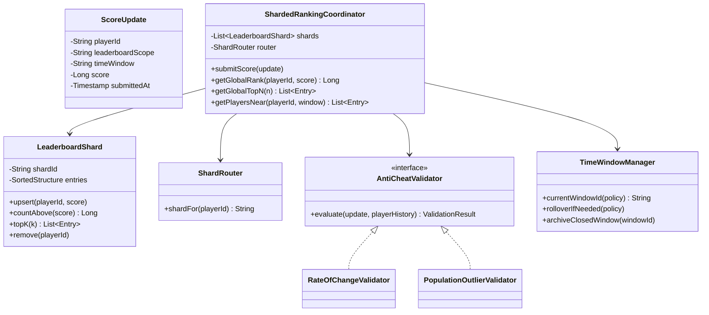
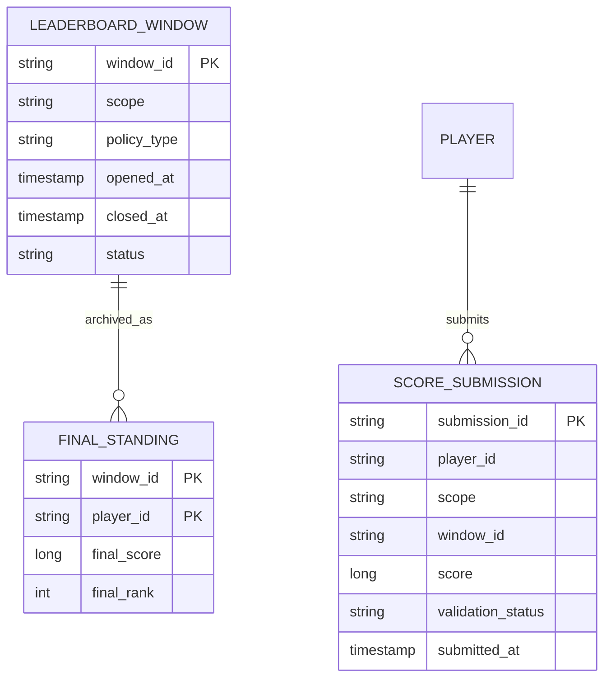
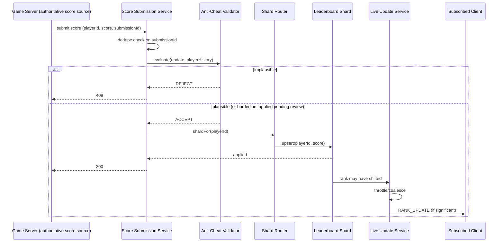

# Real-Time Gaming Leaderboard System — HLD & LLD

**Assumed metrics** (call out if different): ~50M DAU · ~5M peak concurrent active players · score submissions ~500K-1M writes/sec at peak · leaderboard reads (rank lookups, top-N views) several times the write rate, since every player checking their standing is a read · score-submission ack < 100ms · rank/top-N read < 50ms · multi-region, AWS-primary.

**Scope, explicitly enumerated**: submit/update a player's score in real time · retrieve a player's current global rank · retrieve the top-N leaderboard · retrieve "players near me" (a window of ranks around a given player) · support multiple leaderboard scopes simultaneously (global, regional, friends-only, per-game-mode) and multiple time windows (all-time, daily, weekly, seasonal) · push live rank-change notifications to interested clients · defend against score manipulation/cheating · analytics on leaderboard engagement.

**The core problem this design exists to solve**: a sorted set (score → ranked members, O(log n) insert and rank lookup) is the textbook-correct data structure for a leaderboard, and it works beautifully on a single node. The entire hard part of this design is what happens once one leaderboard has more players and more write throughput than any single node can hold — at that point "what's my exact rank out of 50 million people" is no longer a trivial local lookup, and getting it right (not approximately, not eventually, but correctly and fast) across a sharded fleet is where the real engineering is. This design reuses the connection/presence pattern from the chat app for live push updates and the fraud-detection posture from the banking and loyalty designs for anti-cheat, but the sharded-ranking algorithm itself is new to this conversation and gets the bulk of the attention below.

---

# Phase 2: High-Level Design (HLD)

## 1. Scope & System Estimation

**Functional Requirements**
- Accept score updates from game clients (or, better, from server-authoritative game logic) at high write volume and reflect them in ranking near-instantly
- Answer "what is player X's current rank" for a given leaderboard scope and time window
- Answer "show me the top N players" for a given scope/window, efficiently, since this is the most frequently-viewed screen
- Answer "show me players ranked near player X" (e.g., 5 above and 5 below) — the second most common leaderboard UI pattern after top-N
- Support multiple simultaneous leaderboard scopes (global, region, friends-of-player, per-game-mode) without each being a bespoke system
- Support time-windowed leaderboards (daily/weekly/seasonal resets) with historical archival of past windows
- Push live updates to clients actively viewing a leaderboard when ranks shift meaningfully, without polling
- Detect and reject/flag implausible or manipulated score submissions

**Non-Functional Requirements**
- Availability: 99.9%+ for both submission and read paths — a leaderboard that's down during active competitive play is a severe product failure, but briefly stale is not
- **Consistency: AP, and more purely so than almost any other system in this conversation except the ETA/location design** — a player's rank is, by nature, a snapshot of a constantly-shifting relative ordering; there is no meaningful sense in which a rank read a few hundred milliseconds ago was "wrong," it was simply a valid answer at that instant. This shapes every architectural decision below far more than in, say, the chat app, where message content itself (not just presence) does need a stronger guarantee.
- Latency: both submission and read paths need to be very fast, since both sit directly on active-gameplay and UI-refresh critical paths respectively
- Scalability: must handle both extremely high write throughput (every active player's score updates) and extremely high read throughput (every active player, and spectators, checking standings) simultaneously and independently, since these two loads don't necessarily correlate 1:1
- Fairness/integrity: the leaderboard's value proposition collapses if it's easily gamed — anti-cheat isn't a nice-to-have here, it's core to the product actually meaning anything

**Back-of-the-Envelope Estimation**
- 500K-1M score-submission writes/sec at peak for a single global leaderboard is well beyond what one node's sorted-set structure can sustain (a single-node in-memory sorted set can typically handle up to the order of a few hundred thousand ops/sec before becoming the bottleneck) — this is the concrete number that mandates sharding the leaderboard across many nodes, not a hypothetical future concern.
- Sharding by `playerId` (consistent hashing, same pattern as the load balancer's target routing) across, say, 64-128 shards brings per-shard write load down to single-digit-thousands/sec, comfortably within a single node's capacity — the shard count itself is a tunable capacity lever, not a hard architectural ceiling.
- The read side is dominated by two very different query shapes with very different costs: **top-N** (cheap if cached, since it changes relatively slowly at the very top — the #1 player doesn't change every second even if millions of scores are updating below them) and **individual player rank** (must reflect this specific player's current standing, effectively unique per requester, much harder to cache generically) — this split is exactly why the design below treats these as separate optimization problems rather than one generic "leaderboard query" path.
- Multiple simultaneous scopes multiply the underlying data structures needed (global × region × friends × game-mode × time-window is a genuine cross-product), but not the total data volume proportionally — most of these are much smaller than the global leaderboard (a friends leaderboard has dozens of entries, not 50 million), so the sharding/scaling problem described above is specifically a **global and large-regional leaderboard** problem; friends/small-scope leaderboards are cheap enough to handle with far simpler single-node structures.

## 2. System Architecture & Components

**Architecture Style**: Microservices, with the leaderboard data itself sharded and served from **in-memory sorted-set structures** (the Redis-ZSET model, whether literally Redis or an equivalent purpose-built structure) — the same "hot data lives entirely in memory, never touches a database on the query-serving hot path" principle used by the DNS design's zone data and the LB's routing tables, applied here to ranked score data. The genuinely novel architectural piece is the **sharded ranking layer** that makes exact global rank and top-N queries tractable despite the data being spread across many independent shards — detailed in §4 and the LLD, since this is the crux of the whole system.

**Component Breakdown**
- **Score Submission Service**: the front door for score updates — validates the request, applies anti-cheat checks (§4), and routes the update to the correct shard based on a consistent hash of `playerId`
- **Leaderboard Shard**: one node (or replica set) holding an in-memory sorted-set structure for its slice of players within one leaderboard scope+window — supports insert/update, "how many players outrank this score," and "top-K within this shard," all in `O(log n)` or better
- **Sharded Ranking Coordinator**: the component that answers cross-shard queries (global rank, global top-N) by fanning out to every shard and combining results correctly — this is the piece solving the core problem stated in the introduction, detailed fully in the LLD
- **Scope/Window Router**: resolves which set of shards a given query or update actually belongs to (global vs. regional vs. friends vs. per-mode, and which time-window bucket is currently active) — since these are structurally independent leaderboards under one API, not variations of a single dataset
- **Friends Leaderboard Service**: a much simpler, non-sharded path for small-cardinality leaderboards (a player's friend list) — reuses the Social Graph Service pattern from the earlier social-platform design to resolve "who are this player's friends," then does a cheap direct multi-get against those specific players' scores rather than any sharded-ranking machinery
- **Live Update/Push Service**: reuses the chat app's Connection Gateway + presence-style broadcast pattern directly — clients actively viewing a leaderboard subscribe to a channel, and meaningful rank changes are pushed, throttled/coalesced the same way the ETA design throttles location updates (not every single score change needs to reach every viewer instantly, just "significant enough" ones)
- **Anti-Cheat/Score Validation Service**: real-time plausibility scoring on submissions (rate-of-score-increase anomaly detection, statistical outlier flagging), same architectural role and fail-closed-on-suspicion posture as the banking design's fraud service and the loyalty platform's AML detection, applied to score integrity instead of financial fraud
- **Time-Window Manager**: handles the daily/weekly/seasonal rollover — at window boundary, the "current" window's shards are frozen, archived, and a fresh empty set of shards begins the next window, rather than trying to mutate a live sharded structure's time semantics in place
- **Historical Archive**: durable storage of past windows' final standings, for "last season's leaderboard" lookups — read-rarely, so a much simpler storage tier than the live shards
- **Analytics Pipeline**: Lambda-architecture (streaming + batch), same structural role as the loyalty and social-platform analytics pipelines, here computing engagement metrics (submission rates, rank-volatility, time-to-reach-top-N) rather than purchase or post-engagement events

**Data Flow Walkthrough**

*Write path (a player's score update):*
1. Game client (ideally, server-authoritative game logic, not the client directly — see §4) submits a score update for a player, scope, and time window.
2. Score Submission Service runs anti-cheat plausibility checks; a clearly implausible jump is rejected outright, a borderline one is flagged for async review but still tentatively applied (mirrors the banking design's "fail closed only when the stakes justify blocking legitimate activity," here erring toward not disrupting real players over one suspicious-looking but possibly-legitimate great play).
3. Scope/Window Router determines the correct shard set (e.g., global all-time, this player's region this week, etc. — a single score submission may fan out to update several scope+window combinations in parallel, since a player is simultaneously on multiple leaderboards).
4. For each relevant leaderboard, the update is routed via consistent hash of `playerId` to the owning Leaderboard Shard, which updates its in-memory sorted structure.
5. If the player's rank shifted meaningfully (crossed into top-N, passed a followed rival, etc.), the Live Update/Push Service notifies subscribed clients — throttled/coalesced, not fired on every micro-change.

*Read path (checking rank / viewing top-N):*
1. **Top-N request**: Sharded Ranking Coordinator fans out a "give me your local top-K" request to every shard for the relevant scope+window, merges the results (bounded, cheap — detailed in the LLD), and returns the global top-N. This result is aggressively cacheable for a short TTL, since the very top of a large leaderboard changes relatively slowly in relative terms even under heavy overall write load.
2. **Individual player rank request**: Sharded Ranking Coordinator fans out a "how many of your players outrank this score" request to every shard, sums the counts, and returns `rank = sum + 1` — an exact, not approximate, answer, made tractable specifically because the *shard count* is small (tens to low hundreds) even though the *player count* is enormous, so the fan-out cost is bounded regardless of total leaderboard size.
3. **Players-near-me request**: resolved against the single shard owning the requesting player (their local neighborhood is, almost always, a good proxy for their global neighborhood at the shard-count scale used here) with a boundary-correction step for players near a shard's local rank edges — detailed in the LLD.

## 3. Storage & Data Strategy

**Database Selection**
- **Leaderboard Shards**: in-memory sorted-set structures (Redis ZSET is the canonical real-world choice; conceptually a skip list or balanced tree keyed by score) — chosen because rank-by-score and range queries are exactly what this structure is built for, at the O(log n) cost the latency budget demands; a general-purpose database would not sustain this write/read throughput at this latency on the hot path.
- **Durable backing store**: the in-memory shards are backed by a durable store (could be a simple periodic snapshot + write-ahead log, or the underlying in-memory store's own persistence mechanism) — not for the query hot path, but so a shard restart doesn't lose live standings; this mirrors the "in-memory for speed, durable for recovery" split used by the DNS design's authoritative-nameserver zone data.
- **Historical Archive**: a much simpler read-optimized store (could be a plain relational table or document store) for past windows' final standings — doesn't need sorted-set query performance since it's queried rarely and the "final rank" is already computed and static once a window closes.
- **Friends Leaderboard data**: no dedicated store at all — computed on demand from the Social Graph Service's existing follow/friend data plus a direct multi-get against the relevant players' current scores, since the cardinality here (dozens, not millions) makes this cheap without any sharded-ranking machinery.
- **Analytics warehouse**: same bronze/silver/gold data-lake-plus-warehouse shape as the loyalty and social-platform designs.

**Data Lifecycle**
- **Shard rebalancing**: as a leaderboard's player count grows, shard count can increase (consistent hashing minimizes the remap cost, direct reuse of the load balancer design's consistent-hashing-with-virtual-nodes approach) — this decouples "how many players does this leaderboard have" from any hard architectural ceiling.
- **Time-window rollover**: at a window's boundary (daily/weekly/seasonal), the live shard set for that window is frozen, its final state is written to the Historical Archive, and the shards are either recycled (repurposed for the next window, cheaper) or torn down and freshly provisioned — either way, this is a clean cut-over rather than trying to reset a live, actively-written-to sorted structure in place, avoiding a whole class of "did the reset race with an in-flight update" bugs.
- **Player-removed-from-leaderboard handling** (e.g., account banned for cheating after the fact): rather than trying to retroactively re-rank everyone below the removed player (expensive and, at this AP-leaning consistency model, unnecessary), the removed player's entry is simply deleted from their shard, and subsequent rank queries naturally reflect the corrected count — no special-cased "shift everyone down" operation needed, because rank is always computed fresh from current shard state, never stored as a static per-player field.
- **Live-update subscription teardown**: identical lifecycle to the chat app's session teardown — when a client stops viewing a leaderboard, its subscription is cleaned up, keeping "actively pushed to" resource usage proportional to actual viewers, not total players.

## 4. Cross-Cutting Concerns & Trade-offs

**CAP Theorem & Trade-offs**
- **Rank and leaderboard position: unambiguously AP**, and more purely so than almost anywhere else in this conversation — unlike a bank balance (which has one objectively correct value at any instant) or even a document's content (which has one mathematically-converged-upon correct value), a "global rank" computed via scatter-gather across dozens of independently-updating shards is, by construction, a best-effort snapshot the moment any shard's data changes mid-query. This isn't a compromise; a stronger consistency model here would add real latency cost for a correctness guarantee that doesn't meaningfully exist to guarantee in the first place.
- **Score submission durability**: leans more CP-like than the rank-reading side — a player's legitimately-earned score update should not be silently lost, even though the resulting *rank* is always approximate-by-nature; this mirrors the ETA design's split between "location is purely AP" and "a completed trip's fare/receipt needs durability," applied here to "a submitted score is durable, the rank derived from it is a live approximation."
- **Anti-cheat holds**: fail toward **not disrupting legitimate players** for borderline cases, unlike the banking design's stricter fail-closed posture — the cost asymmetry is different here (a wrongly-blocked great play frustrates a player and damages trust in the product; a wrongly-allowed cheat is bad but correctable after the fact via review and retroactive removal, which the AP-leaning "always compute rank fresh" design already supports cleanly).

**Resiliency & Security**
- **Score validation should be server-authoritative wherever the game architecture allows it** — the strongest anti-cheat measure isn't detecting bad client-submitted scores after the fact, it's never trusting the client to report its own score in the first place; where game logic runs server-side (common for competitive/ranked modes), the score submission comes from trusted server infrastructure, not the player's device, which sidesteps an entire category of client-tampering attacks before they're even a detection problem.
- **Statistical anomaly detection for cases where client-reported scores are unavoidable** (e.g., offline-capable games syncing later): rate-of-improvement outlier detection, comparison against the player's own historical distribution and against population-level plausible-score distributions — same architectural shape as the loyalty platform's AML batch pattern detection and the banking design's fraud scoring, applied to score plausibility instead of financial transaction patterns.
- **Rate limiting on submissions**: per-player token-bucket limits (same pattern as the API Gateway and LB designs) prevent both accidental client bugs (a runaway retry loop) and deliberate submission-flooding abuse from overwhelming a shard.
- **Shard-failure resilience**: a single shard going down affects only its slice of players, not the whole leaderboard — the Sharded Ranking Coordinator's fan-out queries degrade gracefully (a temporarily-unreachable shard's count is either retried briefly or the response is marked as a partial/estimated result rather than failing the entire rank query outright), consistent with the AP posture already established for this system.
- **Live-update push doesn't become a thundering herd**: rank-change notifications are throttled and coalesced (same technique as the ETA design's significance-filtered location broadcasts) so a volatile leaderboard moment (many players near a rank boundary simultaneously) doesn't flood every subscribed client with a notification per micro-change.

---

# Phase 3: Low-Level Design (LLD)

## 1. Class & Object-Oriented Design

**Design Patterns**
- **Strategy**: pluggable `LeaderboardScope` (Global, Regional, Friends, PerGameMode) and pluggable `TimeWindowPolicy` (AllTime, Daily, Weekly, Seasonal) — composed rather than hard-coded, so new scope/window combinations don't require new plumbing.
- **Scatter-Gather**: the `ShardedRankingCoordinator` is a direct implementation of the scatter-gather pattern — fan a query out to all shards, combine results, return one answer — the architectural heart of this whole system.
- **Composite/aggregation**: global top-N is computed by taking each shard's local top-K and merging, a specific, provably-correct instance of scatter-gather detailed in the code below.
- **Observer**: live-update subscriptions follow the same publish/subscribe shape used by the chat app's presence and the doc editor's operation broadcast.



## 2. Database Schema Design

*(Live leaderboard data is in-memory sorted structures, not a traditional schema — the tables below cover what's genuinely durable: submission audit trail and historical window archives.)*



**Table Definitions**

`LEADERBOARD_WINDOW`

| Field | Type | Constraints | Description |
|---|---|---|---|
| window_id | String | PK | e.g., `weekly_2026-W30` |
| scope | String | Not Null | GLOBAL / REGIONAL / per-game-mode identifier |
| policy_type | String | Not Null | ALL_TIME / DAILY / WEEKLY / SEASONAL |
| opened_at | Timestamp | Not Null | — |
| closed_at | Timestamp | Nullable | Null while still live |
| status | String | Not Null | ACTIVE / ARCHIVED |

`FINAL_STANDING` (only populated on window close — this is the historical archive, not live data)

| Field | Type | Constraints | Description |
|---|---|---|---|
| window_id | String | FK → LEADERBOARD_WINDOW | — |
| player_id | String | PK (composite) | — |
| final_score | Long | Not Null | — |
| final_rank | Int | Not Null | Computed once at close, static thereafter — unlike live rank, this genuinely is a fixed fact once archived |

`SCORE_SUBMISSION` (append-only audit trail, partitioned by time — feeds anti-cheat's historical-pattern checks and dispute investigation)

| Field | Type | Constraints | Description |
|---|---|---|---|
| submission_id | String | PK | — |
| player_id | String | Not Null, Indexed | — |
| score | Long | Not Null | — |
| validation_status | String | Not Null | ACCEPTED / FLAGGED / REJECTED |
| submitted_at | Timestamp | Not Null | — |

## 3. API & Interface Specifications

```yaml
openapi: 3.0.0
info:
  title: Leaderboard Service API
  version: "1.0"
paths:
  /leaderboards/{scope}/scores:
    post:
      summary: Submit a score update (idempotent per submission ID)
      requestBody:
        content:
          application/json:
            schema:
              type: object
              required: [playerId, score, submissionId]
              properties:
                playerId: { type: string }
                score: { type: integer }
                submissionId: { type: string }
                timeWindow: { type: string, default: "current" }
      responses:
        "200": { description: Accepted and applied }
        "202": { description: Accepted, pending anti-cheat review }
        "409": { description: Rejected as implausible }

  /leaderboards/{scope}/rank/{playerId}:
    get:
      summary: Get a player's current global rank
      parameters:
        - name: timeWindow
          in: query
          schema: { type: string, default: "current" }
      responses:
        "200":
          content:
            application/json:
              schema:
                type: object
                properties:
                  rank: { type: integer }
                  score: { type: integer }
                  totalPlayers: { type: integer }

  /leaderboards/{scope}/top:
    get:
      summary: Get the top-N leaderboard
      parameters:
        - name: n
          in: query
          schema: { type: integer, default: 100 }
        - name: timeWindow
          in: query
          schema: { type: string, default: "current" }
      responses:
        "200":
          content:
            application/json:
              schema:
                type: object
                properties:
                  entries:
                    type: array
                    items:
                      type: object
                      properties:
                        rank: { type: integer }
                        playerId: { type: string }
                        score: { type: integer }

  /leaderboards/{scope}/nearby/{playerId}:
    get:
      summary: Get players ranked near this player
      parameters:
        - name: windowSize
          in: query
          schema: { type: integer, default: 5, description: "Players above and below" }
      responses:
        "200":
          content:
            application/json:
              schema:
                type: object
                properties:
                  entries: { type: array, items: { type: object } }
```

**Idempotency**
- Every score submission carries a client- or game-server-generated `submissionId`; the Score Submission Service dedupes on this before applying — a retried submission after an ack timeout doesn't double-count or overwrite with a stale value out of order, same idempotency-key discipline as every write path in this conversation.
- A score update is applied as an **upsert against the player's best-known score for that scope+window** (many leaderboards track "best score this window," not "most recent score") — resubmitting a lower score than the player's current best is a no-op by design, not an error; this is a domain-specific idempotency rule layered on top of the generic submission-ID dedup.
- Rank and top-N reads are pure, side-effect-free queries, trivially safe to retry.

## 4. Concrete Code Snippets & Sequence Flows



**Core Logic: Sharded Global Rank and Top-N via Correctness-Preserving Scatter-Gather** (the algorithm that makes exact global ranking tractable despite the data being spread across many independently-scaling shards — this is the actual hard problem stated in the introduction, solved concretely here)

```python
# sharded_leaderboard.py
import bisect
from dataclasses import dataclass
from typing import Optional
import logging

logger = logging.getLogger("leaderboard.sharded")


@dataclass(frozen=True)
class Entry:
    player_id: str
    score: int


class LeaderboardShard:
    """
    One shard's slice of the leaderboard, held entirely in memory.
    Maintains a score-sorted structure (a plain sorted list + bisect here
    for clarity; a production system would use a skip list / Redis ZSET
    for O(log n) insert as well, not just O(log n) search) supporting the
    two operations the sharded coordinator actually needs: 'how many
    entries outrank this score' and 'my local top K'.
    """

    def __init__(self, shard_id: str):
        self.shard_id = shard_id
        self._scores: list[int] = []          # kept sorted ascending
        self._player_by_score_index: dict[int, list[str]] = {}
        self._score_by_player: dict[str, int] = {}

    def upsert(self, player_id: str, score: int) -> None:
        existing_score = self._score_by_player.get(player_id)
        if existing_score is not None:
            if score <= existing_score:
                return  # "best score" semantics: never regress on a lower resubmission
            self._remove_internal(player_id, existing_score)

        idx = bisect.insort_left(self._scores, score) or bisect.bisect_left(
            self._scores, score
        )
        self._player_by_score_index.setdefault(score, []).append(player_id)
        self._score_by_player[player_id] = score

    def _remove_internal(self, player_id: str, score: int) -> None:
        self._scores.remove(score)  # O(n) here for clarity; a real skip-list
        # implementation makes this O(log n) — noted as the production gap.
        holders = self._player_by_score_index.get(score, [])
        if player_id in holders:
            holders.remove(player_id)
        if not holders:
            self._player_by_score_index.pop(score, None)
        self._score_by_player.pop(player_id, None)

    def count_above(self, score: int) -> int:
        """How many entries in THIS shard strictly outrank `score`.
        This is the primitive the global-rank scatter-gather sums across
        all shards."""
        idx = bisect.bisect_right(self._scores, score)
        return len(self._scores) - idx

    def top_k(self, k: int) -> list[Entry]:
        """This shard's own top K, highest first. Correctness proof for
        why this is sufficient input to a *global* top-K merge: any
        player in the true global top-K cannot have more than K-1
        players outranking them within their own shard — if they did,
        those same shard-mates would already outrank them globally too,
        contradicting global top-K membership. So the true global top-K
        is always a subset of the union of every shard's local top-K."""
        result: list[Entry] = []
        for score in reversed(self._scores[-k:] if len(self._scores) >= k else self._scores):
            for player_id in self._player_by_score_index.get(score, []):
                result.append(Entry(player_id, score))
                if len(result) >= k:
                    return result
        return result

    def size(self) -> int:
        return len(self._scores)


class ShardRouter:
    def __init__(self, shard_ids: list[str]):
        self._shard_ids = shard_ids

    def shard_for(self, player_id: str) -> str:
        # Consistent hashing in production (reusing the LB design's ring);
        # simplified to a stable modulo here for clarity of the ranking
        # logic, which is this snippet's actual focus.
        index = hash(player_id) % len(self._shard_ids)
        return self._shard_ids[index]


class ShardedRankingCoordinator:
    """
    Owns the scatter-gather logic that makes exact global rank and
    global top-N tractable: fan out to a BOUNDED number of shards
    (not proportional to player count), combine, return. This is the
    architectural core of the entire leaderboard system.
    """

    def __init__(self, shards: dict[str, LeaderboardShard], router: ShardRouter):
        self._shards = shards
        self._router = router

    def submit_score(self, player_id: str, score: int) -> None:
        shard_id = self._router.shard_for(player_id)
        self._shards[shard_id].upsert(player_id, score)

    def get_global_rank(self, player_id: str, score: int) -> int:
        """Exact global rank via scatter-gather: sum, across every shard,
        how many entries outrank this score. Cost is O(num_shards *
        log(shard_size)), NOT O(total_players) — this is what keeps rank
        lookups fast regardless of total leaderboard size, since
        num_shards is a bounded, tunable capacity knob (per HLD §2),
        while total_players is not bounded at all."""
        total_outranking = 0
        for shard in self._shards.values():
            total_outranking += shard.count_above(score)
        return total_outranking + 1  # rank is 1-indexed

    def get_global_top_n(self, n: int) -> list[Entry]:
        """Correct global top-N via the proven-sufficient local-top-K
        union: each shard contributes at most N candidates (not its
        entire dataset), bounding merge cost to O(num_shards * N *
        log(num_shards * N)) regardless of how large any individual
        shard is."""
        candidates: list[Entry] = []
        for shard in self._shards.values():
            candidates.extend(shard.top_k(n))

        candidates.sort(key=lambda e: e.score, reverse=True)
        return candidates[:n]

    def get_total_players(self) -> int:
        return sum(shard.size() for shard in self._shards.values())


# --- unit test placeholders ---
def test_upsert_ignores_lower_resubmission():
    # arrange: shard with player "p1" at score 100
    # act: upsert("p1", 80)
    # assert: player's score remains 100 (best-score semantics)
    pass


def test_upsert_replaces_on_higher_resubmission():
    # arrange: shard with player "p1" at score 100
    # act: upsert("p1", 150)
    # assert: count_above(120) reflects p1's new score, count_above(120)
    #         no longer counted at the old score of 100
    pass


def test_get_global_rank_sums_across_all_shards():
    # arrange: 3 shards with known score distributions; a target score
    #          known to be outranked by a specific total count across all
    #          shards combined
    # act: get_global_rank(player_id, score)
    # assert: matches the hand-computed sum + 1, not any single shard's
    #         local count alone
    pass


def test_get_global_top_n_is_correct_even_when_concentrated_in_one_shard():
    # arrange: shard A holds the true global top 5 scores; shards B and C
    #          hold lower scores
    # act: get_global_top_n(5)
    # assert: result exactly matches shard A's top 5 — proves the
    #         local-top-K-union approach doesn't miss a shard that happens
    #         to concentrate all the best players
    pass


def test_get_global_top_n_correctly_merges_across_shards():
    # arrange: the true global top 5 is split, e.g., 3 from shard A and 2
    #          from shard B, interleaved by score
    # act: get_global_top_n(5)
    # assert: result is the correct interleaved top 5, properly sorted by
    #         score descending across shard boundaries
    pass


def test_removed_player_is_excluded_from_subsequent_rank_and_top_n():
    # arrange: a player present in a shard, included in a top_k result
    # act: remove the player (e.g., banned for cheating), then re-query
    # assert: rank/top-N queries no longer include them, and other
    #         players' ranks shift naturally since rank is always computed
    #         fresh from current shard state, never stored statically
    pass
```

---

### Key design decisions worth flagging back to you
1. **The core insight is bounding fan-out cost by shard count, not player count.** Both exact global rank (`sum of count_above across shards`) and exact global top-N (`merge of each shard's local top-K`) are provably correct algorithms whose cost scales with the number of shards (a tunable, bounded capacity knob) rather than the number of players (unbounded) — this is what makes "exact," not "approximate," global ranking achievable at real scale.
2. **Rank is never stored, only ever computed fresh from current data** — this is a deliberate consequence of the AP-leaning consistency model: because there's no canonical "your rank as of time T" value worth persisting, removing a cheater or correcting a score never requires any cascading "shift everyone else's stored rank" operation, it just naturally falls out of the next scatter-gather query.
3. **Anti-cheat leans toward not disrupting legitimate players**, a deliberately different risk posture than the banking design's stricter fail-closed stance — the asymmetry of costs (frustrating a genuine great play vs. a correctable-after-the-fact cheat) is different here, and the design's risk posture follows that difference rather than applying one universal security stance regardless of domain.

Let me know if you want to go deeper on any piece — e.g., a real skip-list-based shard implementation with O(log n) removal (the plain sorted-list version here trades that for clarity), the live-update throttling/coalescing algorithm in more detail, or how seasonal-reset rewards/tiering would layer on top of this.
