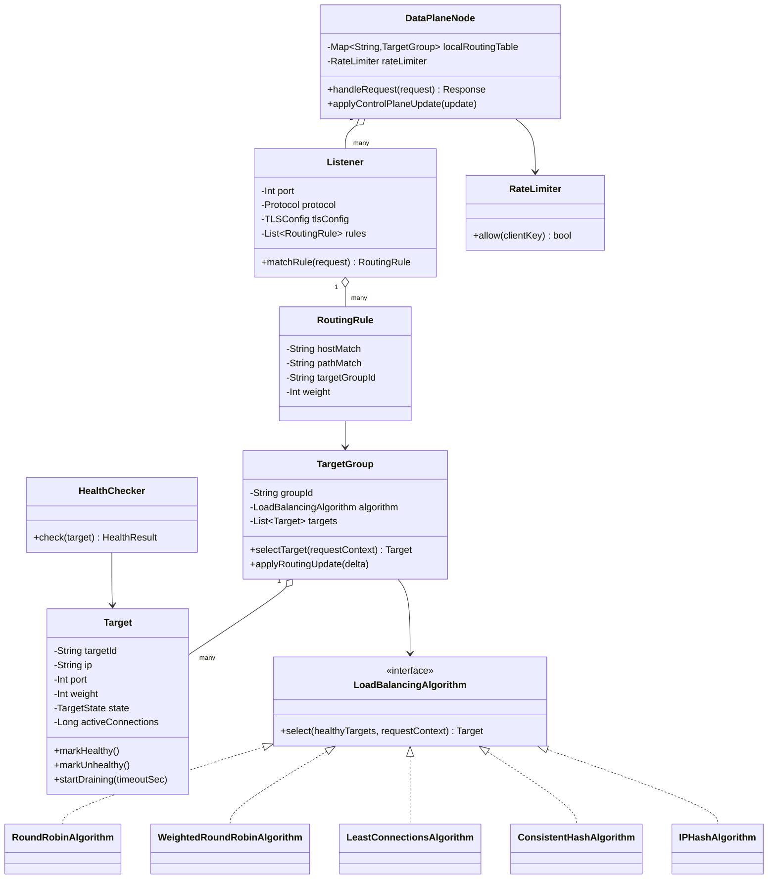
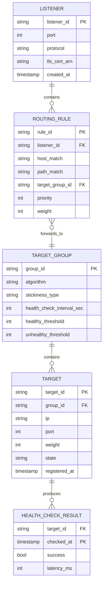
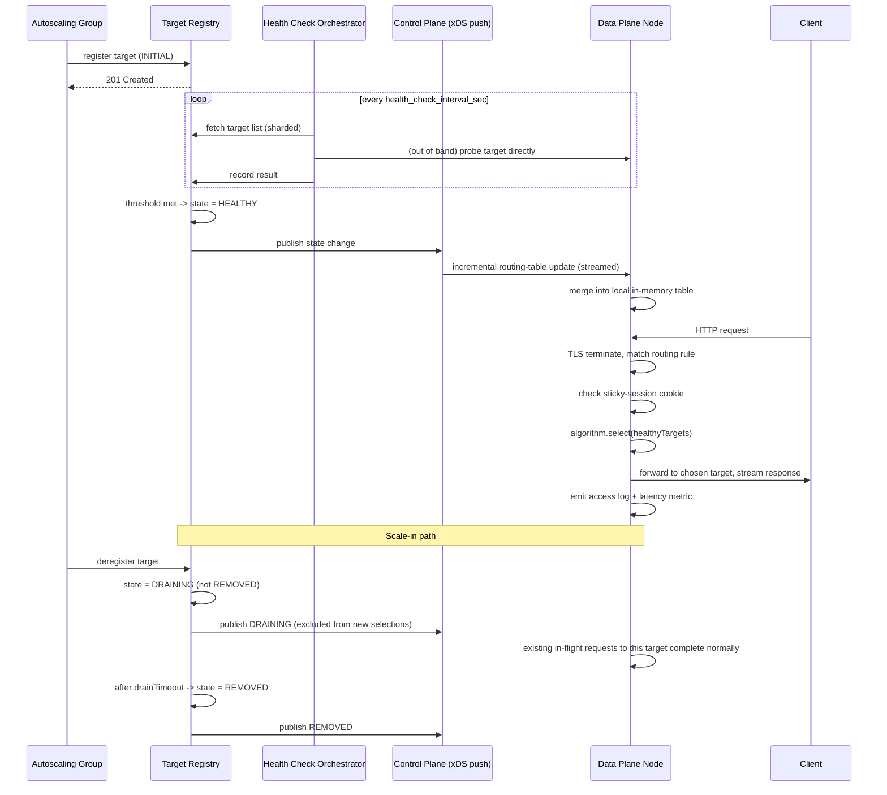

# Load Balancer System Design — HLD & LLD

**Assumed metrics** (call out if different): ~5M requests/sec peak across the fleet · ~1M+ registered backend targets across services/regions · L4 forwarding overhead < 1ms p99, L7 overhead < 5ms p99 · 99.99%+ availability for the LB itself · multi-region active-active · AWS-primary but portable.

**Scope of "all features a standard LB supports"**, explicitly enumerated so nothing is silently dropped:
L4 (TCP/UDP) and L7 (HTTP/HTTPS/HTTP2/gRPC) load balancing · multiple algorithms (round robin, weighted round robin, least connections, least response time, IP hash, consistent hashing) · active + passive health checks · TLS termination and TLS passthrough · sticky sessions (cookie- and IP-based) · connection draining / graceful deregistration · dynamic target registration (autoscaling-aware) · path/host-based L7 routing rules · weighted traffic splitting (canary/blue-green) · rate limiting · multi-AZ and multi-region failover · global server load balancing (GSLB) via DNS/anycast · observability (metrics, access logs, request tracing).

---

# Phase 2: High-Level Design (HLD)

## 1. Scope & System Estimation

**Functional Requirements**
- Accept client connections/requests and forward them to a healthy backend chosen by a configurable algorithm
- Support both L4 (raw TCP/UDP passthrough) and L7 (HTTP-aware routing on host/path/headers) modes
- Continuously health-check backends and stop routing to unhealthy ones within a bounded detection window
- Allow backends to be added/removed dynamically (autoscaling groups scale up/down constantly) without dropping in-flight connections
- Support session affinity (sticky sessions) when an application needs it
- Support weighted traffic splitting for canary/blue-green rollouts
- Route clients to the nearest/healthiest **region** (GSLB), not just the nearest backend within a region
- Terminate TLS (offload backend certificate management) or pass it through untouched when the backend needs the raw handshake
- Rate-limit abusive clients before they reach backends
- Emit metrics/logs sufficient to debug "why did my request go to that backend" after the fact

**Non-Functional Requirements**
- Availability: 99.99%+ for the data plane (the thing actually forwarding packets); control plane (config changes, target registration) can tolerate 99.9% since a brief control-plane delay just means slower autoscaling reaction, not dropped traffic
- Consistency: the **data plane's view of "which targets are healthy"** must converge quickly (seconds) but doesn't need strong consistency across every LB node simultaneously — eventual consistency with a bounded staleness window is the right and standard trade-off (see CAP discussion in §4)
- Compliance/security: TLS 1.2+ only, no plaintext credential leakage in logs, isolation between tenants if this is a multi-tenant/shared LB fleet
- Scalability: must handle a 10x traffic spike (flash sale, viral event) by scaling data-plane nodes horizontally, not by making existing nodes work harder past a safe ceiling

**Back-of-the-Envelope Estimation**
- 5M RPS fleet-wide, assume each data-plane node handles ~50K RPS sustained (realistic for a well-tuned L7 proxy) → **~100 data-plane nodes** minimum, more for headroom and multi-AZ spread → design for **300+ nodes** across AZs/regions.
- Health check traffic: 1M targets × 1 check/5sec (typical interval) = **200K health-check requests/sec** generated *by the LB fleet itself* — this is nontrivial background load that must be accounted for separately from client traffic, and is why health checks are usually sharded (not every LB node checks every target — see §3).
- Connection state: at 5M RPS with average connection reuse (keep-alive) holding ~20 requests/connection, that's **~250K concurrent connections** fleet-wide at steady state — a number any modern L4/L7 proxy (Envoy-class) handles per-node in the tens of thousands, reinforcing the ~100-300 node estimate.
- Config/target-registry writes: autoscaling churn assumed at ~1% of targets changing per minute → **~10K target register/deregister events/minute** at 1M targets — this must propagate to all data-plane nodes within a few seconds to avoid routing to now-terminated instances.

## 2. System Architecture & Components

**Architecture Style**: **Separated control plane / data plane**, the standard and only architecture that scales here — this is explicitly the Envoy/xDS model (also how ALB/NLB, Istio, and most modern LBs are built internally). Justification: the data plane (the thing on the hot path forwarding every packet) must be simple, fast, and horizontally stateless-scalable; the control plane (deciding *what* the data plane's routing table should look like — target lists, health status, weights, rules) can be more complex and slower without affecting request latency, because it only ever pushes *updates*, it never sits in the request path.

**Component Breakdown**
- **Data Plane Nodes** (the actual proxies): terminate/forward client connections, run the selected LB algorithm locally against a cached routing table, perform TLS termination, apply rate limits, emit metrics — built on an Envoy-style architecture (or equivalent custom proxy) for both L4 and L7
- **Control Plane**: the brain — target registry, health-check orchestrator, config/rules API, pushes routing-table updates to data-plane nodes (xDS-style streaming API, not polling, to keep propagation sub-second)
- **Health Check Orchestrator**: schedules and executes health checks against registered targets (sharded across a worker pool, not run redundantly by every data-plane node — see §3), publishes health status changes to the control plane
- **Target Registry**: source of truth for "what backends exist, in which target group, with what weight" — fed by autoscaling group lifecycle hooks so scale-out/scale-in events register/deregister automatically
- **GSLB / DNS Layer**: Route53-style geo/latency-based DNS resolution (or Anycast IP) that sends a client to the *nearest healthy region's* VIP before any single-region LB ever sees the request
- **Config API / Control Console**: where operators define listeners, routing rules, target groups, algorithms, weights, TLS certs
- **Rate Limiter**: token-bucket service, either embedded in each data-plane node (local, approximate) or backed by a shared counter (Redis, exact but adds a hop) depending on precision needs — see trade-off in §3
- **Metrics/Logging Pipeline**: streams access logs and per-request routing decisions to a log store; aggregated metrics (RPS, error rate, latency per target) feed both dashboards and the health-check orchestrator's passive-health signal

**Data Flow Walkthrough**

*Write path (target registration / config change):*
1. An autoscaling group launches a new instance → lifecycle hook calls the Target Registry API to register it into its target group (with initial state `INITIAL`, not yet routable).
2. Health Check Orchestrator picks up the new target, begins active health checks against it.
3. After N consecutive successful checks (configurable, e.g., 3), target flips to `HEALTHY` in the registry.
4. Control Plane pushes an incremental routing-table update to all relevant data-plane nodes via the streaming xDS-style channel — nodes merge this into their local in-memory routing table, no restart, no dropped connections.
5. Symmetrically, on scale-in: the instance is marked `DRAINING` (not immediately removed) — see connection draining in §4 — then removed from the registry once drained, propagating the same way.

*Read path (a client request):*
1. Client DNS-resolves the service hostname → GSLB layer returns the IP/VIP of the nearest healthy region.
2. Client connects to that region's data-plane node (via anycast or a regional load-balancing tier in front of the proxy fleet itself).
3. Data-plane node terminates TLS (if configured), inspects the request (for L7: host/path/headers), matches it against the local routing-table rules to pick a target group.
4. Node applies the target group's configured algorithm (round robin, least-connections, consistent hashing, etc.) over the **currently healthy** targets in its local cached view to pick one backend.
5. Node checks/sets a sticky-session cookie if affinity is configured, applies rate-limit check, forwards the request, streams the response back, emits an access-log line and per-target latency/error metrics.

## 3. Storage & Data Strategy

**Database Selection**
- **Target Registry**: a strongly-consistent-enough KV/document store (etcd, or DynamoDB with conditional writes) — chosen because it's the control plane's source of truth, but note this store is *never* on the request hot path; data-plane nodes work off a local in-memory cache, not a live query to this store.
- **Data-plane local routing table**: in-memory only (no persistent DB) — this is the entire point of the control/data plane split: the hot path never blocks on a database round-trip.
- **Health-check results**: short-lived, high-write-volume data (200K checks/sec estimated in §1) — a time-series-friendly store or even just an in-memory sharded cache with periodic snapshot to the registry; full history isn't needed, only current status + a short recent window for flap-detection.
- **Metrics**: time-series DB (Prometheus-style) for per-target/per-listener RPS, latency percentiles, error rates — feeds both dashboards and the passive-health-check signal (a target with a sudden 5xx spike can be pulled from rotation faster than an active health check would catch it).
- **Access logs**: append-only log store (S3 + queryable via Athena, or a log platform) — write-heavy, read-rarely (mostly for incident post-mortems), so optimized for cheap ingestion over query speed.

**Data Lifecycle**
- **Health-check sharding**: rather than every data-plane node health-checking every one of 1M targets (which would be 300 nodes × 1M targets = wasteful and would itself DoS the backends), health checks are **owned by the dedicated Health Check Orchestrator workers**, sharded by target-group hash, and results are pushed to data-plane nodes as part of the routing-table update — decouples "checking is expensive" from "every proxy needs the answer."
- **Routing table propagation**: incremental (delta) updates over a persistent streaming connection (long-poll or gRPC stream), not full-table polling — this is what keeps the ~10K/minute registration churn from becoming a bottleneck at 300+ nodes.
- **Sticky-session state**: for cookie-based affinity, no server-side session store is needed at all — the cookie itself encodes which target was chosen (signed, to prevent tampering), so affinity is stateless from the LB's perspective and survives LB node restarts/failover cleanly. IP-hash affinity is fully stateless by construction (same input always hashes to same target, given a stable target set).
- **Consistent hashing ring**: maintained as an in-memory structure per data-plane node, rebuilt incrementally (not fully recomputed) on target-set changes — this bounds the "how many keys remap when one backend is added/removed" cost, which is the whole reason to use consistent hashing over plain modulo hashing (see §4 code).

## 4. Cross-Cutting Concerns & Trade-offs

**CAP Theorem & Trade-offs**
- Health status propagation: **AP**. During a network partition between a data-plane node and the control plane, the node keeps routing based on its last-known-good routing table rather than refusing all traffic — a stale-but-mostly-correct view beats a hard outage. Staleness window is bounded (health-check interval + propagation delay, typically single-digit seconds) and monitored.
- Target Registry writes (register/deregister): **CP** for the registry itself — you don't want two conflicting writes to silently corrupt "is this target in the group or not"; conditional writes with versioning prevent lost updates during concurrent scale-out/scale-in.
- Rate limiting: explicit trade-off between **exact** (shared counter, e.g., Redis — adds a network hop and a shared point of contention, but every node agrees on the count) and **approximate** (local token bucket per node — zero extra latency, but a client hitting N nodes gets effectively N× the intended limit). Standard choice: local/approximate for coarse abuse protection at the data-plane edge, shared/exact only for cases where precise quota enforcement matters (e.g., billed API tiers).

**Resiliency & Security**
- **Connection draining**: when a target is marked for removal (scale-in, deploy), it's flipped to `DRAINING` — no *new* connections are routed to it, but *existing* in-flight requests are allowed to complete (bounded by a configurable drain timeout, e.g., 30–300s) before it's fully removed. This is the single most commonly-missed feature in naive LB designs and the reason scale-in events cause request failures if skipped.
- **Circuit breaking / outlier detection**: passive health signal — a target returning elevated 5xx rates or timeouts gets **ejected** from rotation temporarily (exponential backoff on re-inclusion) even if active health checks still report it healthy, catching failure modes active checks miss (e.g., a backend that answers `/health` fine but times out on real traffic).
- **Failover**: within a region, if an AZ's data-plane nodes fail, the regional traffic tier (or anycast) simply stops routing to that AZ's IPs (detected via the same health-check mechanism, applied to the proxies themselves, not just backends). Cross-region: GSLB layer detects a region's overall health degrading and shifts DNS/anycast weight away from it.
- **TLS**: termination mode decrypts at the data-plane node (backend gets plaintext or re-encrypted internal TLS) — simpler backend cert management, but the LB now holds the private key, so it's a higher-value security target (HSM-backed key storage, strict access control). Passthrough mode forwards the raw TLS bytes untouched (SNI-based routing only) — used when backends must own the full handshake (e.g., mutual TLS to a specific client cert, or compliance requirements that forbid intermediate decryption).
- **Rate limiting/DDoS**: a first coarse layer at the network edge (SYN flood protection, connection-rate limits) before requests ever reach the L7 rate limiter — defense in depth rather than relying on one layer.
- **AuthN/Z**: the LB itself typically doesn't authenticate end-users (that's the backend's job), but the **Config API** that lets operators change routing rules is itself protected by OIDC/OAuth2 + RBAC, since a misconfigured or malicious rule change here can redirect traffic for an entire service.

---

# Phase 3: Low-Level Design (LLD)

## 1. Class & Object-Oriented Design

**Design Patterns**
- **Strategy**: `LoadBalancingAlgorithm` interface with interchangeable implementations (RoundRobin, WeightedRoundRobin, LeastConnections, ConsistentHash, IPHash) — this is the core extensibility point; adding a new algorithm never touches the request-forwarding code path.
- **Observer**: data-plane nodes subscribe to Target Registry/Health Orchestrator update streams; routing-table changes are pushed, not polled.
- **Chain of Responsibility**: the request-processing pipeline (TLS termination → rate limit check → L7 rule matching → sticky-session check → algorithm selection → forward) is a chain of independent, composable stages.
- **State pattern**: `Target` lifecycle (`INITIAL → HEALTHY → UNHEALTHY → DRAINING → REMOVED`) enforced centrally so no code path can route to a target outside its valid states.



## 2. Database Schema Design

*(Control-plane registry schema — never queried live from the request hot path, only pushed as cached updates.)*



**Table Definitions**

`TARGET_GROUP`

| Field | Type | Constraints | Description |
|---|---|---|---|
| group_id | String | PK | — |
| algorithm | String | Not Null | ROUND_ROBIN / WEIGHTED_RR / LEAST_CONN / CONSISTENT_HASH / IP_HASH |
| stickiness_type | String | Nullable | NONE / COOKIE / IP |
| health_check_interval_sec | Int | Not Null | e.g., 5 |
| healthy_threshold | Int | Not Null | Consecutive successes before HEALTHY |
| unhealthy_threshold | Int | Not Null | Consecutive failures before UNHEALTHY |

`TARGET`

| Field | Type | Constraints | Description |
|---|---|---|---|
| target_id | String | PK | — |
| group_id | String | FK → TARGET_GROUP | — |
| ip | String | Not Null | — |
| port | Int | Not Null | — |
| weight | Int | Not Null, default 1 | Used by weighted algorithms |
| state | String | Not Null | INITIAL/HEALTHY/UNHEALTHY/DRAINING/REMOVED |
| registered_at | Timestamp | Not Null | — |

`ROUTING_RULE`

| Field | Type | Constraints | Description |
|---|---|---|---|
| rule_id | String | PK | — |
| listener_id | String | FK → LISTENER | — |
| host_match | String | Nullable | e.g., `api.example.com` |
| path_match | String | Nullable | e.g., `/v2/*` |
| target_group_id | String | FK → TARGET_GROUP | Where matched traffic goes |
| priority | Int | Not Null | Evaluation order among rules |
| weight | Int | Not Null, default 100 | For canary/blue-green traffic splitting between two rules pointing at different groups |

`HEALTH_CHECK_RESULT`

| Field | Type | Constraints | Description |
|---|---|---|---|
| target_id | String | FK → TARGET | — |
| checked_at | Timestamp | PK (composite w/ target_id) | — |
| success | Bool | Not Null | — |
| latency_ms | Int | Nullable | For passive-health/latency-aware algorithms |

## 3. API & Interface Specifications

```yaml
openapi: 3.0.0
info:
  title: Load Balancer Control Plane API
  version: "1.0"
paths:
  /target-groups:
    post:
      summary: Create a target group with an algorithm and health-check policy
      requestBody:
        content:
          application/json:
            schema:
              type: object
              required: [algorithm, healthCheckIntervalSec]
              properties:
                algorithm: { type: string, enum: [ROUND_ROBIN, WEIGHTED_RR, LEAST_CONN, CONSISTENT_HASH, IP_HASH] }
                stickinessType: { type: string, enum: [NONE, COOKIE, IP] }
                healthCheckIntervalSec: { type: integer }
                healthyThreshold: { type: integer }
                unhealthyThreshold: { type: integer }
      responses:
        "201": { description: Created }

  /target-groups/{groupId}/targets:
    post:
      summary: Register a target (idempotent by targetId — e.g., instance ID)
      requestBody:
        content:
          application/json:
            schema:
              type: object
              required: [targetId, ip, port]
              properties:
                targetId: { type: string }
                ip: { type: string }
                port: { type: integer }
                weight: { type: integer, default: 1 }
      responses:
        "201": { description: Registered, state=INITIAL }
        "200": { description: Already registered (idempotent replay) }

    delete:
      summary: Deregister a target (triggers DRAINING, not immediate removal)
      parameters:
        - name: targetId
          in: query
          schema: { type: string }
        - name: drainTimeoutSec
          in: query
          schema: { type: integer, default: 60 }
      responses:
        "202": { description: Draining started }

  /listeners/{listenerId}/rules:
    post:
      summary: Add or update a routing rule (supports weighted splitting across target groups)
      requestBody:
        content:
          application/json:
            schema:
              type: object
              required: [targetGroupId, priority]
              properties:
                hostMatch: { type: string }
                pathMatch: { type: string }
                targetGroupId: { type: string }
                priority: { type: integer }
                weight: { type: integer, default: 100, description: "Relative weight for canary/blue-green splits among rules with the same match" }
      responses:
        "200": { description: Rule created/updated }

  /target-groups/{groupId}/health:
    get:
      summary: Current health snapshot for a target group (operational visibility)
      responses:
        "200":
          content:
            application/json:
              schema:
                type: object
                properties:
                  healthyCount: { type: integer }
                  unhealthyCount: { type: integer }
                  drainingCount: { type: integer }
                  targets:
                    type: array
                    items:
                      type: object
                      properties:
                        targetId: { type: string }
                        state: { type: string }
                        lastCheckedAt: { type: string, format: date-time }
```

**Idempotency**
- Target registration is keyed by `targetId` (typically the instance/pod ID) — a retried registration call from a flaky lifecycle-hook webhook is a no-op, not a duplicate entry.
- Deregistration is idempotent by design: calling delete on an already-`DRAINING` or already-`REMOVED` target just returns the current state rather than erroring or restarting the drain timer.
- Routing-rule updates use `(listenerId, priority)` as an effective natural key with upsert semantics — reapplying the same rule config is a no-op; this matters because config is often pushed via CI/CD as declarative "desired state," which gets reapplied on every deploy.

## 4. Concrete Code Snippets & Sequence Flows



**Core Logic: Consistent Hashing Ring with Bounded Rebalance** (chosen as the core snippet because it's the algorithm most commonly implemented wrong — plain `hash(key) % N` remaps nearly everything when N changes, which is exactly what you don't want when backends scale in/out constantly)

```python
# consistent_hash.py
import bisect
import hashlib
from dataclasses import dataclass
from typing import Optional


def _hash(key: str) -> int:
    # Stable, well-distributed hash. MD5 is fine here — this is load
    # distribution, not a security boundary.
    return int(hashlib.md5(key.encode("utf-8")).hexdigest(), 16)


@dataclass
class RingNode:
    target_id: str
    virtual_index: int


class ConsistentHashRing:
    """
    Maps request keys (e.g., client IP or session ID) to targets such that
    adding/removing one target only remaps ~1/N of keys, not all of them.
    Uses virtual nodes per real target to smooth load distribution.
    """

    def __init__(self, virtual_nodes_per_target: int = 150):
        self._virtual_nodes_per_target = virtual_nodes_per_target
        self._ring_positions: list[int] = []          # sorted hash positions
        self._position_to_target: dict[int, str] = {}  # hash position -> target_id
        self._active_targets: set[str] = set()

    def add_target(self, target_id: str) -> None:
        if target_id in self._active_targets:
            return  # idempotent
        for v in range(self._virtual_nodes_per_target):
            position = _hash(f"{target_id}#{v}")
            bisect.insort(self._ring_positions, position)
            self._position_to_target[position] = target_id
        self._active_targets.add(target_id)

    def remove_target(self, target_id: str) -> None:
        if target_id not in self._active_targets:
            return  # idempotent
        to_remove = []
        for v in range(self._virtual_nodes_per_target):
            position = _hash(f"{target_id}#{v}")
            to_remove.append(position)

        for position in to_remove:
            idx = bisect.bisect_left(self._ring_positions, position)
            if idx < len(self._ring_positions) and self._ring_positions[idx] == position:
                self._ring_positions.pop(idx)
            self._position_to_target.pop(position, None)

        self._active_targets.discard(target_id)

    def get_target(self, key: str) -> Optional[str]:
        """Returns the target responsible for this key, or None if ring is empty."""
        if not self._ring_positions:
            return None

        key_hash = _hash(key)
        idx = bisect.bisect_right(self._ring_positions, key_hash)
        if idx == len(self._ring_positions):
            idx = 0  # wrap around the ring

        position = self._ring_positions[idx]
        return self._position_to_target[position]

    def target_count(self) -> int:
        return len(self._active_targets)


class ConsistentHashAlgorithm:
    """LoadBalancingAlgorithm implementation using the ring above.
    Rebuilds are incremental (add_target/remove_target), never a full
    from-scratch recompute, which is what bounds the remap cost on churn."""

    def __init__(self):
        self._ring = ConsistentHashRing()

    def sync_healthy_targets(self, healthy_target_ids: set[str]) -> None:
        current = self._ring._active_targets
        for target_id in healthy_target_ids - current:
            self._ring.add_target(target_id)
        for target_id in current - healthy_target_ids:
            self._ring.remove_target(target_id)

    def select(self, request_key: str) -> Optional[str]:
        return self._ring.get_target(request_key)


# --- unit test placeholders ---
def test_same_key_always_maps_to_same_target_when_ring_unchanged():
    # arrange: ring with targets A, B, C
    # act: get_target("client-123") called twice
    # assert: both calls return the same target
    pass


def test_adding_one_target_only_remaps_a_fraction_of_keys():
    # arrange: ring with A, B, C; sample 10,000 keys, record their targets
    # act: add target D; re-resolve the same 10,000 keys
    # assert: roughly 1/4 of keys changed target, not all of them
    pass


def test_removing_a_target_redistributes_only_its_keys():
    # arrange: ring with A, B, C, D; sample keys, record targets
    # act: remove D
    # assert: only keys previously mapped to D change targets; A/B/C's
    #         previously-owned keys are unaffected
    pass


def test_sync_healthy_targets_is_idempotent():
    # act: call sync_healthy_targets with the same set twice
    # assert: ring state (positions, active_targets) unchanged on second call
    pass


def test_empty_ring_returns_none():
    # arrange: no targets added
    # act/assert: get_target(anything) returns None (caller must handle
    #             "no healthy targets" as a 503, not crash)
    pass
```

---

### Key design decisions worth flagging back to you
1. **Control plane / data plane separation is the load-bearing decision**: every other feature (health checks, dynamic registration, canary weights) works *because* the hot path only ever reads a local in-memory cache — nothing on the request path ever blocks on a database or a remote control-plane call.
2. **Connection draining is the feature most naive designs skip**, and it's the difference between "scale-in is invisible to users" and "scale-in causes a burst of connection-reset errors."
3. **Consistent hashing with virtual nodes** is specifically what makes sticky routing survive constant autoscaling churn — plain modulo hashing would re-shuffle nearly all sessions every time a single instance launches or terminates.

Let me know if you want to go deeper on any piece — e.g., the exact xDS-style streaming protocol between control and data plane, GSLB/anycast failover mechanics in more depth, or a concrete comparison of L4 vs. L7 proxy implementation (kernel bypass/eBPF vs. userspace Envoy-style).
