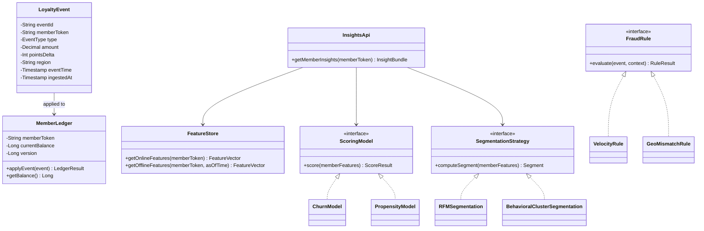
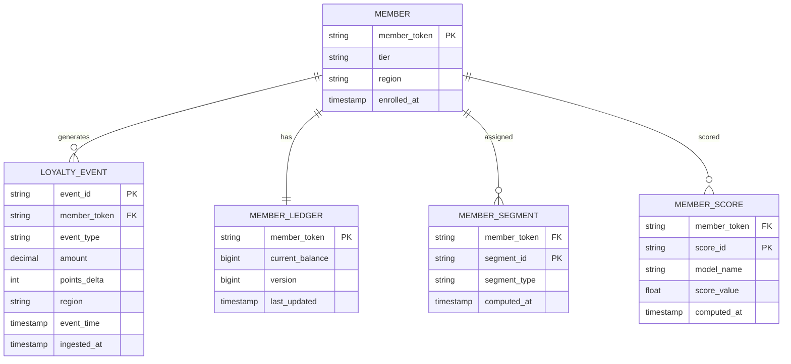
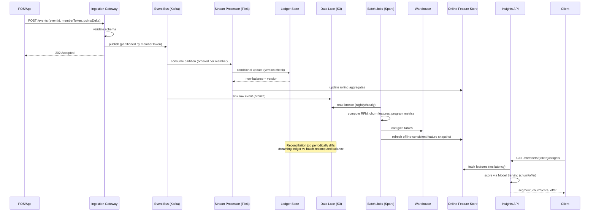

# Loyalty Data Processing & Insights Platform — HLD & LLD

**Assumed metrics** (call out if different): ~50M loyalty members · ~5B events/day at peak (~60K events/sec) · 5-year retention (tiered hot/warm/cold) · real-time signals < 1s p95, dashboards/segments refreshed hourly–daily, ad-hoc analyst queries in seconds-to-low-minutes · AWS-primary.

**Working definition of "meaningful insight"** for this design: (1) customer segments (RFM/behavioral), (2) churn/attrition risk scores, (3) next-best-offer/personalization signals, (4) program health metrics (redemption rate, breakage, tier migration), (5) anomaly/fraud flags on point earn-and-burn. The architecture is built to serve all five from one pipeline rather than five bespoke systems.

---

# Phase 2: High-Level Design (HLD)

## 1. Scope & System Estimation

**Functional Requirements**
- Ingest loyalty events (purchases, point earn/burn, redemptions, tier changes, app/web engagement) from many source systems (POS, e-commerce, mobile app, call center) at billions/day scale
- Compute both real-time features (for in-session personalization/fraud) and batch aggregates (for reporting and ML training)
- Generate customer segments, churn scores, offer recommendations, and program-health dashboards
- Serve insights to three consumer types: BI dashboards (analysts), operational APIs (personalization at request time), and data science notebooks (model training)
- Maintain historical, auditable record of point balances (loyalty points are effectively a financial ledger)

**Non-Functional Requirements**
- Availability: 99.9% for ingestion path (dropped events = lost trust in point balances), 99.5% acceptable for the insights/serving layer (a stale segment is recoverable, a lost point transaction is not)
- Consistency: **strong consistency required for point-balance ledger** (a member's balance must never be wrong); **eventual consistency acceptable** for segments/scores/dashboards
- Compliance: PII handling (GDPR/CCPA — right to erasure conflicts with "immutable ledger," resolved via tokenization, see §3); data residency by region
- Scalability: must absorb seasonal spikes (Black Friday-type events can be 5–10x normal event volume) without backpressure corrupting the ledger

**Back-of-the-Envelope Estimation**
- Peak ingest: 60K events/sec × ~1KB avg event payload ≈ **60 MB/sec (~5 TB/day)** raw event volume at peak; average day is a fraction of this but pipeline is sized for peak.
- 5B events/day × 365 × 5 years ≈ **~9.1 trillion raw events** in cold storage if kept indefinitely — this is why tiering (§3) is not optional, it's the difference between a $10M/year and a $500K/year storage bill.
- Aggregation fan-out: computing per-member RFM (Recency/Frequency/Monetary) daily for 50M members means each batch job touches up to trillions of raw rows but only needs to emit **50M output rows/day** — the design goal is to make the *compute* scale with input while the *serving* footprint scales with member count, not event count.
- Real-time feature store: 50M members × ~50 features × 8 bytes ≈ **~20 GB** hot working set — comfortably cacheable, which is why sub-second personalization is achievable without hitting the warehouse.

## 2. System Architecture & Components

**Architecture Style**: **Lambda architecture** (batch + streaming over the same source-of-truth event log), decomposed into microservices per stage. Justification: loyalty insights genuinely need both a fast/approximate path (real-time offer decisions can't wait for a nightly batch job) and a slow/exact path (financial-grade point-balance reconciliation and model training need full, ordered, exactly-once processing). A pure-streaming or pure-batch system would force a bad trade-off on one side; Lambda lets each side be evaluated against different consistency requirements.

**Component Breakdown**
- **Ingestion Gateway**: regional API Gateway + SDK/webhook receivers for POS/e-commerce/app sources; validates schema, stamps event with ingestion timestamp
- **Event Bus** (Kafka/Kinesis): the single source-of-truth log; all downstream consumers read from here, never from each other
- **Stream Processing** (Flink/Kinesis Data Analytics): windowed aggregation for real-time features (rolling spend, session activity), fraud-rule evaluation, point-balance ledger updates
- **Batch Processing** (Spark on EMR / Databricks): daily/hourly jobs for RFM segmentation, churn model feature generation, program-health rollups
- **Data Lake** (S3, partitioned/Parquet): landing zone for raw events and curated layers (bronze/silver/gold)
- **Data Warehouse** (Redshift/Snowflake/BigQuery): curated, query-optimized tables for BI and analyst SQL
- **Feature Store** (online: DynamoDB/Redis; offline: S3/warehouse): serves the same feature definitions consistently to real-time APIs and to model training, avoiding train/serve skew
- **ML Platform**: churn model, propensity/next-best-offer model, anomaly detection — batch-trained, served via a low-latency Model Serving layer
- **Orchestration** (Airflow/Step Functions): DAGs for batch jobs, backfills, and model retraining
- **BI/Serving Layer**: dashboards (Looker/Tableau/QuickSight) on the warehouse; a thin Insights API for operational consumers (personalization engine, CRM)
- **Data Catalog/Lineage/Governance**: schema registry, PII tagging, lineage tracking — necessary at this scale to keep "which table is the truth" from becoming tribal knowledge

**Data Flow Walkthrough**

*Write path (event ingestion → ledger + features):*
1. Source system (POS/app) sends event → Ingestion Gateway validates against the registered schema (reject/quarantine malformed events rather than let bad data corrupt aggregates).
2. Valid event published to the Event Bus, partitioned by `memberId` (ensures all of one member's events are processed in order on the same partition — critical for ledger correctness).
3. **Stream path**: Flink job consumes the partition, updates the member's point-balance ledger (idempotent, exactly-once via checkpointed offsets), updates real-time feature aggregates (rolling 7-day spend, etc.), evaluates fraud rules, writes to the online feature store and to a "hot" ledger table.
4. **Batch path**: the same raw event is also landed in the data lake (bronze layer) via a Kafka-to-S3 sink. Nightly/hourly Spark jobs read bronze, produce curated silver (deduped, schema-conformed) and gold (RFM scores, churn features, program-health metrics) layers, and load gold into the warehouse.
5. Reconciliation job periodically compares the streaming ledger balance against the batch-computed balance from raw events; discrepancies raise an alert (this is the safety net that lets the fast path run without full end-to-end exactness on every event).

*Read path (insight consumption):*
1. **Analyst**: BI tool queries the warehouse's gold tables directly (pre-aggregated, fast).
2. **Operational personalization**: at request time (e.g., app opens, checkout), the personalization engine calls the Insights API, which reads member features from the online feature store (Redis, single-digit ms) and calls the Model Serving endpoint for a next-best-offer score — never touches the warehouse in the request path.
3. **Data scientist**: trains/retrains models against the offline feature store (S3/warehouse), using point-in-time-correct feature snapshots to avoid leakage.

## 3. Storage & Data Strategy

**Database Selection**
- **Kafka/Kinesis**: durable event log, replayable — this is what makes reprocessing/backfills possible without re-querying every source system.
- **S3 data lake (Parquet, partitioned by date + region)**: cheap, durable, the backbone for batch compute; bronze/silver/gold layering keeps raw-vs-curated separation explicit.
- **Warehouse (Redshift/Snowflake)**: columnar, optimized for the large aggregate scans analysts run (e.g., "average tier migration by region by quarter").
- **Online feature store (DynamoDB or Redis)**: key-value, single-digit-ms reads — the only viable choice for request-time personalization at this scale; a warehouse query would be 100–1000x too slow.
- **Ledger store**: a strongly consistent store (DynamoDB with conditional writes, or a dedicated ledger service) — chosen specifically because point balances are financial-grade data; NoSQL eventual-consistency stores are explicitly *not* used here.

**Data Lifecycle**
- **Tiering**: hot (0–90 days) in warehouse/online store for fast access; warm (90 days–1 year) in S3 Standard queried via the warehouse's external-table/lakehouse feature; cold (1–5 years) in S3 Glacier, restored on-demand for compliance/audit queries only. This directly targets the 9.1-trillion-row problem from §1.
- **Partitioning**: event tables partitioned by `event_date` and `region`; ledger table partitioned/sharded by `memberId` — matches the two dominant query patterns (time-range scans for analytics, point-lookup for a single member's balance).
- **Indexing**: warehouse gold tables clustered/sorted by `memberId` and `event_date`; online store keyed directly by `memberId` (no secondary index needed for the request-time read pattern).
- **PII/right-to-erasure**: PII (name, email, card-last-4) is tokenized at ingestion into a separate PII vault; the event/ledger data references a `memberToken`, not raw PII. Erasure requests delete the PII-vault mapping, effectively anonymizing historical events without having to rewrite an immutable financial ledger — this is the specific mechanism that resolves the GDPR-vs-immutable-ledger tension flagged in §1.
- **Archival**: cold tier objects get lifecycle-transitioned automatically; no manual purge jobs (reduces the chance of accidentally deleting data still under legal hold).

## 4. Cross-Cutting Concerns & Trade-offs

**CAP Theorem & Trade-offs**
- Point-balance ledger: **CP**. A member disputing "I had 500 points and now I have 200" is a support/legal problem, not a UX inconvenience — correctness wins over availability here, and a brief write-rejection during a partition is preferable to an incorrect balance.
- Real-time feature store / segments / offer scores: **AP**. If the feature store is partitioned, serving a slightly-stale personalization score beats failing the checkout flow entirely.
- Batch analytics/warehouse: consistency model is really "eventual by design" — gold tables are always some hours behind bronze by construction, and that's an accepted, communicated SLA rather than a failure mode.

**Resiliency & Security**
- **Circuit breakers**: personalization/API calls to the Model Serving layer have a breaker with a fallback to a simple rules-based offer (e.g., "generic tier-based discount") if the ML endpoint is degraded — never blocks checkout.
- **Backpressure handling**: Kafka partition-level consumer lag alarms; if the stream processor falls behind during a spike, events still land safely in the durable log and bronze lake — nothing is lost, worst case is delayed *real-time* features while the ledger and batch path stay correct.
- **Rate limiting**: per-source-system quotas at the Ingestion Gateway to stop one misbehaving integration from starving others.
- **Encryption**: TLS in transit everywhere; SSE-KMS at rest for lake/warehouse; separate CMKs for the PII vault vs. the general event lake (extra isolation for the most sensitive data).
- **AuthN/Z**: OIDC/OAuth2 for the Insights API and BI layer; row-level security in the warehouse (e.g., regional analysts see only their region) enforced via warehouse-native RLS, not application code.
- **Fraud/anomaly rules**: run in the streaming layer specifically because fraud (e.g., point-farming via rapid earn/burn cycling) needs to be caught within seconds, not discovered in tomorrow's batch report.

---

# Phase 3: Low-Level Design (LLD)

## 1. Class & Object-Oriented Design

**Design Patterns**
- **Strategy**: pluggable `SegmentationStrategy` (RFM, behavioral clustering, custom rules) and pluggable `ScoringModel` (churn, propensity) behind common interfaces — new insight types plug in without touching the pipeline.
- **Observer**: `LedgerUpdated` and `SegmentRecomputed` events drive downstream consumers (notification service, CRM sync) without tight coupling.
- **CQRS**: the ledger write model (strongly consistent, append-only event application) is separate from the read models (online feature store, warehouse gold tables) that serve queries — same rationale as the file-upload design, applied here to the read-heavy analytics workload vs. write-heavy ingestion workload.
- **Chain of Responsibility**: fraud-rule evaluation is a chain of independent rule-checkers (velocity check → geo-mismatch check → known-fraud-pattern check) run per event, so rules can be added/removed independently.



## 2. Database Schema Design



**Table Definitions**

`LOYALTY_EVENT` (bronze/silver lake table, also streamed)

| Field | Type | Constraints | Description |
|---|---|---|---|
| event_id | String/UUID | PK | Unique event identifier, dedup key |
| member_token | String | Not Null, Indexed | Tokenized member reference (no raw PII) |
| event_type | String | Not Null | PURCHASE / EARN / BURN / REDEEM / TIER_CHANGE |
| amount | Decimal | Nullable | Monetary value if applicable |
| points_delta | Int | Not Null | Positive (earn) or negative (burn) |
| region | String | Not Null | For residency/partitioning |
| event_time | Timestamp | Not Null | Source-reported event time |
| ingested_at | Timestamp | Not Null | Gateway receipt time (for lag monitoring) |

`MEMBER_LEDGER`

| Field | Type | Constraints | Description |
|---|---|---|---|
| member_token | String | PK | — |
| current_balance | BigInt | Not Null | Authoritative point balance |
| version | BigInt | Not Null (optimistic lock) | Incremented on every applied event, prevents lost-update races |
| last_updated | Timestamp | Not Null | — |

`MEMBER_SEGMENT`

| Field | Type | Constraints | Description |
|---|---|---|---|
| member_token | String | FK → MEMBER | — |
| segment_id | String | PK | e.g., `RFM_CHAMPION`, `AT_RISK` |
| segment_type | String | Not Null | RFM / BEHAVIORAL / CUSTOM |
| computed_at | Timestamp | Not Null | Enables point-in-time analysis / model backtesting |

`MEMBER_SCORE`

| Field | Type | Constraints | Description |
|---|---|---|---|
| member_token | String | FK → MEMBER | — |
| score_id | UUID | PK | — |
| model_name | String | Not Null | e.g., `churn_v3` |
| score_value | Float | Not Null | 0–1 probability or model-native scale |
| computed_at | Timestamp | Not Null | — |

## 3. API & Interface Specifications

```yaml
openapi: 3.0.0
info:
  title: Loyalty Insights API
  version: "1.0"
paths:
  /events:
    post:
      summary: Ingest a loyalty event (idempotent)
      requestBody:
        content:
          application/json:
            schema:
              type: object
              required: [eventId, memberToken, eventType, pointsDelta, eventTime]
              properties:
                eventId: { type: string, description: "Client-generated idempotency key" }
                memberToken: { type: string }
                eventType: { type: string, enum: [PURCHASE, EARN, BURN, REDEEM, TIER_CHANGE] }
                amount: { type: number }
                pointsDelta: { type: integer }
                region: { type: string }
                eventTime: { type: string, format: date-time }
      responses:
        "202": { description: Accepted into event bus }
        "200": { description: Already processed (idempotent replay), returns original result }
        "400": { description: Schema validation failed }

  /members/{memberToken}/balance:
    get:
      summary: Get authoritative current point balance
      responses:
        "200":
          content:
            application/json:
              schema:
                type: object
                properties:
                  currentBalance: { type: integer }
                  version: { type: integer }
                  lastUpdated: { type: string, format: date-time }

  /members/{memberToken}/insights:
    get:
      summary: Get real-time-servable insight bundle (segment, churn score, next-best-offer)
      responses:
        "200":
          content:
            application/json:
              schema:
                type: object
                properties:
                  segment: { type: string }
                  churnScore: { type: number }
                  recommendedOffer:
                    type: object
                    properties:
                      offerId: { type: string }
                      confidence: { type: number }
                  featureFreshnessSeconds: { type: integer, description: "Age of underlying features, so consumers can judge staleness" }

  /reports/program-health:
    get:
      summary: Aggregate program metrics (analyst/BI consumption; backed by warehouse, not request-time compute)
      parameters:
        - name: from
          in: query
          schema: { type: string, format: date }
        - name: to
          in: query
          schema: { type: string, format: date }
      responses:
        "200":
          content:
            application/json:
              schema:
                type: object
                properties:
                  redemptionRate: { type: number }
                  breakageRate: { type: number }
                  tierMigration:
                    type: array
                    items: { type: object }
```

**Idempotency**
- `POST /events` requires a client-generated `eventId`; the Ingestion Gateway and the stream processor both dedup on this key (Kafka consumer checks a short-lived dedup cache; the ledger applies a conditional write keyed on `eventId` having not been applied before) — a retried event from a flaky POS terminal never double-counts points.
- Ledger updates use **optimistic concurrency** (the `version` field): applying an event does a conditional update `WHERE version = expectedVersion`; on conflict, the applier re-reads and retries — this is what makes concurrent events for the same member (rare but possible, e.g., simultaneous online + in-store purchase) safe without a distributed lock.
- Segment/score writes are naturally idempotent: recomputing `RFM_CHAMPION` for a member on the same day with the same inputs just overwrites with an identical value.

## 4. Concrete Code Snippets & Sequence Flows



**Core Logic: Idempotent Ledger Application with Optimistic Concurrency** (the correctness-critical piece — every point balance in the system depends on this being right)

```python
# ledger.py
from dataclasses import dataclass
from typing import Optional
import logging

logger = logging.getLogger("loyalty.ledger")


class VersionConflictError(Exception):
    """Raised when a concurrent update changed the ledger between read and write."""


class DuplicateEventError(Exception):
    """Raised (informationally, not fatally) when an event_id was already applied."""


@dataclass
class LedgerState:
    member_token: str
    current_balance: int
    version: int


@dataclass
class LoyaltyEvent:
    event_id: str
    member_token: str
    points_delta: int


class LedgerRepository:
    """Thin interface over the ledger store (e.g., DynamoDB with conditional writes)."""

    def get(self, member_token: str) -> Optional[LedgerState]:
        raise NotImplementedError

    def conditional_apply(
        self, member_token: str, expected_version: int, new_balance: int
    ) -> bool:
        """Returns False on version-mismatch (i.e., a concurrent write won the race)."""
        raise NotImplementedError

    def has_applied_event(self, event_id: str) -> bool:
        """Backed by a dedup table/cache keyed on event_id, short-TTL is fine."""
        raise NotImplementedError

    def record_applied_event(self, event_id: str, member_token: str) -> None:
        raise NotImplementedError


class LedgerService:
    def __init__(self, repo: LedgerRepository, max_retries: int = 3):
        self._repo = repo
        self._max_retries = max_retries

    def apply_event(self, event: LoyaltyEvent) -> LedgerState:
        """
        Applies a point delta to a member's ledger.
        Idempotent on event_id; safe under concurrent application for the same member
        via optimistic concurrency (retry-on-conflict, bounded).
        """
        if self._repo.has_applied_event(event.event_id):
            logger.info(
                "duplicate_event_skipped",
                extra={"event_id": event.event_id, "member_token": event.member_token},
            )
            state = self._repo.get(event.member_token)
            if state is None:
                raise RuntimeError(
                    f"Inconsistent state: event {event.event_id} marked applied "
                    f"but no ledger exists for {event.member_token}"
                )
            return state

        for attempt in range(1, self._max_retries + 1):
            current = self._repo.get(event.member_token)
            if current is None:
                current = LedgerState(
                    member_token=event.member_token, current_balance=0, version=0
                )

            new_balance = current.current_balance + event.points_delta
            if new_balance < 0:
                # Business rule: balances cannot go negative. Log and clamp/reject
                # per program policy rather than silently allowing debt.
                logger.warning(
                    "negative_balance_rejected",
                    extra={
                        "member_token": event.member_token,
                        "attempted_balance": new_balance,
                    },
                )
                raise ValueError("Insufficient points for this operation")

            success = self._repo.conditional_apply(
                member_token=event.member_token,
                expected_version=current.version,
                new_balance=new_balance,
            )

            if success:
                self._repo.record_applied_event(event.event_id, event.member_token)
                return LedgerState(
                    member_token=event.member_token,
                    current_balance=new_balance,
                    version=current.version + 1,
                )

            logger.info(
                "ledger_version_conflict_retrying",
                extra={"member_token": event.member_token, "attempt": attempt},
            )

        raise VersionConflictError(
            f"Failed to apply event {event.event_id} after {self._max_retries} retries"
        )


# --- unit test placeholders ---
def test_apply_event_first_time_increments_balance():
    # arrange: empty ledger, event with points_delta=100
    # act: apply_event
    # assert: balance == 100, version == 1
    pass


def test_apply_event_duplicate_event_id_is_noop():
    # arrange: event already recorded via has_applied_event=True
    # act: apply_event with same event_id again
    # assert: returns existing state, no second balance mutation
    pass


def test_apply_event_negative_balance_rejected():
    # arrange: balance=50, event points_delta=-100
    # act/assert: raises ValueError, no state mutation
    pass


def test_apply_event_retries_on_version_conflict():
    # arrange: conditional_apply fails once (simulated concurrent writer), then succeeds
    # act: apply_event
    # assert: succeeds on second attempt, final version reflects one successful apply
    pass


def test_apply_event_gives_up_after_max_retries():
    # arrange: conditional_apply always fails
    # act/assert: raises VersionConflictError after max_retries attempts
    pass
```

---

### Key design decisions worth flagging back to you
1. **Lambda architecture is doing real work here, not just fashionable**: the ledger genuinely needs CP guarantees the streaming path alone can't offer at low latency, while segments/scores genuinely benefit from AP behavior — one architecture serves both because they share the same event log as source of truth, with a reconciliation job as the safety net between the fast and slow paths.
2. **PII tokenization solves the "immutable ledger vs. right-to-erasure" conflict** without ever rewriting historical financial records — erasure deletes the token mapping, not the ledger.
3. **The online/offline feature store split with a shared feature-definition layer** is what prevents train/serve skew — a common failure mode where the churn model performs great in backtesting and poorly in production because the real-time features were computed slightly differently than the training features.

Let me know if you want to go deeper on any piece — e.g., the exact Flink windowing/watermark strategy for late-arriving events, a concrete RFM/churn feature list, or a cost model comparing warehouse-native ML (Snowflake/BigQuery ML) vs. a separate SageMaker/Databricks ML platform.
