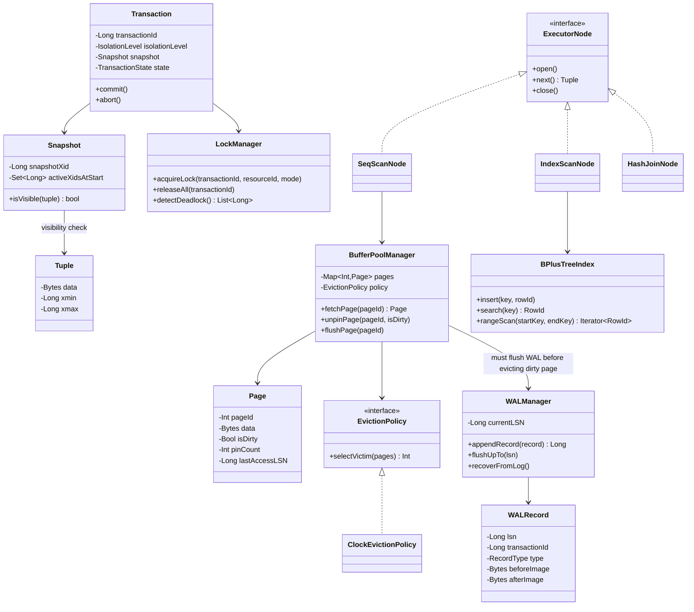
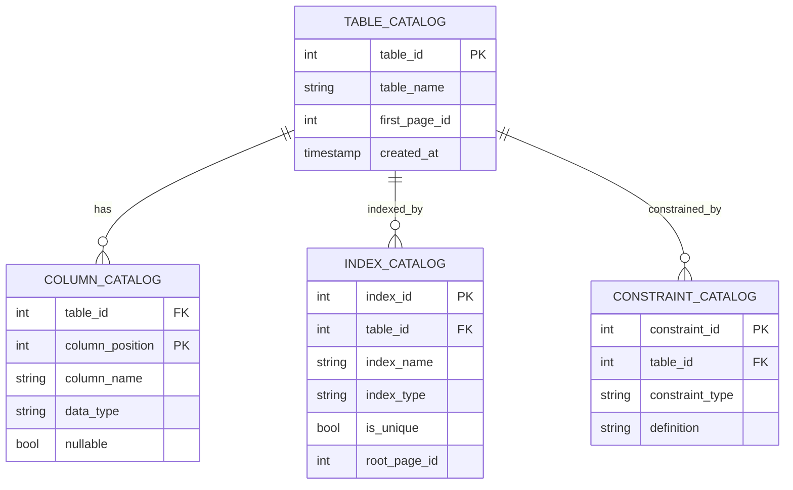
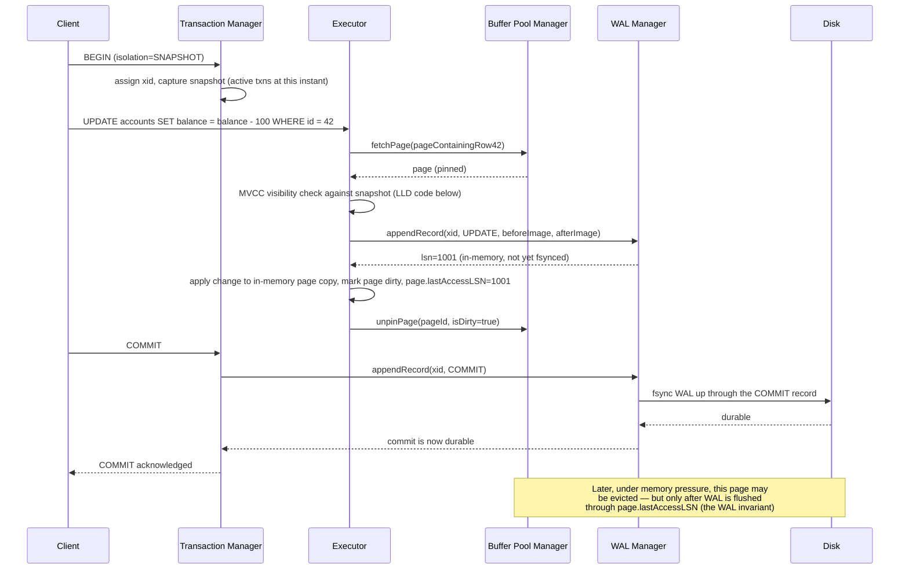

# Relational Database Management System (RDBMS) Engine — HLD & LLD

**Assumed metrics** (call out if different): single-node engine (with optional async read replicas) · general-purpose OLTP workload · target tens of thousands of simple-transaction TPS · point-lookup query p99 < 5ms, complex analytical queries can take seconds · data volume up to multi-TB per instance, buffer pool sized to a meaningful fraction of that (commonly 10-25%) · durability: a committed transaction must survive an immediate crash · configurable isolation, defaulting to Snapshot Isolation / Read Committed.

**Scope, explicitly enumerated**: SQL parsing and query optimization (cost-based, choosing access paths and join order) · a storage engine (paged disk storage, buffer pool caching, B+Tree indexing) · transaction management with configurable isolation levels via multi-version concurrency control (MVCC) · crash recovery via write-ahead logging (WAL, ARIES-style) · a system catalog describing the database's own schema · a client wire protocol · (briefly) replication for read scaling and failover.

**The architectural inversion worth naming up front**: every other system in this conversation defaulted to microservices, control-plane/data-plane splits, and eventual consistency wherever the read:write ratio allowed it. An RDBMS engine is the one case in this thread where **a monolithic, single-process (or tightly-coupled multi-threaded) architecture is the textbook-correct answer, not a legacy compromise** — ACID transactions spanning arbitrary tables require one shared, coordinated view of "what's currently locked," "what's durably logged," and "what's cached in memory." Splitting the buffer pool, lock manager, and WAL into independent networked services would make the fundamental correctness guarantees (atomicity across tables, isolation between concurrent transactions) dramatically harder to provide, not easier — this is precisely the kind of problem where tight coupling is the feature, not the bug.

---

# Phase 2: High-Level Design (HLD)

## 1. Scope & System Estimation

**Functional Requirements**
- Execute SQL DDL (create/alter/drop tables, indexes, constraints) and DML (select/insert/update/delete), including joins, aggregation, and subqueries
- Provide full ACID transactions: atomic multi-statement commits, isolation between concurrent transactions, durability of committed data across crashes
- Support configurable isolation levels (at minimum Read Committed and a stronger Snapshot Isolation/Serializable option), since different applications have genuinely different correctness-vs-concurrency needs
- Maintain indexes (B+Tree as the default general-purpose structure) that are transactionally consistent with the underlying table data
- Recover to a correct, consistent state after a crash, redoing committed work and undoing uncommitted work
- Enforce schema constraints (primary keys, foreign keys, uniqueness, not-null, check constraints) as part of every write, not as an optional add-on
- Serve many concurrent client connections/sessions safely
- (Extension) Replicate committed changes to standby replicas for read scaling and failover

**Non-Functional Requirements**
- **Consistency: the engine's entire reason for existing is to provide strong, well-defined consistency guarantees (ACID) — this is the one design in this conversation where "eventual consistency" isn't a scalability lever to reach for, it's explicitly the thing customers of this system are trusting the engine *not* to do to their data**, at least not without opting into a weaker isolation level deliberately and explicitly.
- Durability: once a transaction is acknowledged as committed, its effects must survive a crash immediately after — this is the WAL's entire purpose, detailed in §3/§4.
- Availability: for a single-node engine, availability is bounded by the hardware/process itself; the standard mitigation is replication for failover (an extension in this design, not core scope) rather than an architectural attempt to make a single ACID-transactional node itself "always up" the way a stateless microservice fleet can be.
- Performance: must sustain high transaction throughput while providing strong isolation — this tension (isolation vs. concurrency) is the central engineering trade-off of the whole transaction-management layer, detailed in §4.
- Predictability: query performance should degrade gracefully and predictably as data grows, which is what the indexing and query-optimization layers exist to provide (turning what would be linear-scan-shaped performance cliffs into logarithmic-cost lookups).

**Back-of-the-Envelope Estimation**
- Tens of thousands of TPS at, say, a few KB of WAL record per transaction implies a WAL write rate on the order of tens of MB/sec sustained — well within a modern SSD's sequential-write throughput, which is precisely why the WAL is designed as an append-only, purely sequential-write structure (detailed in §3): sequential writes are what makes this throughput achievable on spinning-adjacent-cost hardware, and any design that turned WAL writes into random I/O would blow this budget immediately.
- Buffer pool sizing: if hot working-set data is, say, 10-25% of total data size and needs to live in memory for the point-lookup latency target to be achievable (a page fault to disk is orders of magnitude slower than an in-memory buffer hit), a multi-TB database needs a buffer pool in the tens-to-low-hundreds-of-GB range — this ratio is the primary sizing lever for the whole storage engine and is why buffer pool eviction policy (§3) matters enormously: evicting the wrong page under memory pressure directly costs query latency.
- Index fan-out: a B+Tree with even a modest fan-out (say, 100-200 children per internal node, typical for a 4-8KB page size holding fixed/variable-length keys) keeps tree height around 3-4 levels even at billions of rows — this is the concrete reason B+Trees, not simple sorted arrays or linear structures, are the default index: point lookups and range scans both stay at a small, bounded number of page reads regardless of table size.
- Lock/version overhead: under MVCC (the concurrency-control approach this design uses, detailed in §4), every row update creates a new version rather than overwriting in place — at high update rates, this means old versions accumulate and must be reclaimed (vacuumed/garbage-collected) once no active transaction could still need to see them; sizing this reclamation process correctly is what prevents unbounded storage bloat under sustained write load, a genuinely different kind of "storage lifecycle" concern than any prior design in this conversation, since it's driven by transaction visibility rules, not a time-based TTL.

## 2. System Architecture & Components

**Architecture Style**: **Monolithic, single coordinated process** (or a small number of tightly cooperating background processes/threads sharing memory), for the reason stated in the introduction — ACID guarantees require a single, authoritative, in-process view of locks, buffer-pool contents, and the write-ahead log. Internally, the engine is still cleanly layered (this is where "separation of concerns" reappears, just as in-process module boundaries rather than network service boundaries): a **Query Processing layer** (parse → optimize → execute, largely stateless per-query) sits above a **Transaction & Concurrency layer** (which every read/write must go through to get correctness guarantees), which itself sits above a **Storage Engine layer** (buffer pool, page/disk management, indexes) and a parallel **Recovery/Durability layer** (WAL) that the storage layer must coordinate with on every dirty-page flush.

**Component Breakdown**
- **Connection/Session Manager**: accepts client connections (via the wire protocol), manages per-session state (current transaction, prepared statements, isolation level setting)
- **Parser**: turns SQL text into an abstract syntax tree, validating syntax
- **Query Rewriter/Optimizer**: transforms the parsed query into an efficient execution plan — chooses access paths (sequential scan vs. index scan), join order and algorithm (nested loop, hash join, merge join), based on cost estimates derived from table/index statistics in the Catalog
- **Executor**: runs the chosen plan using the classic iterator/Volcano model (each operator — scan, filter, join, sort — pulls rows from its children on demand), detailed in the LLD
- **Transaction Manager**: assigns transaction IDs, tracks each transaction's snapshot (for MVCC visibility), and coordinates commit/abort
- **Lock Manager**: manages the locks still needed even under MVCC — MVCC handles read/write conflicts between readers and writers gracefully, but write/write conflicts on the same row, and certain higher isolation levels (serializable), still need explicit locking or conflict detection, detailed in §4
- **Buffer Pool Manager**: caches disk pages in memory, implementing an eviction policy (typically a clock or LRU-variant algorithm) under memory pressure, and — critically — enforcing the WAL-before-data-flush invariant detailed in the LLD
- **Page/Disk Manager**: reads/writes fixed-size pages to/from durable storage, the layer beneath the buffer pool that actually talks to the filesystem/block device
- **Index Manager (B+Tree)**: maintains transactionally-consistent secondary structures for fast lookup, keeping index entries in sync with table data as part of the same transaction that modifies a row
- **WAL/Recovery Manager**: the durability backbone — every change is logged sequentially before the corresponding data page is allowed to be written back to disk (the "write-ahead" in write-ahead logging), and on crash restart, replays committed-but-not-yet-flushed changes (redo) and undoes uncommitted changes (undo), following the same ARIES-family approach that essentially all production RDBMSes use
- **Catalog Manager**: the database's metadata about itself — table/column/index/constraint definitions — which is, notably, stored using the exact same storage engine as user data (a deliberately self-referential design, detailed in the LLD)
- **(Extension) Replication Manager**: ships the WAL stream to standby replicas, which apply it to maintain a continuously-updated copy for failover or read-scaling — this reuses the same durable, ordered WAL that recovery already depends on, rather than inventing a second change-tracking mechanism

**Data Flow Walkthrough**

*Write path (an INSERT/UPDATE/DELETE inside a transaction):*
1. Client sends a statement over the wire protocol; Connection Manager routes it to the session's current (or a newly begun) transaction.
2. Parser produces an AST; Query Optimizer produces an execution plan (for a simple single-row write, often trivial; for a write with a `WHERE` clause needing to find target rows, this may involve an index or sequential scan first).
3. Executor requests the target row(s) via the Buffer Pool Manager, which serves them from cache or reads them from disk via the Page/Disk Manager.
4. Transaction Manager and Lock Manager check for conflicts against other in-flight transactions (per the configured isolation level); under MVCC, most of this is handled by creating a new row version rather than blocking readers, with locking reserved for genuine write/write conflicts.
5. The change is first written to the **WAL** (in memory, to be flushed per the commit protocol below) *before* the in-memory buffer pool page is marked dirty and eventually flushed to disk — this ordering is the single most important invariant in the entire storage engine, detailed in the LLD.
6. Index Manager updates any affected B+Tree indexes as part of the same transaction.
7. On `COMMIT`: the WAL Manager writes a commit record and **fsyncs it to durable storage** before acknowledging success to the client — this fsync is the actual moment durability is achieved; everything before it is only provisional.

*Read path (a SELECT):*
1. Parser/Optimizer/Executor proceed as above, but instead of conflict-checking against other writers for locking purposes, MVCC visibility rules (detailed in the LLD) determine which version of each row this transaction's snapshot is allowed to see — this is what lets readers proceed **without blocking on writers at all** under MVCC, a major concurrency advantage over pure lock-based (2PL) approaches.
2. Rows are read via the Buffer Pool Manager (cache-first, disk on a miss) and, where an index is used, via the Index Manager's B+Tree traversal rather than a full table scan.

*Crash recovery path:*
1. On restart after a crash, the WAL/Recovery Manager scans the log from the last checkpoint forward, **redoing** every logged change (even ones whose transaction later turns out to have not committed — ARIES redoes everything first, unconditionally, then fixes up), then **undoing** the effects of any transaction that never reached a commit record — this two-phase redo-then-undo approach is what correctly and efficiently restores the database to exactly the state it was in at the moment of the crash, no more and no less.

## 3. Storage & Data Strategy

**Database Selection**: this section is somewhat inverted from every other design in this conversation — there's no "which off-the-shelf database to use," because this document *is* the design of the database. The choices below are about internal storage structures instead.
- **Page-based storage**: data is organized into fixed-size pages (commonly 4-16KB) — the unit of I/O, caching, and locking granularity throughout the engine; a page holds a "slotted page" layout (a directory of variable-length row-slot offsets at one end of the page, actual row data packed from the other end) so rows of varying width can be stored, updated, and reclaimed-on-delete without constant whole-page reshuffling.
- **B+Tree indexes**: the default general-purpose index structure — chosen specifically because it keeps both point lookups and ordered range scans at `O(log n)` page reads, and because its leaf-node-linked-list structure makes range scans (`WHERE x BETWEEN a AND b`) efficient via sequential leaf traversal rather than repeated tree descents.
- **Write-Ahead Log**: a purely append-only, sequential-write structure — deliberately never randomly written or rewritten in place, which is what lets it sustain high write throughput on real storage hardware (per the §1 estimation) and is also what makes "redo from the log" a coherent recovery strategy in the first place (an append-only log has an unambiguous, replayable order of events).
- **Buffer Pool**: an in-memory cache of recently/frequently accessed pages, using an eviction policy (clock/LRU-variant, detailed in the LLD) under memory pressure — the layer that makes the difference between the multi-TB-on-disk reality and the sub-5ms point-lookup latency target from §1.
- **System Catalog**: stored as ordinary tables using the exact same page/B+Tree/MVCC/WAL machinery as user tables — a deliberately self-hosting design (the database's knowledge of its own schema is itself managed transactionally, so a `CREATE TABLE` inside a transaction that later rolls back correctly un-creates the table, for free, using the same undo mechanism as any other write) rather than a special-cased, differently-durable metadata store.

**Data Lifecycle**
- **MVCC version accumulation and vacuum/garbage collection**: because updates create new row versions rather than overwriting in place, old versions that no active or future transaction could possibly still need to see must eventually be reclaimed — a background process periodically determines the oldest snapshot any currently-active transaction could be using and removes versions older than that watermark, freeing space; this is a storage-lifecycle mechanism unique to this design among the whole conversation, since it's governed by transaction-visibility semantics rather than by a time-based TTL or hot/warm/cold access-frequency tiering.
- **WAL checkpointing**: periodically, the engine forces all dirty pages older than some point to disk and records a checkpoint marker, so recovery after a crash only needs to replay the log from the most recent checkpoint forward rather than from the beginning of time — this is the mechanism that keeps crash-recovery time bounded regardless of how long the database has been running.
- **Buffer pool eviction**: when the pool is full and a new page must be brought in, a victim page is chosen (via the clock/LRU policy) and, if dirty, **must have its WAL entries flushed through the point covering that page's changes before the page itself can be written back to disk** — this is the storage-engine-and-recovery-layer coupling point where the WAL invariant is actually enforced in code, detailed in the LLD.
- **Index maintenance**: B+Tree page splits (on insert into a full node) and merges (on delete causing under-fill) are themselves logged to the WAL as part of the same transaction that triggered them, so index structure changes are just as crash-recoverable as data changes — there's no special-cased "rebuild the index after a crash" step needed.

## 4. Cross-Cutting Concerns & Trade-offs

**CAP Theorem & Trade-offs**
- **This design does not really face a CAP trade-off in the sense every other design in this conversation did**, because it's explicitly single-node in its core transactional scope — CAP is a theorem about distributed systems tolerating network partitions, and a single ACID-transactional node simply doesn't have an internal partition to reason about. The interesting trade-off here is a different, closely related one: **isolation level vs. concurrency**, which is the actual dial this design turns.
- **Isolation-level trade-off**: Read Committed (each statement sees the latest committed data, but two statements in the same transaction might see different snapshots) offers the highest concurrency and lowest overhead; Snapshot Isolation/Serializable (the whole transaction sees one consistent snapshot throughout) offers stronger guarantees against anomalies (no non-repeatable reads, and Serializable additionally prevents write skew) at the cost of more transactions needing to abort-and-retry on conflict, or more conflict-detection overhead. **This is a direct structural analog of the CAP trade-off**, just expressed as "stronger guarantees cost more aborts/overhead" rather than "stronger guarantees cost availability during a partition" — the same underlying tension (correctness vs. throughput/availability) recurring in a single-node context.
- **Replication (extension)**: once this engine is extended with standby replicas, *that* layer does face a genuine CAP-style choice — synchronous replication (wait for a replica to durably apply the WAL before acknowledging commit, CP-leaning, matching the banking design's approach) versus asynchronous (acknowledge on primary durability alone, replicas catch up shortly after, AP-leaning) — this is the one place in the whole RDBMS design where the conversation's usual CAP vocabulary applies directly, and it's deliberately scoped to the replication extension, not the core single-node engine.

**Resiliency & Security**
- **The WAL-before-data invariant *is* the crash-resiliency mechanism**: as long as every change is durably logged before its effects are allowed to be reflected in an on-disk data page, a crash at any point can only ever lose *unlogged, uncommitted* work — never committed work, and never leave a data page in a state that doesn't correspond to some prefix of the log. This single invariant is what makes ARIES-style recovery correct at all, and it's the direct database-engine analog of the "durability comes before delivery" principle used in the chat app's message router and the "commit before acknowledging" principle in the banking ledger — the same idea (log/persist first, only then act on it) recurring for a third time in this conversation, now at the level of individual disk pages rather than application-level messages or transactions.
- **Deadlock handling**: even under MVCC, write/write conflicts and certain lock-based operations can deadlock (transaction A waits on a lock held by B, which waits on one held by A); the Lock Manager runs periodic deadlock detection (a wait-for graph cycle check) and aborts one of the involved transactions to break the cycle — a necessary complement to MVCC, not a replacement for all locking.
- **SQL injection / security boundary**: the Parser only ever accepts parameterized queries as data, never as re-parsed SQL text, at the client-protocol level — a text-substitution approach to parameters would reopen exactly the class of vulnerability parameterized queries exist to close; this is an engine-level responsibility, not something left to well-behaved client library authors.
- **Authentication/authorization**: the Connection Manager authenticates sessions and the query layer enforces per-table/per-column permission checks as part of planning (a query that would touch a table the session lacks permission for should fail at plan time, not leak a partial result at execution time).
- **Resource governance**: per-session limits (query timeout, max memory for a single query's sort/hash operations, connection limits) prevent one runaway query or connection storm from starving the shared buffer pool and lock manager that every other session depends on — since this is a shared, in-process resource, one badly-behaved query can affect every other session in a way that wouldn't happen in a horizontally-scaled microservices fleet, making this kind of governance more architecturally load-bearing here than in most of the earlier designs.

---

# Phase 3: Low-Level Design (LLD)

## 1. Class & Object-Oriented Design

**Design Patterns**
- **Iterator (Volcano/pull model)**: every execution-plan node (`SeqScanNode`, `IndexScanNode`, `HashJoinNode`, `SortNode`) implements the same `next()`-style interface — a parent operator pulls rows from its children on demand, without needing to know their internal implementation, the same "compose independent stages" philosophy as the API Gateway's middleware pipeline, applied here to query execution instead of HTTP request handling.
- **Strategy**: pluggable join algorithms (`NestedLoopJoin`, `HashJoin`, `MergeJoin`) selected by the optimizer based on cost estimates, and pluggable isolation-level behavior in the Transaction Manager.
- **Template Method / ARIES protocol**: the WAL Manager's redo-then-undo recovery sequence is a fixed, well-defined algorithm (detailed in code) that every specific log-record type plugs its own redo/undo logic into.
- **Object Pool**: the Buffer Pool Manager is, structurally, a pinned-object pool — pages are "checked out" (pinned) while in use by a query and only eligible for eviction once unpinned, a direct structural cousin of connection pooling used implicitly in earlier designs (e.g., FaaS execution-environment warm reuse), here applied to disk pages.



## 2. Database Schema Design

*(The engine's own system catalog — the metadata it keeps about itself, stored using its own storage engine per §3's self-hosting design choice.)*



**Table Definitions**

`TABLE_CATALOG`

| Field | Type | Constraints | Description |
|---|---|---|---|
| table_id | Int | PK | — |
| table_name | String | Unique, Not Null | — |
| first_page_id | Int | Not Null | Entry point into this table's page chain |
| created_at | Timestamp | Not Null | — |

`COLUMN_CATALOG`

| Field | Type | Constraints | Description |
|---|---|---|---|
| table_id | Int | FK → TABLE_CATALOG | — |
| column_position | Int | PK (composite) | Ordinal position within the row layout |
| column_name | String | Not Null | — |
| data_type | String | Not Null | Drives fixed/variable-width storage decisions in the page layout |
| nullable | Bool | Not Null | — |

`INDEX_CATALOG`

| Field | Type | Constraints | Description |
|---|---|---|---|
| index_id | Int | PK | — |
| table_id | Int | FK → TABLE_CATALOG | — |
| index_type | String | Not Null | BTREE (default) / HASH |
| is_unique | Bool | Not Null | Enforced by the Index Manager on insert |
| root_page_id | Int | Not Null | Entry point into the B+Tree |

## 3. API & Interface Specifications

**Simplified client wire protocol** (the real-world analog is something like the Postgres frontend/backend protocol):

```yaml
# Client -> Server
CONNECT:
  database: string
  credentials: object

PARSE:
  statementName: string
  sql: string          # parameterized, e.g. "SELECT * FROM t WHERE id = $1"

BIND:
  statementName: string
  parameters: array

EXECUTE:
  statementName: string

BEGIN_TRANSACTION:
  isolationLevel: "READ_COMMITTED" | "SNAPSHOT" | "SERIALIZABLE"

COMMIT:
ROLLBACK:

# Server -> Client
ROW_DESCRIPTION:
  columns: array

DATA_ROW:
  values: array

COMMAND_COMPLETE:
  rowsAffected: integer

ERROR:
  code: string
  message: string
```

**Internal storage-engine API** (what the Executor actually calls, not client-facing):

```yaml
BufferPoolManager:
  fetchPage(pageId) -> Page          # pins the page; caller must unpin when done
  unpinPage(pageId, isDirty)
  newPage() -> Page                  # allocates a fresh page, e.g. for a B+Tree split

WALManager:
  appendRecord(transactionId, type, beforeImage, afterImage) -> lsn
  flushUpTo(lsn)                     # the enforcement point of the WAL invariant
  recoverFromLog()

TransactionManager:
  begin(isolationLevel) -> Transaction
  commit(transaction)
  abort(transaction)

BPlusTreeIndex:
  insert(key, rowId)
  search(key) -> RowId | null
  rangeScan(startKey, endKey) -> Iterator<RowId>
```

**Idempotency**
- Recovery (redo/undo replay) is explicitly designed to be idempotent — a WAL record includes enough information (the page's LSN at the time of the change) that redoing an already-applied change is safely a no-op (the recovery manager checks the target page's current LSN against the record's LSN before reapplying) — this is a hard correctness requirement, not an optimization, since a crash *during* recovery itself must be safe to recover from again from the start.
- Client-driven statement re-execution (e.g., a client retry after a network blip mid-query) is **not** automatically deduplicated by the engine itself the way it is in the application-level designs earlier in this conversation — a `COMMIT` either succeeded durably or it didn't, and it's the client/application's responsibility to check outcome and avoid re-submitting a non-idempotent statement (e.g., `INSERT` without an application-level uniqueness constraint) twice; this is a deliberate contrast with, say, the banking ledger's application-level idempotency-key pattern, since a general-purpose RDBMS engine has no way to know which application-level operations are meant to be idempotent and which aren't — that responsibility sits one layer up, in the application built on top of it.

## 4. Concrete Code Snippets & Sequence Flows



**Core Logic: MVCC Tuple Visibility and the WAL-Before-Data Invariant** (the two correctness-defining algorithms of the entire engine — visibility is what makes concurrent transactions see a consistent, isolated view of the data without blocking each other on every read, and the WAL invariant is what makes crash recovery correct at all)

```python
# mvcc_and_wal.py
from dataclasses import dataclass, field
from enum import Enum
from typing import Optional
import logging

logger = logging.getLogger("rdbms.core")


# ---------------------------------------------------------------------
# MVCC: every row version is tagged with the transaction that created it
# (xmin) and, if deleted/updated-away, the transaction that superseded it
# (xmax). This is the classic Postgres-style MVCC scheme.
# ---------------------------------------------------------------------

@dataclass(frozen=True)
class Tuple:
    data: bytes
    xmin: int                     # transaction ID that created this version
    xmax: Optional[int] = None    # transaction ID that deleted/replaced it, if any


@dataclass(frozen=True)
class Snapshot:
    """Captured once, at the start of a transaction (for SNAPSHOT/
    SERIALIZABLE isolation) or at the start of each statement (for READ
    COMMITTED) — this distinction is exactly what differentiates the two
    isolation levels' behavior, using the same visibility function."""

    snapshot_xid: int              # this transaction's own ID
    active_xids_at_snapshot: frozenset[int]  # transactions in-flight (not yet committed) when this snapshot was taken
    committed_before: frozenset[int]  # transactions known-committed before this snapshot (simplified; a real
                                       # engine tracks this via a commit log, not an explicit set)


def is_visible(tuple_: Tuple, snapshot: Snapshot) -> bool:
    """
    The core MVCC visibility rule: a tuple version is visible to this
    snapshot if and only if:
      1. Its creating transaction (xmin) is either this same transaction,
         or a transaction that had already committed before this
         snapshot was taken (not one that was still in-flight, and not
         one that hadn't started yet).
      2. It has NOT been superseded (xmax) by a transaction that meets
         that same "already committed before this snapshot" test — if
         xmax is set but that deleting transaction hasn't committed yet
         (or committed AFTER this snapshot was taken), the deletion isn't
         visible to us yet, so the OLD version still is.
    This single function is what lets arbitrarily many concurrent
    transactions each see a consistent, isolated view of the data without
    ever taking a read lock on it.
    """
    creator_visible = (
        tuple_.xmin == snapshot.snapshot_xid
        or (
            tuple_.xmin in snapshot.committed_before
            and tuple_.xmin not in snapshot.active_xids_at_snapshot
        )
    )
    if not creator_visible:
        return False

    if tuple_.xmax is None:
        return True  # never superseded — still current as of this snapshot

    deleter_visible = (
        tuple_.xmax == snapshot.snapshot_xid
        or (
            tuple_.xmax in snapshot.committed_before
            and tuple_.xmax not in snapshot.active_xids_at_snapshot
        )
    )
    # If the deleting transaction's effects aren't visible to us yet,
    # this tuple is still the current version from our point of view.
    return not deleter_visible


# ---------------------------------------------------------------------
# WAL: the write-ahead invariant. A dirty page may ONLY be flushed to
# disk after the WAL has been durably flushed at least through the LSN
# of the last change applied to that page. Getting this ordering wrong
# is the single most common way to build a database engine that loses
# committed data (or worse, ends up in an unrecoverable state) on crash.
# ---------------------------------------------------------------------

class WALFlushError(Exception):
    pass


@dataclass
class WALRecordEntry:
    lsn: int
    transaction_id: int
    record_type: str  # "UPDATE" | "COMMIT" | "ABORT"
    before_image: Optional[bytes]
    after_image: Optional[bytes]


class WALManager:
    def __init__(self):
        self._next_lsn = 1
        self._buffered_records: list[WALRecordEntry] = []
        self._durable_lsn = 0  # highest LSN actually fsynced to disk

    def append_record(
        self, transaction_id: int, record_type: str,
        before_image: Optional[bytes] = None, after_image: Optional[bytes] = None,
    ) -> int:
        lsn = self._next_lsn
        self._next_lsn += 1
        self._buffered_records.append(
            WALRecordEntry(lsn, transaction_id, record_type, before_image, after_image)
        )
        return lsn

    def flush_up_to(self, lsn: int) -> None:
        """Durably persists (fsync) every buffered record up through the
        given LSN. This is the ONLY operation that advances what's
        actually crash-safe — everything before this call is provisional,
        in-memory-only state."""
        to_flush = [r for r in self._buffered_records if r.lsn <= lsn]
        if not to_flush:
            return
        # In a real engine: write these records to the log file and fsync.
        self._durable_lsn = max(self._durable_lsn, lsn)
        logger.info("wal_flushed", extra={"up_to_lsn": self._durable_lsn})

    def is_durable(self, lsn: int) -> bool:
        return lsn <= self._durable_lsn


@dataclass
class Page:
    page_id: int
    is_dirty: bool = False
    last_access_lsn: int = 0  # highest LSN of any change applied to this page


class BufferPoolManager:
    """
    Enforces the WAL-before-data invariant at the one place it actually
    matters: the moment a dirty page is about to be written back to disk.
    This is the concrete mechanism behind the abstract principle stated
    in the HLD's §4 resiliency discussion.
    """

    def __init__(self, wal: WALManager):
        self._wal = wal
        self._pages: dict[int, Page] = {}

    def mark_dirty(self, page_id: int, change_lsn: int) -> None:
        page = self._pages.setdefault(page_id, Page(page_id))
        page.is_dirty = True
        page.last_access_lsn = max(page.last_access_lsn, change_lsn)

    def flush_page(self, page_id: int) -> None:
        page = self._pages.get(page_id)
        if page is None or not page.is_dirty:
            return

        if not self._wal.is_durable(page.last_access_lsn):
            # This is THE invariant. A production engine would actively
            # force the flush here (call wal.flush_up_to(...)) rather
            # than raise — surfaced as an explicit, loud failure in this
            # snippet specifically to make the invariant impossible to
            # miss or silently violate.
            raise WALFlushError(
                f"Refusing to flush page {page_id}: WAL not yet durable "
                f"through LSN {page.last_access_lsn} (durable up to "
                f"{self._wal._durable_lsn})"
            )

        # In a real engine: write page.data to disk here.
        page.is_dirty = False
        logger.info("page_flushed", extra={"page_id": page_id, "lsn": page.last_access_lsn})

    def flush_page_safely(self, page_id: int) -> None:
        """The correct, non-exception-raising path a real eviction
        routine actually takes: force the WAL durable first, THEN flush —
        this is what a production buffer pool manager does automatically
        rather than ever hitting the WALFlushError path above."""
        page = self._pages.get(page_id)
        if page is None or not page.is_dirty:
            return
        self._wal.flush_up_to(page.last_access_lsn)
        self.flush_page(page_id)


# --- unit test placeholders ---
def test_tuple_created_by_committed_earlier_transaction_is_visible():
    # arrange: tuple with xmin=5; snapshot where 5 is in committed_before
    #          and NOT in active_xids_at_snapshot
    # act/assert: is_visible returns True
    pass


def test_tuple_created_by_still_active_transaction_is_not_visible():
    # arrange: tuple with xmin=5; snapshot where 5 IS in active_xids_at_snapshot
    #          (i.e., that transaction hadn't committed when our snapshot was taken)
    # act/assert: is_visible returns False
    pass


def test_own_uncommitted_changes_are_visible_to_self():
    # arrange: tuple with xmin == snapshot.snapshot_xid (I created this
    #          row myself, earlier in my own still-open transaction)
    # act/assert: is_visible returns True
    pass


def test_deleted_tuple_whose_deleter_committed_before_snapshot_is_invisible():
    # arrange: tuple with xmax=7; 7 is committed_before and not active
    # act/assert: is_visible returns False
    pass


def test_deleted_tuple_whose_deleter_is_still_active_remains_visible():
    # arrange: tuple with xmax=7; 7 IS in active_xids_at_snapshot (the
    #          deleting transaction hasn't committed yet from our POV)
    # act/assert: is_visible returns True (we still see the "old" version)
    pass


def test_flush_page_raises_if_wal_not_yet_durable():
    # arrange: page marked dirty at lsn=50; WAL durable only through lsn=40
    # act/assert: flush_page raises WALFlushError, page remains unflushed/dirty
    pass


def test_flush_page_safely_forces_wal_durability_first():
    # arrange: same setup as above
    # act: flush_page_safely(page_id)
    # assert: wal.is_durable(50) is True afterward, and the page is no
    #         longer marked dirty — the correct, always-safe eviction path
    pass
```

---

### Key design decisions worth flagging back to you
1. **Monolithic, tightly-coupled architecture is the right answer here, uniquely in this conversation** — every prior design defaulted to microservices and control/data-plane splits because their read/write ratios and consistency needs allowed (and rewarded) that decoupling; an RDBMS engine's core ACID guarantees fundamentally require one shared, coordinated buffer pool, lock table, and WAL, which is exactly what a monolithic, in-process design provides and a networked-services design would actively fight against.
2. **The WAL-before-data invariant is the load-bearing correctness mechanism for the entire engine**, and it's the same "persist/log first, only then act" principle that showed up as "durability before delivery" in the chat app and "commit before acknowledging" in the banking ledger — recurring here for a third time, now at the level of individual disk pages, which suggests it's less a domain-specific trick than a genuinely general principle for building anything that must survive a crash without losing acknowledged work.
3. **MVCC visibility (full code included) is what lets this engine offer strong isolation without making every reader block on every writer** — the alternative (pure lock-based concurrency control, sometimes called 2PL) is simpler to reason about but pays for that simplicity in much lower read/write concurrency; MVCC's added complexity (multiple row versions, snapshot bookkeeping, background vacuum) buys meaningfully better throughput under mixed read/write workloads, which is why virtually every modern general-purpose RDBMS uses some form of it.

Let me know if you want to go deeper on any piece — e.g., the B+Tree page-split algorithm in detail, the query optimizer's cost-based join-order selection, ARIES recovery's exact redo/undo phases with a checkpoint, or how this single-node design would extend toward a distributed SQL system (Spanner/CockroachDB-style) with cross-node transactions.
