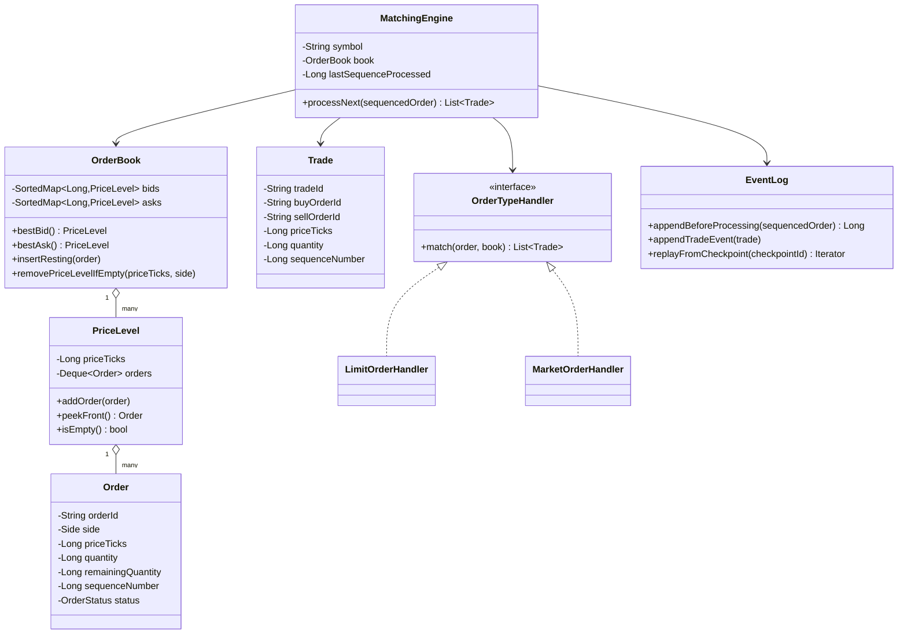
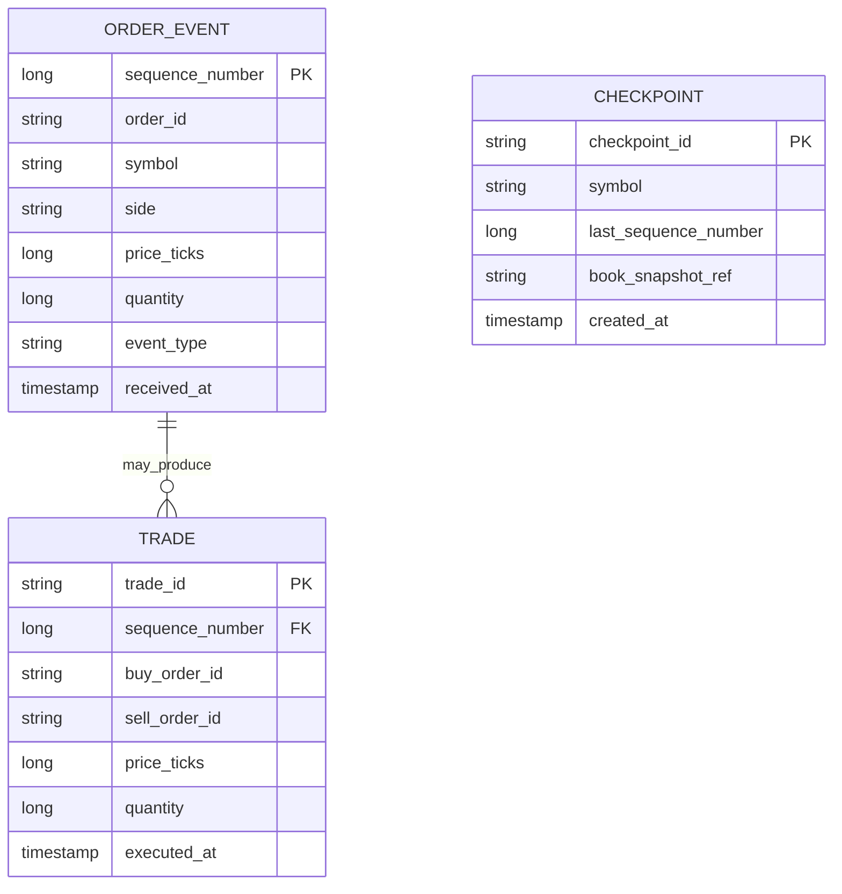

# Stock Exchange (Matching Engine & Market Data) — HLD & LLD

**Assumed metrics** (call out if different): thousands of tradable symbols · peak aggregate order rate in the millions/sec, single hot symbol up to hundreds of thousands/sec during volatility · tick-to-trade latency target: single-digit-to-low-tens of microseconds for the matching decision itself · strictly deterministic, replayable matching (a regulatory/audit hard requirement) · every order event durably logged before acknowledgment · market data must reach all participants as close to simultaneously as possible (a regulatory fairness requirement, not just a performance target) · this design covers the trading-day-critical path (order entry, risk checks, matching, market data); clearing/settlement is covered at the interface-boundary level only, since it's a genuinely separate (T+1/T+2, batch-oriented) system.

**Scope, explicitly enumerated**: order entry (accepting orders from broker/trading-firm connections) · pre-trade risk checks (buying power, position limits, fat-finger/erroneous-order checks) · the matching engine itself (maintaining a limit order book per symbol and matching incoming orders against it by price-time priority) · real-time market data dissemination (order book updates, trade prints) to all participants fairly · durable, replayable event logging for audit and disaster recovery · circuit breakers / trading halts · basic real-time market-surveillance hooks (detecting manipulative patterns like spoofing).

**The architectural inversion this domain forces, on top of the ones already seen in this conversation**: the DynamoDB design chose full decentralization specifically to avoid ever having a single point of coordination. A stock exchange's matching engine is the opposite extreme — it **requires** a single, strictly sequential point of coordination *per symbol*, because price-time priority fairness is only a coherent, auditable guarantee if there is exactly one true order in which competing orders were considered. This isn't a scalability compromise to be engineered around; it's the actual legal/fairness definition of what a fair market even means. The interesting engineering problem this design solves isn't "how do we avoid a single coordinator" (Dynamo's problem) — it's "how do we make a necessarily single-threaded-per-symbol component still hit microsecond latency and millions of orders/sec in aggregate."

---

# Phase 2: High-Level Design (HLD)

## 1. Scope & System Estimation

**Functional Requirements**
- Accept orders (limit, market, and common variants like stop and immediate-or-cancel) from many connected trading participants
- Validate every order against pre-trade risk limits (does this firm/account have sufficient buying power/position capacity, is this order plausible in size/price relative to the current market) before it's allowed to affect the book
- Maintain, per symbol, a live limit order book (all resting buy and sell orders) and match incoming orders against it strictly by **price-time priority**: better prices match first; among orders at the same price, earlier-arriving orders match first
- Publish order book changes and executed trades to all market data subscribers, with strong fairness guarantees about relative timing
- Durably log every order-affecting event so the exact sequence of matching decisions can be reconstructed (for audit, dispute resolution, and crash recovery) — deterministically, meaning replaying the same log must reproduce the exact same trades
- Halt trading (per-symbol or market-wide) automatically on extreme volatility (circuit breakers) or manually by exchange operators
- Feed post-trade data to clearing/settlement systems and generate the audit trail regulators require

**Non-Functional Requirements**
- **Determinism is a hard, non-negotiable correctness requirement, arguably the strictest in this entire conversation**: given the identical sequence of inbound events, the matching engine must produce the identical sequence of trades, every time — this isn't just useful for testing, it's what makes the exchange's trades legally defensible and its disaster-recovery replay mechanism valid at all.
- **Latency**: this is the tightest latency budget of any system in this thread by roughly two to three orders of magnitude — microseconds, not milliseconds, for the actual matching decision, because trading firms' entire competitive strategies (and, more importantly, market fairness itself) depend on the exchange not introducing avoidable delay or jitter.
- **Fairness**: no participant may receive market data or a fill decision meaningfully before another under equivalent conditions — this shapes the market-data dissemination architecture as much as pure throughput does.
- Durability: an acknowledged order must survive a crash — the same non-negotiable durability bar as the banking ledger and RDBMS designs, applied here to trading events instead of financial ledger entries or committed transactions.
- Availability: the exchange being down during trading hours is both a severe business failure and a market-stability event in its own right (participants unable to manage risk during a live market move) — availability matters enormously, but never at the cost of the determinism/fairness guarantees above; a correctly-halted market is an acceptable outcome, a silently-incorrect one is not.

**Back-of-the-Envelope Estimation**
- A single symbol's matching engine processing hundreds of thousands of orders/sec at microsecond-level latency per decision means the *entire matching decision* — check the book, find matchable price levels, execute, update the book — must complete in a small number of microseconds; this rules out essentially any approach involving a lock, a network hop, or a memory allocation on the hot path, and is the concrete reason the LLD below uses **entirely in-memory, single-threaded-per-symbol, allocation-minimized** data structures rather than anything resembling the general-purpose storage engines used in the RDBMS or KV-store designs.
- Thousands of symbols, each requiring its own strictly-sequential matching stream, naturally parallelizes **across** symbols even though it cannot parallelize **within** one symbol — this is the concrete resolution to "how does a single-threaded-per-symbol design still handle millions of orders/sec in aggregate": run many symbols' matching engines concurrently (one dedicated thread/core per symbol, or per symbol-shard), with zero cross-symbol coordination needed, since orders for different symbols never compete for the same book.
- Market data fan-out: thousands of participants each need to receive every book-changing event for the symbols they're subscribed to, with minimal and *uniform* added latency — this is a broadcast/multicast problem at heart, reusing the fan-out philosophy of the LB/DNS anycast designs, but with an added fairness constraint (uniform delivery latency across recipients) that neither of those earlier designs needed to guarantee.
- Durable logging at this event rate (potentially millions of small event records/sec in aggregate) again mandates a purely sequential-append log structure — the same WAL-style append-only design used in the RDBMS and the LSM-tree-based KV store, here pushed to its most latency-critical application yet, since the log write sits directly in the path of the order's own acknowledgment.

## 2. System Architecture & Components

**Architecture Style**: A sharp, deliberate split between **strictly single-threaded, deterministic, per-symbol matching cores** (the correctness-critical heart of the system) and a surrounding set of more conventionally-scaled microservices (order entry, risk checks, market data fan-out, post-trade) that can be horizontally scaled and made highly available in the usual ways. Justification: the matching engine's determinism and fairness requirements make concurrency *within* a symbol actively harmful, not just unnecessary — so that specific component is architected to be as simple, sequential, and fast as possible, while everything around it (which doesn't share that constraint) is built with the more familiar scalability patterns used throughout this conversation.

**Component Breakdown**
- **Order Entry Gateway**: accepts orders from trading participants (commonly over a standardized protocol like FIX in real exchanges), performs basic message validation, and forwards to the risk-check layer — this is a horizontally-scaled, stateless-per-request tier, since order entry itself doesn't need to be sequential until it reaches a specific symbol's matching stream
- **Pre-Trade Risk Check Service**: validates buying power, position limits, and basic sanity checks (rejecting an obviously fat-fingered order, e.g., 100x the expected size or wildly off the current market price) — must be extremely fast itself (a slow risk check directly adds to tick-to-trade latency), typically implemented as an in-memory check against cached account-limit data rather than a live database call
- **Sequencer**: assigns a strict, monotonic sequence number to every event destined for a given symbol's matching engine — this is the component that actually *creates* the single deterministic order the matching engine depends on; in practice this responsibility is often folded directly into the matching engine's own single-threaded input queue rather than being a separate hop, but is called out here as its own conceptual responsibility because it's the specific mechanism that turns "many concurrent order-entry connections" into "one deterministic stream per symbol"
- **Matching Engine (per symbol)**: the correctness-critical core — maintains the live limit order book for one symbol and processes its sequenced input stream strictly in order, on a single dedicated thread, producing trades and book-update events; detailed fully in the LLD
- **Durable Event Log**: every event the matching engine consumes (and every trade it produces) is appended to a durable, sequential log **before** the corresponding acknowledgment is sent — the fourth appearance in this conversation of the same "log first, only then act on it" invariant seen in the chat app's message durability, the banking ledger's commit-before-ack, and the RDBMS's WAL, here applied at the tightest latency budget of any of them
- **Market Data Publisher**: consumes the matching engine's output stream and disseminates book updates/trade prints to all subscribed participants — architected for **fair, uniform-latency fan-out** (detailed in §4), reusing the anycast/broadcast philosophy from the LB and DNS designs but with an explicit fairness requirement neither of those needed
- **Circuit Breaker / Halt Manager**: monitors price volatility (per symbol and market-wide) and triggers trading halts per predefined regulatory thresholds, or accepts manual halt commands from exchange operators — sits alongside, not inside, the matching engine, since a halt is a control action affecting whether the matching engine accepts new input at all, not a matching decision itself
- **Market Surveillance Service**: consumes the same durable event stream (asynchronously, off the critical path) to detect manipulative patterns (spoofing — placing and rapidly cancelling orders to create false impressions of demand; layering; wash trading) — architecturally similar to the banking design's AML pattern detection and the loyalty platform's fraud scoring, applied here to trading-pattern integrity instead of financial-transaction integrity
- **Post-Trade/Clearing Interface**: publishes confirmed trades to downstream clearing and settlement systems — explicitly out of this design's latency-critical core, since clearing/settlement operates on a T+1/T+2 batch timescale, a completely different latency regime than the matching path

**Data Flow Walkthrough**

*Write path (an order arrives):*
1. Trading participant submits an order via the Order Entry Gateway.
2. Pre-Trade Risk Check Service validates it against cached limits — a rejection here happens before the order ever reaches the matching engine or affects the book, and is returned to the participant immediately.
3. A passing order is handed to the Sequencer for its target symbol, which assigns it the next sequence number in that symbol's strictly-ordered stream.
4. The order is durably appended to the Durable Event Log **before** being handed to the Matching Engine for processing — this ordering (log, then match) is what makes crash recovery correct: on restart, replaying the log deterministically reconstructs the exact book state and trade history that existed at the moment of the crash.
5. The Matching Engine (single thread, this symbol only) processes the order against its in-memory book per price-time priority (detailed in the LLD), producing zero or more trades and a book-update event.
6. An acknowledgment (accepted/filled/partially-filled/rejected) is returned to the originating participant, and the resulting trade(s) and book update are handed to the Market Data Publisher for fair, simultaneous-as-possible dissemination to all subscribers.

*Read path (market data subscription):*
1. A participant subscribes to a symbol's market data feed.
2. Market Data Publisher delivers a snapshot of the current book state, then a continuous stream of incremental updates as the Matching Engine produces them — every subscriber for a given symbol receives the same update stream in the same order, with the publisher's fan-out mechanism engineered specifically to avoid systematically favoring any one recipient (detailed in §4).

## 3. Storage & Data Strategy

**Database Selection**
- **The live order book itself is not a "database" at all in the traditional sense — it's an in-memory data structure, held entirely in the matching engine's own process memory**, specifically because any external database round-trip would be orders of magnitude too slow for the microsecond latency budget; this is the most extreme version of the "hot data lives in memory, never touches a database on the query-serving hot path" principle that recurred across the LB's routing tables, the DNS design's zone data, and the KV store's memtables — here applied not just to reads, but to the entire read-and-write hot path.
- **Durable Event Log**: a purely sequential-append log (the same architectural role as the RDBMS's WAL and the KV store's replicated writes), the sole source of durability for the in-memory book — the book can always be exactly reconstructed by replaying this log from the last checkpoint, meaning the in-memory structure itself never needs to be independently durable.
- **Risk/limits cache**: account buying-power and position-limit data, refreshed from a slower, authoritative back-office system but cached in-memory at the risk-check tier for the same latency reasons as the order book itself — a stale limit by a few seconds is an accepted, bounded risk (real exchanges manage this via frequent refresh and conservative limit-setting), since blocking every order on a live limits-database lookup would be incompatible with the latency budget.
- **Post-trade/clearing data**: a conventional, ACID-transactional store (structurally similar to the banking ledger design) — this is explicitly a different latency and consistency regime than the matching engine itself, since clearing operates on a T+1/T+2 timescale where a database round-trip is entirely appropriate.

**Data Lifecycle**
- **Checkpointing**: periodically, the matching engine's full in-memory book state is snapshotted to durable storage, so recovery only needs to replay the event log from the most recent checkpoint forward — the exact same checkpoint-then-replay-forward pattern as the RDBMS's WAL checkpointing, applied here to an order book instead of database pages.
- **Log retention for regulatory audit**: unlike almost every other high-volume event log in this conversation (chat messages, loyalty events), the trading event log's retention is dictated by regulatory requirement, not cost optimization — exchanges are typically required to retain complete, replayable order/trade history for extended periods (multi-year, jurisdiction-dependent), the same "retention driven by external policy, not internal TTL instinct" pattern seen in the banking and DNS-registrar designs.
- **End-of-day/session boundaries**: the order book for a symbol is typically reset at the start of each trading session (unfilled day orders expire, per standard order-type semantics) — this is a clean, scheduled cut-over rather than a live in-place reset, mirroring the leaderboard design's time-window rollover philosophy (freeze, archive, start fresh) applied here to a trading session instead of a daily/weekly leaderboard window.

## 4. Cross-Cutting Concerns & Trade-offs

**CAP Theorem & Trade-offs**
- **The matching engine's core data (the order book) doesn't really face a CAP trade-off in the usual distributed-systems sense, for the same reason the RDBMS didn't**: it's a single-threaded, single-process authority for its symbol, not a partition-tolerant distributed structure — the interesting trade-off here isn't CAP, it's **determinism vs. throughput**, and this design resolves it by parallelizing across symbols (where no shared state exists) rather than ever introducing concurrency within one symbol's matching (where shared state — the book — absolutely does exist and correctness depends on strict ordering).
- **Market data dissemination, by contrast, genuinely does face an availability/fairness trade-off**: broadcasting to thousands of subscribers with *uniform* latency is harder than broadcasting to them merely *quickly* — a fan-out mechanism that's fast on average but has high latency variance (jitter) between recipients would technically deliver "eventually consistent" market views, but with an unfair, exploitable skew between participants, which is precisely the failure mode regulatory fair-access rules exist to prevent; this design treats **latency uniformity**, not just latency magnitude, as a first-class requirement of the Market Data Publisher.
- **Risk-check data**: deliberately AP-leaning (a cached, briefly-stale view of an account's buying power) for the same latency reasons as everywhere else in this conversation that leaned AP for a non-money-ledger read — but bounded and conservative, since the actual money-movement consequences of a trade are still reconciled against the authoritative, ACID back-office ledger after the fact (this design's core matching path optimizes for speed on the assumption that egregious risk violations get caught by conservative limits and post-trade reconciliation, not by a live, blocking check against perfectly fresh data on every single order).

**Resiliency & Security**
- **The "log before act" invariant, appearing for the fourth time in this conversation, at its tightest latency budget yet**: the same principle behind the chat app's "durable before delivery," the banking ledger's "commit before acknowledging," and the RDBMS's WAL-before-data-flush shows up here as "log the order before the matching engine is allowed to process it" — the recurrence across four completely different domains (messaging, money, general-purpose databases, and now trading) at a widening range of latency budgets (milliseconds down to microseconds) is a strong signal that this is a genuinely general principle for building anything that must survive a crash without silently losing acknowledged work, not a domain-specific trick.
- **Deterministic replay as the disaster-recovery mechanism**: because the matching engine's behavior is a pure, deterministic function of its sequenced input stream, recovery from any failure (process crash, hardware failure, even a full data-center failover to a backup site) is "replay the durable log from the last checkpoint" — an unusually strong, verifiable recovery guarantee compared to most systems in this conversation, made possible specifically because determinism was designed in from the start rather than retrofitted.
- **Circuit breakers as a deliberate availability-vs-stability trade-off**: halting trading on extreme volatility is, in CAP-adjacent terms, choosing to sacrifice availability (no new trades can execute) specifically to protect against a worse outcome (a disorderly, potentially manipulated or erroneous market) — this is a rare case in this conversation of a system *deliberately choosing to become unavailable* as the correct, designed-in response to an anomaly, rather than treating all downtime as purely a failure to be minimized.
- **Self-trade prevention and fat-finger checks** at the risk-check layer protect market integrity and individual participants from clearly erroneous orders before they can affect the book at all — cheaper and faster to catch here than to unwind after a bad trade has already executed and affected other participants.
- **Market surveillance runs asynchronously, off the critical path** — exactly like the banking design's AML detection and the loyalty platform's fraud scoring, pattern-detection for manipulative trading behavior is far too latency-sensitive an operation to run inline in the matching path, so it consumes the same durable event stream after the fact, trading immediate blocking for near-real-time detection and after-the-fact enforcement action.

---

# Phase 3: Low-Level Design (LLD)

## 1. Class & Object-Oriented Design

**Design Patterns**
- **Single active object per symbol**: each `MatchingEngine` instance owns its symbol's book exclusively and processes its input queue on one dedicated thread — not really a classic GoF pattern, but the single most important structural decision in this entire LLD, and worth naming explicitly as the load-bearing "pattern" here.
- **Strategy**: pluggable `OrderTypeHandler` (`LimitOrderHandler`, `MarketOrderHandler`, `StopOrderHandler`) so new order types extend the matching engine without changing its core price-time-priority loop.
- **State pattern**: `Order` lifecycle (`NEW → PARTIALLY_FILLED → FILLED / CANCELLED / REJECTED`), enforced the same way every other lifecycle state machine in this conversation has been.
- **Command/Event Sourcing**: every state change is represented as a durably-logged event first, with the in-memory book being a derived, rebuildable projection of that event log — the same event-sourcing shape used by the RDBMS's WAL-and-recovery relationship and the loyalty ledger's append-only transaction log, here applied to the order book instead of an account balance or database page.



## 2. Internal Data Model

*(The live book is in-memory, not a database — the structures below are what's durably logged/checkpointed, the audit-relevant "schema" of this system.)*



**Table/Structure Definitions**

`ORDER_EVENT` (the durable, sequential, replayable log — partitioned/ordered by symbol, then strictly by sequence number)

| Field | Type | Constraints | Description |
|---|---|---|---|
| sequence_number | Long | PK (per symbol), monotonic | The single total order this whole system's determinism depends on |
| order_id | String | Not Null | — |
| symbol | String | Not Null | — |
| price_ticks | Long | Not Null | Integer tick representation, never floating point, to avoid rounding nondeterminism across replays |
| event_type | String | Not Null | NEW / CANCEL / MODIFY |
| received_at | Timestamp | Not Null | For audit; not used in matching logic itself, which depends only on sequence_number |

`TRADE`

| Field | Type | Constraints | Description |
|---|---|---|---|
| trade_id | String | PK | — |
| sequence_number | Long | FK → ORDER_EVENT | The triggering event that produced this trade |
| buy_order_id / sell_order_id | String | Not Null | — |
| price_ticks | Long | Not Null | — |

`CHECKPOINT`

| Field | Type | Constraints | Description |
|---|---|---|---|
| checkpoint_id | String | PK | — |
| symbol | String | Not Null | — |
| last_sequence_number | Long | Not Null | Recovery replays the log starting just after this |
| book_snapshot_ref | String | Not Null | Pointer to the durably-stored full book state at this point |

## 3. API & Interface Specifications

```yaml
openapi: 3.0.0
info:
  title: Order Entry & Market Data API
  version: "1.0"
paths:
  /orders:
    post:
      summary: Submit a new order
      requestBody:
        content:
          application/json:
            schema:
              type: object
              required: [symbol, side, orderType, quantity]
              properties:
                symbol: { type: string }
                side: { type: string, enum: [BUY, SELL] }
                orderType: { type: string, enum: [LIMIT, MARKET, STOP] }
                priceTicks: { type: integer, description: "Required for LIMIT/STOP orders" }
                quantity: { type: integer }
                clientOrderId: { type: string, description: "Idempotency/reference key supplied by the trading participant" }
      responses:
        "200":
          description: Accepted (immediately, before matching completes — fill status follows asynchronously)
          content:
            application/json:
              schema:
                type: object
                properties:
                  orderId: { type: string }
                  sequenceNumber: { type: integer }
                  status: { type: string, enum: [ACCEPTED, REJECTED] }
        "400": { description: Rejected by pre-trade risk check }

  /orders/{orderId}:
    delete:
      summary: Cancel a resting order
      responses:
        "200": { description: Cancel accepted and sequenced like any other event }

  /marketdata/{symbol}/subscribe:
    post:
      summary: Subscribe to a symbol's live book updates and trade prints
      responses:
        "200": { description: Subscription established; updates delivered via the market data stream }

  /marketdata/{symbol}/snapshot:
    get:
      summary: Get the current full book snapshot (for initializing a new subscriber)
      responses:
        "200":
          content:
            application/json:
              schema:
                type: object
                properties:
                  bids: { type: array, items: { type: object } }
                  asks: { type: array, items: { type: object } }
                  asOfSequenceNumber: { type: integer }
```

**Idempotency**
- Every order carries the participant's `clientOrderId` alongside the exchange-assigned `sequenceNumber`; a resubmitted message with the same `clientOrderId` is recognized rather than treated as a brand-new order — the same idempotency-key discipline used throughout this conversation, here applied where a duplicate order is a genuinely serious problem (accidentally doubling a trading position), not just a minor data-quality issue.
- Cancel requests are idempotent: cancelling an already-cancelled or already-fully-filled order returns the current status rather than erroring.
- Replay/recovery is idempotent by construction: replaying the event log from a checkpoint is exactly what normal operation already does (process events strictly in sequence-number order), so there's no separate "recovery mode" logic branch to get subtly wrong — recovery *is* just resuming the same deterministic process from an earlier point.

## 4. Concrete Code Snippets & Sequence Flows

```mermaid
sequenceDiagram
    participant Participant
    participant Gateway as Order Entry Gateway
    participant Risk as Pre-Trade Risk Check
    participant Seq as Sequencer
    participant Log as Durable Event Log
    participant Engine as Matching Engine (this symbol, single thread)
    participant MD as Market Data Publisher

    Participant->>Gateway: submit order
    Gateway->>Risk: validate (buying power, fat-finger check)
    alt fails risk check
        Risk-->>Gateway: REJECTED
        Gateway-->>Participant: 400
    else passes
        Risk->>Seq: forward
        Seq->>Seq: assign next sequence_number for this symbol
        Seq->>Log: append event (BEFORE matching — durability first)
        Log-->>Seq: durably written
        Seq->>Engine: deliver sequenced event
        Engine->>Engine: match against book (price-time priority)
        Engine->>Log: append resulting trade event(s)
        Engine-->>Gateway: ACK (accepted/filled/partial)
        Gateway-->>Participant: order status
        Engine->>MD: book update + trade prints
        MD->>MD: fan out to ALL subscribers with uniform latency
    end
```

**Core Logic: Price-Time Priority Limit Order Matching** (the defining algorithm of the entire system — this single function is what "a fair market" concretely means in code)

```python
# matching_engine.py
from dataclasses import dataclass, field
from collections import deque
from enum import Enum
from typing import Optional
import logging

logger = logging.getLogger("exchange.matching")


class Side(Enum):
    BUY = "BUY"
    SELL = "SELL"


class OrderStatus(Enum):
    NEW = "NEW"
    PARTIALLY_FILLED = "PARTIALLY_FILLED"
    FILLED = "FILLED"
    CANCELLED = "CANCELLED"


@dataclass
class Order:
    order_id: str
    side: Side
    price_ticks: int          # integer ticks, never floats — avoids
                               # floating-point rounding nondeterminism
                               # across replays, a correctness requirement
                               # given this system's determinism guarantee
    quantity: int
    remaining_quantity: int
    sequence_number: int      # this order's position in the strict,
                               # deterministic total order for its symbol
    status: OrderStatus = OrderStatus.NEW


@dataclass(frozen=True)
class Trade:
    trade_id: str
    buy_order_id: str
    sell_order_id: str
    price_ticks: int
    quantity: int
    sequence_number: int  # the triggering event's sequence number


class PriceLevel:
    """FIFO queue of resting orders at one price — this queue's ordering
    IS the 'time priority' half of price-time priority: earlier-arrived
    orders at this price are always at the front."""

    def __init__(self, price_ticks: int):
        self.price_ticks = price_ticks
        self.orders: deque[Order] = deque()

    def add(self, order: Order) -> None:
        self.orders.append(order)

    def peek_front(self) -> Optional[Order]:
        return self.orders[0] if self.orders else None

    def pop_if_fully_filled_front(self) -> None:
        if self.orders and self.orders[0].remaining_quantity == 0:
            self.orders.popleft()

    def is_empty(self) -> bool:
        return len(self.orders) == 0


class OrderBook:
    """
    Bids kept so the highest price is matched first; asks kept so the
    lowest price is matched first — this ordering IS the 'price' half of
    price-time priority. Implemented here with sorted dicts for clarity;
    a production system would use a more cache-friendly structure (e.g.,
    a flat array indexed by price tick, since ticks are bounded integers,
    avoiding tree-traversal overhead entirely on the hot path).
    """

    def __init__(self):
        self.bids: dict[int, PriceLevel] = {}   # price -> level
        self.asks: dict[int, PriceLevel] = {}
        self._bid_prices_desc: list[int] = []   # kept sorted, highest first
        self._ask_prices_asc: list[int] = []    # kept sorted, lowest first

    def best_bid_price(self) -> Optional[int]:
        return self._bid_prices_desc[0] if self._bid_prices_desc else None

    def best_ask_price(self) -> Optional[int]:
        return self._ask_prices_asc[0] if self._ask_prices_asc else None

    def get_level(self, side: Side, price_ticks: int) -> Optional[PriceLevel]:
        book_side = self.bids if side == Side.BUY else self.asks
        return book_side.get(price_ticks)

    def insert_resting(self, order: Order) -> None:
        book_side = self.bids if order.side == Side.BUY else self.asks
        price_list = self._bid_prices_desc if order.side == Side.BUY else self._ask_prices_asc

        if order.price_ticks not in book_side:
            book_side[order.price_ticks] = PriceLevel(order.price_ticks)
            price_list.append(order.price_ticks)
            price_list.sort(reverse=(order.side == Side.BUY))

        book_side[order.price_ticks].add(order)

    def remove_level_if_empty(self, side: Side, price_ticks: int) -> None:
        book_side = self.bids if side == Side.BUY else self.asks
        price_list = self._bid_prices_desc if side == Side.BUY else self._ask_prices_asc

        level = book_side.get(price_ticks)
        if level is not None and level.is_empty():
            del book_side[price_ticks]
            price_list.remove(price_ticks)


class MatchingEngine:
    """
    Owns exactly one symbol's book. Runs on a single dedicated thread —
    processNext() is NEVER called concurrently for the same instance,
    which is what makes this whole class correct without a single lock:
    there is no concurrent access to guard against, by architectural
    construction rather than by synchronization primitives.
    """

    def __init__(self, symbol: str):
        self.symbol = symbol
        self.book = OrderBook()
        self.last_sequence_processed = 0

    def process_limit_order(self, incoming: Order) -> list[Trade]:
        """
        The core price-time priority matching algorithm: an incoming
        order walks the opposite side's price levels, best price first,
        matching FIFO within each level, until either the incoming order
        is fully filled or no more matchable price levels remain — at
        which point any unfilled remainder rests on the book.
        """
        assert incoming.sequence_number > self.last_sequence_processed, (
            "Sequence violation — this would break the determinism "
            "guarantee the entire system depends on"
        )
        self.last_sequence_processed = incoming.sequence_number

        trades: list[Trade] = []
        opposite_side = Side.SELL if incoming.side == Side.BUY else Side.BUY

        while incoming.remaining_quantity > 0:
            best_opposite_price = (
                self.book.best_ask_price()
                if incoming.side == Side.BUY
                else self.book.best_bid_price()
            )
            if best_opposite_price is None:
                break  # nothing to match against — rest the remainder

            crosses = (
                incoming.price_ticks >= best_opposite_price
                if incoming.side == Side.BUY
                else incoming.price_ticks <= best_opposite_price
            )
            if not crosses:
                break  # best available price doesn't satisfy this order's limit

            level = self.book.get_level(opposite_side, best_opposite_price)
            resting = level.peek_front()

            fill_qty = min(incoming.remaining_quantity, resting.remaining_quantity)
            incoming.remaining_quantity -= fill_qty
            resting.remaining_quantity -= fill_qty

            trade = Trade(
                trade_id=f"{incoming.sequence_number}-{resting.order_id}",
                buy_order_id=(incoming.order_id if incoming.side == Side.BUY else resting.order_id),
                sell_order_id=(resting.order_id if incoming.side == Side.BUY else incoming.order_id),
                price_ticks=best_opposite_price,  # resting order's price — standard
                                                    # price-time priority rule: the
                                                    # RESTING order's price is the
                                                    # execution price, not the
                                                    # incoming order's
                quantity=fill_qty,
                sequence_number=incoming.sequence_number,
            )
            trades.append(trade)

            resting.status = (
                OrderStatus.FILLED if resting.remaining_quantity == 0
                else OrderStatus.PARTIALLY_FILLED
            )
            level.pop_if_fully_filled_front()
            self.book.remove_level_if_empty(opposite_side, best_opposite_price)

        incoming.status = (
            OrderStatus.FILLED if incoming.remaining_quantity == 0
            else OrderStatus.PARTIALLY_FILLED if trades
            else OrderStatus.NEW
        )

        if incoming.remaining_quantity > 0:
            self.book.insert_resting(incoming)

        logger.info(
            "order_processed",
            extra={
                "symbol": self.symbol,
                "sequence_number": incoming.sequence_number,
                "trades_produced": len(trades),
                "remaining": incoming.remaining_quantity,
            },
        )
        return trades


# --- unit test placeholders ---
def test_incoming_buy_matches_lower_priced_resting_asks_first():
    # arrange: resting asks at 101 and 100; incoming buy at 101, qty covering both
    # act: process_limit_order(incoming)
    # assert: fills against the 100 ask BEFORE the 101 ask — best (lowest) price first
    pass


def test_time_priority_within_same_price_level():
    # arrange: two resting asks at the same price, order A placed before order B
    # act: incoming buy matches only part of the available quantity at that price
    # assert: order A (earlier) is filled before order B, even though both are
    #         at the identical price — this is the "time" half of price-time priority
    pass


def test_execution_price_is_the_resting_orders_price_not_the_incomings():
    # arrange: incoming buy at 105 crosses a resting ask at 100
    # act: process_limit_order
    # assert: trade.price_ticks == 100, not 105 — standard matching-engine
    #         convention, and a real fairness property (the aggressor
    #         doesn't get charged worse than the resting order offered)
    pass


def test_unfilled_remainder_rests_on_book_at_its_own_price():
    # arrange: incoming buy larger than all matchable opposite-side liquidity
    # act: process_limit_order
    # assert: partial trades occur for the matchable portion, and the
    #         remainder is inserted as a new resting order on the book
    pass


def test_out_of_order_sequence_number_raises():
    # arrange: engine has already processed sequence_number=100
    # act: process_limit_order with an order carrying sequence_number=99
    # assert: raises an assertion/error — this must be structurally
    #         impossible to violate silently, since it's the invariant
    #         the whole determinism guarantee rests on
    pass


def test_empty_price_level_is_removed_from_the_book():
    # arrange: a price level with exactly one resting order, fully filled
    #          by the incoming order
    # act: process_limit_order
    # assert: that price level no longer appears in best_ask_price()/
    #         best_bid_price() results afterward
    pass
```

---

### Key design decisions worth flagging back to you
1. **This is the one design in the whole conversation where strict single-threaded sequential processing is the *correct*, non-negotiable architecture for the most critical component**, not a bottleneck to be engineered around — price-time priority fairness is only a meaningful, auditable guarantee if there's exactly one true order of consideration, and the way this design still achieves millions of orders/sec in aggregate is by parallelizing across symbols (which share no state) rather than ever introducing concurrency within one symbol's book (which would directly undermine the fairness guarantee).
2. **"Log before act" makes its fourth appearance in this conversation, now at its tightest latency budget** — chat's durability-before-delivery, banking's commit-before-ack, the RDBMS's WAL-before-flush, and now the exchange's log-before-match all express the identical underlying principle at progressively different scales and latency regimes, which is a strong signal it's a load-bearing general principle for crash-safe systems, not a one-off trick.
3. **Determinism, designed in from the start, is what makes disaster recovery unusually strong here**: because the matching engine is a pure function of its sequenced input, "replay the log" isn't a special recovery-mode code path bolted on afterward, it's literally the same processing logic normal operation already uses — a stronger and simpler recovery story than most systems in this conversation manage, precisely because determinism was a first-class design constraint rather than an afterthought.

Let me know if you want to go deeper on any piece — e.g., the market data fan-out mechanism's specific fairness/uniform-latency engineering, circuit-breaker volatility-threshold mechanics, or how this design would extend to cross-venue order routing and the National Best Bid and Offer (NBBO) concept in real equity markets.
