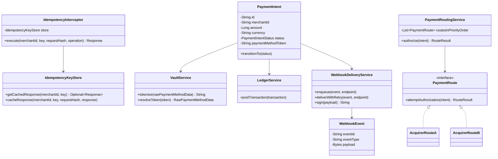
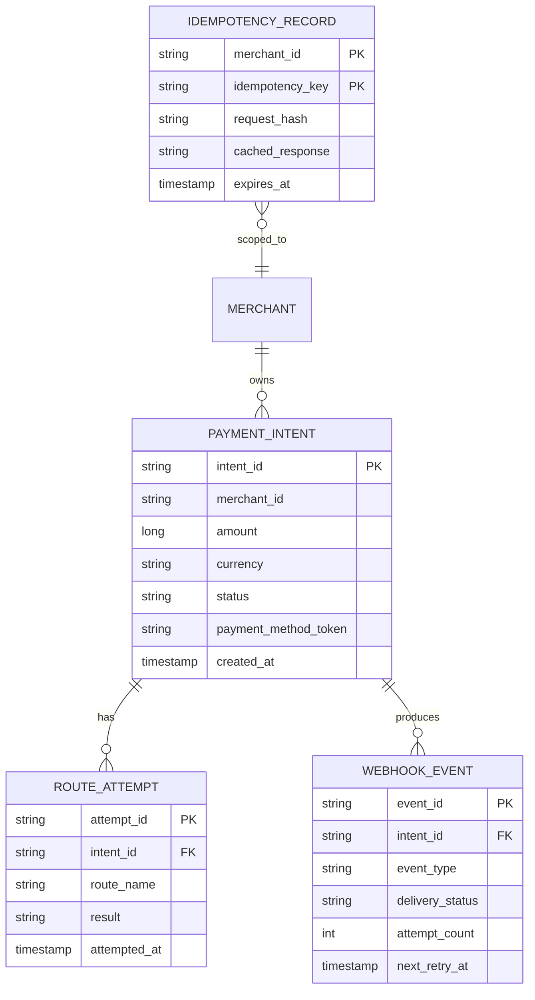
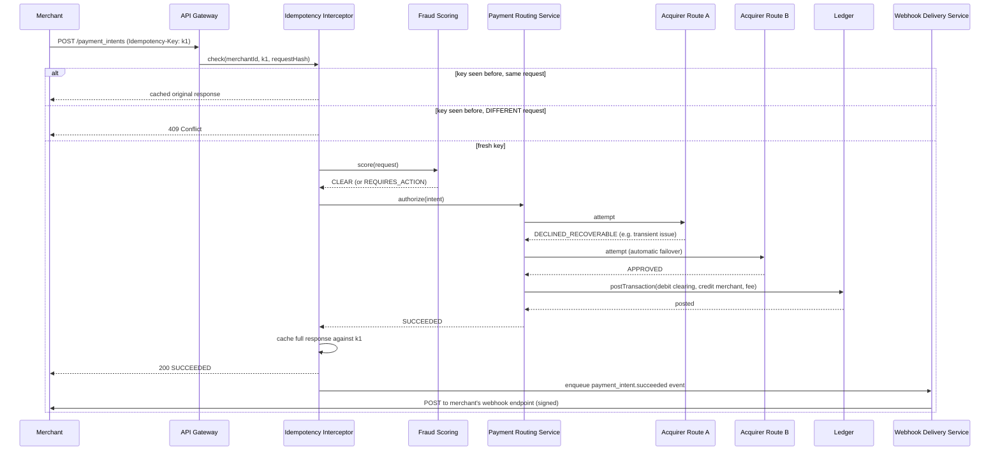

# Payment Gateway/Processor (Stripe-style) — HLD & LLD

**Assumed metrics** (call out if different): millions of merchants integrated · billions of transactions/year, peak tens of thousands of TPS · API response latency in the low hundreds of ms (bounded by external card-network/acquirer round-trips, not purely internal compute) · idempotency is a headline, externally-facing API guarantee, not just an internal implementation detail · full PCI-DSS scope containment, extended specifically to keep integrating merchants *out* of PCI scope wherever possible · multi-currency, multi-region.

**Scope, explicitly enumerated**: tokenizing and securely accepting card/payment-method data · creating and progressing a payment through its lifecycle (authorize → capture → settle) · routing a payment across the right external rail (card network, ACH, regional payment method) with intelligent retry on decline · maintaining a double-entry ledger of merchant balances, fees, and Stripe's own position · payouts (moving settled merchant balance to their bank account) · refunds and dispute/chargeback handling · real-time fraud/risk scoring · reliable webhook delivery of account/payment events to merchant-owned servers · reconciliation against card-network settlement files.

**This design builds directly on the banking system designed earlier in this conversation** — the underlying double-entry ledger, the idempotency-key discipline, and the fail-closed fraud posture are the same mechanisms, reused rather than reinvented, because a payment processor's core money-correctness requirements are identical to a bank's. What's genuinely new here, and where the real design effort goes below, is everything specific to being a **platform that sits between millions of merchants and multiple external payment rails**: routing a single payment across networks with automatic failover, shielding merchants (third parties Stripe doesn't control) from ever handling raw card data, and reliably delivering events to merchants' own servers — which, unlike the chat app's push notifications to well-behaved first-party client apps, are arbitrary, sometimes-flaky, third-party HTTP endpoints Stripe has no control over.

---

# Phase 2: High-Level Design (HLD)

## 1. Scope & System Estimation

**Functional Requirements**
- Accept payment method details (card, bank account, wallet) via a tokenization flow that never exposes raw sensitive data to the integrating merchant's own servers
- Create and progress a payment through a well-defined lifecycle: create → (optionally) require additional customer authentication → authorize → capture → settle, with clear states at every step
- Route each payment attempt to the appropriate external rail (a card network via an acquiring bank, an ACH network, a regional payment method), with automatic retry across alternate routes on a recoverable decline
- Score every payment for fraud risk in real time and block, challenge, or flag accordingly
- Maintain an authoritative, double-entry ledger of every merchant's balance, Stripe's fees, and money movement, and periodically pay out settled balances to merchants' bank accounts
- Support refunds (full/partial) and the full lifecycle of a card-network dispute/chargeback
- Deliver webhook events (payment succeeded, dispute opened, payout sent, etc.) to merchant-configured endpoints reliably, with retry and cryptographic signing so merchants can trust the events came from the platform
- Reconcile internal ledger records against external settlement files from card networks/acquirers to catch any discrepancy

**Non-Functional Requirements**
- **Idempotency is a first-class, externally-facing API contract, not just an internal implementation detail** — a merchant integration retrying a request after a timeout must be able to trust that supplying the same idempotency key returns the exact original result rather than creating a second charge; this is stricter and more externally-visible than every prior idempotency-key use in this conversation, which were internal correctness mechanisms, not documented public API guarantees merchants build their own retry logic against.
- Consistency: **the ledger is CP, identical in rigor to the banking design** — a merchant's balance must never be wrong. Payment *routing/retry decisions* are more AP-leaning (choosing the next rail to try on a decline is a best-effort optimization, not a correctness-critical decision).
- Latency: bounded fundamentally by external card-network round-trip time, not purely by internal system design — the internal portions of the request path (tokenization lookup, fraud scoring, ledger recording) need to add minimal overhead on top of that external floor.
- Compliance: PCI-DSS scope containment is doubly important here compared to the banking design, because this platform's entire value proposition to merchants is *absorbing* that compliance burden on their behalf — a merchant integrating this platform correctly should be able to legitimately claim a dramatically reduced PCI scope for themselves.
- Reliability of webhook delivery: merchants build real business logic (order fulfillment, access provisioning) on top of webhook events, so delivery must be at-least-once, retried with backoff, and clearly distinguishable as duplicate-safe (via event IDs) — a genuinely harder reliability target than the internal, first-party push-notification designs earlier in this conversation, because the delivery target here is an arbitrary third party's infrastructure, which will sometimes be down, slow, or misconfigured, and none of that is within this platform's control.

**Back-of-the-Envelope Estimation**
- Tens of thousands of TPS peak across the whole platform, but the vast majority of the *processing* time per request is spent waiting on an external card network/acquirer round-trip (commonly tens to low hundreds of milliseconds) — this means the internal system's job is less "be maximally fast" and more "add as little overhead as possible on top of an external latency floor it doesn't control," which shapes the architecture toward asynchronous, non-blocking orchestration of external calls rather than trying to optimize away a wait that's inherent to the domain.
- Idempotency-key storage: every API request that supplies a key needs its full response cached for a bounded window (commonly 24 hours in real systems) so a retry within that window gets the identical original response — at this request volume, this is a substantial, high-write, short-retention KV workload, architected as its own concern rather than folded into the ledger's database (detailed in §3).
- Webhook fan-out: each payment event can trigger deliveries to potentially several merchant-configured endpoints (a merchant might have both a production and a monitoring webhook, for instance) — at billions of transactions/year this is itself a very high-volume, though comparatively low-stakes-per-individual-delivery, asynchronous workload, decoupled entirely from the synchronous payment-processing path (a webhook delivery being slow or retried must never delay the actual payment result returned to the merchant's checkout flow).
- Routing/retry fan-out: a single logical payment attempt might, on a recoverable decline, be retried against a second acquirer/route before finally succeeding or failing — this multiplies actual external-network calls beyond the raw "number of payments," a cost this design explicitly budgets for as the price of improving overall authorization success rates, detailed in §2.

## 2. System Architecture & Components

**Architecture Style**: Microservices, structured around the payment lifecycle as the organizing principle, with the **ledger and idempotency-key mechanisms reused directly from the banking design** and three genuinely new components — a **Payment Routing/Orchestration layer** (choosing and retrying across external rails), a **Tokenization/Vault** (shielding merchants from raw payment-method data), and a **Webhook Delivery Service** (reliable, retried, signed event delivery to third-party endpoints) — that don't have a direct analog in the banking design, since a bank's own systems don't need to route payments across competing external networks or notify thousands of independently-operated third-party integrations.

**Component Breakdown**
- **Merchant-Facing API Gateway**: reuses the API Gateway design from earlier in this conversation directly — authentication (API keys/OAuth), rate limiting, request validation — the front door every merchant integration talks to
- **Tokenization/Vault Service**: accepts raw payment-method data (typically via a client-side library so it never even transits the merchant's own server, the strongest possible PCI-scope reduction) and returns an opaque token the merchant can safely store and pass around instead — the vault itself is the one component holding actual sensitive payment-method data, tightly scoped and isolated exactly like the banking design's PCI-scope-containment boundary, just now protecting third-party merchants instead of the platform's own internal services
- **Payment Intent Service**: owns the payment's lifecycle state machine (`REQUIRES_PAYMENT_METHOD → REQUIRES_CONFIRMATION → REQUIRES_ACTION → PROCESSING → SUCCEEDED / FAILED`), including the `REQUIRES_ACTION` step for additional customer authentication (e.g., 3-D Secure/SCA challenges) that doesn't have a direct analog in the earlier banking design, since a bank's own internal transfers don't typically require an interactive customer authentication step mid-flow
- **Payment Routing/Orchestration Service**: the genuinely new piece — decides which external rail (which acquiring bank, which card network path, which regional payment method processor) to attempt a payment against, and on a recoverable decline, intelligently retries against an alternate route rather than immediately failing the payment — detailed further below
- **Fraud/Risk Scoring Service**: real-time scoring, reusing the same fail-closed-on-suspicion posture and architectural role as the banking design's fraud service and the loyalty platform's AML detection
- **Ledger Service**: the exact same double-entry, ACID, idempotent-posting mechanism as the banking design — tracking each merchant's balance, this platform's fees, refunds, and disputes, all as properly balanced ledger transactions
- **Payout Service**: schedules and executes transfers of settled merchant balance to the merchant's linked bank account, reusing the banking design's external-rail integration pattern (ACH/wire) for the actual money movement
- **Dispute/Chargeback Service**: manages the multi-step chargeback lifecycle initiated by a card network, mirroring the banking design's dispute state machine
- **Webhook Delivery Service**: the other genuinely new piece — reliably delivers signed event payloads to merchant-configured HTTPS endpoints, with retry-with-backoff and clear duplicate-safety guarantees, detailed further below
- **Idempotency Key Service**: caches full request/response pairs keyed by a merchant-supplied idempotency key, detailed fully in the LLD, since this is the platform's single most externally-visible correctness mechanism
- **Reconciliation Service**: periodically compares the Ledger Service's records against external settlement files from card networks/acquirers, mirroring the banking design's reconciliation safety net

**Data Flow Walkthrough**

*Write path (processing a payment):*
1. Merchant's client-side integration tokenizes the customer's payment method directly against the Tokenization/Vault Service — raw card data never transits the merchant's own servers at all, the strongest form of PCI-scope reduction available.
2. Merchant's server creates a Payment Intent (via the Merchant-Facing API Gateway), supplying an idempotency key — the Idempotency Key Service checks whether this exact key has been seen before and, if so, returns the cached original response immediately without reprocessing anything.
3. On a fresh request, the Fraud/Risk Scoring Service evaluates the attempt; a clearly fraudulent one is blocked outright, a borderline one may trigger the `REQUIRES_ACTION` state (an interactive authentication challenge shown to the customer) before proceeding.
4. Payment Routing/Orchestration Service selects an external rail (e.g., a specific acquiring bank relationship for this card's network and region) and submits the authorization request; on a recoverable decline (e.g., a transient network-level issue, as opposed to a hard decline like insufficient funds), it retries against an alternate configured route rather than immediately failing the whole payment.
5. On successful authorization, the Ledger Service posts the corresponding double-entry transaction (debiting a clearing/rail account, crediting the merchant's balance, recording the platform's fee) — atomically, exactly as in the banking design.
6. The Payment Intent transitions to `SUCCEEDED` (or `FAILED`, with a clear reason), the original API response is cached against the idempotency key for the retention window, and a webhook event is queued for asynchronous delivery to the merchant.

*Read path (checking status, or a merchant's webhook receiver):*
1. Merchants can poll the Payment Intent's current status directly via the API — a straightforward read against the Payment Intent Service's store.
2. Independently, the Webhook Delivery Service asynchronously delivers the event to the merchant's configured endpoint, retrying with backoff on failure, entirely decoupled from the synchronous payment-processing path that already returned a result to the merchant's checkout flow.

## 3. Storage & Data Strategy

**Database Selection**
- **Ledger**: identical choice and rationale to the banking design — a strongly consistent, ACID-transactional relational store, since double-entry bookkeeping is fundamentally a relational-integrity problem.
- **Tokenization/Vault**: a tightly access-controlled, encrypted store holding actual payment-method data, isolated from every other component exactly like the banking design's PCI-scope boundary — the vault issues opaque tokens that the rest of the platform (and the merchant) uses instead, so no other service or database in the whole system ever needs to be in full PCI scope itself.
- **Idempotency Key Store**: a fast KV store (not the ledger's relational database) keyed by `(merchantId, idempotencyKey)`, storing the full serialized original response with a bounded TTL (e.g., 24 hours) — deliberately separate from the ledger because this is a general-purpose "cache any API response," not a money-specific mechanism, and its access pattern (fast key lookup, short retention) doesn't match the ledger's relational, long-retention needs.
- **Payment Intent state**: a document/relational store tracking the lifecycle state machine per payment — read/written frequently during a payment's brief active lifetime, then effectively archival afterward.
- **Webhook Delivery Queue**: a durable, ordered-enough message queue (the event must not be silently dropped even if the merchant's endpoint is down for an extended period) feeding the delivery workers, with a dead-letter path for events that exhaust their retry budget.
- **Reconciliation data**: a data lake/warehouse holding both internal ledger exports and external settlement files, for the batch comparison job — same shape as the banking design's reconciliation storage.

**Data Lifecycle**
- **Idempotency key expiry**: keys and their cached responses expire after a bounded window — long enough to cover realistic client retry scenarios (network blips, client restarts) but not indefinite, since indefinite retention of every API response would be unbounded storage growth for no ongoing correctness benefit once a merchant's integration has clearly moved on.
- **Tokenized data lifecycle**: a token remains valid per the merchant's/customer's own retention needs (e.g., a saved card for repeat purchases), but the *raw* underlying data it represents is never duplicated outside the vault — every other system component, including this platform's own ledger and payment intent records, stores only the token, never the raw value.
- **Webhook retry/backoff and dead-lettering**: failed deliveries retry with exponential backoff over a bounded window (e.g., up to several days, matching real-world expectations that a merchant's server might be down for a maintenance window, not just a momentary blip); once exhausted, the event moves to a dead-letter state the merchant can inspect and manually request redelivery of — never silently dropped.
- **Ledger retention**: driven by financial/regulatory retention requirements, identical reasoning to the banking design — multi-year retention is a compliance floor, not a cost-optimization target.

## 4. Cross-Cutting Concerns & Trade-offs

**CAP Theorem & Trade-offs**
- **The Ledger: CP, identical stance to the banking design**, for identical reasons — a merchant's balance must never be ambiguous or wrong.
- **Payment routing/retry decisions: AP-leaning** — choosing which external rail to try, and whether to retry on a decline, is a best-effort optimization aimed at maximizing successful authorization rates, not a correctness-critical decision with a single "right" answer; a slightly suboptimal routing choice costs a bit of authorization-rate performance, never a wrong balance.
- **Idempotency key lookups: leans CP in effect, though implemented as a fast KV read** — an idempotency check that raced and returned stale "no prior request" information when one actually existed would risk a double-charge, so this specific lookup, unlike most fast-KV-backed reads elsewhere in this conversation, needs to be checked with real care (e.g., a database-level uniqueness constraint backing the cache, not just a best-effort cache check) — mirroring the banking design's `idempotencyKey` uniqueness-constraint discipline exactly.
- **Webhook delivery: unambiguously AP** — a webhook arriving a few seconds or even minutes late (during retry backoff) is an accepted, expected, and disclosed characteristic of an at-least-once delivery system; merchants are expected to build idempotent event handlers (keyed on the event ID) rather than assume instantaneous, exactly-once delivery.

**Resiliency & Security**
- **Fail-closed on ambiguous fraud signals**, identical posture to the banking design — a borderline-risky payment is held for review rather than auto-approved, since the cost asymmetry (a frustrated legitimate customer vs. a fraudulent charge that's hard to reverse) favors caution here, unlike the gaming leaderboard's opposite-leaning anti-cheat stance.
- **PCI scope containment extended to third parties**: this is the one place this design goes further than the banking design did — the entire tokenization architecture exists specifically so that *merchants*, who are not part of this platform's own security boundary and whose engineering practices this platform can't control, never need to handle raw card data at all; this is a structurally different and harder problem than containing PCI scope within one organization's own services.
- **Idempotency-key conflict handling**: if a merchant reuses the same idempotency key with genuinely *different* request parameters (a client bug, or a deliberate replay attempt), the platform must reject this as an error rather than either silently processing the new parameters or silently returning the stale cached response for a different request — both would be surprising, unsafe behaviors; this is the same principle as the banking ledger's `DuplicateEventError` handling, applied here as a documented, externally-visible API error rather than an internal log line.
- **Webhook payload signing**: every webhook is cryptographically signed so the receiving merchant server can verify the event genuinely originated from this platform and wasn't forged or tampered with in transit — a necessary trust mechanism specifically because these events are delivered to infrastructure this platform doesn't control and can't otherwise vouch for the authenticity of.
- **Routing failover as a resiliency mechanism, not just a performance optimization**: if a specific acquiring-bank relationship or card-network path is degraded or down, the Payment Routing Service's ability to fail over to an alternate route means a localized external outage doesn't necessarily become a payment failure for the merchant — the same "one dependency's degradation shouldn't cascade" principle as the API Gateway's circuit breakers, applied here across genuinely redundant, competing external payment rails rather than internal backend instances.

---

# Phase 3: Low-Level Design (LLD)

## 1. Class & Object-Oriented Design

**Design Patterns**
- **State pattern**: `PaymentIntent` lifecycle (`REQUIRES_PAYMENT_METHOD → REQUIRES_CONFIRMATION → REQUIRES_ACTION → PROCESSING → SUCCEEDED / FAILED`), the same lifecycle-state-machine discipline used throughout this conversation.
- **Strategy + Chain of Responsibility**: `PaymentRoute` implementations (specific acquirer/network paths) tried in an ordered, fallback-capable chain on decline — structurally similar to the API Gateway's circuit-breaker fallback chain, applied here to external payment rails instead of internal backend instances.
- **Decorator/Interceptor**: the Idempotency Key check wraps the actual request-handling logic — any API operation can opt into idempotency-key caching without its own business logic needing to know or care about the caching mechanism, the same "wrap, don't modify" philosophy as the API Gateway's middleware pipeline.
- **Observer**: the Webhook Delivery Service subscribes to Payment Intent and Ledger state-change events, entirely decoupled from the components that produce them — same pub-sub shape used throughout this conversation's event-driven designs.



## 2. Database Schema Design



**Table Definitions**

`IDEMPOTENCY_RECORD` (the platform's single most externally-visible correctness mechanism)

| Field | Type | Constraints | Description |
|---|---|---|---|
| merchant_id | String | PK (composite) | Idempotency keys are scoped per merchant, never global |
| idempotency_key | String | PK (composite) | Merchant-supplied |
| request_hash | String | Not Null | Hash of the original request body — detects a conflicting reuse of the same key with different parameters |
| cached_response | String | Not Null | The full original response, replayed verbatim on a matching retry |
| expires_at | Timestamp | Not Null | Bounded retention window (§3) |

`ROUTE_ATTEMPT`

| Field | Type | Constraints | Description |
|---|---|---|---|
| attempt_id | String | PK | — |
| intent_id | String | FK → PAYMENT_INTENT | — |
| route_name | String | Not Null | Which acquirer/network path was tried |
| result | String | Not Null | APPROVED / DECLINED_HARD / DECLINED_RECOVERABLE / ERROR |
| attempted_at | Timestamp | Not Null | Full attempt history retained for dispute evidence and routing-performance analysis |

`WEBHOOK_EVENT`

| Field | Type | Constraints | Description |
|---|---|---|---|
| event_id | String | PK | The ID merchants key their own idempotent handling off |
| delivery_status | String | Not Null | PENDING / DELIVERED / RETRYING / DEAD_LETTERED |
| attempt_count | Int | Not Null | Drives backoff calculation |
| next_retry_at | Timestamp | Nullable | — |

## 3. API & Interface Specifications

```yaml
openapi: 3.0.0
info:
  title: Payment Gateway API
  version: "1.0"
paths:
  /payment_intents:
    post:
      summary: Create a payment intent (idempotent)
      parameters:
        - name: Idempotency-Key
          in: header
          required: true
          schema: { type: string }
      requestBody:
        content:
          application/json:
            schema:
              type: object
              required: [amount, currency, paymentMethodToken]
              properties:
                amount: { type: integer }
                currency: { type: string }
                paymentMethodToken: { type: string }
      responses:
        "200": { description: "Created, or an idempotent replay of a prior identical request" }
        "409": { description: "Idempotency key reused with different request parameters — a real client error, not a silent replay" }

  /payment_intents/{id}/confirm:
    post:
      summary: Confirm and attempt to authorize the payment
      responses:
        "200":
          content:
            application/json:
              schema:
                type: object
                properties:
                  status: { type: string, enum: [REQUIRES_ACTION, PROCESSING, SUCCEEDED, FAILED] }
                  nextActionUrl: { type: string, nullable: true }

  /webhook_endpoints:
    post:
      summary: Register a merchant webhook endpoint
      requestBody:
        content:
          application/json:
            schema:
              type: object
              properties:
                url: { type: string }
                eventTypes: { type: array, items: { type: string } }
      responses:
        "201": { description: Registered }

  /webhook_events/{eventId}/redeliver:
    post:
      summary: Manually request redelivery of a dead-lettered event
      responses:
        "202": { description: Redelivery queued }
```

**Idempotency**
- `POST /payment_intents` requires an `Idempotency-Key` header; a request with a previously-seen key **and matching request parameters** returns the original cached response verbatim; a previously-seen key with **different** parameters returns `409` — the request-hash check is what makes this stricter and safer than a bare key-existence check, since it catches genuine client bugs (accidentally reusing a key across two different logical requests) rather than silently misapplying a cached response to the wrong operation.
- Webhook events carry a stable `event_id` merchants are expected to dedupe on — since delivery is at-least-once, a merchant might legitimately receive the same event twice (e.g., if their endpoint accepted it but the acknowledgment was lost), and correct handling means treating a repeated `event_id` as a no-op.
- Route-attempt retries within the routing/orchestration layer carry their own internal idempotency (a retried authorization attempt against the same route with the same parameters shouldn't double-authorize), distinct from and internal to the merchant-facing idempotency-key contract.

## 4. Concrete Code Snippets & Sequence Flows



**Core Logic: Idempotency-Key Interceptor with Request-Hash Conflict Detection** (the platform's single most externally-visible correctness guarantee — this is the mechanism every merchant integration's retry logic depends on being right)

```python
# idempotency.py
import hashlib
import json
from dataclasses import dataclass
from typing import Callable, Optional
import logging

logger = logging.getLogger("gateway.idempotency")


class IdempotencyConflictError(Exception):
    """Raised when a key is reused with genuinely different request
    parameters — a real client error that must be surfaced, not silently
    papered over in either direction."""


@dataclass(frozen=True)
class CachedResult:
    request_hash: str
    response: dict


class IdempotencyKeyStore:
    """Backed by a fast KV store with a uniqueness constraint on
    (merchant_id, idempotency_key) — the store itself is what prevents a
    race between two concurrent requests bearing the same fresh key from
    both proceeding to process the underlying operation twice."""

    def get(self, merchant_id: str, key: str) -> Optional[CachedResult]:
        raise NotImplementedError

    def put_if_absent(
        self, merchant_id: str, key: str, request_hash: str
    ) -> bool:
        """Atomically reserves this key for this merchant if not already
        present. Returns False if another request already claimed it
        (the concurrent-race case) — the caller must then wait for/fetch
        that other request's result rather than proceed independently."""
        raise NotImplementedError

    def store_response(
        self, merchant_id: str, key: str, response: dict
    ) -> None:
        raise NotImplementedError


def _hash_request(request_body: dict) -> str:
    canonical = json.dumps(request_body, sort_keys=True)
    return hashlib.sha256(canonical.encode("utf-8")).hexdigest()


class IdempotencyInterceptor:
    """
    Wraps any API operation with idempotency-key handling, without that
    operation's own logic needing to know the caching mechanism exists —
    this is the Decorator pattern from the LLD's class design, made
    concrete. Any endpoint that wants idempotency-key support just
    passes its handler through execute().
    """

    def __init__(self, store: IdempotencyKeyStore):
        self._store = store

    def execute(
        self,
        merchant_id: str,
        idempotency_key: str,
        request_body: dict,
        operation: Callable[[], dict],
    ) -> dict:
        request_hash = _hash_request(request_body)

        existing = self._store.get(merchant_id, idempotency_key)
        if existing is not None:
            if existing.request_hash != request_hash:
                logger.warning(
                    "idempotency_key_conflict",
                    extra={"merchant_id": merchant_id, "key": idempotency_key},
                )
                raise IdempotencyConflictError(
                    f"Idempotency-Key '{idempotency_key}' was already used "
                    f"with different request parameters"
                )
            logger.info(
                "idempotent_replay",
                extra={"merchant_id": merchant_id, "key": idempotency_key},
            )
            return existing.response

        reserved = self._store.put_if_absent(merchant_id, idempotency_key, request_hash)
        if not reserved:
            # Lost a race to a concurrent request bearing the identical
            # fresh key — re-fetch rather than proceed independently,
            # since the other request is (or will shortly be) the
            # authoritative result for this key.
            existing = self._store.get(merchant_id, idempotency_key)
            if existing and existing.request_hash == request_hash:
                return existing.response
            raise IdempotencyConflictError(
                f"Concurrent conflicting request for key '{idempotency_key}'"
            )

        # We hold the reservation; actually perform the operation exactly once.
        response = operation()
        self._store.store_response(merchant_id, idempotency_key, response)
        return response


# --- unit test placeholders ---
def test_fresh_key_executes_operation_exactly_once():
    # arrange: store with no existing record for this key
    # act: execute(merchant_id, key, body, operation)
    # assert: operation() was called exactly once; response matches and is
    #         stored via store_response
    pass


def test_replayed_key_with_identical_request_returns_cached_response_without_reexecuting():
    # arrange: store already has a CachedResult for this key with a matching hash
    # act: execute(...) with the SAME request_body
    # assert: operation() is NEVER called; the cached response is returned verbatim
    pass


def test_replayed_key_with_different_request_raises_conflict():
    # arrange: store has a CachedResult for this key with hash H1
    # act: execute(...) with a request_body that hashes to H2
    # assert: raises IdempotencyConflictError; operation() never called
    pass


def test_concurrent_fresh_key_race_defers_to_winner():
    # arrange: put_if_absent returns False (another request already
    #          reserved this key with the same request_hash)
    # act: execute(...)
    # assert: does NOT call operation() again; returns the winner's
    #         eventual cached response instead
    pass


def test_concurrent_conflicting_race_raises_rather_than_silently_picking_one():
    # arrange: put_if_absent returns False; the existing record's hash
    #          does NOT match this request's hash (a genuine race between
    #          two different logical requests reusing one key)
    # act/assert: raises IdempotencyConflictError
    pass
```

---

### Key design decisions worth flagging back to you
1. **Everything money-correctness-critical here is deliberately identical to the banking design** — the ledger, the fail-closed fraud posture, the idempotency discipline — reused rather than reinvented, because a payment processor's core correctness obligations really are the same as a bank's; the new engineering effort in this design is entirely in the platform-specific layer sitting on top of that: routing across external rails, protecting third-party merchants from PCI scope, and reliably notifying servers this platform doesn't control.
2. **Idempotency here graduates from an internal correctness mechanism (as in every earlier design) to a documented, externally-visible API contract merchants build their own retry logic against** — which is why the request-hash conflict check matters: silently misapplying a cached response to what's actually a different logical request would be a subtle, serious bug precisely because merchants are trusting this mechanism at arm's length, without visibility into its internals.
3. **Webhook delivery is a harder reliability problem than any push-notification design earlier in this conversation**, specifically because the delivery targets are arbitrary third-party servers Stripe doesn't operate or control — at-least-once delivery with clear duplicate-safety (via event IDs) is the honest, achievable guarantee, and the design leans on merchants' own idempotent event handling rather than chasing an unrealistic exactly-once promise.

Let me know if you want to go deeper on any piece — e.g., the payment routing service's decline-classification logic (which declines are worth retrying on an alternate rail vs. which are final), the 3-D Secure/SCA authentication-challenge flow in more detail, or the reconciliation job's matching algorithm against card-network settlement files.
