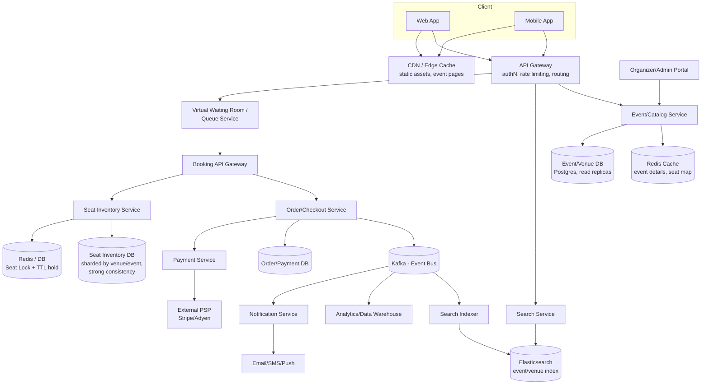

# High-Level Design: Ticketmaster (Event Ticketing & Booking Platform)

## 1. Problem Statement

Design a system like Ticketmaster where users can discover events (concerts, sports, theater),
view real-time seat availability, reserve and purchase tickets, and receive confirmations —
while guaranteeing **no seat is ever sold twice**, even under massive, spiky demand
(e.g., a Taylor Swift or Super Bowl on-sale generating 100x normal traffic in minutes).

### Assumptions (stated explicitly since not all requirements were specified)
- Primary market only (organizer sells to consumer); secondary/resale market out of scope
- Global user base, but venues/events are region-specific
- Payments are handled via a third-party PSP (Stripe/Adyen) — we integrate, not build, payment rails
- Seat-level inventory (assigned seating) is the hard case; GA (general admission, quantity-only)
  is a simpler subset of the same design
- Mobile + web clients
- No ML-based bot/fraud detection in this version (called out as future work)

---

## 2. Functional Requirements

1. **Search & Discovery** — search events by keyword, artist, venue, city, date range, category
2. **Event Details** — view event info, venue seat map, pricing tiers, real-time seat availability
3. **Seat Selection & Hold** — user selects seat(s); system holds them exclusively for a checkout window
4. **Checkout & Payment** — user pays; on success, seats move to `BOOKED` and a ticket is issued
5. **Booking Management** — view/cancel bookings, refunds (subject to policy)
6. **Notifications** — booking confirmation, reminders, event changes/cancellations
7. **Admin/Organizer** — create events, define venues + seat maps, set pricing tiers, view sales

### Explicitly out of scope (state if you want these added)
- Dynamic/surge pricing engine
- Ticket resale/transfer marketplace
- Loyalty/rewards program

---

## 3. Non-Functional Requirements

| Requirement | Target | Why |
|---|---|---|
| **Consistency (booking path)** | Strong consistency, zero double-booking | Selling the same seat twice is a business-critical failure |
| **Availability (browse/search path)** | 99.99%, eventual consistency OK | Users should always be able to browse even if slightly stale |
| **Latency — search** | p99 < 200ms | Core UX |
| **Latency — seat hold** | p99 < 300ms | Must feel instant during a rush |
| **Latency — payment confirmation** | < 2s | Includes external PSP round-trip |
| **Throughput (peak)** | 100x baseline during flash sales (e.g., 50K seat-hold requests/sec for a mega on-sale) | Flash sale is the defining challenge |
| **Durability** | No lost bookings/payments; financial-grade durability | Legal & trust requirement |
| **Scalability** | Horizontal scale-out for stateless services | Traffic is bursty and unpredictable |
| **Fault tolerance** | No single point of failure; graceful degradation (e.g., search can degrade before booking does) | |

**Key tension (the central trade-off of this whole design):**
CAP-wise, the **seat-inventory write path favors Consistency**, while the
**search/browse read path favors Availability**. We architect two different subsystems
with different consistency models rather than forcing one model everywhere.

---

## 4. Capacity Estimation (back-of-envelope)

Assumptions:
- 50M monthly active users, 500 major events/day globally, avg 20K seats/event
- Peak flash sale: 2M users trying to buy 20K seats in the first 5 minutes

**Traffic:**
- Normal browse QPS: 50M MAU × 5 sessions/month × 3 page views / (30d × 86400s) ≈ ~3K QPS average, bursting far higher at prime time
- Flash-sale seat-hold QPS: 2,000,000 users / 300s ≈ **~6,600 req/s sustained, bursting to 50K+ req/s** for a single hot event
- Read:write ratio on normal days ≈ 100:1 (browsing vs. actual booking)

**Storage:**
- Event + seat metadata: 500 events/day × 20K seats × 365 days ≈ 3.65B seat-rows/year, ~200 bytes/row ≈ **~700GB/year** (easily shardable, prune old events to cold storage)
- Bookings/tickets: similar order of magnitude, plus payment records (financial retention 7 years)
- Search index (Elasticsearch): event/venue documents, low volume (millions, not billions) — cheap

**Cache:**
- Hot event seat-maps + availability: a handful of "mega events" drive most flash-sale load →
  cache-friendly (small hot set, extremely high read QPS on it)

---

## 5. High-Level Architecture



### Why this shape
- **Two gateways / two paths**: browse-and-search traffic never touches the strongly-consistent
  seat-locking path. This isolates the hard-consistency problem to a small, well-guarded subsystem.
- **Virtual waiting room**: absorbs the 100x flash-sale spike *before* it hits any stateful system.
  Admits users to the booking flow at a controlled rate (see Section 7).
- **Event bus (Kafka)**: decouples booking from notifications, search indexing, and analytics —
  these are all "eventually consistent, best-effort" consumers and shouldn't block the critical path.

---

## 6. Data Model

### Core tables (relational, e.g., PostgreSQL for transactional data)

```
Venue
  venue_id (PK)
  name, address, city, capacity, seat_map_json

Event
  event_id (PK)
  venue_id (FK)
  name, category, start_time, end_time, status (SCHEDULED/CANCELLED/COMPLETED)

Seat  (partition key: event_id — this is the hot table)
  seat_id (PK)
  event_id (FK, shard key)
  section, row, seat_number
  price_tier_id
  status: AVAILABLE | HELD | BOOKED
  held_by (user/session id, nullable)
  held_until (timestamp, nullable)
  version (optimistic-lock counter)

PriceTier
  price_tier_id (PK)
  event_id (FK)
  name (e.g., "Floor", "Balcony"), price

Order
  order_id (PK)
  user_id
  event_id
  seat_ids[]
  status: PENDING | CONFIRMED | CANCELLED | REFUNDED
  total_amount
  created_at

Payment
  payment_id (PK)
  order_id (FK)
  psp_reference
  status, amount, created_at
```

### Why relational (not NoSQL) for Seat/Order/Payment
Seat inventory needs **transactional guarantees** (row-level locking, atomic state transitions).
A relational DB with row locks / optimistic concurrency (`version` column) is the simplest correct
tool here. NoSQL would require re-inventing conditional writes and would add complexity for no
real benefit at this data volume (seat counts are in the billions/year, not trillions — this is
well within a well-sharded Postgres/MySQL cluster's capability, not a "needs Cassandra" scale).

**Sharding strategy:** shard the Seat table by `event_id`. A single event's seats always live on
one shard → seat-hold transactions are always single-shard, avoiding distributed transactions.

### Search index (Elasticsearch) — separate, denormalized, eventually consistent
```
{
  event_id, name, venue_name, city, category, start_time,
  min_price, availability_status (rough bucket: "available"/"few left"/"sold out")
}
```
Search never reads live seat counts — it reads a cached/approximate `availability_status` updated
async via the event bus. This is intentional: search must stay fast and available even while the
seat DB is under write pressure during a flash sale.

---

## 7. Deep Dive: Preventing Double-Booking Under Flash-Sale Load

This is the crux of the whole system. Three layers work together:

### Layer 1 — Virtual Waiting Room (admission control)
- When traffic to an event's booking page exceeds a threshold, users are placed in a queue
  (token issued, position shown) instead of hitting the seat-selection service directly.
- Implemented with a Redis-backed sorted set (score = arrival time) + a token bucket that
  releases users into the real booking flow at a rate the downstream system can sustain.
- **Purpose**: converts an uncontrolled spike into a controlled, sustained rate — this is what
  actually makes the rest of the system tractable. Without this, no amount of DB tuning saves you.

### Layer 2 — Seat Hold (short-lived reservation)
- User selects seat(s) → `SEAT_SVC` attempts an atomic conditional update:
  ```sql
  UPDATE Seat
  SET status = 'HELD', held_by = :user_id, held_until = now() + interval '10 minutes', version = version + 1
  WHERE seat_id = :seat_id AND status = 'AVAILABLE' AND version = :expected_version;
  ```
- If 0 rows affected → someone else got it first → return "seat no longer available" instantly.
- A background sweeper (or lazy check-on-read) reverts expired `HELD` seats back to `AVAILABLE`.
- Alternative considered: **Redis distributed lock** (`SET seat:123 user_id NX PX 600000`) as a
  faster first-pass lock in front of the DB, with the DB as source of truth. This trades a bit of
  complexity for lower latency on the hot path — worth it for mega-events, overkill for normal ones.

### Layer 3 — Payment & Commit (final state transition)
- On payment success (webhook/callback from PSP), `ORDER_SVC` transitions seats `HELD → BOOKED`
  and creates the `Order`/`Payment` records in one DB transaction.
- On payment failure or `held_until` expiry, seat reverts to `AVAILABLE` and is immediately visible
  to the next user.

### Trade-off called out
Using DB row-level locking (vs. optimistic `version` check) — we chose **optimistic concurrency**
(the `version` column) over pessimistic locking because holding a DB row lock for the duration of
a user "thinking" about a seat would be disastrous under load. Optimistic checks fail fast and let
the retry happen at the application layer with no lock held between requests.

---

## 8. API Design (representative, not exhaustive)

```
GET  /events/search?q=&city=&category=&date_from=&date_to=&page=
GET  /events/{event_id}
GET  /events/{event_id}/seatmap

POST /events/{event_id}/seats/hold
     body: { seat_ids: [...] }
     -> 200 { hold_id, expires_at }  |  409 { unavailable_seat_ids: [...] }

POST /orders
     body: { hold_id, payment_method_token }
     -> 201 { order_id, status: "CONFIRMED" }  |  402 { error }

GET  /orders/{order_id}
POST /orders/{order_id}/cancel
```

Idempotency: `POST /orders` requires an `Idempotency-Key` header so retried requests
(e.g., client timeout + retry) never double-charge or double-book.

---

## 9. Caching Strategy

| What | Where | TTL / Invalidation |
|---|---|---|
| Event metadata (name, venue, times) | Redis, CDN for static pages | Invalidate on admin edit |
| Seat map layout (geometry, doesn't change) | CDN | Long TTL, versioned |
| Live seat availability (rough bucket for search) | Redis, updated via event bus | Seconds-level staleness acceptable |
| Actual seat lock state | NOT cached — always source-of-truth DB/Redis-lock | Must be exact |

The key discipline: **cache aggressively for anything read-heavy and tolerant of staleness;
never cache the actual booking-decision state.**

---

## 10. Scaling & Reliability

- **Stateless services** (Event, Search, Order, Notification) scale horizontally behind the gateway.
- **Seat DB sharded by event_id** — a single mega-event's write load is isolated to its own shard(s);
  can even give a hot event dedicated compute if needed.
- **Read replicas** for Event/Venue catalog data (read-heavy, low write rate).
- **Kafka** as the backbone for async fan-out (notifications, search indexing, analytics) —
  decouples booking latency from these non-critical-path consumers.
- **Circuit breakers** between services (e.g., if Notification service is down, booking still succeeds;
  notification is retried later from the event log).
- **Multi-AZ / multi-region** deployment for the stateless tier; seat DB primary per region with
  events pinned to a home region (a concert in London doesn't need global write consistency).
- **Graceful degradation order** under extreme load: Search/browse can degrade or serve stale data
  first; the booking/payment path is protected last (it's the money path).

---

## 11. Trade-offs Summary

| Decision | Chosen | Alternative | Why |
|---|---|---|---|
| Seat inventory store | Relational DB (sharded), optimistic locking | NoSQL (Cassandra/Dynamo) | Need real transactional guarantees; volume doesn't require NoSQL-scale |
| Concurrency control | Optimistic (version column) + short TTL hold | Pessimistic row locks held during checkout | Avoids holding locks during user think-time under load |
| Flash-sale handling | Virtual waiting room / admission control | Just autoscale everything | Autoscaling can't react in seconds to a 100x spike; queueing smooths demand |
| Search consistency | Eventually consistent, denormalized index | Query live seat DB for search | Keeps search fast/available even when booking DB is under write pressure |
| Notification delivery | Async via Kafka | Synchronous in booking request | Booking latency shouldn't depend on email/SMS provider uptime |
| Region model | Event pinned to home region | Global multi-region strong consistency | Ticketing is inherently local; avoids costly cross-region consensus |

---

## 12. Future Extensions (explicitly out of scope above, noted for completeness)

- Secondary market / resale with price caps and identity verification
- Bot/scalper detection (behavioral ML, CAPTCHA-less risk scoring)
- Dynamic pricing based on demand curves
- Waitlist/notify-me for sold-out events
- Group booking / seat-together optimization across partial availability

---

*Document generated as a High-Level Design reference. Adjust assumptions in Section 1 to match
your actual interview or project scope (e.g., add resale market, remove seat-level assignment for
a GA-only version, add multi-currency support, etc.) and I can revise accordingly.*
