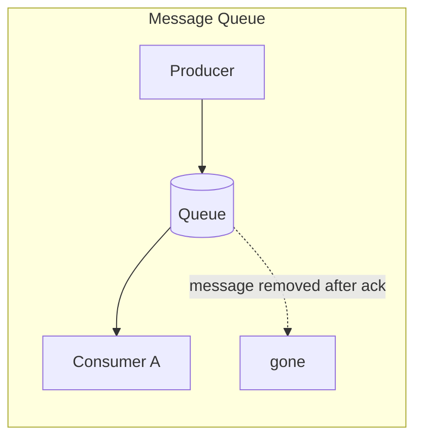
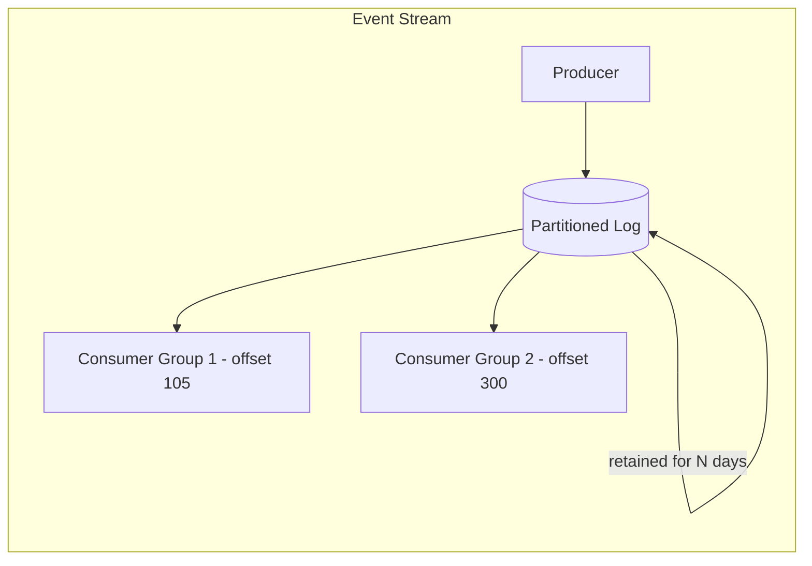
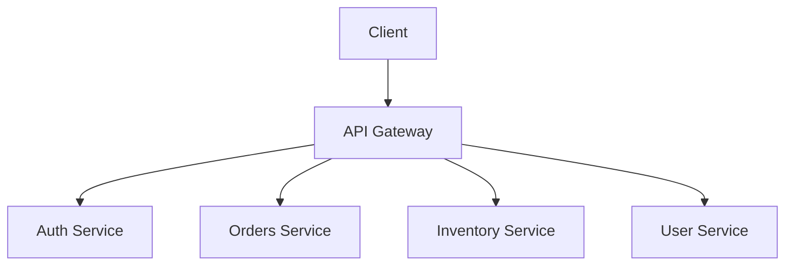
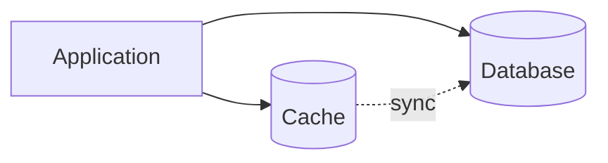
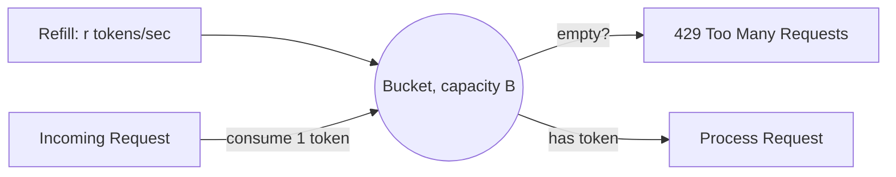

# 01 — Most Tested Core Concepts

---

## 1. Latency vs Throughput Trade-offs

### Definitions
- **Latency** = time to complete a single unit of work (request → response). Measured in ms/µs. What the *user* feels.
- **Throughput** = number of units of work completed per unit time (RPS, QPS, MB/s). What the *system* delivers in aggregate.

They are related but not the same axis, and optimizing one can hurt the other.

```mermaid
graph LR
    A[Request In] -->|Queue Wait| B[Processing]
    B -->|Network| C[Response Out]
    subgraph Latency = A to C for ONE request
    end
    subgraph Throughput = count of A to C completions per second, across ALL requests
    end
```

### Why they fight each other
- **Batching** improves throughput (amortize fixed costs — DB round trips, network frames, GC pauses) but *increases* latency for the first item in the batch, since it waits for the batch to fill.
- **Increasing concurrency** improves throughput up to a point (more work in flight), but past the saturation point, queueing delay explodes latency (see Little's Law below).
- **Adding a cache** improves both — fewer round trips (lower latency) and less backend load (higher throughput headroom). This is why caching is the highest-leverage lever in most systems.

### Little's Law (the math interviewers love)
```
L = λ × W
```
- L = average number of requests in the system (concurrency)
- λ = arrival rate (throughput, requests/sec)
- W = average time a request spends in the system (latency)

**Practical use**: if your service handles 1000 RPS (λ) and average latency (W) is 50ms (0.05s), you need `L = 1000 × 0.05 = 50` concurrent in-flight requests handled at any time — this tells you your thread pool / connection pool sizing.

### The latency cliff
As utilization (ρ = λ/μ, arrival rate / service rate) approaches 1 (100% utilization), queueing delay grows **non-linearly**, not linearly. Using an M/M/1 queue approximation:

```
Wait time ∝ ρ / (1 - ρ)
```

| Utilization | Relative Wait Time |
|---|---|
| 50% | 1x |
| 70% | 2.3x |
| 80% | 4x |
| 90% | 9x |
| 95% | 19x |
| 99% | 99x |

**Takeaway for interviews**: never design a system to run at >70-80% sustained utilization. Always leave headroom, because tail latency (p99) blows up long before you hit 100% CPU.

### Strategies
| Goal | Techniques |
|---|---|
| Reduce latency | Caching, CDNs, connection pooling, colocate services, async I/O, reduce hops, precompute, edge compute |
| Increase throughput | Horizontal scaling, batching, pipelining, load balancing, sharding, async/queue-based processing |
| Balance both | Backpressure, admission control, adaptive batching (e.g., Nagle's algorithm tuning), autoscaling on utilization |

### Interview example
"Design a payment API that must respond in <200ms p99 while handling 50k RPS."
- Compute concurrency via Little's Law → size thread pools/connections accordingly.
- Keep synchronous path minimal (validate + write to durable queue), push slow work (notifications, ledger reconciliation) to async pipeline — this decouples user-facing latency from backend throughput needs.
- Set SLOs on p50/p95/p99 separately — p99 is dominated by tail effects (GC pauses, slow disks, network retries), and averages hide them.

### Common pitfall
Reporting only average latency. Always talk p50/p95/p99/p99.9 in interviews — a system with great average latency can still have terrible tail latency due to resource contention, GC, or a few slow shards (the "tail at scale" problem — Dean & Barroso).

---

## 2. Database Indexing Strategies

### What an index is
A separate, ordered data structure that maps column value(s) → row location, trading **write cost + storage** for **read speed**. Without an index, every query is a full table scan: O(n).

```mermaid
graph TD
    Q[Query: WHERE user_id = 42] --> I[B-Tree Index on user_id]
    I -->|O(log n) lookup| P[Pointer to row on disk]
    P --> R[Row fetched]
```

### Common index types

| Type | Structure | Best for | Weak for |
|---|---|---|---|
| **B-Tree / B+Tree** | Balanced tree, sorted | Range queries, equality, ORDER BY | High-cardinality write-heavy random inserts (page splits) |
| **Hash Index** | Hash(key) → bucket | Exact-match equality only | Range queries impossible |
| **LSM Tree** | Sorted memtable + on-disk sorted runs, compacted | Write-heavy workloads (Cassandra, RocksDB, LevelDB) | Read amplification (must check multiple levels) |
| **Bitmap Index** | Bit per distinct value | Low-cardinality columns (gender, status) in analytics/OLAP | Bad for high-cardinality or OLTP writes |
| **Inverted Index** | term → list of doc IDs | Full-text search (Elasticsearch, Lucene) | Not for range/numeric queries |
| **Geospatial (R-Tree, Geohash)** | Bounding boxes / space-filling curves | "find nearby" queries | Complex to maintain, approximate |

### B-Tree vs LSM Tree — the classic trade-off asked in every interview

| Aspect | B-Tree (Postgres, MySQL InnoDB) | LSM Tree (Cassandra, RocksDB) |
|---|---|---|
| Writes | In-place update, random I/O | Append-only, sequential I/O — much faster |
| Reads | Single lookup, predictable | May need to check memtable + multiple SSTables (read amplification) |
| Compaction | Not needed | Background compaction required (CPU/I/O overhead, can cause latency spikes) |
| Space amplification | Lower | Higher (until compacted) |
| Good for | Read-heavy, OLTP | Write-heavy, time-series, logs |

### Composite / covering indexes
- **Composite index** `(user_id, created_at)`: usable for queries filtering on `user_id` alone, or `user_id + created_at` together, but **not** `created_at` alone (leftmost prefix rule).
- **Covering index**: index contains all columns the query needs, so the DB never touches the actual table (index-only scan) — big latency win.

### Trade-offs of indexing
- Every index **slows down writes** (INSERT/UPDATE/DELETE must update the index too) and **costs storage**.
- Over-indexing is a real anti-pattern: teams add an index for every query pattern and tank write throughput.
- **Strategy**: index based on actual query patterns (use `EXPLAIN ANALYZE`), prefer composite indexes over many single-column indexes, drop unused indexes.

### Example
A `users` table with 100M rows, query `SELECT * FROM users WHERE email = ?`:
- No index: full scan, O(n) — could be seconds.
- B-Tree unique index on `email`: O(log n) ≈ 27 comparisons — sub-millisecond.

### Interview talking points
- Mention **index selectivity** (how many rows on average per index value) — low selectivity (e.g., boolean flag) often isn't worth indexing since the optimizer may prefer a full scan anyway.
- Mention that indexes must be considered per-shard in distributed DBs — a global secondary index is expensive to maintain consistently (see DynamoDB GSIs — eventually consistent by default).

---

## 3. Message Queues vs Event Streams

### Core distinction
| | Message Queue (SQS, RabbitMQ) | Event Stream (Kafka, Kinesis) |
|---|---|---|
| Consumption model | Message is **removed/ack'd** after consumption (competing consumers) | Message is **retained** on a log for a configurable period; consumers track their own offset |
| Multiple consumers | Each message goes to **one** consumer (unless fan-out via topics) | **Many** consumer groups can independently replay the same stream |
| Ordering | Often best-effort or per-queue; FIFO queues exist but limit throughput | Strict ordering **within a partition** |
| Replay | Not possible once consumed (mostly) | Fully replayable — reset offset and reprocess |
| Use case | Task/job distribution, decoupling producer-consumer, work queues | Event sourcing, analytics pipelines, multi-team pub-sub, audit logs |
| Backpressure model | Queue depth grows; consumers pull at their pace | Retention window (time or size based); slow consumers just fall further behind their offset |





### When to use which
- **Use a queue** when you want work distributed exactly once (or at-least-once) among workers, e.g., "process this image," "send this email" — classic task queue.
- **Use a stream** when multiple independent systems need the *same* event (order-service, analytics, fraud-detection all consume "OrderPlaced"), or you need replay/audit/event-sourcing.

### Delivery guarantees
| Guarantee | Meaning | Cost |
|---|---|---|
| At-most-once | May lose messages, never duplicate | Fastest, no retry |
| At-least-once | Never lose, may duplicate | Requires idempotent consumers |
| Exactly-once | Never lose, never duplicate | Hardest — needs transactional writes / idempotency keys + dedup, e.g., Kafka's idempotent producer + transactional API |

**Practical strategy**: design for at-least-once + idempotent consumers (dedup by message ID) — true exactly-once end-to-end is very costly and rarely needed.

### Partitioning in streams
Kafka partitions a topic; ordering is guaranteed only *within* a partition. Choosing a partition key (e.g., `user_id`) determines both ordering guarantees and load distribution — a bad key (e.g., constant value) creates a **hot partition** (see reliability section).

### Trade-offs summary
- Queues: simpler mental model, easier backpressure, but no replay, weaker fan-out.
- Streams: powerful (replay, multi-consumer, ordering), but heavier operationally (partition management, consumer group rebalancing, storage cost for retention).

---

## 4. API Gateway Responsibilities

An API Gateway is the single entry point that sits between clients and backend microservices.



### Core responsibilities
1. **Routing** — path/host-based routing to the correct backend service.
2. **Authentication & Authorization** — validate JWT/OAuth tokens centrally so backend services don't each reimplement auth.
3. **Rate limiting & throttling** — protect backends from abuse/overload (see rate limiting section).
4. **Request/response transformation** — protocol translation (REST ↔ gRPC), aggregating multiple backend calls into one client response (Backend-for-Frontend pattern).
5. **TLS termination** — offload SSL/TLS handshake so backend services communicate over plain internal networking.
6. **Caching** — cache idempotent GET responses at the edge.
7. **Observability** — centralized logging, tracing (inject trace IDs), metrics.
8. **Circuit breaking / retries** — protect against cascading failures from a slow downstream service.
9. **Load balancing** — distribute traffic across service instances.
10. **API versioning** — route `/v1/`, `/v2/` to different backend deployments.

### Trade-offs
| Pro | Con |
|---|---|
| Single place for cross-cutting concerns (auth, rate limit, logging) | Single point of failure if not made highly available |
| Simplifies client (one endpoint, one auth flow) | Can become a bottleneck / added latency hop |
| Decouples clients from internal service topology | Risk of becoming a "God object" doing business logic (anti-pattern — keep it thin) |

### Strategy
- Keep the gateway **stateless** and horizontally scalable behind a load balancer.
- Avoid putting business logic in the gateway — it should be plumbing, not domain logic.
- For very large orgs, use a **BFF (Backend-for-Frontend)** layer per client type (mobile BFF, web BFF) in front of/alongside the gateway.

---

## 5. Caching Strategies (Write-Through, Write-Back, Cache-Aside)



### Cache-Aside (Lazy Loading) — most common
- App checks cache first. On **miss**, reads from DB, populates cache, returns.
- Writes go directly to DB; cache entry is invalidated (deleted) or updated.

```
Read:  App -> Cache (miss) -> DB -> App (populates Cache)
Write: App -> DB -> App (invalidate Cache key)
```
- **Pros**: cache only holds what's actually requested (efficient memory use); resilient to cache failures (falls back to DB).
- **Cons**: first request after a miss is slow (cache stampede risk); possible staleness window between DB write and cache invalidation.

### Write-Through
- Every write goes to the cache **and** the cache synchronously writes to the DB before acknowledging.
```
Write: App -> Cache -> DB (synchronous) -> ack to App
```
- **Pros**: cache is always consistent with DB; simplifies reads (cache is always warm for written data).
- **Cons**: write latency = cache write + DB write (slower writes); cache fills with data that may never be read again unless paired with TTL/eviction.

### Write-Back (Write-Behind)
- Write goes to cache only; cache asynchronously flushes to DB later (batched).
```
Write: App -> Cache (ack immediately) -> [async batch flush] -> DB
```
- **Pros**: fastest writes, can batch/coalesce many writes into fewer DB ops (great for high write throughput).
- **Cons**: risk of **data loss** if cache crashes before flush; added complexity for durability (needs WAL or replicated cache).

### Comparison table

| Strategy | Write Latency | Read Latency (after write) | Consistency | Data Loss Risk | Best for |
|---|---|---|---|---|---|
| Cache-Aside | Fast (DB only) | Fast if cached, slow on miss | Eventually consistent (invalidation lag) | Low | General purpose, read-heavy |
| Write-Through | Slower (2 writes) | Fast always | Strong | Low | Consistency-critical, moderate write volume |
| Write-Back | Fastest | Fast | Weak until flush | Higher | Write-heavy, tolerant of eventual durability (e.g., metrics, counters) |

### Eviction policies (needed regardless of strategy)
- **LRU** (Least Recently Used) — most common, good general default.
- **LFU** (Least Frequently Used) — better when access frequency matters more than recency.
- **TTL-based** — simple, predictable staleness bound.
- **Random eviction** — surprisingly effective and cheap (used by Redis as an approximation option).

### Failure modes to mention in interviews
- **Cache stampede / thundering herd**: many requests miss simultaneously (e.g., cache expiry of a hot key) and all hammer the DB. Mitigate with request coalescing (single-flight), staggered TTLs (jitter), or "lock + refresh" pattern.
- **Cache penetration**: repeated queries for keys that don't exist in DB either — cache never helps. Mitigate with a bloom filter or caching "negative" results with short TTL.
- **Cache inconsistency across replicas**: in a distributed cache with multiple app servers, invalidations need to propagate (pub/sub invalidation, or short TTLs as a safety net).

---

## 6. Rate Limiting Algorithms (Token Bucket, Sliding Window, etc.)

### Why rate limit
Protect backend from abuse, ensure fair usage across tenants, enforce pricing tiers, prevent cascading overload.

### Token Bucket
- A bucket holds up to `B` tokens, refilled at rate `r` tokens/sec. Each request consumes 1 token; if empty, request is rejected/queued.
- **Allows bursts** up to bucket size, while enforcing average rate over time.



### Leaky Bucket
- Requests enter a queue (bucket) and are processed ("leak out") at a fixed constant rate, regardless of burstiness of arrival.
- **Smooths out bursts** into a steady output rate — good for protecting downstream systems that can't handle spikes at all.
- Difference from token bucket: token bucket allows bursts through; leaky bucket enforces a strictly constant output rate.

### Fixed Window Counter
- Count requests in fixed time windows (e.g., 12:00:00–12:01:00). Reset counter each window.
- **Simple**, but has a **boundary burst problem**: a client can send max requests at the end of one window and max again at the start of the next, getting 2x the intended rate in a short span.

### Sliding Window Log
- Store timestamp of every request in a sorted set; count requests within the last `N` seconds by removing timestamps older than the window on each check.
- **Accurate**, but memory-expensive at scale (one entry per request).

### Sliding Window Counter (hybrid — most used in practice)
- Combines fixed window counters with weighted interpolation from the previous window to approximate a sliding window without storing every timestamp.
```
estimated_count = current_window_count + previous_window_count × (overlap_fraction)
```
- Good balance of accuracy and memory efficiency — used by Cloudflare, Stripe-style limiters.

### Comparison

| Algorithm | Burst handling | Accuracy | Memory | Complexity |
|---|---|---|---|---|
| Token Bucket | Allows controlled bursts | Good | O(1) per key | Low |
| Leaky Bucket | Smooths to constant rate | Good | O(1) or O(queue) | Low |
| Fixed Window | Vulnerable to boundary bursts | Poor at edges | O(1) per key | Very low |
| Sliding Log | Precise | Exact | O(N) per key (high) | Medium |
| Sliding Window Counter | Good | Approximate but close | O(1) per key | Medium |

### Distributed rate limiting
- Single-node in-memory counters don't work across multiple gateway/app instances.
- Use a **centralized store** like Redis with atomic `INCR` + `EXPIRE`, or Redis Lua scripts for atomicity (token bucket logic executed atomically).
- At very high scale, consider **local + global hybrid**: each node enforces a local approximate limit (e.g., limit/N nodes) to avoid a Redis round-trip on every request, periodically syncing with a global counter.

### Strategy in interviews
- Clarify: per-user? per-IP? per-API-key? per-endpoint? Global vs distributed?
- Mention **HTTP 429** + `Retry-After` header as the client-facing contract.
- Mention rate limiting is typically enforced at the **API Gateway** layer (ties back to topic 4).
