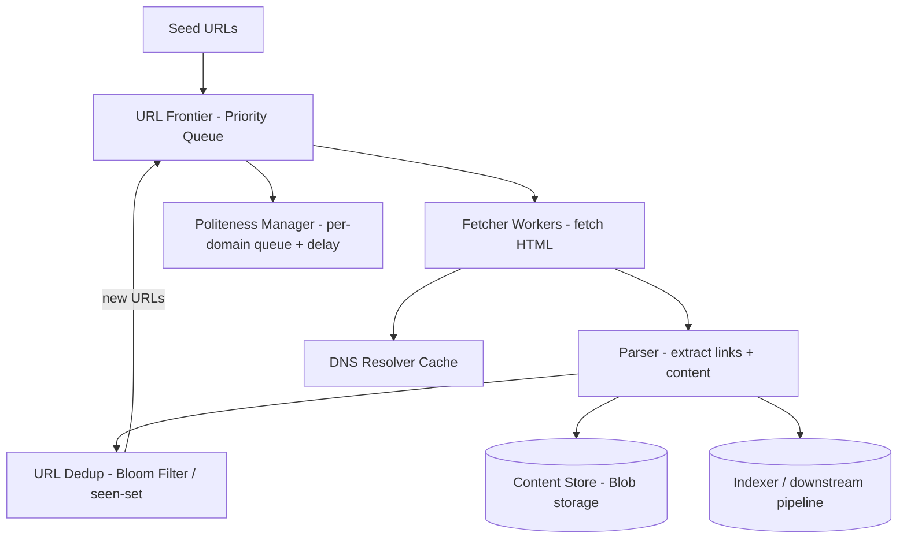
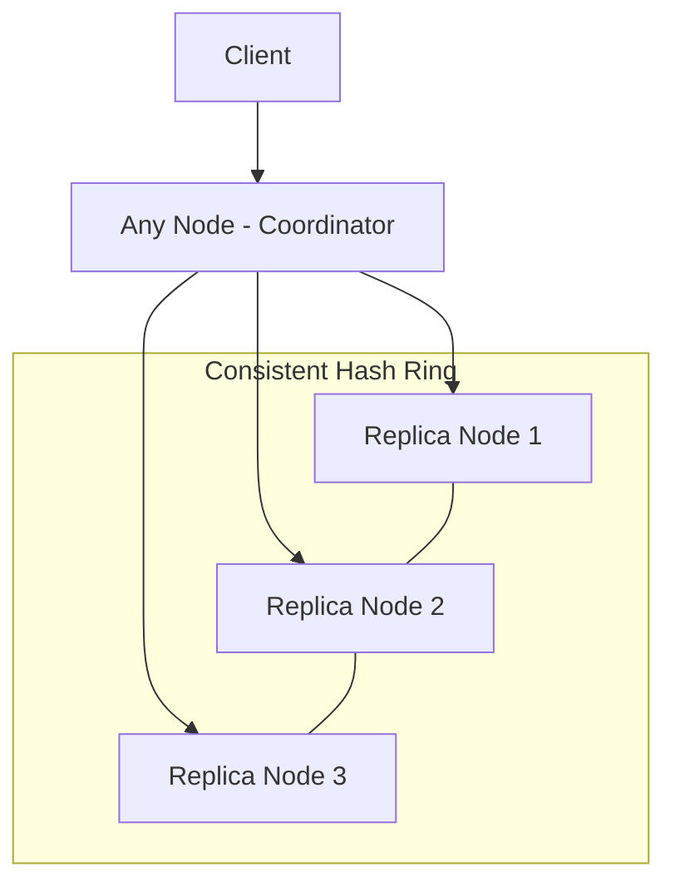
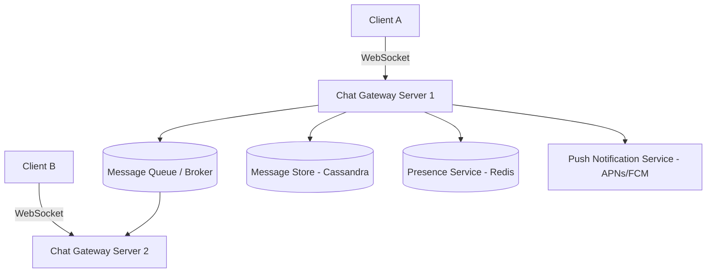
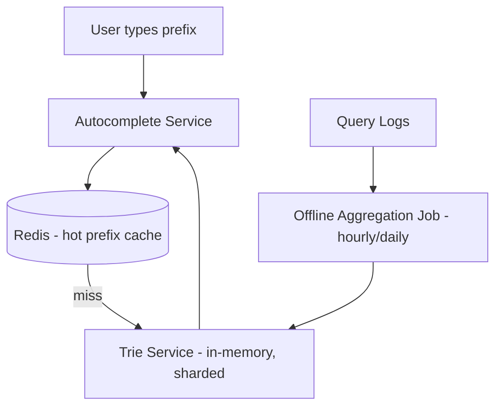
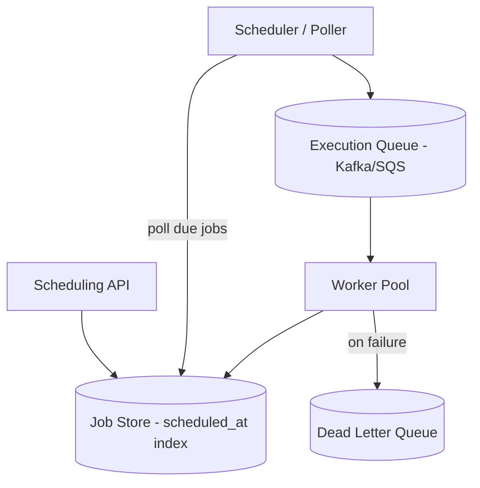
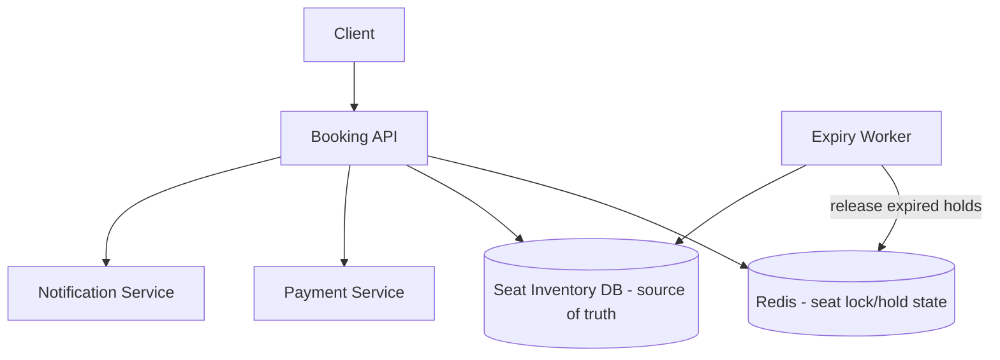

# 02 — Most Asked Classic Design Problems

Each problem follows: **Requirements → Capacity Estimate → High-Level Design → Deep Dive → Trade-offs**

---

## 1. Web Crawler

### Requirements
- Functional: crawl web pages starting from seed URLs, extract links, store content, recrawl periodically.
- Non-functional: scalable (billions of pages), polite (respect robots.txt, rate limit per domain), fault-tolerant, avoid infinite loops/duplicate crawling.

### Capacity estimate
- 1B pages/month → ~400 pages/sec average, likely 10-50x that at peak → design for ~2000-5000 pages/sec sustained.
- Average page ~500KB (with assets) → 1B × 500KB = 500TB/month raw storage.

### High-Level Design

### Deep dive components
1. **URL Frontier**: not a single FIFO — it's a priority queue combining:
   - **Front queues** (priority by page importance / freshness need — PageRank-like score, or update frequency).
   - **Back queues** — one queue per host, to enforce politeness (only 1 fetcher hits a given host at a time, with delay between requests).
   - A **mapping table** routes a URL to its host's back queue.
2. **Politeness**: respect `robots.txt`, enforce crawl-delay, limit concurrent connections per domain to avoid DoS'ing small sites.
3. **Deduplication**: 
   - URL-seen dedup: Bloom filter (probabilistic, memory-efficient) or a distributed hash set (Redis/Cassandra) for billions of URLs.
   - Content-seen dedup: hash page content (SimHash/MinHash for near-duplicate detection) to avoid storing/recrawling mirrors.
4. **DNS resolution**: cache DNS lookups aggressively — DNS resolution is a major crawl bottleneck at scale.
5. **Storage**: raw HTML in blob storage (S3-like), metadata (URL, crawl time, hash, status) in a wide-column store (Cassandra/HBase) keyed by URL.
6. **Recrawl scheduling**: assign refresh frequency based on observed change rate (news sites: hourly; static pages: monthly) — a priority score in the frontier.
7. **Fault tolerance**: checkpoint frontier state; workers are stateless and can be killed/restarted; use a distributed queue (Kafka) so no work is lost.

### Trade-offs
| Decision | Option A | Option B |
|---|---|---|
| URL dedup | Bloom filter (fast, memory-cheap, false positives possible → might skip a few new URLs) | Exact hash set (accurate, but huge memory/storage at billions scale) |
| Crawl strategy | BFS (good coverage, simple) | Priority-based (PageRank/freshness) — better quality but more complex |
| Storage | Centralized blob store | Distributed per-region store (lower latency, complex consistency) |

### Common interview traps
- Forgetting **robots.txt** and politeness — interviewers specifically probe this.
- Not addressing **infinite crawl traps** (calendar pages generating infinite URLs) — mitigate with max depth, max URLs per domain, URL pattern heuristics.

---

## 2. Key-Value Store (Dynamo-style)

### Requirements
- `put(key, value)`, `get(key)`. High availability, low latency, horizontal scalability, tunable consistency.

### High-Level Design

### Core building blocks
1. **Consistent hashing** to distribute keys across nodes, with **virtual nodes** to smooth load distribution and simplify rebalancing when nodes join/leave.
2. **Replication**: each key replicated to N nodes (successors on the ring). Tunable **quorum**: `W + R > N` guarantees strong consistency on read-after-write.
   - Example: N=3, W=2, R=2 → every read overlaps with the latest write's replica set.
3. **Versioning & conflict resolution**: vector clocks (or simpler last-write-wins with timestamps) to handle concurrent writes during network partitions; resolve conflicts at read time (return multiple versions, let client merge) or automatically (LWW).
4. **Handling failures**: 
   - **Sloppy quorum + hinted handoff**: if a target replica is down, write to the next healthy node with a "hint" to forward once the original recovers — favors availability over strict consistency.
   - **Anti-entropy**: Merkle trees to efficiently compare and sync replicas that drifted out of sync.
5. **Gossip protocol** for membership/failure detection (nodes periodically exchange state with random peers — no central coordinator, so no single point of failure).

### CAP trade-off (core of this design)
- Dynamo-style stores choose **AP** (available, partition-tolerant) over strict consistency — this is the textbook AP system, contrasted with something like a single-leader relational DB which favors **CP**.

### Trade-offs table
| Choice | Effect |
|---|---|
| Higher N (replication factor) | Better durability/availability, more storage cost, slower writes (more replicas to reach) |
| Higher W (write quorum) | Stronger consistency, slower/less available writes |
| Higher R (read quorum) | Stronger consistency, slower reads |
| Vector clocks | Accurate conflict detection, but clock size grows with number of writers; needs pruning |

### Interview example
"Design a KV store like DynamoDB for a shopping cart." → AP model is fine (LWW or client-side merge for cart items) since availability during checkout matters more than perfect consistency, and conflicts (two devices adding items) are mergeable.

---

## 3. Chat Application (WhatsApp-like)

### Requirements
- 1:1 and group messaging, online presence, message delivery status (sent/delivered/read), offline message delivery, media sharing, end-to-end encryption (mention, not deep-dive unless asked).

### Capacity estimate
- 500M DAU, avg 40 messages/day → 20B messages/day ≈ 230K messages/sec average, ~1M/sec peak.

### High-Level Design

### Deep dive
1. **Connection layer**: persistent **WebSocket** (or long-polling fallback) connections held by stateful **Chat Gateway** servers. Since connections are stateful, need a **session registry** (Redis: `user_id → gateway_server_id`) so any server knows where to route a message for an online user.
2. **Message flow (1:1)**:
   - Client A sends message to its Gateway server.
   - Gateway looks up B's location via session registry.
   - If B is online on a different gateway, forward via internal pub/sub (Kafka/Redis pub-sub) to B's gateway, which pushes over B's WebSocket.
   - If B is offline, persist to message store + trigger push notification (APNs/FCM); deliver on reconnect.
   - Message persisted to a durable store (Cassandra, partitioned by `conversation_id`) regardless, for history sync across devices.
3. **Group chat**: fan-out on write — write message once, fan out delivery to N members' gateways/queues. For very large groups (like broadcast channels), fan-out-on-read is more efficient (store once, each member pulls on demand) — trade-off between write amplification and read latency.
4. **Message ordering**: per-conversation sequence number (monotonic) assigned by a single writer/coordinator per conversation, or client-side Lamport-clock-like causal ordering, to keep messages consistently ordered across devices.
5. **Delivery status (sent/delivered/read)**: separate lightweight events; ACKs sent back from recipient's client, aggregated and shown to sender.
6. **Multi-device sync**: message store keyed by conversation; each device tracks its own "last synced" cursor/offset — similar to how an event stream consumer tracks offsets.

### Trade-offs
| Aspect | Choice | Trade-off |
|---|---|---|
| Transport | WebSocket vs long polling | WebSocket = lower latency, higher server-side connection cost (millions of open sockets) |
| Group fan-out | Write-fanout vs read-fanout | Write-fanout = fast reads, expensive for huge groups; read-fanout = cheap writes, more complex reads |
| Storage | Cassandra/wide-column | Great for time-ordered writes per conversation_id partition; watch for hot partitions on very active groups |
| Presence | Redis with TTL heartbeats | Cheap, approximate (slightly stale online/offline status is acceptable) |

### Common interview follow-ups
- "What if a user has 5 devices?" → session registry maps user → set of (device, gateway) pairs; fan out to all.
- "How do you handle a gateway server crash?" → client reconnects (with backoff), re-registers session; undelivered messages already persisted are redelivered from store on reconnect using the client's last-seen cursor.

---

## 4. Autocomplete / Typeahead System

### Requirements
- Given a prefix, return top-K most relevant completions in <100ms, updated with trending/recent queries.

### High-Level Design

### Core data structure: Trie with top-K annotations
- Each trie node stores the **top-K most frequent completions** for that prefix (precomputed), not just child pointers — this avoids traversing the whole subtree at query time.
- Building: aggregate query logs (batch job, e.g., Spark) → compute frequency counts → build trie offline → push new trie snapshot to serving nodes periodically (e.g., every few hours).

### Handling scale
1. **Sharding the trie**: shard by first 1-2 characters (26 or 26×26 shards) since traversal is prefix-driven — routes naturally.
2. **Caching**: cache popular prefixes (e.g., "how to", "best") in Redis in front of the trie service — highly skewed access pattern (Zipfian), so cache hit rate is very high for a small set of hot prefixes.
3. **Real-time trending**: can't wait for the hourly batch job for breaking news queries — maintain a separate **real-time counter** (Count-Min Sketch or sliding-window counters in a stream processor) for the last N minutes, merged with the base trie scores at query time (weighted blend of "historical popularity" + "recent spike").
4. **Personalization** (if in scope): blend global top-K with user's own recent search history client-side or via a lightweight per-user cache.

### Trade-offs
| Decision | Trade-off |
|---|---|
| Precomputed top-K per node vs on-the-fly traversal | Precompute = fast reads, more storage + rebuild cost; on-the-fly = fresh but slow at scale |
| Batch rebuild frequency | Faster rebuild = fresher suggestions, more compute cost |
| Trie in memory | Fast, but must fit in RAM — for huge vocabularies, shard across many machines |

### Numbers to mention
- If trie must serve <100ms and sits behind a cache with ~80% hit rate, backend trie service just needs to handle the remaining 20% — sizing calculation interviewers like to see (relates back to Latency/Throughput topic).

---

## 5. Job Scheduler

### Requirements
- Schedule jobs to run at a specific time or on a recurring cron-like schedule, at scale (millions of jobs), with retries, priorities, and exactly-once (or at-least-once) execution semantics.

### High-Level Design

### Deep dive
1. **Job storage**: durable store (relational or wide-column) with an index on `scheduled_at` / `status` for efficient "find jobs due now" queries.
2. **Time-based partitioning**: bucket jobs into time-window shards (e.g., "jobs due in the next minute" go into a specific partition) so the scanner doesn't scan the entire table — similar to a **hashed timing wheel** (used internally by Kafka's delay queues, Netflix's scheduler).
3. **Timing wheel** data structure: a circular buffer of time buckets; a job is placed in the bucket for its due time; a background thread advances the wheel and dispatches jobs whose bucket has arrived. O(1) insertion/removal, very efficient for millions of timers.
4. **Distributed locking / leader election**: multiple scheduler instances must not double-dispatch the same job — use a distributed lock (Zookeeper/etcd) or a claim pattern (`UPDATE job SET status='claimed', worker_id=? WHERE id=? AND status='pending'` — optimistic concurrency via conditional update).
5. **Execution**: dispatch job to an execution queue; workers pull and execute; on success mark complete, on failure apply retry policy (exponential backoff) up to max retries, then move to **Dead Letter Queue** (see reliability section).
6. **Recurring jobs (cron)**: store the cron expression; after each execution, compute and enqueue the next occurrence (rather than pre-materializing infinite future runs).
7. **Idempotency**: workers should be idempotent (dedup key = job_id + scheduled_time) since at-least-once delivery from the queue can cause duplicate execution.

### Trade-offs
| Decision | Option A | Option B |
|---|---|---|
| Delivery guarantee | At-least-once + idempotent workers (simpler, recommended) | Exactly-once (complex distributed transactions) |
| Job discovery | Polling DB (simple, adds DB load) | Push via timing wheel / delay queue (more scalable, more moving parts) |
| Scale-out | Shard job store by job_id hash or by time bucket | Time-bucket sharding aligns naturally with "what's due now" queries |

### Numbers
- Millions of jobs/day, most due within seconds of schedule → polling interval + timing wheel granularity determines scheduling precision (e.g., 1-second wheel granularity for ~1s precision).

---

## 6. Ticket Booking System (BookMyShow-like)

### Requirements
- Browse events/shows, view seat map, book seats without double-booking, handle high-concurrency "flash sale" scenarios (popular movie/concert releases), payment integration, booking expiry (hold seat for N minutes during checkout).

### Capacity estimate
- Popular event: 50K users hitting "book" for 500 seats within seconds → massive contention on a small hot resource set (classic hot-key problem).

### High-Level Design

### Deep dive — the core hard problem: preventing double booking under high concurrency
1. **Seat locking / hold pattern**: when a user selects seats, place a **temporary hold** (TTL ~5-10 min) rather than immediately confirming:
   - `SET seat:{id} = held:{user_id} NX EX 600` in Redis — atomic conditional set prevents two users from holding the same seat.
   - On payment success: convert hold → confirmed booking (DB transaction), release Redis key.
   - On payment failure/timeout: Redis TTL auto-expires the hold, seat becomes available again — no separate cleanup job strictly needed, though a reconciliation worker is good practice for cache/DB drift.
2. **Source of truth**: relational DB with a **unique constraint** on `(show_id, seat_id)` in a `bookings` table as the final guard — even if the Redis lock layer has a bug, the DB constraint prevents actual double-booking at commit time (defense in depth).
3. **Optimistic vs pessimistic locking**: pessimistic (`SELECT ... FOR UPDATE`) is simpler to reason about for seat rows but risks lock contention/deadlocks under a flash-sale spike; optimistic locking (version column, retry on conflict) scales better under contention but requires client-side retry logic.
4. **Handling the "thundering herd" at sale-start**: 
   - Virtual **waiting room / queueing system** in front of the booking flow — admits users at a controlled rate (token-based, similar to rate limiting) so the backend isn't hit by 50K simultaneous requests.
   - Read-heavy seat map view served from cache (near-real-time, slightly stale is OK); only the actual "hold" action needs strict consistency.
5. **Idempotency for payment**: booking confirmation must be idempotent (idempotency key per booking attempt) since payment gateways may retry/webhook duplicate events.

### Trade-offs
| Decision | Option A | Option B |
|---|---|---|
| Lock granularity | Per-seat locks (fine-grained, more contention-safe) | Per-show lock (simpler, but serializes all bookings for a show — bad for popular shows) |
| Hold mechanism | Redis with TTL (fast, needs reconciliation) | DB row with `expires_at` + polling cleanup (simpler consistency, slower) |
| Flash-sale mitigation | Virtual waiting room (adds UX friction) | No queueing, rely on autoscaling + rate limiting (risk of overload) |

### Interview highlight
This problem is really about **hot-key contention + preventing double-write on a scarce resource** — expect deep follow-ups on "what if the Redis node holding the lock goes down mid-transaction" (answer: use Redis with replication + the DB unique constraint as the ultimate correctness guarantee, since cache is an optimization, not the system of record).
