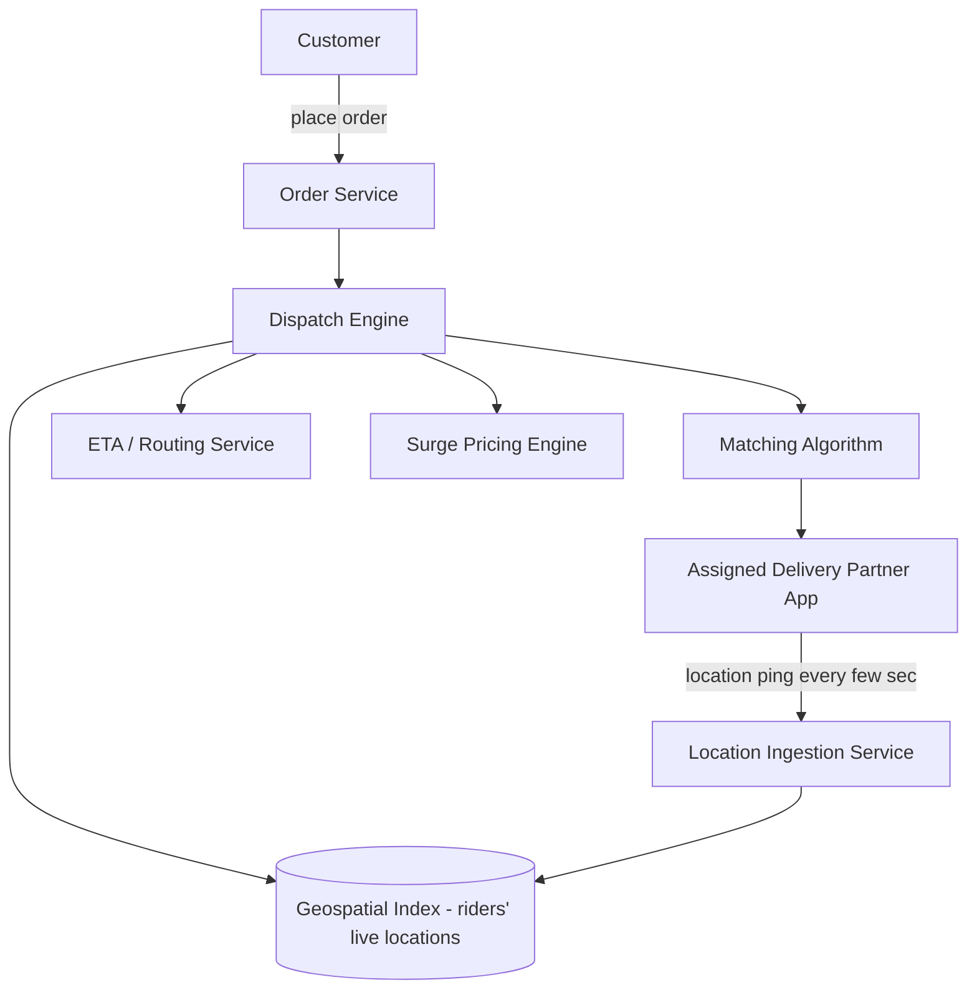
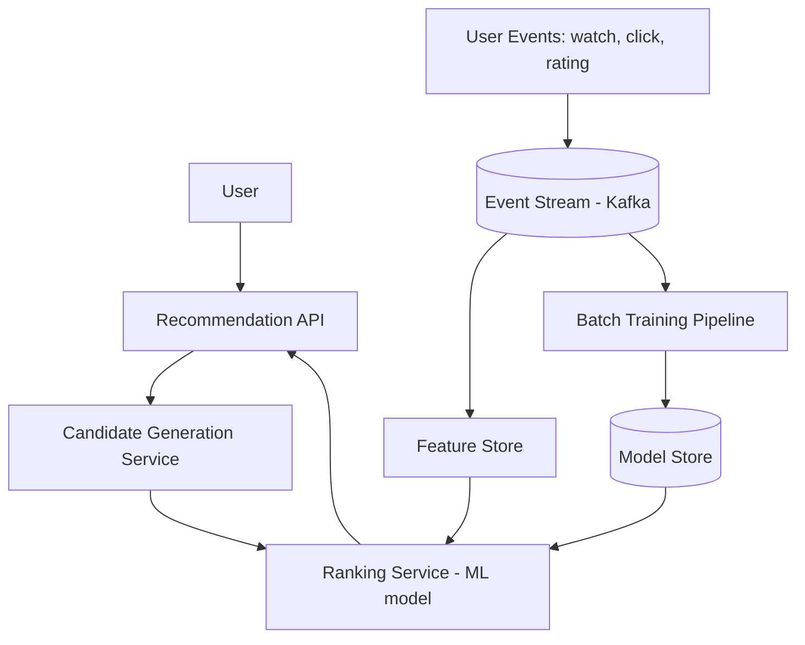
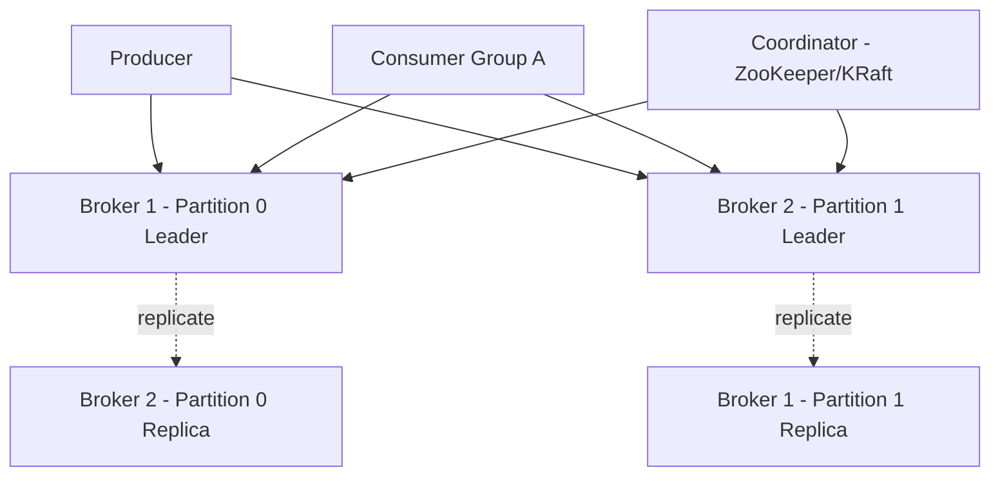
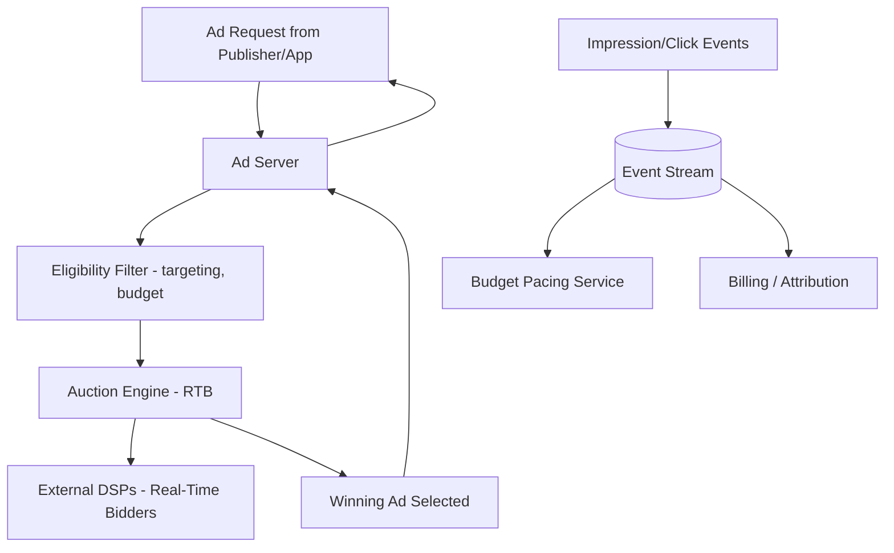
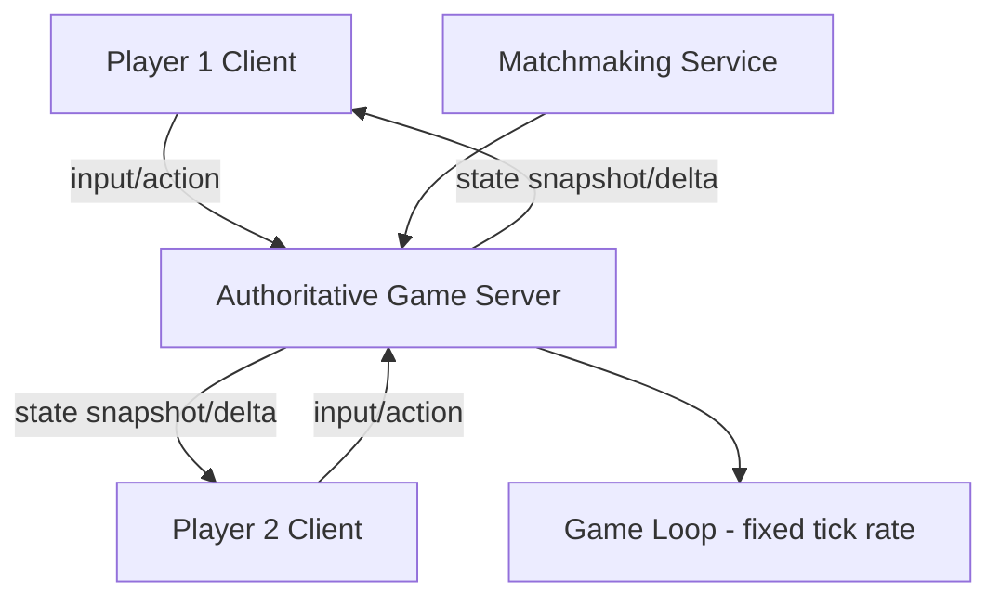

# 03 — Most Tested Advanced Design Problems

---

## 1. Food Delivery Dispatch System (Swiggy/Zomato-like)

### Requirements
- Match orders to delivery partners in real time, minimize delivery time, handle live location tracking, dynamic ETAs, surge pricing during high demand.

### High-Level Design

### Deep dive

1. **Geospatial indexing of riders**: real-time location of thousands of riders per city needs efficient "find nearby riders" queries.
   - **Geohashing**: encode lat/lng into a string where prefix similarity implies spatial proximity — allows range queries via prefix match, easy to shard/index in Redis (`GEOADD`/`GEORADIUS`) or a standard KV store.
   - **Quad-tree / S2 cells**: hierarchical spatial partitioning, good for variable-density areas (dense in cities, sparse outside) — Uber's H3 hexagonal grid is the industry-standard evolution of this idea for movement-based systems.
2. **Matching algorithm**: not just "nearest rider" — needs to jointly optimize across:
   - Rider proximity to restaurant, rider's current load (are they already carrying an order that's on the way?), restaurant prep-time estimate, minimizing overall fleet idle time.
   - Real systems use **batch matching**: instead of matching each order the instant it arrives, batch orders arriving in a short window (e.g., 1-2 sec) and solve a **bipartite matching / assignment problem** (Hungarian algorithm variants, or simpler greedy heuristics at scale) — this produces better global efficiency than greedy first-come-first-served matching.
3. **ETA prediction**: combines road-network routing (shortest path / historical traffic-weighted graph) with ML models trained on historical delivery times — not just straight-line distance.
4. **Location updates at scale**: millions of GPS pings/sec across all active riders.
   - Ingest via a stream (Kafka), partitioned by geographic region/city, consumed by a service that updates the geospatial index (Redis GEO or a custom in-memory grid) — write-heavy path, favor eventual consistency (a few seconds of staleness in rider position is fine).
5. **Surge pricing**: compute demand/supply ratio per geo-cell in near-real-time (stream aggregation over a sliding window) and apply a pricing multiplier — feeds back into both customer pricing and rider incentive to move toward high-demand zones.
6. **Order state machine**: `placed → accepted → preparing → picked_up → delivering → delivered` with each transition triggering notifications; state stored durably (DB) with a cache layer for the current-state hot path (live tracking screen polls/subscribes to this).

### Trade-offs

| Decision | Option A | Option B |
|---|---|---|
| Matching | Greedy nearest-rider (simple, fast, suboptimal globally) | Batched bipartite matching (better global efficiency, added latency of ~1-2s per batch window) |
| Location index | Redis GEO (simple, single point unless clustered) | Custom sharded grid service (more scalable, more engineering) |
| Consistency of rider location | Eventually consistent (few sec lag acceptable) | N/A — strong consistency not worth the cost here |

### Interview highlight
This problem tests **geospatial systems + real-time stream processing + optimization under constraints** — a strong answer explicitly says "greedy matching is simple but suboptimal; here's how batching + assignment-problem solving improves fleet efficiency," which shows depth beyond CRUD system design.

---

## 2. Video Recommendation Engine (Netflix-like)

### Requirements
- Personalized recommendations for millions of users from a catalog of thousands-to-millions of videos, low latency (<200ms) for homepage rendering, freshness (adapt to recent watches), support A/B testing of ranking models.

### High-Level Design

### Two-stage architecture: Candidate Generation → Ranking
This is the standard industry pattern (used by YouTube, Netflix) because scoring the *entire catalog* with a heavy ML model per user is too slow.

1. **Candidate Generation** (cheap, high-recall, narrows millions → hundreds):
   - **Collaborative filtering**: matrix factorization (users × items latent embeddings) — "users who liked X also liked Y."
   - **Content-based**: embeddings of video metadata/genre/cast similarity.
   - **Multiple candidate sources merged**: trending now, because-you-watched-X, genre-based, continue-watching — each is its own lightweight retrieval, unioned together.
   - Implemented via **Approximate Nearest Neighbor (ANN)** search (e.g., FAISS, HNSW) over embedding vectors for fast similarity retrieval at scale.
2. **Ranking** (expensive, high-precision, orders hundreds → top-20 shown):
   - A more expensive ML model (gradient-boosted trees or deep learning) scores each candidate using rich features: user history, time of day, device, recency, diversity constraints.
   - Runs on a much smaller candidate set, so the heavier model is affordable per-request.

### Deep dive
1. **Feature store**: precomputed user/item features (recent watch history, embeddings, aggregated stats) served with low latency — often a KV store (Redis/Cassandra) updated both by streaming events (near-real-time features) and batch jobs (heavier aggregates like "genre affinity over 90 days").
2. **Offline vs online computation split**:
   - Offline (batch, nightly/hourly): train embeddings, retrain ranking models, compute expensive aggregates.
   - Online (real-time, per-request): candidate retrieval + ranking inference using precomputed features — must be fast, so heavy compute is pushed offline wherever possible.
3. **Cold start problem**: new users (no history) or new videos (no watch data) — mitigated via content-based features (metadata) for new items, and popularity/demographic-based defaults for new users, until enough signal accumulates.
4. **Diversity & exploration**: pure exploitation of the ranking model leads to filter bubbles / repetitive recommendations — inject exploration (small % of slots for less-certain but potentially relevant content) and diversity re-ranking (avoid showing 10 videos from the same genre back-to-back).
5. **A/B testing infra**: recommendation systems evolve constantly — need a way to route a % of users to a new candidate/ranking model and measure engagement lift, with careful attention to interaction effects between simultaneous experiments.
6. **Caching**: homepage recommendations can be precomputed and cached per-user for some TTL (minutes), refreshed on major events (finished watching something) rather than recomputed on every page load — big latency/cost win.

### Trade-offs
| Decision | Trade-off |
|---|---|
| Two-stage (candidate + ranking) vs single-stage scoring | Two-stage = scalable but adds complexity and potential recall loss if candidate gen misses good items; single-stage = simpler but too slow at catalog scale |
| Real-time feature updates vs batch-only | Real-time = fresher recs (reacts to what you just watched), higher infra cost (streaming pipeline) |
| Precomputed vs on-demand recommendations | Precomputed = fast page loads, staler; on-demand = fresh, higher latency/compute per request |

---

## 3. Distributed Job Queue (Kafka-like system, i.e., designing a Kafka)

### Requirements
- High-throughput, durable, ordered (per-partition) publish-subscribe log; horizontal scalability; replayability; fault tolerance.

### High-Level Design

### Deep dive
1. **Topic partitioning**: a topic is split into partitions; each partition is an **append-only log** stored on disk (sequential writes — very fast, exploits OS page cache and disk sequential I/O). Producers choose a partition via a key hash (`hash(key) % num_partitions`) or round-robin.
2. **Ordering guarantee**: strict ordering only **within a partition**. Choosing the partition key is a critical design decision — a good key (e.g., `user_id`) spreads load while preserving per-entity ordering; a bad key (constant, or low-cardinality) creates hot partitions.
3. **Replication**: each partition has a **leader** and N-1 **followers** (replicas) on different brokers. All writes/reads go through the leader; followers replicate asynchronously (or with configurable acknowledgment: `acks=all` waits for all in-sync replicas, `acks=1` only the leader — a durability vs latency trade-off).
4. **In-Sync Replica (ISR) set**: only replicas that are caught up with the leader are eligible to be promoted if the leader fails — protects against data loss from promoting a stale replica.
5. **Leader election**: when a broker holding a partition leader fails, the coordinator (ZooKeeper historically, or Kafka's own **KRaft/Raft-based** consensus in modern versions) elects a new leader from the ISR set.
6. **Consumer groups & offsets**: each consumer group tracks its own offset per partition (stored in an internal compacted topic `__consumer_offsets`), enabling independent, replayable consumption per group — this is what differentiates a stream from a traditional queue (see Core Concepts topic 3).
7. **Log retention & compaction**: 
   - Time/size-based retention (delete segments older than N days).
   - **Log compaction**: retains only the latest value per key indefinitely (useful for "current state" topics like `__consumer_offsets` or a changelog topic feeding a KV store).
8. **Durability tuning**: `min.insync.replicas` + `acks=all` gives strong durability (write only succeeds if replicated to a quorum) at the cost of write latency — classic latency/durability trade-off.
9. **Zero-copy transfer**: brokers use OS-level `sendfile()` to transfer data from disk to network socket without copying through user space — key to Kafka's high throughput.

### Trade-offs
| Decision | Option A | Option B |
|---|---|---|
| `acks` setting | `acks=all` — durable, slower | `acks=1` or `acks=0` — fast, risk of data loss on leader failure |
| Partition count | More partitions = more parallelism, more consumer throughput | Too many partitions = more overhead (open file handles, replication traffic, longer leader election) |
| Consensus | ZooKeeper (external dependency, battle-tested) | KRaft (built-in Raft, removes external dependency, simpler ops) |

### Interview highlight
Strong answers connect this back to **Message Queues vs Event Streams** (Core Concepts #3) and explain *why* sequential disk I/O + partitioning + zero-copy is what makes this architecture achieve both high throughput and durability simultaneously — most candidates just say "it's a distributed log" without explaining the mechanics.

---

## 4. Ad Serving and Bidding System

### Requirements
- Serve the most relevant/valuable ad within a strict latency budget (often <100ms total, and real-time bidding auctions must complete in ~10-50ms), handle real-time auctions among advertisers, track budgets/pacing, prevent fraud.

### High-Level Design

### Deep dive
1. **Real-Time Bidding (RTB) auction**: on each ad request, the ad exchange sends a bid request to multiple DSPs (Demand-Side Platforms), each responds with a bid within a tight SLA (~50-100ms round trip including network), and the highest bidder (often via a **second-price auction** — winner pays the second-highest bid + $0.01, which incentivizes truthful bidding) wins the slot.
2. **Latency budget decomposition**: total budget (~100ms) split across: eligibility filtering (~10ms), fanning out to bidders in parallel with a hard timeout (~50ms, treat non-responses as "no bid"), auction resolution (~5ms), ad creative selection/rendering trigger. Parallel fan-out with timeouts is essential — a single slow bidder can't be allowed to block the whole auction (ties to Latency vs Throughput and circuit breaking concepts).
3. **Eligibility/targeting filter**: before auction, filter the massive advertiser pool down to eligible candidates using indexed targeting criteria (geo, demographics, device, contextual keywords) — often implemented as an inverted index (advertiser criteria → matching users/contexts), similar in spirit to search engine retrieval.
4. **Budget pacing**: advertisers set daily/campaign budgets; the system must **pace** spend evenly across the day rather than exhausting budget in the first hour (which would bias delivery toward early-day audiences). Implemented via a probabilistic throttle recalculated from a real-time spend-rate stream (e.g., "if spend rate is 20% ahead of pace, reduce this campaign's participation probability in auctions").
5. **Frequency capping & fraud detection**: track impressions per user per campaign (approximate counters, e.g., Count-Min Sketch or Redis) to cap ad repetition; fraud detection (bot traffic filtering) runs both synchronously (basic heuristics) and asynchronously (heavier ML-based scoring feeding a blocklist).
6. **Attribution & billing**: click/impression events streamed and joined (often within a time window) to determine billable events and conversion attribution — usually an async, eventually-consistent pipeline since exact real-time billing precision isn't required, but must be accurate and auditable (often uses exactly-once semantics via idempotent event IDs).

### Trade-offs
| Decision | Option A | Option B |
|---|---|---|
| Bidder timeout handling | Strict timeout, drop late bids (protects latency SLA) | Wait longer for more bids (better fill rate/revenue, worse latency) |
| Auction type | First-price (advertiser pays exact bid) | Second-price (encourages honest bidding, historically more common though industry has shifted) |
| Budget pacing | Even pacing (smooth spend) | Front-loaded pacing (maximize early impressions, risk uneven audience) |

### Interview highlight
This is fundamentally a **hard real-time-constraint fan-out + auction + rate-limited spend system** — good answers emphasize the *strict, non-negotiable latency budget* (unlike most systems where "a bit slower" is tolerable, a late bid here is simply discarded) and how parallel calls with timeouts + graceful degradation ("no bid = pass") keep the system responsive.

---

## 5. Multiplayer Game State Sync

### Requirements
- Keep many players' views of a shared game world consistent in near real-time, handle player actions with minimal perceived latency, tolerate packet loss/jitter, prevent cheating.

### High-Level Design

### Deep dive
1. **Authoritative server model**: the server is the single source of truth for game state (not clients) — prevents cheating (a client can't just claim "I won") and resolves conflicting simultaneous actions deterministically. Clients send *inputs* (not state), server simulates and broadcasts resulting state.
2. **Client-side prediction + server reconciliation**: waiting for a server round-trip before showing any effect of a player's action feels laggy. So:
   - Client immediately (optimistically) simulates its own action locally ("predicts" the outcome) and renders it instantly.
   - Server processes the authoritative simulation and sends back the true state.
   - If client's prediction diverges from server's authoritative result, client **reconciles** — snaps/interpolates to the correct state (ideally smoothly, to avoid visible "rubber-banding").
3. **Interpolation for other players**: for *other* players' movements (not the local player), the client can't predict their input, so it renders them slightly in the past ("interpolation delay," e.g., 100ms behind) by smoothly interpolating between the last two received server states — trades a small visible delay for smoothness (vs jittery snapping between updates).
4. **State sync strategy — snapshot vs delta**:
   - **Full snapshot**: send entire world state each tick — simple, resilient to packet loss (each packet is self-sufficient), but bandwidth-heavy.
   - **Delta compression**: send only what changed since the client's last acknowledged state — much less bandwidth, but requires tracking per-client acknowledgment and handling gaps from packet loss (may need occasional full snapshots as a baseline/"keyframe," similar to video codecs).
5. **Transport protocol**: **UDP**, not TCP — TCP's reliable, in-order delivery causes head-of-line blocking (one lost packet delays all subsequent ones), which is worse for real-time games than simply dropping/ignoring a stale packet. Game engines build a thin custom reliability layer on UDP only for critical events (e.g., "player picked up item") while treating frequent position updates as fine to drop (a newer update supersedes it anyway).
6. **Tick rate**: server simulates the world at a fixed rate (e.g., 20-64Hz depending on game genre — competitive shooters want higher tick rates for precision). Higher tick rate = more accurate/responsive, more server CPU + bandwidth cost per game session — a direct throughput/cost trade-off, since server capacity is "concurrent game rooms," not raw requests/sec.
7. **Lag compensation**: for hit detection (e.g., did this shot land), the server can **rewind** to the state as the shooting client perceived it (accounting for their network latency) when validating the hit — otherwise players with higher ping are unfairly disadvantaged.
8. **Region-based server placement**: game servers deployed close to player clusters (regional data centers) to minimize base RTT, since the entire prediction/reconciliation model degrades as latency grows.

### Trade-offs
| Decision | Option A | Option B |
|---|---|---|
| State transfer | Full snapshots (simple, bandwidth-heavy) | Delta compression (efficient, more complex, needs keyframes) |
| Transport | TCP (reliable but head-of-line blocking) | UDP + custom reliability (used by virtually all real-time games) |
| Tick rate | High (responsive, costly) | Low (cheaper, less precise — fine for slower-paced games) |
| Other-player rendering | Show raw received updates (jittery) | Interpolate with small delay (smooth, adds perceived latency) |

### Interview highlight
This problem tests understanding that **real-time interactive systems value recency over completeness** — a stale packet should often just be dropped, not retried/queued (opposite of most "reliable delivery" system design instincts) — and the client-prediction/server-reconciliation pattern is the single most important concept to articulate clearly.
